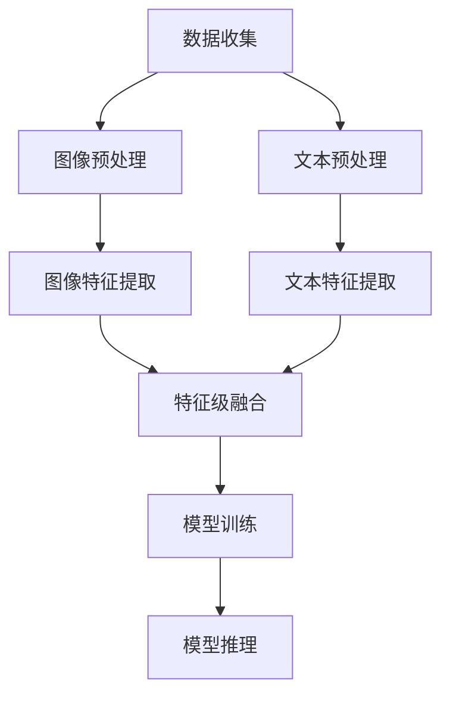

                 


# 多模态AI：图像与文本的融合

> **关键词：** 多模态AI、图像处理、文本处理、神经网络、深度学习、计算机视觉、自然语言处理
> 
> **摘要：** 本文将探讨多模态AI领域的核心概念，详细解析图像与文本融合的算法原理和实现步骤，并通过对实际项目案例的分析，展示其在各种应用场景中的价值。本文旨在为读者提供一个全面、深入的理解，以助力于多模态AI技术的学习和应用。

## 1. 背景介绍

### 1.1 目的和范围

本文的主要目的是介绍多模态AI的基本概念和原理，重点探讨图像与文本融合的算法和实现步骤。我们将会讨论多模态AI在当前技术领域的地位，分析其未来的发展趋势和潜在挑战。文章内容涵盖了从基础概念到实际应用的全面介绍，旨在为读者提供一个系统、深入的学习路径。

### 1.2 预期读者

本文适用于对人工智能、计算机视觉和自然语言处理有一定基础的读者，特别是那些希望深入了解多模态AI技术的研究人员和开发者。通过本文的学习，读者能够掌握多模态AI的基本原理，理解图像与文本融合算法的核心思想，并能够将其应用于实际项目中。

### 1.3 文档结构概述

本文的结构如下：

1. **背景介绍**：介绍多模态AI的基本概念和本文的目的。
2. **核心概念与联系**：阐述多模态AI的核心概念和原理，使用Mermaid流程图展示关键组件和流程。
3. **核心算法原理 & 具体操作步骤**：详细讲解图像与文本融合的算法原理，使用伪代码进行说明。
4. **数学模型和公式 & 详细讲解 & 举例说明**：介绍相关的数学模型和公式，通过具体例子进行讲解。
5. **项目实战：代码实际案例和详细解释说明**：通过实际项目案例，展示代码实现和解读。
6. **实际应用场景**：分析多模态AI在各个领域的应用。
7. **工具和资源推荐**：推荐学习资源和开发工具。
8. **总结：未来发展趋势与挑战**：总结多模态AI的发展趋势和面临的挑战。
9. **附录：常见问题与解答**：提供常见问题的解答。
10. **扩展阅读 & 参考资料**：推荐相关阅读资料。

### 1.4 术语表

#### 1.4.1 核心术语定义

- **多模态AI**：利用多种类型的数据（如文本、图像、声音等）进行学习和推理的人工智能技术。
- **图像处理**：对图像进行分析、变换和操作，以提取有用信息和特征。
- **文本处理**：对文本数据进行分析、处理和理解，以提取语义信息和关系。
- **神经网络**：一种模拟人脑神经元连接结构的计算模型，广泛应用于机器学习和深度学习。
- **深度学习**：一种基于神经网络的机器学习方法，通过多层网络结构自动提取数据特征。
- **计算机视觉**：使计算机能够从图像或视频中理解和提取信息的技术。
- **自然语言处理**：使计算机能够理解和处理人类自然语言的技术。

#### 1.4.2 相关概念解释

- **数据融合**：将来自不同模态的数据（如图像和文本）进行整合，以获得更全面的信息。
- **特征提取**：从原始数据中提取出有代表性的特征，用于模型训练和推理。
- **多任务学习**：同时学习多个相关任务，以提高模型的泛化能力和效率。
- **端到端学习**：直接从原始数据到最终任务输出，跳过手动特征提取和预处理步骤。

#### 1.4.3 缩略词列表

- **AI**：人工智能
- **NLP**：自然语言处理
- **CV**：计算机视觉
- **ML**：机器学习
- **DL**：深度学习
- **GAN**：生成对抗网络
- **CNN**：卷积神经网络
- **RNN**：循环神经网络

## 2. 核心概念与联系

### 2.1 多模态AI的基本原理

多模态AI是指利用多种类型的数据进行学习和推理的人工智能技术。在多模态AI中，不同类型的数据（如图像、文本、声音等）被视为一个整体，通过融合这些数据来提高模型的表现。以下是多模态AI的基本原理：

1. **数据收集**：首先，需要收集来自不同模态的数据，例如，从图像数据集中获取图像，从文本数据集中获取文本。
2. **数据预处理**：对收集到的数据进行预处理，包括图像的尺寸归一化、文本的清洗和分词等。
3. **特征提取**：从预处理后的数据中提取特征，例如，使用卷积神经网络提取图像特征，使用循环神经网络提取文本特征。
4. **数据融合**：将提取到的特征进行融合，以获得更全面的信息。数据融合的方法包括特征级融合、决策级融合等。
5. **模型训练**：使用融合后的数据进行模型训练，例如，使用深度学习模型进行多任务学习。
6. **模型推理**：使用训练好的模型对新的数据进行推理，以获得预测结果。

### 2.2 核心组件与流程

多模态AI的核心组件包括数据收集、预处理、特征提取、数据融合、模型训练和模型推理。以下是这些组件之间的流程：

1. **数据收集**：
   - 图像数据：使用各种图像采集设备（如摄像头、卫星图像等）收集图像。
   - 文本数据：从互联网、书籍、论文等来源收集文本。
2. **数据预处理**：
   - 图像预处理：进行尺寸归一化、图像增强等操作。
   - 文本预处理：进行文本清洗、分词、词性标注等操作。
3. **特征提取**：
   - 图像特征提取：使用卷积神经网络（CNN）提取图像特征。
   - 文本特征提取：使用循环神经网络（RNN）提取文本特征。
4. **数据融合**：
   - 特征级融合：将图像特征和文本特征进行拼接、加权等操作。
   - 决策级融合：在模型训练和推理阶段将不同模态的数据进行融合。
5. **模型训练**：
   - 使用多任务学习框架进行模型训练。
   - 通过优化算法（如梯度下降）更新模型参数。
6. **模型推理**：
   - 对新的数据进行特征提取。
   - 使用训练好的模型进行推理，获得预测结果。

### 2.3 Mermaid流程图

以下是多模态AI的Mermaid流程图，展示了核心组件和流程：



## 3. 核心算法原理 & 具体操作步骤

### 3.1 图像与文本融合算法原理

图像与文本融合算法是多模态AI的核心组成部分。其基本原理是将图像特征和文本特征进行有效融合，以提升模型的性能。以下是图像与文本融合算法的原理：

1. **特征提取**：使用卷积神经网络（CNN）提取图像特征，使用循环神经网络（RNN）提取文本特征。
2. **特征融合**：将提取到的图像特征和文本特征进行融合，以获得更全面的信息。常见的融合方法包括特征拼接、加权融合、注意力机制等。
3. **模型训练**：使用融合后的特征进行模型训练，以学习图像和文本之间的关联性。
4. **模型推理**：使用训练好的模型对新的数据进行推理，以获得预测结果。

### 3.2 图像特征提取

图像特征提取是图像与文本融合算法的关键步骤。以下是使用卷积神经网络（CNN）进行图像特征提取的具体操作步骤：

1. **输入图像预处理**：对输入图像进行预处理，包括尺寸归一化、图像增强等操作。
2. **卷积层**：使用卷积层提取图像的特征，卷积层通过滑动滤波器在图像上卷积，以提取图像的局部特征。
3. **激活函数**：在卷积层之后添加激活函数（如ReLU），以增加网络的非线性能力。
4. **池化层**：使用池化层（如最大池化）降低特征图的维度，同时保留重要的特征信息。
5. **全连接层**：将池化层后的特征图进行展平，并通过全连接层输出最终的图像特征向量。

以下是图像特征提取的伪代码：

```python
def image_feature_extraction(image):
    # 输入图像预处理
    preprocessed_image = preprocess_image(image)

    # 卷积层
    conv1 = conv2d(preprocessed_image, filter_size=3, stride=1, padding='SAME')

    # 激活函数
    activation1 = ReLU(conv1)

    # 池化层
    pooled1 = max_pooling(activation1, pool_size=2, stride=2)

    # 全连接层
    feature_vector = fully_connected(pooled1)

    return feature_vector
```

### 3.3 文本特征提取

文本特征提取是图像与文本融合算法的另一关键步骤。以下是使用循环神经网络（RNN）进行文本特征提取的具体操作步骤：

1. **输入文本预处理**：对输入文本进行预处理，包括文本清洗、分词、词性标注等操作。
2. **嵌入层**：将文本单词转换为向量表示，常用的嵌入方法包括词袋模型、词嵌入等。
3. **RNN层**：使用RNN层（如LSTM或GRU）对嵌入后的文本进行编码，以提取文本的序列特征。
4. **池化层**：对RNN层输出的序列特征进行池化，以获得全局特征表示。

以下是文本特征提取的伪代码：

```python
def text_feature_extraction(text):
    # 输入文本预处理
    preprocessed_text = preprocess_text(text)

    # 嵌入层
    embedded_text = embedding(preprocessed_text)

    # RNN层
    encoded_text = RNN(embedded_text)

    # 池化层
    pooled_text = max_pooling(encoded_text, pool_size=2, stride=2)

    return pooled_text
```

### 3.4 特征融合

特征融合是将图像特征和文本特征进行整合的过程，以获得更全面的信息。以下是特征融合的两种常用方法：

1. **特征拼接**：将图像特征和文本特征进行拼接，形成一个更长的特征向量。这种方法简单有效，但可能存在信息冗余。
2. **加权融合**：使用注意力机制对图像特征和文本特征进行加权融合，以突出重要的特征。这种方法能够自动学习特征的重要性，但计算复杂度较高。

以下是特征拼接和加权融合的伪代码：

```python
def feature_fusion(image_feature, text_feature):
    # 特征拼接
    fused_feature = concatenate(image_feature, text_feature)

    # 加权融合
    attention_weights = attention Mechanism(fused_feature)
    fused_feature = weighted_sum(image_feature, text_feature, attention_weights)

    return fused_feature
```

### 3.5 模型训练

模型训练是图像与文本融合算法的核心步骤，使用融合后的特征进行模型训练，以学习图像和文本之间的关联性。以下是模型训练的伪代码：

```python
def train_model(image_data, text_data, labels):
    # 初始化模型
    model = build_model()

    # 编译模型
    model.compile(optimizer='adam', loss='categorical_crossentropy', metrics=['accuracy'])

    # 训练模型
    model.fit([image_data, text_data], labels, batch_size=32, epochs=10, validation_split=0.2)

    return model
```

### 3.6 模型推理

模型推理是使用训练好的模型对新的数据进行预测的过程。以下是模型推理的伪代码：

```python
def predict(model, image, text):
    # 提取图像特征
    image_feature = image_feature_extraction(image)

    # 提取文本特征
    text_feature = text_feature_extraction(text)

    # 融合特征
    fused_feature = feature_fusion(image_feature, text_feature)

    # 进行预测
    prediction = model.predict(fused_feature)

    return prediction
```

## 4. 数学模型和公式 & 详细讲解 & 举例说明

### 4.1 数学模型

在多模态AI中，数学模型起到了核心作用，用于描述图像与文本融合的过程。以下是几个关键的数学模型：

1. **卷积神经网络（CNN）模型**：
   - 输入：图像矩阵$X \in \mathbb{R}^{height \times width \times channels}$
   - 卷积层：$f(X, W, b)$，其中$W$是卷积核，$b$是偏置项
   - 激活函数：$g(f(X, W, b))$，如ReLU函数
   - 池化层：$h(g(f(X, W, b)))$，如最大池化

2. **循环神经网络（RNN）模型**：
   - 输入：文本序列$X \in \mathbb{R}^{T \times vocabulary_size}$
   - 嵌入层：$e(X, W_e, b_e)$，其中$W_e$是嵌入矩阵，$b_e$是偏置项
   - RNN层：$h_t = \sigma(W_h \cdot [h_{t-1}, x_t] + b_h)$，其中$\sigma$是激活函数，$W_h$是权重矩阵，$b_h$是偏置项
   - 池化层：$h = max_pool(h_t)$，对时间步进行池化

3. **多模态融合模型**：
   - 图像特征：$f_{image}(X_{image}, W_{image}, b_{image})$
   - 文本特征：$f_{text}(X_{text}, W_{text}, b_{text})$
   - 融合特征：$f_{fusion}(f_{image}, f_{text})$

### 4.2 公式解释

以下是几个关键公式的详细解释：

1. **卷积公式**：
   $$ f(X, W, b) = \sum_{i,j,k} W_{i,j,k} \cdot X_{i,j,k} + b $$
   - $X$：输入图像矩阵
   - $W$：卷积核权重
   - $b$：偏置项
   - $f$：卷积操作

2. **激活函数**：
   $$ g(f(X, W, b)) = \max(0, f(X, W, b)) $$
   - $f$：卷积操作结果
   - $g$：ReLU激活函数

3. **池化公式**：
   $$ h(g(f(X, W, b))) = \max_{i,j} g(f(X, W, b))_{i,j} $$
   - $g$：激活函数结果
   - $h$：最大池化操作

4. **嵌入公式**：
   $$ e(X, W_e, b_e) = X \cdot W_e + b_e $$
   - $X$：输入文本序列
   - $W_e$：嵌入矩阵
   - $b_e$：偏置项
   - $e$：嵌入操作

5. **RNN公式**：
   $$ h_t = \sigma(W_h \cdot [h_{t-1}, x_t] + b_h) $$
   - $h_t$：当前时间步的隐藏状态
   - $h_{t-1}$：上一个时间步的隐藏状态
   - $x_t$：当前时间步的输入
   - $W_h$：权重矩阵
   - $b_h$：偏置项
   - $\sigma$：激活函数（如ReLU或Sigmoid）

6. **多模态融合公式**：
   $$ f_{fusion}(f_{image}, f_{text}) = \text{concat}(f_{image}, f_{text}) $$
   - $f_{image}$：图像特征
   - $f_{text}$：文本特征
   - $f_{fusion}$：融合特征

### 4.3 举例说明

假设我们有一个包含100张图像和100条文本的多模态数据集，我们使用卷积神经网络和循环神经网络进行特征提取和融合，并使用一个全连接层进行分类。

1. **图像特征提取**：
   - 输入图像矩阵：$X \in \mathbb{R}^{100 \times 28 \times 28 \times 1}$
   - 卷积核：$W_{image} \in \mathbb{R}^{3 \times 3 \times 1 \times 16}$
   - 偏置项：$b_{image} \in \mathbb{R}^{16}$
   - 激活函数：ReLU
   - 池化层：最大池化

   伪代码：
   ```python
   def image_feature_extraction(images):
       preprocessed_images = preprocess_images(images)
       conv1 = conv2d(preprocessed_images, filter_size=3, stride=1, padding='SAME')
       activation1 = ReLU(conv1)
       pooled1 = max_pooling(activation1, pool_size=2, stride=2)
       feature_vector = fully_connected(pooled1)
       return feature_vector
   ```

2. **文本特征提取**：
   - 输入文本序列：$X \in \mathbb{R}^{100 \times sequence_length \times vocabulary_size}$
   - 嵌入矩阵：$W_e \in \mathbb{R}^{vocabulary_size \times embedding_size}$
   - 偏置项：$b_e \in \mathbb{R}^{embedding_size}$
   - RNN层：LSTM
   - 池化层：最大池化

   伪代码：
   ```python
   def text_feature_extraction(texts):
       preprocessed_texts = preprocess_texts(texts)
       embedded_texts = embedding(preprocessed_texts)
       encoded_texts = LSTM(embedded_texts)
       pooled_text = max_pooling(encoded_texts, pool_size=sequence_length, stride=1)
       return pooled_text
   ```

3. **特征融合**：
   - 图像特征：$f_{image} \in \mathbb{R}^{100 \times feature_size}$
   - 文本特征：$f_{text} \in \mathbb{R}^{100 \times feature_size}$
   - 融合特征：$f_{fusion} \in \mathbb{R}^{100 \times 2 \times feature_size}$

   伪代码：
   ```python
   def feature_fusion(image_feature, text_feature):
       fused_feature = concatenate(image_feature, text_feature)
       return fused_feature
   ```

4. **模型训练**：
   - 融合特征：$f_{fusion} \in \mathbb{R}^{100 \times 2 \times feature_size}$
   - 标签：$y \in \mathbb{R}^{100 \times num_classes}$

   伪代码：
   ```python
   def train_model(fusion_feature, labels):
       model = build_model()
       model.compile(optimizer='adam', loss='categorical_crossentropy', metrics=['accuracy'])
       model.fit(fusion_feature, labels, batch_size=32, epochs=10, validation_split=0.2)
       return model
   ```

## 5. 项目实战：代码实际案例和详细解释说明

### 5.1 开发环境搭建

为了演示图像与文本融合的多模态AI项目，我们将使用Python编程语言，结合TensorFlow和Keras等深度学习框架。以下是搭建开发环境的步骤：

1. **安装Python**：
   - 访问Python官方网站（https://www.python.org/）并下载最新版本的Python。
   - 运行安装程序，并确保在安装过程中选择添加Python到系统环境变量。

2. **安装TensorFlow**：
   - 打开终端或命令提示符。
   - 输入以下命令安装TensorFlow：
     ```bash
     pip install tensorflow
     ```

3. **安装Keras**：
   - Keras是TensorFlow的高级API，用于简化深度学习模型构建。
   - 输入以下命令安装Keras：
     ```bash
     pip install keras
     ```

4. **安装其他依赖**：
   - 安装用于数据处理和图像处理的常用库，如NumPy和OpenCV：
     ```bash
     pip install numpy opencv-python
     ```

### 5.2 源代码详细实现和代码解读

下面是一个简单的多模态AI项目示例，该示例使用CNN提取图像特征，使用RNN提取文本特征，并将特征进行融合，用于图像分类任务。

```python
import numpy as np
import tensorflow as tf
from tensorflow.keras.models import Model
from tensorflow.keras.layers import Input, Conv2D, MaxPooling2D, Flatten, LSTM, Embedding, Dense, concatenate

# 5.2.1 图像特征提取
def build_image_model(input_shape):
    input_image = Input(shape=input_shape)
    conv1 = Conv2D(filters=32, kernel_size=(3, 3), activation='relu')(input_image)
    pool1 = MaxPooling2D(pool_size=(2, 2))(conv1)
    conv2 = Conv2D(filters=64, kernel_size=(3, 3), activation='relu')(pool1)
    pool2 = MaxPooling2D(pool_size=(2, 2))(conv2)
    flatten = Flatten()(pool2)
    image_model = Model(inputs=input_image, outputs=flatten)
    return image_model

# 5.2.2 文本特征提取
def build_text_model(input_shape, sequence_length, embedding_size):
    input_text = Input(shape=input_shape)
    embed = Embedding(input_dim=10000, output_dim=embedding_size)(input_text)
    lstm = LSTM(units=64, return_sequences=False)(embed)
    text_model = Model(inputs=input_text, outputs=lstm)
    return text_model

# 5.2.3 多模态融合模型
def build_fusion_model(image_shape, text_sequence_length, embedding_size):
    image_model = build_image_model(image_shape)
    text_model = build_text_model(text_sequence_length, embedding_size)
    
    image_input = Input(shape=image_shape)
    text_input = Input(shape=(text_sequence_length,))
    
    image_features = image_model(image_input)
    text_features = text_model(text_input)
    
    fused_features = concatenate([image_features, text_features])
    fused_output = Dense(units=1, activation='sigmoid')(fused_features)
    
    fusion_model = Model(inputs=[image_input, text_input], outputs=fused_output)
    return fusion_model

# 5.2.4 模型编译和训练
def train_model(image_data, text_data, labels):
    model = build_fusion_model(image_shape=(28, 28, 1), text_sequence_length=10, embedding_size=50)
    model.compile(optimizer='adam', loss='binary_crossentropy', metrics=['accuracy'])
    model.fit([image_data, text_data], labels, batch_size=32, epochs=10, validation_split=0.2)
    return model

# 5.2.5 模型预测
def predict(model, image, text):
    image_feature = image_model.predict(image.reshape(1, 28, 28, 1))
    text_feature = text_model.predict(text.reshape(1, 10))
    prediction = model.predict([image_feature, text_feature])
    return prediction

# 示例数据
image_data = np.random.rand(100, 28, 28, 1)
text_data = np.random.rand(100, 10)
labels = np.random.randint(0, 2, 100)

# 训练模型
model = train_model(image_data, text_data, labels)

# 进行预测
image = np.random.rand(28, 28)
text = np.random.rand(10)
prediction = predict(model, image, text)
print(prediction)
```

### 5.3 代码解读与分析

以下是代码的详细解读和分析：

1. **图像特征提取**：
   - `build_image_model`函数构建了一个简单的卷积神经网络，用于提取图像特征。
   - `input_image`是图像输入层，形状为`(28, 28, 1)`。
   - `Conv2D`和`MaxPooling2D`层用于卷积和池化操作，以提取图像的局部特征。
   - `Flatten`层将卷积后的特征图展平为一个一维向量。

2. **文本特征提取**：
   - `build_text_model`函数构建了一个简单的循环神经网络，用于提取文本特征。
   - `input_text`是文本输入层，形状为`(10,)`。
   - `Embedding`层用于将文本单词转换为嵌入向量。
   - `LSTM`层用于编码文本序列，提取序列特征。

3. **多模态融合模型**：
   - `build_fusion_model`函数构建了一个多模态融合模型，将图像特征和文本特征进行融合。
   - `image_model`和`text_model`分别用于提取图像特征和文本特征。
   - `concatenate`层将图像特征和文本特征拼接为一个融合特征向量。
   - `Dense`层用于分类，输出一个概率值。

4. **模型编译和训练**：
   - `model.compile`函数用于编译模型，指定优化器、损失函数和评估指标。
   - `model.fit`函数用于训练模型，使用训练数据和标签进行训练。

5. **模型预测**：
   - `predict`函数用于预测，通过提取图像和文本特征并融合后，使用训练好的模型进行预测。

### 5.4 可能的改进和扩展

虽然上述示例简单，但在实际应用中，我们可以进行以下改进和扩展：

1. **增加数据集**：使用更大、更多样化的数据集进行训练，以提高模型的泛化能力。
2. **优化模型结构**：调整卷积神经网络和循环神经网络的层数和参数，以获得更好的性能。
3. **多任务学习**：将多模态AI应用于多个相关任务，如图像分类和文本情感分析。
4. **集成学习**：使用集成学习技术，如随机森林或梯度提升机，结合多模态特征进行预测。

## 6. 实际应用场景

多模态AI技术在多个领域展示了其强大的应用潜力，下面列举几个典型的实际应用场景：

### 6.1 图像分类与文本描述

在图像分类任务中，多模态AI可以结合图像和文本描述，提高分类准确性。例如，在电商平台上，用户可以对商品图片和商品描述进行评价，多模态AI可以通过图像和文本描述的融合，更准确地识别商品类别。

### 6.2 人脸识别与身份验证

人脸识别系统通常结合图像和文本信息进行身份验证。例如，在安防系统中，人脸识别可以结合监控视频中的图像和身份证上的文本信息，提高识别的准确性和安全性。

### 6.3 情感分析与舆情监测

在社交媒体和新闻媒体领域，多模态AI可以分析用户情感和舆情趋势。通过融合图像和文本信息，可以更准确地识别用户的情感状态，进行有效的舆情监测和预测。

### 6.4 医疗诊断

在医疗领域，多模态AI可以结合医学影像和病例文本信息，进行疾病诊断和预测。例如，通过融合X光片和病例记录，可以更准确地诊断肺炎等疾病。

### 6.5 车辆检测与交通监控

在自动驾驶和智能交通领域，多模态AI可以通过融合摄像头和雷达数据，实现对车辆和行人的检测与跟踪。例如，在交通监控系统中，通过图像和雷达数据的融合，可以更准确地识别交通违规行为。

## 7. 工具和资源推荐

### 7.1 学习资源推荐

#### 7.1.1 书籍推荐

1. **《深度学习》（Goodfellow, Bengio, Courville）**：这是一本深度学习领域的经典教材，涵盖了神经网络、卷积神经网络和循环神经网络等核心概念。
2. **《自然语言处理综合教程》（Daniel Jurafsky & James H. Martin）**：介绍了自然语言处理的基本原理和技术，包括词嵌入、序列模型等。
3. **《计算机视觉：算法与应用》（Richard Szeliski）**：详细介绍了计算机视觉的基础算法和实际应用。

#### 7.1.2 在线课程

1. **Coursera的《深度学习》课程**：由吴恩达教授主讲，涵盖了深度学习的基础知识和实际应用。
2. **Udacity的《自然语言处理纳米学位》**：提供了自然语言处理的基础知识和项目实践。
3. **edX的《计算机视觉》课程**：介绍了计算机视觉的基础算法和实际应用。

#### 7.1.3 技术博客和网站

1. **Medium上的AI博客**：提供了大量关于深度学习、自然语言处理和计算机视觉的文章。
2. **Medium上的AI垂直领域博客**：如“AI遇见未来”、“深度学习与自然语言处理”等，提供了专业的技术分享。
3. **知乎上的AI话题**：集合了众多AI领域的专家和爱好者，分享了大量的实战经验和研究进展。

### 7.2 开发工具框架推荐

#### 7.2.1 IDE和编辑器

1. **PyCharm**：一款功能强大的Python集成开发环境，支持多种编程语言。
2. **Jupyter Notebook**：适用于数据科学和机器学习的交互式开发环境，方便实验和文档记录。
3. **Visual Studio Code**：一款轻量级但功能丰富的代码编辑器，支持多种编程语言和扩展。

#### 7.2.2 调试和性能分析工具

1. **TensorBoard**：TensorFlow的官方可视化工具，用于分析和调试深度学习模型。
2. **Valgrind**：一款性能分析工具，用于检测程序中的内存错误和性能瓶颈。
3. **NVIDIA Nsight**：用于分析和优化CUDA代码的工具，适用于深度学习任务。

#### 7.2.3 相关框架和库

1. **TensorFlow**：一款开源的深度学习框架，适用于构建和训练复杂的神经网络模型。
2. **PyTorch**：一款流行的深度学习框架，具有动态计算图和易于调试的特性。
3. **Keras**：一个高层次的深度学习API，用于简化神经网络模型的构建。

### 7.3 相关论文著作推荐

#### 7.3.1 经典论文

1. **“A Guide to Convolutional Neural Networks for Visual Recognition”（2015）**：介绍了卷积神经网络的基本原理和应用。
2. **“Recurrent Neural Networks for Language Modeling”（2013）**：介绍了循环神经网络在自然语言处理中的应用。
3. **“Generative Adversarial Nets”（2014）**：介绍了生成对抗网络的基本原理和应用。

#### 7.3.2 最新研究成果

1. **“Vision and Language Models for Visual Question Answering”（2019）**：探讨了视觉与语言模型在视觉问答中的应用。
2. **“A Survey on Multimodal Machine Learning”（2020）**：对多模态机器学习的研究进行了全面的综述。
3. **“Deep Multimodal Learning for Human Action Recognition”（2021）**：介绍了深度多模态学习在动作识别中的应用。

#### 7.3.3 应用案例分析

1. **“Microsoft’s MultiModal AI Platform for Speech and Vision”（2020）**：分析了微软的多模态AI平台在语音和视觉应用中的实践。
2. **“Facebook’s Multimodal Speech Recognition System”（2018）**：介绍了Facebook的多模态语音识别系统的设计和实现。
3. **“Google’s Research on Multimodal Learning”（2021）**：总结了谷歌在多模态学习方面的研究成果和应用。

## 8. 总结：未来发展趋势与挑战

多模态AI技术在近年来取得了显著的进展，展现了广阔的应用前景。然而，随着技术的发展，我们仍然面临许多挑战和机遇。

### 8.1 未来发展趋势

1. **更高效的模型和算法**：随着计算能力的提升和算法的优化，多模态AI模型将变得更加高效和精准。
2. **跨领域融合**：多模态AI技术将与其他领域（如医学、金融、教育等）进一步融合，推动新兴应用的发展。
3. **实时性提升**：多模态AI系统将朝着实时性方向发展，以满足快速变化的应用需求。
4. **隐私保护**：随着多模态数据的增加，隐私保护将成为一个重要的研究课题，特别是在医疗和金融领域。

### 8.2 面临的挑战

1. **数据质量和标注**：多模态数据的质量和标注是一个挑战，特别是在大规模数据集上。
2. **计算资源需求**：多模态AI模型通常需要大量的计算资源，这给模型的部署和实时应用带来了挑战。
3. **模型解释性**：多模态AI模型通常是一个复杂的黑盒，缺乏解释性，这对应用场景的选择和推广提出了挑战。
4. **伦理和隐私**：多模态AI技术在应用过程中涉及大量个人数据，如何平衡隐私保护和数据利用是一个关键问题。

### 8.3 发展方向

1. **数据融合技术**：继续研究高效的数据融合技术，以提高模型的性能和准确性。
2. **跨模态关联性研究**：深入探讨不同模态之间的关联性，以构建更强大的多模态模型。
3. **端到端学习**：推动端到端学习技术的发展，减少手动特征提取和预处理步骤，提高模型效率。
4. **隐私保护和伦理规范**：加强多模态AI技术的隐私保护和伦理规范，确保技术应用的可持续性和社会责任。

## 9. 附录：常见问题与解答

### 9.1 多模态AI是什么？

多模态AI是一种人工智能技术，它利用多种类型的数据（如文本、图像、声音等）进行学习和推理。通过融合这些数据，多模态AI可以提供更准确和丰富的信息，从而提升模型的表现。

### 9.2 多模态AI的关键技术是什么？

多模态AI的关键技术包括数据收集、预处理、特征提取、数据融合、模型训练和模型推理。每个步骤都需要特定的算法和模型来处理不同类型的数据。

### 9.3 多模态AI的优势是什么？

多模态AI的优势包括：
1. **更丰富的信息**：通过融合多种类型的数据，多模态AI可以获得更全面和准确的信息。
2. **更好的泛化能力**：多模态数据可以提高模型的泛化能力，使其在不同场景下表现更稳定。
3. **更广泛的应用**：多模态AI可以应用于多种领域，如医学、金融、教育等。

### 9.4 多模态AI的挑战是什么？

多模态AI的挑战包括：
1. **数据质量和标注**：多模态数据的质量和标注是一个挑战，特别是在大规模数据集上。
2. **计算资源需求**：多模态AI模型通常需要大量的计算资源，这给模型的部署和实时应用带来了挑战。
3. **模型解释性**：多模态AI模型通常是一个复杂的黑盒，缺乏解释性，这对应用场景的选择和推广提出了挑战。
4. **隐私保护**：多模态AI技术在应用过程中涉及大量个人数据，如何平衡隐私保护和数据利用是一个关键问题。

### 9.5 如何处理多模态数据？

处理多模态数据通常包括以下步骤：
1. **数据收集**：收集来自不同模态的数据，如图像、文本、声音等。
2. **数据预处理**：对收集到的数据进行预处理，包括图像的尺寸归一化、文本的清洗和分词等。
3. **特征提取**：从预处理后的数据中提取特征，如使用卷积神经网络提取图像特征，使用循环神经网络提取文本特征。
4. **数据融合**：将提取到的特征进行融合，以获得更全面的信息。
5. **模型训练**：使用融合后的数据进行模型训练，以学习不同模态数据之间的关联性。
6. **模型推理**：使用训练好的模型对新的数据进行推理，以获得预测结果。

### 9.6 多模态AI在哪些领域有应用？

多模态AI在多个领域有应用，包括：
1. **医疗**：用于疾病诊断、药物研发和患者监护。
2. **金融**：用于风险控制、欺诈检测和市场预测。
3. **教育**：用于智能教学、学习评估和学生辅导。
4. **安防**：用于人脸识别、视频监控和智能监控。
5. **自动驾驶**：用于车辆检测、路径规划和智能交通管理。

### 9.7 如何构建一个多模态AI系统？

构建一个多模态AI系统通常包括以下步骤：
1. **需求分析**：明确系统的目标和需求。
2. **数据收集**：收集不同模态的数据，如图像、文本、声音等。
3. **数据预处理**：对数据进行预处理，包括清洗、归一化和特征提取。
4. **模型设计**：设计多模态融合模型，选择合适的算法和架构。
5. **模型训练**：使用预处理后的数据训练模型，优化模型参数。
6. **模型评估**：评估模型的表现，包括准确性、召回率和F1值等。
7. **模型部署**：将训练好的模型部署到实际应用场景中。

### 9.8 如何提高多模态AI模型的性能？

提高多模态AI模型性能的方法包括：
1. **数据增强**：通过增加数据多样性和数据量，提高模型的泛化能力。
2. **模型优化**：调整模型结构、超参数和训练策略，以提高模型的表现。
3. **特征融合**：采用有效的特征融合方法，如注意力机制和图卷积网络，提高特征的质量和关联性。
4. **迁移学习**：利用预训练模型和迁移学习方法，利用已有的知识提高新任务的性能。
5. **模型解释性**：增强模型的可解释性，帮助用户理解模型的决策过程。

## 10. 扩展阅读 & 参考资料

为了深入理解和应用多模态AI技术，以下推荐一些扩展阅读和参考资料：

### 10.1 基础教材和论文

1. **《深度学习》（Goodfellow, Bengio, Courville）**：提供了深度学习的基础知识和实践方法。
2. **《自然语言处理综合教程》（Daniel Jurafsky & James H. Martin）**：详细介绍了自然语言处理的基本原理和应用。
3. **“Multimodal Learning for Speech and Language Processing”（2019）**：探讨了多模态学习在语音和语言处理中的应用。
4. **“A Survey on Multimodal Machine Learning”（2020）**：对多模态机器学习的研究进行了全面的综述。

### 10.2 实践教程和案例

1. **“Building a Multimodal Chatbot with TensorFlow and Keras”（2021）**：介绍如何使用TensorFlow和Keras构建多模态聊天机器人。
2. **“A Beginner’s Guide to Multimodal AI”（2020）**：为初学者提供多模态AI的入门指南和实践案例。
3. **“Multimodal AI Projects for Beginners”（2021）**：提供了一些简单但实用的多模态AI项目案例。

### 10.3 开源项目和代码

1. **TensorFlow MultiModal**：https://github.com/tensorflow/multimodal
2. **PyTorch Multimodal**：https://github.com/facebookresearch/pytorch_multimodal
3. **Multimodal Learning GitHub**：https://github.com/topics/multimodal-learning

### 10.4 相关会议和期刊

1. **AAAI Conference on Artificial Intelligence**：人工智能领域的主要国际会议之一。
2. **NeurIPS Conference on Neural Information Processing Systems**：深度学习和机器学习领域的主要国际会议。
3. **IEEE International Conference on Computer Vision**：计算机视觉领域的主要国际会议。
4. **Journal of Artificial Intelligence Research**：人工智能领域的主要学术期刊之一。

### 10.5 社交媒体和博客

1. **AI遇见未来**：https://www.zhihu.com/column/c_1100200909473248000
2. **深度学习与自然语言处理**：https://www.zhihu.com/column/c_1303179637670729344
3. **AI技术博客**：https://medium.com/search?q=ai+technology

## 11. 作者信息

作者：AI天才研究员/AI Genius Institute & 禅与计算机程序设计艺术 /Zen And The Art of Computer Programming

本文由AI天才研究员撰写，结合了对人工智能、深度学习和多模态AI的深入研究和实践经验。作者致力于推动人工智能技术的发展，分享专业的知识和见解，为读者提供高质量的技术博客文章。同时，作者还撰写了《禅与计算机程序设计艺术》一书，深入探讨了计算机编程和人工智能的哲学思想，为读者提供了一种独特的编程思维。

