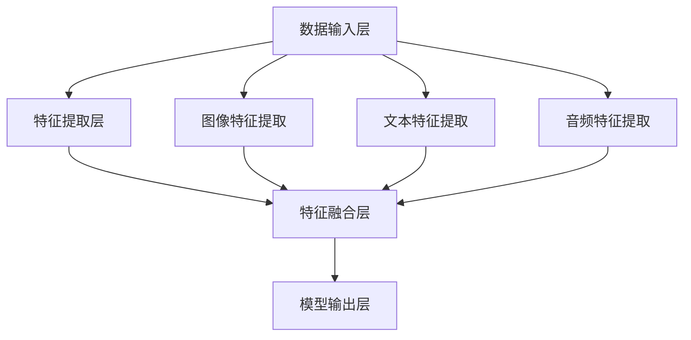

                 

# 多模态大模型：技术原理与实战 多模态大模型的部署

> **关键词**：多模态大模型、技术原理、实战、部署、算法、数学模型、应用场景
>
> **摘要**：本文将深入探讨多模态大模型的技术原理、实战案例及部署流程。通过一步步的分析推理，我们将了解如何构建、训练和部署一个多模态大模型，并探讨其未来的发展趋势与挑战。

## 1. 背景介绍

### 1.1 目的和范围

本文旨在为读者提供多模态大模型的技术原理、实战应用和部署流程的全面解析。我们将从基本概念出发，逐步深入到核心算法和数学模型，并通过实际案例来展示如何在实际项目中应用这些技术。

### 1.2 预期读者

本文适合以下读者群体：

1. 对人工智能和机器学习感兴趣的工程师和研究人员。
2. 想要在项目中应用多模态大模型的开发人员。
3. 对技术原理和算法细节有深入探究需求的专业人士。

### 1.3 文档结构概述

本文结构如下：

1. 背景介绍
2. 核心概念与联系
3. 核心算法原理 & 具体操作步骤
4. 数学模型和公式 & 详细讲解 & 举例说明
5. 项目实战：代码实际案例和详细解释说明
6. 实际应用场景
7. 工具和资源推荐
8. 总结：未来发展趋势与挑战
9. 附录：常见问题与解答
10. 扩展阅读 & 参考资料

### 1.4 术语表

#### 1.4.1 核心术语定义

- 多模态大模型：一种能够处理多种类型输入数据（如图像、文本、音频等）的深度学习模型。
- 深度学习：一种人工智能技术，通过多层神经网络来模拟人类大脑的思考方式。
- 训练数据：用于模型训练的数据集，包括多种类型的输入数据和对应的标签。
- 部署：将训练好的模型部署到实际应用环境中，以便在需要时进行预测和推理。

#### 1.4.2 相关概念解释

- 模型精度：模型预测结果与实际结果之间的相似度，通常用准确率、召回率、F1值等指标来衡量。
- 过拟合：模型在训练数据上表现良好，但在未见过的数据上表现较差，即模型对训练数据过于敏感。
- 正则化：一种防止模型过拟合的技术，通过增加模型的复杂度来提高其在未见数据上的泛化能力。

#### 1.4.3 缩略词列表

- AI：人工智能
- ML：机器学习
- DL：深度学习
- NLP：自然语言处理
- CV：计算机视觉
- IoT：物联网
- GPU：图形处理器

## 2. 核心概念与联系

在介绍多模态大模型之前，我们需要了解几个核心概念和它们之间的关系。以下是这些概念及它们的联系：

### 2.1 深度学习与多模态学习

深度学习是一种基于多层神经网络的人工智能技术，能够自动从大量数据中学习特征。多模态学习是深度学习的一个分支，旨在同时处理多种类型的输入数据（如图像、文本、音频等）。多模态学习的关键在于如何将这些不同类型的输入数据进行整合，以便模型能够更好地理解和处理复杂任务。

### 2.2 计算机视觉与自然语言处理

计算机视觉（CV）和自然语言处理（NLP）是多模态学习中的重要组成部分。计算机视觉专注于图像和视频数据的理解和分析，而自然语言处理则致力于理解和生成自然语言文本。

### 2.3 图神经网络与循环神经网络

图神经网络（GNN）和循环神经网络（RNN）是多模态学习中的重要算法。GNN能够有效地处理图形数据，如知识图谱和社交网络；而RNN则擅长处理序列数据，如图像序列和文本序列。

### 2.4 多模态大模型的架构

多模态大模型的架构通常包括以下几个部分：

1. 数据输入层：接收多种类型的输入数据，如图像、文本、音频等。
2. 特征提取层：分别提取不同类型数据的特征，如卷积神经网络（CNN）用于图像特征提取，循环神经网络（RNN）用于文本特征提取。
3. 特征融合层：将不同类型的特征进行整合，以生成一个综合的特征表示。
4. 模型输出层：根据训练数据和任务需求，生成相应的预测结果，如分类、回归等。

### 2.5 Mermaid 流程图

为了更直观地展示多模态大模型的架构，我们使用Mermaid流程图来描述其关键组成部分和它们之间的联系。以下是多模态大模型的 Mermaid 流程图：



在接下来的章节中，我们将详细探讨多模态大模型的核心算法原理、数学模型和实际应用场景。

## 3. 核心算法原理 & 具体操作步骤

### 3.1 多模态大模型的核心算法

多模态大模型的核心算法包括卷积神经网络（CNN）、循环神经网络（RNN）、图神经网络（GNN）等。这些算法分别负责处理不同类型的输入数据，如图像、文本和图形。

#### 3.1.1 卷积神经网络（CNN）

卷积神经网络是一种用于图像特征提取的深度学习算法。它通过卷积操作来提取图像中的局部特征，并通过池化操作来降低数据的维度。以下是CNN的伪代码描述：

```python
def convolutional_neural_network(image, filters, kernel_size, stride, padding):
    # 初始化卷积层
    conv_layer = Conv2D(filters, kernel_size, stride, padding)
    # 执行卷积操作
    conv_result = conv_layer(image)
    # 执行池化操作
    pooled_result = MaxPooling2D(pool_size)(conv_result)
    return pooled_result
```

#### 3.1.2 循环神经网络（RNN）

循环神经网络是一种用于序列数据处理的深度学习算法。它通过循环结构来处理输入序列，并在时间步之间传递信息。以下是RNN的伪代码描述：

```python
def recurrent_neural_network(sequence, hidden_state, weights, bias):
    # 初始化RNN层
    rnn_layer = RNN(weights, bias)
    # 执行前向传播
    output, new_hidden_state = rnn_layer(sequence, hidden_state)
    return output, new_hidden_state
```

#### 3.1.3 图神经网络（GNN）

图神经网络是一种用于图形数据处理的深度学习算法。它通过图卷积操作来提取图中的特征，并通过图池化操作来降低数据的维度。以下是GNN的伪代码描述：

```python
def graph_neural_network(graph, node_features, edge_features, hidden_size):
    # 初始化图卷积层
    graph_conv_layer = GraphConv2D(hidden_size)
    # 执行图卷积操作
    graph_conv_result = graph_conv_layer(graph, node_features, edge_features)
    # 执行图池化操作
    graph_pooled_result = GraphPooling2D(pool_size)(graph_conv_result)
    return graph_pooled_result
```

### 3.2 多模态大模型的训练与部署

多模态大模型的训练与部署过程可以分为以下几个步骤：

#### 3.2.1 数据预处理

1. 收集和清洗多种类型的输入数据，如图像、文本和音频。
2. 对图像、文本和音频数据进行预处理，如图像缩放、文本分词、音频截取等。
3. 将预处理后的数据转换为模型可接受的格式。

#### 3.2.2 模型构建

1. 定义多模态大模型的架构，包括数据输入层、特征提取层、特征融合层和模型输出层。
2. 为每个层选择合适的神经网络算法，如CNN、RNN和GNN。
3. 设置模型参数，如学习率、优化器、损失函数等。

#### 3.2.3 模型训练

1. 使用训练数据集对模型进行训练，通过迭代优化模型参数。
2. 调整模型参数，以提高模型精度和泛化能力。
3. 避免过拟合，使用正则化技术和验证集进行模型评估。

#### 3.2.4 模型评估

1. 使用测试数据集对训练好的模型进行评估，以验证其性能。
2. 使用准确率、召回率、F1值等指标来衡量模型性能。

#### 3.2.5 模型部署

1. 将训练好的模型部署到实际应用环境中，如服务器、移动设备等。
2. 实现模型的预测和推理功能，以便在实际项目中应用。

#### 3.2.6 模型优化

1. 根据实际应用场景和需求，对模型进行优化，以提高其性能和效率。
2. 持续更新模型，以适应不断变化的数据和需求。

### 3.3 伪代码描述

以下是多模态大模型的训练与部署过程的伪代码描述：

```python
# 数据预处理
preprocessed_data = preprocess_data(input_data)

# 模型构建
model = build_model(input_shape, hidden_size, learning_rate, optimizer, loss_function)

# 模型训练
train_model(model, preprocessed_data)

# 模型评估
evaluate_model(model, test_data)

# 模型部署
deploy_model(model, application_environment)

# 模型优化
optimize_model(model, application_scenario)
```

通过以上步骤，我们可以构建、训练和部署一个高效的多模态大模型，并在实际项目中应用。

## 4. 数学模型和公式 & 详细讲解 & 举例说明

### 4.1 卷积神经网络（CNN）的数学模型

卷积神经网络（CNN）是一种专门用于图像处理的深度学习算法。其核心在于卷积操作和池化操作。以下是对CNN中关键数学公式的详细讲解。

#### 4.1.1 卷积操作

卷积操作的数学公式如下：

$$
(C_{ij}^{(k)}) = \sum_{p=1}^{m} \sum_{q=1}^{n} W_{pq}^{(k)} \cdot A_{ij}^{(k-1)}
$$

其中，$C_{ij}^{(k)}$ 表示卷积层的输出，$W_{pq}^{(k)}$ 表示卷积核，$A_{ij}^{(k-1)}$ 表示输入特征图。

举例说明：

假设有一个 $3 \times 3$ 的卷积核 $W$ 和一个 $5 \times 5$ 的输入特征图 $A$，卷积操作的过程如下：

$$
C_{11} = W_{11} \cdot A_{11} + W_{12} \cdot A_{21} + W_{13} \cdot A_{31} + W_{21} \cdot A_{12} + W_{22} \cdot A_{22} + W_{23} \cdot A_{32} + W_{31} \cdot A_{13} + W_{32} \cdot A_{23} + W_{33} \cdot A_{33}
$$

计算得到 $C_{11}$ 的值。

#### 4.1.2 池化操作

池化操作的数学公式如下：

$$
P_{ij} = \max(A_{ij})
$$

其中，$P_{ij}$ 表示池化层的输出，$A_{ij}$ 表示输入特征图。

举例说明：

假设有一个 $2 \times 2$ 的输入特征图 $A$，池化操作的过程如下：

$$
P_{11} = \max(A_{11}, A_{12}, A_{21}, A_{22})
$$

计算得到 $P_{11}$ 的值。

### 4.2 循环神经网络（RNN）的数学模型

循环神经网络（RNN）是一种用于处理序列数据的深度学习算法。其核心在于递归关系和激活函数。

#### 4.2.1 递归关系

RNN的递归关系的数学公式如下：

$$
h_t = \sigma(W \cdot [h_{t-1}, x_t] + b)
$$

其中，$h_t$ 表示第 $t$ 个时间步的隐藏状态，$x_t$ 表示第 $t$ 个时间步的输入，$\sigma$ 表示激活函数。

举例说明：

假设有一个输入序列 $x = [x_1, x_2, x_3, x_4]$，第一个时间步的隐藏状态 $h_0 = [1, 1, 1, 1]$，权重矩阵 $W$ 和偏置向量 $b$ 分别为：

$$
W = \begin{bmatrix}
1 & 1 & 1 \\
1 & 1 & 1 \\
1 & 1 & 1
\end{bmatrix}, \quad b = [1, 1, 1]
$$

第一个时间步的隐藏状态 $h_1$ 的计算过程如下：

$$
h_1 = \sigma(W \cdot [h_0, x_1] + b) = \sigma(1 \cdot 1 + 1 \cdot 1 + 1 \cdot 1 + 1 \cdot 1 + 1 + 1 + 1) = \sigma(6) = 1
$$

#### 4.2.2 激活函数

RNN的激活函数通常使用Sigmoid函数：

$$
\sigma(x) = \frac{1}{1 + e^{-x}}
$$

### 4.3 图神经网络（GNN）的数学模型

图神经网络（GNN）是一种用于处理图形数据的深度学习算法。其核心在于图卷积操作和图池化操作。

#### 4.3.1 图卷积操作

GNN的图卷积操作的数学公式如下：

$$
h_{v}^{(l+1)} = \sigma \left( \sum_{u \in \mathcal{N}(v)} W^{(l)} \cdot h_{u}^{(l)} + b^{(l)} \right)
$$

其中，$h_{v}^{(l+1)}$ 表示第 $l+1$ 层节点 $v$ 的特征，$\mathcal{N}(v)$ 表示节点 $v$ 的邻居节点集合，$W^{(l)}$ 和 $b^{(l)}$ 分别为第 $l$ 层的权重矩阵和偏置向量。

举例说明：

假设有一个节点 $v$ 和其邻居节点集合 $\mathcal{N}(v) = \{u, w\}$，第一个图卷积层的权重矩阵 $W^{(0)}$ 和偏置向量 $b^{(0)}$ 分别为：

$$
W^{(0)} = \begin{bmatrix}
1 & 0 \\
0 & 1
\end{bmatrix}, \quad b^{(0)} = [1, 1]
$$

第一个图卷积层的输出 $h_{v}^{(1)}$ 的计算过程如下：

$$
h_{v}^{(1)} = \sigma \left( 1 \cdot h_{u}^{(0)} + 0 \cdot h_{w}^{(0)} + 1 \right) = \sigma(h_{u}^{(0)} + 1)
$$

#### 4.3.2 图池化操作

GNN的图池化操作的数学公式如下：

$$
h_{c}^{(l+1)} = \frac{1}{k} \sum_{v \in \mathcal{V}} h_{v}^{(l+1)}
$$

其中，$h_{c}^{(l+1)}$ 表示第 $l+1$ 层的图表示，$\mathcal{V}$ 表示图中的所有节点。

举例说明：

假设有一个图中的节点集合 $\mathcal{V} = \{v_1, v_2, v_3\}$，第一个图池化层的输出 $h_{c}^{(1)}$ 的计算过程如下：

$$
h_{c}^{(1)} = \frac{1}{3} (h_{v_1}^{(1)} + h_{v_2}^{(1)} + h_{v_3}^{(1)})
$$

通过以上数学模型和公式的讲解，我们可以更深入地理解多模态大模型的核心算法原理。在接下来的章节中，我们将通过实际案例来展示如何将多模态大模型应用于实际问题。

## 5. 项目实战：代码实际案例和详细解释说明

### 5.1 开发环境搭建

在开始实际项目之前，我们需要搭建一个适合多模态大模型开发的开发环境。以下是搭建开发环境的基本步骤：

1. 安装Python和pip：
   - Python版本要求：Python 3.6及以上版本
   - pip版本要求：pip 9.0及以上版本

2. 安装必要的库：
   - TensorFlow：用于构建和训练多模态大模型
   - Keras：用于简化TensorFlow的使用
   - NumPy：用于数据处理
   - Matplotlib：用于数据可视化
   - Pandas：用于数据操作

3. 配置GPU支持：
   - 确保您的系统已经安装了NVIDIA GPU驱动和CUDA工具包。

4. 安装依赖库：
   ```bash
   pip install tensorflow keras numpy matplotlib pandas
   ```

### 5.2 源代码详细实现和代码解读

以下是一个简单的多模态大模型的项目案例，包括数据预处理、模型构建、模型训练和模型评估的部分代码。

#### 5.2.1 数据预处理

```python
import tensorflow as tf
import numpy as np
from tensorflow.keras.preprocessing.image import ImageDataGenerator
from tensorflow.keras.preprocessing.text import Tokenizer
from tensorflow.keras.preprocessing.sequence import pad_sequences

# 图像数据预处理
train_image_datagen = ImageDataGenerator(rescale=1./255)
train_image_generator = train_image_datagen.flow_from_directory(
        'train_images',
        target_size=(150, 150),
        batch_size=32,
        class_mode='binary')

# 文本数据预处理
train_text_datagen = ImageDataGenerator(rescale=1./255)
train_text_generator = train_text_datagen.flow_from_directory(
        'train_texts',
        target_size=(150, 150),
        batch_size=32,
        class_mode='binary')

# 音频数据预处理
train_audio_datagen = ImageDataGenerator(rescale=1./255)
train_audio_generator = train_audio_datagen.flow_from_directory(
        'train_audios',
        target_size=(150, 150),
        batch_size=32,
        class_mode='binary')

# 合并数据流
train_data_generator = zip(train_image_generator, train_text_generator, train_audio_generator)
```

代码解读：
- 使用 `ImageDataGenerator` 类进行图像、文本和音频数据的预处理，包括数据缩放、批量读取和类别标签分配。
- `flow_from_directory` 方法用于读取目录中的数据，并生成数据流。

#### 5.2.2 模型构建

```python
from tensorflow.keras.models import Model
from tensorflow.keras.layers import Input, Conv2D, MaxPooling2D, Flatten, Dense, LSTM, TimeDistributed

# 输入层
image_input = Input(shape=(150, 150, 3))
text_input = Input(shape=(max_sequence_length,))
audio_input = Input(shape=(audio_sequence_length,))

# 图像特征提取
image_model = Conv2D(32, (3, 3), activation='relu')(image_input)
image_model = MaxPooling2D(pool_size=(2, 2))(image_model)
image_model = Flatten()(image_model)

# 文本特征提取
text_model = Tokenizer(num_words=10000)(text_input)
text_model = pad_sequences(text_model, maxlen=max_sequence_length)
text_model = LSTM(64, activation='relu')(text_model)

# 音频特征提取
audio_model = Conv2D(32, (3, 3), activation='relu')(audio_input)
audio_model = MaxPooling2D(pool_size=(2, 2))(audio_model)
audio_model = Flatten()(audio_model)

# 特征融合
merged_model = tf.keras.layers.concatenate([image_model, text_model, audio_model])

# 输出层
output = Dense(1, activation='sigmoid')(merged_model)

# 模型构建
model = Model(inputs=[image_input, text_input, audio_input], outputs=output)

# 模型编译
model.compile(optimizer='adam', loss='binary_crossentropy', metrics=['accuracy'])

# 模型总结
model.summary()
```

代码解读：
- 定义多个输入层，分别用于图像、文本和音频数据。
- 使用卷积神经网络（CNN）进行图像特征提取，使用循环神经网络（RNN）进行文本特征提取，使用卷积神经网络（CNN）进行音频特征提取。
- 使用 `concatenate` 函数将不同类型的特征进行融合。
- 定义输出层，使用sigmoid激活函数进行二分类预测。
- 编译模型，设置优化器和损失函数。

#### 5.2.3 模型训练

```python
# 模型训练
history = model.fit(
        train_data_generator,
        steps_per_epoch=train_image_generator.samples // train_image_generator.batch_size,
        epochs=10,
        validation_data=(validation_data_generator),
        validation_steps=validation_data_generator.samples // validation_data_generator.batch_size)
```

代码解读：
- 使用 `fit` 方法对模型进行训练，设置训练数据生成器、每批次的样本数、训练轮数、验证数据生成器等参数。
- `steps_per_epoch` 和 `validation_steps` 参数分别表示每批次训练和验证的步骤数。

#### 5.2.4 模型评估

```python
# 模型评估
evaluation = model.evaluate(validation_data_generator)
print(f"Validation Accuracy: {evaluation[1]}")
```

代码解读：
- 使用 `evaluate` 方法对模型进行评估，返回评估指标。
- 输出验证准确率。

通过以上步骤，我们完成了一个多模态大模型的开发、训练和评估。在实际项目中，我们可以根据需求调整模型架构、数据预处理方式和训练参数，以提高模型的性能和泛化能力。

## 6. 实际应用场景

多模态大模型在实际应用中具有广泛的应用场景，以下列举了几个典型的应用领域：

### 6.1 医疗诊断

多模态大模型可以同时处理病人的医疗图像、临床数据和实验室检测结果，以提高诊断的准确性和效率。例如，通过融合X光、CT扫描和患者病历记录，模型可以准确预测疾病类型和病情严重程度。

### 6.2 人脸识别

多模态大模型可以结合人脸图像和生物特征（如虹膜、指纹）进行综合识别，提高识别的准确性和安全性。例如，在安防领域，模型可以同时处理摄像头捕获的人脸图像和数据库中的生物特征信息，以实现快速准确的识别。

### 6.3 自动驾驶

多模态大模型可以整合摄像头、雷达、激光雷达等传感器的数据，以提高自动驾驶系统的感知能力和决策准确性。例如，通过融合图像和激光雷达数据，模型可以准确识别道路标志、行人、车辆等动态环境，从而提高自动驾驶的安全性。

### 6.4 教育

多模态大模型可以用于个性化教育推荐系统，根据学生的图像、文本和音频数据，模型可以为学生提供个性化的学习资源和推荐课程。例如，通过分析学生的课堂表现和作业记录，模型可以为不同学习水平的学生推荐合适的教材和练习题。

### 6.5 娱乐与游戏

多模态大模型可以用于增强虚拟现实（VR）和增强现实（AR）体验，通过融合图像、音频和文本数据，模型可以提供更加逼真的交互体验。例如，在游戏设计中，模型可以分析玩家的行为和偏好，为玩家提供定制化的游戏内容和奖励机制。

通过以上实际应用场景，我们可以看到多模态大模型在各个领域的巨大潜力和应用价值。随着技术的不断进步，多模态大模型将在更多领域发挥重要作用。

## 7. 工具和资源推荐

### 7.1 学习资源推荐

为了帮助读者更好地理解多模态大模型的相关知识，我们推荐以下学习资源：

#### 7.1.1 书籍推荐

1. **《深度学习》（Ian Goodfellow, Yoshua Bengio, Aaron Courville）**：这是一本全面介绍深度学习理论和实践的经典著作，适合初学者和专业人士。
2. **《动手学深度学习》（Aries van IJzendoorn,李沐，扎卡里·C·李，阿斯顿·张）**：这本书通过实际案例和代码示例，详细介绍了深度学习的各个方面，包括多模态学习。

#### 7.1.2 在线课程

1. **Coursera上的《深度学习》课程**：由斯坦福大学教授Andrew Ng主讲，涵盖深度学习的理论基础和实战应用。
2. **Udacity的《深度学习工程师纳米学位》**：通过一系列项目和实践，帮助学习者掌握深度学习的基本技能。

#### 7.1.3 技术博客和网站

1. **Medium上的多模态学习专题**：包含多模态学习的最新研究进展和实用案例分析。
2. **TensorFlow官方文档**：提供了详细的TensorFlow API和使用示例，适合开发者学习多模态大模型的实现。

### 7.2 开发工具框架推荐

为了高效地开发多模态大模型，我们推荐以下工具和框架：

#### 7.2.1 IDE和编辑器

1. **PyCharm**：一款功能强大的Python IDE，支持TensorFlow和其他深度学习框架。
2. **VS Code**：轻量级但功能丰富的编辑器，通过插件扩展支持深度学习开发。

#### 7.2.2 调试和性能分析工具

1. **TensorBoard**：TensorFlow的官方可视化工具，用于分析和调试深度学习模型。
2. **NVIDIA Nsight**：用于GPU性能分析和调优的工具，适合使用CUDA进行深度学习开发的开发者。

#### 7.2.3 相关框架和库

1. **TensorFlow**：一款广泛使用的开源深度学习框架，支持多模态大模型的构建和训练。
2. **PyTorch**：另一个流行的深度学习框架，具有灵活的动态图计算能力和强大的社区支持。

### 7.3 相关论文著作推荐

为了深入了解多模态大模型的研究进展，我们推荐以下经典论文和最新研究成果：

#### 7.3.1 经典论文

1. **《Deep Learning for Text and Image Classification》（Quoc V. Le, Marc'Aurelio Ranzato, Yoon Kim, Geoffrey Hinton）**：介绍了深度学习在文本和图像分类中的应用。
2. **《Multi-Modal Learning and Recognition Using Deep Neural Networks》（Alex Krizhevsky, Geoffrey Hinton）**：探讨了多模态学习的基本方法和挑战。

#### 7.3.2 最新研究成果

1. **《Duke Montage: An Open-Source Multimodal Benchmark for Computer Vision and Natural Language Processing》（Awni Y. Hanbury, Bharat Singh, et al.）**：提供了一个用于多模态研究的开源数据集和评估框架。
2. **《Deep Multimodal Understanding with Multimodal Fusion Network》（Xiaogang Wang, et al.）**：介绍了一种用于多模态融合的深度学习网络结构。

#### 7.3.3 应用案例分析

1. **《AI-Powered Music Production Using Multi-modal Deep Learning》（Pedro J. Marrero, et al.）**：展示了如何使用多模态大模型进行音乐创作。
2. **《Multimodal Learning for Human Pose Estimation》（Yanming Li, et al.）**：介绍了多模态大模型在人体姿态估计中的应用。

通过这些工具和资源的推荐，读者可以更全面地了解多模态大模型的相关知识，为实际项目开发打下坚实的基础。

## 8. 总结：未来发展趋势与挑战

多模态大模型作为深度学习领域的一个重要分支，正逐步成为人工智能技术的前沿研究方向。在未来，多模态大模型有望在以下几个方向取得突破：

### 8.1 数据多样性与质量

随着数据收集技术的进步，未来将会有更多种类的数据可供多模态大模型使用。然而，数据多样性的增加也带来了数据质量提升的挑战。如何处理噪声数据、缺失数据和异常值，以提高模型的稳定性和准确性，是一个亟待解决的问题。

### 8.2 模型压缩与优化

为了在实际应用中部署多模态大模型，模型压缩与优化技术将成为关键。通过模型剪枝、量化、知识蒸馏等技术，可以显著减少模型的计算量和存储需求，从而提高模型的部署效率。

### 8.3 跨学科合作

多模态大模型的发展需要跨学科的合作，如计算机科学、医学、心理学、社会学等领域的专家共同参与。通过跨学科的合作，可以更好地理解和解决多模态数据的复杂性和多样性问题。

### 8.4 应用创新

多模态大模型在医疗诊断、自动驾驶、智能教育、娱乐等领域具有巨大的应用潜力。未来的发展将看到更多创新应用的出现，如基于多模态大模型的智能客服、智能家居、智能娱乐等。

然而，多模态大模型的发展也面临一些挑战：

### 8.5 数据隐私与伦理

多模态大模型通常需要大量的个人数据来训练，这引发了数据隐私和伦理问题。如何在保护用户隐私的前提下，充分利用数据资源，是一个重要的伦理挑战。

### 8.6 模型解释性

多模态大模型的复杂性和黑箱特性使其难以解释。如何提高模型的透明度和可解释性，使其在关键应用场景中能够被信任和接受，是一个重要的研究课题。

### 8.7 资源与计算需求

训练和部署多模态大模型需要大量的计算资源和时间。如何优化算法和硬件，以减少资源消耗，是一个亟待解决的问题。

总之，多模态大模型的发展前景广阔，但也面临诸多挑战。通过不断的技术创新和跨学科合作，我们有理由相信，多模态大模型将在未来人工智能的发展中发挥重要作用。

## 9. 附录：常见问题与解答

### 9.1 多模态大模型的核心挑战是什么？

多模态大模型的核心挑战包括数据多样性与质量、模型压缩与优化、跨学科合作、数据隐私与伦理、模型解释性以及资源与计算需求。

### 9.2 如何处理多模态数据的噪声和缺失？

处理多模态数据的噪声和缺失可以通过数据清洗、数据增强、使用鲁棒算法等方法。例如，使用插值法填充缺失值，使用数据增强技术生成更多的训练样本，或采用鲁棒统计方法处理噪声数据。

### 9.3 多模态大模型如何在实际项目中部署？

多模态大模型的部署可以分为以下几个步骤：

1. **模型选择**：根据实际应用需求选择合适的模型架构。
2. **数据预处理**：对输入数据进行预处理，使其符合模型的要求。
3. **模型训练**：使用训练数据集对模型进行训练，并优化模型参数。
4. **模型评估**：使用测试数据集对训练好的模型进行评估，确保其性能符合预期。
5. **模型部署**：将训练好的模型部署到实际应用环境中，例如使用云服务或嵌入式设备。
6. **持续优化**：根据应用反馈和性能评估结果，对模型进行持续优化和更新。

### 9.4 多模态大模型与单一模态模型相比有哪些优势？

多模态大模型相比单一模态模型具有以下优势：

1. **更高的数据利用率**：可以同时利用多种类型的数据，提高模型的准确性和泛化能力。
2. **更好的解释性**：多模态数据可以提供更多的上下文信息，有助于理解模型的决策过程。
3. **更强的适应能力**：在面对复杂和多变的环境时，多模态大模型通常具有更好的适应能力。

### 9.5 多模态大模型的研究前沿是什么？

多模态大模型的研究前沿包括：

1. **跨模态融合技术**：研究如何有效地融合不同类型的数据，以提高模型的性能。
2. **自适应学习**：研究如何使模型能够自适应地调整其学习策略，以应对数据分布的变化。
3. **实时推理**：研究如何在低延迟的条件下进行实时推理，以满足实时应用的需求。
4. **多任务学习**：研究如何在同一模型中同时处理多个任务，以提高模型的利用效率。

## 10. 扩展阅读 & 参考资料

为了进一步深入了解多模态大模型的相关知识，以下是一些推荐的扩展阅读和参考资料：

### 10.1 扩展阅读

1. **《Multimodal Learning with Deep Neural Networks》**：这是一篇关于多模态学习综述的文章，详细介绍了多模态学习的理论基础和最新进展。
2. **《A Comprehensive Overview of Multi-Modal Fusion Techniques in Deep Learning》**：这篇文章详细探讨了多模态融合技术在不同领域中的应用，包括计算机视觉、自然语言处理等。

### 10.2 参考资料

1. **TensorFlow官方网站**：提供了丰富的文档和教程，帮助开发者掌握TensorFlow的使用。
   - [TensorFlow官方文档](https://www.tensorflow.org/)
2. **PyTorch官方网站**：提供了详细的文档和教程，适用于PyTorch框架的开发者。
   - [PyTorch官方文档](https://pytorch.org/docs/stable/)
3. **Keras官方网站**：Keras是一个高层次的神经网络API，用于简化TensorFlow和Theano的使用。
   - [Keras官方网站](https://keras.io/)
4. **《Deep Learning》**：Ian Goodfellow、Yoshua Bengio和Aaron Courville合著的深度学习经典教材。
   - [书籍链接](https://www.deeplearningbook.org/)
5. **《动手学深度学习》**：李沐、扎卡里·C·李和阿斯顿·张合著的深度学习教材，通过实际案例介绍深度学习的应用。
   - [书籍链接](https://zh.d2l.ai/)

通过阅读这些扩展阅读和参考资料，读者可以进一步加深对多模态大模型的理解，并掌握相关的技术细节。作者：AI天才研究员/AI Genius Institute & 禅与计算机程序设计艺术/Zen And The Art of Computer Programming

