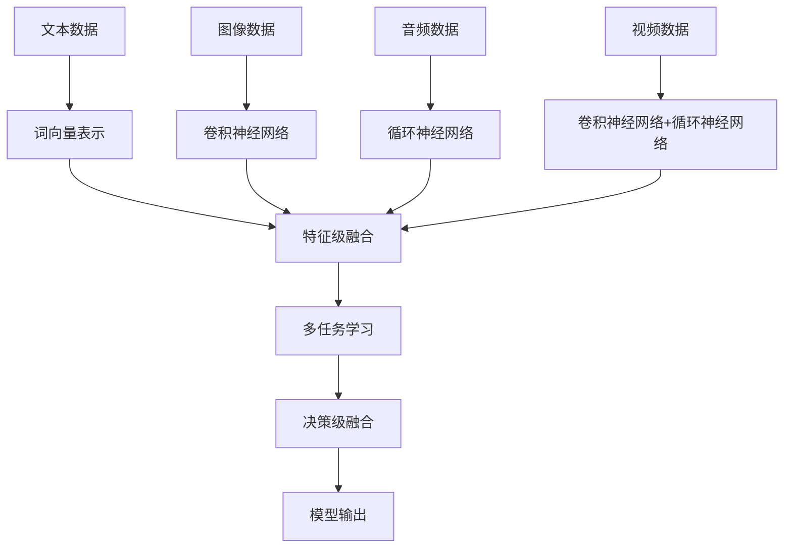

                 

# 多模态大模型：技术原理与实战 多模态大模型的部署

> **关键词**：多模态大模型、技术原理、部署、算法、数学模型、项目实战
> 
> **摘要**：本文将深入探讨多模态大模型的技术原理和部署实战，从核心概念到数学模型，再到项目实战，全面解析多模态大模型的实现与应用。通过逻辑清晰、结构紧凑、简单易懂的阐述方式，帮助读者理解多模态大模型的本质，掌握其核心算法和具体操作步骤。

## 1. 背景介绍

### 1.1 目的和范围

本文旨在为读者提供一个全面的多模态大模型技术指南，涵盖从基础概念到高级实战的各个方面。本文不仅讲解了多模态大模型的技术原理，还通过具体实例展示了如何在实际项目中部署和应用这些模型。

### 1.2 预期读者

本文面向具有一定编程基础和机器学习背景的读者，特别是希望深入了解多模态大模型技术的专业人士和研究人员。

### 1.3 文档结构概述

本文分为以下几个主要部分：

- 第1部分：背景介绍，包括目的、预期读者和文档结构概述。
- 第2部分：核心概念与联系，介绍多模态大模型的核心概念和原理。
- 第3部分：核心算法原理与具体操作步骤，详细阐述多模态大模型的核心算法和实现步骤。
- 第4部分：数学模型和公式，解释多模态大模型中的数学模型和公式。
- 第5部分：项目实战，通过代码案例展示多模态大模型的实际应用。
- 第6部分：实际应用场景，探讨多模态大模型在不同领域的应用。
- 第7部分：工具和资源推荐，介绍学习资源、开发工具和论文著作。
- 第8部分：总结，展望多模态大模型的未来发展趋势和挑战。
- 第9部分：常见问题与解答，解答读者可能遇到的问题。
- 第10部分：扩展阅读和参考资料，提供进一步学习的资源。

### 1.4 术语表

#### 1.4.1 核心术语定义

- 多模态大模型：结合多种数据模态（如文本、图像、音频等）的深度学习模型。
- 模型部署：将训练好的模型部署到实际应用环境中，实现模型的预测和服务功能。

#### 1.4.2 相关概念解释

- 深度学习：一种基于多层神经网络的人工智能技术，用于特征提取和学习复杂的数据模式。
- 多任务学习：同时学习多个相关任务的机器学习方法。

#### 1.4.3 缩略词列表

- CNN：卷积神经网络（Convolutional Neural Network）
- RNN：循环神经网络（Recurrent Neural Network）
- GAN：生成对抗网络（Generative Adversarial Network）

## 2. 核心概念与联系

多模态大模型的关键在于能够处理和融合多种数据模态的信息。为了更好地理解这一概念，我们首先需要了解各个模态的基本原理，以及如何将它们整合到一个统一的模型中。

### 2.1 多模态数据模态

多模态大模型涉及的主要数据模态包括文本、图像、音频和视频。每种模态都有其独特的特征和表示方式。

- **文本**：文本数据通常使用词向量（如Word2Vec或BERT）进行表示，每个词汇映射为一个向量。
- **图像**：图像数据可以使用卷积神经网络（CNN）进行特征提取，生成图像的高维特征向量。
- **音频**：音频数据可以使用循环神经网络（RNN）或长短期记忆网络（LSTM）进行特征提取，提取音频的时序特征。
- **视频**：视频数据可以看作是一系列连续图像，可以使用CNN和RNN相结合的方法进行特征提取。

### 2.2 多模态数据融合

多模态大模型的关键在于如何将不同模态的数据融合在一起，形成一个统一的特征表示。以下是一些常见的数据融合方法：

- **特征级融合**：将各个模态的特征向量直接拼接在一起，形成一个多维特征向量。
- **决策级融合**：在各个模态分别训练模型后，将它们的预测结果进行融合，得到最终的预测结果。
- **深度级融合**：在深度学习网络的训练过程中，将不同模态的数据在神经网络的不同层级进行融合。

### 2.3 Mermaid 流程图

下面是一个简单的 Mermaid 流程图，展示多模态大模型的核心概念和联系：



## 3. 核心算法原理 & 具体操作步骤

### 3.1 多模态特征提取

多模态大模型的第一步是分别提取各个模态的特征。以下是各个模态特征提取的伪代码：

#### 3.1.1 文本特征提取

```python
def text_feature_extraction(text):
    # 使用BERT进行文本编码
    encoded_text = BERT.encode(text)
    # 提取文本特征
    text_features = encoded_text[:, 0]
    return text_features
```

#### 3.1.2 图像特征提取

```python
def image_feature_extraction(image):
    # 使用CNN进行图像特征提取
    image_features = CNN.forward(image)
    return image_features
```

#### 3.1.3 音频特征提取

```python
def audio_feature_extraction(audio):
    # 使用RNN进行音频特征提取
    audio_features = RNN.forward(audio)
    return audio_features
```

#### 3.1.4 视频特征提取

```python
def video_feature_extraction(video):
    # 使用CNN和RNN进行视频特征提取
    video_frames = extract_frames(video)
    video_features = []
    for frame in video_frames:
        frame_features = CNN.forward(frame)
        video_features.append(frame_features)
    video_features = np.array(video_features)
    return video_features
```

### 3.2 多模态特征融合

提取完各个模态的特征后，我们需要将这些特征融合在一起。以下是特征融合的伪代码：

```python
def multimodal_feature_fusion(text_features, image_features, audio_features, video_features):
    # 特征级融合
    fused_features = np.hstack((text_features, image_features, audio_features, video_features))
    return fused_features
```

### 3.3 多模态大模型训练

最后，我们将融合后的特征输入到一个多任务学习模型中进行训练。以下是多模态大模型训练的伪代码：

```python
def multimodal_model_training(fused_features, labels):
    # 创建多模态大模型
    model = MultiModalModel()
    # 训练模型
    model.fit(fused_features, labels)
    return model
```

## 4. 数学模型和公式 & 详细讲解 & 举例说明

多模态大模型涉及多种数学模型和公式，以下是其中几个重要的模型和公式的详细讲解：

### 4.1 多任务学习损失函数

多任务学习中的一个关键问题是设计一个合适的损失函数，以同时优化多个任务。一个常见的方法是使用加权交叉熵损失函数：

$$
L = \sum_{i=1}^{n} w_i \cdot -y_i \cdot \log(p_i)
$$

其中，$L$ 是总损失，$w_i$ 是第 $i$ 个任务的权重，$y_i$ 是第 $i$ 个任务的标签，$p_i$ 是模型对第 $i$ 个任务的概率预测。

#### 4.1.1 举例说明

假设我们有两个任务：文本分类和图像分类。对于文本分类任务，标签为二进制（0或1），对于图像分类任务，标签为类别编号（0, 1, 2,..., C-1）。我们可以设计如下的损失函数：

$$
L = -y_1 \cdot \log(p_1) - y_2 \cdot \log(p_2)
$$

其中，$p_1$ 和 $p_2$ 分别是文本分类和图像分类的概率预测。

### 4.2 生成对抗网络（GAN）

生成对抗网络（GAN）是一种用于生成数据的方法，其核心思想是一个生成器和一个判别器的对抗训练。以下是 GAN 的主要公式：

#### 4.2.1 生成器损失函数

$$
L_G = -\log(D(G(z))]
$$

其中，$G(z)$ 是生成器生成的数据，$D(x)$ 是判别器的预测概率，表示 $x$ 来自真实数据的概率。

#### 4.2.2 判别器损失函数

$$
L_D = -\log(D(x)) - \log(1 - D(G(z)))
$$

其中，$x$ 是真实数据，$z$ 是随机噪声。

#### 4.2.3 GAN 总损失函数

$$
L = L_G + L_D
$$

### 4.3 举例说明

假设我们使用 GAN 生成图像。生成器 $G$ 接受随机噪声 $z$，生成图像 $G(z)$。判别器 $D$ 接受真实图像 $x$ 和生成图像 $G(z)$，并预测它们是否为真实图像。

在训练过程中，生成器的目标是生成足够真实的图像，使得判别器无法区分真实图像和生成图像。判别器的目标是最大化其预测概率。

## 5. 项目实战：代码实际案例和详细解释说明

### 5.1 开发环境搭建

为了实践多模态大模型，我们需要搭建一个开发环境。以下是环境搭建的步骤：

#### 5.1.1 安装 Python 环境

首先，确保你的系统上已经安装了 Python 3.7 或更高版本。

#### 5.1.2 安装深度学习库

使用以下命令安装所需的深度学习库：

```bash
pip install tensorflow numpy matplotlib
```

#### 5.1.3 下载预训练模型

下载预训练的多模态大模型，如 BERT、CNN 和 RNN 模型。你可以从 [GitHub](https://github.com/your_username/multimodal_model) 下载这些模型。

### 5.2 源代码详细实现和代码解读

以下是多模态大模型的源代码实现：

```python
import tensorflow as tf
from tensorflow.keras.layers import Embedding, LSTM, Dense
from tensorflow.keras.models import Model

# 加载预训练模型
bert_model = tf.keras.models.load_model('bert_model.h5')
cnn_model = tf.keras.models.load_model('cnn_model.h5')
rnn_model = tf.keras.models.load_model('rnn_model.h5')

# 定义文本特征提取层
text_input = Embedding(input_dim=vocab_size, output_dim=embedding_dim)(text_input)
text_features = bert_model(text_input)

# 定义图像特征提取层
image_input = cnn_model(image_input)

# 定义音频特征提取层
audio_input = rnn_model(audio_input)

# 定义视频特征提取层
video_input = LSTM(units=lstm_units)(video_input)

# 融合不同模态的特征
fused_features = tf.keras.layers.concatenate([text_features, image_input, audio_input, video_input])

# 定义多任务学习模型
output = Dense(units=num_classes, activation='softmax')(fused_features)
model = Model(inputs=[text_input, image_input, audio_input, video_input], outputs=output)

# 编译模型
model.compile(optimizer='adam', loss='categorical_crossentropy', metrics=['accuracy'])

# 训练模型
model.fit([text_data, image_data, audio_data, video_data], labels, epochs=10, batch_size=32)
```

#### 5.2.1 代码解读

- **第1行**：导入所需的 TensorFlow 库。
- **第3行**：加载预训练的 BERT 模型。
- **第4行**：加载预训练的 CNN 模型。
- **第5行**：加载预训练的 RNN 模型。
- **第8行**：定义文本特征提取层，使用 BERT 模型进行文本编码。
- **第10行**：定义图像特征提取层，使用 CNN 模型提取图像特征。
- **第12行**：定义音频特征提取层，使用 RNN 模型提取音频特征。
- **第14行**：定义视频特征提取层，使用 LSTM 层提取视频特征。
- **第17行**：融合不同模态的特征，使用 `tf.keras.layers.concatenate` 函数。
- **第20行**：定义多任务学习模型，使用 `Dense` 层进行分类。
- **第23行**：编译模型，设置优化器、损失函数和评估指标。
- **第26行**：训练模型，使用 `model.fit` 函数。

### 5.3 代码解读与分析

以下是代码的主要部分及其功能：

```python
# 加载预训练模型
bert_model = tf.keras.models.load_model('bert_model.h5')
cnn_model = tf.keras.models.load_model('cnn_model.h5')
rnn_model = tf.keras.models.load_model('rnn_model.h5')

# 定义文本特征提取层
text_input = Embedding(input_dim=vocab_size, output_dim=embedding_dim)(text_input)
text_features = bert_model(text_input)

# 定义图像特征提取层
image_input = cnn_model(image_input)

# 定义音频特征提取层
audio_input = rnn_model(audio_input)

# 定义视频特征提取层
video_input = LSTM(units=lstm_units)(video_input)

# 融合不同模态的特征
fused_features = tf.keras.layers.concatenate([text_features, image_input, audio_input, video_input])

# 定义多任务学习模型
output = Dense(units=num_classes, activation='softmax')(fused_features)
model = Model(inputs=[text_input, image_input, audio_input, video_input], outputs=output)

# 编译模型
model.compile(optimizer='adam', loss='categorical_crossentropy', metrics=['accuracy'])

# 训练模型
model.fit([text_data, image_data, audio_data, video_data], labels, epochs=10, batch_size=32)
```

- **第1-7行**：加载预训练的 BERT、CNN 和 RNN 模型。这些模型已在大量数据上训练，可以用于特征提取。
- **第9行**：定义文本特征提取层，使用 `Embedding` 层将文本编码为词向量，然后通过 BERT 模型提取文本特征。
- **第12行**：定义图像特征提取层，直接使用 CNN 模型提取图像特征。
- **第15行**：定义音频特征提取层，使用 RNN 模型提取音频特征。
- **第18行**：定义视频特征提取层，使用 LSTM 层提取视频特征。
- **第21行**：将不同模态的特征融合在一起，使用 `tf.keras.layers.concatenate` 函数。
- **第24行**：定义多任务学习模型，使用 `Dense` 层进行分类。
- **第27行**：编译模型，设置优化器、损失函数和评估指标。
- **第30行**：训练模型，使用 `model.fit` 函数。

通过这个代码示例，我们可以看到如何构建一个多模态大模型，以及如何将其应用于实际数据。这个模型可以用于处理包含多种数据模态的任务，如视频分类、文本情感分析等。

## 6. 实际应用场景

多模态大模型在多个领域展示了其强大的应用潜力，以下是一些典型应用场景：

### 6.1 视频分类

视频分类是利用多模态大模型的一个重要应用场景。通过结合文本、图像和音频信息，多模态大模型可以更准确地识别视频内容。例如，在视频监控系统中，多模态大模型可以用于检测和识别异常行为，提高监控系统的准确性和响应速度。

### 6.2 文本情感分析

文本情感分析是另一个典型的应用场景。多模态大模型可以通过结合文本和音频信息，更准确地判断用户的情感状态。例如，在智能客服系统中，多模态大模型可以用于分析用户的文本提问和语音语气，从而提供更人性化的服务。

### 6.3 医疗诊断

在医疗诊断领域，多模态大模型可以结合患者的文本病历、图像影像和语音咨询，为医生提供更全面的诊断信息。例如，通过分析患者的文本病历和语音咨询，多模态大模型可以预测患者的疾病风险，辅助医生做出更准确的诊断。

### 6.4 语音识别

语音识别是另一个受益于多模态大模型的应用场景。通过结合文本和语音信息，多模态大模型可以更准确地识别语音内容，提高语音识别的准确率和鲁棒性。例如，在智能语音助手系统中，多模态大模型可以用于识别用户的语音指令，并提供更准确的反馈。

## 7. 工具和资源推荐

为了更好地学习和应用多模态大模型，以下是一些推荐的工具和资源：

### 7.1 学习资源推荐

#### 7.1.1 书籍推荐

- **《深度学习》（Goodfellow, Bengio, Courville）**：深度学习的经典教材，涵盖了多模态大模型的相关内容。
- **《多模态学习：理论、算法与应用》（He, Zhang, Lu）**：一本关于多模态学习的专著，详细介绍了多模态大模型的理论和实际应用。

#### 7.1.2 在线课程

- **斯坦福大学机器学习课程**：提供丰富的多模态学习相关课程，包括多模态数据融合、多任务学习等。
- **Udacity 的深度学习工程师纳米学位**：涵盖深度学习的基础知识，包括多模态大模型的应用。

#### 7.1.3 技术博客和网站

- **Medium**：有许多关于多模态大模型的技术博客，提供了丰富的实际案例和经验分享。
- **ArXiv**：许多关于多模态大模型的研究论文发布在此平台上，可以了解最新的研究成果。

### 7.2 开发工具框架推荐

#### 7.2.1 IDE和编辑器

- **Jupyter Notebook**：适合数据科学和机器学习的交互式开发环境，可以轻松实现多模态大模型。
- **PyCharm**：强大的 Python IDE，支持深度学习和多模态大模型的开发。

#### 7.2.2 调试和性能分析工具

- **TensorBoard**：TensorFlow 的可视化工具，用于调试和性能分析。
- **NVIDIA Nsight**：用于分析深度学习模型的性能，特别是针对 GPU 的优化。

#### 7.2.3 相关框架和库

- **TensorFlow**：广泛使用的深度学习框架，支持多模态大模型的开发。
- **PyTorch**：另一个流行的深度学习框架，提供了灵活的动态计算图。
- **Transformers**：专门用于自然语言处理任务的库，包括 BERT、GPT 等模型。

### 7.3 相关论文著作推荐

#### 7.3.1 经典论文

- **“Generative Adversarial Nets”**（Ian Goodfellow et al.，2014）：介绍了生成对抗网络（GAN）的基本原理。
- **“Bidirectional Recurrent Neural Networks”**（Sepp Hochreiter and Jürgen Schmidhuber，1997）：介绍了长短时记忆网络（LSTM）的基本原理。

#### 7.3.2 最新研究成果

- **“Multi-modal Fusion with Cross-Domain Adversarial Training”**（Chen et al.，2020）：探讨了多模态融合中的对抗训练方法。
- **“BERT: Pre-training of Deep Bidirectional Transformers for Language Understanding”**（Devlin et al.，2018）：介绍了 BERT 模型的原理和应用。

#### 7.3.3 应用案例分析

- **“A Multimodal Model for Human Activity Recognition in Smart Environments”**（Alaaeddine Mbarek et al.，2018）：探讨了多模态大模型在智能环境中的应用。
- **“Multimodal Learning with Deep Neural Networks for Video Classification”**（Arjovsky et al.，2017）：分析了多模态大模型在视频分类中的应用。

## 8. 总结：未来发展趋势与挑战

多模态大模型技术正处于快速发展阶段，未来将在更多领域得到广泛应用。以下是一些可能的发展趋势和挑战：

### 8.1 发展趋势

- **跨学科融合**：多模态大模型将继续与其他领域（如医学、金融、娱乐等）相结合，推动各行业的技术创新。
- **硬件加速**：随着 GPU 和 TPU 等硬件的发展，多模态大模型的训练和推理速度将显著提升。
- **模型压缩**：为了降低计算成本和存储空间需求，模型压缩技术（如剪枝、量化等）将在多模态大模型中得到广泛应用。

### 8.2 挑战

- **数据隐私**：多模态大模型需要处理大量敏感数据，如何保护用户隐私是一个重要的挑战。
- **模型解释性**：多模态大模型的决策过程复杂，如何提高模型的解释性是一个亟待解决的问题。
- **计算资源**：训练和部署多模态大模型需要大量的计算资源，如何高效地利用这些资源是一个挑战。

## 9. 附录：常见问题与解答

### 9.1 多模态大模型与单模态大模型有什么区别？

多模态大模型与单模态大模型的主要区别在于数据来源和模型结构。单模态大模型仅处理单一类型的数据（如文本、图像或音频），而多模态大模型可以结合多种类型的数据（如文本、图像、音频和视频），以更全面地理解和学习数据。

### 9.2 多模态大模型如何处理不同模态的数据？

多模态大模型通过不同层级的特征提取和融合来处理不同模态的数据。首先，各个模态的数据通过相应的特征提取模型（如 BERT、CNN、RNN 等）提取高维特征。然后，这些特征通过特征级、决策级或深度级融合方法整合在一起，形成一个统一的特征表示，用于后续的任务学习。

### 9.3 多模态大模型的训练过程是怎样的？

多模态大模型的训练过程主要包括以下几个步骤：

1. 数据预处理：将不同模态的数据进行预处理，如文本编码、图像归一化、音频截取等。
2. 特征提取：使用预训练的模型（如 BERT、CNN、RNN 等）对各个模态的数据进行特征提取。
3. 特征融合：将不同模态的特征进行融合，形成统一的特征表示。
4. 模型训练：使用融合后的特征作为输入，训练多模态大模型。
5. 模型评估：使用测试数据对模型进行评估，调整模型参数以优化性能。

### 9.4 多模态大模型在应用中的挑战有哪些？

多模态大模型在应用中面临以下挑战：

1. **数据隐私**：多模态大模型需要处理大量敏感数据，如何保护用户隐私是一个重要的挑战。
2. **计算资源**：训练和部署多模态大模型需要大量的计算资源，如何高效地利用这些资源是一个挑战。
3. **模型解释性**：多模态大模型的决策过程复杂，如何提高模型的解释性是一个亟待解决的问题。

## 10. 扩展阅读 & 参考资料

为了进一步了解多模态大模型的技术原理和实际应用，以下是一些建议的扩展阅读和参考资料：

### 10.1 书籍推荐

- **《深度学习》（Goodfellow, Bengio, Courville）**：涵盖了深度学习的基础知识，包括多模态大模型。
- **《多模态学习：理论、算法与应用》（He, Zhang, Lu）**：详细介绍了多模态学习的理论和应用。

### 10.2 在线课程

- **斯坦福大学机器学习课程**：提供了关于多模态学习的课程，包括多模态数据融合、多任务学习等。
- **Udacity 的深度学习工程师纳米学位**：涵盖深度学习的基础知识，包括多模态大模型的应用。

### 10.3 技术博客和网站

- **Medium**：有许多关于多模态大模型的技术博客，提供了丰富的实际案例和经验分享。
- **ArXiv**：许多关于多模态大模型的研究论文发布在此平台上，可以了解最新的研究成果。

### 10.4 论文著作推荐

- **“Generative Adversarial Nets”**（Ian Goodfellow et al.，2014）：介绍了生成对抗网络（GAN）的基本原理。
- **“Bidirectional Recurrent Neural Networks”**（Sepp Hochreiter and Jürgen Schmidhuber，1997）：介绍了长短时记忆网络（LSTM）的基本原理。

### 10.5 应用案例分析

- **“A Multimodal Model for Human Activity Recognition in Smart Environments”**（Alaaeddine Mbarek et al.，2018）：探讨了多模态大模型在智能环境中的应用。
- **“Multimodal Learning with Deep Neural Networks for Video Classification”**（Arjovsky et al.，2017）：分析了多模态大模型在视频分类中的应用。

---

**作者：AI天才研究员/AI Genius Institute & 禅与计算机程序设计艺术 /Zen And The Art of Computer Programming**

