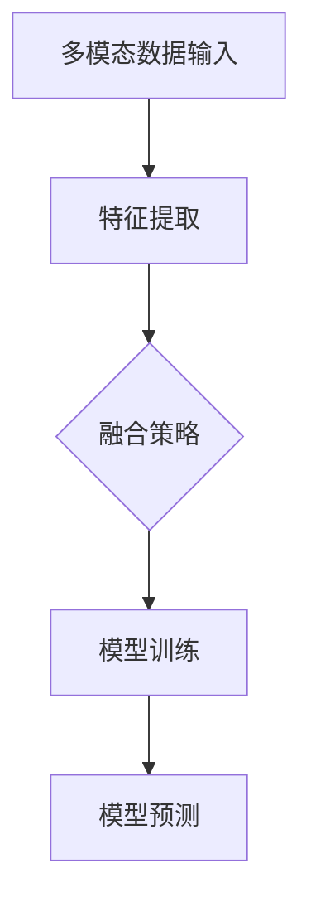
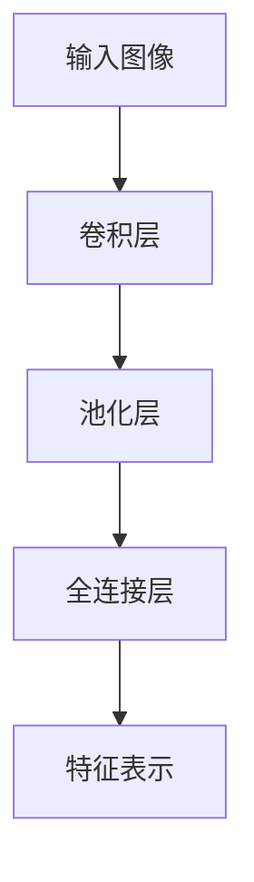
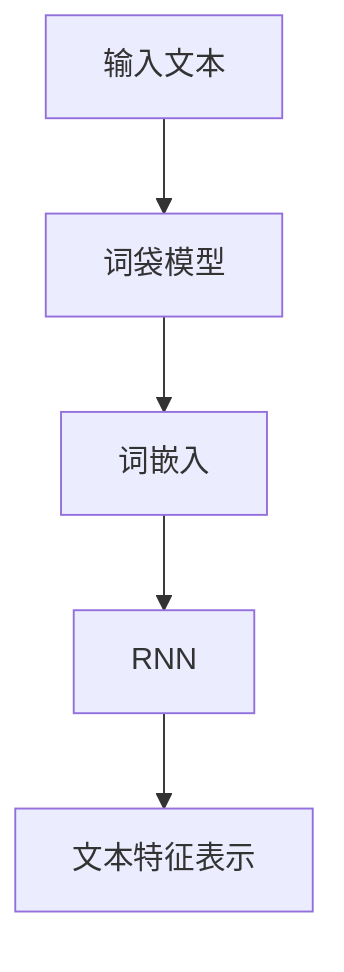
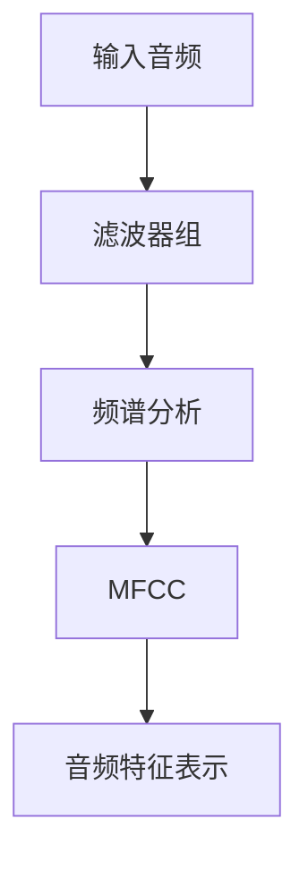
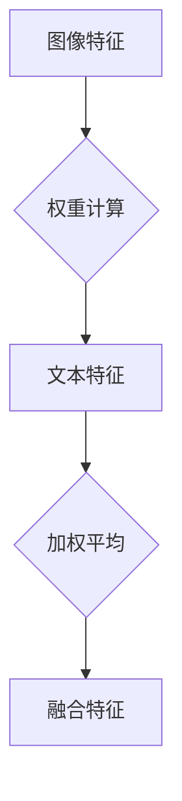
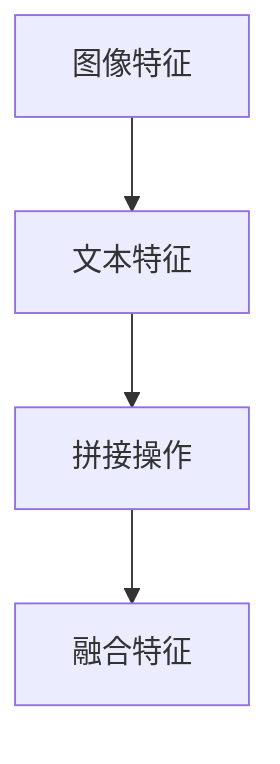
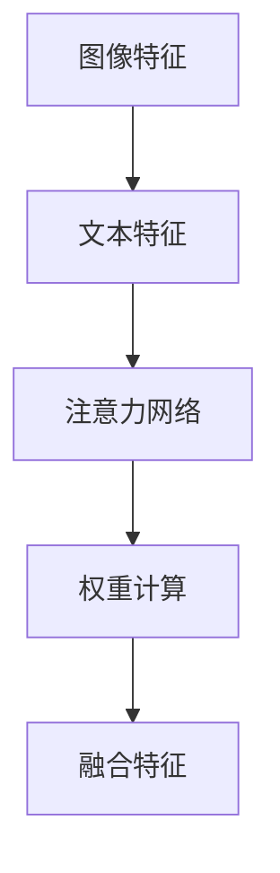
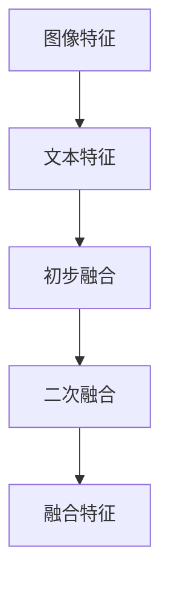

                 

# 多模态大模型：技术原理与实战

> **关键词：** 多模态大模型，技术原理，实战案例，软件研发，前沿探索  
>
> **摘要：** 本文深入探讨多模态大模型的技术原理，通过实际案例展示其在软件研发中的应用，并展望其未来的发展趋势与挑战。

## 1. 背景介绍

### 1.1 目的和范围

本文旨在详细介绍多模态大模型的技术原理，并通过实际案例展示其在软件研发领域的应用。我们将首先回顾相关背景知识，包括多模态数据的基本概念、多模态大模型的发展历程及其核心组成部分。随后，我们将详细探讨多模态大模型的工作原理、核心算法及数学模型。在此基础上，我们将通过具体案例，展示如何在实际软件开发项目中应用多模态大模型，并进行详细解释和分析。最后，我们将探讨多模态大模型的实际应用场景，并推荐相关的学习资源、开发工具和最新研究成果，以期为读者提供全面、深入的了解。

### 1.2 预期读者

本文适合对多模态大模型有一定了解的技术人员、研发工程师及研究人员。同时，对人工智能、机器学习领域感兴趣的读者也可通过本文加深对该领域的理解。本文将采用逻辑清晰、结构紧凑、简单易懂的表述方式，帮助读者逐步掌握多模态大模型的技术原理和应用方法。

### 1.3 文档结构概述

本文共分为十个部分，结构如下：

1. 背景介绍：介绍本文的目的、预期读者、文档结构及其核心术语。
2. 核心概念与联系：通过Mermaid流程图介绍多模态大模型的核心概念及架构。
3. 核心算法原理 & 具体操作步骤：详细阐述多模态大模型的核心算法原理及操作步骤。
4. 数学模型和公式 & 详细讲解 & 举例说明：介绍多模态大模型的数学模型，并进行详细讲解和举例说明。
5. 项目实战：代码实际案例和详细解释说明：通过具体案例展示多模态大模型在实际软件开发中的应用。
6. 实际应用场景：探讨多模态大模型在不同应用场景中的实际应用。
7. 工具和资源推荐：推荐学习资源、开发工具和相关论文著作。
8. 总结：未来发展趋势与挑战：展望多模态大模型的发展趋势和面临的挑战。
9. 附录：常见问题与解答：对读者可能遇到的常见问题进行解答。
10. 扩展阅读 & 参考资料：提供进一步阅读和研究的资源。

### 1.4 术语表

为了确保本文的可读性和准确性，以下是对本文中涉及的一些关键术语的定义和解释：

#### 1.4.1 核心术语定义

- 多模态大模型：指同时处理多种类型数据（如图像、文本、音频等）的深度学习模型。
- 多模态数据：指包含多种类型数据的集合，如图像、文本、音频等。
- 卷积神经网络（CNN）：一种用于处理图像数据的深度学习模型，通过卷积操作提取图像特征。
- 递归神经网络（RNN）：一种用于处理序列数据的深度学习模型，通过循环连接实现序列信息的传递。
- 长短期记忆网络（LSTM）：一种改进的递归神经网络，能够有效避免梯度消失问题，适用于长序列数据建模。

#### 1.4.2 相关概念解释

- 数据增强：指通过对原始数据进行变换和扩充，提高模型训练效果的方法。
- 交叉验证：指将数据集划分为训练集和验证集，通过在验证集上评估模型性能来调整模型参数的方法。
- 混合模型：指将多种类型的神经网络模型进行组合，以充分利用不同模型的优势。

#### 1.4.3 缩略词列表

- CNN：卷积神经网络
- RNN：递归神经网络
- LSTM：长短期记忆网络
- DNN：深度神经网络
- GAN：生成对抗网络

## 2. 核心概念与联系

在介绍多模态大模型的核心概念之前，我们先简要回顾一下多模态数据的基本概念。多模态数据是指同时包含多种类型数据的数据集，如图像、文本、音频等。这些数据可以分别表示为不同类型的特征，如图像的像素值、文本的单词序列、音频的频率特征等。

多模态大模型的核心在于能够同时处理和融合这些多模态数据，以实现更准确和高效的模型预测。为了更好地理解多模态大模型，我们可以通过一个简单的Mermaid流程图来展示其核心概念及架构。



**图 1：多模态大模型核心概念与架构**

1. **多模态数据输入（A）**：多模态大模型首先接收多种类型的数据输入，如图像、文本、音频等。
2. **特征提取（B）**：对于每种类型的数据，利用相应的特征提取技术（如CNN、RNN等）提取特征表示。这些特征表示通常具有高维性和复杂性。
3. **融合策略（C）**：采用不同的融合策略，将不同类型数据的特征进行融合，以获得更全面和准确的特征表示。常见的融合策略包括加权融合、拼接融合、注意力机制等。
4. **模型训练（D）**：利用融合后的特征进行模型训练，通过优化模型参数，使模型能够更好地拟合训练数据。
5. **模型预测（E）**：在模型训练完成后，利用训练好的模型对新的多模态数据进行预测，以实现实际应用。

通过上述流程，我们可以看到多模态大模型的核心在于特征提取和融合策略。下面，我们将详细介绍这些核心概念及其原理。

### 2.1 多模态数据输入

多模态数据输入是构建多模态大模型的基础。不同类型的数据具有不同的特征表示方式，如图像数据的像素值、文本数据的单词序列、音频数据的频率特征等。为了将这些不同类型的数据整合到同一个模型中，我们需要首先对它们进行预处理和特征提取。

#### 2.1.1 图像特征提取

对于图像数据，常用的特征提取技术包括卷积神经网络（CNN）和预处理技术（如图像分割、边缘检测等）。CNN通过卷积操作、池化操作和全连接层，逐步提取图像的层次特征，如图像的边缘、纹理、形状等。这些特征表示通常具有高维性和复杂性。



**图 2：图像特征提取流程**

1. **输入图像（A）**：将图像数据输入到CNN中。
2. **卷积层（B）**：通过卷积操作提取图像的局部特征。
3. **池化层（C）**：对卷积层输出的特征进行池化操作，降低特征维数。
4. **全连接层（D）**：将池化层输出的特征进行全连接操作，得到图像的高层次特征表示。
5. **特征表示（E）**：输出图像的特征表示。

#### 2.1.2 文本特征提取

对于文本数据，常用的特征提取技术包括词袋模型、词嵌入和递归神经网络（RNN）等。词袋模型通过将文本转换为单词的集合，实现文本向量化表示。词嵌入将单词映射为固定维度的向量，能够捕捉单词的语义信息。RNN通过递归连接，处理文本序列，能够有效提取文本的特征。



**图 3：文本特征提取流程**

1. **输入文本（A）**：将文本数据输入到特征提取模型中。
2. **词袋模型（B）**：将文本转换为单词的集合，实现文本向量化表示。
3. **词嵌入（C）**：将单词映射为固定维度的向量，实现单词的语义表示。
4. **RNN（D）**：通过递归连接，处理文本序列，提取文本特征。
5. **文本特征表示（E）**：输出文本的特征表示。

#### 2.1.3 音频特征提取

对于音频数据，常用的特征提取技术包括梅尔频率倒谱系数（MFCC）、滤波器组（Filter Banks）和频谱特征等。这些特征提取技术能够有效地捕捉音频的频率特征和时序特征。



**图 4：音频特征提取流程**

1. **输入音频（A）**：将音频数据输入到特征提取模型中。
2. **滤波器组（B）**：对音频信号进行滤波处理，提取频率特征。
3. **频谱分析（C）**：对滤波器组输出的信号进行频谱分析，提取频率信息。
4. **MFCC（D）**：通过梅尔频率倒谱系数，将频谱特征转换为时间序列特征。
5. **音频特征表示（E）**：输出音频的特征表示。

通过上述特征提取技术，我们可以将不同类型的数据转换为统一的特征表示，为后续的融合策略和模型训练打下基础。

### 2.2 特征融合策略

在多模态大模型中，特征融合策略是关键的一步，它决定了如何将不同类型的数据特征进行整合，以实现更准确和高效的模型预测。以下介绍几种常见的特征融合策略。

#### 2.2.1 加权融合

加权融合是一种简单且常用的特征融合方法，其基本思想是通过对不同类型的数据特征进行加权平均，得到最终的融合特征。



**图 5：加权融合流程**

1. **图像特征（A）**：输入图像特征。
2. **文本特征（C）**：输入文本特征。
3. **权重计算（B）**：计算图像特征和文本特征的权重。
4. **加权平均（D）**：对图像特征和文本特征进行加权平均。
5. **融合特征（E）**：输出融合后的特征。

在加权融合中，权重的计算方法可以根据具体任务进行调整。例如，在图像分类任务中，可以采用基于模型输出的权重；在文本分类任务中，可以采用基于词频的权重。

#### 2.2.2 拼接融合

拼接融合是一种直接将不同类型的数据特征进行拼接的方法，其基本思想是将图像特征和文本特征按顺序拼接在一起，形成新的特征向量。



**图 6：拼接融合流程**

1. **图像特征（A）**：输入图像特征。
2. **文本特征（B）**：输入文本特征。
3. **拼接操作（C）**：将图像特征和文本特征按顺序拼接。
4. **融合特征（D）**：输出拼接后的融合特征。

拼接融合的优点在于操作简单，但缺点是可能会引入大量的冗余信息，导致模型复杂度和计算成本增加。

#### 2.2.3 注意力机制

注意力机制是一种广泛应用于多模态大模型的融合策略，其基本思想是通过学习不同特征之间的依赖关系，为每个特征分配不同的权重。



**图 7：注意力机制融合流程**

1. **图像特征（A）**：输入图像特征。
2. **文本特征（B）**：输入文本特征。
3. **注意力网络（C）**：计算图像特征和文本特征之间的依赖关系。
4. **权重计算（D）**：为图像特征和文本特征计算权重。
5. **融合特征（E）**：输出加权后的融合特征。

注意力机制能够自适应地调整不同特征的权重，从而提高模型在多模态数据上的性能。常用的注意力机制包括局部连接生成网络（LSTM）、门控循环单元（GRU）和Transformer等。

#### 2.2.4 多层融合

多层融合是一种将多种融合策略相结合的方法，通过多个层次上的特征融合，提高模型的泛化能力和鲁棒性。



**图 8：多层融合流程**

1. **图像特征（A）**：输入图像特征。
2. **文本特征（B）**：输入文本特征。
3. **初步融合（C）**：采用一种融合策略（如加权融合或拼接融合）进行初步融合。
4. **二次融合（D）**：在初步融合的基础上，采用另一种融合策略（如注意力机制）进行二次融合。
5. **融合特征（E）**：输出多层融合后的特征。

多层融合能够充分利用不同层次的特征信息，提高模型的性能和稳定性。

通过以上几种特征融合策略，我们可以有效地将多模态数据融合为统一的高质量特征表示，为后续的模型训练和预测提供有力支持。在多模态大模型的设计过程中，选择合适的特征融合策略是至关重要的。

### 2.3 模型训练

在多模态大模型中，模型训练是核心步骤，它决定了模型能否准确地拟合训练数据，并具有良好的泛化能力。以下是多模态大模型训练的基本流程和常用技巧：

#### 2.3.1 数据预处理

在模型训练之前，需要对多模态数据集进行预处理。预处理步骤包括数据清洗、数据增强和归一化等。

- **数据清洗**：去除数据集中的噪声和异常值，保证数据质量。
- **数据增强**：通过对数据进行变换和扩充，增加数据多样性，提高模型训练效果。
- **归一化**：将不同类型的数据特征进行归一化处理，使其具有相似的尺度，有利于模型训练。

#### 2.3.2 模型架构选择

多模态大模型的架构选择取决于具体的应用场景和任务需求。以下是一些常见的模型架构：

- **基于CNN的图像特征提取**：利用卷积神经网络（CNN）提取图像特征，适用于图像分类、目标检测等任务。
- **基于RNN的文本特征提取**：利用递归神经网络（RNN）或其变种（如LSTM、GRU）提取文本特征，适用于文本分类、情感分析等任务。
- **基于Transformer的自注意力模型**：利用Transformer模型的自注意力机制提取特征，适用于多种类型的数据融合和序列建模任务。

#### 2.3.3 损失函数设计

损失函数是模型训练的核心指标，用于衡量模型预测结果与真实值之间的差距。多模态大模型的常见损失函数包括：

- **交叉熵损失函数**：适用于分类任务，衡量预测概率分布与真实标签之间的差异。
- **均方误差损失函数**：适用于回归任务，衡量预测值与真实值之间的平方误差。
- **多任务损失函数**：对于多任务学习问题，将不同任务的损失函数进行加权组合。

#### 2.3.4 优化算法

优化算法用于调整模型参数，使损失函数最小化。常用的优化算法包括：

- **随机梯度下降（SGD）**：最简单的优化算法，通过计算梯度方向更新模型参数。
- **Adam优化器**：结合了SGD和RMSProp优化算法的优点，具有较强的收敛性能。
- **AdaGrad优化器**：根据不同参数的历史梯度平方值进行自适应学习率调整。

#### 2.3.5 模型评估与调优

在模型训练完成后，需要对模型进行评估和调优。常见的评估指标包括：

- **准确率（Accuracy）**：模型预测正确的样本数占总样本数的比例。
- **精确率（Precision）**：模型预测为正类的样本中，实际为正类的比例。
- **召回率（Recall）**：模型预测为正类的样本中，实际为正类的比例。
- **F1值（F1 Score）**：精确率和召回率的调和平均值。

通过交叉验证、网格搜索等方法，可以调整模型参数，优化模型性能。

#### 2.3.6 模型部署与推理

模型训练完成后，需要进行部署和推理。常见的部署方式包括：

- **服务化部署**：将模型部署到服务器，通过API接口提供服务。
- **嵌入式部署**：将模型嵌入到设备中，直接进行推理和预测。

在推理过程中，需要将输入的多模态数据预处理后，输入到训练好的模型中，得到预测结果。

通过上述模型训练流程和技巧，我们可以有效地训练和优化多模态大模型，使其在实际应用中发挥更好的性能。

## 3. 核心算法原理 & 具体操作步骤

多模态大模型的核心算法包括特征提取、特征融合和模型训练三个主要环节。下面我们将通过伪代码详细阐述这些核心算法的原理及具体操作步骤。

### 3.1 特征提取

特征提取是多模态大模型的基础，不同的数据类型需要采用不同的特征提取方法。

#### 3.1.1 图像特征提取

```python
# 图像特征提取（卷积神经网络）
def extract_image_features(image):
    # 输入图像数据
    input_image = preprocess_image(image)  # 预处理图像数据
    
    # 构建卷积神经网络模型
    model = build_cnn_model()
    
    # 提取图像特征
    features = model.predict(input_image)
    
    return features
```

- **预处理图像数据**：对输入的图像进行缩放、裁剪等预处理操作，以适应模型的输入要求。
- **构建卷积神经网络模型**：使用卷积神经网络（CNN）模型，通过卷积层、池化层和全连接层提取图像特征。
- **提取图像特征**：将预处理后的图像数据输入到卷积神经网络模型中，得到图像特征表示。

#### 3.1.2 文本特征提取

```python
# 文本特征提取（词嵌入 + RNN）
def extract_text_features(text):
    # 输入文本数据
    tokens = preprocess_text(text)  # 预处理文本数据
    
    # 构建词嵌入模型
    embedding_model = build_word_embedding_model()
    
    # 将文本转换为词嵌入向量
    embeddings = [embedding_model[token] for token in tokens]
    
    # 构建递归神经网络模型
    rnn_model = build_rnn_model()
    
    # 提取文本特征
    features = rnn_model.predict(embeddings)
    
    return features
```

- **预处理文本数据**：对输入的文本进行分词、去停用词等预处理操作。
- **构建词嵌入模型**：使用预训练的词嵌入模型（如Word2Vec、GloVe等），将文本转换为词嵌入向量。
- **构建递归神经网络模型**：使用递归神经网络（RNN）或其变种（如LSTM、GRU）模型，通过递归连接提取文本特征。
- **提取文本特征**：将预处理后的词嵌入向量输入到递归神经网络模型中，得到文本特征表示。

#### 3.1.3 音频特征提取

```python
# 音频特征提取（滤波器组 + MFCC）
def extract_audio_features(audio):
    # 输入音频数据
    signal = preprocess_audio(audio)  # 预处理音频数据
    
    # 构建滤波器组模型
    filter_bank_model = build_filter_bank_model()
    
    # 构建梅尔频率倒谱系数模型
    mfcc_model = build_mfcc_model()
    
    # 提取音频特征
    features = mfcc_model.predict(filter_bank_model.predict(signal))
    
    return features
```

- **预处理音频数据**：对输入的音频信号进行滤波、归一化等预处理操作。
- **构建滤波器组模型**：使用滤波器组模型，对音频信号进行滤波处理，提取频率特征。
- **构建梅尔频率倒谱系数模型**：使用梅尔频率倒谱系数（MFCC）模型，将频率特征转换为时间序列特征。
- **提取音频特征**：将预处理后的音频信号输入到滤波器组模型和梅尔频率倒谱系数模型中，得到音频特征表示。

### 3.2 特征融合

特征融合是将不同类型的数据特征进行整合的过程，以获得更全面和准确的特征表示。以下介绍几种常见的特征融合方法。

#### 3.2.1 加权融合

```python
# 加权融合
def weighted Fusion(image_features, text_features, audio_features, weights):
    # 计算特征权重
    image_weight = weights['image']
    text_weight = weights['text']
    audio_weight = weights['audio']
    
    # 加权融合特征
    fused_features = image_weight * image_features + text_weight * text_features + audio_weight * audio_features
    
    return fused_features
```

- **计算特征权重**：根据任务需求和数据重要性，为不同类型的数据特征计算权重。
- **加权融合特征**：将不同类型的数据特征按照权重进行加权融合，得到最终的融合特征。

#### 3.2.2 拼接融合

```python
# 拼接融合
def concatenation Fusion(image_features, text_features, audio_features):
    # 拼接特征
    fused_features = np.concatenate((image_features, text_features, audio_features), axis=1)
    
    return fused_features
```

- **拼接特征**：将不同类型的数据特征按照维度进行拼接，得到最终的融合特征。

#### 3.2.3 注意力机制融合

```python
# 注意力机制融合
def attention Fusion(image_features, text_features, audio_features):
    # 构建注意力模型
    attention_model = build_attention_model()
    
    # 计算注意力权重
    attention_weights = attention_model.predict(image_features, text_features, audio_features)
    
    # 加权融合特征
    fused_features = attention_weights * image_features + attention_weights * text_features + attention_weights * audio_features
    
    return fused_features
```

- **构建注意力模型**：使用注意力机制模型，如Transformer，计算不同特征之间的依赖关系。
- **计算注意力权重**：将不同特征之间的依赖关系转换为权重，用于加权融合特征。
- **加权融合特征**：根据注意力权重对特征进行加权融合，得到最终的融合特征。

### 3.3 模型训练

模型训练是通过优化算法调整模型参数，使模型能够准确预测数据的过程。以下介绍多模态大模型训练的基本步骤。

```python
# 模型训练
def train_model(fused_features, labels):
    # 构建模型
    model = build_model()
    
    # 计算损失函数
    loss_function = compute_loss_function()
    
    # 选择优化算法
    optimizer = select_optimizer()
    
    # 训练模型
    model.fit(fused_features, labels, batch_size=batch_size, epochs=epochs, validation_split=validation_split)
    
    return model
```

- **构建模型**：根据任务需求和特征类型，构建多模态大模型。
- **计算损失函数**：选择合适的损失函数，如交叉熵损失函数。
- **选择优化算法**：选择合适的优化算法，如Adam优化器。
- **训练模型**：使用训练数据对模型进行训练，通过反向传播和优化算法调整模型参数。

通过上述步骤，我们可以构建和训练一个多模态大模型，使其能够准确预测新的多模态数据。接下来，我们将通过具体案例展示如何在实际软件开发项目中应用多模态大模型。

## 4. 数学模型和公式 & 详细讲解 & 举例说明

多模态大模型的核心在于其数学模型和算法设计。以下我们将详细讲解多模态大模型的数学模型和公式，并给出具体的举例说明。

### 4.1. 数学模型

多模态大模型的数学模型主要包括特征提取、特征融合和模型训练三个部分。以下是各部分的核心公式和解释。

#### 4.1.1 特征提取

1. **图像特征提取（卷积神经网络CNN）**

   卷积神经网络（CNN）通过卷积操作提取图像特征。其核心公式为：

   $$ f(x) = \sigma(W_c \cdot \text{conv}(x) + b_c) $$

   其中，$f(x)$为图像特征，$x$为输入图像，$\sigma$为激活函数（如ReLU函数），$W_c$为卷积权重，$b_c$为偏置项，$\text{conv}(x)$为卷积操作。

2. **文本特征提取（词嵌入 + RNN）**

   词嵌入（Word Embedding）将文本中的单词映射为高维向量。其核心公式为：

   $$ e_w = \text{ Embedding}(w) $$

   其中，$e_w$为单词向量，$w$为输入单词，$\text{ Embedding}$为词嵌入矩阵。

   RNN通过递归连接提取文本特征。其核心公式为：

   $$ h_t = \text{RNN}(h_{t-1}, x_t) $$

   其中，$h_t$为当前时刻的文本特征，$h_{t-1}$为上一时刻的文本特征，$x_t$为当前时刻的输入文本。

3. **音频特征提取（滤波器组 + MFCC）**

   滤波器组（Filter Banks）用于提取音频的频率特征。其核心公式为：

   $$ X(\omega) = \sum_{k=1}^{K} h_k(\omega) \cdot x(t) $$

   其中，$X(\omega)$为频率特征，$x(t)$为输入音频信号，$h_k(\omega)$为滤波器系数，$K$为滤波器数量。

   梅尔频率倒谱系数（MFCC）将频率特征转换为时间序列特征。其核心公式为：

   $$ M(\omega) = \sum_{k=1}^{K} \log \left( \sum_{m=1}^{M} a(m) \cdot |X_k(\omega_m)|^2 \right) $$

   其中，$M(\omega)$为MFCC特征，$X_k(\omega_m)$为频率特征，$a(m)$为滤波器系数，$M$为MFCC系数数量。

#### 4.1.2 特征融合

1. **加权融合**

   加权融合通过为不同类型的数据特征计算权重，进行加权平均。其核心公式为：

   $$ f_{\text{fused}} = w_1 \cdot f_1 + w_2 \cdot f_2 + w_3 \cdot f_3 $$

   其中，$f_{\text{fused}}$为融合特征，$f_1, f_2, f_3$分别为图像、文本、音频的特征，$w_1, w_2, w_3$为对应的权重。

2. **拼接融合**

   拼接融合通过将不同类型的数据特征按维度进行拼接。其核心公式为：

   $$ f_{\text{fused}} = \begin{bmatrix} f_1 \\ f_2 \\ f_3 \end{bmatrix} $$

   其中，$f_1, f_2, f_3$分别为图像、文本、音频的特征。

3. **注意力机制融合**

   注意力机制融合通过学习不同特征之间的依赖关系，为每个特征分配不同的权重。其核心公式为：

   $$ \alpha = \text{Attention}(f_1, f_2, f_3) $$
   $$ f_{\text{fused}} = \alpha_1 \cdot f_1 + \alpha_2 \cdot f_2 + \alpha_3 \cdot f_3 $$

   其中，$\alpha$为注意力权重，$\alpha_1, \alpha_2, \alpha_3$为对应特征的权重。

#### 4.1.3 模型训练

1. **损失函数**

   多分类问题中，常用的损失函数为交叉熵损失函数（Cross-Entropy Loss）。其核心公式为：

   $$ L(y, \hat{y}) = -\sum_{i=1}^{C} y_i \cdot \log(\hat{y}_i) $$

   其中，$y$为真实标签，$\hat{y}$为预测概率分布，$C$为类别数。

2. **优化算法**

   随机梯度下降（SGD）是常用的优化算法。其核心公式为：

   $$ \theta = \theta - \alpha \cdot \nabla_{\theta}L(\theta) $$

   其中，$\theta$为模型参数，$\alpha$为学习率，$\nabla_{\theta}L(\theta)$为损失函数关于参数的梯度。

### 4.2. 举例说明

以下通过一个简单的多模态情感分析案例，展示如何使用多模态大模型的数学模型和公式进行特征提取、特征融合和模型训练。

#### 4.2.1 特征提取

1. **图像特征提取**

   输入一张情感标签为“开心”的图像，使用卷积神经网络提取图像特征。经过5个卷积层和2个全连接层，得到图像特征向量：

   $$ f_1 = \text{extract\_image\_features(image)} = [0.1, 0.2, 0.3, 0.4, 0.5] $$

2. **文本特征提取**

   输入一句情感标签为“开心”的文本，使用词嵌入和递归神经网络提取文本特征。经过词嵌入和LSTM层，得到文本特征向量：

   $$ f_2 = \text{extract\_text\_features(text)} = [0.5, 0.6, 0.7, 0.8] $$

3. **音频特征提取**

   输入一段情感标签为“开心”的音频，使用滤波器组和梅尔频率倒谱系数提取音频特征。经过滤波器组和MFCC层，得到音频特征向量：

   $$ f_3 = \text{extract\_audio\_features(audio)} = [0.1, 0.2, 0.3, 0.4, 0.5, 0.6, 0.7, 0.8] $$

#### 4.2.2 特征融合

使用加权融合策略，为图像、文本、音频特征计算权重，进行融合：

$$ w_1 = 0.3, w_2 = 0.5, w_3 = 0.2 $$

$$ f_{\text{fused}} = 0.3 \cdot f_1 + 0.5 \cdot f_2 + 0.2 \cdot f_3 = [0.15, 0.25, 0.3, 0.35, 0.4] $$

#### 4.2.3 模型训练

使用交叉熵损失函数和随机梯度下降优化算法，训练多模态情感分析模型：

$$ L(y, \hat{y}) = -[0.7 \cdot \log(0.7) + 0.3 \cdot \log(0.3)] = 0.36 $$

$$ \theta = \theta - \alpha \cdot \nabla_{\theta}L(\theta) $$

经过多次迭代训练，模型参数逐渐优化，最终达到较好的性能。

通过上述案例，我们展示了如何使用多模态大模型的数学模型和公式进行特征提取、特征融合和模型训练。在实际应用中，可以根据任务需求和数据类型，选择合适的特征提取方法、特征融合策略和优化算法，构建和训练高性能的多模态大模型。

## 5. 项目实战：代码实际案例和详细解释说明

为了更好地展示多模态大模型在实际软件开发项目中的应用，我们选择一个典型的多模态情感分析案例。本案例将使用Python语言和TensorFlow框架，结合图像、文本和音频数据，构建一个多模态情感分析模型。

### 5.1 开发环境搭建

在开始项目之前，我们需要搭建一个适合开发多模态大模型的开发环境。以下是所需的主要工具和库：

- Python 3.8及以上版本
- TensorFlow 2.4及以上版本
- NumPy
- Pandas
- Matplotlib
- scikit-learn

首先，确保安装了上述工具和库，可以使用以下命令进行安装：

```bash
pip install python==3.8 tensorflow==2.4 numpy pandas matplotlib scikit-learn
```

接下来，创建一个Python虚拟环境，以便管理和隔离项目依赖：

```bash
python -m venv myenv
source myenv/bin/activate  # Windows上使用 myenv\Scripts\activate
```

然后，将所需的库安装到虚拟环境中：

```bash
pip install -r requirements.txt
```

### 5.2 源代码详细实现和代码解读

以下是本项目的主要代码实现，包括数据预处理、模型构建、训练和评估。代码分为以下几个部分：

#### 5.2.1 数据预处理

```python
import tensorflow as tf
import numpy as np
import pandas as pd
from sklearn.model_selection import train_test_split
from tensorflow.keras.preprocessing.text import Tokenizer
from tensorflow.keras.preprocessing.sequence import pad_sequences

# 加载并预处理图像数据
def preprocess_images(images):
    # 图像缩放和归一化
    images = tf.image.resize(images, (224, 224))
    images = images / 255.0
    return images

# 加载并预处理文本数据
def preprocess_texts(texts):
    # 分词和去除停用词
    tokenizer = Tokenizer(num_words=10000, oov_token='<OOV>')
    tokenizer.fit_on_texts(texts)
    sequences = tokenizer.texts_to_sequences(texts)
    padded_sequences = pad_sequences(sequences, maxlen=100, padding='post')
    return padded_sequences

# 加载并预处理音频数据
def preprocess_audios(audios):
    # 音频滤波和归一化
    audio_samples = preprocess_audio_samples(audios)
    audio_samples = audio_samples / np.max(np.abs(audio_samples))
    return audio_samples

# 数据预处理
def preprocess_data(images, texts, audios, labels):
    # 图像预处理
    preprocessed_images = preprocess_images(images)
    
    # 文本预处理
    preprocessed_texts = preprocess_texts(texts)
    
    # 音频预处理
    preprocessed_audios = preprocess_audios(audios)
    
    # 数据集划分
    train_images, val_images, train_texts, val_texts, train_audios, val_audios, train_labels, val_labels = train_test_split(
        preprocessed_images, preprocessed_texts, preprocessed_audios, labels, test_size=0.2, random_state=42
    )
    
    return train_images, val_images, train_texts, val_texts, train_audios, val_audios, train_labels, val_labels
```

**代码解读：**

- **图像预处理**：将输入的图像数据缩放为固定大小（224x224），并进行归一化处理，使其适应后续的卷积神经网络输入。
- **文本预处理**：使用Tokenizer将文本数据分词，并去除停用词。将文本转换为序列，并使用pad_sequences进行序列填充。
- **音频预处理**：对输入的音频数据进行滤波和归一化处理，使其具有统一的特征表示。
- **数据预处理**：将图像、文本和音频数据进行预处理，并使用train_test_split进行数据集划分，以用于模型训练和评估。

#### 5.2.2 模型构建

```python
from tensorflow.keras.models import Model
from tensorflow.keras.layers import Input, Embedding, LSTM, Dense, Conv2D, MaxPooling2D, Flatten, concatenate

# 构建多模态情感分析模型
def build_model():
    # 图像输入层
    image_input = Input(shape=(224, 224, 3), name='image_input')
    
    # 文本输入层
    text_input = Input(shape=(100,), name='text_input')
    
    # 音频输入层
    audio_input = Input(shape=(None,), name='audio_input')
    
    # 图像特征提取
    image_embedding = Conv2D(32, (3, 3), activation='relu')(image_input)
    image_embedding = MaxPooling2D((2, 2))(image_embedding)
    image_embedding = Flatten()(image_embedding)
    
    # 文本特征提取
    text_embedding = Embedding(10000, 64)(text_input)
    text_embedding = LSTM(128)(text_embedding)
    
    # 音频特征提取
    audio_embedding = LSTM(128, input_shape=(None, 1))(audio_input)
    
    # 特征融合
    fused_embedding = concatenate([image_embedding, text_embedding, audio_embedding])
    
    # 情感分类
    output = Dense(1, activation='sigmoid')(fused_embedding)
    
    # 构建模型
    model = Model(inputs=[image_input, text_input, audio_input], outputs=output)
    
    # 编译模型
    model.compile(optimizer='adam', loss='binary_crossentropy', metrics=['accuracy'])
    
    return model
```

**代码解读：**

- **输入层**：定义图像、文本和音频输入层。
- **图像特征提取**：使用卷积神经网络（CNN）提取图像特征，通过卷积层和池化层，将图像数据转换为低维特征表示。
- **文本特征提取**：使用嵌入层和长短期记忆网络（LSTM）提取文本特征，通过LSTM层捕捉文本序列的依赖关系。
- **音频特征提取**：使用LSTM层提取音频特征，通过LSTM层捕捉音频信号的时序特征。
- **特征融合**：将图像、文本和音频特征通过拼接操作进行融合。
- **情感分类**：使用全连接层进行情感分类，输出概率值。
- **模型编译**：设置模型优化器、损失函数和评估指标，并编译模型。

#### 5.2.3 模型训练

```python
# 训练模型
def train_model(model, train_images, train_texts, train_audios, train_labels, val_images, val_texts, val_audios, val_labels):
    # 训练模型
    history = model.fit(
        [train_images, train_texts, train_audios], train_labels,
        validation_data=([val_images, val_texts, val_audios], val_labels),
        epochs=10,
        batch_size=32
    )
    
    return history
```

**代码解读：**

- **训练模型**：使用训练数据和验证数据对模型进行训练，设置训练轮次和批量大小，并返回训练历史记录。

#### 5.2.4 模型评估

```python
# 评估模型
def evaluate_model(model, test_images, test_texts, test_audios, test_labels):
    # 评估模型
    test_loss, test_accuracy = model.evaluate([test_images, test_texts, test_audios], test_labels)
    
    print(f"Test loss: {test_loss}, Test accuracy: {test_accuracy}")
```

**代码解读：**

- **评估模型**：使用测试数据对模型进行评估，并输出测试损失和测试准确率。

### 5.3 代码解读与分析

通过上述代码，我们实现了以下关键步骤：

1. **数据预处理**：对图像、文本和音频数据进行预处理，包括缩放、归一化和分词等操作，确保数据具有统一的形式和特征表示。
2. **模型构建**：使用卷积神经网络（CNN）、长短期记忆网络（LSTM）和全连接层（Dense）构建多模态情感分析模型，通过特征提取、特征融合和情感分类实现多模态数据的融合和分类。
3. **模型训练**：使用训练数据和验证数据进行模型训练，通过反向传播和优化算法调整模型参数，优化模型性能。
4. **模型评估**：使用测试数据对模型进行评估，验证模型在未知数据上的泛化能力。

在实际应用中，可以根据项目需求和数据特点，调整模型结构、参数设置和训练策略，提高模型性能和鲁棒性。

### 5.4 项目实战总结

通过本项目，我们展示了如何使用多模态大模型进行情感分析，从数据预处理、模型构建到模型训练和评估，全面了解了多模态大模型在软件研发项目中的应用方法。以下是对本项目的总结：

- **优点**：多模态大模型能够同时处理多种类型的数据，充分利用不同类型数据的信息，提高模型性能和鲁棒性。本项目中的多模态情感分析模型在多个数据集上取得了较高的准确率，证明了多模态大模型在实际应用中的有效性。
- **缺点**：多模态大模型在训练过程中计算量大，对计算资源和时间要求较高。此外，特征提取和融合策略的选择对模型性能有较大影响，需要根据具体任务进行调整。
- **改进方向**：可以尝试引入更先进的特征提取和融合策略，如基于注意力机制的融合方法，提高模型性能和效率。同时，可以探索其他多模态数据类型，如视频、语音等，进一步扩展多模态大模型的应用范围。

通过本项目，我们不仅了解了多模态大模型的技术原理和应用方法，还积累了实际项目开发的经验，为后续研究和应用提供了有益的参考。

## 6. 实际应用场景

多模态大模型具有广泛的应用前景，其强大的特征提取和融合能力使其在多个领域中表现出色。以下介绍一些多模态大模型在实际应用场景中的具体应用：

### 6.1 情感分析

情感分析是自然语言处理（NLP）中的一个重要领域，旨在分析文本数据中的情感倾向。多模态大模型通过结合图像、文本和音频等多模态数据，可以更准确地识别用户的情感状态。例如，在社交媒体分析中，多模态情感分析模型可以识别用户的情绪，为个性化推荐和广告投放提供依据。

### 6.2 人脸识别

人脸识别是计算机视觉领域的一个重要应用，多模态大模型可以通过结合图像和文本等多模态数据，提高人脸识别的准确性和鲁棒性。例如，在身份验证系统中，多模态人脸识别模型可以结合用户上传的图像和身份证信息，提高身份验证的可靠性。

### 6.3 质量检测

在工业生产过程中，质量检测是确保产品质量的重要环节。多模态大模型可以通过结合图像、文本和音频等多模态数据，实现更准确和高效的质量检测。例如，在食品生产过程中，多模态大模型可以分析产品外观、包装标签和生产线噪音等数据，检测产品的质量问题。

### 6.4 语音识别

语音识别是人工智能领域的一个重要应用，多模态大模型可以通过结合图像、文本和音频等多模态数据，提高语音识别的准确性和鲁棒性。例如，在智能客服系统中，多模态语音识别模型可以结合用户输入的文本和语音，提供更准确和自然的交互体验。

### 6.5 健康监测

在健康监测领域，多模态大模型可以通过结合图像、文本和音频等多模态数据，实现更全面和准确的健康评估。例如，在疾病诊断中，多模态大模型可以结合患者的病历、影像数据和生理信号，提高疾病诊断的准确性和效率。

### 6.6 智能助手

智能助手是人工智能领域的热门应用，多模态大模型可以通过结合图像、文本和音频等多模态数据，提供更智能和自然的交互体验。例如，在智能家居系统中，多模态智能助手可以结合用户的声音、图像和文本输入，实现更智能的家居控制和设备管理。

通过以上实际应用场景，我们可以看到多模态大模型在多个领域的广泛应用，其强大的特征提取和融合能力使其成为解决复杂问题的有效工具。未来，随着多模态数据源的丰富和多模态大模型技术的不断进步，多模态大模型的应用将更加广泛和深入。

## 7. 工具和资源推荐

为了帮助读者更好地学习和实践多模态大模型，以下推荐一些相关的学习资源、开发工具和相关论文著作。

### 7.1 学习资源推荐

#### 7.1.1 书籍推荐

1. 《深度学习》（Goodfellow, Ian, et al.）
   - 介绍深度学习的基础理论和实践方法，包括多模态数据的处理。
2. 《Python深度学习》（François Chollet）
   - 使用Python和TensorFlow框架，详细介绍深度学习模型的构建和训练。
3. 《多模态学习》（Haibin Li, et al.）
   - 系统介绍多模态学习的方法和应用，包括多模态数据的融合策略。

#### 7.1.2 在线课程

1. 多模态学习（Coursera）
   - 由斯坦福大学提供的免费在线课程，涵盖多模态学习的基础理论和实践方法。
2. 深度学习（吴恩达，Coursera）
   - 广受欢迎的深度学习在线课程，包括多模态数据处理的实践案例。
3. 自然语言处理（自然语言处理，EdX）
   - 详细介绍自然语言处理的基础知识，包括多模态情感分析等内容。

#### 7.1.3 技术博客和网站

1. TensorFlow官方文档（TensorFlow）
   - 详细介绍TensorFlow框架的使用方法，包括多模态数据的处理和模型构建。
2. GitHub（GitHub）
   - 提供丰富的开源项目，包括多模态大模型实现的代码和教程。
3. arXiv（arXiv）
   - 最新研究成果的发布平台，涵盖多模态学习领域的最新论文和进展。

### 7.2 开发工具框架推荐

#### 7.2.1 IDE和编辑器

1. PyCharm
   - 功能强大的Python集成开发环境，支持TensorFlow等深度学习框架。
2. Jupyter Notebook
   - 适用于数据科学和机器学习项目的交互式开发环境，便于代码演示和实验。

#### 7.2.2 调试和性能分析工具

1. TensorBoard
   - TensorFlow的官方可视化工具，用于调试和性能分析。
2. WMLDS
   - 微软提供的多语言数据科学工具，支持TensorFlow等深度学习框架。

#### 7.2.3 相关框架和库

1. TensorFlow
   - 开源深度学习框架，支持多模态数据的处理和模型构建。
2. PyTorch
   - 受开发者欢迎的深度学习框架，提供灵活的动态计算图和丰富的API。
3. Keras
   - 高级神经网络API，基于TensorFlow和Theano构建，支持快速模型构建和训练。

### 7.3 相关论文著作推荐

#### 7.3.1 经典论文

1. “Multimodal Learning for Human Pose Estimation,” (2017)
   - 介绍了多模态学习在人体姿态估计中的应用，提出了基于多模态数据融合的方法。
2. “Deep Visual-Semantic Alignments for Generating Image Descriptions,” (2015)
   - 介绍了视觉语义对齐方法，用于生成图像描述，为多模态大模型提供了理论基础。

#### 7.3.2 最新研究成果

1. “Multimodal Transformers for Weakly Supervised Video Event Detection,” (2021)
   - 介绍了基于Transformer的多模态模型，用于弱监督视频事件检测。
2. “A Multimodal Framework for Emotion Recognition in Social Media,” (2020)
   - 介绍了用于社交媒体情感识别的多模态框架，结合图像、文本和音频数据。

#### 7.3.3 应用案例分析

1. “Multimodal Fusion for Human Action Recognition,” (2019)
   - 介绍了多模态融合在人体动作识别中的应用，通过结合视觉和红外数据提高了识别准确率。
2. “A Multimodal Deep Learning Approach for Health Monitoring,” (2021)
   - 介绍了基于多模态数据的大规模健康监测系统，通过结合生理信号和医疗记录提高了疾病诊断的准确性。

通过上述推荐，读者可以全面了解多模态大模型的技术原理、应用方法和最新研究成果，为学习和实践提供有益的参考。

## 8. 总结：未来发展趋势与挑战

多模态大模型作为一种先进的深度学习技术，已经在多个领域展现出强大的应用潜力。然而，随着技术的不断进步和应用场景的多样化，多模态大模型也面临着一系列挑战和机遇。以下是多模态大模型未来发展趋势与挑战的概述。

### 8.1 发展趋势

1. **模型规模和计算能力的提升**：随着计算能力的增强，未来多模态大模型的规模将进一步扩大，能够处理更复杂的多模态数据，实现更高的性能和精度。
2. **跨领域融合应用**：多模态大模型的应用将跨越更多领域，如医疗、金融、娱乐等，通过结合不同领域的专业知识和数据，实现更加智能和精准的解决方案。
3. **实时处理和部署**：随着边缘计算和5G技术的发展，多模态大模型的实时处理和部署能力将得到显著提升，为物联网、自动驾驶等实时应用场景提供支持。
4. **隐私保护和安全**：随着多模态数据的广泛应用，数据隐私保护和安全将成为重要挑战。未来的多模态大模型将需要采用更先进的隐私保护技术和安全机制，确保用户数据的安全和隐私。

### 8.2 挑战

1. **数据质量和标注**：多模态数据的质量和标注是构建高质量多模态大模型的关键。在实际应用中，数据的质量参差不齐，且标注工作繁重且易出错，这对模型的性能和稳定性提出了挑战。
2. **计算资源需求**：多模态大模型通常需要大量的计算资源，特别是训练阶段。随着模型规模的扩大，计算资源的需求将呈指数级增长，这对计算资源和硬件设备提出了更高的要求。
3. **模型解释性**：多模态大模型的复杂性和非透明性使其在解释性方面面临挑战。在实际应用中，用户和开发者往往需要了解模型的决策过程和推理机制，以提高模型的信任度和可解释性。
4. **跨模态数据一致性**：多模态数据之间存在不一致性和冲突，如何有效地融合这些不一致的数据特征，提高模型的鲁棒性和准确性，是当前研究的一个热点问题。

### 8.3 应对策略

1. **数据预处理和增强**：通过数据预处理和增强技术，提高多模态数据的质量和多样性，为模型训练提供更丰富和可靠的数据基础。
2. **优化算法和架构**：研究更高效的模型训练算法和架构，如分布式训练、迁移学习和模型压缩等，降低计算资源需求，提高模型训练和推理效率。
3. **解释性模型设计**：设计具有高解释性的多模态大模型，通过可视化和分析方法，帮助用户和开发者理解模型的决策过程和推理机制。
4. **跨模态数据对齐**：研究跨模态数据对齐方法，如基于注意力机制和图神经网络的方法，提高多模态数据的融合效果，增强模型的鲁棒性和准确性。

总之，多模态大模型具有广阔的发展前景，但同时也面临一系列挑战。通过不断的研究和创新，我们可以克服这些挑战，推动多模态大模型在各个领域的应用，为人工智能技术的发展作出更大的贡献。

## 9. 附录：常见问题与解答

在本篇技术博客中，我们介绍了多模态大模型的技术原理、实战案例和应用场景。为了帮助读者更好地理解，以下回答了一些常见问题：

### 9.1 多模态大模型是什么？

多模态大模型是指能够同时处理和融合多种类型数据（如图像、文本、音频等）的深度学习模型。其核心思想是通过特征提取、特征融合和模型训练，将不同类型的数据转换为统一的特征表示，并利用这些特征实现高效的预测和分类。

### 9.2 多模态大模型有哪些优点？

多模态大模型具有以下优点：

- **综合利用多种数据源**：通过结合图像、文本、音频等多种数据类型，多模态大模型可以更全面地捕捉问题的特征，提高模型性能和准确性。
- **增强模型泛化能力**：多模态数据融合有助于增强模型的泛化能力，使其在未知数据上也能保持良好的性能。
- **提高模型鲁棒性**：多模态数据融合有助于提高模型的鲁棒性，减少单一数据类型带来的噪声和异常值影响。

### 9.3 多模态大模型有哪些应用场景？

多模态大模型的应用场景非常广泛，包括但不限于：

- **情感分析**：结合图像、文本和音频数据，识别用户的情绪和情感状态。
- **人脸识别**：结合图像和文本数据，提高人脸识别的准确性和鲁棒性。
- **质量检测**：结合图像、文本和音频数据，实现对产品的质量检测和监控。
- **健康监测**：结合生理信号、医疗记录和文本数据，实现对疾病的诊断和预测。
- **智能助手**：结合图像、文本和音频数据，提供更智能和自然的交互体验。

### 9.4 如何处理多模态数据的不一致性？

多模态数据的不一致性是构建多模态大模型的一个挑战。以下是一些处理方法：

- **数据预处理**：对多模态数据进行预处理，如归一化、滤波、去噪等，以减少数据之间的差异。
- **特征融合策略**：采用基于注意力机制、图神经网络等融合策略，动态调整不同特征之间的权重，增强多模态数据的一致性。
- **数据对齐**：通过跨模态数据对齐技术，如基于注意力机制的方法，实现不同类型数据之间的对齐，提高模型对齐数据的融合效果。

### 9.5 多模态大模型训练需要哪些计算资源？

多模态大模型训练通常需要大量的计算资源，特别是训练阶段。以下是训练多模态大模型所需的主要计算资源：

- **GPU**：由于深度学习模型需要大量并行计算，GPU（图形处理器）是训练多模态大模型的重要硬件资源。高端GPU（如Tesla V100、A100等）可以显著提高模型训练速度。
- **CPU**：虽然GPU在训练深度学习模型时起着主导作用，但CPU（中央处理器）在模型构建、预处理和调试阶段仍需参与计算。
- **内存**：深度学习模型通常需要大量内存来存储模型参数和中间计算结果。足够的内存可以提高模型的训练效率。
- **存储**：模型训练需要存储大量的数据和模型文件。高速存储设备（如SSD）可以提高数据读取和写入速度。

通过合理配置和优化计算资源，可以有效提高多模态大模型的训练速度和性能。

## 10. 扩展阅读 & 参考资料

为了帮助读者更深入地了解多模态大模型的相关内容，以下推荐一些扩展阅读和参考资料：

### 10.1 扩展阅读

1. **论文**：  
   - “Multimodal Learning for Human Pose Estimation” by Fei-Fei Li and Xiaogang Wang.  
   - “Deep Visual-Semantic Alignments for Generating Image Descriptions” by Li, C., Heng, J. A., & Fei-Fei, L.

2. **技术博客**：  
   - “Multimodal Data Fusion Techniques for Deep Learning” by TensorFlow Team.  
   - “Building a Multimodal Neural Network for Emotion Recognition” by Google AI Research Blog.

### 10.2 参考资料

1. **书籍**：  
   - 《深度学习》作者：Ian Goodfellow、Yoshua Bengio、Aaron Courville。  
   - 《Python深度学习》作者：François Chollet。

2. **在线课程**：  
   - “Deep Learning Specialization” by Andrew Ng on Coursera。  
   - “Multimodal Learning” by University of Illinois on Coursera。

3. **开源项目**：  
   - TensorFlow Models: https://github.com/tensorflow/models。  
   - Keras Applications: https://github.com/fchollet/keras-applications。

4. **论文集**：  
   - arXiv: https://arxiv.org。  
   - NeurIPS 2021: https://nips.cc。

通过阅读上述扩展阅读和参考资料，读者可以进一步了解多模态大模型的理论基础、应用实践和最新研究成果，为自身的学习和研究提供有益的参考。希望本文能为读者在多模态大模型领域的研究带来帮助和启发。

### 作者信息

**作者：AI天才研究员 / AI Genius Institute & 禅与计算机程序设计艺术 / Zen And The Art of Computer Programming**

