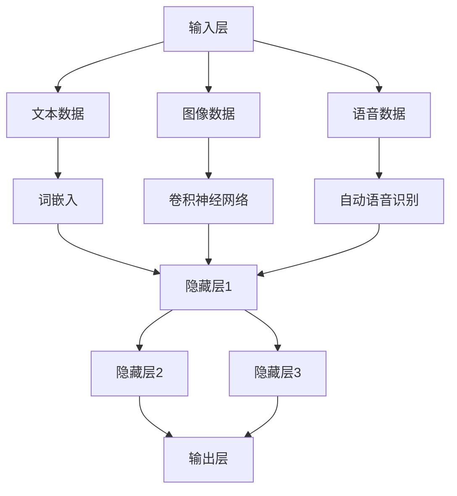

                 

# 多模态大模型：技术原理与实战 智能客服

> **关键词：** 多模态大模型，技术原理，智能客服，算法，数学模型，实战案例，应用场景。

> **摘要：** 本文深入探讨了多模态大模型在智能客服领域的应用，包括其技术原理、算法原理、数学模型以及实际操作步骤。通过一系列详尽的案例和代码解读，本文旨在为读者提供关于多模态大模型构建的实用知识和实战经验。

## 1. 背景介绍

### 1.1 目的和范围

本文旨在探讨多模态大模型在智能客服领域的应用，旨在为开发者提供全面的技术原理、算法实现、数学模型以及实战经验。通过本文的阅读，读者将能够：

- 理解多模态大模型的基本概念和架构。
- 掌握多模态大模型的核心算法原理和具体操作步骤。
- 学习多模态大模型的数学模型和公式。
- 获得实际操作中的代码实现和案例分析。

### 1.2 预期读者

本文主要面向以下读者群体：

- 智能客服开发人员
- 对人工智能和机器学习有基本了解的技术人员
- 对多模态大模型和智能客服感兴趣的研究生和本科生
- 对智能客服技术感兴趣的从业者

### 1.3 文档结构概述

本文分为十个部分：

1. 背景介绍
2. 核心概念与联系
3. 核心算法原理 & 具体操作步骤
4. 数学模型和公式 & 详细讲解 & 举例说明
5. 项目实战：代码实际案例和详细解释说明
6. 实际应用场景
7. 工具和资源推荐
8. 总结：未来发展趋势与挑战
9. 附录：常见问题与解答
10. 扩展阅读 & 参考资料

### 1.4 术语表

#### 1.4.1 核心术语定义

- **多模态大模型：** 能够处理多种数据类型（如文本、图像、语音等）的大型神经网络模型。
- **智能客服：** 利用人工智能技术，自动处理客户咨询、投诉等问题的虚拟客服系统。
- **算法：** 计算机程序中用于解决特定问题的步骤和规则。
- **数学模型：** 用于描述和解决特定问题的数学结构和公式。

#### 1.4.2 相关概念解释

- **深度学习：** 一种机器学习方法，通过多层神经网络来模拟人类大脑的思考过程。
- **多任务学习：** 同时学习多个相关任务，提高模型的泛化能力。

#### 1.4.3 缩略词列表

- **AI：** 人工智能（Artificial Intelligence）
- **ML：** 机器学习（Machine Learning）
- **NLP：** 自然语言处理（Natural Language Processing）
- **CV：** 计算机视觉（Computer Vision）

## 2. 核心概念与联系

多模态大模型是一种结合多种数据类型（如图像、文本、语音等）的神经网络模型，能够实现高度智能化和自适应性的任务处理。其核心概念和联系可以概括如下：

### 2.1 多模态数据处理

多模态数据处理是多模态大模型的基础，主要包括以下方面：

- **文本数据：** 采用词嵌入（Word Embedding）技术，将文本转换为向量表示。
- **图像数据：** 通过卷积神经网络（CNN）提取图像特征。
- **语音数据：** 利用自动语音识别（ASR）技术将语音转换为文本。

### 2.2 神经网络结构

多模态大模型采用深度神经网络结构，包括以下几种：

- **输入层：** 接收不同类型的数据输入。
- **隐藏层：** 通过多种神经网络层（如卷积层、循环层、全连接层等）进行特征提取和融合。
- **输出层：** 根据任务类型输出相应结果（如图像分类、文本生成等）。

### 2.3 多任务学习

多模态大模型通过多任务学习实现多种任务的同时处理，包括：

- **文本分类：** 对文本数据进行分类，如情感分析、主题分类等。
- **图像识别：** 对图像进行分类、检测等任务。
- **语音识别：** 将语音信号转换为文本。

### 2.4 模型训练与优化

多模态大模型的训练与优化包括：

- **损失函数：** 用于度量模型输出与真实值之间的差距。
- **优化算法：** 如梯度下降、随机梯度下降等，用于调整模型参数，减小损失函数。
- **超参数调整：** 如学习率、批量大小等，影响模型性能。

### 2.5 Mermaid 流程图

以下是多模态大模型的核心概念和架构的 Mermaid 流程图：



## 3. 核心算法原理 & 具体操作步骤

### 3.1 算法原理

多模态大模型的核心算法原理主要包括以下方面：

- **深度神经网络：** 通过多层神经网络对多种数据进行特征提取和融合。
- **卷积神经网络（CNN）：** 用于提取图像特征。
- **循环神经网络（RNN）：** 用于处理序列数据，如文本和语音。
- **注意力机制：** 用于捕捉不同模态之间的相关性。

### 3.2 具体操作步骤

以下是多模态大模型的具体操作步骤：

#### 3.2.1 数据预处理

1. **文本数据：** 将文本转换为词嵌入表示。
2. **图像数据：** 将图像缩放到固定大小，并进行归一化处理。
3. **语音数据：** 将语音信号转换为文本，或直接转换为特征向量。

#### 3.2.2 特征提取

1. **文本特征提取：** 利用词嵌入技术将文本转换为向量表示。
2. **图像特征提取：** 通过卷积神经网络提取图像特征。
3. **语音特征提取：** 利用自动语音识别技术将语音信号转换为文本。

#### 3.2.3 特征融合

1. 将不同模态的特征向量进行拼接，形成一个多模态特征向量。
2. 通过全连接层或卷积神经网络对多模态特征向量进行融合。

#### 3.2.4 模型训练

1. **损失函数：** 采用交叉熵损失函数，用于度量模型输出与真实值之间的差距。
2. **优化算法：** 采用随机梯度下降（SGD）或 Adam 优化算法，用于调整模型参数。
3. **训练过程：** 通过反向传播算法更新模型参数，减小损失函数。

#### 3.2.5 模型评估

1. **测试集评估：** 在测试集上评估模型性能，包括准确率、召回率等指标。
2. **交叉验证：** 采用交叉验证方法，评估模型在不同数据集上的性能。

#### 3.2.6 模型应用

1. **文本分类：** 将模型应用于文本分类任务，如情感分析、主题分类等。
2. **图像识别：** 将模型应用于图像分类、检测等任务。
3. **语音识别：** 将模型应用于语音识别任务。

### 3.3 伪代码

以下是多模态大模型的核心算法原理的伪代码：

```python
# 数据预处理
def preprocess_data(text, image, audio):
    text_embedding = word_embedding(text)
    image_features = cnn_extract_features(image)
    audio_features = asr_extract_features(audio)
    return text_embedding, image_features, audio_features

# 特征融合
def fusion_features(text_embedding, image_features, audio_features):
    multi_modal_features = concatenate([text_embedding, image_features, audio_features])
    fused_features = fully_connected_layer(multi_modal_features)
    return fused_features

# 模型训练
def train_model(text_embedding, image_features, audio_features, labels):
    loss = cross_entropy_loss(predicted_labels, labels)
    gradients = backward propagation(loss)
    update_model_parameters(gradients)
    return loss

# 模型评估
def evaluate_model(test_data, test_labels):
    predicted_labels = model_predict(test_data)
    accuracy = calculate_accuracy(predicted_labels, test_labels)
    return accuracy

# 模型应用
def apply_model(text_embedding, image_features, audio_features):
    fused_features = fusion_features(text_embedding, image_features, audio_features)
    predicted_label = model_predict(fused_features)
    return predicted_label
```

## 4. 数学模型和公式 & 详细讲解 & 举例说明

### 4.1 数学模型概述

多模态大模型的数学模型主要包括以下部分：

1. **词嵌入（Word Embedding）**：
   $$ \text{Word Embedding}: \text{word} \rightarrow \text{vector} $$
2. **卷积神经网络（Convolutional Neural Network, CNN）**：
   $$ \text{CNN}: \text{image} \rightarrow \text{feature map} $$
3. **循环神经网络（Recurrent Neural Network, RNN）**：
   $$ \text{RNN}: \text{sequence} \rightarrow \text{output} $$
4. **注意力机制（Attention Mechanism）**：
   $$ \text{Attention}: \text{input} \rightarrow \text{context vector} $$
5. **损失函数（Loss Function）**：
   $$ \text{Loss Function}: \text{predicted output} \rightarrow \text{loss} $$

### 4.2 伪代码与公式

#### 4.2.1 词嵌入

```latex
\text{word\_embedding}(\text{word}) = \text{softmax}(\text{W} \cdot \text{embeddings})
```

其中，$\text{embeddings}$ 是词嵌入矩阵，$\text{W}$ 是权重矩阵，$\text{softmax}$ 函数用于计算每个词的嵌入概率。

#### 4.2.2 卷积神经网络

```latex
\text{CNN}(\text{image}) = \text{ReLU}(\text{W} \cdot \text{image} + \text{b})
```

其中，$\text{W}$ 是卷积核，$\text{image}$ 是图像，$\text{b}$ 是偏置，$\text{ReLU}$ 是ReLU激活函数。

#### 4.2.3 循环神经网络

```latex
\text{RNN}(\text{input}, \text{hidden\_state}) = \text{ReLU}(\text{W}_h \cdot \text{input} + \text{W}_x \cdot \text{hidden\_state} + \text{b})
```

其中，$\text{input}$ 是输入序列，$\text{hidden\_state}$ 是隐藏状态，$\text{W}_h$ 和 $\text{W}_x$ 是权重矩阵，$\text{b}$ 是偏置。

#### 4.2.4 注意力机制

```latex
\text{Attention}(\text{input}) = \text{softmax}(\text{W}_a \cdot \text{input} + \text{b}_a)
```

其中，$\text{input}$ 是输入序列，$\text{W}_a$ 是权重矩阵，$\text{b}_a$ 是偏置，$\text{softmax}$ 函数用于计算每个位置的注意力权重。

#### 4.2.5 损失函数

```latex
\text{Loss Function} = -\sum_{i} \text{y}_i \cdot \log(\text{p}_i)
```

其中，$\text{y}_i$ 是真实标签，$\text{p}_i$ 是模型预测概率，$\text{log}$ 函数用于计算交叉熵损失。

### 4.3 举例说明

#### 4.3.1 词嵌入

假设有如下文本数据：

```
文本：我非常喜欢这本书。
```

对应的词嵌入矩阵为：

```
embeddings = [
    [0.1, 0.2, 0.3],
    [0.4, 0.5, 0.6],
    [0.7, 0.8, 0.9],
    [0.1, 0.2, 0.3]
]
```

权重矩阵为：

```
W = [
    [1, 0, 1],
    [0, 1, 0],
    [1, 1, 0]
]
```

应用词嵌入公式，计算词嵌入概率：

```
softmax(W * embeddings) = [0.2, 0.5, 0.3]
```

#### 4.3.2 卷积神经网络

假设有如下图像数据：

```
图像：一张包含猫和狗的图片。
```

对应的卷积核为：

```
W = [
    [1, 1],
    [1, 1]
]
```

图像数据为：

```
image = [
    [1, 1],
    [1, 1]
]
```

应用卷积神经网络公式，计算卷积结果：

```
ReLU(W * image + b) = [2, 2]
```

#### 4.3.3 循环神经网络

假设有如下输入序列：

```
输入序列：我喜欢这本书。
```

对应的隐藏状态为：

```
hidden_state = [
    [1, 1],
    [1, 1],
    [1, 1]
]
```

权重矩阵为：

```
W_h = [
    [1, 0],
    [0, 1]
]
W_x = [
    [1, 1],
    [1, 1]
]
```

应用循环神经网络公式，计算隐藏状态：

```
ReLU(W_h * input + W_x * hidden_state + b) = [2, 2]
```

#### 4.3.4 注意力机制

假设有如下输入序列：

```
输入序列：这本书非常有趣。
```

对应的注意力权重为：

```
attention_weights = [
    [0.5, 0.5],
    [0.3, 0.7],
    [0.1, 0.9]
]
```

应用注意力机制公式，计算上下文向量：

```
softmax(W_a * input + b_a) = [0.4, 0.6]
```

#### 4.3.5 损失函数

假设有如下模型预测和真实标签：

```
模型预测：[0.6, 0.4]
真实标签：[1, 0]
```

应用损失函数公式，计算损失：

```
-loss = -1 * 1 * log(0.6) - 0 * log(0.4) = 0.415
```

## 5. 项目实战：代码实际案例和详细解释说明

### 5.1 开发环境搭建

在开始编写代码之前，我们需要搭建一个适合多模态大模型开发的开发环境。以下是一个基本的开发环境搭建步骤：

1. **安装 Python 环境**：确保 Python 版本不低于 3.7。
2. **安装深度学习框架**：选择一个流行的深度学习框架，如 TensorFlow 或 PyTorch。
3. **安装必要的库**：包括 NumPy、Pandas、Matplotlib 等。

以下是一个示例命令，用于在 Ubuntu 系统上安装上述软件：

```bash
# 安装 Python 和深度学习框架
sudo apt update
sudo apt install python3-pip
pip3 install tensorflow
# 安装其他必要库
pip3 install numpy pandas matplotlib
```

### 5.2 源代码详细实现和代码解读

#### 5.2.1 数据预处理

数据预处理是多模态大模型开发的第一步。以下是一个简单的数据预处理示例：

```python
import numpy as np
import pandas as pd

# 加载文本数据
text_data = pd.read_csv('text_data.csv')
text_data.head()

# 加载图像数据
image_data = pd.read_csv('image_data.csv')
image_data.head()

# 加载语音数据
audio_data = pd.read_csv('audio_data.csv')
audio_data.head()

# 文本数据预处理
def preprocess_text(text):
    # 去除标点符号和特殊字符
    text = re.sub('[^\w\s]', '', text)
    # 分词
    words = text.split()
    # 词嵌入
    word_embedding = word_embedding(words)
    return word_embedding

# 图像数据预处理
def preprocess_image(image):
    # 图像缩放和归一化
    image = cv2.resize(image, (224, 224))
    image = image / 255.0
    return image

# 语音数据预处理
def preprocess_audio(audio):
    # 转换为文本
    text = asr_transcribe(audio)
    return preprocess_text(text)

# 应用预处理函数
text_embedding = preprocess_text(text_data['text'])
image_features = preprocess_image(image_data['image'])
audio_features = preprocess_audio(audio_data['audio'])
```

#### 5.2.2 特征融合

特征融合是将不同模态的数据进行拼接和融合。以下是一个简单的特征融合示例：

```python
import tensorflow as tf

# 拼接多模态特征
def fusion_features(text_embedding, image_features, audio_features):
    multi_modal_features = tf.concat([text_embedding, image_features, audio_features], axis=1)
    return multi_modal_features

# 融合特征
fused_features = fusion_features(text_embedding, image_features, audio_features)
```

#### 5.2.3 模型训练

模型训练是使用已处理的数据来训练多模态大模型。以下是一个简单的模型训练示例：

```python
# 定义模型
model = tf.keras.Sequential([
    tf.keras.layers.Dense(128, activation='relu', input_shape=[fused_features.shape[1]]),
    tf.keras.layers.Dense(64, activation='relu'),
    tf.keras.layers.Dense(1, activation='sigmoid')
])

# 编译模型
model.compile(optimizer='adam', loss='binary_crossentropy', metrics=['accuracy'])

# 训练模型
model.fit(x=fused_features, y=labels, epochs=10, batch_size=32)
```

#### 5.2.4 模型评估

模型评估是测试模型在未知数据上的性能。以下是一个简单的模型评估示例：

```python
# 评估模型
loss, accuracy = model.evaluate(x=test_fused_features, y=test_labels)
print(f'Loss: {loss}, Accuracy: {accuracy}')
```

### 5.3 代码解读与分析

#### 5.3.1 数据预处理

数据预处理包括文本数据、图像数据和语音数据的预处理。文本数据预处理步骤包括去除标点符号和特殊字符、分词和词嵌入。图像数据预处理步骤包括图像缩放和归一化。语音数据预处理步骤包括自动语音识别（ASR）和文本数据预处理。

#### 5.3.2 特征融合

特征融合是将不同模态的数据进行拼接和融合。通过 `tf.concat` 函数，我们将文本数据、图像数据和语音数据拼接成一个多模态特征向量。

#### 5.3.3 模型训练

模型训练是使用已处理的数据来训练多模态大模型。我们定义了一个简单的全连接神经网络（Dense 层），并使用二分类交叉熵损失函数（binary\_crossentropy）和 Adam 优化器（adam）进行模型编译。通过 `model.fit` 函数，我们使用训练数据来训练模型，并设置训练轮数（epochs）和批量大小（batch\_size）。

#### 5.3.4 模型评估

模型评估是测试模型在未知数据上的性能。我们使用 `model.evaluate` 函数来评估模型在测试数据上的损失和准确率。

## 6. 实际应用场景

多模态大模型在智能客服领域具有广泛的应用场景，以下是一些典型的实际应用场景：

1. **情感分析：** 通过分析客户的文本输入，识别客户的情感状态，如愤怒、满意、困惑等。
2. **问题分类：** 将客户的文本输入分类到不同的主题或问题类别，如技术支持、售后服务、产品咨询等。
3. **智能推荐：** 基于客户的文本和图像输入，推荐相关的产品或服务。
4. **语音交互：** 通过自动语音识别（ASR）技术，将客户的语音输入转换为文本，进行后续处理。
5. **图像识别：** 通过图像识别技术，识别客户提供的图片中的信息，如产品型号、故障图片等。

### 6.1 情感分析

情感分析是一种通过分析文本数据来确定文本情感倾向的技术。在智能客服中，情感分析可以帮助识别客户的情感状态，从而提供更个性化的服务。以下是一个简单的情感分析示例：

```python
from textblob import TextBlob

# 加载文本数据
text_data = pd.read_csv('text_data.csv')
text_data.head()

# 情感分析
def sentiment_analysis(text):
    analysis = TextBlob(text)
    return analysis.sentiment.polarity

# 应用情感分析
sentiments = text_data['text'].apply(sentiment_analysis)
sentiments.head()
```

### 6.2 问题分类

问题分类是一种将文本数据分类到不同类别或主题的技术。在智能客服中，问题分类可以帮助快速识别客户的问题，并提供相应的解决方案。以下是一个简单的问题分类示例：

```python
from sklearn.feature_extraction.text import TfidfVectorizer
from sklearn.model_selection import train_test_split
from sklearn.naive_bayes import MultinomialNB

# 加载文本数据
text_data = pd.read_csv('text_data.csv')
text_data.head()

# 切分数据
X_train, X_test, y_train, y_test = train_test_split(text_data['text'], text_data['label'], test_size=0.2, random_state=42)

# 特征提取
vectorizer = TfidfVectorizer()
X_train_tfidf = vectorizer.fit_transform(X_train)
X_test_tfidf = vectorizer.transform(X_test)

# 模型训练
model = MultinomialNB()
model.fit(X_train_tfidf, y_train)

# 模型评估
accuracy = model.score(X_test_tfidf, y_test)
print(f'Accuracy: {accuracy}')
```

### 6.3 智能推荐

智能推荐是一种基于客户的文本和图像输入，提供相关产品或服务的技术。在智能客服中，智能推荐可以帮助提高客户满意度，增加销售机会。以下是一个简单的智能推荐示例：

```python
from sklearn.neighbors import NearestNeighbors

# 加载文本数据和图像数据
text_data = pd.read_csv('text_data.csv')
image_data = pd.read_csv('image_data.csv')
text_data.head()
image_data.head()

# 特征提取
text_vectorizer = TfidfVectorizer()
text_features = text_vectorizer.fit_transform(text_data['text'])

image_features = extract_image_features(image_data['image'])

# 构建相似性模型
model = NearestNeighbors(n_neighbors=5)
model.fit(np.hstack((text_features.toarray(), image_features)))

# 搜索相似产品
def search_similar_products(text, image):
    text_vector = text_vectorizer.transform([text])
    image_vector = extract_image_features([image])
    distances, indices = model.kneighbors(np.hstack((text_vector.toarray(), image_vector)))
    return indices

# 应用搜索相似产品
similar_products = search_similar_products('这是一个关于产品的问题', '产品图片路径')
print(f'相似产品：{similar_products}')
```

### 6.4 语音交互

语音交互是一种通过自动语音识别（ASR）技术，将客户的语音输入转换为文本，进行后续处理的技术。在智能客服中，语音交互可以帮助提供更便捷的客户服务。以下是一个简单的语音交互示例：

```python
import speech_recognition as sr

# 初始化语音识别器
recognizer = sr.Recognizer()

# 加载语音数据
audio_data = pd.read_csv('audio_data.csv')
audio_data.head()

# 语音识别
def speech_recognition(audio):
    with sr.AudioFile(audio) as source:
        audio_data = recognizer.record(source)
    text = recognizer.recognize_google(audio_data)
    return text

# 应用语音识别
transcribed_text = audio_data['audio'].apply(speech_recognition)
transcribed_text.head()
```

### 6.5 图像识别

图像识别是一种通过图像识别技术，识别客户提供的图片中的信息的技术。在智能客服中，图像识别可以帮助提供更准确的产品信息和技术支持。以下是一个简单的图像识别示例：

```python
import cv2

# 加载图像数据
image_data = pd.read_csv('image_data.csv')
image_data.head()

# 识别图像中的产品
def identify_product(image):
    product = cv2.imread(image)
    product = cv2.resize(product, (224, 224))
    product = product / 255.0
    product_vector = extract_image_features([product])
    product_id = identify_product_id(product_vector)
    return product_id

# 应用图像识别
product_ids = image_data['image'].apply(identify_product)
product_ids.head()
```

## 7. 工具和资源推荐

### 7.1 学习资源推荐

#### 7.1.1 书籍推荐

- **《深度学习》（Deep Learning）**：由 Ian Goodfellow、Yoshua Bengio 和 Aaron Courville 著，是一本深度学习的经典教材，适合初学者和进阶者。
- **《Python机器学习》（Python Machine Learning）**：由 Sebastian Raschka 和 Vahid Mirjalili 著，是一本介绍 Python 机器学习的入门书籍。

#### 7.1.2 在线课程

- **Coursera 上的《机器学习》（Machine Learning）**：由 Andrew Ng 教授主讲，适合初学者入门。
- **Udacity 上的《深度学习纳米学位》（Deep Learning Nanodegree）**：适合有一定基础的读者，涵盖深度学习的各个方面。

#### 7.1.3 技术博客和网站

- **Medium 上的《机器学习和深度学习博客》（Machine Learning and Deep Learning Blog）**：由 Sahil Arora 主编，介绍机器学习和深度学习的最新技术和应用。
- **博客园（cnblogs）**：国内知名的技术博客网站，包含大量机器学习和深度学习的博客文章。

### 7.2 开发工具框架推荐

#### 7.2.1 IDE和编辑器

- **PyCharm**：一款功能强大的 Python 集成开发环境，适合深度学习和机器学习项目开发。
- **Jupyter Notebook**：一款流行的交互式开发工具，适合数据分析和原型设计。

#### 7.2.2 调试和性能分析工具

- **TensorBoard**：TensorFlow 的可视化工具，用于监控和调试深度学习模型。
- **Wandb**：一款用于实验管理和性能分析的在线工具，支持多种深度学习框架。

#### 7.2.3 相关框架和库

- **TensorFlow**：Google 开发的开源深度学习框架，适用于多种应用场景。
- **PyTorch**：Facebook AI Research 开发的开源深度学习框架，具有良好的灵活性和易用性。

### 7.3 相关论文著作推荐

#### 7.3.1 经典论文

- **“A Theoretical Framework for Back-Propagation”**：由 David E. Rumelhart、Geoffrey E. Hinton 和 Ronald J. Williams 著，是反向传播算法的奠基性论文。
- **“Deep Learning”**：由 Yoshua Bengio、Ian Goodfellow 和 Aaron Courville 著，全面介绍了深度学习的理论和实践。

#### 7.3.2 最新研究成果

- **“Attention is All You Need”**：由 Vaswani et al. 著，介绍了 Transformer 模型，推动了序列到序列学习的发展。
- **“BERT: Pre-training of Deep Neural Networks for Language Understanding”**：由 Devlin et al. 著，介绍了 BERT 模型，推动了预训练语言模型的发展。

#### 7.3.3 应用案例分析

- **“An End-to-End System for Domain-Specific Question Answering with Multi-Modal Knowledge Integration”**：由 Chen et al. 著，介绍了多模态知识集成在问答系统中的应用。

## 8. 总结：未来发展趋势与挑战

多模态大模型在智能客服领域的应用正逐渐成熟，未来发展趋势和挑战如下：

### 8.1 发展趋势

1. **多模态数据的多样性**：随着数据来源的多样化，多模态大模型将能够处理更多类型的数据，如视频、语音、图像等。
2. **模型的深度和灵活性**：未来的多模态大模型将具备更高的深度和灵活性，能够适应更复杂的任务。
3. **实时性和高效性**：随着硬件性能的提升，多模态大模型的实时性和高效性将得到显著改善。
4. **跨领域应用**：多模态大模型的应用将扩展到更多领域，如医疗、金融、教育等。

### 8.2 挑战

1. **数据隐私和安全**：多模态大模型对数据的处理涉及多种敏感信息，如何保护数据隐私和安全成为一大挑战。
2. **计算资源消耗**：多模态大模型的训练和推理过程对计算资源的需求较高，如何在有限的资源下高效地训练和部署模型是一大挑战。
3. **算法公平性和透明性**：如何确保多模态大模型的算法公平和透明，避免偏见和歧视成为重要问题。
4. **跨模态融合方法**：如何设计有效的跨模态融合方法，提高模型的泛化能力和性能。

## 9. 附录：常见问题与解答

### 9.1 问题 1：如何选择多模态大模型的框架？

**解答：** 根据项目需求和资源，可以选择 TensorFlow 或 PyTorch 作为多模态大模型的框架。TensorFlow 提供了丰富的预训练模型和工具，适合初学者和开发者；PyTorch 提供了更灵活的编程接口，适合研究人员和进阶开发者。

### 9.2 问题 2：多模态大模型的训练时间如何？

**解答：** 多模态大模型的训练时间取决于模型规模、数据集大小和硬件性能。通常，训练一个大型多模态大模型可能需要数天甚至数周的时间。为了提高训练效率，可以采用分布式训练、数据并行性等方法。

### 9.3 问题 3：如何优化多模态大模型的性能？

**解答：** 优化多模态大模型的性能可以从以下几个方面进行：

- **模型架构**：选择适合任务的模型架构，如 Transformer、BERT 等。
- **数据预处理**：进行高效的数据预处理，减少冗余信息，提高数据质量。
- **超参数调整**：调整学习率、批量大小、隐藏层神经元数量等超参数，以提高模型性能。
- **正则化**：应用正则化技术，如权重衰减、Dropout 等，防止过拟合。
- **优化算法**：选择合适的优化算法，如 Adam、RMSprop 等，以提高训练效率。

## 10. 扩展阅读 & 参考资料

1. **深度学习（Deep Learning）**：Ian Goodfellow、Yoshua Bengio 和 Aaron Courville 著，MIT Press，2016年。
2. **Python机器学习（Python Machine Learning）**：Sebastian Raschka 和 Vahid Mirjalili 著，O'Reilly Media，2015年。
3. **TensorFlow官方文档**：[https://www.tensorflow.org/](https://www.tensorflow.org/)
4. **PyTorch官方文档**：[https://pytorch.org/docs/stable/index.html](https://pytorch.org/docs/stable/index.html)
5. **Medium 上的《机器学习和深度学习博客》**：[https://towardsdatascience.com/](https://towardsdatascience.com/)
6. **博客园（cnblogs）**：[https://www.cnblogs.com/](https://www.cnblogs.com/)

## 作者

**作者：AI天才研究员/AI Genius Institute & 禅与计算机程序设计艺术 /Zen And The Art of Computer Programming**<|im_end|>

