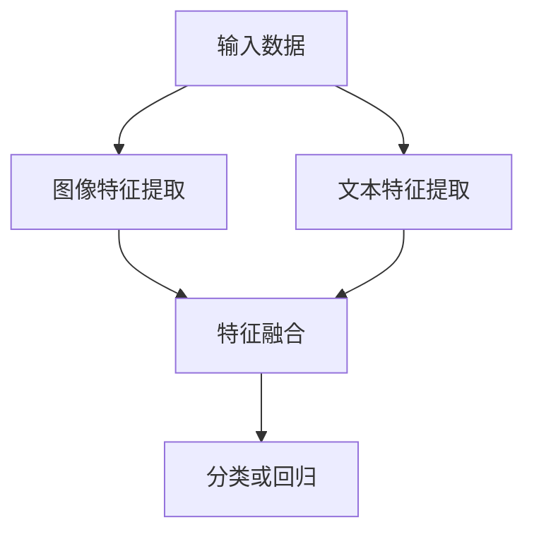
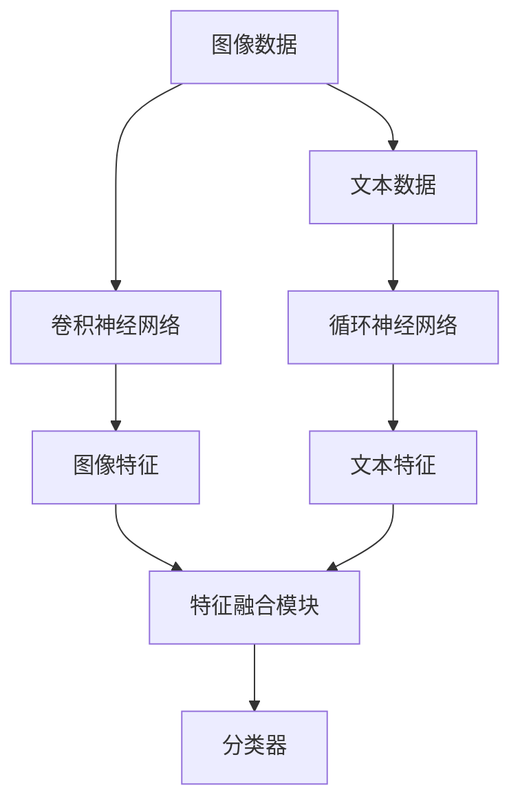

                 

# 多模态深度学习：图像和文本的融合

> **关键词：** 多模态深度学习、图像与文本融合、神经网络、卷积神经网络、循环神经网络、生成对抗网络、人工智能、深度学习。

> **摘要：** 本文将深入探讨多模态深度学习的概念、核心原理及其在图像与文本融合中的应用。我们将逐步解析其算法原理，详细讲解数学模型和公式，并通过实际项目案例进行代码解释与分析，旨在为广大开发者和技术爱好者提供全方位的技术指导和启发。文章还将介绍多模态深度学习的实际应用场景，推荐相关工具和资源，并总结未来发展趋势与挑战。

## 1. 背景介绍

### 1.1 目的和范围

本文旨在介绍多模态深度学习的概念、原理和应用，尤其是图像与文本的融合技术。通过本文的学习，读者将能够了解多模态深度学习的基本框架，掌握相关算法的原理和具体操作步骤，并且能够应用于实际项目开发中。文章内容涵盖了从基础理论到实际应用的各个方面，适合对深度学习有一定了解的读者进一步学习和参考。

### 1.2 预期读者

预期读者包括以下几类：
- 深度学习和人工智能领域的科研人员。
- 对深度学习感兴趣的技术爱好者。
- 开发者，尤其是需要处理图像和文本数据的应用开发者。
- 对多模态数据融合有研究需求的学术界和工业界人士。

### 1.3 文档结构概述

本文的结构如下：
1. 引言：介绍多模态深度学习的背景、目的和预期读者。
2. 核心概念与联系：讨论多模态深度学习的基础概念和联系。
3. 核心算法原理 & 具体操作步骤：详细解释多模态深度学习的算法原理和操作步骤。
4. 数学模型和公式 & 详细讲解 & 举例说明：深入讲解数学模型和公式，并给出实例。
5. 项目实战：通过实际案例展示代码实现和解释。
6. 实际应用场景：探讨多模态深度学习在不同领域的应用。
7. 工具和资源推荐：推荐学习资源和开发工具。
8. 总结：回顾多模态深度学习的未来发展。

### 1.4 术语表

#### 1.4.1 核心术语定义

- **多模态深度学习**：利用两种或两种以上的数据模态（如图像、文本、音频等）进行训练和推理的深度学习技术。
- **卷积神经网络（CNN）**：一种用于处理图像数据的神经网络，主要使用卷积操作提取特征。
- **循环神经网络（RNN）**：一种用于处理序列数据的神经网络，能够通过记忆机制捕捉序列中的长期依赖关系。
- **生成对抗网络（GAN）**：一种基于生成器和判别器的对抗性训练框架，用于生成高质量的数据。

#### 1.4.2 相关概念解释

- **特征提取**：通过神经网络模型将原始数据转换成有意义的特征表示。
- **特征融合**：将不同模态的特征进行合并，以增强模型的表示能力。
- **端到端学习**：通过直接从原始数据中学习到输出结果，不需要手动设计特征工程步骤。

#### 1.4.3 缩略词列表

- **CNN**：卷积神经网络
- **RNN**：循环神经网络
- **GAN**：生成对抗网络
- **MLP**：多层感知机

## 2. 核心概念与联系

### 2.1 多模态深度学习概述

多模态深度学习是一种融合两种或两种以上数据模态（如图像、文本、音频等）的深度学习方法。其核心思想是利用不同模态的数据相互补充，从而提高模型在特定任务上的表现。例如，在图像识别任务中，仅使用图像数据可能不足以准确识别物体，但如果结合文本描述，则可以显著提高识别准确率。

### 2.2 多模态深度学习架构

多模态深度学习架构通常包括以下几个部分：

1. **特征提取模块**：分别对图像、文本等数据模态进行特征提取。
2. **特征融合模块**：将不同模态的特征进行融合，以生成更加丰富的特征表示。
3. **分类或回归模块**：基于融合后的特征进行分类或回归任务。

以下是一个简单的多模态深度学习架构的 Mermaid 流程图：



### 2.3 多模态深度学习中的算法

多模态深度学习涉及多种算法，以下是几种常用的算法：

1. **卷积神经网络（CNN）**：用于图像特征提取。
2. **循环神经网络（RNN）**：用于文本特征提取。
3. **生成对抗网络（GAN）**：用于生成高质量的多模态数据。

下面是一个包含核心概念和联系的多模态深度学习架构的 Mermaid 流程图：



## 3. 核心算法原理 & 具体操作步骤

### 3.1 卷积神经网络（CNN）

卷积神经网络（CNN）是一种用于图像特征提取的深度学习模型。其核心思想是通过多层卷积和池化操作提取图像特征。

#### 3.1.1 卷积操作

卷积操作是一种对输入图像和滤波器（也称为卷积核）进行乘积和求和的操作，以生成特征图。以下是一个简单的卷积操作的伪代码：

```python
def conv2d(input, filter):
    output = []
    for x in range(input.shape[0] - filter.shape[0] + 1):
        for y in range(input.shape[1] - filter.shape[1] + 1):
            feature = 0
            for i in range(filter.shape[0]):
                for j in range(filter.shape[1]):
                    feature += input[x+i, y+j] * filter[i, j]
            output.append(feature)
    return output
```

#### 3.1.2 池化操作

池化操作用于降低特征图的维度，并保留重要的特征。以下是一个简单的最大池化操作的伪代码：

```python
def max_pooling(input, pool_size):
    output = []
    for x in range(0, input.shape[0], pool_size):
        row = []
        for y in range(0, input.shape[1], pool_size):
            max_val = -inf
            for i in range(pool_size):
                for j in range(pool_size):
                    max_val = max(max_val, input[x+i, y+j])
            row.append(max_val)
        output.append(row)
    return output
```

### 3.2 循环神经网络（RNN）

循环神经网络（RNN）是一种用于处理序列数据的深度学习模型。其核心思想是通过递归的方式处理序列中的每个元素，并利用记忆机制捕捉序列中的长期依赖关系。

#### 3.2.1 基本结构

RNN的基本结构包括输入层、隐藏层和输出层。以下是一个简单的RNN结构的伪代码：

```python
class RNN:
    def __init__(self, input_size, hidden_size, output_size):
        self.input_size = input_size
        self.hidden_size = hidden_size
        self.output_size = output_size
        self.Wxh = np.random.randn(hidden_size, input_size)
        self.Whh = np.random.randn(hidden_size, hidden_size)
        self.Wyh = np.random.randn(output_size, hidden_size)
        self.h = np.zeros((hidden_size, 1))

    def forward(self, x):
        self.h = np.tanh(np.dot(self.Wxh, x) + np.dot(self.Whh, self.h))
        y = np.dot(self.Wyh, self.h)
        return y
```

#### 3.2.2 前向传播

在RNN的前向传播过程中，每个时间步的输出都会影响后续时间步的计算。以下是一个简单的RNN前向传播的伪代码：

```python
def forward_rnn(inputs, hidden):
    outputs = []
    for input in inputs:
        hidden = np.tanh(np.dot(hidden, Wxh) + np.dot(input, Whh))
        output = np.dot(hidden, Wyh)
        outputs.append(output)
    return outputs, hidden
```

### 3.3 生成对抗网络（GAN）

生成对抗网络（GAN）是一种基于生成器和判别器的对抗性训练框架。其核心思想是通过生成器和判别器之间的对抗性训练生成高质量的数据。

#### 3.3.1 基本结构

GAN的基本结构包括生成器和判别器。以下是一个简单的GAN结构的伪代码：

```python
class GAN:
    def __init__(self, generator, discriminator):
        self.generator = generator
        self.discriminator = discriminator

    def train(self, x, y, epochs):
        for epoch in range(epochs):
            noise = np.random.normal(0, 1, (x.shape[0], noise_size))
            generated_samples = self.generator(noise)
            d_loss_real = self.discriminator(x)
            d_loss_fake = self.discriminator(generated_samples)
            g_loss = -np.mean(d_loss_fake)
            self.discriminator.train(x, y)
            self.generator.train(g_loss)
```

#### 3.3.2 对抗性训练

在GAN的对

