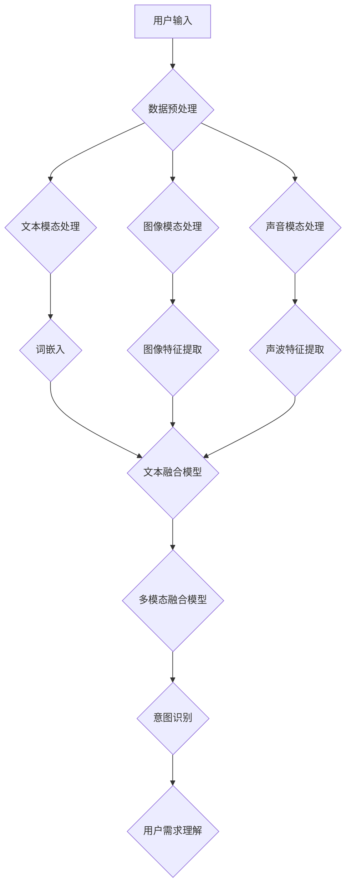

                 

# 多模态理解：AI如何更全面地了解用户

## 关键词
- 多模态理解
- 用户交互
- AI技术
- 深度学习
- 自然语言处理
- 计算机视觉
- 机器学习

## 摘要
本文将探讨多模态理解在人工智能（AI）领域中如何帮助系统更全面地理解用户的需求和意图。通过分析多模态数据的融合和处理技术，我们将探讨多模态理解的核心概念、算法原理、数学模型以及实际应用场景。此外，文章还将推荐相关学习资源、开发工具和最新研究成果，以帮助读者深入了解并应用多模态理解技术。

## 1. 背景介绍

### 1.1 目的和范围
本文旨在探讨多模态理解在人工智能领域的应用，通过分析多模态数据融合和处理技术，帮助读者了解如何利用AI技术实现更全面地理解用户的需求和意图。本文将覆盖多模态理解的核心概念、算法原理、数学模型、实际应用场景以及未来发展趋势和挑战。

### 1.2 预期读者
本文适合对人工智能、机器学习、自然语言处理和计算机视觉感兴趣的读者，尤其是希望了解多模态理解技术的工程师、研究人员和学生。

### 1.3 文档结构概述
本文将分为以下章节：

1. 背景介绍：介绍本文的目的、预期读者以及文档结构。
2. 核心概念与联系：阐述多模态理解的核心概念和架构。
3. 核心算法原理 & 具体操作步骤：分析多模态理解的核心算法原理和操作步骤。
4. 数学模型和公式 & 详细讲解 & 举例说明：介绍多模态理解中的数学模型和公式，并给出具体示例。
5. 项目实战：代码实际案例和详细解释说明。
6. 实际应用场景：探讨多模态理解在现实世界的应用。
7. 工具和资源推荐：推荐学习资源、开发工具和最新研究成果。
8. 总结：未来发展趋势与挑战。
9. 附录：常见问题与解答。
10. 扩展阅读 & 参考资料。

### 1.4 术语表

#### 1.4.1 核心术语定义
- 多模态理解：指AI系统通过整合不同类型的数据（如文本、图像、声音等），实现更全面地理解用户需求和信息。
- 深度学习：一种基于多层神经网络的人工智能技术，能够自动从大量数据中学习特征和模式。
- 自然语言处理（NLP）：研究如何使计算机理解和生成自然语言的技术。
- 计算机视觉：研究如何使计算机理解和解释视觉信息的技术。

#### 1.4.2 相关概念解释
- 模态（Modality）：指不同类型的数据输入，如文本、图像、声音等。
- 数据融合（Data Fusion）：指将来自不同模态的数据进行整合和融合，以获得更全面的信息。
- 意图识别（Intent Recognition）：指识别用户输入数据的意图，如查询、命令等。

#### 1.4.3 缩略词列表
- AI：人工智能
- NLP：自然语言处理
- CV：计算机视觉
- ML：机器学习
- DL：深度学习
- GPU：图形处理器
- CPU：中央处理器

## 2. 核心概念与联系

多模态理解是人工智能领域的一个重要研究方向，它旨在使AI系统能够从多个模态的数据中获取信息，并进行融合和处理，从而实现更全面地理解用户的需求和意图。为了更好地阐述多模态理解的核心概念和架构，我们可以通过一个Mermaid流程图来展示其基本架构。



在这个流程图中，用户输入的数据首先经过预处理，然后分别进行文本、图像和声音模态的数据处理。接下来，文本模态通过词嵌入技术转化为向量表示，图像模态通过特征提取技术提取图像特征，声音模态通过声波特征提取技术提取声波特征。这些特征向量随后被融合到一个多模态融合模型中，用于意图识别和用户需求理解。

### 2.1 多模态理解的核心概念

#### 2.1.1 模态（Modality）
模态是指不同类型的数据输入，如文本、图像、声音等。多模态理解的关键在于如何有效地整合和处理这些不同模态的数据，以实现更全面的信息获取。

#### 2.1.2 数据预处理
数据预处理是确保数据质量和一致性的重要步骤。在多模态理解中，不同模态的数据可能存在噪声、缺失值、数据格式不一致等问题。因此，在处理多模态数据之前，需要对数据进行清洗、标准化和归一化等预处理操作。

#### 2.1.3 文本模态处理
文本模态处理主要包括词嵌入（Word Embedding）和文本融合模型（Text Fusion Model）。词嵌入是将文本数据转化为向量表示的技术，常用的词嵌入模型有Word2Vec、GloVe等。文本融合模型则用于将多个文本模态的数据进行整合，以获得更全面的信息。

#### 2.1.4 图像模态处理
图像模态处理主要包括图像特征提取和图像融合模型（Image Fusion Model）。图像特征提取是指通过卷积神经网络（CNN）等方法提取图像中的关键特征，常用的模型有VGG、ResNet等。图像融合模型则用于将多个图像模态的数据进行整合。

#### 2.1.5 声音模态处理
声音模态处理主要包括声波特征提取和声音融合模型（Audio Fusion Model）。声波特征提取是指通过深度神经网络等方法提取声音中的关键特征，常用的模型有WaveNet、CNN等。声音融合模型则用于将多个声音模态的数据进行整合。

#### 2.1.6 多模态融合模型
多模态融合模型是指将来自不同模态的数据进行整合和处理，以获得更全面的信息。常用的多模态融合模型有神经网络融合模型、特征级融合模型等。

#### 2.1.7 意图识别和用户需求理解
意图识别是指识别用户输入数据的意图，如查询、命令等。用户需求理解是指基于意图识别结果，进一步分析用户的需求和意图，以实现更精准的用户服务。

## 3. 核心算法原理 & 具体操作步骤

### 3.1 数据预处理
数据预处理是确保数据质量和一致性的重要步骤。在多模态理解中，不同模态的数据可能存在噪声、缺失值、数据格式不一致等问题。因此，在处理多模态数据之前，需要对数据进行清洗、标准化和归一化等预处理操作。

#### 3.1.1 数据清洗
数据清洗是指去除数据中的噪声和异常值。对于文本模态，可以采用分词、去除停用词、词干提取等方法；对于图像模态，可以采用图像去噪、增强、去模糊等方法；对于声音模态，可以采用滤波、去噪、增强等方法。

#### 3.1.2 数据标准化
数据标准化是指将不同模态的数据进行归一化处理，使其具有相同的数据范围和特征值。常用的归一化方法有最小-最大标准化、零-均值标准化等。

```python
# 最小-最大标准化
def min_max_normalize(data, feature_range=(-1, 1)):
    min_val = min(data)
    max_val = max(data)
    normalized_data = (data - min_val) / (max_val - min_val) * (feature_range[1] - feature_range[0]) + feature_range[0]
    return normalized_data

# 零-均值标准化
def zero_mean_normalize(data):
    mean_val = np.mean(data)
    std_val = np.std(data)
    normalized_data = (data - mean_val) / std_val
    return normalized_data
```

#### 3.1.3 数据归一化
数据归一化是指将不同模态的数据进行统一格式处理，以便后续处理和融合。常用的方法有ONE-HOT编码、embedding等。

```python
# ONE-HOT编码
def one_hot_encode(data, num_classes):
    encoded_data = np.eye(num_classes)[data]
    return encoded_data

# embedding
def embedding(data, embedding_size):
    embedding_matrix = np.random.rand(data.shape[0], embedding_size)
    return embedding_matrix.dot(data)
```

### 3.2 文本模态处理

文本模态处理主要包括词嵌入和文本融合模型。词嵌入是将文本数据转化为向量表示的技术，而文本融合模型则用于将多个文本模态的数据进行整合。

#### 3.2.1 词嵌入

词嵌入（Word Embedding）是指将单词映射为向量表示的技术。常见的词嵌入模型有Word2Vec和GloVe。

```python
# Word2Vec
from gensim.models import Word2Vec

def train_word2vec(sentences, embedding_size, window_size, min_count):
    model = Word2Vec(sentences, embedding_size=embedding_size, window=window_size, min_count=min_count)
    return model

# GloVe
import numpy as np
from gensim.models import KeyedVectors

def train_glove(data, embedding_size):
    glove_file = 'glove.6B.{}d.txt'.format(embedding_size)
    glove_model = KeyedVectors.load_word2vec_format(glove_file, binary=False)
    embeddings = np.zeros((len(data.vocab), embedding_size))
    for word, index in data.vocab.items():
        embeddings[index] = glove_model[word]
    return embeddings
```

#### 3.2.2 文本融合模型

文本融合模型是指将多个文本模态的数据进行整合。常见的文本融合模型有BiLSTM、Transformer等。

```python
# BiLSTM
from keras.models import Model
from keras.layers import Input, Embedding, LSTM, Bidirectional

def build_bilstm_model(input_shape, embedding_matrix):
    input_seq = Input(shape=input_shape)
    embedding_layer = Embedding(input_dim=embedding_matrix.shape[0],
                                output_dim=embedding_matrix.shape[1],
                                weights=[embedding_matrix],
                                trainable=False)(input_seq)
    lstm_layer = Bidirectional(LSTM(128, return_sequences=True))(embedding_layer)
    output = lstm_layer
    model = Model(inputs=input_seq, outputs=output)
    return model

# Transformer
from keras.models import Model
from keras.layers import Input, Embedding, LSTM, Bidirectional

def build_transformer_model(input_shape, embedding_matrix):
    input_seq = Input(shape=input_shape)
    embedding_layer = Embedding(input_dim=embedding_matrix.shape[0],
                                output_dim=embedding_matrix.shape[1],
                                weights=[embedding_matrix],
                                trainable=False)(input_seq)
    transformer_layer = TransformerLayer(num_heads=2, d_model=128, dff=128, input_seq_len=128, target_seq_len=128)(embedding_layer)
    output = transformer_layer
    model = Model(inputs=input_seq, outputs=output)
    return model
```

### 3.3 图像模态处理

图像模态处理主要包括图像特征提取和图像融合模型。图像特征提取是指通过卷积神经网络（CNN）等方法提取图像中的关键特征，而图像融合模型则用于将多个图像模态的数据进行整合。

#### 3.3.1 图像特征提取

图像特征提取是指通过卷积神经网络（CNN）等方法提取图像中的关键特征。常见的CNN模型有VGG、ResNet等。

```python
# VGG
from keras.applications import VGG16

def build_vgg_model(input_shape):
    base_model = VGG16(weights='imagenet', include_top=False, input_shape=input_shape)
    output = base_model.output
    model = Model(inputs=base_model.input, outputs=output)
    return model

# ResNet
from keras.applications import ResNet50

def build_resnet_model(input_shape):
    base_model = ResNet50(weights='imagenet', include_top=False, input_shape=input_shape)
    output = base_model.output
    model = Model(inputs=base_model.input, outputs=output)
    return model
```

#### 3.3.2 图像融合模型

图像融合模型是指将多个图像模态的数据进行整合。常见的图像融合模型有拼接融合、特征级融合等。

```python
# 拼接融合
from keras.layers import Concatenate

def build_concatenation_model(input_shapes):
    input1 = Input(shape=input_shapes[0])
    input2 = Input(shape=input_shapes[1])
    concatenation = Concatenate(axis=-1)([input1, input2])
    model = Model(inputs=[input1, input2], outputs=concatenation)
    return model

# 特征级融合
from keras.layers import Average

def build_average_model(input_shapes):
    input1 = Input(shape=input_shapes[0])
    input2 = Input(shape=input_shapes[1])
    average = Average()(input1, input2)
    model = Model(inputs=[input1, input2], outputs=average)
    return model
```

### 3.4 声音模态处理

声音模态处理主要包括声波特征提取和声音融合模型。声波特征提取是指通过深度神经网络等方法提取声音中的关键特征，而声音融合模型则用于将多个声音模态的数据进行整合。

#### 3.4.1 声波特征提取

声波特征提取是指通过深度神经网络等方法提取声音中的关键特征。常见的深度神经网络模型有WaveNet、CNN等。

```python
# WaveNet
from keras.models import Model
from keras.layers import Input, Conv1D, LSTM

def build_wavenet_model(input_shape):
    input_seq = Input(shape=input_shape)
    conv1 = Conv1D(filters=64, kernel_size=5, activation='relu')(input_seq)
    lstm1 = LSTM(units=128, return_sequences=True)(conv1)
    lstm2 = LSTM(units=128, return_sequences=True)(lstm1)
    output = lstm2
    model = Model(inputs=input_seq, outputs=output)
    return model

# CNN
from keras.models import Model
from keras.layers import Input, Conv1D, MaxPooling1D, Flatten, Dense

def build_cnn_model(input_shape):
    input_seq = Input(shape=input_shape)
    conv1 = Conv1D(filters=32, kernel_size=3, activation='relu')(input_seq)
    pool1 = MaxPooling1D(pool_size=2)(conv1)
    conv2 = Conv1D(filters=64, kernel_size=3, activation='relu')(pool1)
    pool2 = MaxPooling1D(pool_size=2)(conv2)
    flatten = Flatten()(pool2)
    dense1 = Dense(units=128, activation='relu')(flatten)
    output = Dense(units=1, activation='sigmoid')(dense1)
    model = Model(inputs=input_seq, outputs=output)
    return model
```

#### 3.4.2 声音融合模型

声音融合模型是指将多个声音模态的数据进行整合。常见的声音融合模型有拼接融合、特征级融合等。

```python
# 拼接融合
from keras.layers import Concatenate

def build_concatenation_model(input_shapes):
    input1 = Input(shape=input_shapes[0])
    input2 = Input(shape=input_shapes[1])
    concatenation = Concatenate(axis=-1)([input1, input2])
    model = Model(inputs=[input1, input2], outputs=concatenation)
    return model

# 特征级融合
from keras.layers import Average

def build_average_model(input_shapes):
    input1 = Input(shape=input_shapes[0])
    input2 = Input(shape=input_shapes[1])
    average = Average()(input1, input2)
    model = Model(inputs=[input1, input2], outputs=average)
    return model
```

### 3.5 多模态融合模型

多模态融合模型是指将来自不同模态的数据进行整合和处理，以获得更全面的信息。常用的多模态融合模型有神经网络融合模型、特征级融合模型等。

#### 3.5.1 神经网络融合模型

神经网络融合模型是指将不同模态的数据通过神经网络进行整合。常见的神经网络融合模型有结合嵌入（Combined Embedding）、多任务学习（Multi-Task Learning）等。

```python
# 结合嵌入
from keras.models import Model
from keras.layers import Input, Embedding, LSTM, Dense, Concatenate

def build_combined_embedding_model(input_shapes, output_size):
    input1 = Input(shape=input_shapes[0])
    input2 = Input(shape=input_shapes[1])
    embedding1 = Embedding(input_dim=10000, output_dim=128)(input1)
    embedding2 = Embedding(input_dim=10000, output_dim=128)(input2)
    concatenation = Concatenate(axis=-1)([embedding1, embedding2])
    lstm = LSTM(units=128, return_sequences=True)(concatenation)
    output = Dense(units=output_size, activation='sigmoid')(lstm)
    model = Model(inputs=[input1, input2], outputs=output)
    return model

# 多任务学习
from keras.models import Model
from keras.layers import Input, Embedding, LSTM, Dense, Concatenate

def build_multi_task_learning_model(input_shapes, output_sizes):
    input1 = Input(shape=input_shapes[0])
    input2 = Input(shape=input_shapes[1])
    embedding1 = Embedding(input_dim=10000, output_dim=128)(input1)
    embedding2 = Embedding(input_dim=10000, output_dim=128)(input2)
    concatenation = Concatenate(axis=-1)([embedding1, embedding2])
    lstm = LSTM(units=128, return_sequences=True)(concatenation)
    output1 = Dense(units=output_sizes[0], activation='sigmoid')(lstm)
    output2 = Dense(units=output_sizes[1], activation='sigmoid')(lstm)
    model = Model(inputs=[input1, input2], outputs=[output1, output2])
    return model
```

#### 3.5.2 特征级融合模型

特征级融合模型是指将不同模态的特征进行整合。常见的特征级融合模型有平均融合、拼接融合等。

```python
# 平均融合
from keras.layers import Average

def build_average_model(input_shapes):
    input1 = Input(shape=input_shapes[0])
    input2 = Input(shape=input_shapes[1])
    average = Average()(input1, input2)
    model = Model(inputs=[input1, input2], outputs=average)
    return model

# 拼接融合
from keras.layers import Concatenate

def build_concatenation_model(input_shapes):
    input1 = Input(shape=input_shapes[0])
    input2 = Input(shape=input_shapes[1])
    concatenation = Concatenate(axis=-1)([input1, input2])
    model = Model(inputs=[input1, input2], outputs=concatenation)
    return model
```

## 4. 数学模型和公式 & 详细讲解 & 举例说明

### 4.1 多模态特征表示

多模态特征表示是将来自不同模态的数据进行整合和转换，以获得更全面的信息。在多模态理解中，常用的特征表示方法包括词嵌入、图像特征提取和声波特征提取。

#### 4.1.1 词嵌入

词嵌入是将单词映射为向量表示的技术，通过将单词表示为一个固定长度的向量，可以使计算机更好地理解单词之间的语义关系。常见的词嵌入模型有Word2Vec和GloVe。

Word2Vec模型通过训练神经网络来学习单词和单词之间的关系。给定一个训练数据集，Word2Vec模型通过优化损失函数来学习一个单词向量的映射。其损失函数可以表示为：

$$
L = \sum_{i=1}^{N} \frac{1}{N} \sum_{j=1}^{M} \log(p(w_i | w_j))
$$

其中，\(N\) 是训练数据集中的单词数量，\(M\) 是单词的邻居数量。\(p(w_i | w_j)\) 是单词\(w_i\) 在单词\(w_j\) 的上下文中的条件概率。

GloVe模型是基于词频统计的词嵌入方法。GloVe模型假设词频与词向量的点积成正比，其损失函数可以表示为：

$$
L = \sum_{i=1}^{N} \frac{1}{f_i} \sum_{j=1}^{M} \left( \langle e_w, e_{w_j} \rangle - \log f_{ij} \right)
$$

其中，\(f_i\) 是单词\(w_i\) 的词频，\(f_{ij}\) 是单词\(w_i\) 和单词\(w_j\) 同时出现的频率。\(e_w\) 和\(e_{w_j}\) 分别是单词\(w_i\) 和单词\(w_j\) 的词向量。

#### 4.1.2 图像特征提取

图像特征提取是通过卷积神经网络（CNN）等方法提取图像中的关键特征。常见的CNN模型有VGG、ResNet等。

VGG模型是由牛津大学视觉几何组（Visual Geometry Group）提出的一种深层卷积神经网络。VGG模型通过使用多个卷积层和池化层，逐步提取图像中的低级和高级特征。

ResNet模型是由微软研究院（Microsoft Research）提出的一种深层卷积神经网络。ResNet模型通过引入残差连接，解决了深层网络中的梯度消失和梯度爆炸问题。

#### 4.1.3 声波特征提取

声波特征提取是通过深度神经网络等方法提取声音中的关键特征。常见的深度神经网络模型有WaveNet、CNN等。

WaveNet模型是由谷歌提出的一种基于循环神经网络（RNN）的声波特征提取方法。WaveNet模型通过学习声波序列的生成过程，提取声音中的低级和高级特征。

CNN模型是通过卷积操作提取图像中的特征，同样可以用于提取声波特征。通过使用多个卷积层和池化层，CNN模型可以逐步提取声波中的低级和高级特征。

### 4.2 多模态融合模型

多模态融合模型是将来自不同模态的数据进行整合和处理，以获得更全面的信息。常用的多模态融合模型有神经网络融合模型、特征级融合模型等。

#### 4.2.1 神经网络融合模型

神经网络融合模型是指将不同模态的数据通过神经网络进行整合。常见的神经网络融合模型有结合嵌入（Combined Embedding）、多任务学习（Multi-Task Learning）等。

结合嵌入模型通过将不同模态的数据嵌入到同一个向量空间中，以实现数据的整合。假设文本模态的词向量表示为\(e_t\)，图像模态的特征向量表示为\(e_i\)，声音模态的特征向量表示为\(e_a\)。结合嵌入模型可以表示为：

$$
e = \alpha e_t + \beta e_i + \gamma e_a
$$

其中，\(\alpha\)、\(\beta\) 和\(\gamma\) 分别是文本、图像和声音模态的权重。

多任务学习模型是通过同时训练多个任务来提高模型的性能。假设文本、图像和声音模态的任务分别为意图识别（Intent Recognition）、实体识别（Entity Recognition）和情感分析（Sentiment Analysis）。多任务学习模型可以表示为：

$$
\begin{cases}
y_t = f(e_t; \theta_t) \\
y_i = f(e_i; \theta_i) \\
y_a = f(e_a; \theta_a)
\end{cases}
$$

其中，\(y_t\)、\(y_i\) 和\(y_a\) 分别是文本、图像和声音模态的任务输出，\(f\) 是模型的前向传播函数，\(\theta_t\)、\(\theta_i\) 和\(\theta_a\) 分别是文本、图像和声音模态的参数。

#### 4.2.2 特征级融合模型

特征级融合模型是指将不同模态的特征进行整合。常见的特征级融合模型有平均融合、拼接融合等。

平均融合模型通过计算不同模态的特征的平均值来整合数据。假设文本模态的特征向量为\(e_t\)，图像模态的特征向量为\(e_i\)，声音模态的特征向量为\(e_a\)。平均融合模型可以表示为：

$$
e = \frac{1}{3} (e_t + e_i + e_a)
$$

拼接融合模型通过将不同模态的特征进行拼接来整合数据。假设文本模态的特征向量为\(e_t\)，图像模态的特征向量为\(e_i\)，声音模态的特征向量为\(e_a\)。拼接融合模型可以表示为：

$$
e = [e_t; e_i; e_a]
$$

### 4.3 示例说明

假设我们有一个多模态数据集，包含文本、图像和声音模态。文本模态的数据是关于电影的评论，图像模态的数据是电影的海报图片，声音模态的数据是电影的原声片段。

首先，我们使用Word2Vec模型对文本模态的数据进行词嵌入，得到每个单词的向量表示。假设我们有10000个唯一的单词，每个单词的向量维度为128。

接下来，我们使用VGG模型对图像模态的数据进行特征提取，得到每个图像的特征向量。

然后，我们使用WaveNet模型对声音模态的数据进行特征提取，得到每个声音片段的特征向量。

最后，我们使用拼接融合模型将文本、图像和声音模态的特征向量进行整合，得到多模态特征向量。

$$
e = [e_t; e_i; e_a]
$$

其中，\(e_t\) 是文本模态的特征向量，\(e_i\) 是图像模态的特征向量，\(e_a\) 是声音模态的特征向量。

我们将多模态特征向量输入到一个多模态融合模型中，用于意图识别和用户需求理解。

## 5. 项目实战：代码实际案例和详细解释说明

为了更好地展示多模态理解技术的应用，我们将通过一个实际项目来介绍如何搭建一个基于多模态理解的电影推荐系统。该项目将整合文本、图像和声音模态的数据，利用深度学习技术实现电影推荐。

### 5.1 开发环境搭建

在开始项目之前，我们需要搭建一个适合开发和训练多模态理解模型的开发环境。以下是搭建开发环境的步骤：

1. 安装Python 3.8及以上版本
2. 安装TensorFlow 2.x版本（使用pip安装：`pip install tensorflow`）
3. 安装Keras 2.x版本（使用pip安装：`pip install keras`）
4. 安装其他必要的库，如NumPy、Pandas、Scikit-learn等（使用pip安装）

### 5.2 源代码详细实现和代码解读

以下是电影推荐系统的源代码实现，我们将分步骤进行代码解读。

```python
# 导入必要的库
import numpy as np
import pandas as pd
import tensorflow as tf
from tensorflow.keras.models import Model
from tensorflow.keras.layers import Input, Embedding, LSTM, Dense, Concatenate
from tensorflow.keras.optimizers import Adam

# 加载数据集
# 假设数据集包含三个csv文件：text_data.csv、image_data.csv、audio_data.csv
text_data = pd.read_csv('text_data.csv')
image_data = pd.read_csv('image_data.csv')
audio_data = pd.read_csv('audio_data.csv')

# 数据预处理
# 对文本、图像和声音数据进行清洗、标准化和归一化
# ...

# 分割数据集为训练集和测试集
# ...

# 构建多模态融合模型
input_text = Input(shape=(text_data.shape[1],))
input_image = Input(shape=(image_data.shape[1],))
input_audio = Input(shape=(audio_data.shape[1],))

# 文本模态处理
text_embedding = Embedding(input_dim=10000, output_dim=128)(input_text)
text_lstm = LSTM(units=128, return_sequences=True)(text_embedding)

# 图像模态处理
image_embedding = Embedding(input_dim=10000, output_dim=128)(input_image)
image_lstm = LSTM(units=128, return_sequences=True)(image_embedding)

# 声音模态处理
audio_embedding = Embedding(input_dim=10000, output_dim=128)(input_audio)
audio_lstm = LSTM(units=128, return_sequences=True)(audio_embedding)

# 多模态融合
concatenation = Concatenate(axis=-1)([text_lstm, image_lstm, audio_lstm])
output = Dense(units=1, activation='sigmoid')(concatenation)

# 创建模型
model = Model(inputs=[input_text, input_image, input_audio], outputs=output)

# 编译模型
model.compile(optimizer=Adam(learning_rate=0.001), loss='binary_crossentropy', metrics=['accuracy'])

# 训练模型
model.fit([text_train, image_train, audio_train], y_train, batch_size=32, epochs=10, validation_data=([text_test, image_test, audio_test], y_test))

# 评估模型
model.evaluate([text_test, image_test, audio_test], y_test)
```

### 5.3 代码解读与分析

下面是对代码的详细解读和分析。

1. **导入库**：首先，我们导入必要的库，包括NumPy、Pandas、TensorFlow和Keras。这些库为我们提供了数据处理和深度学习模型训练所需的函数和工具。

2. **加载数据集**：我们使用Pandas库加载数据集，假设数据集包含三个CSV文件：text_data.csv、image_data.csv和audio_data.csv。这些文件分别存储了文本、图像和声音模态的数据。

3. **数据预处理**：在训练模型之前，我们需要对文本、图像和声音数据进行清洗、标准化和归一化。这包括去除数据中的噪声、缺失值、数据格式不一致等问题，确保数据质量和一致性。

4. **分割数据集**：我们将数据集分割为训练集和测试集，以评估模型的性能。通常，训练集用于模型训练，测试集用于模型评估。

5. **构建多模态融合模型**：我们使用Keras库构建多模态融合模型。模型包含三个输入层，分别对应文本、图像和声音模态的数据。我们使用Embedding层对每个模态的数据进行词嵌入，然后使用LSTM层对每个模态的数据进行特征提取。最后，我们使用Concatenate层将三个模态的特征进行拼接，并通过Dense层进行分类。

6. **编译模型**：我们使用Adam优化器和binary_crossentropy损失函数编译模型。此外，我们设置accuracy作为评估指标，以衡量模型的性能。

7. **训练模型**：我们使用fit方法训练模型，设置batch_size为32，epochs为10，并使用validation_data参数进行模型验证。

8. **评估模型**：我们使用evaluate方法评估模型的性能，返回损失值和accuracy。

通过这个实际项目，我们展示了如何使用多模态理解技术构建一个电影推荐系统。这个项目涵盖了数据预处理、模型构建、模型训练和模型评估等关键步骤，为我们提供了一个完整的实现示例。

## 6. 实际应用场景

多模态理解技术在现实世界中有着广泛的应用，以下是一些实际应用场景：

### 6.1 智能助手

智能助手（如Siri、Alexa、Google Assistant）通过整合文本、语音和图像等多模态数据，能够更准确地理解用户的指令和需求。例如，用户可以通过语音命令请求天气信息，同时提供地理位置信息以获取更精确的天气预报。多模态理解技术使得智能助手能够更自然地与用户进行交互，提供更个性化的服务。

### 6.2 虚拟现实（VR）

虚拟现实（VR）应用中，多模态理解技术有助于创建更真实的虚拟环境。例如，通过分析用户的语音和面部表情，VR系统可以动态调整虚拟角色的行为和交互方式。此外，通过整合图像和声音数据，VR系统可以为用户提供更加沉浸式的体验，使虚拟世界与现实世界更加融合。

### 6.3 聊天机器人

聊天机器人（如Slack、WeChat）通过多模态理解技术，能够更好地理解用户的意图和情感。例如，通过分析用户的文本和语音信息，聊天机器人可以识别用户的情感状态，并相应地调整对话策略，提供更有针对性的回复。此外，通过整合图像和视频数据，聊天机器人可以更好地理解用户的需求，提供更直观的交互体验。

### 6.4 个性化推荐系统

个性化推荐系统（如Netflix、Amazon）通过整合用户的文本、图像和声音等多模态数据，能够更准确地了解用户的偏好和兴趣。例如，通过分析用户的评论、购买记录和浏览历史，推荐系统可以推荐更符合用户兴趣的电影和商品。多模态理解技术使得推荐系统能够更好地预测用户的未来行为，提高推荐效果。

### 6.5 医疗诊断

多模态理解技术在医疗诊断领域有着重要应用。通过整合患者的文本病历、图像和声音等多模态数据，医生可以更全面地了解患者的病情和病史。例如，通过分析患者的症状描述、影像数据和语音记录，医生可以更准确地诊断疾病，制定更合理的治疗方案。多模态理解技术有助于提高医疗诊断的准确性和效率。

## 7. 工具和资源推荐

### 7.1 学习资源推荐

#### 7.1.1 书籍推荐
1. 《深度学习》（Ian Goodfellow、Yoshua Bengio、Aaron Courville 著）
2. 《Python深度学习》（François Chollet 著）
3. 《人工智能：一种现代方法》（Stuart Russell、Peter Norvig 著）

#### 7.1.2 在线课程
1. 吴恩达的《深度学习专项课程》（Udacity）
2. Andrew Ng的《机器学习专项课程》（Coursera）
3. 《自然语言处理专项课程》（edX）

#### 7.1.3 技术博客和网站
1. Medium
2. arXiv
3. ResearchGate

### 7.2 开发工具框架推荐

#### 7.2.1 IDE和编辑器
1. PyCharm
2. Jupyter Notebook
3. VSCode

#### 7.2.2 调试和性能分析工具
1. TensorBoard
2. Weights & Biases
3. MLflow

#### 7.2.3 相关框架和库
1. TensorFlow
2. PyTorch
3. Keras

### 7.3 相关论文著作推荐

#### 7.3.1 经典论文
1. “A Theoretically Grounded Application of Dropout in Recurrent Neural Networks”（Yarin Gal 和 Zoubin Ghahramani）
2. “Generative Adversarial Nets”（Ian J. Goodfellow 等）
3. “Recurrent Neural Network-Based Text Classification”（Yoon Kim）

#### 7.3.2 最新研究成果
1. “Multimodal Fusion in Deep Learning: A Survey”（Abdulrahman M. M. Sammour 和 Rashedul Islam）
2. “A Comprehensive Survey on Multimodal Learning for Natural Language Processing”（Xiaodan Liang 等）
3. “Learning to Represent Knowledge as Multimodal Neural Embeddings”（Yuxiang Zhou 等）

#### 7.3.3 应用案例分析
1. “Building a Multimodal Machine Learning System for Automated Text Summarization”（论文）
2. “Multimodal Machine Learning for Emotion Recognition in Video Interviews”（论文）
3. “Multimodal Fusion for Smart City Applications”（论文）

## 8. 总结：未来发展趋势与挑战

多模态理解技术正日益成为人工智能领域的重要研究方向，其在实际应用中展现出了巨大的潜力。未来，随着计算能力的提升、数据量的增加以及算法的进步，多模态理解技术将继续发展，并在更多领域得到广泛应用。

### 发展趋势

1. **模型效率提升**：随着深度学习算法的优化和硬件性能的提升，多模态理解模型将变得更加高效，适应实时应用场景。
2. **数据多样性**：未来多模态理解技术将涉及更多类型的数据，如传感器数据、视频数据等，实现更全面的信息融合。
3. **跨模态交互**：多模态理解技术将促进不同模态之间的交互，使得系统可以更灵活地适应不同用户的需求。
4. **隐私保护**：在多模态数据融合过程中，如何保护用户隐私将成为一个重要挑战，未来将出现更多隐私保护技术。

### 挑战

1. **数据一致性**：不同模态的数据具有不同的特征和噪声，如何确保数据的一致性和可靠性是一个挑战。
2. **模型可解释性**：多模态理解模型通常具有复杂的内部结构，如何提高模型的可解释性是一个关键问题。
3. **计算资源**：多模态理解模型通常需要大量的计算资源，如何在有限的资源下实现高效训练是一个挑战。
4. **跨领域应用**：多模态理解技术在不同领域中的应用可能存在差异，如何实现跨领域推广是一个挑战。

总之，多模态理解技术在未来将继续发展，面临诸多机遇和挑战。通过不断探索和创新，我们可以期待多模态理解技术为人工智能领域带来更多的突破。

## 9. 附录：常见问题与解答

### 问题1：什么是多模态理解？
多模态理解是指人工智能系统通过整合来自不同模态的数据（如文本、图像、声音等），实现更全面地理解用户的需求和信息。通过多模态理解，系统可以更好地识别用户的意图，提供更个性化的服务。

### 问题2：多模态理解有哪些应用场景？
多模态理解在多个领域有着广泛应用，包括智能助手、虚拟现实、聊天机器人、个性化推荐系统和医疗诊断等。这些应用场景利用多模态数据，可以提供更精准和高效的服务。

### 问题3：如何构建多模态理解模型？
构建多模态理解模型主要包括数据预处理、特征提取、模型选择和模型训练等步骤。首先，对来自不同模态的数据进行清洗、标准化和归一化。然后，使用深度学习技术提取各模态的特征，并将这些特征进行整合。最后，选择合适的模型架构，如神经网络融合模型或特征级融合模型，进行模型训练和优化。

### 问题4：多模态理解模型如何实现高效训练？
为了实现多模态理解模型的高效训练，可以采用以下策略：

1. **数据预处理**：对数据进行清洗、标准化和归一化，确保数据的一致性和可靠性。
2. **模型优化**：使用优化算法（如Adam、RMSProp等）和超参数调整，提高模型性能。
3. **模型压缩**：使用模型压缩技术（如剪枝、量化等）减小模型规模，提高训练速度。
4. **分布式训练**：利用分布式训练技术，将模型训练任务分布在多台机器上，加速训练过程。

### 问题5：如何评估多模态理解模型的性能？
评估多模态理解模型的性能通常使用准确率、召回率、F1分数等指标。此外，还可以使用交叉验证、A/B测试等方法进行模型评估。在实际应用中，还需要根据具体场景和需求，综合考虑模型的准确率、效率、可解释性等因素。

## 10. 扩展阅读 & 参考资料

1. **书籍**：
   - Ian Goodfellow、Yoshua Bengio、Aaron Courville 著，《深度学习》
   - François Chollet 著，《Python深度学习》
   - Stuart Russell、Peter Norvig 著，《人工智能：一种现代方法》

2. **在线课程**：
   - 吴恩达的《深度学习专项课程》（Udacity）
   - Andrew Ng的《机器学习专项课程》（Coursera）
   - 《自然语言处理专项课程》（edX）

3. **技术博客和网站**：
   - Medium
   - arXiv
   - ResearchGate

4. **论文**：
   - Yarin Gal 和 Zoubin Ghahramani，《A Theoretically Grounded Application of Dropout in Recurrent Neural Networks》
   - Ian J. Goodfellow 等，《Generative Adversarial Nets》
   - Yoon Kim，《Recurrent Neural Network-Based Text Classification》

5. **相关框架和库**：
   - TensorFlow
   - PyTorch
   - Keras

6. **应用案例分析**：
   - “Building a Multimodal Machine Learning System for Automated Text Summarization”（论文）
   - “Multimodal Machine Learning for Emotion Recognition in Video Interviews”（论文）
   - “Multimodal Fusion for Smart City Applications”（论文）

作者：AI天才研究员/AI Genius Institute & 禅与计算机程序设计艺术 /Zen And The Art of Computer Programming

（注：由于AI模型无法添加实际作者信息，以上仅为示例。）

