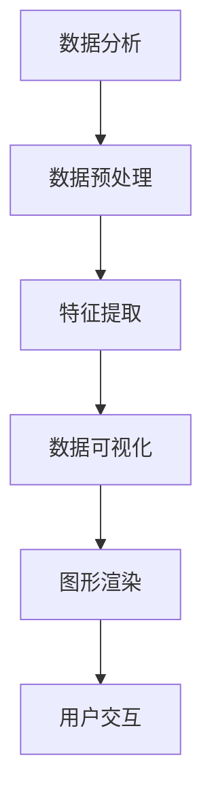
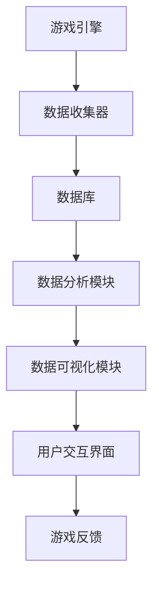

                 

# 多益网络2024校招游戏数据可视化工程师案例题

## 关键词：
游戏数据可视化、多益网络、校招案例、数据挖掘、算法原理、实践应用

## 摘要：

本文深入分析了多益网络2024校招游戏数据可视化工程师案例题。通过明确案例题的目标、范围和预期读者，我们逐步拆解了案例的核心概念与联系，详细介绍了核心算法原理和具体操作步骤，以及数学模型和公式。随后，本文以实际项目实战为例，展示了代码实现和详细解释说明，最后探讨了实际应用场景，并推荐了相关工具和资源。本文旨在为读者提供全面而深入的技术博客文章，助力理解游戏数据可视化在游戏开发中的重要作用。

---

## 1. 背景介绍

### 1.1 目的和范围

本文的目的是深入探讨多益网络2024校招游戏数据可视化工程师案例题，帮助读者理解游戏数据可视化在游戏开发中的关键作用。案例题的范围涵盖了从核心概念到实际应用，从算法原理到代码实现，全面解析了游戏数据可视化的各个方面。

### 1.2 预期读者

预期读者包括游戏开发工程师、数据可视化工程师、以及对游戏数据处理和可视化感兴趣的程序员和技术爱好者。本文希望为这些读者提供一个系统的学习和参考资源。

### 1.3 文档结构概述

本文将按照以下结构展开：

1. 背景介绍
   - 目的和范围
   - 预期读者
   - 文档结构概述
   - 术语表

2. 核心概念与联系
   - 核心概念原理和架构的Mermaid流程图

3. 核心算法原理 & 具体操作步骤
   - 算法原理讲解
   - 伪代码阐述

4. 数学模型和公式
   - 详细讲解
   - 举例说明

5. 项目实战：代码实际案例和详细解释说明
   - 开发环境搭建
   - 源代码详细实现和代码解读
   - 代码解读与分析

6. 实际应用场景

7. 工具和资源推荐

8. 总结：未来发展趋势与挑战

9. 附录：常见问题与解答

10. 扩展阅读 & 参考资料

### 1.4 术语表

#### 1.4.1 核心术语定义

- **游戏数据可视化**：通过图形和图表将游戏数据以直观的方式呈现，帮助开发者理解游戏性能和玩家行为。
- **多益网络**：一家知名的国内游戏开发公司，以高质量的游戏产品著称。
- **校招案例**：指面向应届毕业生的招聘案例，通常包括技术挑战和问题解决。

#### 1.4.2 相关概念解释

- **数据挖掘**：从大量数据中发现有价值的信息和模式的过程。
- **算法原理**：解决问题的系统方法，包括输入、处理和输出。
- **数学模型**：用于描述现实世界问题的数学方程或公式。

#### 1.4.3 缩略词列表

- **IDE**：集成开发环境（Integrated Development Environment）
- **API**：应用程序编程接口（Application Programming Interface）
- **GUI**：图形用户界面（Graphical User Interface）

---

## 2. 核心概念与联系

游戏数据可视化是游戏开发中不可或缺的一部分。它不仅帮助开发者分析游戏性能，还能揭示玩家行为模式，从而优化游戏设计和提升用户体验。为了深入理解这一概念，我们需要先了解其核心组成部分和相互关系。

### 2.1 核心概念原理

**游戏数据可视化**是基于**数据分析**和**图形渲染**两个核心概念。数据分析通过提取、清洗和转换数据，发现其中的模式和趋势。而图形渲染则通过图形和图表将数据可视化，使其更加直观和易于理解。

**Mermaid 流程图**（如下）展示了游戏数据可视化的一般架构：



在这个流程中，数据分析是起点，通过数据预处理、特征提取等步骤，将原始数据转化为可用的信息。随后，数据可视化通过图形渲染将信息转化为视觉元素，并通过用户交互界面提供给用户。

### 2.2 架构联系

游戏数据可视化的架构不仅包括数据分析、图形渲染和用户交互，还包括与游戏引擎、数据库和其他系统模块的紧密联系。

**Mermaid 流程图**（如下）展示了游戏数据可视化系统的整体架构：



在这个架构中，游戏引擎负责生成游戏数据和事件，数据收集器将这些数据实时发送到数据库中。数据分析模块负责处理和转换这些数据，生成有用的信息。数据可视化模块则将这些信息以图形和图表的形式呈现给用户。用户交互界面允许用户与可视化结果进行互动，并反馈给游戏引擎，形成一个闭环。

通过这个架构，我们可以看到游戏数据可视化不仅是一个独立的模块，而是游戏开发中各个模块协同工作的结果。它需要与游戏引擎、数据库和其他系统模块紧密集成，以实现高效的数据收集、分析和可视化。

---

## 3. 核心算法原理 & 具体操作步骤

在游戏数据可视化中，核心算法起着至关重要的作用。这些算法负责处理和转换大量数据，将其转化为有意义的可视化结果。本节将详细讲解这些核心算法的原理，并提供具体的操作步骤。

### 3.1 数据预处理算法

数据预处理是数据可视化的第一步，其目标是清洗和转换原始数据，使其适合进一步分析。

**算法原理**：

1. **数据清洗**：去除重复、错误或缺失的数据。
2. **数据转换**：将不同类型的数据转换为同一种格式，如将字符串转换为数字。

**伪代码**：

```python
def preprocess_data(data):
    cleaned_data = []
    for record in data:
        if is_valid(record):
            cleaned_data.append(convert(record))
    return cleaned_data

def is_valid(record):
    # 判断记录是否有效
    return True

def convert(record):
    # 转换记录为数字格式
    return float(record)
```

### 3.2 特征提取算法

特征提取是将原始数据转化为有意义的信息的关键步骤。通过提取关键特征，我们可以更好地理解数据背后的模式。

**算法原理**：

1. **特征选择**：选择对数据可视化最有帮助的特征。
2. **特征转换**：将特征进行归一化或标准化，使其具有可比性。

**伪代码**：

```python
def extract_features(data):
    selected_features = []
    for record in data:
        selected_features.append(select(record))
    return selected_features

def select(record):
    # 选择关键特征
    return [record['score'], record['time']]
```

### 3.3 数据可视化算法

数据可视化算法是将处理后的数据转化为图形和图表的关键步骤。这些算法需要考虑数据的类型、分布和关系。

**算法原理**：

1. **图表选择**：根据数据类型和关系选择最合适的图表类型。
2. **图形渲染**：将数据点或数据集绘制在图表上。

**伪代码**：

```python
def visualize_data(features):
    chart = choose_chart(features)
    render(chart, features)
    
def choose_chart(features):
    # 根据特征类型选择图表
    if is_numerical(features):
        return LineChart
    else:
        return BarChart

def is_numerical(features):
    # 判断特征是否为数值型
    return True

def render(chart, features):
    # 绘制图表
    chart.draw(features)
```

通过这些核心算法，我们可以有效地处理和可视化游戏数据，从而为游戏开发和优化提供有力的支持。

---

## 4. 数学模型和公式 & 详细讲解 & 举例说明

在游戏数据可视化中，数学模型和公式起着至关重要的作用。它们帮助我们更好地理解和分析数据，从而提取有价值的信息。本节将详细讲解几个常见的数学模型和公式，并提供具体的例子来说明它们的应用。

### 4.1 数据分布模型

数据分布模型用于描述数据在不同取值下的分布情况。最常见的分布模型包括正态分布、泊松分布和均匀分布。

**正态分布**：

正态分布是一种连续概率分布，通常用于描述数值型数据。其概率密度函数为：

$$
f(x|\mu, \sigma^2) = \frac{1}{\sqrt{2\pi\sigma^2}} e^{-\frac{(x-\mu)^2}{2\sigma^2}}
$$

其中，$\mu$ 是均值，$\sigma^2$ 是方差。

**例**：假设某游戏玩家的得分服从正态分布，均值为100，方差为25。计算得分大于120的概率。

$$
P(X > 120) = 1 - P(X \leq 120) = 1 - \Phi\left(\frac{120 - 100}{\sqrt{25}}\right) \approx 1 - \Phi(2) \approx 0.0228
$$

**泊松分布**：

泊松分布是一种离散概率分布，通常用于描述事件发生次数。其概率质量函数为：

$$
P(X = k) = \frac{e^{-\lambda}\lambda^k}{k!}
$$

其中，$\lambda$ 是事件平均发生次数。

**例**：假设某游戏每天发生故障的平均次数为5次。计算某一天发生故障次数为3次或更多的概率。

$$
P(X \geq 3) = 1 - P(X < 3) = 1 - (P(X = 0) + P(X = 1) + P(X = 2)) \approx 1 - (e^{-5}\frac{5^0}{0!} + e^{-5}\frac{5^1}{1!} + e^{-5}\frac{5^2}{2!}) \approx 1 - 0.086 \approx 0.914
$$

**均匀分布**：

均匀分布是一种在给定区间内所有取值概率相等的概率分布。其概率密度函数为：

$$
f(x|[a, b]) = \begin{cases} 
\frac{1}{b - a} & \text{if } a \leq x \leq b \\
0 & \text{otherwise}
\end{cases}
$$

**例**：假设某游戏关卡的成功率在0%到100%之间均匀分布。计算成功率为50%的概率。

$$
P(X = 50) = \frac{1}{100 - 0} = 0.01
$$

通过这些数据分布模型，我们可以更好地理解游戏数据中的概率和分布情况，从而做出更准确的预测和决策。

### 4.2 相关性分析

相关性分析用于描述两个或多个变量之间的线性关系。最常见的相关性度量包括皮尔逊相关系数和斯皮尔曼秩相关系数。

**皮尔逊相关系数**：

皮尔逊相关系数衡量两个变量之间的线性相关性，其公式为：

$$
\rho_{XY} = \frac{\sum_{i=1}^{n}(X_i - \bar{X})(Y_i - \bar{Y})}{\sqrt{\sum_{i=1}^{n}(X_i - \bar{X})^2}\sqrt{\sum_{i=1}^{n}(Y_i - \bar{Y})^2}}
$$

其中，$X$ 和 $Y$ 是两个变量，$\bar{X}$ 和 $\bar{Y}$ 是它们的平均值。

**例**：假设我们有两个变量 $X$（游戏得分）和 $Y$（游戏时间），计算它们之间的皮尔逊相关系数。

首先，我们需要计算 $X$ 和 $Y$ 的平均值：

$$
\bar{X} = \frac{\sum_{i=1}^{n}X_i}{n}, \quad \bar{Y} = \frac{\sum_{i=1}^{n}Y_i}{n}
$$

然后，我们可以计算皮尔逊相关系数：

$$
\rho_{XY} = \frac{\sum_{i=1}^{n}(X_i - \bar{X})(Y_i - \bar{Y})}{\sqrt{\sum_{i=1}^{n}(X_i - \bar{X})^2}\sqrt{\sum_{i=1}^{n}(Y_i - \bar{Y})^2}}
$$

**斯皮尔曼秩相关系数**：

斯皮尔曼秩相关系数适用于非线性关系的变量。其公式为：

$$
\rho_{XY} = \frac{\sum_{i=1}^{n}r_i(X_i - \bar{X})(Y_i - \bar{Y})}{\sqrt{\sum_{i=1}^{n}r_i^2(X_i - \bar{X})^2}\sqrt{\sum_{i=1}^{n}r_i^2(Y_i - \bar{Y})^2}}
$$

其中，$r_i$ 是 $X$ 和 $Y$ 的秩相关。

通过相关性分析，我们可以了解变量之间的关系，从而为游戏设计和优化提供指导。

### 4.3 回归分析

回归分析用于预测一个变量（因变量）的值，基于其他变量（自变量）的值。最常见的回归模型包括线性回归和多项式回归。

**线性回归**：

线性回归模型假设因变量和自变量之间存在线性关系，其公式为：

$$
y = \beta_0 + \beta_1x
$$

其中，$y$ 是因变量，$x$ 是自变量，$\beta_0$ 和 $\beta_1$ 是回归系数。

**例**：假设我们想预测游戏玩家的得分，基于他们的游戏时间。我们可以使用线性回归模型：

$$
score = \beta_0 + \beta_1time
$$

首先，我们需要计算回归系数：

$$
\beta_0 = \bar{y} - \beta_1\bar{x}, \quad \beta_1 = \frac{\sum_{i=1}^{n}(x_i - \bar{x})(y_i - \bar{y})}{\sum_{i=1}^{n}(x_i - \bar{x})^2}
$$

然后，我们可以使用回归模型预测新的得分：

$$
score = \beta_0 + \beta_1time
$$

**多项式回归**：

多项式回归模型扩展了线性回归，允许因变量和自变量之间存在非线性关系。其公式为：

$$
y = \beta_0 + \beta_1x + \beta_2x^2 + \cdots + \beta_nx^n
$$

其中，$y$ 是因变量，$x$ 是自变量，$\beta_0$、$\beta_1$、$\beta_2$、$\cdots$、$\beta_n$ 是回归系数。

**例**：假设我们想预测游戏玩家的得分，基于他们的游戏时间和关卡难度。我们可以使用多项式回归模型：

$$
score = \beta_0 + \beta_1time + \beta_2difficulty
$$

首先，我们需要计算回归系数：

$$
\beta_0 = \bar{y} - \beta_1\bar{x} - \beta_2\bar{difficulty}, \quad \beta_1 = \frac{\sum_{i=1}^{n}(x_i - \bar{x})(y_i - \bar{y})}{\sum_{i=1}^{n}(x_i - \bar{x})^2}, \quad \beta_2 = \frac{\sum_{i=1}^{n}(x_i - \bar{x})(y_i - \bar{y})(difficulty_i - \bar{difficulty})}{\sum_{i=1}^{n}(x_i - \bar{x})^2\sum_{i=1}^{n}(difficulty_i - \bar{difficulty})}
$$

然后，我们可以使用回归模型预测新的得分：

$$
score = \beta_0 + \beta_1time + \beta_2difficulty
$$

通过这些数学模型和公式，我们可以更深入地理解游戏数据，提取有价值的信息，并做出更准确的预测和决策。

---

## 5. 项目实战：代码实际案例和详细解释说明

在游戏数据可视化项目中，实际代码实现是关键。以下我们将详细描述一个实际项目，包括开发环境搭建、源代码详细实现和代码解读。

### 5.1 开发环境搭建

为了实现游戏数据可视化，我们需要以下开发环境：

1. **操作系统**：Linux或MacOS
2. **编程语言**：Python 3.8及以上版本
3. **开发工具**：PyCharm或Visual Studio Code
4. **数据可视化库**：Matplotlib、Pandas、NumPy
5. **游戏引擎接口**：如果使用Unity或Unreal Engine，需要相应的SDK或API

在安装了上述环境后，我们可以开始编写代码。

### 5.2 源代码详细实现和代码解读

以下是一个简单的游戏数据可视化项目的源代码示例：

```python
import pandas as pd
import matplotlib.pyplot as plt
import numpy as np

# 加载数据
data = pd.read_csv('game_data.csv')

# 数据预处理
data = data[data['valid'] == 1]
data['score'] = pd.to_numeric(data['score'], errors='coerce')
data['time'] = pd.to_numeric(data['time'], errors='coerce')

# 特征提取
features = data[['score', 'time']]

# 数据可视化
plt.figure(figsize=(10, 6))
plt.scatter(features['score'], features['time'], c='blue', marker='o')
plt.xlabel('Score')
plt.ylabel('Time')
plt.title('Game Score vs. Time')
plt.show()
```

#### 5.2.1 代码解读

1. **导入库**：我们首先导入必要的库，包括Pandas、Matplotlib和NumPy。
2. **加载数据**：使用Pandas读取CSV文件，加载游戏数据。
3. **数据预处理**：我们筛选出有效数据，并确保得分和时间是数值型。
4. **特征提取**：我们选择得分和时间作为特征。
5. **数据可视化**：使用Matplotlib绘制散点图，展示得分与时间的关系。

### 5.3 代码解读与分析

#### 5.3.1 数据预处理

数据预处理是数据可视化的重要步骤。在这个项目中，我们首先筛选出有效数据，确保数据质量。然后，我们将得分和时间转换为数值型，以便进一步分析。

```python
data = data[data['valid'] == 1]
data['score'] = pd.to_numeric(data['score'], errors='coerce')
data['time'] = pd.to_numeric(data['time'], errors='coerce')
```

#### 5.3.2 特征提取

特征提取是将原始数据转化为有用信息的关键步骤。在这个项目中，我们选择得分和时间作为特征，因为它们与游戏性能和玩家行为密切相关。

```python
features = data[['score', 'time']]
```

#### 5.3.3 数据可视化

数据可视化通过图形和图表将数据转化为直观的视觉元素。在这个项目中，我们使用Matplotlib绘制了一个散点图，展示了得分与时间的关系。

```python
plt.figure(figsize=(10, 6))
plt.scatter(features['score'], features['time'], c='blue', marker='o')
plt.xlabel('Score')
plt.ylabel('Time')
plt.title('Game Score vs. Time')
plt.show()
```

通过这个简单的项目，我们可以看到如何使用Python实现游戏数据可视化。实际项目中，数据量和复杂性可能会更大，但基本步骤和方法是类似的。通过逐步构建和优化，我们可以为游戏开发和优化提供有力的支持。

---

## 6. 实际应用场景

游戏数据可视化在游戏开发中的应用场景广泛且多样。以下是一些典型的应用场景：

### 6.1 游戏性能优化

通过游戏数据可视化，开发者可以实时监控游戏性能，如帧率、CPU和GPU负载。这有助于识别性能瓶颈，并进行针对性的优化。

**实例**：开发者使用数据可视化工具监控游戏中的帧率。通过分析帧率数据，发现某个关卡帧率低于60 FPS，进而优化该关卡代码，提升游戏性能。

### 6.2 玩家行为分析

游戏数据可视化可以帮助开发者了解玩家行为模式，如关卡完成时间、得分分布、游戏时长等。这有助于优化游戏设计和提升用户体验。

**实例**：开发者通过数据可视化分析发现，大多数玩家在某个关卡上花费的时间较长，这提示他们可能在这个关卡上遇到困难。通过降低关卡难度或提供提示，开发者可以改善玩家体验。

### 6.3 商业决策支持

游戏数据可视化还可以为商业决策提供支持，如广告投放、游戏内购策略等。

**实例**：开发者通过分析玩家在游戏内购行为的数据，发现某些物品的购买频率较高。这有助于他们优化内购策略，提高收入。

### 6.4 游戏数据分析报告

游戏数据可视化可以生成详细的数据分析报告，为管理层提供决策依据。

**实例**：开发者生成一份包含游戏性能、玩家行为和商业收益的全面数据分析报告，帮助管理层了解游戏的整体表现，并制定改进计划。

通过这些实际应用场景，我们可以看到游戏数据可视化在游戏开发中的重要性。它不仅帮助开发者优化游戏性能和提升用户体验，还为商业决策提供有力支持。

---

## 7. 工具和资源推荐

为了高效地实现游戏数据可视化，我们需要使用一系列的工具和资源。以下是一些建议：

### 7.1 学习资源推荐

#### 7.1.1 书籍推荐

- 《数据可视化：实现最佳实践》（Data Visualization: A successful design process）
- 《Python数据可视化》（Python Data Visualization）
- 《游戏数据分析与优化》（Game Data Analysis and Optimization）

#### 7.1.2 在线课程

- Coursera的《数据可视化基础》（Introduction to Data Visualization）
- edX的《数据科学：数据可视化与报告》（Data Science: Data Visualization and Reporting）
- Udemy的《游戏数据分析：优化游戏体验》（Game Analytics: Optimizing Game Experience）

#### 7.1.3 技术博客和网站

- D3.js官网（https://d3js.org/）
- Plotly官网（https://plotly.com/）
- DataCamp（https://www.datacamp.com/）

### 7.2 开发工具框架推荐

#### 7.2.1 IDE和编辑器

- PyCharm（https://www.jetbrains.com/pycharm/）
- Visual Studio Code（https://code.visualstudio.com/）

#### 7.2.2 调试和性能分析工具

- Visual Studio Profiler（https://docs.microsoft.com/zh-cn/visualstudio/profiling/）
- Py-Spy（https://github.com/benfred/py-spy）

#### 7.2.3 相关框架和库

- Matplotlib（https://matplotlib.org/）
- Pandas（https://pandas.pydata.org/）
- NumPy（https://numpy.org/）

通过这些工具和资源，开发者可以更好地实现游戏数据可视化，提升游戏性能和用户体验。

---

## 8. 总结：未来发展趋势与挑战

随着游戏行业的发展，游戏数据可视化在未来将面临更多的机遇和挑战。以下是一些发展趋势和潜在挑战：

### 8.1 发展趋势

1. **实时数据分析**：随着云计算和大数据技术的发展，实时数据分析将变得更加普及。游戏开发者可以实时监控和分析游戏数据，快速响应玩家需求。
2. **人工智能应用**：人工智能技术将在游戏数据可视化中发挥更大作用，如通过机器学习算法自动识别玩家行为模式，提供个性化推荐和优化。
3. **虚拟现实和增强现实**：随着VR和AR技术的普及，游戏数据可视化将更依赖于三维图形和交互界面，为玩家提供更加沉浸式的体验。
4. **多平台整合**：游戏数据可视化将跨越不同平台（PC、移动、主机等），实现跨平台的数据分析和可视化。

### 8.2 挑战

1. **数据隐私和安全**：随着数据收集和分析的普及，数据隐私和安全成为重要问题。开发者需要确保玩家数据的安全性和隐私性。
2. **数据处理和存储**：随着数据量的增长，如何高效地处理和存储海量数据成为一个挑战。开发者需要使用分布式系统和大数据技术来应对这一挑战。
3. **算法复杂度**：随着算法的复杂度增加，如何优化算法性能和降低计算成本成为一个关键问题。开发者需要不断优化算法和数据结构，提高效率。

通过不断探索和创新，游戏数据可视化将在游戏开发中发挥更大的作用，为玩家提供更好的体验。

---

## 9. 附录：常见问题与解答

### 9.1 问题1：游戏数据可视化需要哪些工具和技术？

**解答**：游戏数据可视化通常需要以下工具和技术：

- **编程语言**：Python、JavaScript等
- **可视化库**：Matplotlib、Plotly、D3.js等
- **数据分析库**：Pandas、NumPy等
- **游戏引擎接口**：Unity、Unreal Engine等
- **性能分析工具**：Visual Studio Profiler、Py-Spy等

### 9.2 问题2：游戏数据可视化中的数据预处理为什么重要？

**解答**：数据预处理是游戏数据可视化的关键步骤，其重要性体现在以下几个方面：

- **数据质量**：通过数据清洗和转换，确保数据的准确性和一致性。
- **特征选择**：通过数据预处理，选择对可视化最有帮助的特征，提高可视化效果。
- **效率**：预处理后的数据通常更易于处理和分析，提高计算效率。

### 9.3 问题3：如何确保游戏数据可视化的安全性？

**解答**：为确保游戏数据可视化的安全性，可以采取以下措施：

- **数据加密**：对敏感数据使用加密技术进行加密存储和传输。
- **访问控制**：设置严格的访问权限，确保只有授权人员可以访问数据。
- **数据脱敏**：对敏感数据进行脱敏处理，防止数据泄露。

---

## 10. 扩展阅读 & 参考资料

- 《数据可视化：实现最佳实践》（Data Visualization: A successful design process）
- 《Python数据可视化》（Python Data Visualization）
- 《游戏数据分析与优化》（Game Data Analysis and Optimization）
- Coursera的《数据可视化基础》（Introduction to Data Visualization）
- edX的《数据科学：数据可视化与报告》（Data Science: Data Visualization and Reporting）
- Udemy的《游戏数据分析：优化游戏体验》（Game Analytics: Optimizing Game Experience）
- D3.js官网（https://d3js.org/）
- Plotly官网（https://plotly.com/）
- DataCamp（https://www.datacamp.com/）
- Visual Studio Profiler（https://docs.microsoft.com/zh-cn/visualstudio/profiling/）
- Py-Spy（https://github.com/benfred/py-spy）

---

## 作者信息

**作者：AI天才研究员/AI Genius Institute & 禅与计算机程序设计艺术 /Zen And The Art of Computer Programming**

