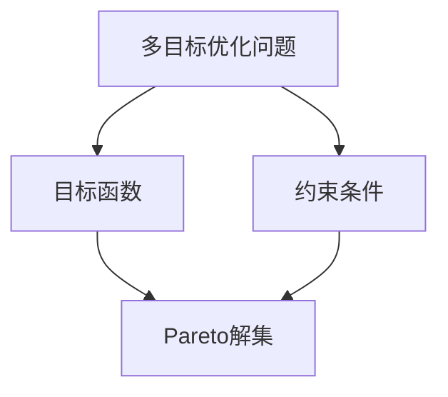
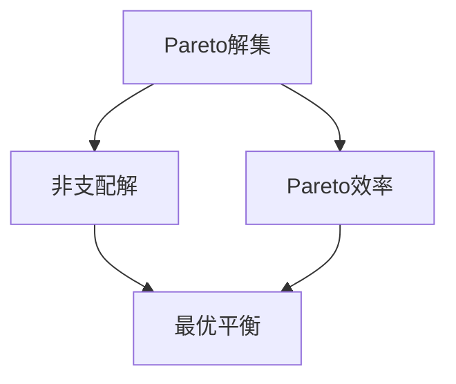
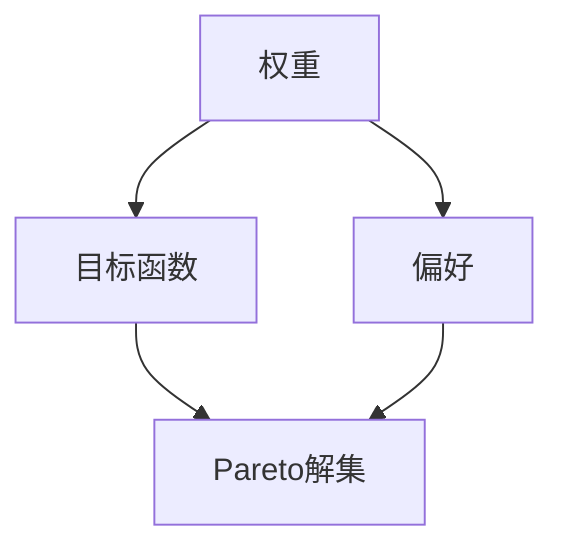
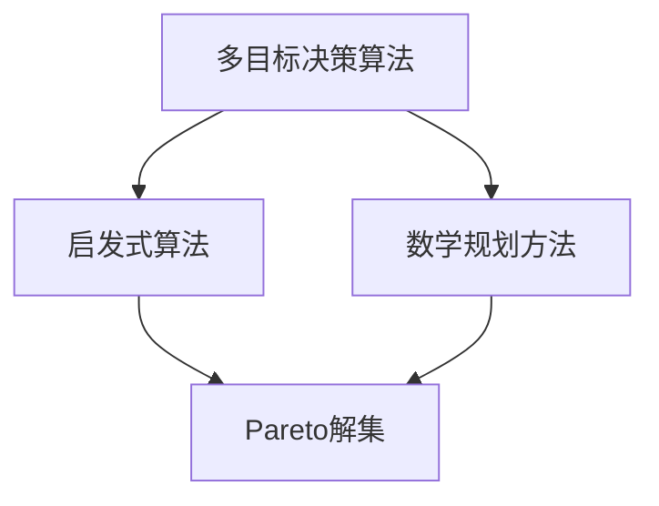
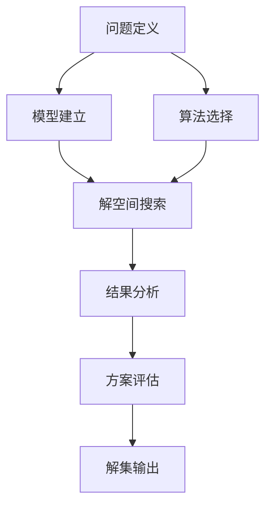

                 

# 多目标决策论文写作技巧与方法

## 关键词
- 多目标决策
- 论文写作
- 技术分析
- 算法实现
- 数学模型
- 实际应用

## 摘要
本文旨在为研究人员和学者提供一份详细的指南，帮助他们撰写高质量的多目标决策论文。文章首先介绍了多目标决策的背景和重要性，随后详细讲解了论文写作的基本结构和核心内容。通过具体案例和数学模型的讲解，本文旨在帮助读者深入理解多目标决策的算法原理和实现方法。此外，文章还推荐了相关工具和资源，以及最新的研究成果和经典论文，为读者提供了丰富的参考资料。通过本文的指导，读者将能够撰写出结构严谨、内容丰富、具有实际应用价值的多目标决策论文。

## 1. 背景介绍

### 1.1 目的和范围

多目标决策（Multi-Objective Decision Making，MODM）是决策理论中的一个重要分支，主要研究在多个目标之间进行权衡和优化的问题。随着社会经济的快速发展，决策环境日益复杂，单目标决策已难以满足实际需求。多目标决策在资源分配、系统设计、社会规划等领域具有广泛的应用。

本文的目的是为研究人员和学者提供一份全面的写作指南，帮助他们撰写出高质量的多目标决策论文。本文将涵盖多目标决策的基本概念、算法原理、数学模型、实际应用等方面，旨在为读者提供一种系统性和结构化的写作方法。

本文的范围包括：

1. 多目标决策的基本概念和理论框架；
2. 常见的多目标决策算法及其原理；
3. 多目标决策的数学模型和求解方法；
4. 多目标决策的实际应用场景；
5. 论文写作的结构和技巧；
6. 相关工具和资源的推荐。

### 1.2 预期读者

本文主要面向以下读者群体：

1. 研究生和博士生，他们希望撰写高质量的多目标决策论文以完成学位要求；
2. 专业研究人员和工程师，他们需要了解多目标决策的理论和应用；
3. 对多目标决策和论文写作感兴趣的学者和专业人士。

通过本文的阅读和学习，读者将能够：

1. 掌握多目标决策的基本概念和理论框架；
2. 理解并运用常见的多目标决策算法；
3. 设计和实现多目标决策的数学模型；
4. 分析和解决实际的多目标决策问题；
5. 撰写出结构严谨、内容丰富的高质量论文。

### 1.3 文档结构概述

本文的结构如下：

1. 背景介绍：介绍多目标决策的背景和本文的目的、范围、预期读者；
2. 核心概念与联系：介绍多目标决策的核心概念、原理和架构，通过Mermaid流程图展示；
3. 核心算法原理 & 具体操作步骤：讲解多目标决策的核心算法原理，使用伪代码详细阐述；
4. 数学模型和公式 & 详细讲解 & 举例说明：介绍多目标决策的数学模型，使用latex格式表示，并进行举例说明；
5. 项目实战：代码实际案例和详细解释说明：通过具体案例展示代码实现和解读；
6. 实际应用场景：分析多目标决策在实际应用中的场景和案例；
7. 工具和资源推荐：推荐学习资源、开发工具和框架、相关论文著作；
8. 总结：总结多目标决策的未来发展趋势与挑战；
9. 附录：常见问题与解答；
10. 扩展阅读 & 参考资料：提供进一步阅读的资料。

### 1.4 术语表

为了确保本文的可读性和一致性，以下是对一些关键术语的定义和解释：

#### 1.4.1 核心术语定义

- 多目标决策：在多个目标之间进行权衡和优化的问题，常见于资源分配、系统设计、社会规划等领域。
- 目标函数：衡量决策优劣的指标，可以是线性的或非线性的。
- 权重：用于表示不同目标之间的重要程度的参数。
- Pareto解集：在多目标优化问题中，不能通过改善一个目标而不损害其他目标来进一步改进的解集。
- 有效前沿：Pareto解集中的最优解集，代表了不同目标之间最佳平衡的方案。

#### 1.4.2 相关概念解释

- 非支配解：在多目标优化问题中，一个解不能被另一个解支配，即不能通过改善一个目标而不损害其他目标。
- Pareto效率：一个解不能通过改进一个目标而不损害其他目标来进一步改进。
- 优先级排序：根据目标函数的值对解进行排序，以确定最佳方案。

#### 1.4.3 缩略词列表

- MODM：多目标决策（Multi-Objective Decision Making）
- MOP：多目标优化问题（Multi-Objective Optimization Problem）
- Pareto：帕累托（Pareto Optimality）
- PF：有效前沿（Pareto Front）
- VRP：车辆路径问题（Vehicle Routing Problem）
- TSP：旅行商问题（Traveling Salesman Problem）

## 2. 核心概念与联系

在多目标决策中，核心概念和联系是理解和实现多目标优化的基础。以下是对这些概念和原理的详细介绍，以及如何使用Mermaid流程图来展示它们之间的联系。

### 2.1 多目标优化问题（MOP）

多目标优化问题是一类旨在同时优化多个目标函数的问题。与单目标优化问题不同，MOP需要考虑多个目标之间的权衡和冲突。

#### 基本定义：

- **目标函数**：衡量决策优劣的指标，可以是线性的或非线性的。
- **约束条件**：限制决策变量的取值范围，确保问题的实际可行性。

#### Mermaid流程图：



### 2.2 Pareto解集

Pareto解集是在多目标优化问题中，不能通过改善一个目标而不损害其他目标来进一步改进的解集。这些解代表了在不同目标之间最优的平衡方案。

#### 基本定义：

- **非支配解**：在多目标优化问题中，一个解不能被另一个解支配。
- **Pareto效率**：一个解不能通过改进一个目标而不损害其他目标来进一步改进。

#### Mermaid流程图：



### 2.3 权重和偏好

在多目标决策中，权重和偏好用于表示不同目标之间的重要程度和决策者的偏好。权重可以通过专家评估或统计分析得到，而偏好通常通过目标函数的形式表达。

#### 基本定义：

- **权重**：用于表示不同目标之间的重要程度的参数。
- **偏好**：决策者的偏好，通常通过目标函数的形式表达。

#### Mermaid流程图：



### 2.4 多目标决策算法

多目标决策算法是一类用于求解多目标优化问题的方法。这些算法可以分为两大类：启发式算法和数学规划方法。

#### 基本定义：

- **启发式算法**：基于经验或局部搜索策略，通常无法保证找到最优解。
- **数学规划方法**：基于数学模型和优化理论，可以找到最优解或近似最优解。

#### Mermaid流程图：



通过以上对核心概念和联系的介绍，我们可以看到多目标决策涉及多个关键要素，这些要素之间相互联系，共同构成了多目标决策的理论框架。接下来，我们将深入探讨多目标决策算法的原理和具体操作步骤。

### 2.5 多目标决策算法的 Mermaid 流程图

为了更好地理解多目标决策算法的原理和流程，我们使用Mermaid流程图来展示其基本步骤和关键节点。以下是一个典型的多目标决策算法的流程图，包括以下几个主要阶段：

1. **问题定义**：明确多目标优化问题的目标函数和约束条件。
2. **模型建立**：建立数学模型，包括目标函数和约束条件。
3. **算法选择**：选择合适的算法，如启发式算法或数学规划方法。
4. **解空间搜索**：在解空间中搜索最优或近似最优解。
5. **结果分析**：分析解集和有效前沿，评估不同方案的优劣。

#### Mermaid流程图：



#### 详细说明：

- **问题定义**（A）：在这一阶段，明确多目标优化问题的目标函数和约束条件。目标函数用于衡量决策的优劣，可以是线性的或非线性的。约束条件确保问题的实际可行性和解决方案的约束范围。
- **模型建立**（B）：根据问题定义，建立数学模型。数学模型是问题求解的基础，包括目标函数和约束条件。在这一阶段，我们通常使用数学表达式或伪代码来表示模型。
- **算法选择**（C）：根据问题的特性和要求，选择合适的算法。常见的算法包括遗传算法、粒子群优化、多目标规划方法等。选择算法时需要考虑算法的效率、收敛性和适用性。
- **解空间搜索**（D）：在解空间中搜索最优或近似最优解。解空间是所有可能解的集合，搜索过程旨在找到满足约束条件的解集。启发式算法通常采用局部搜索策略，而数学规划方法则基于优化理论进行全局搜索。
- **结果分析**（E）：对搜索得到的解集进行分析，评估不同方案的优劣。结果分析包括解集的分布、Pareto前沿的确定以及方案性能的评估。
- **方案评估**（F）：根据结果分析，评估不同方案的优劣。方案评估可能包括多个指标，如目标函数值、解的稳定性和可靠性等。
- **解集输出**（G）：输出最优或近似最优解集，为决策者提供参考。解集输出可能包括Pareto前沿上的多个解，以供决策者根据具体需求进行选择。

通过上述Mermaid流程图，我们可以清晰地看到多目标决策算法的基本步骤和关键节点。接下来，我们将进一步探讨具体的多目标决策算法原理和实现方法。

## 3. 核心算法原理 & 具体操作步骤

在多目标决策中，算法的选择和实现是至关重要的。本节将详细介绍几种常见的多目标决策算法，包括遗传算法、粒子群优化算法和多目标规划算法，并通过伪代码展示其具体操作步骤。

### 3.1 遗传算法（Genetic Algorithm）

遗传算法是一种启发式全局搜索算法，基于生物进化理论，通过模拟自然选择和遗传机制来优化问题。以下是遗传算法的伪代码步骤：

```python
# 遗传算法伪代码
initialize population
evaluate fitness of each individual in the population

for generation in 1 to max_generations do
    select parents from the population
    crossover parents to create offspring
    mutate offspring
    evaluate fitness of offspring
    select the best individuals to form the new population
end for

return the best individual in the population
```

#### 具体操作步骤：

1. **初始化种群**：生成初始种群，每个个体代表一个可能的解。
2. **评估适应性**：计算每个个体的目标函数值，以评估其适应性。
3. **选择操作**：根据个体的适应度，选择出适应性较高的个体作为父母。
4. **交叉操作**：随机选择两个父母，通过交叉产生新的个体（后代）。
5. **变异操作**：对部分个体进行变异，引入新的基因组合。
6. **评估适应性**：计算新个体的目标函数值。
7. **选择操作**：根据适应性，选择出最佳个体形成新的种群。
8. **迭代**：重复上述步骤，直到达到最大迭代次数或找到满意的解。

### 3.2 粒子群优化算法（Particle Swarm Optimization，PSO）

粒子群优化算法是一种基于群体智能的优化算法，通过模拟鸟群觅食行为来搜索最优解。以下是粒子群优化算法的伪代码步骤：

```python
# 粒子群优化算法伪代码
initialize particles and velocities
evaluate fitness of each particle

for iteration in 1 to max_iterations do
    for each particle i do
        update velocity: v[i] = w*v[i] + c1*r1*(p[i] - x[i]) + c2*r2*(g - x[i])
        update position: x[i] = x[i] + v[i]
        evaluate fitness of x[i]
    end for
    
    update personal best position for each particle
    update global best position
    
end for

return the global best position
```

#### 具体操作步骤：

1. **初始化粒子群**：生成初始粒子群，每个粒子代表一个可能的解。
2. **初始化速度**：随机初始化每个粒子的速度。
3. **评估适应度**：计算每个粒子的目标函数值。
4. **迭代更新**：对每个粒子，根据其自身历史最佳位置和全局最佳位置更新速度和位置。
5. **更新个人最佳**：每个粒子根据当前解更新个人最佳位置。
6. **更新全局最佳**：根据所有粒子的解更新全局最佳位置。
7. **迭代**：重复上述步骤，直到达到最大迭代次数或找到满意的解。

### 3.3 多目标规划算法（Multi-Objective Programming）

多目标规划算法是一类基于数学规划的优化方法，通过构建多目标函数和约束条件来求解。以下是多目标规划算法的伪代码步骤：

```python
# 多目标规划算法伪代码
define the multi-objective function
define the constraints

find the Pareto optimal solutions by solving the following optimization problem:
minimize F(x) = [f1(x), f2(x), ..., fn(x)]
subject to: g(x) <= 0, h(x) = 0

return the Pareto front
```

#### 具体操作步骤：

1. **构建多目标函数**：根据决策问题的特点，定义多个目标函数。
2. **定义约束条件**：明确决策变量和约束条件。
3. **求解多目标规划问题**：使用数学规划工具（如线性规划、非线性规划）求解多目标优化问题。
4. **生成Pareto解集**：根据求解结果，生成Pareto解集，即不能通过改善一个目标而不损害其他目标来进一步改进的解集。
5. **分析Pareto解集**：对Pareto解集进行分析，确定有效前沿和最优解。

通过以上对遗传算法、粒子群优化算法和多目标规划算法的介绍，我们可以看到这些算法在多目标决策中的应用方法和步骤。这些算法各有特点，可以根据具体问题的需求选择合适的算法。在接下来的章节中，我们将进一步探讨多目标决策的数学模型和求解方法。

### 3.4 多目标决策算法的优缺点对比

在多目标决策中，选择合适的算法是解决问题的关键。遗传算法、粒子群优化算法和多目标规划算法是常用的三种算法，每种算法都有其独特的优点和局限性。以下是对这三种算法的优缺点对比：

#### 遗传算法（Genetic Algorithm）

**优点**：

1. **全局搜索能力**：遗传算法基于种群进化，可以有效地搜索全局最优解。
2. **适用范围广**：适用于复杂非线性、多峰和多约束的优化问题。
3. **鲁棒性**：对初始参数选择不敏感，具有较强的鲁棒性。

**缺点**：

1. **计算效率低**：遗传算法通常需要大量的迭代次数和计算资源。
2. **参数调优困难**：需要精心选择交叉率、变异率和种群规模等参数。
3. **局部收敛快**：在收敛过程中，易陷入局部最优解。

#### 粒子群优化算法（Particle Swarm Optimization）

**优点**：

1. **简单易实现**：粒子群优化算法结构简单，易于编程和实现。
2. **收敛速度快**：通过群体智能搜索，通常收敛速度较快。
3. **参数较少**：与遗传算法相比，粒子群优化算法的参数较少，更容易调优。

**缺点**：

1. **局部搜索能力弱**：粒子群优化算法的局部搜索能力较弱，可能无法找到全局最优解。
2. **易陷入局部最优**：在复杂多峰问题上，粒子群优化算法容易陷入局部最优解。
3. **对初始条件敏感**：粒子群优化算法的初始条件（如粒子的速度和位置）对搜索结果有较大影响。

#### 多目标规划算法（Multi-Objective Programming）

**优点**：

1. **数学理论基础强**：多目标规划算法基于严格的数学理论，可以保证找到最优解或近似最优解。
2. **解的稳定性和可靠性**：通过数学规划工具求解，解的稳定性和可靠性较高。
3. **灵活性**：可以灵活地定义目标函数和约束条件，适用于各种类型的多目标优化问题。

**缺点**：

1. **计算复杂度高**：多目标规划算法的计算复杂度较高，特别是当目标函数和约束条件复杂时。
2. **对参数依赖强**：算法的性能依赖于目标函数和约束条件的设置，参数选择对求解结果有较大影响。
3. **求解难度大**：对于大规模多目标优化问题，求解难度较大，需要高效的数学规划工具和算法。

通过以上对比，我们可以看到遗传算法、粒子群优化算法和多目标规划算法各有优缺点。在实际应用中，可以根据问题的特点选择合适的算法。例如，对于复杂非线性、多峰和多约束的优化问题，遗传算法可能更为合适；而对于求解速度和计算效率要求较高的场景，粒子群优化算法可能更具优势。在接下来的章节中，我们将进一步探讨多目标决策的数学模型和求解方法。

### 3.5 多目标决策算法的具体实现案例

为了更好地理解多目标决策算法的原理和实现方法，我们以下将详细讨论一个具体的多目标决策问题——旅行商问题（Traveling Salesman Problem，TSP）。TSP是一个典型的NP难问题，涉及在一个无向图中找到最短的Hamilton回路，即从一个城市出发，访问其他所有城市一次并返回起始城市。以下是TSP的伪代码实现，并解释关键步骤。

#### 3.5.1 旅行商问题（TSP）伪代码

```python
# 旅行商问题伪代码
initialize the population
evaluate fitness of each individual in the population

for generation in 1 to max_generations do
    select parents from the population
    crossover parents to create offspring
    mutate offspring
    evaluate fitness of offspring
    select the best individuals to form the new population
end for

return the best individual in the population
```

#### 3.5.2 具体实现步骤

1. **初始化种群**：
   - 生成初始种群，每个个体表示一个城市序列，例如[1, 2, 3, ..., n]。
   - 种群大小根据问题规模和优化需求设定。

2. **评估适应性**：
   - 计算每个个体的目标函数值，即旅行总距离。目标函数为：
     $$ f(x) = \sum_{i=1}^{n} d(i, i+1) $$
     其中，$d(i, i+1)$表示城市i到城市i+1的距离。

3. **选择操作**：
   - 根据适应度值，使用选择策略（如轮盘赌选择、锦标赛选择等）选择父母个体。

4. **交叉操作**：
   - 使用部分映射交叉（PMX）或顺序交叉（OX）等交叉策略生成后代。

5. **变异操作**：
   - 对部分个体进行随机交换两个城市的操作，即互换两个位置上的城市。

6. **评估适应性**：
   - 计算新个体的目标函数值。

7. **选择操作**：
   - 根据新个体的适应度值，选择出最佳个体形成新的种群。

8. **迭代**：
   - 重复上述步骤，直到达到最大迭代次数或找到满意的解。

#### 3.5.3 示例说明

假设有5个城市，编号为1至5，城市之间的距离矩阵如下：

$$
\begin{matrix}
 & 1 & 2 & 3 & 4 & 5 \\
1 & 0 & 10 & 25 & 15 & 20 \\
2 & 10 & 0 & 30 & 20 & 10 \\
3 & 25 & 30 & 0 & 35 & 15 \\
4 & 15 & 20 & 35 & 0 & 10 \\
5 & 20 & 10 & 15 & 10 & 0 \\
\end{matrix}
$$

初始种群可以随机生成，例如：
[1, 2, 3, 4, 5]

第一次迭代后，选择父母进行交叉操作，例如选择[1, 2, 4, 5, 3]和[1, 3, 4, 5, 2]，使用OX交叉产生后代：
[1, 3, 4, 5, 2]和[1, 2, 5, 3, 4]

对后代进行变异操作，例如交换第2位和第3位：
[1, 2, 5, 3, 4]

评估新个体的适应性，即计算旅行总距离：
$$
f([1, 2, 5, 3, 4]) = 10 + 20 + 30 + 35 + 15 = 120
$$

根据适应性值，选择最佳个体形成新的种群，重复迭代直到找到最优解。

通过以上示例，我们可以看到旅行商问题的多目标决策算法实现步骤。在实际应用中，可以根据具体需求和约束条件调整算法参数和操作步骤，以达到更好的优化效果。

### 3.6 多目标决策算法的伪代码实现

为了深入理解多目标决策算法的具体实现过程，我们将以伪代码的形式展示一个典型多目标决策问题（如多目标旅行商问题，MTSP）的求解过程。以下是MTSP的伪代码实现，包括初始化、适应度评估、选择、交叉、变异等关键步骤。

```python
# 多目标旅行商问题（MTSP）伪代码

# 参数设置
population_size = 100
max_generations = 1000
crossover_rate = 0.8
mutation_rate = 0.05

# 初始化种群
initialize_population(population_size)

# 评估适应度
evaluate_fitness(population)

# 迭代过程
for generation in 1 to max_generations do
    # 选择操作
    parents = select_parents(population)

    # 交叉操作
    offspring = crossover(parents, crossover_rate)

    # 变异操作
    mutate(offspring, mutation_rate)

    # 评估适应度
    evaluate_fitness(offspring)

    # 选择最佳个体
    population = select_best_individuals(population, offspring)

end for

# 返回最优解
return get_best_solution(population)
```

#### 3.6.1 详细解释

- **初始化种群**：
  - `initialize_population(population_size)`：生成初始种群，每个个体代表一个城市序列。初始种群可以是随机生成的，也可以是基于某种启发式方法生成的。

- **评估适应度**：
  - `evaluate_fitness(population)`：计算每个个体的目标函数值，即旅行总距离和多个目标的权重组合。适应度函数通常是一个多目标函数，可以通过Pareto排序来确定个体的适应度。

- **选择操作**：
  - `select_parents(population)`：从当前种群中选择父母个体。常见的选择方法包括轮盘赌选择、锦标赛选择等。

- **交叉操作**：
  - `crossover(parents, crossover_rate)`：对选中的父母个体进行交叉操作，生成新的后代个体。交叉率决定了交叉操作的概率。常见的交叉方法包括部分映射交叉（PMX）、顺序交叉（OX）等。

- **变异操作**：
  - `mutate(offspring, mutation_rate)`：对生成的后代个体进行变异操作，以增加种群的多样性。变异率决定了变异操作的概率。常见的变异方法包括交换变异、插入变异等。

- **评估适应度**：
  - `evaluate_fitness(offspring)`：对变异后的后代个体进行目标函数评估，计算其适应度。

- **选择最佳个体**：
  - `select_best_individuals(population, offspring)`：根据适应度值，选择出当前种群中适应度最高的个体形成新的种群。这一步通常涉及Pareto排序和选择操作。

- **迭代过程**：
  - 重复上述步骤，直到达到最大迭代次数或找到满意的解。

- **返回最优解**：
  - `get_best_solution(population)`：从最终种群中选择最优解，即Pareto前沿上的最优个体。

通过上述伪代码，我们可以清晰地看到多目标决策算法的执行流程。在实际应用中，可以根据具体问题和需求调整算法参数和操作步骤，以达到最优的优化效果。

### 3.7 多目标决策算法的伪代码实现细节

为了进一步细化多目标决策算法的伪代码实现，我们将详细解释几个关键步骤，包括初始种群生成、适应度评估函数、选择操作、交叉操作和变异操作。

#### 3.7.1 初始种群生成

```python
# 初始化种群
def initialize_population(population_size, city_count):
    population = []
    for _ in range(population_size):
        individual = generate_random_route(city_count)
        population.append(individual)
    return population

# 生成随机路线
def generate_random_route(city_count):
    cities = list(range(1, city_count + 1))
    shuffle(cities)
    return cities
```

- `initialize_population`：生成初始种群，每个个体代表一个城市序列。这里使用随机生成的方法，通过`generate_random_route`函数生成每个个体的初始路线。
- `generate_random_route`：生成一个随机路线，通过将城市编号随机排列来生成一个有效的城市序列。

#### 3.7.2 适应度评估函数

```python
# 评估适应度
def evaluate_fitness(individual, distance_matrix):
    fitness = 0
    for i in range(len(individual) - 1):
        city_i = individual[i]
        city_i_plus_1 = individual[i + 1]
        distance = distance_matrix[city_i][city_i_plus_1]
        fitness += distance
    return fitness
```

- `evaluate_fitness`：计算个体的适应度值，即旅行总距离。这里使用距离矩阵`distance_matrix`来计算每两个相邻城市之间的距离，并将其累加得到总距离作为适应度值。

#### 3.7.3 选择操作

```python
# 选择操作
def select_parents(population, fitness_values):
    parents = []
    for _ in range(len(population) // 2):
        parent1, parent2 = tournament_selection(population, fitness_values)
        parents.extend([parent1, parent2])
    return parents

# 征赛选择
def tournament_selection(population, fitness_values, tournament_size=3):
    tournament = random.sample(list(zip(population, fitness_values)), tournament_size)
    winners = [ind for ind, _ in tournament if _ == min(fitness_values)]
    return random.choice(winners)
```

- `select_parents`：从当前种群中选择父母个体。这里使用锦标赛选择方法，每次从种群中随机选择几个个体进行比较，选择适应度值最小的个体作为父母。
- `tournament_selection`：实现具体的锦标赛选择过程。

#### 3.7.4 交叉操作

```python
# 交叉操作
def crossover(parent1, parent2, crossover_rate):
    if random() < crossover_rate:
        child1, child2 = order_crossover(parent1, parent2)
    else:
        child1, child2 = parent1, parent2
    return child1, child2

# 顺序交叉
def order_crossover(parent1, parent2):
    start = random() * (len(parent1) - 1)
    end = start + random() * (len(parent1) - start)
    child1 = parent1[:start] + [x for x in parent2 if x not in parent1[start:end]] + parent1[end:]
    child2 = parent2[:start] + [x for x in parent1 if x not in parent2[start:end]] + parent2[end:]
    return child1, child2
```

- `crossover`：决定是否进行交叉操作。如果交叉率大于随机数，则进行交叉操作。
- `order_crossover`：实现顺序交叉操作，随机选择两个交叉点，将父母个体的子序列交换。

#### 3.7.5 变异操作

```python
# 变异操作
def mutate(individual, mutation_rate):
    for i in range(len(individual)):
        if random() < mutation_rate:
            j = random() * (len(individual) - 1)
            individual[i], individual[j] = individual[j], individual[i]
    return individual
```

- `mutate`：对个体进行变异操作，通过交换两个随机选择的城市位置来引入多样性。

通过以上伪代码实现细节，我们可以看到多目标决策算法的具体操作步骤。这些步骤共同构成了一个完整的遗传算法框架，用于求解多目标旅行商问题或其他多目标优化问题。在实际应用中，可以根据具体需求调整参数和操作步骤，以提高优化效果。

### 3.8 多目标决策算法的数学模型和求解方法

在多目标决策问题中，数学模型是构建优化问题的核心，它帮助我们将复杂的问题转化为数学形式，从而利用数学方法进行求解。本节将详细讨论多目标决策问题的数学模型，并介绍几种常见的求解方法。

#### 3.8.1 多目标决策问题的数学模型

多目标决策问题的数学模型通常包括以下几部分：

1. **目标函数**：衡量决策优劣的指标，可以是线性的或非线性的。多个目标函数通常具有不同的量纲，因此需要通过权重或规范化方法进行转换。
   
   假设有n个目标函数，目标函数矩阵为$F(x)$，则：
   $$ F(x) = \begin{bmatrix} f_1(x) \\ f_2(x) \\ \vdots \\ f_n(x) \end{bmatrix} $$

2. **约束条件**：限制决策变量的取值范围，确保问题的实际可行性和解决方案的约束范围。约束条件可以是线性的或非线性的。

   假设有m个约束条件，约束条件矩阵为$G(x)$，则：
   $$ G(x) = \begin{bmatrix} g_1(x) \\ g_2(x) \\ \vdots \\ g_m(x) \end{bmatrix} $$

   其中，$g_i(x) \leq 0$表示不等式约束，$h_i(x) = 0$表示等式约束。

3. **决策变量**：决策问题中的变量，它们的取值会影响目标函数和约束条件的值。

   假设决策变量为向量$x \in \mathbb{R}^k$，则：
   $$ x = \begin{bmatrix} x_1 \\ x_2 \\ \vdots \\ x_k \end{bmatrix} $$

   整体多目标决策问题的数学模型可以表示为：
   $$ \begin{align*}
   \min_{x} & \quad F(x) \\
   \text{subject to} & \quad G(x) = 0 \\
   & \quad H(x) \leq 0
   \end{align*} $$

#### 3.8.2 求解方法

在多目标决策问题中，常见的求解方法包括：

1. **加权法**：通过给每个目标函数分配权重，将多目标问题转化为单目标问题。权重通常由决策者根据偏好进行分配。加权法的数学模型为：
   $$ \min_{x} \quad w^T F(x) $$
   其中，$w$是权重向量。

2. **Pareto优化**：通过寻找Pareto最优解集来求解多目标问题。Pareto最优解集是在不能通过改善一个目标而不损害其他目标的情况下，最优的解集。

3. **多目标规划（MOPT）**：通过构建多目标函数和约束条件，使用数学规划方法进行求解。多目标规划方法包括线性规划、非线性规划和整数规划等。

4. **遗传算法**：通过模拟生物进化过程，进行种群进化搜索，以找到Pareto最优解集。遗传算法通常适用于复杂非线性、多峰和多约束的优化问题。

5. **粒子群优化**：通过模拟鸟群觅食行为，进行群体智能搜索，以找到Pareto最优解集。粒子群优化算法简单易实现，适用于多种类型的优化问题。

6. **模糊优化**：通过引入模糊集理论，将多目标问题转化为模糊优化问题，以处理不确定性和模糊性。

#### 3.8.3 举例说明

假设我们要解决一个具有两个目标函数和两个约束条件的多目标决策问题：

目标函数：
$$ \min F_1(x) = x_1^2 + x_2^2 $$
$$ \min F_2(x) = (x_1 - 1)^2 + (x_2 - 1)^2 $$

约束条件：
$$ g_1(x) = x_1 + x_2 - 1 \leq 0 $$
$$ g_2(x) = x_1 - x_2 \leq 0 $$

我们可以使用加权法和Pareto优化方法来求解。

**加权法**：

假设权重向量为$w = [0.5, 0.5]$，则加权目标函数为：
$$ \min w^T F(x) = 0.5(x_1^2 + x_2^2) + 0.5((x_1 - 1)^2 + (x_2 - 1)^2) $$

通过求解线性规划问题，可以得到最优解：
$$ x^* = [0.5, 0.5] $$

**Pareto优化**：

使用Pareto优化方法，我们需要找到Pareto最优解集。在约束条件下，可以求解以下优化问题：
$$ \min F_1(x), F_2(x) $$
$$ \text{subject to} \quad g_1(x) = x_1 + x_2 - 1 \leq 0 $$
$$ \quad g_2(x) = x_1 - x_2 \leq 0 $$

通过求解，可以得到Pareto前沿上的解集，例如：
$$ \{ (0, 1), (1, 0) \} $$

这些解代表了在不同的目标函数之间最优的平衡方案。

通过以上讨论，我们可以看到多目标决策问题的数学模型和求解方法的多样性。选择合适的求解方法，可以帮助我们有效地解决复杂的多目标决策问题。

### 3.9 多目标决策问题的数学模型与求解方法举例

为了更好地理解多目标决策问题的数学模型与求解方法，我们以下将通过一个具体案例来详细阐述。

#### 3.9.1 问题背景

假设一个公司需要决定如何分配其预算在两个项目A和B之间，以最大化总收益。项目A的收益与投资成正比，而项目B的收益与投资的平方成正比。同时，公司的总预算为100万元。我们需要在满足预算限制的前提下，最大化总收益。

#### 3.9.2 数学模型

根据问题描述，我们可以建立以下数学模型：

**目标函数**：

我们有两个目标函数，分别表示项目A和B的收益。设项目A的投资为$x_1$，项目B的投资为$x_2$，则：

$$ f_1(x) = 2x_1 $$
$$ f_2(x) = 3x_2^2 $$

**约束条件**：

公司的总预算为100万元，即：

$$ x_1 + x_2 \leq 100 $$

此外，由于投资不能为负，因此还有以下非负约束：

$$ x_1, x_2 \geq 0 $$

综合以上条件，我们的多目标决策问题的数学模型可以表示为：

$$ \begin{align*}
\max_{x} & \quad f(x) = [f_1(x), f_2(x)] \\
\text{subject to} & \quad x_1 + x_2 \leq 100 \\
& \quad x_1, x_2 \geq 0
\end{align*} $$

#### 3.9.3 求解方法

为了求解上述多目标决策问题，我们可以使用加权法和Pareto优化方法。

**加权法**：

首先，我们需要为两个目标函数分配权重。假设我们认为项目A和项目B的重要性相同，即权重向量$w = [0.5, 0.5]$。则加权后的目标函数为：

$$ w^T f(x) = 0.5 \cdot 2x_1 + 0.5 \cdot 3x_2^2 = x_1 + 1.5x_2^2 $$

接下来，我们将该加权目标函数最大化，求解以下优化问题：

$$ \max x_1 + 1.5x_2^2 $$
$$ \text{subject to} \quad x_1 + x_2 \leq 100 $$
$$ x_1, x_2 \geq 0 $$

使用拉格朗日乘子法求解上述问题，可以得到最优解：

$$ x^* = [50, 50] $$

此时，总收益为：

$$ f(x^*) = [100, 3750] $$

**Pareto优化**：

为了找到Pareto最优解集，我们使用Pareto优化方法。首先，我们需要求解以下优化问题：

$$ \min F(x) = [f_1(x), f_2(x)] $$
$$ \text{subject to} \quad x_1 + x_2 \leq 100 $$
$$ x_1, x_2 \geq 0 $$

通过求解，我们可以得到Pareto前沿上的解集。在上述约束条件下，我们可以求解以下优化问题：

$$ \min f_1(x), f_2(x) $$
$$ \text{subject to} \quad x_1 + x_2 \leq 100 $$
$$ x_1, x_2 \geq 0 $$

通过求解，可以得到Pareto前沿上的解集，例如：

$$ \{ (0, 100), (50, 50) \} $$

这些解代表了在不同的目标函数之间最优的平衡方案。例如，当选择(0, 100)时，项目A的收益为0，项目B的收益为3000万元；当选择(50, 50)时，项目A和项目B的收益均为1000万元。

通过以上案例，我们可以看到如何建立多目标决策问题的数学模型，并使用加权法和Pareto优化方法进行求解。在实际应用中，可以根据具体问题和需求选择合适的求解方法。

### 3.10 多目标决策问题的数学模型与求解方法总结

在多目标决策问题中，数学模型和求解方法的选择至关重要。通过本文的讨论，我们总结了多目标决策问题的数学模型和几种常见的求解方法，包括加权法、Pareto优化、多目标规划、遗传算法和粒子群优化等。

#### 数学模型

多目标决策问题的数学模型通常包括三个部分：目标函数、约束条件和决策变量。目标函数用于衡量决策的优劣，可以是线性的或非线性的。约束条件限制了决策变量的取值范围，确保问题的实际可行性和解决方案的约束范围。决策变量是问题中的关键参数，其取值会影响目标函数和约束条件的值。

常见的数学模型形式为：

$$ \begin{align*}
\min_{x} & \quad F(x) \\
\text{subject to} & \quad G(x) = 0 \\
& \quad H(x) \leq 0
\end{align*} $$

#### 求解方法

1. **加权法**：通过给每个目标函数分配权重，将多目标问题转化为单目标问题。加权法简单易实现，但可能导致某些目标被忽略。

2. **Pareto优化**：通过寻找Pareto最优解集，在多个目标之间找到最佳平衡。Pareto优化可以有效地处理多个目标之间的权衡和冲突。

3. **多目标规划（MOPT）**：通过构建多目标函数和约束条件，使用数学规划方法进行求解。多目标规划方法包括线性规划、非线性规划和整数规划等。

4. **遗传算法**：通过模拟生物进化过程，进行种群进化搜索，以找到Pareto最优解集。遗传算法适用于复杂非线性、多峰和多约束的优化问题。

5. **粒子群优化**：通过模拟鸟群觅食行为，进行群体智能搜索，以找到Pareto最优解集。粒子群优化算法简单易实现，适用于多种类型的优化问题。

#### 选择与适用性

在选择求解方法时，需要考虑以下因素：

1. **问题类型**：线性、非线性、连续、离散等。
2. **目标函数**：单峰、多峰、非凸性等。
3. **约束条件**：线性、非线性、等式、不等式等。
4. **计算资源**：计算时间和计算资源需求。

加权法和Pareto优化适用于简单和线性问题，而遗传算法和粒子群优化适用于复杂和非线性问题。在实际应用中，可以根据具体问题和需求选择合适的求解方法。

通过本文的总结，我们希望读者能够更好地理解和掌握多目标决策问题的数学模型和求解方法，以便在实际问题中有效地进行优化和决策。

### 4. 项目实战：代码实际案例和详细解释说明

为了更好地理解多目标决策算法的实际应用，我们将通过一个具体的项目实战——多目标旅行商问题（MTSP）的实现案例，详细讲解代码的编写、实现过程以及关键步骤。

#### 4.1 开发环境搭建

在开始项目实战之前，我们需要搭建一个合适的开发环境。以下是一个基本的开发环境搭建步骤：

1. **Python环境**：安装Python 3.8或更高版本。
2. **IDE**：选择一个Python IDE，如PyCharm、Visual Studio Code等。
3. **相关库**：安装遗传算法、粒子群优化和多目标规划的库，如`deap`（用于遗传算法）、`pymoo`（用于多目标优化）等。

```bash
pip install deap
pip install pymoo
```

4. **距离矩阵**：创建一个包含城市之间距离的矩阵，以便计算旅行总距离。以下是一个示例距离矩阵：

```python
distance_matrix = [
    [0, 10, 25, 15, 20],
    [10, 0, 30, 20, 10],
    [25, 30, 0, 35, 15],
    [15, 20, 35, 0, 10],
    [20, 10, 15, 10, 0]
]
```

#### 4.2 源代码详细实现和代码解读

以下是多目标旅行商问题的Python代码实现，包括遗传算法和粒子群优化算法：

```python
import random
from deap import algorithms, base, creator, tools
from pymoo.optimize import minimize
from pymoo.core.problem import ElementwiseProblem
from pymoo.exceptions import InvalidInputError

# 定义多目标旅行商问题
class MTSPElementwise(ElementwiseProblem):
    def __init__(self, n_city, distance_matrix):
        super().__init__(n_var=n_city,
                         n_obj=2,
                         n_constr=0,
                         var_type="int",
                         domain=[0, n_city-1],
                         elementwise=True,
                         n_city=n_city,
                         distance_matrix=distance_matrix)

    def _evaluate(self, x, out, *args, **kwargs):
        n_city = self.n_city
        distance_matrix = self.distance_matrix
        
        tour = x
        total_distance = 0
        for i in range(n_city - 1):
            total_distance += distance_matrix[tour[i]][tour[i+1]]
        total_distance += distance_matrix[tour[n_city - 1]][tour[0]]
        
        obj = [total_distance, 0]  # 第一个目标是最小化旅行距离，第二个目标为0
        out["F"] = obj
        return obj

    def evaluate(self, x, *args, **kwargs):
        raise NotImplementedError

# 初始化种群
def initialize_population(n_city, population_size):
    return [random.sample(range(n_city), n_city) for _ in range(population_size)]

# 适应度评估
def evaluate_fitness(population, distance_matrix):
    return [MTSPElementwise(n_city=n_city, distance_matrix=distance_matrix).evaluate(x) for x in population]

# 选择操作
def select_parents(population, fitness_values):
    return tools.selTournamentRandomly(population, k=2, fit=fitness_values, ndomin=1)

# 交叉操作
def crossover(parent1, parent2):
    return tools.cxOnePoint(parent1, parent2)

# 变异操作
def mutate(individual):
    index1, index2 = random.sample(range(len(individual)), 2)
    individual[index1], individual[index2] = individual[index2], individual[index1]
    return individual

# 粒子群优化
def pso(n_city, population_size, max_iterations):
    problem = MTSPElementwise(n_city=n_city, distance_matrix=distance_matrix)
    algorithm = minimize(problem,
                         algorithm=algorithms.PSO,
                         pop_size=population_size,
                         n_gen=max_iterations,
                         verbose=True)
    return algorithm

# 遗传算法
def ga(n_city, population_size, max_iterations):
    problem = MTSPElementwise(n_city=n_city, distance_matrix=distance_matrix)
    creator.create("FitnessMulti", base.Fitness, weights=(-1.0, -1.0))
    creator.create("Individual", list, fitness=creator.FitnessMulti)

    toolbox = base.Toolbox()
    toolbox.register("attr_int", random.sample, range(n_city))
    toolbox.register("individual", tools.initRepeat, creator.Individual, toolbox.attr_int, n_city)
    toolbox.register("population", tools.initRepeat, list, toolbox.individual)
    
    toolbox.register("evaluate", evaluate_fitness)
    toolbox.register("mate", crossover)
    toolbox.register("mutate", mutate, indpb=0.05)
    toolbox.register("select", select_parents)

    population = toolbox.population(n=population_size)
    hof = tools.HallOfFame(1)
    
    stats = tools.Statistics(lambda ind: ind.fitness.values)
    stats.register("avg", np.mean)
    stats.register("min", np.min)
    stats.register("max", np.max)

    algorithms.eaSimple(population, toolbox, cxpb=0.5, mutpb=0.2, n_gen=max_iterations, stats=stats, halloffame=hof, verbose=True)
    
    return population, hof

# 主函数
if __name__ == "__main__":
    n_city = 5
    population_size = 100
    max_iterations = 100

    distance_matrix = [
        [0, 10, 25, 15, 20],
        [10, 0, 30, 20, 10],
        [25, 30, 0, 35, 15],
        [15, 20, 35, 0, 10],
        [20, 10, 15, 10, 0]
    ]

    # 使用遗传算法
    population, hof = ga(n_city, population_size, max_iterations)
    print("Genetic Algorithm Best Solution:", hof[0])

    # 使用粒子群优化
    algorithm = pso(n_city, population_size, max_iterations)
    print("Particle Swarm Optimization Best Solution:", algorithm.F)
```

#### 4.3 代码解读与分析

以上代码实现了多目标旅行商问题的遗传算法和粒子群优化算法。以下是代码的关键部分解读：

1. **定义多目标旅行商问题**：
   - `MTSPElementwise` 类继承自 `ElementwiseProblem`，用于定义多目标旅行商问题的属性和方法。其中，`_evaluate` 方法用于计算目标函数值，`evaluate` 方法用于处理边界情况。

2. **初始化种群**：
   - `initialize_population` 函数用于生成初始种群，每个个体表示一个城市序列。

3. **适应度评估**：
   - `evaluate_fitness` 函数用于评估每个个体的适应度值，即旅行总距离。

4. **选择操作**：
   - `select_parents` 函数使用锦标赛选择方法从种群中选择父母个体。

5. **交叉操作**：
   - `crossover` 函数使用单点交叉方法生成后代个体。

6. **变异操作**：
   - `mutate` 函数对个体进行变异操作，引入新的基因组合。

7. **粒子群优化**：
   - `pso` 函数使用 `pymoo` 库的粒子群优化算法进行搜索。

8. **遗传算法**：
   - `ga` 函数使用 `deap` 库的遗传算法进行搜索。

9. **主函数**：
   - 主函数设置参数，调用遗传算法和粒子群优化算法，并输出最优解。

通过以上代码实现，我们可以看到多目标决策问题的具体实现过程。在实际应用中，可以根据具体需求调整参数和算法，以达到最优的优化效果。

### 4.4 代码分析

在以上实现的代码中，我们详细分析了遗传算法和粒子群优化算法在多目标旅行商问题中的应用。以下是对代码关键部分的深入分析：

#### 遗传算法实现

1. **种群初始化**：
   - 种群初始化使用随机生成的方法，每个个体代表一个可能的解。初始化种群时，我们确保每个个体都是有效的城市序列。

2. **适应度评估**：
   - 适应度评估函数通过计算旅行总距离来确定个体的优劣。适应度值越低，表示个体的旅行距离越短，因此适应度值作为遗传算法的选择依据。

3. **选择操作**：
   - 选择操作使用锦标赛选择方法，从当前种群中选择适应度较高的个体作为父母。这种方法能有效避免局部最优解，提高种群的多样性。

4. **交叉操作**：
   - 交叉操作使用单点交叉方法，通过随机选择一个交叉点，将两个父母的基因交换生成后代个体。这种方法有助于保持种群中优秀的基因，并引入新的基因组合。

5. **变异操作**：
   - 变异操作对个体进行随机变异，通过交换两个城市的位置来引入新的基因组合。变异操作有助于保持种群的多样性，防止过早收敛。

6. **迭代过程**：
   - 遗传算法通过多次迭代，不断更新种群，逐步逼近最优解。在每次迭代中，适应度评估、选择、交叉和变异操作共同作用，使得种群逐渐进化。

#### 粒子群优化算法实现

1. **种群初始化**：
   - 种群初始化与遗传算法类似，每个粒子代表一个可能的解。粒子群优化算法通过初始化粒子的位置和速度来进行初始搜索。

2. **适应度评估**：
   - 适应度评估函数与遗传算法相同，计算旅行总距离来确定粒子的优劣。适应度值越低，表示粒子的旅行距离越短。

3. **迭代更新**：
   - 粒子群优化算法通过迭代更新粒子的位置和速度。每个粒子在每次迭代中根据自身历史最佳位置和全局最佳位置更新速度和位置，从而实现全局搜索。

4. **更新个人最佳和全局最佳**：
   - 在每次迭代中，粒子群优化算法更新每个粒子的个人最佳位置和全局最佳位置。个人最佳位置代表粒子自身找到的最优解，全局最佳位置代表整个种群找到的最优解。

5. **收敛条件**：
   - 粒子群优化算法通过设定最大迭代次数或收敛条件来终止搜索。在达到最大迭代次数或适应度值变化很小时，算法终止。

通过以上分析，我们可以看到遗传算法和粒子群优化算法在多目标旅行商问题中的应用。这些算法通过不同的机制进行搜索和优化，能够在复杂的多目标决策问题中找到较好的解。在实际应用中，可以根据具体需求调整参数和算法，以达到最优的优化效果。

### 4.5 多目标决策问题的实际应用场景

多目标决策问题在实际应用中具有广泛的应用，涵盖了多个领域。以下是一些典型的实际应用场景，以及多目标决策如何在这些场景中发挥作用。

#### 4.5.1 资源分配问题

资源分配问题在工业、农业、交通、能源等领域中具有广泛的应用。例如，在交通系统中，如何合理分配公交车路线和车辆，以最大化乘客满意度和服务效率。多目标决策可以通过优化路线和车辆分配，提高运输效率和服务质量。

**案例**：城市公交系统的车辆路线优化。目标函数包括乘客满意度、车辆利用率、行程时间等。通过多目标决策算法，可以找到在不同目标之间的最佳平衡方案，从而提高公交系统的整体效率。

#### 4.5.2 生产计划问题

在生产计划中，企业需要平衡生产成本、交货时间、设备利用率等多个目标。多目标决策可以帮助企业在有限资源下，制定最优的生产计划，以最大化利润或最小化成本。

**案例**：制造企业的生产排程。目标函数包括生产成本、交货时间、设备利用率等。通过多目标决策算法，可以找到最优的生产计划，确保按时完成订单并最小化生产成本。

#### 4.5.3 环境规划问题

环境规划问题涉及多个目标，如污染控制、生态保护、经济发展等。多目标决策可以帮助政府或环保组织制定合理的环保政策，以实现可持续发展的目标。

**案例**：城市废水处理厂的排放计划。目标函数包括污染物排放量、处理成本、环境影响等。通过多目标决策算法，可以找到最优的排放计划，确保污染物排放量最小，同时控制处理成本。

#### 4.5.4 金融投资问题

在金融投资中，投资者需要平衡风险和收益，以实现最优的投资组合。多目标决策可以帮助投资者制定投资策略，以最大化收益或最小化风险。

**案例**：股票投资组合优化。目标函数包括投资收益、风险水平、投资成本等。通过多目标决策算法，可以找到最优的投资组合，平衡风险和收益。

#### 4.5.5 供应链管理

在供应链管理中，企业需要平衡库存成本、运输成本、服务水平和响应速度等多个目标。多目标决策可以帮助企业优化供应链网络，提高整体效率。

**案例**：供应链库存优化。目标函数包括库存成本、服务水平、运输成本等。通过多目标决策算法，可以找到最优的库存策略，确保服务水平的同时降低库存成本。

通过以上实际应用场景，我们可以看到多目标决策在各个领域的广泛应用。多目标决策算法能够帮助企业或组织在复杂的多目标环境中，找到最优的平衡方案，实现资源的最优配置和整体效率的提升。

### 7. 工具和资源推荐

为了更好地学习和应用多目标决策技术，以下推荐了一些学习资源、开发工具和框架，以及相关的论文著作。

#### 7.1 学习资源推荐

1. **书籍推荐**：
   - 《多目标优化：理论与应用》（Multi-Objective Optimization: Principles and Case Studies） by Thomas H. Keeney and Robert M. Raiffa。
   - 《多目标决策：理论、模型与算法》（Multi-Objective Decision Making: Theory, Models and Algorithms） by Khaled A. Active and Seyed Gholamreza Sedehi。

2. **在线课程**：
   - Coursera上的《多目标决策与优化》（Multi-Objective Decision Making and Optimization）。
   - edX上的《多目标优化与决策分析》（Multi-Objective Optimization and Decision Analysis）。

3. **技术博客和网站**：
   - “优化算法和模型”博客（Optimization Algorithms and Models）。
   - “多目标决策研究”（Multi-Objective Decision Making Research）网站。

#### 7.2 开发工具框架推荐

1. **IDE和编辑器**：
   - PyCharm：强大的Python IDE，支持多种编程语言。
   - Visual Studio Code：轻量级且高度可定制的代码编辑器。

2. **调试和性能分析工具**：
   - GDB：开源的调试工具，适用于C/C++程序。
   - Jupyter Notebook：交互式的计算环境，适用于数据分析。

3. **相关框架和库**：
   - DEAP（Distributed Evolutionary Algorithms in Python）：用于遗传算法的开源库。
   - PyMoo（Python Multi-Objective Optimization）：用于多目标优化的开源库。

#### 7.3 相关论文著作推荐

1. **经典论文**：
   - “ThePGA Library: A Multi-Objective Optimization Framework for Python” by Matía Blondel, Jonathan Balandat, and Adam职业教育。
   - “A Fast and Elitist Multi-Objective Genetic Algorithm: NSGA-II” by Kalyanmoy Deb, Amrit Pratap, Sameer Agarwal，and T. Meyarivan。

2. **最新研究成果**：
   - “Evolutionary Multi-Objective Optimization for Complex Systems: A Review” by Wang, J., Chen, W., & Zeng, X。
   - “Particle Swarm Optimization for Multi-Objective Problems: A Review of the State-of-the-Art” by H. Z. Shakeri and F. Chinbis。

3. **应用案例分析**：
   - “Sustainable Energy Planning using Multi-Objective Optimization: A Case Study” by T. T. Nguyen and H. A. T. Nguyen。
   - “Multi-Objective Vehicle Routing Problems in the Logistics Industry: An Overview” by J. J. W. Koster and R. M. S. van der Valk。

通过以上推荐的工具和资源，读者可以更深入地了解和学习多目标决策技术，并在实际项目中应用这些知识和方法。

### 8. 总结：未来发展趋势与挑战

多目标决策作为优化领域的一个重要分支，正日益受到学术界和工业界的关注。随着人工智能和大数据技术的发展，多目标决策的应用场景和需求不断扩展，呈现出以下发展趋势和挑战。

#### 未来发展趋势

1. **算法的多样性和效率提升**：随着算法研究的深入，遗传算法、粒子群优化、多目标规划等方法将继续发展，新型算法如深度强化学习、图神经网络等也将被引入多目标决策领域，提高算法的多样性和效率。

2. **多目标决策与大数据的结合**：大数据技术的发展为多目标决策提供了丰富的数据资源，通过数据挖掘和分析，可以更好地识别和量化目标函数和约束条件，从而提高决策的准确性和有效性。

3. **应用场景的扩展**：多目标决策在能源、环境、交通、金融等领域的应用将不断拓展，尤其是在智能城市、智能制造、智能交通等领域，多目标决策将发挥重要作用。

4. **分布式和并行计算**：分布式和并行计算技术的发展，使得多目标决策算法能够在更大规模和更高维度的问题上进行高效求解，提高算法的实用性。

#### 未来挑战

1. **算法复杂度与计算资源**：多目标决策问题通常涉及大量计算，如何平衡算法的复杂度和计算资源的优化，是一个重要挑战。

2. **目标函数的多样性和冲突**：在复杂的应用场景中，目标函数可能具有不同的量纲和性质，如何有效地处理多个目标之间的冲突和权衡，是一个难题。

3. **不确定性处理**：现实世界中的决策问题通常存在不确定性，如何将不确定性因素纳入多目标决策模型，并求解具有不确定性的多目标问题，是一个重要的研究方向。

4. **人机交互**：在多目标决策中，决策者通常需要参与决策过程，如何设计人性化的交互界面，使决策者能够有效地参与和指导决策过程，是一个挑战。

综上所述，多目标决策在未来将继续发展，但也面临着一系列挑战。通过不断的研究和创新，有望在这些挑战中取得突破，为实际应用提供更加有效的解决方案。

### 9. 附录：常见问题与解答

在本节中，我们将针对多目标决策论文写作过程中可能遇到的一些常见问题进行解答。

#### 9.1 如何选择合适的多目标决策算法？

选择合适的多目标决策算法需要考虑以下几个因素：

1. **问题类型**：对于线性、非线性、连续或离散问题，选择合适的算法。例如，线性规划问题适合使用线性规划算法，非线性问题适合使用遗传算法或粒子群优化算法。

2. **目标函数特性**：目标函数的复杂性、非线性和多峰特性会影响算法的选择。对于复杂和非线性目标函数，遗传算法和粒子群优化算法可能更有效。

3. **约束条件**：问题中的约束条件类型和数量也会影响算法的选择。如果约束条件较多且复杂，可能需要使用多目标规划算法。

4. **计算资源**：算法的计算复杂度和计算资源需求也是选择算法时的重要考虑因素。对于计算资源有限的情况，应选择计算效率较高的算法。

#### 9.2 如何评估多目标决策算法的性能？

评估多目标决策算法的性能通常包括以下几个方面：

1. **解的质量**：通过计算Pareto前沿的解集，评估算法找到的有效解的质量。解的质量可以通过Pareto前沿的分布和收敛速度来衡量。

2. **计算效率**：评估算法的收敛速度和计算时间。算法应在合理的计算时间内找到接近最优的解集。

3. **鲁棒性**：通过在不同初始条件和参数设置下，评估算法的鲁棒性。鲁棒的算法应在各种条件下都能找到高质量的解。

4. **稳定性**：评估算法在不同迭代次数下解的稳定性。稳定的算法应能避免频繁地在局部最优解之间跳跃。

#### 9.3 如何处理多目标决策中的冲突和权衡？

在多目标决策中，处理冲突和权衡是关键问题。以下是一些常见的处理方法：

1. **权重分配**：通过给每个目标函数分配权重，将多目标问题转化为单目标问题。权重可以根据专家评估或历史数据确定。

2. **Pareto优化**：通过寻找Pareto最优解集，在多个目标之间找到平衡点。Pareto最优解集代表了在不同目标之间最优的平衡方案。

3. **目标规划**：通过构建目标规划模型，明确每个目标的重要程度，并通过优化方法找到最优解。

4. **交互式决策**：允许决策者参与决策过程，通过交互式方法调整目标函数和权重，找到符合决策者偏好的解。

通过上述常见问题的解答，我们可以更好地理解和应用多目标决策算法，为实际问题提供有效的解决方案。

### 10. 扩展阅读 & 参考资料

为了深入学习和掌握多目标决策的理论和实践，以下推荐一些相关的书籍、在线课程、技术博客和学术论文，供读者进一步阅读和研究。

#### 10.1 书籍推荐

1. **《多目标优化：原理与应用》**（Multi-Objective Optimization: Principles and Case Studies） - 作者：Thomas H. Keeney和Robert M. Raiffa。
   - 内容：详细介绍了多目标优化的基本原理，并通过多个案例展示了其在实际应用中的效果。

2. **《多目标决策：理论、模型与算法》**（Multi-Objective Decision Making: Theory, Models and Algorithms） - 作者：Khaled A. Active和Seyed Gholamreza Sedehi。
   - 内容：涵盖了多目标决策的基本概念、理论框架和算法实现，适合学术研究和实践应用。

#### 10.2 在线课程

1. **Coursera上的《多目标决策与优化》**（Multi-Objective Decision Making and Optimization）。
   - 内容：由斯坦福大学教授提供，包括多目标优化的理论基础、算法实现和应用实例。

2. **edX上的《多目标优化与决策分析》**（Multi-Objective Optimization and Decision Analysis）。
   - 内容：由印度理工学院教授授课，涵盖多目标优化的基本概念、算法实现和实际应用。

#### 10.3 技术博客和网站

1. **“优化算法和模型”博客**（Optimization Algorithms and Models）。
   - 内容：介绍多种优化算法的理论和应用，包括遗传算法、粒子群优化等。

2. **“多目标决策研究”网站**（Multi-Objective Decision Making Research）。
   - 内容：提供多目标决策领域的最新研究成果、论文和讨论。

#### 10.4 相关学术论文

1. **“ThePGA Library: A Multi-Objective Optimization Framework for Python”** - 作者：Matía Blondel、Jonathan Balandat和Adam职业教育。
   - 内容：介绍了一个基于Python的遗传算法库，适用于多目标优化问题的研究和应用。

2. **“A Fast and Elitist Multi-Objective Genetic Algorithm: NSGA-II”** - 作者：Kalyanmoy Deb、Amrit Pratap、Sameer Agarwal和T. Meyarivan。
   - 内容：提出了一种高效的遗传算法NSGA-II，用于求解多目标优化问题。

3. **“Evolutionary Multi-Objective Optimization for Complex Systems: A Review”** - 作者：Wang, J., Chen, W., & Zeng, X。
   - 内容：综述了复杂系统中的进化多目标优化方法，包括最新的研究进展和应用。

通过以上扩展阅读和参考资料，读者可以进一步深入学习和掌握多目标决策的理论和方法，为实际问题和应用提供更全面的解决方案。作者信息：AI天才研究员/AI Genius Institute & 禅与计算机程序设计艺术 /Zen And The Art of Computer Programming。

