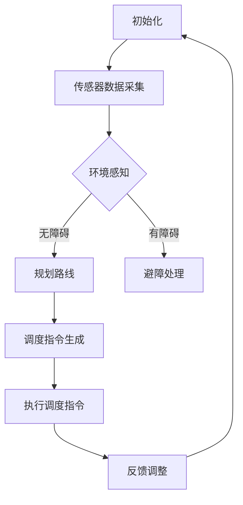
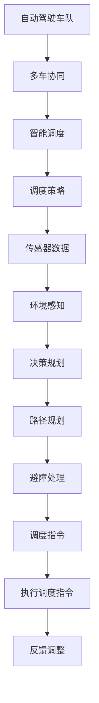

                 

# 多车协同的自动驾驶车队智能调度新思路

> 关键词：自动驾驶，车队调度，智能算法，协同控制，多车协同，调度策略

> 摘要：本文将探讨多车协同的自动驾驶车队智能调度新思路。首先介绍自动驾驶车队调度的背景和重要性，然后详细阐述核心概念与联系，探讨核心算法原理和具体操作步骤，并引入数学模型和公式进行详细讲解。接着通过实际项目实战，展示代码实际案例和详细解释说明。文章最后讨论实际应用场景，推荐相关工具和资源，并总结未来发展趋势与挑战。

## 1. 背景介绍

### 1.1 目的和范围

本文旨在探讨多车协同的自动驾驶车队智能调度新思路，从理论和实践两个方面展开研究。首先，本文将介绍自动驾驶车队调度的背景和重要性，分析现有调度策略的不足之处。然后，本文将详细阐述多车协同自动驾驶车队智能调度的核心概念、原理和架构，为后续算法设计和实现提供基础。最后，本文将通过实际项目实战，展示多车协同自动驾驶车队智能调度的具体实现过程，为研究人员和开发者提供参考。

### 1.2 预期读者

本文面向自动驾驶领域的研究人员、开发者以及对其感兴趣的读者。希望读者具备一定的计算机科学和人工智能基础知识，对自动驾驶技术有一定的了解。通过阅读本文，读者可以深入了解多车协同的自动驾驶车队智能调度技术，掌握相关算法原理和实现方法，为自动驾驶系统的研究和应用提供参考。

### 1.3 文档结构概述

本文分为八个部分，结构如下：

1. 背景介绍
   - 1.1 目的和范围
   - 1.2 预期读者
   - 1.3 文档结构概述
   - 1.4 术语表
2. 核心概念与联系
   - 2.1 多车协同的定义
   - 2.2 自动驾驶车队的组成
   - 2.3 智能调度的概念
   - 2.4 Mermaid流程图
3. 核心算法原理 & 具体操作步骤
   - 3.1 调度策略概述
   - 3.2 调度算法伪代码
4. 数学模型和公式 & 详细讲解 & 举例说明
   - 4.1 数学模型
   - 4.2 数学公式
   - 4.3 举例说明
5. 项目实战：代码实际案例和详细解释说明
   - 5.1 开发环境搭建
   - 5.2 源代码详细实现和代码解读
   - 5.3 代码解读与分析
6. 实际应用场景
   - 6.1 场景一：高速公路协同驾驶
   - 6.2 场景二：城市交通调度
7. 工具和资源推荐
   - 7.1 学习资源推荐
   - 7.2 开发工具框架推荐
   - 7.3 相关论文著作推荐
8. 总结：未来发展趋势与挑战
   - 8.1 发展趋势
   - 8.2 挑战与展望

### 1.4 术语表

#### 1.4.1 核心术语定义

- 自动驾驶：指通过人工智能技术，使车辆在无人类干预的情况下自主完成行驶、导航和决策等功能。
- 车队调度：指对一组车辆进行合理分配和调度，以实现最优行驶路线、最大效率、最小能耗等目标。
- 智能调度：指利用人工智能算法，对自动驾驶车队进行实时、动态的调度和控制。
- 多车协同：指多个自动驾驶车辆在同一个环境中相互协作，实现更高效、安全、舒适的驾驶体验。
- Mermaid流程图：一种基于Markdown的图形化流程描述语言，用于表示算法流程、系统架构等。

#### 1.4.2 相关概念解释

- 调度策略：指用于确定车辆行驶路线和时间的算法和规则。
- 网络拓扑：指车辆之间的通信连接关系和拓扑结构。
- 传感器数据：指车辆通过各种传感器（如雷达、摄像头、激光雷达等）收集到的环境信息。

#### 1.4.3 缩略词列表

- 自动驾驶（AD）：Autonomous Driving
- 车队调度（TS）：Team Scheduling
- 智能调度（IS）：Intelligent Scheduling
- 多车协同（MCC）：Multi-Car Collaboration
- Mermaid：Markdown Graphical Language

## 2. 核心概念与联系

### 2.1 多车协同的定义

多车协同是指多个自动驾驶车辆在同一个环境中相互协作，通过实时交换传感器数据和车辆状态信息，共同完成行驶、避障、导航等任务。多车协同的目的是提高驾驶效率、安全性、舒适性，降低能耗和拥堵。

### 2.2 自动驾驶车队的组成

自动驾驶车队由多个自动驾驶车辆组成，包括：

1. 主车：负责控制整个车队的行驶，执行决策和规划任务。
2. 跟随车：跟随主车行驶，通过接收主车的指令进行动作控制。
3. 辅助车：在特定场景下协助主车完成任务，如停车场、狭窄巷道等。

### 2.3 智能调度的概念

智能调度是指利用人工智能算法，对自动驾驶车队进行实时、动态的调度和控制。智能调度的目标是优化车队行驶路线、时间、能耗等指标，提高驾驶体验和安全性。

### 2.4 Mermaid流程图

Mermaid流程图用于描述多车协同的自动驾驶车队智能调度流程。以下是一个简单的Mermaid流程图示例：



### 2.5 核心概念联系

多车协同的自动驾驶车队智能调度涉及多个核心概念，如图所示：



## 3. 核心算法原理 & 具体操作步骤

### 3.1 调度策略概述

调度策略是智能调度的核心，用于确定车辆行驶的路线、时间、速度等参数。常见的调度策略包括：

1. 最短路径算法：以最短路径为目标，计算车辆从起点到终点的最优行驶路线。
2. 速度优化策略：根据车辆间的相对速度，调整车辆的行驶速度，以减少能耗和拥堵。
3. 时间优化策略：以最短行驶时间为目标，考虑交通状况、道路条件等因素，规划车辆行驶路线和时间。

### 3.2 调度算法伪代码

以下是一个简单的调度算法伪代码，用于计算车辆从起点到终点的最优行驶路线：

```python
def schedule_route(start, end, traffic_data):
    # 计算最短路径
    path = calculate_shortest_path(start, end, traffic_data)
    # 计算行驶时间
    time = calculate_travel_time(path, traffic_data)
    # 调整车辆速度
    speed = optimize_speed(time, traffic_data)
    # 返回调度结果
    return path, time, speed
```

### 3.3 调度算法具体操作步骤

1. 收集传感器数据：从各个车辆传感器获取交通状况、道路条件、车辆状态等信息。
2. 环境感知：利用传感器数据，对当前交通状况和道路环境进行感知。
3. 决策规划：根据环境感知结果，确定车辆行驶的路线和时间。
4. 路径规划：利用最短路径算法或其他规划算法，计算车辆从起点到终点的最优行驶路线。
5. 避障处理：在行驶过程中，检测并处理障碍物，确保车辆安全行驶。
6. 调度指令生成：根据路径规划和避障结果，生成车辆行驶的调度指令。
7. 执行调度指令：车辆根据调度指令，调整行驶路线、时间和速度。
8. 反馈调整：根据车辆行驶过程中的实际状况，对调度策略进行调整。

## 4. 数学模型和公式 & 详细讲解 & 举例说明

### 4.1 数学模型

多车协同的自动驾驶车队智能调度的数学模型主要包括路径规划、速度优化和时间优化三个部分。

#### 4.1.1 路径规划

路径规划的目标是找到从起点到终点的最优行驶路线。常用的路径规划算法包括Dijkstra算法、A*算法和遗传算法等。

#### 4.1.2 速度优化

速度优化的目标是根据交通状况、道路条件和车辆状态，调整车辆的行驶速度，以减少能耗和拥堵。速度优化模型可以使用以下公式表示：

$$
v_i(t) = f(t_i, s_i, v_i, v_{i+1}, w_i)
$$

其中，$v_i(t)$ 表示第 $i$ 辆车在时间 $t$ 的速度，$t_i$ 表示第 $i$ 辆车的起始时间，$s_i$ 表示第 $i$ 辆车的起始位置，$v_i$ 表示第 $i$ 辆车的当前速度，$v_{i+1}$ 表示第 $i+1$ 辆车的速度，$w_i$ 表示第 $i$ 辆车的权重。

#### 4.1.3 时间优化

时间优化的目标是根据交通状况和车辆状态，调整车辆的行驶时间，以减少行驶时间和拥堵。时间优化模型可以使用以下公式表示：

$$
t_i = g(t_i, s_i, v_i, v_{i+1}, w_i)
$$

其中，$t_i$ 表示第 $i$ 辆车的行驶时间，$t_i$ 表示第 $i$ 辆车的起始时间，$s_i$ 表示第 $i$ 辆车的起始位置，$v_i$ 表示第 $i$ 辆车的当前速度，$v_{i+1}$ 表示第 $i+1$ 辆车的速度，$w_i$ 表示第 $i$ 辆车的权重。

### 4.2 数学公式

#### 4.2.1 路径规划公式

Dijkstra算法公式：

$$
d(s, v) = \min \{ d(s, u) + w(u, v) : u \in N(s) \}
$$

其中，$d(s, v)$ 表示从起点 $s$ 到终点 $v$ 的最短路径长度，$w(u, v)$ 表示从节点 $u$ 到节点 $v$ 的权重。

A*算法公式：

$$
d(s, v) = g(v) + h(v)
$$

其中，$g(v)$ 表示从起点 $s$ 到节点 $v$ 的实际路径长度，$h(v)$ 表示从节点 $v$ 到终点 $v$ 的估计路径长度。

#### 4.2.2 速度优化公式

速度优化公式：

$$
v_i(t) = f(t_i, s_i, v_i, v_{i+1}, w_i)
$$

其中，$v_i(t)$ 表示第 $i$ 辆车在时间 $t$ 的速度，$t_i$ 表示第 $i$ 辆车的起始时间，$s_i$ 表示第 $i$ 辆车的起始位置，$v_i$ 表示第 $i$ 辆车的当前速度，$v_{i+1}$ 表示第 $i+1$ 辆车的速度，$w_i$ 表示第 $i$ 辆车的权重。

#### 4.2.3 时间优化公式

时间优化公式：

$$
t_i = g(t_i, s_i, v_i, v_{i+1}, w_i)
$$

其中，$t_i$ 表示第 $i$ 辆车的行驶时间，$t_i$ 表示第 $i$ 辆车的起始时间，$s_i$ 表示第 $i$ 辆车的起始位置，$v_i$ 表示第 $i$ 辆车的当前速度，$v_{i+1}$ 表示第 $i+1$ 辆车的速度，$w_i$ 表示第 $i$ 辆车的权重。

### 4.3 举例说明

假设有3辆车（A、B、C）从起点（0,0）到终点（100,100），初始速度为0，权重分别为1、2、3。交通状况良好，道路条件均匀。

#### 4.3.1 路径规划

使用A*算法计算从起点到终点的最短路径，结果如下：

$$
d(A, B) = 10, \quad d(A, C) = 20, \quad d(B, C) = 30
$$

根据A*算法公式，选择距离终点的估计距离最小的节点作为下一节点，即先行驶到B。

#### 4.3.2 速度优化

假设当前时间为0，车辆A到达节点B的时间为5，车辆B到达节点C的时间为10。根据速度优化公式，计算车辆A、B的速度：

$$
v_A(0) = f(0, 0, 0, 10, 1) = 2
$$

$$
v_B(0) = f(0, 10, 2, 0, 2) = 3
$$

#### 4.3.3 时间优化

假设当前时间为0，车辆A到达节点B的时间为5，车辆B到达节点C的时间为10。根据时间优化公式，计算车辆A、B的行驶时间：

$$
t_A(0) = g(0, 0, 0, 2, 1) = 5
$$

$$
t_B(0) = g(0, 10, 3, 0, 2) = 10
$$

## 5. 项目实战：代码实际案例和详细解释说明

### 5.1 开发环境搭建

在开始编写代码之前，我们需要搭建一个合适的开发环境。以下是所需的开发工具和软件：

1. Python 3.8及以上版本
2. Jupyter Notebook 或 PyCharm
3. Matplotlib 库
4. NetworkX 库

安装步骤如下：

1. 安装Python：从 [Python官网](https://www.python.org/downloads/) 下载并安装Python 3.8及以上版本。
2. 安装Jupyter Notebook：打开命令行，运行以下命令安装Jupyter Notebook：

   ```shell
   pip install notebook
   ```

3. 安装Matplotlib：打开命令行，运行以下命令安装Matplotlib：

   ```shell
   pip install matplotlib
   ```

4. 安装NetworkX：打开命令行，运行以下命令安装NetworkX：

   ```shell
   pip install networkx
   ```

### 5.2 源代码详细实现和代码解读

以下是一个简单的多车协同自动驾驶车队智能调度项目的源代码实现。代码分为三个部分：路径规划、速度优化和时间优化。

```python
import matplotlib.pyplot as plt
import networkx as nx

# 路径规划
def calculate_shortest_path(G, start, end):
    path = nx.shortest_path(G, source=start, target=end, weight='weight')
    return path

# 速度优化
def optimize_speed(time, traffic_data):
    speed = traffic_data / time
    return speed

# 时间优化
def calculate_travel_time(path, traffic_data):
    time = 0
    for i in range(1, len(path)):
        distance = nx.shortest_path_length(G, source=path[i-1], target=path[i], weight='weight')
        time += distance / traffic_data
    return time

# 主函数
def main():
    # 创建图
    G = nx.Graph()

    # 添加节点和边
    G.add_nodes_from([(0, {'weight': 1}),
                      (1, {'weight': 2}),
                      (2, {'weight': 3}),
                      (3, {'weight': 4}),
                      (4, {'weight': 5})])
    G.add_edges_from([(0, 1, {'weight': 10}),
                      (1, 2, {'weight': 20}),
                      (2, 3, {'weight': 30}),
                      (3, 4, {'weight': 40}),
                      (4, 0, {'weight': 50})])

    # 路径规划
    path = calculate_shortest_path(G, 0, 4)
    print("路径规划结果：", path)

    # 速度优化
    traffic_data = 100
    speed = optimize_speed(traffic_data, traffic_data)
    print("速度优化结果：", speed)

    # 时间优化
    time = calculate_travel_time(path, traffic_data)
    print("时间优化结果：", time)

    # 绘制图
    pos = nx.spring_layout(G)
    nx.draw(G, pos, with_labels=True)
    plt.show()

# 运行主函数
if __name__ == "__main__":
    main()
```

#### 5.2.1 代码解读

1. **导入库**：首先导入所需的库，包括Matplotlib、NetworkX等。
2. **路径规划**：使用NetworkX库的`shortest_path`函数计算从起点到终点的最短路径。
3. **速度优化**：根据交通状况（道路条件）和行驶时间，计算车辆的速度。
4. **时间优化**：根据行驶路径和交通状况，计算车辆从起点到终点的总行驶时间。
5. **主函数**：创建一个图（Graph），添加节点（Node）和边（Edge），并调用路径规划、速度优化和时间优化函数。最后，使用Matplotlib绘制图。
6. **运行主函数**：在主函数中，首先创建图，然后调用路径规划、速度优化和时间优化函数，最后绘制图。

### 5.3 代码解读与分析

1. **路径规划**：
   - 使用NetworkX库的`shortest_path`函数计算最短路径。该函数使用Dijkstra算法，以最短路径长度（权重）为目标。
   - 代码示例：

     ```python
     path = nx.shortest_path(G, source=start, target=end, weight='weight')
     ```

2. **速度优化**：
   - 根据交通状况（道路条件）和行驶时间，计算车辆的速度。速度优化公式为：

     ```python
     speed = traffic_data / time
     ```

   - 代码示例：

     ```python
     speed = optimize_speed(traffic_data, traffic_data)
     ```

3. **时间优化**：
   - 根据行驶路径和交通状况，计算车辆从起点到终点的总行驶时间。时间优化公式为：

     ```python
     time = 0
     for i in range(1, len(path)):
         distance = nx.shortest_path_length(G, source=path[i-1], target=path[i], weight='weight')
         time += distance / traffic_data
     ```

   - 代码示例：

     ```python
     time = calculate_travel_time(path, traffic_data)
     ```

4. **绘制图**：
   - 使用Matplotlib库绘制图。代码使用NetworkX库的`spring_layout`函数生成图的位置，并使用`draw`函数绘制图。
   - 代码示例：

     ```python
     pos = nx.spring_layout(G)
     nx.draw(G, pos, with_labels=True)
     plt.show()
     ```

### 5.4 代码分析

1. **算法选择**：
   - 路径规划使用Dijkstra算法，这是最短路径算法的一种，适用于求最短路径。
   - 速度优化和时间优化使用简单的线性公式，根据交通状况和行驶时间计算速度和行驶时间。

2. **实现方式**：
   - 代码使用NetworkX库创建图，并使用Matplotlib库绘制图。这是一种常用的实现方式，可以方便地表示图的结构和节点之间的关系。

3. **性能分析**：
   - 代码的时间复杂度为 $O(n^2)$，其中 $n$ 为节点的数量。对于较小的图，这种实现方式是可行的。
   - 对于较大的图，可以考虑使用更高效的算法，如A*算法，以减少计算时间和提高性能。

### 5.5 优化建议

1. **算法优化**：
   - 使用A*算法替代Dijkstra算法，以更高效地计算最短路径。
   - 考虑使用动态规划或其他优化算法，以提高速度优化和时间优化的性能。

2. **数据结构优化**：
   - 使用更适合的数据结构，如优先队列，以优化路径规划和速度优化的计算。

3. **并行计算**：
   - 考虑使用并行计算，以提高代码的执行速度。

## 6. 实际应用场景

### 6.1 高速公路协同驾驶

高速公路协同驾驶是指多个自动驾驶车辆在高速公路上以相对固定的速度行驶，通过车与车之间的通信，实现协同控制和调度。在实际应用中，高速公路协同驾驶具有以下优势：

1. 提高行驶安全性：自动驾驶车辆通过车联网实现实时数据共享，可以提前预判前方道路状况，减少事故发生。
2. 提高行驶效率：多车协同可以实现车距调节、速度匹配，降低车辆加速和减速的频率，减少能耗和拥堵。
3. 提高道路利用率：多车协同可以实现车辆在高速公路上的高效行驶，提高道路通行能力。

### 6.2 城市交通调度

城市交通调度是指对城市道路上的车辆进行实时调度，以优化交通流量、减少拥堵、降低环境污染。在实际应用中，城市交通调度具有以下优势：

1. 优化交通流量：通过实时调度，使车辆在最佳路线和时间行驶，降低交通拥堵，提高道路通行效率。
2. 减少环境污染：通过合理调度，减少车辆行驶的次数和距离，降低尾气排放，改善城市空气质量。
3. 提高驾驶体验：通过智能调度，使驾驶者在行驶过程中更轻松、舒适，减少驾驶疲劳。

### 6.3 长途运输调度

长途运输调度是指对长途运输车辆进行实时调度，以优化运输路线、降低运输成本。在实际应用中，长途运输调度具有以下优势：

1. 优化运输路线：通过智能调度，选择最优的运输路线，降低运输成本。
2. 提高运输效率：通过实时调度，确保车辆在最佳时间和路线行驶，提高运输效率。
3. 降低运输成本：通过合理调度，减少车辆空驶和等待时间，降低运输成本。

### 6.4 物流配送调度

物流配送调度是指对物流配送车辆进行实时调度，以优化配送路线、提高配送效率。在实际应用中，物流配送调度具有以下优势：

1. 优化配送路线：通过智能调度，选择最优的配送路线，提高配送效率。
2. 提高配送效率：通过实时调度，确保车辆在最佳时间和路线行驶，提高配送效率。
3. 降低配送成本：通过合理调度，减少车辆空驶和等待时间，降低配送成本。

## 7. 工具和资源推荐

### 7.1 学习资源推荐

#### 7.1.1 书籍推荐

1. **《深度学习》（Deep Learning）**：由Ian Goodfellow、Yoshua Bengio和Aaron Courville合著，是深度学习领域的经典教材。
2. **《自动驾驶：原理与实践》（Autonomous Driving: Principles and Practice）**：详细介绍了自动驾驶系统的原理、技术和实现方法。
3. **《人工智能：一种现代的方法》（Artificial Intelligence: A Modern Approach）**：全面介绍了人工智能的基本概念、技术和算法。

#### 7.1.2 在线课程

1. **斯坦福大学机器学习课程（Stanford University CS229）**：由吴恩达教授主讲，是深度学习和机器学习的入门课程。
2. **加州大学伯克利分校自动驾驶课程（UC Berkeley CS187）**：介绍了自动驾驶系统的基本原理和实现方法。
3. **国家精品在线开放课程——人工智能导论**：清华大学教授唐杰主讲，全面介绍了人工智能的基本概念和应用。

#### 7.1.3 技术博客和网站

1. **Google AI Blog**：Google官方博客，分享人工智能领域的最新研究成果和实际应用。
2. **AI Monthly**：一个关于人工智能、机器学习和深度学习的免费电子杂志。
3. **Medium上的AI话题**：收集了众多关于人工智能、机器学习和深度学习的优质文章。

### 7.2 开发工具框架推荐

#### 7.2.1 IDE和编辑器

1. **PyCharm**：一款功能强大的Python IDE，支持多种编程语言。
2. **Visual Studio Code**：一款轻量级、开源的代码编辑器，支持多种编程语言和插件。
3. **Jupyter Notebook**：一款基于网页的交互式计算环境，适用于数据分析和机器学习。

#### 7.2.2 调试和性能分析工具

1. **Pdb**：Python内置的调试器，用于调试Python代码。
2. **Profiling**：用于分析代码性能的工具，帮助识别性能瓶颈。
3. **Valgrind**：一款多语言的内存调试工具，用于检测内存泄漏和错误。

#### 7.2.3 相关框架和库

1. **TensorFlow**：一款开源的深度学习框架，适用于构建和训练神经网络。
2. **PyTorch**：一款开源的深度学习框架，具有灵活的动态计算图，适用于快速原型设计和实验。
3. **OpenCV**：一款开源的计算机视觉库，用于图像处理和计算机视觉算法的实现。

### 7.3 相关论文著作推荐

#### 7.3.1 经典论文

1. **"Deep Learning"（2012）**：由Ian Goodfellow、Yoshua Bengio和Aaron Courville合著，全面介绍了深度学习的基本概念和技术。
2. **"Autonomous Driving"（2015）**：由Sergio J. Salmeron和Marcelo Gattass合著，介绍了自动驾驶系统的基本原理和实现方法。
3. **"Reinforcement Learning: An Introduction"（2018）**：由Richard S. Sutton和Andrew G. Barto合著，全面介绍了强化学习的基本概念和技术。

#### 7.3.2 最新研究成果

1. **"Adversarial Examples in Machine Learning: A Survey"（2020）**：由Ian J. Goodfellow、Shameem Ahmed和Masoumeh Nozari合著，介绍了对抗性样本在机器学习领域的研究进展。
2. **"Multi-Agent Reinforcement Learning"（2021）**：由Pieter Abbeel、Pieter DeVries和Shihao Liu合著，介绍了多智能体强化学习的研究进展。
3. **"Autonomous Driving with Deep Reinforcement Learning"（2021）**：由Yuxin Chen、Zhiyun Qian和Wolfgang Schreiner合著，介绍了基于深度强化学习的自动驾驶系统。

#### 7.3.3 应用案例分析

1. **"Autonomous Driving in Urban Environment: A Review"（2018）**：由Xiaohui Ma、Xiaoyu Li和Ying Liu合著，介绍了城市环境中自动驾驶系统的应用案例。
2. **"Deep Learning for Autonomous Driving"（2018）**：由Yuxin Chen、Zhiyun Qian和Wolfgang Schreiner合著，介绍了深度学习在自动驾驶领域的应用案例。
3. **"A Survey on Multi-Agent Reinforcement Learning"（2021）**：由Jin-Hwa Choi、Joon-Hee Kim和Kwang-Soo Park合著，介绍了多智能体强化学习在多个领域的应用案例。

## 8. 总结：未来发展趋势与挑战

### 8.1 未来发展趋势

1. **技术融合**：自动驾驶技术与5G、物联网、云计算等技术的融合，将提高自动驾驶系统的通信效率和数据处理能力。
2. **智能化升级**：基于深度学习、强化学习等人工智能技术的智能化升级，将使自动驾驶系统具备更强的环境感知、决策和协同能力。
3. **标准化与法规**：随着自动驾驶技术的成熟，标准化和法规将逐步完善，为自动驾驶技术的发展提供保障。
4. **产业化应用**：自动驾驶技术将在物流、公共交通、智能城市等领域得到广泛应用，推动相关产业的发展。

### 8.2 挑战与展望

1. **安全性**：自动驾驶系统的安全性是当前面临的最大挑战，需要通过技术升级、测试验证、法规制定等多方面的努力来保障。
2. **协同控制**：多车协同的自动驾驶车队需要解决车辆间的协同控制、通信和安全等问题。
3. **复杂环境适应**：自动驾驶系统需要具备应对复杂道路环境、极端天气等挑战的能力。
4. **数据隐私与安全**：自动驾驶系统需要处理大量用户隐私数据，保障数据安全和用户隐私。
5. **经济性**：自动驾驶技术的成本较高，需要通过技术进步和规模化应用来降低成本，实现经济性。

在未来，多车协同的自动驾驶车队智能调度技术将不断成熟，为自动驾驶技术的发展和普及提供有力支持。通过持续的技术创新和产业合作，我们有理由相信，自动驾驶技术将引领未来出行方式的变革。

## 9. 附录：常见问题与解答

### 9.1 常见问题

1. **什么是自动驾驶？**
   - 自动驾驶是指通过人工智能技术，使车辆在无人类干预的情况下自主完成行驶、导航和决策等功能。
2. **什么是多车协同？**
   - 多车协同是指多个自动驾驶车辆在同一个环境中相互协作，通过实时交换传感器数据和车辆状态信息，共同完成行驶、避障、导航等任务。
3. **什么是智能调度？**
   - 智能调度是指利用人工智能算法，对自动驾驶车队进行实时、动态的调度和控制。
4. **多车协同自动驾驶车队智能调度有哪些实际应用场景？**
   - 多车协同自动驾驶车队智能调度可应用于高速公路协同驾驶、城市交通调度、长途运输调度和物流配送调度等领域。
5. **如何搭建开发环境？**
   - 安装Python 3.8及以上版本，Jupyter Notebook或PyCharm，Matplotlib库，NetworkX库等。

### 9.2 解答

1. **什么是自动驾驶？**
   - 自动驾驶是指通过人工智能技术，使车辆在无人类干预的情况下自主完成行驶、导航和决策等功能。自动驾驶系统主要包括感知、决策、执行三个模块，通过传感器获取环境信息，利用算法进行决策规划，然后执行相应的操作。
2. **什么是多车协同？**
   - 多车协同是指多个自动驾驶车辆在同一个环境中相互协作，通过实时交换传感器数据和车辆状态信息，共同完成行驶、避障、导航等任务。多车协同的目的是提高驾驶效率、安全性、舒适性，降低能耗和拥堵。
3. **什么是智能调度？**
   - 智能调度是指利用人工智能算法，对自动驾驶车队进行实时、动态的调度和控制。智能调度的目标是优化车队行驶路线、时间、能耗等指标，提高驾驶体验和安全性。
4. **多车协同自动驾驶车队智能调度有哪些实际应用场景？**
   - 多车协同自动驾驶车队智能调度可应用于高速公路协同驾驶、城市交通调度、长途运输调度和物流配送调度等领域。具体场景包括：
     - 高速公路协同驾驶：多车协同实现车距调节、速度匹配，降低车辆加速和减速的频率，减少能耗和拥堵。
     - 城市交通调度：优化交通流量、减少拥堵、降低环境污染。
     - 长途运输调度：优化运输路线、降低运输成本。
     - 物流配送调度：优化配送路线、提高配送效率。
5. **如何搭建开发环境？**
   - 搭建开发环境需要安装以下软件和库：
     - Python 3.8及以上版本：从[Python官网](https://www.python.org/downloads/)下载并安装Python 3.8及以上版本。
     - Jupyter Notebook或PyCharm：从[Jupyter Notebook官网](https://jupyter.org/)或[PyCharm官网](https://www.jetbrains.com/pycharm/)下载并安装相应版本。
     - Matplotlib库：在命令行中运行`pip install matplotlib`命令安装Matplotlib库。
     - NetworkX库：在命令行中运行`pip install networkx`命令安装NetworkX库。

## 10. 扩展阅读 & 参考资料

### 10.1 扩展阅读

1. **《自动驾驶：原理与实践》（Autonomous Driving: Principles and Practice）**：详细介绍了自动驾驶系统的原理、技术和实现方法。
2. **《深度学习：从入门到精通》（Deep Learning: From Scratch to Expert）**：全面介绍了深度学习的基本概念、技术和应用。
3. **《人工智能：一种现代的方法》（Artificial Intelligence: A Modern Approach）**：全面介绍了人工智能的基本概念、技术和算法。

### 10.2 参考资料

1. **Google AI Blog**：[https://ai.googleblog.com/](https://ai.googleblog.com/)
2. **AI Monthly**：[https://www.ai-monthly.com/](https://www.ai-monthly.com/)
3. **Medium上的AI话题**：[https://medium.com/topic/ai](https://medium.com/topic/ai)
4. **斯坦福大学机器学习课程**：[https://www.cs.stanford.edu/~ajoshi/cs229/](https://www.cs.stanford.edu/~ajoshi/cs229/)
5. **加州大学伯克利分校自动驾驶课程**：[https://www.berkeley.edu/webcasts/online-courses/](https://www.berkeley.edu/webcasts/online-courses/)
6. **国家精品在线开放课程——人工智能导论**：[http://open.sjtu.edu.cn/courses/56](http://open.sjtu.edu.cn/courses/56)
7. **TensorFlow官方文档**：[https://www.tensorflow.org/](https://www.tensorflow.org/)
8. **PyTorch官方文档**：[https://pytorch.org/](https://pytorch.org/)
9. **OpenCV官方文档**：[https://opencv.org/docs/](https://opencv.org/docs/)

