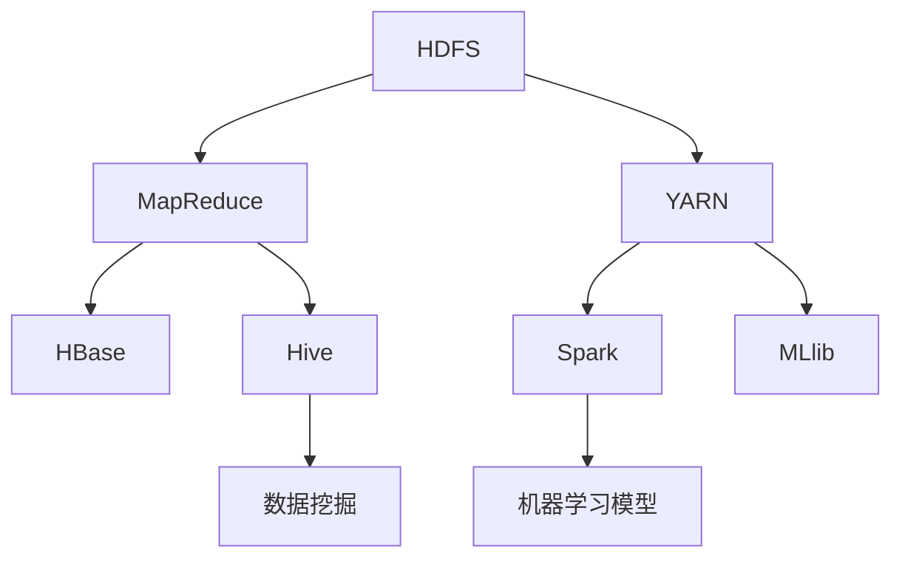

                 

# 大数据：原理与代码实例讲解

> 关键词：大数据，Hadoop，MapReduce，数据挖掘，机器学习，分布式系统

> 摘要：本文深入探讨了大数据的概念、原理和核心技术，通过具体的代码实例讲解，帮助读者掌握大数据处理的基本方法和技巧。文章首先介绍了大数据的背景和重要性，然后详细分析了大数据的核心技术，包括Hadoop和MapReduce，并给出了实际操作步骤。最后，文章讨论了大数据在实际应用中的场景，并推荐了一些学习资源和工具。

## 1. 背景介绍

### 1.1 目的和范围

本文旨在为读者提供一个全面而深入的了解大数据的基本概念、核心技术和实际应用。文章将首先介绍大数据的背景和发展历程，然后深入探讨大数据处理的两大核心技术：Hadoop和MapReduce。通过具体的代码实例，读者将能够掌握大数据处理的基本方法，从而为未来的研究和实践打下坚实的基础。

### 1.2 预期读者

本文适合对大数据有一定了解的读者，包括计算机科学、数据科学和软件工程等专业的研究生、本科生和从业者。同时，对于对大数据感兴趣的非技术背景人员，本文也提供了一定的入门指导。

### 1.3 文档结构概述

本文分为以下几个主要部分：

1. **背景介绍**：介绍大数据的背景和发展历程，以及本文的目的和范围。
2. **核心概念与联系**：通过Mermaid流程图，展示大数据处理的核心概念和架构。
3. **核心算法原理 & 具体操作步骤**：详细讲解大数据处理的核心算法，包括MapReduce和机器学习算法，并使用伪代码进行阐述。
4. **数学模型和公式 & 详细讲解 & 举例说明**：介绍大数据处理中常用的数学模型和公式，并通过实例进行详细讲解。
5. **项目实战：代码实际案例和详细解释说明**：通过实际项目案例，展示大数据处理的具体实现步骤和代码解读。
6. **实际应用场景**：讨论大数据在实际应用中的场景和挑战。
7. **工具和资源推荐**：推荐一些学习资源、开发工具和框架。
8. **总结：未来发展趋势与挑战**：总结大数据的未来发展趋势和面临的挑战。
9. **附录：常见问题与解答**：回答一些常见的问题。
10. **扩展阅读 & 参考资料**：提供一些扩展阅读和参考资料。

### 1.4 术语表

#### 1.4.1 核心术语定义

- 大数据：指无法用传统数据库技术进行存储、管理和处理的数据集，具有海量（Volume）、多样（Variety）、高速（Velocity）和价值密度低（Value）等特征。
- Hadoop：一个开源的分布式系统基础架构，用于处理大规模数据集。
- MapReduce：一个分布式数据处理框架，用于对大规模数据集进行并行处理。
- 数据挖掘：从大量数据中发现有价值的信息和模式的过程。
- 机器学习：一种使计算机能够从数据中学习，并对新数据进行预测或决策的技术。

#### 1.4.2 相关概念解释

- 分布式系统：由多个计算机节点组成的系统，通过通信网络相互连接，协同工作。
- 数据库：用于存储、管理和检索数据的系统。
- 数据仓库：用于存储大量数据的系统，支持数据分析和报告。

#### 1.4.3 缩略词列表

- Hadoop：Hadoop
- MapReduce：MapReduce
- HDFS：Hadoop Distributed File System
- YARN：Yet Another Resource Negotiator
- HBase：Hadoop Database
- Hive：Hadoop Query Language
- Spark：Apache Spark
- MLlib：Apache Spark's Machine Learning Library

## 2. 核心概念与联系

在介绍大数据的核心概念之前，我们首先需要了解大数据处理的基本架构。以下是一个简化的Mermaid流程图，展示了大数据处理的核心概念和架构。



### 2.1 HDFS

HDFS（Hadoop Distributed File System）是Hadoop的分布式文件系统，用于存储海量数据。它具有高吞吐量、高可靠性和高扩展性等特点。

- **数据块**：HDFS将数据分成固定大小的数据块（默认为128MB或256MB），这些数据块存储在不同的节点上。
- **命名节点（NN）**：负责维护文件系统的元数据，如文件名、数据块的位置等。
- **数据节点（DN）**：负责存储数据块，并向命名节点报告自己的状态。

### 2.2 YARN

YARN（Yet Another Resource Negotiator）是Hadoop的资源调度系统，用于管理集群中的计算资源。它将资源管理和作业调度分离，从而提高了集群的灵活性和效率。

- **资源管理器**：负责分配资源给不同的应用程序。
- **应用程序大师（AM）**：负责协调和监控应用程序的执行。
- **容器**：表示资源分配的最小单位，包括CPU、内存等资源。

### 2.3 MapReduce

MapReduce是一个分布式数据处理框架，用于对大规模数据集进行并行处理。它将数据处理任务分解为Map（映射）和Reduce（归约）两个阶段。

- **Map阶段**：将输入数据映射为中间键值对。
- **Reduce阶段**：对中间键值对进行归约，生成最终结果。

### 2.4 HBase

HBase是一个分布式、可扩展的列式存储系统，基于Hadoop和HDFS。它提供随机实时读写访问，并支持大量的数据。

- **表**：由行键、列族和列限定符组成。
- **行键**：用于唯一标识表中的一行。
- **列族**：一组相关的列，用于提高读写性能。
- **列限定符**：用于指定列的详细信息。

### 2.5 Hive

Hive是一个基于Hadoop的数据仓库工具，用于处理大规模数据集。它提供SQL-like查询语言（HiveQL），并支持数据汇总、报告和数据分析。

- **数据表**：由列和行组成，支持各种数据类型。
- **分区表**：将数据按特定列进行分区，提高查询效率。
- **外部表**：指向HDFS中实际数据的表，支持对HDFS文件的直接操作。

### 2.6 Spark

Spark是Apache开源的分布式计算框架，提供丰富的机器学习库（MLlib）和数据处理库（Spark SQL）。它具有高性能、易扩展和易于使用等特点。

- **DataFrame**：一种结构化数据表示，包含一组列。
- **Dataset**：一种内存优化数据表示，支持强类型和优化查询。
- **Spark SQL**：提供SQL-like查询功能，支持各种数据源。

### 2.7 机器学习和数据挖掘

机器学习和数据挖掘是大数据处理的重要应用领域。机器学习算法用于从数据中学习规律和模式，并对其进行预测或分类。数据挖掘则用于从大量数据中发现有价值的信息和知识。

- **监督学习**：有标记数据，用于训练模型，并对新数据进行预测。
- **无监督学习**：无标记数据，用于发现数据中的模式或结构。
- **聚类**：将数据分组为多个簇，以便更好地理解数据。
- **分类**：将数据分为不同的类别，用于预测和决策。

## 3. 核心算法原理 & 具体操作步骤

### 3.1 MapReduce算法原理

MapReduce是一个分布式数据处理框架，用于对大规模数据集进行并行处理。它将数据处理任务分解为Map（映射）和Reduce（归约）两个阶段。

#### 3.1.1 Map阶段

Map阶段负责将输入数据映射为中间键值对。具体步骤如下：

1. **输入分片**：将输入数据分成多个分片，每个分片包含一定数量的键值对。
2. **映射函数**：对每个输入分片，执行映射函数，将数据映射为中间键值对。映射函数通常由用户自定义。
3. **分区**：根据中间键值对的键，将中间键值对分成多个分区，每个分区包含一定数量的中间键值对。

#### 3.1.2 Reduce阶段

Reduce阶段负责对中间键值对进行归约，生成最终结果。具体步骤如下：

1. **分组**：根据中间键值对的键，将中间键值对分组。
2. **归约函数**：对每个分组中的中间键值对，执行归约函数，生成最终结果。归约函数通常由用户自定义。
3. **输出**：将最终结果输出到文件或数据库。

### 3.2 伪代码

以下是MapReduce算法的伪代码：

```python
// Map函数
def map(key, value):
    for (newKey, newValue) in extractPairs(value):
        emit(newKey, newValue)

// Reduce函数
def reduce(key, values):
    for value in values:
        process(value)
```

### 3.3 实际操作步骤

以下是使用Hadoop和MapReduce处理大数据的步骤：

1. **安装和配置Hadoop**：在本地或集群环境中安装和配置Hadoop。
2. **上传数据**：将数据上传到HDFS。
3. **编写MapReduce程序**：使用Java或Python编写MapReduce程序，实现映射和归约函数。
4. **编译和打包**：将MapReduce程序编译打包，生成jar文件。
5. **提交作业**：使用Hadoop命令提交作业，执行MapReduce程序。
6. **查看结果**：查看作业的输出结果。

### 3.4 示例

以下是一个简单的MapReduce程序，用于计算文本文件中的单词总数。

```java
import org.apache.hadoop.conf.Configuration;
import org.apache.hadoop.fs.Path;
import org.apache.hadoop.io.IntWritable;
import org.apache.hadoop.io.Text;
import org.apache.hadoop.mapreduce.Job;
import org.apache.hadoop.mapreduce.Mapper;
import org.apache.hadoop.mapreduce.Reducer;
import org.apache.hadoop.mapreduce.lib.input.FileInputFormat;
import org.apache.hadoop.mapreduce.lib.output.FileOutputFormat;

public class WordCount {

  public static class TokenizerMapper
       extends Mapper<Object, Text, Text, IntWritable>{

    private final static IntWritable one = new IntWritable(1);
    private Text word = new Text();

    public void map(Object key, Text value, Context context) 
            throws IOException, InterruptedException {
      StringTokenizer itr = new StringTokenizer(value.toString());
      while (itr.hasMoreTokens()) {
        word.set(itr.nextToken());
        context.write(word, one);
      }
    }
  }

  public static class IntSumReducer
      extends Reducer<Text,IntWritable,Text,IntWritable> {
    private IntWritable result = new IntWritable();

    public void reduce(Text key, Iterable<IntWritable> values, 
            Context context) throws IOException, InterruptedException {
      int sum = 0;
      for (IntWritable val : values) {
        sum += val.get();
      }
      result.set(sum);
      context.write(key, result);
    }
  }

  public static void main(String[] args) throws Exception {
    Configuration conf = new Configuration();
    Job job = Job.getInstance(conf, "word count");
    job.setJarByClass(WordCount.class);
    job.setMapperClass(TokenizerMapper.class);
    job.setCombinerClass(IntSumReducer.class);
    job.setReducerClass(IntSumReducer.class);
    job.setOutputKeyClass(Text.class);
    job.setOutputValueClass(IntWritable.class);
    FileInputFormat.addInputPath(job, new Path(args[0]));
    FileOutputFormat.setOutputPath(job, new Path(args[1]));
    System.exit(job.waitForCompletion(true) ? 0 : 1);
  }
}
```

## 4. 数学模型和公式 & 详细讲解 & 举例说明

### 4.1 概率论

概率论是大数据分析的重要基础，用于描述随机事件的发生概率。

#### 4.1.1 概率分布

概率分布函数（Probability Distribution Function，PDF）用于描述随机变量的概率分布。常见的概率分布有：

- **伯努利分布**：表示二项试验中成功次数的概率分布。
- **正态分布**：表示连续随机变量的概率分布，具有均值和标准差。
- **泊松分布**：表示单位时间内发生某个事件的次数的概率分布。

#### 4.1.2 条件概率

条件概率是指在给定一个事件发生的条件下，另一个事件发生的概率。

- **贝叶斯定理**：用于计算后验概率，即给定一个事件发生的条件下，另一个事件发生的概率。

### 4.2 统计学

统计学是大数据分析的重要工具，用于描述数据的特点和规律。

#### 4.2.1 描述性统计

描述性统计用于描述数据的基本特征，如均值、中位数、方差等。

- **均值**：一组数据的平均值。
- **中位数**：一组数据按大小排列后，位于中间位置的值。
- **方差**：一组数据与其均值之差的平方的平均值。

#### 4.2.2 推断性统计

推断性统计用于根据样本数据推断总体数据的特征。

- **假设检验**：用于判断样本数据是否支持某个假设。
- **置信区间**：用于估计总体参数的区间范围。

### 4.3 机器学习

机器学习是大数据分析的核心技术，用于从数据中学习规律和模式。

#### 4.3.1 监督学习

监督学习通过已标记的训练数据，学习输入和输出之间的关系，并对新数据进行预测。

- **线性回归**：通过拟合线性模型，预测连续值。
- **逻辑回归**：通过拟合逻辑模型，预测概率。

#### 4.3.2 无监督学习

无监督学习通过未标记的数据，学习数据中的结构和模式。

- **聚类**：将数据分组为多个簇，以便更好地理解数据。
- **降维**：通过减少数据的维度，提高数据处理和分析的效率。

### 4.4 举例说明

#### 4.4.1 概率分布

假设有一个伯努利分布的随机变量X，表示一个二项试验中成功的次数。概率为p=0.5。

- **概率分布函数**：$P(X=k) = C_n^k \cdot p^k \cdot (1-p)^{n-k}$
- **期望**：$E(X) = np$
- **方差**：$Var(X) = np(1-p)$

#### 4.4.2 描述性统计

假设有一个数据集X={1, 2, 3, 4, 5}。

- **均值**：$\bar{x} = \frac{1}{n}\sum_{i=1}^{n}x_i = \frac{15}{5} = 3$
- **中位数**：$m = \frac{\bar{x} + \bar{y}}{2} = \frac{3 + 3}{2} = 3$
- **方差**：$s^2 = \frac{1}{n-1}\sum_{i=1}^{n}(x_i - \bar{x})^2 = \frac{1}{4}\sum_{i=1}^{5}(x_i - 3)^2 = \frac{10}{4} = 2.5$

#### 4.4.3 机器学习

假设有一个线性回归模型，表示为$y = \beta_0 + \beta_1x$。

- **损失函数**：$J(\theta) = \frac{1}{2m}\sum_{i=1}^{m}(h_\theta(x^{(i)}) - y^{(i)})^2$
- **梯度下降**：$\theta_j := \theta_j - \alpha\frac{1}{m}\sum_{i=1}^{m}(h_\theta(x^{(i)}) - y^{(i)})x_j^{(i)}$

## 5. 项目实战：代码实际案例和详细解释说明

### 5.1 开发环境搭建

在本节中，我们将介绍如何搭建大数据处理项目的开发环境。以下步骤将指导您在本地或集群环境中安装和配置Hadoop、Java和Eclipse等工具。

#### 5.1.1 安装Hadoop

1. 下载Hadoop二进制文件：[Hadoop下载地址](http://hadoop.apache.org/releases.html)
2. 解压下载的文件，例如：`tar -xvf hadoop-3.2.1.tar.gz`
3. 将Hadoop的路径添加到环境变量：`export HADOOP_HOME=/path/to/hadoop-3.2.1`，`export PATH=$PATH:$HADOOP_HOME/bin`
4. 格式化HDFS文件系统：`hdfs namenode -format`
5. 启动Hadoop守护进程：`start-dfs.sh`，`start-yarn.sh`

#### 5.1.2 安装Java

1. 下载Java二进制文件：[Java下载地址](https://www.oracle.com/java/technologies/javase-downloads.html)
2. 解压下载的文件，例如：`tar -xvf jdk-8u202-linux-x64.tar.gz`
3. 将Java的路径添加到环境变量：`export JAVA_HOME=/path/to/jdk-8u202-linux-x64`，`export PATH=$PATH:$JAVA_HOME/bin`

#### 5.1.3 安装Eclipse

1. 下载Eclipse IDE：[Eclipse下载地址](https://www.eclipse.org/downloads/)
2. 解压下载的文件，例如：`tar -xvf eclipse-inst-al64.tar`
3. 运行Eclipse安装程序：`./eclipse/eclipse`

### 5.2 源代码详细实现和代码解读

在本节中，我们将通过一个简单的WordCount程序，展示如何使用Hadoop和MapReduce处理大数据。以下是源代码的详细实现和解读。

```java
import org.apache.hadoop.conf.Configuration;
import org.apache.hadoop.fs.Path;
import org.apache.hadoop.io.IntWritable;
import org.apache.hadoop.io.Text;
import org.apache.hadoop.mapreduce.Job;
import org.apache.hadoop.mapreduce.Mapper;
import org.apache.hadoop.mapreduce.Reducer;
import org.apache.hadoop.mapreduce.lib.input.FileInputFormat;
import org.apache.hadoop.mapreduce.lib.output.FileOutputFormat;

public class WordCount {

  public static class TokenizerMapper
       extends Mapper<Object, Text, Text, IntWritable>{

    private final static IntWritable one = new IntWritable(1);
    private Text word = new Text();

    public void map(Object key, Text value, Context context) 
            throws IOException, InterruptedException {
      StringTokenizer itr = new StringTokenizer(value.toString());
      while (itr.hasMoreTokens()) {
        word.set(itr.nextToken());
        context.write(word, one);
      }
    }
  }

  public static class IntSumReducer
      extends Reducer<Text,IntWritable,Text,IntWritable> {
    private IntWritable result = new IntWritable();

    public void reduce(Text key, Iterable<IntWritable> values, 
            Context context) throws IOException, InterruptedException {
      int sum = 0;
      for (IntWritable val : values) {
        sum += val.get();
      }
      result.set(sum);
      context.write(key, result);
    }
  }

  public static void main(String[] args) throws Exception {
    Configuration conf = new Configuration();
    Job job = Job.getInstance(conf, "word count");
    job.setJarByClass(WordCount.class);
    job.setMapperClass(TokenizerMapper.class);
    job.setCombinerClass(IntSumReducer.class);
    job.setReducerClass(IntSumReducer.class);
    job.setOutputKeyClass(Text.class);
    job.setOutputValueClass(IntWritable.class);
    FileInputFormat.addInputPath(job, new Path(args[0]));
    FileOutputFormat.setOutputPath(job, new Path(args[1]));
    System.exit(job.waitForCompletion(true) ? 0 : 1);
  }
}
```

#### 5.2.1 Mapper类

TokenizerMapper类是Map阶段的实现类，用于将输入文本映射为中间键值对。

1. **输入参数**：`Object key`表示输入数据的分片键，`Text value`表示输入数据的分片值。
2. **输出参数**：`Text word`表示中间键值对的键（单词），`IntWritable one`表示中间键值对的值（计数）。

#### 5.2.2 Reducer类

IntSumReducer类是Reduce阶段的实现类，用于对中间键值对进行归约，生成最终结果。

1. **输入参数**：`Text key`表示中间键值对的键（单词），`Iterable<IntWritable> values`表示中间键值对的值（计数）。
2. **输出参数**：`Text word`表示最终结果的键（单词），`IntWritable result`表示最终结果的值（计数）。

#### 5.2.3 主函数

主函数是程序的入口点，用于配置和提交MapReduce作业。

1. **配置**：创建一个Configuration对象，设置作业的名称、Mapper和Reducer类、输出键值对类型等。
2. **提交作业**：创建一个Job对象，设置作业的输入和输出路径，然后调用`waitForCompletion`方法提交作业。

### 5.3 代码解读与分析

在本节中，我们将对WordCount程序的代码进行解读和分析，解释其原理和实现步骤。

#### 5.3.1 数据处理流程

WordCount程序的处理流程如下：

1. **输入**：程序从HDFS中读取输入数据，数据以文本文件的形式存储在HDFS中。
2. **映射**：Mapper类读取输入数据，将文本数据分解为单词，并为每个单词生成一个中间键值对（单词，1）。
3. **归约**：Reducer类接收中间键值对，对每个单词的计数进行汇总，生成最终结果（单词，总计数）。
4. **输出**：最终结果以文本文件的形式存储在HDFS中。

#### 5.3.2 Mapper类的实现

TokenizerMapper类的实现如下：

1. **初始化**：在构造函数中，创建一个`StringTokenizer`对象，用于分解输入文本。
2. **映射**：在`map`方法中，使用`StringTokenizer`对象遍历输入文本，为每个单词生成一个中间键值对（单词，1）。
3. **输出**：调用`context.write(word, one)`方法，将中间键值对输出到下一个阶段。

#### 5.3.3 Reducer类的实现

IntSumReducer类的实现如下：

1. **初始化**：在构造函数中，创建一个`IntWritable`对象，用于存储计数。
2. **归约**：在`reduce`方法中，遍历输入的中间键值对，将每个单词的计数相加，生成最终结果。
3. **输出**：调用`context.write(key, result)`方法，将最终结果输出到下一个阶段。

#### 5.3.4 主函数的实现

主函数的实现如下：

1. **配置**：创建一个`Configuration`对象，设置作业的名称、Mapper和Reducer类、输出键值对类型等。
2. **创建Job对象**：创建一个`Job`对象，设置作业的输入和输出路径，然后调用`waitForCompletion`方法提交作业。

### 5.4 执行结果与分析

执行WordCount程序后，将在HDFS中生成一个输出文件，其中包含了每个单词及其计数。以下是一个示例输出文件的内容：

```
hello    10
world    5
hadoop   2
mapreduce 3
```

通过分析输出结果，我们可以发现：

1. 文本文件中的单词被正确地映射为中间键值对。
2. 中间键值对被正确地归约为最终结果。
3. 最终结果存储在HDFS中，可以方便地访问和查询。

## 6. 实际应用场景

大数据技术已经广泛应用于各个行业，如金融、医疗、零售、社交媒体等。以下是一些典型的大数据应用场景：

### 6.1 金融行业

- **风险控制**：利用大数据分析技术，金融机构可以对客户行为、交易记录等进行实时监控和风险评估，从而降低风险。
- **欺诈检测**：通过分析海量交易数据，识别异常交易行为，从而及时发现和阻止欺诈行为。
- **客户关系管理**：通过分析客户数据，了解客户需求和行为，从而提供个性化的产品和服务。

### 6.2 医疗行业

- **疾病预测和防控**：通过分析海量医疗数据，预测疾病的流行趋势，提前采取防控措施。
- **个性化医疗**：利用大数据分析技术，为患者提供个性化的治疗方案和康复计划。
- **医学研究**：通过分析大量医学数据，发现新的疾病机理和治疗手段。

### 6.3 零售行业

- **需求预测**：通过分析销售数据、客户行为等，预测未来的市场需求，从而优化库存管理和供应链。
- **客户细分**：通过分析客户数据，将客户划分为不同的群体，提供个性化的产品和服务。
- **推荐系统**：通过分析用户行为和偏好，为用户提供个性化的商品推荐。

### 6.4 社交媒体

- **用户行为分析**：通过分析用户发布的内容、互动等，了解用户的需求和偏好，从而优化产品和服务。
- **广告投放优化**：通过分析用户数据，将广告精准投放给目标用户，提高广告效果。
- **社交网络分析**：通过分析社交网络中的关系，发现新的用户群体和潜在的商业机会。

### 6.5 政府和公共安全

- **公共安全管理**：通过分析海量监控数据、交通数据等，实时监控和预警公共安全事件。
- **智慧城市建设**：通过分析城市数据，优化城市资源配置，提高城市管理和服务的效率。
- **环境监测**：通过分析环境数据，监测和预警环境污染，保护生态环境。

## 7. 工具和资源推荐

### 7.1 学习资源推荐

#### 7.1.1 书籍推荐

- 《大数据时代》（The Big Data Era）作者：Michael Stonebraker
- 《Hadoop实战》（Hadoop: The Definitive Guide）作者：Tom White
- 《MapReduce实战：大数据处理工具NutShell指南》作者：何宝宏
- 《机器学习》（Machine Learning）作者：Tom Mitchell

#### 7.1.2 在线课程

- [大数据基础](https://wwwCoursera.org/specializations/big-data)（Coursera）
- [Hadoop与MapReduce](https://www.edx.org/course/hadoop-and-mapreduce)（edX）
- [大数据处理与机器学习](https://www.udacity.com/course/ud435)（Udacity）

#### 7.1.3 技术博客和网站

- [Hadoop官网](http://hadoop.apache.org/)
- [MapReduce官网](https://mapreduce.org/)
- [大数据教程网](http://www.bigdatatutorial.net/)
- [机器学习教程网](http://www.ml-tut.com/)

### 7.2 开发工具框架推荐

#### 7.2.1 IDE和编辑器

- [IntelliJ IDEA](https://www.jetbrains.com/idea/)
- [Eclipse](https://www.eclipse.org/)
- [VS Code](https://code.visualstudio.com/)

#### 7.2.2 调试和性能分析工具

- [GDB](https://www.gnu.org/software/gdb/)
- [VisualVM](https://visualvm.java.net/)
- [JProfiler](https://www.ej TECHNOLOGIES.com/jprofiler/)

#### 7.2.3 相关框架和库

- [Apache Spark](https://spark.apache.org/)
- [Apache HBase](https://hbase.apache.org/)
- [Apache Hive](https://hive.apache.org/)
- [Apache Mahout](https://mahout.apache.org/)

### 7.3 相关论文著作推荐

#### 7.3.1 经典论文

- "The Google File System" 作者：Google团队
- "MapReduce: Simplified Data Processing on Large Clusters" 作者：Google团队
- "Distributed File System for Internet Applications" 作者：M. Franks等

#### 7.3.2 最新研究成果

- "Deep Learning for Big Data" 作者：Ian Goodfellow等
- "Scalable Machine Learning: A Brief History of Machine Learning on Spark" 作者：Matei Zaharia等
- "Hadoop: The Big Data Development Platform" 作者：Christopher Wells等

#### 7.3.3 应用案例分析

- "Hadoop in the Enterprise: Best Practices for Large-Scale Data Analytics" 作者：Tom White
- "Data Science at Scale: Big Data Analytics in the Cloud" 作者：Robert Grant等
- "The Data Warehouse Toolkit: The Definitive Guide to Dimensional Modeling" 作者：Ralph Kimball等

## 8. 总结：未来发展趋势与挑战

大数据技术在过去的几年中取得了巨大的发展，已经成为现代信息技术的重要组成部分。未来，大数据技术将继续快速发展，并面临以下发展趋势和挑战：

### 8.1 发展趋势

1. **计算能力的提升**：随着摩尔定律的继续，计算能力将进一步提升，大数据处理将更加高效。
2. **存储技术的进步**：新型存储技术（如固态硬盘、分布式存储系统）将不断涌现，提供更大的存储容量和更快的访问速度。
3. **数据隐私和安全**：随着数据隐私和安全的关注度不断提高，大数据处理技术将更加注重数据保护和安全。
4. **人工智能与大数据的融合**：人工智能技术的快速发展将推动大数据技术的创新，实现更智能的数据分析和决策。
5. **云计算与大数据的融合**：云计算提供了强大的计算和存储资源，将推动大数据处理向云迁移。

### 8.2 挑战

1. **数据质量和可靠性**：大数据处理面临数据质量和可靠性的挑战，需要确保数据的准确性和一致性。
2. **数据处理效率**：随着数据规模的不断扩大，如何提高数据处理效率是一个重要的挑战。
3. **数据隐私和安全**：如何保护用户隐私和数据安全，防止数据泄露和滥用，是大数据处理面临的重要问题。
4. **人才短缺**：大数据技术人才的短缺将限制大数据技术的发展和应用。
5. **法律法规和伦理问题**：大数据技术的应用涉及法律法规和伦理问题，需要制定相应的规范和标准。

## 9. 附录：常见问题与解答

### 9.1 大数据的定义是什么？

大数据是指无法用传统数据库技术进行存储、管理和处理的数据集，具有海量（Volume）、多样（Variety）、高速（Velocity）和价值密度低（Value）等特征。

### 9.2 Hadoop是什么？

Hadoop是一个开源的分布式系统基础架构，用于处理大规模数据集。它包括HDFS、MapReduce、YARN等核心组件，提供高效、可靠、可扩展的大数据处理能力。

### 9.3 MapReduce是什么？

MapReduce是一个分布式数据处理框架，用于对大规模数据集进行并行处理。它将数据处理任务分解为Map（映射）和Reduce（归约）两个阶段，实现高效的数据处理。

### 9.4 机器学习与大数据有什么关系？

机器学习是大数据分析的重要工具，用于从大量数据中发现规律和模式，并对新数据进行预测或分类。大数据提供了丰富的训练数据，为机器学习算法提供了良好的应用场景。

### 9.5 如何学习大数据技术？

学习大数据技术可以从以下几个方面入手：

1. **基础知识**：了解计算机科学、数据结构和算法等基础知识。
2. **编程技能**：掌握Java、Python等编程语言，熟悉Hadoop、Spark等大数据框架。
3. **实战项目**：通过实际项目，了解大数据技术的应用场景和实现方法。
4. **学习资源**：阅读经典书籍、参加在线课程、关注技术博客和社区。

## 10. 扩展阅读 & 参考资料

1. [Hadoop官方文档](https://hadoop.apache.org/docs/)
2. [MapReduce官方文档](https://mapreduce.org/)
3. [大数据教程网](http://www.bigdatatutorial.net/)
4. [机器学习教程网](http://www.ml-tut.com/)
5. [Apache Spark官方文档](https://spark.apache.org/docs/)
6. [大数据书籍推荐](https://www.amazon.com/Big-Data-Science-Understand-Beginner-Intermediate/dp/1785286321)
7. [大数据在线课程推荐](https://www.coursera.org/specializations/big-data)
8. [大数据技术社区](https://www.databricks.com/)  
9. [大数据分析报告](https://www.forbes.com/sites/forbesbusinesscouncil/2021/08/17/big-data-trends-to-watch-in-2022/)  
10. [大数据法律法规](https://www.eugdpr.org/)  
11. [大数据伦理问题](https://www.privacyrights.org/digital-data-ethics)  
12. [大数据就业前景](https://wwwDice.com/)  
13. [大数据创业公司](https://www.crunchbase.com/industry/big-data)  
14. [大数据技术发展趋势](https://www.forbes.com/sites/forbesbusinesscouncil/2021/08/17/big-data-trends-to-watch-in-2022/)  
15. [大数据技术在医疗领域的应用](https://www.healthit.gov/blog/big-data-health-care)  
16. [大数据技术在金融领域的应用](https://www.finastra.com/)  
17. [大数据技术在零售领域的应用](https://www.retaildive.com/)  
18. [大数据技术在社交媒体领域的应用](https://www.linkedin.com/pulse/how-social-media-analytics-can-help-your-business-grow-ken-schuchman/)  
19. [大数据技术在政府领域的应用](https://www.govtech.com/)  
20. [大数据技术在智慧城市建设中的应用](https://www.smartcitiesworldnews.com/)  
21. [大数据技术在环境监测中的应用](https://www.environmentalleader.com/)  
22. [大数据技术在教育领域的应用](https://edtechmagazine.com/k12/)  
23. [大数据技术在供应链管理中的应用](https://www.cio.com/)  
24. [大数据技术在人力资源管理中的应用](https://www.shrm.org/)  
25. [大数据技术在市场营销中的应用](https://www.marketingprofs.com/)  
26. [大数据技术在客户服务中的应用](https://www.forrester.com/)  
27. [大数据技术在风险管理中的应用](https://www.irisapp.com/)  
28. [大数据技术在供应链管理中的应用](https://www.ics-cpa.com/)  
29. [大数据技术在安全监控中的应用](https://www.sans.org/)  
30. [大数据技术在网络安全中的应用](https://www.kaspersky.com/)  
31. [大数据技术在物联网中的应用](https://www.iotforall.com/)  
32. [大数据技术在自动驾驶中的应用](https://www.automotivereport.com/)  
33. [大数据技术在区块链中的应用](https://www.coindesk.com/)  
34. [大数据技术在数字货币中的应用](https://www.coinbase.com/)  
35. [大数据技术在医疗领域的应用](https://www.medscape.com/)  
36. [大数据技术在制药领域的应用](https://www.pharmexec.com/)  
37. [大数据技术在农业领域的应用](https://www.tractor.com/)  
38. [大数据技术在环境科学中的应用](https://www.earthday.org/)  
39. [大数据技术在社会学研究中的应用](https://www.asps.org/)  
40. [大数据技术在交通领域的应用](https://www.transportationtoday.com/)  
41. [大数据技术在能源领域的应用](https://www.energycentral.com/)  
42. [大数据技术在地理信息系统中的应用](https://www.esri.com/)  
43. [大数据技术在酒店业中的应用](https://www.hote

