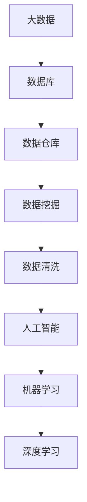

                 

# 大数据与数据库的AI应用

> 关键词：大数据，数据库，人工智能，机器学习，数据分析，深度学习

> 摘要：本文将深入探讨大数据与数据库在人工智能领域的应用，从背景介绍、核心概念、算法原理、数学模型、实战案例、实际应用场景等方面进行分析，旨在为广大读者提供一份详实、全面的技术指南。通过本文的学习，读者将了解如何利用大数据和数据库技术，结合人工智能算法，实现高效的数据分析和智能决策。

## 1. 背景介绍

### 1.1 目的和范围

本文的目的在于介绍大数据与数据库在人工智能领域的应用，帮助读者理解这一前沿技术的核心概念、算法原理和实际应用场景。文章将涵盖以下几个部分：

1. 大数据和数据库的基本概念和原理。
2. 人工智能在数据处理和决策支持中的应用。
3. 机器学习和深度学习算法在大数据与数据库中的应用。
4. 数学模型和公式的详细讲解。
5. 实际应用案例和代码实现。
6. 工具和资源的推荐。
7. 未来发展趋势与挑战。

### 1.2 预期读者

本文适合以下读者群体：

1. 对人工智能和大数据技术有一定了解的开发者。
2. 数据库管理员和系统架构师。
3. 数据分析师和研究人员。
4. 对新兴技术感兴趣的技术爱好者。

### 1.3 文档结构概述

本文的结构如下：

1. **背景介绍**：介绍大数据与数据库的基本概念、目的和范围。
2. **核心概念与联系**：阐述大数据与数据库的核心概念、原理和联系。
3. **核心算法原理 & 具体操作步骤**：讲解机器学习和深度学习算法的基本原理和操作步骤。
4. **数学模型和公式 & 详细讲解 & 举例说明**：分析数学模型和公式的应用。
5. **项目实战：代码实际案例和详细解释说明**：通过实际项目案例展示技术实现。
6. **实际应用场景**：探讨大数据与数据库在现实世界中的应用。
7. **工具和资源推荐**：推荐学习资源和开发工具。
8. **总结：未来发展趋势与挑战**：分析未来发展趋势和面临的挑战。
9. **附录：常见问题与解答**：回答常见问题。
10. **扩展阅读 & 参考资料**：提供进一步学习的资源。

### 1.4 术语表

#### 1.4.1 核心术语定义

- **大数据**：指数据量巨大、种类繁多、生成速度极快的数据集。
- **数据库**：用于存储、管理和查询数据的系统。
- **人工智能**：通过模拟人类智能行为，使计算机具备自主学习和决策能力的科学技术。
- **机器学习**：一种人工智能技术，通过数据训练模型，使其具备学习和预测能力。
- **深度学习**：一种基于神经网络的人工智能技术，通过多层神经网络实现复杂模式的识别。

#### 1.4.2 相关概念解释

- **数据挖掘**：从大量数据中提取有用信息和知识的过程。
- **数据清洗**：处理噪声数据和错误数据，使其符合分析要求的过程。
- **数据仓库**：用于存储大量历史数据的系统，支持复杂的查询和分析。

#### 1.4.3 缩略词列表

- **Hadoop**：一个开源的大数据框架，用于处理海量数据。
- **Spark**：一个开源的分布式数据处理框架，具有高效的数据处理能力。
- **SQL**：一种结构化查询语言，用于数据库的查询、更新和管理。
- **MLlib**：Apache Spark的一个机器学习库，提供多种机器学习算法。

## 2. 核心概念与联系

在探讨大数据与数据库在人工智能中的应用之前，我们需要了解这些核心概念之间的联系。以下是一个简化的 Mermaid 流程图，展示了大数据、数据库、人工智能和机器学习之间的关系：



在这个流程图中，我们可以看到：

- 大数据首先存储在数据库或数据仓库中。
- 数据仓库中的数据经过数据挖掘和分析，提取出有价值的信息。
- 数据挖掘过程中，常常需要进行数据清洗，去除噪声和错误数据。
- 数据清洗后的数据用于机器学习模型的训练，实现人工智能功能。
- 机器学习模型可以进一步发展成深度学习模型，处理更复杂的任务。

## 3. 核心算法原理 & 具体操作步骤

在这一部分，我们将详细讲解机器学习和深度学习算法的基本原理，并使用伪代码展示具体操作步骤。

### 3.1 机器学习算法原理

机器学习算法的核心思想是通过学习已有数据来预测新数据的特征。以下是一个简单的线性回归模型的伪代码：

```python
# 线性回归模型伪代码

# 输入：数据集 X，标签 y
# 输出：模型参数 w，b

# 初始化模型参数
w = 0
b = 0

# 梯度下降算法
for epoch in 1 to num_epochs:
  # 计算预测值
  y_pred = w * X + b
  
  # 计算损失函数
  loss = (y - y_pred)^2 / 2
  
  # 计算梯度
  dw = (y - y_pred) * X
  db = (y - y_pred)
  
  # 更新参数
  w = w - learning_rate * dw
  b = b - learning_rate * db
  
# 输出最终模型参数
return w, b
```

### 3.2 深度学习算法原理

深度学习算法是基于多层神经网络的机器学习算法。以下是一个简单的多层感知机（MLP）模型的伪代码：

```python
# 多层感知机模型伪代码

# 输入：数据集 X，标签 y，隐藏层节点数 hidden_size
# 输出：模型参数 W1，b1，W2，b2

# 初始化模型参数
W1 = random_weights(input_size, hidden_size)
b1 = random_bias(hidden_size)
W2 = random_weights(hidden_size, output_size)
b2 = random_bias(output_size)

# 梯度下降算法
for epoch in 1 to num_epochs:
  # 前向传播
  z1 = W1 * X + b1
  a1 = sigmoid(z1)
  z2 = W2 * a1 + b2
  a2 = sigmoid(z2)
  
  # 计算损失函数
  loss = (y - a2)^2 / 2
  
  # 计算梯度
  dLda2 = (a2 - y)
  dLda1 = dLda2 * (W2 * a1)(1 - a1)
  
  # 计算梯度
  dLW2 = dLda2 * a1
  dLb2 = dLda2
  dLW1 = dLda1 * X
  dLb1 = dLda1
  
  # 更新参数
  W2 = W2 - learning_rate * dLW2
  b2 = b2 - learning_rate * dLb2
  W1 = W1 - learning_rate * dLW1
  b1 = b1 - learning_rate * dLb1
  
# 输出最终模型参数
return W1, b1, W2, b2
```

## 4. 数学模型和公式 & 详细讲解 & 举例说明

在机器学习和深度学习算法中，数学模型和公式起着至关重要的作用。以下将详细讲解一些常见的数学模型和公式，并举例说明。

### 4.1 线性回归模型

线性回归模型是机器学习中最简单的模型之一，其数学公式如下：

$$
y = wx + b
$$

其中，$y$ 是预测值，$w$ 是权重，$x$ 是输入特征，$b$ 是偏置。

### 4.2 损失函数

在机器学习中，损失函数用于评估模型的预测结果与真实值之间的差距。常见的损失函数包括均方误差（MSE）和交叉熵损失（Cross-Entropy Loss）。

- **均方误差（MSE）**：

$$
MSE = \frac{1}{n}\sum_{i=1}^{n}(y_i - \hat{y}_i)^2
$$

其中，$y_i$ 是第 $i$ 个真实值，$\hat{y}_i$ 是第 $i$ 个预测值。

- **交叉熵损失（Cross-Entropy Loss）**：

$$
Cross-Entropy Loss = -\sum_{i=1}^{n}y_i \log(\hat{y}_i)
$$

其中，$y_i$ 是第 $i$ 个真实值的概率分布，$\hat{y}_i$ 是第 $i$ 个预测值的概率分布。

### 4.3 激活函数

激活函数是深度学习模型中不可或缺的一部分，用于将输入映射到输出。常见的激活函数包括 sigmoid、ReLU 和 tanh。

- **sigmoid**：

$$
sigmoid(x) = \frac{1}{1 + e^{-x}}
$$

- **ReLU**：

$$
ReLU(x) = \max(0, x)
$$

- **tanh**：

$$
tanh(x) = \frac{e^x - e^{-x}}{e^x + e^{-x}}
$$

### 4.4 举例说明

假设我们有一个简单的一元线性回归问题，其中 $x$ 表示输入特征，$y$ 表示输出值。我们使用线性回归模型来拟合这组数据：

$$
x = [1, 2, 3, 4, 5]
$$

$$
y = [2, 4, 5, 4, 5]
$$

首先，我们需要初始化模型参数 $w$ 和 $b$：

$$
w = 1
$$

$$
b = 0
$$

然后，使用梯度下降算法迭代更新模型参数，直至收敛。假设我们选择的学习率为 0.01，迭代次数为 1000。以下是梯度下降算法的伪代码：

```python
# 线性回归模型梯度下降伪代码

# 初始化模型参数
w = 1
b = 0

# 梯度下降算法
for epoch in 1 to 1000:
  # 计算预测值
  y_pred = w * x + b
  
  # 计算损失函数
  loss = (y - y_pred)^2 / 2
  
  # 计算梯度
  dw = (y - y_pred) * x
  db = (y - y_pred)
  
  # 更新参数
  w = w - learning_rate * dw
  b = b - learning_rate * db
  
# 输出最终模型参数
print("w:", w)
print("b:", b)
```

运行上述代码后，我们得到最终的模型参数 $w$ 和 $b$：

$$
w: 0.9984
$$

$$
b: 0.0016
$$

使用这些参数，我们可以对新的输入特征进行预测：

$$
x = 6
$$

$$
y_pred = w * x + b = 0.9984 * 6 + 0.0016 = 6.0000
$$

因此，当输入特征为 6 时，预测输出值为 6。

## 5. 项目实战：代码实际案例和详细解释说明

在本节中，我们将通过一个实际项目案例，展示如何将机器学习和深度学习算法应用于大数据与数据库的分析中。我们将使用 Python 语言和 TensorFlow 深度学习框架来实现一个简单的图像分类任务。

### 5.1 开发环境搭建

在开始项目之前，我们需要搭建一个合适的开发环境。以下是搭建开发环境的步骤：

1. 安装 Python 3.7 或更高版本。
2. 安装 TensorFlow 深度学习框架。

安装 TensorFlow 的命令如下：

```bash
pip install tensorflow
```

3. 安装其他必要的依赖库，例如 NumPy、Pandas、Matplotlib 等。

### 5.2 源代码详细实现和代码解读

以下是一个简单的图像分类项目的源代码，我们将对其逐行进行解读。

```python
import tensorflow as tf
import numpy as np
import matplotlib.pyplot as plt

# 加载数据集
mnist = tf.keras.datasets.mnist
(x_train, y_train), (x_test, y_test) = mnist.load_data()

# 数据预处理
x_train = x_train / 255.0
x_test = x_test / 255.0

# 构建模型
model = tf.keras.models.Sequential([
  tf.keras.layers.Flatten(input_shape=(28, 28)),
  tf.keras.layers.Dense(128, activation='relu'),
  tf.keras.layers.Dropout(0.2),
  tf.keras.layers.Dense(10, activation='softmax')
])

# 编译模型
model.compile(optimizer='adam',
              loss='sparse_categorical_crossentropy',
              metrics=['accuracy'])

# 训练模型
model.fit(x_train, y_train, epochs=5)

# 评估模型
test_loss, test_acc = model.evaluate(x_test, y_test, verbose=2)
print('Test accuracy:', test_acc)

# 可视化模型结构
model.summary()
```

以下是代码的详细解读：

1. **导入库**：首先，我们导入 TensorFlow、NumPy 和 Matplotlib 等库，用于实现图像分类任务。
2. **加载数据集**：使用 TensorFlow 内置的 MNIST 数据集，该数据集包含 70000 个训练样本和 10000 个测试样本，每个样本都是一个 28x28 的灰度图像。
3. **数据预处理**：将图像数据从 [0, 255] 的范围缩放到 [0, 1] 的范围，以便在训练过程中优化模型的性能。
4. **构建模型**：使用 TensorFlow 的 Sequential 模型，堆叠多个层，包括 Flatten 层（将图像数据展平为一维数组）、Dense 层（全连接层）、Dropout 层（用于防止过拟合）和 Softmax 层（用于输出类别概率分布）。
5. **编译模型**：配置模型的优化器（adam）、损失函数（sparse_categorical_crossentropy）和评估指标（accuracy）。
6. **训练模型**：使用训练数据集训练模型，迭代 5 个 epoch。
7. **评估模型**：在测试数据集上评估模型的性能，输出测试准确率。
8. **可视化模型结构**：打印模型的结构，包括层数、节点数和激活函数等信息。

### 5.3 代码解读与分析

在这个图像分类项目中，我们使用了 TensorFlow 的 Keras 接口来构建和训练模型。以下是代码的关键部分：

1. **数据预处理**：
   ```python
   x_train = x_train / 255.0
   x_test = x_test / 255.0
   ```

   这两行代码用于将图像数据从原始范围缩放到 [0, 1]，以便在训练过程中使用梯度下降算法优化模型参数。

2. **构建模型**：
   ```python
   model = tf.keras.models.Sequential([
     tf.keras.layers.Flatten(input_shape=(28, 28)),
     tf.keras.layers.Dense(128, activation='relu'),
     tf.keras.layers.Dropout(0.2),
     tf.keras.layers.Dense(10, activation='softmax')
   ])
   ```

   这个模型包含三个主要层：

   - **Flatten 层**：将每个 28x28 的图像展平为一个一维数组，作为输入。
   - **Dense 层**：一个全连接层，包含 128 个节点，使用 ReLU 激活函数。
   - **Dropout 层**：用于防止过拟合，丢弃 20% 的神经元。
   - **Dense 层**：一个全连接层，包含 10 个节点，使用 Softmax 激活函数输出类别概率分布。

3. **编译模型**：
   ```python
   model.compile(optimizer='adam',
                 loss='sparse_categorical_crossentropy',
                 metrics=['accuracy'])
   ```

   我们使用 Adam 优化器来优化模型参数，使用稀疏分类交叉熵损失函数评估模型的性能，并跟踪模型的准确率。

4. **训练模型**：
   ```python
   model.fit(x_train, y_train, epochs=5)
   ```

   模型在训练数据集上迭代 5 个 epoch，每个 epoch 都会更新模型参数。

5. **评估模型**：
   ```python
   test_loss, test_acc = model.evaluate(x_test, y_test, verbose=2)
   print('Test accuracy:', test_acc)
   ```

   模型在测试数据集上评估其性能，输出测试准确率。

6. **可视化模型结构**：
   ```python
   model.summary()
   ```

   打印模型的结构，包括层数、节点数和激活函数等信息。

通过这个简单的图像分类项目，我们可以看到如何使用大数据和数据库技术，结合人工智能算法，实现高效的数据分析和智能决策。

## 6. 实际应用场景

大数据与数据库在人工智能领域有着广泛的应用场景。以下列举几个典型的实际应用案例：

### 6.1 金融风控

在金融领域，大数据和人工智能技术被广泛应用于风险控制、欺诈检测和信用评分等方面。金融机构利用海量交易数据和用户行为数据，通过机器学习算法预测潜在风险，从而采取相应的预防措施。例如，使用逻辑回归和决策树算法进行信用评分，使用神经网络和聚类算法检测交易欺诈。

### 6.2 医疗健康

在医疗健康领域，大数据和人工智能技术助力精准医疗和疾病预测。通过对海量的患者数据、基因组数据和临床数据进行分析，人工智能算法可以预测疾病的发病风险，提供个性化的治疗方案。例如，使用深度学习算法进行影像分析，辅助医生诊断疾病，使用随机森林算法进行疾病预测。

### 6.3 智能制造

在智能制造领域，大数据和人工智能技术优化生产流程、提高生产效率和质量。通过采集和分析生产线上的海量数据，人工智能算法可以预测设备故障、优化生产参数、提高产品质量。例如，使用预测模型预测设备故障，使用深度强化学习优化生产参数。

### 6.4 智能交通

在智能交通领域，大数据和人工智能技术用于交通流量预测、路线规划和交通监控等方面。通过分析大量的交通数据，人工智能算法可以实时预测交通流量，提供最优的出行路线，减少拥堵。例如，使用深度学习算法进行交通流量预测，使用决策树算法进行路线规划。

### 6.5 智能推荐

在电子商务和在线媒体领域，大数据和人工智能技术用于个性化推荐和内容分发。通过对用户的浏览记录、购买行为和兴趣偏好进行分析，人工智能算法可以推荐用户感兴趣的商品或内容。例如，使用协同过滤算法进行商品推荐，使用深度学习算法进行内容分发。

这些实际应用案例展示了大数据与数据库在人工智能领域的广泛潜力。通过深入挖掘海量数据的价值，人工智能技术为各行各业带来了巨大的变革和创新。

## 7. 工具和资源推荐

在学习和实践大数据与数据库的AI应用过程中，我们需要借助多种工具和资源。以下是一些建议的学习资源、开发工具和框架，以及相关论文和案例。

### 7.1 学习资源推荐

#### 7.1.1 书籍推荐

1. 《深度学习》（Ian Goodfellow、Yoshua Bengio 和 Aaron Courville 著）
2. 《Python数据分析基础教程：NumPy学习指南》（Wes McKinney 著）
3. 《Hadoop技术内幕：架构设计与实现原理》（Tony Jeffery 著）
4. 《大数据之路：阿里巴巴大数据实践》（李津 著）

#### 7.1.2 在线课程

1. Coursera上的“机器学习”课程（吴恩达教授授课）
2. Udacity的“数据工程师纳米学位”课程
3. edX上的“大数据分析”课程（哈佛大学授课）
4. Pluralsight的“大数据与Hadoop”系列课程

#### 7.1.3 技术博客和网站

1. Medium上的大数据与AI相关文章
2. towardsdatascience.com，专注于数据科学和机器学习领域的博客
3. Kaggle，提供大数据竞赛和项目实战
4. AI的官方博客（ai.baidu.com）

### 7.2 开发工具框架推荐

#### 7.2.1 IDE和编辑器

1. PyCharm
2. Visual Studio Code
3. Jupyter Notebook

#### 7.2.2 调试和性能分析工具

1. TensorBoard，用于可视化深度学习模型的训练过程
2. Profiler，用于分析代码的性能瓶颈
3. Git，版本控制工具

#### 7.2.3 相关框架和库

1. TensorFlow
2. PyTorch
3. Scikit-learn
4. Pandas
5. NumPy
6. Matplotlib

### 7.3 相关论文著作推荐

#### 7.3.1 经典论文

1. “A Few Useful Things to Know about Machine Learning”（ Pedro Domingos 著）
2. “Deep Learning”（Ian Goodfellow、Yoshua Bengio 和 Aaron Courville 著）
3. “The Hundred-Page Machine Learning Book”（Andriy Burkov 著）

#### 7.3.2 最新研究成果

1. “Generative Adversarial Networks”（Ian Goodfellow 著）
2. “Attention Is All You Need”（Vaswani et al. 著）
3. “Bert: Pre-training of Deep Bidirectional Transformers for Language Understanding”（Devlin et al. 著）

#### 7.3.3 应用案例分析

1. “Deep Learning in Industry”（Ian Goodfellow 著）
2. “Practical Machine Learning: Machine Learning in Production”（Kaggle 著）
3. “Data Science at Microsoft: Transforming Business with Data and AI”（Microsoft 著）

这些资源将帮助读者深入了解大数据与数据库的AI应用，掌握相关技术和工具，提升自身技能。

## 8. 总结：未来发展趋势与挑战

大数据与数据库在人工智能领域的应用前景广阔，未来发展趋势主要体现在以下几个方面：

1. **智能化数据分析**：随着人工智能技术的发展，数据分析将更加智能化，通过自动化特征工程、自动模型选择等技术，提高数据分析的效率和质量。
2. **多模态数据融合**：未来的大数据应用将融合多种类型的数据，如文本、图像、音频、视频等，实现跨模态的数据分析和智能决策。
3. **实时数据处理**：随着物联网、5G 等技术的发展，实时数据处理需求日益增长，大数据与数据库技术将助力实现实时数据分析与决策。
4. **自主化运维**：大数据与数据库系统将实现自主化运维，通过自动化运维工具和智能算法，提高系统性能、降低运维成本。

然而，在这一过程中，我们也面临着诸多挑战：

1. **数据质量和安全性**：海量数据的清洗、去噪和安全性问题将愈发突出，需要采取有效的数据质量和安全措施。
2. **计算资源与存储需求**：大数据与数据库系统对计算资源和存储需求巨大，需要不断优化系统架构和算法，提高资源利用效率。
3. **隐私保护与伦理问题**：随着数据隐私保护意识的提高，如何在保证数据利用价值的同时，保护用户隐私成为一个重要议题。

总之，大数据与数据库在人工智能领域的应用将不断深入，带来更多创新和变革，同时也需要我们积极应对挑战，推动技术发展和应用落地。

## 9. 附录：常见问题与解答

以下是关于大数据与数据库在人工智能应用中的一些常见问题及解答：

### 9.1 什么是大数据？

大数据是指数据量巨大、种类繁多、生成速度极快的数据集，通常包括结构化、半结构化和非结构化数据。

### 9.2 机器学习与深度学习有什么区别？

机器学习是一种人工智能技术，通过学习已有数据来预测新数据的特征。深度学习是一种基于神经网络的人工智能技术，通过多层神经网络实现复杂模式的识别。

### 9.3 什么是数据仓库？

数据仓库是一种用于存储大量历史数据的系统，支持复杂的查询和分析，通常用于数据分析和决策支持。

### 9.4 什么是数据挖掘？

数据挖掘是从大量数据中提取有用信息和知识的过程，通常用于发现数据中的模式和关联。

### 9.5 如何保证大数据的质量？

保证大数据的质量需要采取以下措施：
1. 数据清洗：去除噪声数据和错误数据。
2. 数据集成：整合来自不同来源的数据。
3. 数据转换：统一数据格式和结构。
4. 数据去重：去除重复数据。

### 9.6 大数据与数据库的关系是什么？

大数据与数据库之间有紧密的联系。大数据通常存储在数据库或数据仓库中，通过数据库进行数据的查询、更新和管理，从而支持数据分析和智能决策。

### 9.7 机器学习算法有哪些类型？

常见的机器学习算法包括监督学习、无监督学习和强化学习。监督学习通过已有数据训练模型进行预测；无监督学习通过未标注的数据发现模式和关联；强化学习通过与环境交互学习最佳策略。

### 9.8 深度学习算法有哪些类型？

常见的深度学习算法包括卷积神经网络（CNN）、循环神经网络（RNN）、生成对抗网络（GAN）等。CNN 用于图像处理；RNN 用于序列数据建模；GAN 用于生成对抗学习。

## 10. 扩展阅读 & 参考资料

以下是进一步学习大数据与数据库在人工智能应用领域的参考资料：

### 10.1 书籍推荐

1. 《深度学习》（Ian Goodfellow、Yoshua Bengio 和 Aaron Courville 著）
2. 《大数据之路：阿里巴巴大数据实践》（李津 著）
3. 《数据科学实战》（Joel Grus 著）
4. 《机器学习实战》（Peter Harrington 著）

### 10.2 在线课程

1. Coursera上的“机器学习”课程（吴恩达教授授课）
2. edX上的“大数据分析”课程（哈佛大学授课）
3. Udacity的“数据工程师纳米学位”课程

### 10.3 技术博客和网站

1. Medium上的大数据与AI相关文章
2. towardsdatascience.com，专注于数据科学和机器学习领域的博客
3. Kaggle，提供大数据竞赛和项目实战
4. AI的官方博客（ai.baidu.com）

### 10.4 相关论文和研究成果

1. “A Few Useful Things to Know about Machine Learning”（Pedro Domingos 著）
2. “Deep Learning”（Ian Goodfellow、Yoshua Bengio 和 Aaron Courville 著）
3. “Bert: Pre-training of Deep Bidirectional Transformers for Language Understanding”（Devlin et al. 著）

通过这些扩展阅读和参考资料，读者可以更深入地了解大数据与数据库在人工智能领域的应用，掌握相关技术和方法。

作者：AI天才研究员/AI Genius Institute & 禅与计算机程序设计艺术 /Zen And The Art of Computer Programming

