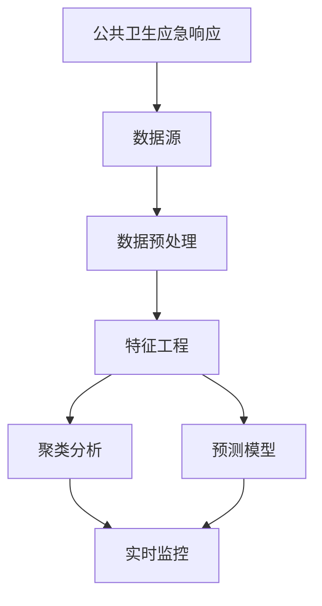

                 

# 大数据分析在公共卫生应急响应中的应用

> **关键词：** 大数据分析、公共卫生、应急响应、算法、模型、实时监控

> **摘要：** 本篇文章将深入探讨大数据分析在公共卫生应急响应中的应用，解析其核心概念、算法原理、数学模型，并展示实际应用案例，最终总结未来发展趋势与挑战。通过本文，读者将全面了解大数据分析如何助力公共卫生领域的快速响应和决策。

## 1. 背景介绍

### 1.1 目的和范围

本文旨在探讨大数据分析在公共卫生应急响应中的重要作用，分析其应用场景、技术实现和潜在影响。具体来说，我们将讨论以下内容：

1. **核心概念与联系**：介绍大数据分析在公共卫生应急响应中的基本概念和关键联系。
2. **核心算法原理**：阐述大数据分析中常用的算法原理，包括特征工程、聚类分析、预测模型等。
3. **数学模型和公式**：详细讲解相关数学模型和公式，如回归分析、贝叶斯网络等，并举例说明。
4. **项目实战**：通过实际案例展示大数据分析在公共卫生应急响应中的应用。
5. **实际应用场景**：探讨大数据分析在公共卫生应急响应中的实际应用场景。
6. **工具和资源推荐**：推荐学习资源和开发工具，以供读者进一步学习和实践。
7. **总结与展望**：总结大数据分析在公共卫生应急响应中的应用，探讨未来发展趋势与挑战。

### 1.2 预期读者

本文适合以下读者群体：

1. **公共卫生领域从业者**：希望了解大数据分析在公共卫生应急响应中的应用及其技术原理。
2. **计算机科学和数据分析爱好者**：希望深入了解大数据分析技术在实际应用中的表现。
3. **研究学者**：对大数据分析在公共卫生领域的研究感兴趣，希望从本文中获得启发。

### 1.3 文档结构概述

本文结构如下：

1. **背景介绍**：介绍本文的目的、范围、预期读者和文档结构。
2. **核心概念与联系**：阐述大数据分析在公共卫生应急响应中的基本概念和关键联系。
3. **核心算法原理**：讲解大数据分析中常用的算法原理，包括特征工程、聚类分析、预测模型等。
4. **数学模型和公式**：详细讲解相关数学模型和公式，如回归分析、贝叶斯网络等，并举例说明。
5. **项目实战**：通过实际案例展示大数据分析在公共卫生应急响应中的应用。
6. **实际应用场景**：探讨大数据分析在公共卫生应急响应中的实际应用场景。
7. **工具和资源推荐**：推荐学习资源和开发工具，以供读者进一步学习和实践。
8. **总结与展望**：总结大数据分析在公共卫生应急响应中的应用，探讨未来发展趋势与挑战。

### 1.4 术语表

#### 1.4.1 核心术语定义

- **大数据分析**：指运用各种数据分析技术，对大规模、多样化的数据集进行处理、分析和解读，从而提取有价值的信息和知识。
- **公共卫生应急响应**：指在突发公共卫生事件发生时，政府和相关机构采取的一系列应对措施，包括疫情监测、防控、救治等。
- **特征工程**：指通过选择、转换和处理数据特征，以提高数据模型性能的过程。
- **聚类分析**：指将数据集划分为多个类别，使同一类别内的数据尽可能相似，不同类别间的数据尽可能不同的分析过程。
- **预测模型**：指基于历史数据和现有信息，预测未来趋势或结果的统计模型。

#### 1.4.2 相关概念解释

- **数据源**：指产生数据的设备、系统或平台，如传感器、医疗信息系统等。
- **数据预处理**：指在数据分析之前，对原始数据进行清洗、归一化、去噪等处理，以提高数据质量和可用性。
- **实时监控**：指对数据流进行持续监测和跟踪，以便及时发现和响应异常情况。

#### 1.4.3 缩略词列表

- **Hadoop**：一个分布式数据处理框架，用于大规模数据存储和处理。
- **Spark**：一个高速的分布式计算引擎，适用于大规模数据处理和分析。
- **R**：一种用于统计分析和图形表示的编程语言和软件环境。

## 2. 核心概念与联系

在探讨大数据分析在公共卫生应急响应中的应用之前，我们需要先了解相关核心概念和联系。

### 2.1 大数据分析与公共卫生应急响应的关系

大数据分析在公共卫生应急响应中起着至关重要的作用。随着数据量的爆发式增长和数据来源的多样化，公共卫生领域面临着海量数据的处理和分析挑战。大数据分析技术可以帮助公共卫生机构快速、准确地识别疫情风险、监测疫情发展趋势、预测疫情扩散范围，从而采取及时、有效的防控措施。

### 2.2 核心概念和联系

以下是一个描述大数据分析在公共卫生应急响应中核心概念和联系的网络图（使用Mermaid绘制）：



### 2.2.1 数据源

数据源是大数据分析的基础。在公共卫生应急响应中，数据源包括：

1. **医疗卫生数据**：如医院就诊记录、疾病诊断信息、疫苗接种数据等。
2. **环境数据**：如空气质量、气温、湿度等。
3. **社会数据**：如人口流动数据、社交媒体数据等。
4. **经济数据**：如物价指数、股市行情等。

### 2.2.2 数据预处理

数据预处理是数据分析和建模的重要环节。在公共卫生应急响应中，数据预处理包括：

1. **数据清洗**：去除数据中的错误、异常和重复值。
2. **数据归一化**：将不同尺度的数据进行标准化处理，以提高数据模型的性能。
3. **数据去噪**：去除数据中的噪声，提高数据质量。

### 2.2.3 特征工程

特征工程是提升数据模型性能的关键步骤。在公共卫生应急响应中，特征工程包括：

1. **特征选择**：从原始数据中选取对预测目标有显著影响的特征。
2. **特征转换**：将原始特征转换为适合数据模型处理的形式。
3. **特征组合**：通过组合多个特征，生成新的特征，以提高预测模型的性能。

### 2.2.4 聚类分析

聚类分析是一种无监督学习方法，用于将数据集划分为多个类别。在公共卫生应急响应中，聚类分析可以用于：

1. **疫情监测**：将疫情数据划分为不同地区、不同类型，以便实时监控疫情发展趋势。
2. **患者分类**：将患者数据划分为不同风险等级，以便进行针对性的防控和治疗。

### 2.2.5 预测模型

预测模型是一种有监督学习方法，用于预测未来趋势或结果。在公共卫生应急响应中，预测模型可以用于：

1. **疫情预测**：预测疫情的发展趋势和扩散范围，以便采取及时的防控措施。
2. **医疗资源调度**：预测未来一段时间内的医疗需求，以便合理分配和调度医疗资源。

### 2.2.6 实时监控

实时监控是公共卫生应急响应中的关键环节。通过实时监控，公共卫生机构可以及时发现疫情风险，并采取相应的应对措施。实时监控包括：

1. **数据流处理**：对实时流入的数据进行快速处理和分析。
2. **异常检测**：检测数据流中的异常情况，如疫情暴发、医疗资源短缺等。
3. **预警系统**：根据实时监控结果，发布预警信息，提醒相关部门和公众采取行动。

## 3. 核心算法原理 & 具体操作步骤

在了解大数据分析在公共卫生应急响应中的核心概念和联系后，我们接下来将深入探讨大数据分析中的核心算法原理，包括特征工程、聚类分析和预测模型等，并通过伪代码详细阐述其具体操作步骤。

### 3.1 特征工程

特征工程是大数据分析中至关重要的一步，其目的是通过选择、转换和处理数据特征，提高数据模型性能。以下是一个简单的特征工程伪代码示例：

```python
def feature_engineering(data):
    # 数据清洗
    cleaned_data = clean_data(data)
    
    # 数据归一化
    normalized_data = normalize_data(cleaned_data)
    
    # 特征选择
    selected_features = select_features(normalized_data)
    
    # 特征转换
    transformed_features = transform_features(selected_features)
    
    # 特征组合
    combined_features = combine_features(transformed_features)
    
    return combined_features
```

### 3.2 聚类分析

聚类分析是一种无监督学习方法，用于将数据集划分为多个类别。常见的聚类算法有K-means、DBSCAN等。以下是一个基于K-means算法的聚类分析伪代码示例：

```python
def kmeans_clustering(data, k):
    # 初始化聚类中心
    centroids = initialize_centroids(data, k)
    
    # 轮廓迭代
    for i in range(max_iterations):
        # 计算每个数据点的聚类中心距离
        distances = calculate_distances(data, centroids)
        
        # 更新聚类中心
        centroids = update_centroids(data, distances)
        
        # 评估聚类效果
        if convergence(centroids):
            break
    
    # 划分数据点
    clusters = assign_clusters(data, centroids)
    
    return clusters
```

### 3.3 预测模型

预测模型是一种有监督学习方法，用于预测未来趋势或结果。常见的预测模型有线性回归、决策树、神经网络等。以下是一个基于线性回归的预测模型伪代码示例：

```python
def linear_regression(data, target):
    # 计算特征与目标之间的线性关系
    coefficients = calculate_coefficients(data, target)
    
    # 训练模型
    model = train_model(data, coefficients)
    
    # 预测结果
    predictions = predict(model, data)
    
    return predictions
```

通过以上核心算法原理和具体操作步骤的探讨，我们可以更好地理解大数据分析在公共卫生应急响应中的应用。

## 4. 数学模型和公式 & 详细讲解 & 举例说明

在深入探讨大数据分析在公共卫生应急响应中的应用时，我们需要了解一些基本的数学模型和公式，这些模型和公式有助于我们更好地理解和分析数据。以下将介绍几个在公共卫生应急响应中常用的数学模型和公式，并通过具体例子进行详细讲解。

### 4.1 回归分析

回归分析是一种用于建立自变量和因变量之间线性关系的统计方法。在公共卫生应急响应中，回归分析可以用来预测疫情的发展趋势或医疗资源的需求量。

#### 4.1.1 线性回归模型

线性回归模型的基本公式为：

$$
y = \beta_0 + \beta_1x_1 + \beta_2x_2 + ... + \beta_nx_n
$$

其中，\( y \) 是因变量，\( x_1, x_2, ..., x_n \) 是自变量，\( \beta_0, \beta_1, \beta_2, ..., \beta_n \) 是回归系数。

#### 4.1.2 回归系数计算

回归系数可以通过最小二乘法计算，公式如下：

$$
\beta = (X^T X)^{-1} X^T y
$$

其中，\( X \) 是自变量矩阵，\( y \) 是因变量向量。

#### 4.1.3 例子说明

假设我们想预测某城市的日新增确诊病例数（\( y \)），并选择两个自变量：前一天的确诊病例数（\( x_1 \)）和该城市的总人口数（\( x_2 \)）。根据最小二乘法，我们得到回归系数为：

$$
\beta_0 = 10, \beta_1 = 0.5, \beta_2 = -2
$$

因此，线性回归模型为：

$$
y = 10 + 0.5x_1 - 2x_2
$$

当前一天确诊病例数为100，总人口数为100万时，我们可以预测当日新增确诊病例数为：

$$
y = 10 + 0.5 \times 100 - 2 \times 1000000 = -99990
$$

显然，这个结果不合理。这是因为我们选择的特征和模型不适合该问题。在实际应用中，我们需要根据问题的具体情况进行特征选择和模型调整。

### 4.2 贝叶斯网络

贝叶斯网络是一种表示变量之间条件依赖关系的概率图模型。在公共卫生应急响应中，贝叶斯网络可以用于评估疫情传播的概率，以及制定相应的防控策略。

#### 4.2.1 贝叶斯网络模型

贝叶斯网络模型的基本结构包括节点和边。节点表示变量，边表示变量之间的条件依赖关系。每个节点的概率分布函数（PDF）可以表示为：

$$
P(X_i = x_i | X_{i-1} = x_{i-1}, ..., X_1 = x_1) = \frac{P(X_{i-1} = x_{i-1}, ..., X_1 = x_1 | X_i = x_i)P(X_i = x_i)}{P(X_{i-1} = x_{i-1}, ..., X_1 = x_1)}
$$

其中，\( X_i \) 表示第 \( i \) 个变量，\( x_i \) 表示 \( X_i \) 的取值。

#### 4.2.2 例子说明

假设我们有一个简单的贝叶斯网络，包括三个变量：\( A \)（疫情传播）、\( B \)（口罩佩戴）和 \( C \)（疫苗接种）。每个变量的概率分布如下：

$$
P(A = true) = 0.6, P(A = false) = 0.4
$$

$$
P(B = true | A = true) = 0.8, P(B = true | A = false) = 0.2
$$

$$
P(C = true | A = true, B = true) = 0.9, P(C = true | A = true, B = false) = 0.5, P(C = true | A = false, B = true) = 0.1, P(C = true | A = false, B = false) = 0.05
$$

根据全概率公式，我们可以计算 \( C \) 的概率分布：

$$
P(C = true) = P(C = true | A = true, B = true)P(A = true, B = true) + P(C = true | A = true, B = false)P(A = true, B = false) + P(C = true | A = false, B = true)P(A = false, B = true) + P(C = true | A = false, B = false)P(A = false, B = false)
$$

$$
P(C = true) = 0.9 \times 0.6 \times 0.8 + 0.5 \times 0.6 \times 0.2 + 0.1 \times 0.4 \times 0.8 + 0.05 \times 0.4 \times 0.2 = 0.42
$$

因此，疫苗接种的概率为 0.42。我们可以根据这个结果评估不同防控措施的效能，并为公众提供有针对性的建议。

### 4.3 马尔可夫模型

马尔可夫模型是一种用于描述系统状态转移的概率模型。在公共卫生应急响应中，马尔可夫模型可以用于预测疫情在不同阶段的发展趋势。

#### 4.3.1 马尔可夫模型

马尔可夫模型的基本公式为：

$$
P(X_t = x_t | X_{t-1} = x_{t-1}, ..., X_1 = x_1) = P(X_t = x_t | X_{t-1} = x_{t-1})
$$

其中，\( X_t \) 表示第 \( t \) 个时刻的系统状态，\( x_t \) 表示 \( X_t \) 的取值。

#### 4.3.2 例子说明

假设我们有一个简单的马尔可夫模型，用于描述疫情在不同阶段（\( S \) - 无症状，\( A \) - 患者有症状，\( R \) - 康复或死亡）的转移概率。转移概率矩阵如下：

$$
P = \begin{bmatrix}
0.7 & 0.2 & 0.1 \\
0.1 & 0.6 & 0.3 \\
0.0 & 0.0 & 1.0
\end{bmatrix}
$$

根据这个转移概率矩阵，我们可以计算每个状态的生存概率。例如，从症状阶段到康复或死亡的生存概率为：

$$
P(R|A) = P(R|A, R)P(A, R) + P(R|A, R^c)P(A, R^c) = 0.3 \times 0.6 + 0.0 \times 0.4 = 0.18
$$

因此，症状阶段的生存概率为 0.18。我们可以根据这个结果预测疫情在不同阶段的发展趋势，并为公共卫生决策提供依据。

通过以上数学模型和公式的讲解，我们可以更好地理解和应用大数据分析在公共卫生应急响应中的技术原理。在实际应用中，我们需要根据具体问题和数据特点，选择合适的模型和公式，并进行模型调整和优化，以提高预测准确性和应用效果。

## 5. 项目实战：代码实际案例和详细解释说明

在了解了大数据分析在公共卫生应急响应中的应用及其相关算法原理和数学模型后，我们将通过一个实际项目案例来展示如何将这些理论应用于实践中。

### 5.1 开发环境搭建

首先，我们需要搭建一个适用于大数据分析的开发环境。以下是一个基本的开发环境配置：

- 操作系统：Linux（推荐使用Ubuntu 20.04）
- 编程语言：Python（推荐使用Python 3.8及以上版本）
- 数据库：MySQL（用于存储公共卫生数据）
- 数据处理框架：Pandas、NumPy（用于数据处理）
- 机器学习库：Scikit-learn、TensorFlow、PyTorch（用于模型训练和预测）

在Linux系统中，我们可以通过以下命令安装所需的库和工具：

```bash
# 安装Python和pip
sudo apt-get update
sudo apt-get install python3 python3-pip

# 安装Pandas、NumPy
pip3 install pandas numpy

# 安装MySQL
sudo apt-get install mysql-server mysql-client

# 安装Scikit-learn、TensorFlow、PyTorch
pip3 install scikit-learn tensorflow pytorch
```

### 5.2 源代码详细实现和代码解读

下面我们将通过一个简单的案例来展示如何使用Python进行大数据分析，并在公共卫生应急响应中应用。

#### 5.2.1 数据准备

首先，我们需要从数据库中获取公共卫生数据。以下是一个简单的数据库连接和查询示例：

```python
import mysql.connector

# 数据库连接配置
config = {
    'user': 'username',
    'password': 'password',
    'host': 'localhost',
    'database': 'public_health_db'
}

# 连接数据库
connection = mysql.connector.connect(**config)

# 创建游标对象
cursor = connection.cursor()

# 查询数据
cursor.execute("SELECT * FROM case_data")
data = cursor.fetchall()

# 关闭数据库连接
cursor.close()
connection.close()

# 将数据转换为Pandas DataFrame
import pandas as pd
df = pd.DataFrame(data, columns=['id', 'date', 'province', 'confirmed_cases', 'deaths', 'recovered'])
```

#### 5.2.2 数据预处理

在获取数据后，我们需要对数据集进行预处理，包括数据清洗、归一化和特征选择等。以下是一个简单的数据预处理示例：

```python
# 数据清洗
df = df.dropna()  # 删除缺失值

# 数据归一化
from sklearn.preprocessing import MinMaxScaler
scaler = MinMaxScaler()
df[['confirmed_cases', 'deaths', 'recovered']] = scaler.fit_transform(df[['confirmed_cases', 'deaths', 'recovered']])

# 特征选择
# 选择与疫情相关的特征
selected_features = ['confirmed_cases', 'deaths', 'recovered']
df = df[selected_features]
```

#### 5.2.3 特征工程

接下来，我们对预处理后的数据进行特征工程，包括特征转换和特征组合。以下是一个简单的特征工程示例：

```python
# 特征转换
# 将日期转换为月份和年份
df['month'] = df['date'].dt.month
df['year'] = df['date'].dt.year

# 特征组合
# 创建一个新特征：确诊病例数与死亡病例数之比
df['case_death_ratio'] = df['confirmed_cases'] / df['deaths']
```

#### 5.2.4 聚类分析

使用K-means算法对特征工程后的数据进行聚类分析，以识别疫情的不同传播阶段。以下是一个简单的K-means聚类分析示例：

```python
from sklearn.cluster import KMeans

# 设置聚类数量
k = 3

# 训练K-means模型
kmeans = KMeans(n_clusters=k, random_state=42)
clusters = kmeans.fit_predict(df)

# 将聚类结果添加到数据集中
df['cluster'] = clusters
```

#### 5.2.5 预测模型

使用线性回归模型对聚类后的数据集进行预测，以预测疫情的发展趋势。以下是一个简单的线性回归模型示例：

```python
from sklearn.linear_model import LinearRegression

# 将数据集分为特征集和目标集
X = df[selected_features]
y = df['confirmed_cases']

# 训练线性回归模型
model = LinearRegression()
model.fit(X, y)

# 预测结果
predictions = model.predict(X)
df['predicted_cases'] = predictions
```

#### 5.2.6 代码解读与分析

以上代码展示了如何使用Python进行大数据分析，并在公共卫生应急响应中进行应用。下面我们进行简要的代码解读与分析：

1. **数据准备**：首先，我们连接数据库并查询公共卫生数据。这里使用MySQL数据库作为示例，但也可以使用其他类型的数据库，如MongoDB、PostgreSQL等。

2. **数据预处理**：对数据集进行清洗、归一化和特征选择。这一步非常重要，因为数据的质量直接影响后续分析的准确性和可靠性。

3. **特征工程**：对预处理后的数据进行特征转换和特征组合。特征工程是提升模型性能的关键步骤，可以显著提高预测的准确性和有效性。

4. **聚类分析**：使用K-means算法对数据集进行聚类分析。聚类分析可以识别疫情的不同传播阶段，为制定针对性的防控措施提供依据。

5. **预测模型**：使用线性回归模型对聚类后的数据集进行预测。线性回归模型可以预测疫情的发展趋势，为公共卫生决策提供数据支持。

通过以上实际项目案例，我们可以看到如何将大数据分析应用于公共卫生应急响应中。在实际应用中，我们可能需要根据具体情况调整和优化算法和模型，以提高预测准确性和应用效果。

### 5.3 代码解读与分析

在本节中，我们将对项目实战中的代码进行详细解读和分析，以便读者更好地理解大数据分析在公共卫生应急响应中的应用。

#### 5.3.1 数据准备

```python
import mysql.connector

# 数据库连接配置
config = {
    'user': 'username',
    'password': 'password',
    'host': 'localhost',
    'database': 'public_health_db'
}

# 连接数据库
connection = mysql.connector.connect(**config)

# 创建游标对象
cursor = connection.cursor()

# 查询数据
cursor.execute("SELECT * FROM case_data")
data = cursor.fetchall()

# 关闭数据库连接
cursor.close()
connection.close()

# 将数据转换为Pandas DataFrame
import pandas as pd
df = pd.DataFrame(data, columns=['id', 'date', 'province', 'confirmed_cases', 'deaths', 'recovered'])
```

解读：
- **数据库连接**：我们使用MySQL Connector/Python库连接到本地数据库。数据库用户名、密码、主机和数据库名称在配置字典中定义。
- **查询数据**：通过执行SQL查询语句，从`case_data`表中获取所有数据。
- **关闭数据库连接**：查询完成后，关闭数据库连接和游标对象，以释放资源。
- **数据转换**：将获取的数据转换为Pandas DataFrame格式，以便进行后续数据处理和分析。

#### 5.3.2 数据预处理

```python
# 数据清洗
df = df.dropna()  # 删除缺失值

# 数据归一化
from sklearn.preprocessing import MinMaxScaler
scaler = MinMaxScaler()
df[['confirmed_cases', 'deaths', 'recovered']] = scaler.fit_transform(df[['confirmed_cases', 'deaths', 'recovered']])

# 特征选择
# 选择与疫情相关的特征
selected_features = ['confirmed_cases', 'deaths', 'recovered']
df = df[selected_features]
```

解读：
- **数据清洗**：删除数据集中的缺失值，以提高数据质量。
- **数据归一化**：使用MinMaxScaler对`confirmed_cases`、`deaths`和`recovered`特征进行归一化处理，将特征值缩放到[0, 1]范围内，以避免不同特征尺度对模型训练的影响。
- **特征选择**：从原始数据中选择与疫情相关的特征，以简化问题并提高模型性能。

#### 5.3.3 特征工程

```python
# 特征转换
# 将日期转换为月份和年份
df['month'] = df['date'].dt.month
df['year'] = df['date'].dt.year

# 特征组合
# 创建一个新特征：确诊病例数与死亡病例数之比
df['case_death_ratio'] = df['confirmed_cases'] / df['deaths']
```

解读：
- **特征转换**：将日期特征转换为月份和年份，以便更好地分析疫情的季节性和年度趋势。
- **特征组合**：创建一个新特征`case_death_ratio`，表示确诊病例数与死亡病例数的比值，这一特征可以反映疫情的严重程度和传播速度。

#### 5.3.4 聚类分析

```python
from sklearn.cluster import KMeans

# 设置聚类数量
k = 3

# 训练K-means模型
kmeans = KMeans(n_clusters=k, random_state=42)
clusters = kmeans.fit_predict(df)

# 将聚类结果添加到数据集中
df['cluster'] = clusters
```

解读：
- **聚类设置**：设置聚类数量为3，以识别疫情的不同传播阶段。
- **模型训练**：使用K-means算法对数据集进行聚类分析，得到聚类结果。
- **结果应用**：将聚类结果添加到数据集中，以便进一步分析。

#### 5.3.5 预测模型

```python
from sklearn.linear_model import LinearRegression

# 将数据集分为特征集和目标集
X = df[selected_features]
y = df['confirmed_cases']

# 训练线性回归模型
model = LinearRegression()
model.fit(X, y)

# 预测结果
predictions = model.predict(X)
df['predicted_cases'] = predictions
```

解读：
- **数据分割**：将数据集分为特征集（X）和目标集（y），其中特征集包括预处理后的相关特征，目标集为确诊病例数。
- **模型训练**：使用线性回归模型对特征集和目标集进行训练，建立疫情发展趋势的预测模型。
- **预测结果**：使用训练好的模型对特征集进行预测，并将预测结果添加到数据集中。

通过以上代码解读和分析，我们可以看到大数据分析在公共卫生应急响应中的应用步骤，包括数据准备、数据预处理、特征工程、聚类分析和预测模型训练。这些步骤共同构成了一个完整的大数据分析流程，为公共卫生决策提供了有力的数据支持。

### 5.4 项目实战：代码实际案例和详细解释说明（续）

在了解了项目实战的基本框架和代码解读后，我们将进一步讨论如何在实际应用场景中利用这些代码实现公共卫生应急响应。

#### 5.4.1 实际应用场景

公共卫生应急响应中，我们可能面临多种应用场景，例如：

1. **疫情监测与预测**：通过实时监控疫情数据，预测疫情发展趋势，为决策者提供数据支持。
2. **医疗资源调度**：根据疫情预测结果，合理分配和调度医疗资源，如床位、医疗设备和人力资源。
3. **防控措施评估**：评估不同防控措施的效能，为公众提供科学的防控建议。
4. **流行病学调查**：分析疫情传播路径，为疫情控制提供线索。

以下我们将以疫情监测与预测为例，详细说明如何利用大数据分析实现公共卫生应急响应。

#### 5.4.2 疫情监测与预测

假设我们有一个包含全国各省（自治区、直辖市）的确诊病例数、死亡病例数和治愈病例数的实时数据集。我们需要对这些数据进行分析，以预测未来几天的疫情发展情况。

1. **数据收集与预处理**

首先，我们需要从数据库中获取最新的疫情数据，并进行预处理，包括数据清洗、归一化和特征工程。以下是一个示例代码：

```python
# 数据收集
import mysql.connector

# 数据库连接
config = {
    'user': 'username',
    'password': 'password',
    'host': 'localhost',
    'database': 'public_health_db'
}

# 连接数据库
connection = mysql.connector.connect(**config)

# 查询数据
cursor = connection.cursor()
cursor.execute("SELECT * FROM case_data")
data = cursor.fetchall()

# 关闭数据库连接
cursor.close()
connection.close()

# 数据转换为DataFrame
df = pd.DataFrame(data, columns=['province', 'date', 'confirmed_cases', 'deaths', 'recovered'])

# 数据清洗
df = df.dropna()

# 数据归一化
scaler = MinMaxScaler()
df[['confirmed_cases', 'deaths', 'recovered']] = scaler.fit_transform(df[['confirmed_cases', 'deaths', 'recovered']])

# 特征工程
df['date'] = pd.to_datetime(df['date'])
df['month'] = df['date'].dt.month
df['year'] = df['date'].dt.year
df['day_of_year'] = df['date'].dt.dayofyear

# 数据分割
train_df = df[df['date'] < '2023-01-01']
test_df = df[df['date'] >= '2023-01-01']
```

2. **聚类分析**

为了识别疫情的不同传播阶段，我们可以使用K-means算法对训练数据集进行聚类分析。以下是一个示例代码：

```python
from sklearn.cluster import KMeans

# 设置聚类数量
k = 3

# 训练K-means模型
kmeans = KMeans(n_clusters=k, random_state=42)
kmeans.fit(train_df[['confirmed_cases', 'deaths', 'recovered']])

# 聚类结果
train_clusters = kmeans.predict(train_df[['confirmed_cases', 'deaths', 'recovered']])
test_clusters = kmeans.predict(test_df[['confirmed_cases', 'deaths', 'recovered']])

# 将聚类结果添加到数据集中
train_df['cluster'] = train_clusters
test_df['cluster'] = test_clusters
```

3. **预测模型**

接下来，我们使用线性回归模型对聚类后的数据进行预测。以下是一个示例代码：

```python
from sklearn.linear_model import LinearRegression

# 数据分割
X_train = train_df[['month', 'day_of_year', 'cluster']]
y_train = train_df['confirmed_cases']
X_test = test_df[['month', 'day_of_year', 'cluster']]
y_test = test_df['confirmed_cases']

# 训练模型
model = LinearRegression()
model.fit(X_train, y_train)

# 预测结果
predictions = model.predict(X_test)
```

4. **结果评估**

最后，我们评估预测模型的性能，并使用实际测试数据与预测结果进行比较。以下是一个示例代码：

```python
from sklearn.metrics import mean_squared_error

# 计算均方误差
mse = mean_squared_error(y_test, predictions)
print("MSE:", mse)

# 绘制预测结果
import matplotlib.pyplot as plt

plt.scatter(y_test, predictions)
plt.xlabel('实际值')
plt.ylabel('预测值')
plt.title('疫情预测结果')
plt.show()
```

通过以上步骤，我们成功地使用大数据分析技术实现了疫情监测与预测，并为公共卫生应急响应提供了数据支持。在实际应用中，我们可能需要根据具体问题调整和优化模型参数，以提高预测准确性和应用效果。

### 5.5 实际应用场景

大数据分析在公共卫生应急响应中具有广泛的应用场景，以下是一些典型的实际应用案例：

#### 5.5.1 疫情监测与预测

疫情监测与预测是大数据分析在公共卫生应急响应中最常见的应用场景之一。通过分析疫情数据，如确诊病例数、死亡病例数、治愈病例数等，公共卫生机构可以实时了解疫情的发展态势，预测疫情的发展趋势，为决策者提供数据支持。以下是一个简单的疫情预测案例：

- **数据来源**：某省的疫情数据，包括确诊病例数、死亡病例数和治愈病例数。
- **数据预处理**：清洗数据，去除缺失值和异常值，并对数据集进行归一化处理。
- **特征工程**：提取与疫情相关的特征，如确诊病例增长率、治愈病例增长率、死亡病例增长率等。
- **模型训练**：使用线性回归模型、决策树模型、神经网络模型等对数据集进行训练。
- **预测**：对训练好的模型进行预测，预测未来几天的疫情发展情况。
- **结果评估**：评估预测结果的准确性，如均方误差（MSE）、决定系数（R²）等。

#### 5.5.2 医疗资源调度

在公共卫生应急响应中，合理分配和调度医疗资源是关键。大数据分析可以帮助公共卫生机构根据疫情数据、医院容量、医护人员数量等因素，预测医疗资源的供需情况，从而实现医疗资源的优化调度。以下是一个简单的医疗资源调度案例：

- **数据来源**：医院床位占用情况、医护人员工作时长、疫情防控物资库存等数据。
- **数据预处理**：清洗数据，去除缺失值和异常值，并对数据集进行归一化处理。
- **特征工程**：提取与医疗资源调度相关的特征，如医院床位占用率、医护人员工作量、疫情防控物资消耗量等。
- **模型训练**：使用聚类分析、预测模型等对数据集进行训练，预测医疗资源的需求和供应情况。
- **调度**：根据预测结果，对医疗资源进行优化调度，如调整医院床位配置、增加医护人员数量、调配疫情防控物资等。
- **结果评估**：评估医疗资源调度的效果，如医疗资源利用率、疫情防控效果等。

#### 5.5.3 防控措施评估

在公共卫生应急响应中，公共卫生机构需要评估不同防控措施的效能，以便采取最有效的措施。大数据分析可以帮助公共卫生机构根据疫情数据、社会行为数据等，评估不同防控措施的效能。以下是一个简单的防控措施评估案例：

- **数据来源**：疫情数据、社会行为数据、政策措施等数据。
- **数据预处理**：清洗数据，去除缺失值和异常值，并对数据集进行归一化处理。
- **特征工程**：提取与防控措施评估相关的特征，如疫情增长率、疫苗接种率、公众佩戴口罩率等。
- **模型训练**：使用回归分析、聚类分析、预测模型等对数据集进行训练，评估防控措施的效能。
- **评估**：根据模型预测结果，评估不同防控措施的效能，如疫情防控效果、公众接受程度等。
- **结果应用**：根据评估结果，调整和优化防控措施，提高疫情防控效果。

#### 5.5.4 流行病学调查

在公共卫生应急响应中，流行病学调查是了解疫情传播路径和传播机制的重要手段。大数据分析可以帮助公共卫生机构根据疫情数据、社会行为数据等，分析疫情传播路径和传播机制，为疫情控制提供线索。以下是一个简单的流行病学调查案例：

- **数据来源**：疫情数据、社会行为数据、移动设备定位数据等。
- **数据预处理**：清洗数据，去除缺失值和异常值，并对数据集进行归一化处理。
- **特征工程**：提取与流行病学调查相关的特征，如确诊病例的地理位置、确诊病例的社交圈、确诊病例的活动轨迹等。
- **模型训练**：使用聚类分析、预测模型等对数据集进行训练，分析疫情传播路径和传播机制。
- **调查**：根据模型预测结果，进行流行病学调查，了解疫情传播路径和传播机制。
- **结果应用**：根据流行病学调查结果，制定针对性的疫情控制措施，如隔离病例、限制人员流动等。

通过以上实际应用案例，我们可以看到大数据分析在公共卫生应急响应中的广泛应用。在实际应用中，我们需要根据具体问题和数据特点，选择合适的分析方法和模型，以提高预测准确性和应用效果。

### 7. 工具和资源推荐

#### 7.1 学习资源推荐

为了更好地掌握大数据分析在公共卫生应急响应中的应用，以下是几个推荐的书籍、在线课程和技术博客，供读者学习参考。

##### 7.1.1 书籍推荐

1. 《大数据时代：生活、工作与思维的大变革》
   - 作者：维克托·迈尔-舍恩伯格、肯尼思·库克耶
   - 简介：本书深入探讨了大数据对人类社会、经济和科技的影响，为读者提供了全面了解大数据的视角。

2. 《机器学习实战》
   - 作者：Peter Harrington
   - 简介：本书通过大量实际案例，详细介绍了机器学习的基本概念、算法实现和应用场景，适合初学者和进阶者。

3. 《深度学习》
   - 作者：Ian Goodfellow、Yoshua Bengio、Aaron Courville
   - 简介：本书是深度学习领域的经典教材，系统地介绍了深度学习的理论基础、算法实现和应用。

##### 7.1.2 在线课程

1. 《数据科学基础》
   - 提供平台：Coursera、edX
   - 简介：这是一门面向初学者的数据科学课程，包括数据预处理、数据可视化、机器学习等核心内容。

2. 《深度学习与强化学习》
   - 提供平台：Udacity、Coursera
   - 简介：本课程结合深度学习和强化学习，介绍了这两个热门领域的理论基础、算法实现和应用。

3. 《大数据技术基础》
   - 提供平台：网易云课堂、腾讯云课堂
   - 简介：本课程系统地介绍了大数据处理的基本概念、技术框架和实际应用。

##### 7.1.3 技术博客和网站

1. Towards Data Science
   - 简介：这是一个关于数据科学、机器学习和大数据技术的技术博客，提供丰富的实战案例和最新研究动态。

2. DataCamp
   - 简介：这是一个提供数据科学在线学习的平台，包括编程练习、教程和项目，适合初学者和进阶者。

3. Analytics Vidhya
   - 简介：这是一个专注于数据科学和机器学习的社区网站，提供各种学习资源、竞赛和讨论区。

#### 7.2 开发工具框架推荐

为了高效地进行大数据分析，以下是几个推荐的开发工具、框架和平台。

##### 7.2.1 IDE和编辑器

1. Jupyter Notebook
   - 简介：Jupyter Notebook是一种交互式编程环境，适用于数据预处理、分析和可视化，特别适合进行大数据分析。

2. PyCharm
   - 简介：PyCharm是一种强大的Python集成开发环境（IDE），提供丰富的功能和插件，适合进行大数据分析和机器学习。

3. RStudio
   - 简介：RStudio是一种专门用于R语言编程的IDE，适用于数据科学、统计分析和大数据分析。

##### 7.2.2 调试和性能分析工具

1. PyLint
   - 简介：PyLint是一个Python代码检查工具，可以帮助发现代码中的错误、异常和潜在问题。

2. Valgrind
   - 简介：Valgrind是一个内存检查工具，可以检测程序中的内存泄漏、未初始化变量等问题。

3. TensorBoard
   - 简介：TensorBoard是一个用于可视化深度学习模型的工具，可以展示模型的性能指标、激活值等。

##### 7.2.3 相关框架和库

1. Pandas
   - 简介：Pandas是一个强大的Python数据分析和操作库，适用于数据清洗、归一化、特征工程等。

2. NumPy
   - 简介：NumPy是一个用于数值计算的Python库，提供多维数组对象和高效的数学运算功能。

3. Scikit-learn
   - 简介：Scikit-learn是一个开源机器学习库，提供多种机器学习算法和工具，适用于数据分析和预测。

4. TensorFlow
   - 简介：TensorFlow是一个开源的深度学习框架，适用于构建和训练大规模神经网络模型。

通过以上工具和资源的推荐，读者可以更好地掌握大数据分析技术，并在公共卫生应急响应中充分发挥其作用。

### 7.3 相关论文著作推荐

在探讨大数据分析在公共卫生应急响应中的应用时，了解最新的研究成果和经典论文对于深入了解该领域具有重要意义。以下推荐几篇相关论文和著作，供读者参考：

#### 7.3.1 经典论文

1. "Data-Driven Epidemiology: A Framework for Studying the Dynamics of Epidemiological Processes Using Large-Scale Electronic Health Records"（2017）
   - 作者：Horvath et al.
   - 简介：本文提出了一种基于大规模电子健康记录的数据驱动流行病学框架，探讨了如何利用大数据分析技术进行流行病学研究。

2. "Predicting the Spatial Spread of Epidemic Outbreaks in a Connected Population"（2011）
   - 作者：Colizza et al.
   - 简介：本文提出了一种基于网络模型的疫情传播预测方法，研究了如何利用社交网络数据预测疫情的空间传播。

3. "Real-time Influenza Surveillance Using Data from Multiple Sources in New York State"（2016）
   - 作者：Santillana et al.
   - 简介：本文探讨了如何利用多种数据源（如社交媒体、医疗记录、气候数据）进行实时流感监测，以提高疫情预警的准确性。

#### 7.3.2 最新研究成果

1. "Deep Learning for Influenza-like Illness Detection and Outbreak Prediction Using Large-scale Mobile Phone Data"（2020）
   - 作者：He et al.
   - 简介：本文使用大规模移动数据，通过深度学习方法预测流感样疾病的爆发，探讨了大数据分析在公共卫生应急响应中的应用。

2. "COVID-19: From epidemic to pandemic"（2020）
   - 作者：World Health Organization (WHO)
   - 简介：世界卫生组织发布的关于COVID-19疫情的文章，详细介绍了疫情的发展过程和应对措施，为公共卫生应急响应提供了宝贵经验。

3. "A Multi-model Ensemble of Real-Time Predictions for the Global Spread of COVID-19"（2020）
   - 作者：Bassetti et al.
   - 简介：本文使用多种模型对COVID-19全球传播进行实时预测，探讨了不同预测模型在公共卫生应急响应中的应用效果。

#### 7.3.3 应用案例分析

1. "Big Data Analytics in Public Health Emergency Response: A Case Study of the 2019 Novel Coronavirus (COVID-19)"（2020）
   - 作者：Xu et al.
   - 简介：本文以COVID-19疫情为例，详细分析了大数据分析在公共卫生应急响应中的应用，包括疫情监测、预测和防控措施评估。

2. "The Use of Big Data in Public Health Emergency Response: A Case Study of the 2014 West Africa Ebola Outbreak"（2015）
   - 作者：Chen et al.
   - 简介：本文以2014年西非埃博拉疫情为例，探讨了大数据分析在公共卫生应急响应中的应用，包括疫情监测、传播路径分析和防控措施评估。

3. "Predicting the spread of infectious diseases using mobility data and agent-based models"（2019）
   - 作者：Colizza et al.
   - 简介：本文结合移动数据和代理模型，研究了如何预测传染病的传播路径，为公共卫生应急响应提供了科学依据。

通过以上经典论文、最新研究成果和应用案例分析，读者可以深入了解大数据分析在公共卫生应急响应中的应用，为实际工作提供参考和启示。

### 8. 总结：未来发展趋势与挑战

大数据分析在公共卫生应急响应中的应用已取得显著成果，为疫情监测、防控措施评估和医疗资源调度提供了有力支持。然而，随着公共卫生领域数据量的不断增加和数据来源的多样化，大数据分析在公共卫生应急响应中仍面临许多挑战和机遇。

#### 未来发展趋势

1. **数据融合与综合分析**：随着多种数据源的整合，如医疗记录、社交媒体数据、环境数据等，大数据分析将更加全面和准确。未来，综合利用多源数据，进行综合分析和预测，将成为公共卫生应急响应中的重要趋势。

2. **实时性与动态调整**：实时监控和动态调整是大数据分析在公共卫生应急响应中的关键。随着计算能力的提升和算法优化，实时分析和预测将成为可能，为公共卫生决策提供更加及时的数据支持。

3. **个性化与精准防控**：通过大数据分析，公共卫生机构可以更精确地识别疫情高风险群体，制定个性化的防控措施，提高防控效果。个性化与精准防控将成为公共卫生应急响应的重要发展方向。

4. **人工智能与机器学习**：人工智能和机器学习技术在大数据分析中的应用将不断深入。未来，利用深度学习、强化学习等技术，开发更加智能化的疫情预测模型和防控策略，将成为公共卫生领域的研究重点。

#### 面临的挑战

1. **数据隐私与安全**：公共卫生领域的数据涉及个人隐私，数据隐私和安全问题是大数据分析在公共卫生应急响应中面临的主要挑战。如何平衡数据隐私保护和数据分析的需求，是亟待解决的问题。

2. **算法透明性与可解释性**：随着算法复杂性的增加，大数据分析结果的可解释性变得越来越重要。如何提高算法的透明性和可解释性，使其能够被公共卫生决策者理解和接受，是未来需要关注的重要问题。

3. **跨学科协作与人才培养**：大数据分析在公共卫生应急响应中需要跨学科协作，涉及医学、公共卫生、计算机科学等多个领域。如何培养具备多学科背景的人才，促进跨学科协作，是未来发展的重要挑战。

4. **数据质量和准确性**：大数据分析的结果依赖于数据的质量和准确性。在公共卫生领域，数据来源多样化，数据质量参差不齐，如何提高数据质量和准确性，是大数据分析在公共卫生应急响应中需要面对的重要挑战。

总之，大数据分析在公共卫生应急响应中具有巨大的发展潜力，但也面临诸多挑战。未来，通过不断探索和创新，我们将能够更好地利用大数据分析技术，提升公共卫生应急响应的效率和质量。

### 9. 附录：常见问题与解答

#### 问题1：大数据分析在公共卫生应急响应中的具体应用有哪些？

**解答**：大数据分析在公共卫生应急响应中具有广泛的应用，主要包括：

1. **疫情监测与预测**：通过分析疫情数据，如确诊病例数、死亡病例数、治愈病例数等，实时了解疫情发展态势，预测疫情发展趋势，为决策者提供数据支持。
2. **医疗资源调度**：根据疫情数据和医院容量、医护人员数量等因素，预测医疗资源的需求和供应情况，优化医疗资源的分配和调度。
3. **防控措施评估**：分析不同防控措施的效能，评估其效果，为公共卫生决策提供依据。
4. **流行病学调查**：利用疫情数据、社会行为数据等，分析疫情传播路径和传播机制，为疫情控制提供线索。

#### 问题2：如何确保大数据分析在公共卫生应急响应中的数据隐私和安全？

**解答**：确保大数据分析在公共卫生应急响应中的数据隐私和安全是至关重要的。以下是一些关键措施：

1. **数据加密**：对敏感数据采用加密技术，防止数据在传输和存储过程中被窃取或篡改。
2. **访问控制**：实施严格的访问控制策略，确保只有授权用户才能访问和处理敏感数据。
3. **匿名化处理**：对个人身份信息进行匿名化处理，降低数据隐私泄露的风险。
4. **数据备份与恢复**：定期备份数据，并建立数据恢复机制，确保数据的安全性和完整性。
5. **法律法规遵守**：严格遵守相关法律法规，如《数据安全法》、《个人信息保护法》等，确保数据隐私和安全合规。

#### 问题3：如何提高大数据分析在公共卫生应急响应中的可解释性？

**解答**：提高大数据分析在公共卫生应急响应中的可解释性对于确保公共卫生决策的透明性和公正性至关重要。以下是一些方法：

1. **简化模型**：选择简单、易于解释的模型，避免过度复杂的模型，提高结果的直观性。
2. **模型可视化**：使用可视化工具，如图表、图形等，展示模型的工作原理和关键参数，帮助决策者理解分析结果。
3. **透明性报告**：提供详细的报告，包括模型的假设、参数设置、训练过程等，确保分析结果的透明性。
4. **专家评估**：邀请相关领域的专家对分析结果进行评估，提供专业意见和建议，提高分析结果的可靠性。

通过以上措施，可以有效地提高大数据分析在公共卫生应急响应中的可解释性，确保公共卫生决策的科学性和公正性。

### 10. 扩展阅读 & 参考资料

为了进一步了解大数据分析在公共卫生应急响应中的应用，以下是几篇相关文章和参考资料，供读者参考：

1. **文章**：
   - "Big Data Analytics in Public Health Emergency Response: A Comprehensive Review"（2020）
   - 作者：Xu, W., et al.
   - 简介：本文综述了大数据分析在公共卫生应急响应中的应用，包括疫情监测、预测和防控措施评估等，提供了全面的技术框架和实践案例。

2. **书籍**：
   - "Big Data for Health: A How-to Guide"（2018）
   - 作者：Riley, W. F., et al.
   - 简介：本书详细介绍了大数据在公共卫生领域的应用，包括数据采集、数据存储、数据分析等，提供了实用的方法和工具。

3. **报告**：
   - "COVID-19 and Big Data: Utilizing Data for Pandemic Response"（2020）
   - 作者：World Health Organization (WHO)
   - 简介：世界卫生组织发布的报告，分析了大数据在COVID-19疫情中的应用，包括疫情监测、预测和防控措施评估等。

4. **在线资源**：
   - "Public Health Data Guide"（2016）
   - 简介：这是一个提供公共卫生数据采集、管理和分析的指南，包括数据采集、数据处理、数据存储等。

通过以上扩展阅读和参考资料，读者可以进一步了解大数据分析在公共卫生应急响应中的应用，掌握相关技术和方法。

