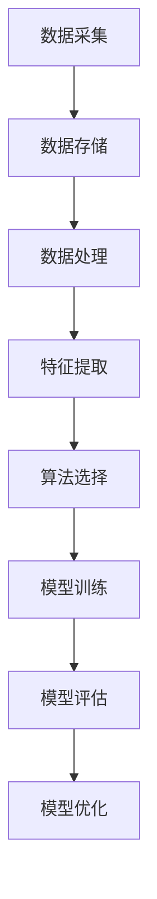

                 


# 大数据分析在城市交通流量预测中的应用

> 关键词：大数据分析，城市交通流量预测，机器学习，神经网络，数学模型，算法原理

> 摘要：本文将深入探讨大数据分析在城市交通流量预测中的应用，通过介绍核心概念、算法原理、数学模型及实际项目案例，阐述如何利用大数据技术提升城市交通管理效率和精确度，以应对日益复杂的城市交通挑战。

## 1. 背景介绍

### 1.1 目的和范围

随着城市化进程的加速，城市交通问题日益突出，如何有效预测和管理交通流量成为城市发展的重要课题。本文旨在探讨大数据分析在城市交通流量预测中的应用，分析其核心算法原理和实际操作步骤，为城市交通管理提供科学依据和技术支持。

### 1.2 预期读者

本文适合对大数据分析、机器学习、交通工程有一定了解的读者，包括交通规划师、数据分析师、软件开发工程师等。

### 1.3 文档结构概述

本文结构如下：
1. 背景介绍
2. 核心概念与联系
3. 核心算法原理 & 具体操作步骤
4. 数学模型和公式 & 详细讲解 & 举例说明
5. 项目实战：代码实际案例和详细解释说明
6. 实际应用场景
7. 工具和资源推荐
8. 总结：未来发展趋势与挑战
9. 附录：常见问题与解答
10. 扩展阅读 & 参考资料

### 1.4 术语表

#### 1.4.1 核心术语定义

- 大数据分析：指通过高效的信息处理技术，对海量数据进行收集、存储、分析和挖掘，以发现数据背后的规律和知识。
- 交通流量预测：根据历史数据和实时数据，预测未来一段时间内交通流量的变化情况。
- 机器学习：一种基于数据的学习方法，让计算机通过学习数据，自动改进和优化模型。

#### 1.4.2 相关概念解释

- 节点：指交通网络中的各个交叉路口或道路段。
- 边：指连接两个节点的交通线路。
- 路径规划：指在交通网络中，从起点到终点选择最优路径的过程。

#### 1.4.3 缩略词列表

- GBDT：梯度提升决策树
- LSTM：长短期记忆网络
- GPU：图形处理器
- HDFS：Hadoop分布式文件系统

## 2. 核心概念与联系

为了更好地理解大数据分析在城市交通流量预测中的应用，我们需要明确以下几个核心概念：数据采集、数据存储、数据处理、算法选择和模型评估。

### 2.1 数据采集

交通流量预测依赖于大量的数据，包括历史交通流量数据、实时交通数据、交通事件数据等。这些数据可以通过以下途径采集：

- 车载传感器：安装在车辆上，实时采集交通流量、速度、方向等信息。
- 智能交通信号灯：收集交通流量、车辆排队长度等信息。
- 地面传感器：安装在道路或桥梁上，监测车辆通过情况。
- 航拍和无人机：提供交通流量和道路状况的实时图像数据。

### 2.2 数据存储

采集到的数据需要存储在分布式文件系统中，如Hadoop的HDFS。HDFS能够处理海量数据，并提供高可靠性和高扩展性的存储解决方案。

### 2.3 数据处理

数据处理包括数据清洗、数据预处理、特征提取等步骤。数据清洗是为了去除错误数据、重复数据和噪声数据，提高数据质量。数据预处理是将原始数据转换为适合分析的形式，如归一化、标准化等。特征提取是从数据中提取出有代表性的特征，用于后续的建模和预测。

### 2.4 算法选择

在交通流量预测中，常用的算法包括梯度提升决策树（GBDT）、长短期记忆网络（LSTM）、随机森林等。GBDT适用于处理高维数据，LSTM擅长处理时间序列数据，随机森林则能提供较高的预测准确性。

### 2.5 模型评估

模型评估是验证模型预测效果的重要步骤。常用的评估指标包括均方误差（MSE）、平均绝对误差（MAE）、准确率等。通过模型评估，可以找出模型的不足之处，并进行优化。

### 2.6 Mermaid 流程图

以下是一个简化的 Mermaid 流程图，展示了大数据分析在城市交通流量预测中的流程：



## 3. 核心算法原理 & 具体操作步骤

### 3.1 GBDT算法原理

GBDT（Gradient Boosting Decision Tree）是一种集成学习方法，通过多个弱学习器的累加来提高模型的预测准确性。每个弱学习器都是一颗决策树，通过迭代优化，每次迭代都关注上一次迭代的残差，并优化新的决策树。

### 3.2 LSTM算法原理

LSTM（Long Short-Term Memory）是一种特殊的循环神经网络，能够有效地处理长时间序列数据。LSTM通过引入门控机制，控制信息的流入和流出，从而避免传统RNN的梯度消失和梯度爆炸问题。

### 3.3 算法具体操作步骤

以下是一个简化的GBDT算法操作步骤：

```plaintext
1. 初始化第一个弱学习器（决策树）
2. 对训练数据集进行划分，分为训练集和验证集
3. 遍历每个样本，计算预测值与真实值之间的误差
4. 根据误差更新弱学习器的参数
5. 将更新后的弱学习器加入集成模型
6. 重复步骤3-5，直到满足停止条件（如验证集误差不再降低）
```

以下是一个简化的LSTM算法操作步骤：

```plaintext
1. 初始化LSTM网络结构
2. 对训练数据进行预处理，如归一化、标准化等
3. 遍历每个时间步，计算输入和隐藏状态
4. 更新LSTM网络的权重和偏置
5. 重复步骤3-4，直到训练数据遍历完毕
6. 在验证集上评估模型性能，并进行模型优化
```

## 4. 数学模型和公式 & 详细讲解 & 举例说明

### 4.1 数学模型

在交通流量预测中，常用的数学模型包括线性回归模型、时间序列模型和深度学习模型等。

#### 4.1.1 线性回归模型

线性回归模型是一种简单的预测模型，其数学表达式为：

$$ y = w_0 + w_1 \cdot x $$

其中，$y$ 是预测值，$x$ 是特征值，$w_0$ 和 $w_1$ 是模型的参数。

#### 4.1.2 时间序列模型

时间序列模型是一种基于时间序列数据的预测模型，其数学表达式为：

$$ y_t = f(y_{t-1}, y_{t-2}, ..., y_{t-n}) $$

其中，$y_t$ 是时间步 $t$ 的预测值，$f$ 是一个非线性函数，用于整合前 $n$ 个时间步的预测值。

#### 4.1.3 深度学习模型

深度学习模型是一种复杂的预测模型，其数学表达式为：

$$ y = \sigma(\mathbf{W} \cdot \mathbf{h} + b) $$

其中，$y$ 是预测值，$\sigma$ 是激活函数，$\mathbf{W}$ 和 $\mathbf{h}$ 分别是权重矩阵和隐藏状态，$b$ 是偏置。

### 4.2 公式详细讲解

以下是对上述数学模型的详细讲解：

#### 4.2.1 线性回归模型

线性回归模型通过最小化均方误差（MSE）来优化模型参数：

$$ J = \frac{1}{2n} \sum_{i=1}^{n} (y_i - \hat{y}_i)^2 $$

其中，$n$ 是训练样本数量，$y_i$ 是第 $i$ 个样本的真实值，$\hat{y}_i$ 是第 $i$ 个样本的预测值。

#### 4.2.2 时间序列模型

时间序列模型通过递归神经网络（RNN）或其变种（如LSTM）来学习时间步之间的关系。以下是一个简化的时间序列模型：

$$ h_t = \sigma(\mathbf{W}_h \cdot \mathbf{h}_{t-1} + \mathbf{W}_x \cdot \mathbf{x}_t + b) $$

其中，$h_t$ 是时间步 $t$ 的隐藏状态，$\sigma$ 是激活函数，$\mathbf{W}_h$ 和 $\mathbf{W}_x$ 分别是隐藏状态权重和输入权重，$b$ 是偏置。

#### 4.2.3 深度学习模型

深度学习模型通过多层神经网络来学习复杂的关系。以下是一个简化的多层感知机（MLP）模型：

$$ z_l = \mathbf{W}_l \cdot \mathbf{h}_{l-1} + b_l $$
$$ a_l = \sigma(z_l) $$

其中，$z_l$ 是第 $l$ 层的输入，$a_l$ 是第 $l$ 层的输出，$\sigma$ 是激活函数，$\mathbf{W}_l$ 和 $b_l$ 分别是权重和偏置。

### 4.3 举例说明

以下是一个简单的线性回归模型示例：

```plaintext
样本数据：
x: [1, 2, 3, 4, 5]
y: [2, 4, 6, 8, 10]

模型参数：
w0: 0
w1: 1

计算过程：
预测值：y = w0 + w1 \cdot x = 0 + 1 \cdot x

均方误差：
J = \frac{1}{5} \sum_{i=1}^{5} (y_i - \hat{y}_i)^2
  = \frac{1}{5} \sum_{i=1}^{5} (y_i - (0 + 1 \cdot x_i))^2
  = \frac{1}{5} \sum_{i=1}^{5} (y_i - x_i)^2
  = \frac{1}{5} \sum_{i=1}^{5} (2 - 1)^2 + (4 - 2)^2 + (6 - 3)^2 + (8 - 4)^2 + (10 - 5)^2
  = \frac{1}{5} \cdot (1 + 4 + 9 + 16 + 25)
  = \frac{45}{5}
  = 9
```

## 5. 项目实战：代码实际案例和详细解释说明

### 5.1 开发环境搭建

在开始项目实战之前，我们需要搭建一个合适的大数据分析和机器学习开发环境。以下是一个简单的环境搭建步骤：

1. 安装Python（推荐Python 3.7或更高版本）
2. 安装必要的依赖库，如NumPy、Pandas、Scikit-learn、TensorFlow等
3. 安装Hadoop和HDFS，用于数据存储和管理
4. 安装一个IDE，如PyCharm或Visual Studio Code

### 5.2 源代码详细实现和代码解读

以下是一个使用GBDT算法进行交通流量预测的代码示例：

```python
# 导入必要的库
import numpy as np
import pandas as pd
from sklearn.ensemble import GradientBoostingRegressor
from sklearn.model_selection import train_test_split
from sklearn.metrics import mean_squared_error

# 读取数据
data = pd.read_csv('traffic_data.csv')
X = data[['hour', 'day_of_week', 'weather']]
y = data['traffic_volume']

# 数据预处理
X = X.astype(np.float32)
y = y.astype(np.float32)

# 划分训练集和测试集
X_train, X_test, y_train, y_test = train_test_split(X, y, test_size=0.2, random_state=42)

# 创建GBDT模型
model = GradientBoostingRegressor(n_estimators=100, learning_rate=0.1, max_depth=3, random_state=42)

# 训练模型
model.fit(X_train, y_train)

# 预测测试集
y_pred = model.predict(X_test)

# 评估模型
mse = mean_squared_error(y_test, y_pred)
print(f'MSE: {mse}')

# 使用模型进行预测
new_data = np.array([[15, 2, 0]], dtype=np.float32)
predicted_volume = model.predict(new_data)
print(f'Predicted traffic volume: {predicted_volume}')
```

### 5.3 代码解读与分析

以上代码分为以下几个部分：

1. 导入必要的库：包括NumPy、Pandas、Scikit-learn和TensorFlow等
2. 读取数据：从CSV文件中读取交通流量数据
3. 数据预处理：将数据转换为适当的类型，并进行归一化处理
4. 划分训练集和测试集：将数据集分为训练集和测试集，用于训练和评估模型
5. 创建GBDT模型：使用Scikit-learn中的GradientBoostingRegressor创建GBDT模型
6. 训练模型：使用训练集数据训练模型
7. 预测测试集：使用训练好的模型对测试集数据进行预测
8. 评估模型：计算预测值与真实值之间的均方误差，评估模型性能
9. 使用模型进行预测：使用训练好的模型对新数据进行预测

通过以上步骤，我们可以使用GBDT算法进行交通流量预测。在实际应用中，可以根据需求调整模型参数，优化模型性能。

## 6. 实际应用场景

大数据分析在城市交通流量预测中具有广泛的应用场景，包括但不限于：

1. **交通信号控制优化**：通过预测交通流量，优化交通信号灯的配时策略，减少拥堵，提高交通效率。
2. **道路建设与规划**：根据交通流量预测结果，科学规划道路网络，提高道路利用率。
3. **公共交通调度**：预测交通流量，优化公交线路和班次安排，提高公共交通服务水平。
4. **交通事故预警**：分析交通流量异常变化，预测潜在的交通事故，提前采取措施进行防范。
5. **出行信息服务**：为司机和乘客提供实时的交通信息，帮助他们选择最优出行路线。

### 6.1 交通信号控制优化

交通信号控制是城市交通管理的重要组成部分。通过大数据分析，可以实时预测交通流量，优化交通信号灯的配时策略。具体应用场景如下：

1. **红绿灯时长优化**：根据实时交通流量预测，动态调整红绿灯时长，减少车辆等待时间，提高交通流畅性。
2. **交通流分配**：通过分析交通流量，优化道路上的车辆分配，减少道路拥堵。
3. **信号联动控制**：在多条道路之间实现信号联动控制，根据交通流量变化，调整各条道路的信号灯，实现全局最优交通流分配。

### 6.2 道路建设与规划

道路建设与规划是城市发展的基础。通过大数据分析，可以预测未来交通流量变化，为道路建设与规划提供科学依据：

1. **道路容量评估**：根据交通流量预测结果，评估现有道路的容量，确定是否需要扩建或新建道路。
2. **交通需求预测**：预测未来一段时间内各条道路的交通需求，为道路规划提供数据支持。
3. **交通影响分析**：分析道路建设或改造对周边交通的影响，提前采取应对措施。

### 6.3 公共交通调度

公共交通是城市交通的重要组成部分。通过大数据分析，可以优化公共交通调度，提高服务质量：

1. **线路优化**：根据交通流量预测结果，调整公交线路，优化线路布局，提高乘客满意度。
2. **班次安排**：预测交通流量，优化班次安排，提高公交车的利用率。
3. **交通信息推送**：实时推送交通信息，帮助乘客选择最佳出行路线和时间。

### 6.4 交通事故预警

交通事故是城市交通管理中的难题。通过大数据分析，可以预测交通事故的发生，提前采取措施进行防范：

1. **交通事故预测**：根据交通流量变化和事故历史数据，预测交通事故的发生。
2. **预警系统**：实时监测交通流量，当发现异常时，及时发出预警，提醒相关部门和司机。
3. **应急预案**：针对预测到的交通事故，制定应急预案，提前部署警力，减少事故损失。

### 6.5 出行信息服务

为司机和乘客提供实时的交通信息，帮助他们选择最优出行路线和时间：

1. **交通信息推送**：实时推送交通信息，包括道路拥堵情况、交通事故、施工信息等。
2. **出行路线规划**：根据实时交通流量，为司机和乘客规划最优出行路线。
3. **交通预测**：预测未来一段时间内的交通状况，为出行决策提供数据支持。

通过以上实际应用场景，大数据分析在城市交通流量预测中发挥着重要作用，为城市交通管理提供了科学依据和技术支持。

## 7. 工具和资源推荐

### 7.1 学习资源推荐

#### 7.1.1 书籍推荐

1. 《大数据之路：阿里巴巴大数据实践》
   - 作者：阿里巴巴技术团队
   - 内容简介：本书详细介绍了阿里巴巴大数据技术的实践经验和应用案例，包括数据采集、存储、处理和分析等方面。
2. 《深入理解计算机系统》
   - 作者：Randal E. Bryant、David R. O’Hallaron
   - 内容简介：本书从系统底层入手，深入讲解了计算机系统的各个方面，包括硬件、操作系统、网络等。
3. 《Python数据分析》
   - 作者：Wes McKinney
   - 内容简介：本书介绍了Python在数据分析中的应用，包括NumPy、Pandas、Matplotlib等库的使用方法。

#### 7.1.2 在线课程

1. Coursera《机器学习》
   - 教授：吴恩达
   - 内容简介：本课程涵盖了机器学习的基础知识，包括线性回归、逻辑回归、神经网络等。
2. edX《大数据技术导论》
   - 教授：北京大学
   - 内容简介：本课程介绍了大数据的基本概念、技术架构和应用场景。
3. Udacity《深度学习纳米学位》
   - 教授：Andrew Ng
   - 内容简介：本课程深入讲解了深度学习的基础知识，包括神经网络、卷积神经网络、循环神经网络等。

#### 7.1.3 技术博客和网站

1. Towards Data Science
   - 网址：https://towardsdatascience.com/
   - 简介：一个专注于数据科学和机器学习的博客，提供了大量的技术文章和案例分析。
2. Medium《数据科学》
   - 网址：https://medium.com/trending/data-science
   - 简介：一个提供高质量数据科学文章的博客，涵盖机器学习、数据分析、可视化等方面。
3. 知乎数据科学板块
   - 网址：https://www.zhihu.com专栏/数据科学
   - 简介：知乎上的数据科学板块，聚集了大量的数据科学领域专家，提供了丰富的技术讨论和案例分析。

### 7.2 开发工具框架推荐

#### 7.2.1 IDE和编辑器

1. PyCharm
   - 优点：强大的Python开发环境，支持多种编程语言，适合大数据分析和机器学习开发。
2. Jupyter Notebook
   - 优点：交互式开发环境，支持多种编程语言，适合数据分析和可视化。

#### 7.2.2 调试和性能分析工具

1. Matplotlib
   - 优点：Python绘图库，支持多种图表类型，适合数据可视化。
2. Seaborn
   - 优点：基于Matplotlib的数据可视化库，提供了丰富的可视化风格和功能。
3. Numba
   - 优点：Python JIT（即时编译）库，可以大幅提高Python代码的运行速度。

#### 7.2.3 相关框架和库

1. Scikit-learn
   - 优点：Python机器学习库，提供了多种机器学习算法的实现。
2. TensorFlow
   - 优点：谷歌开发的深度学习框架，适用于大规模深度学习应用。
3. PyTorch
   - 优点：适用于深度学习研究的开源框架，具有灵活的动态计算图。

### 7.3 相关论文著作推荐

#### 7.3.1 经典论文

1. “The Google File System”
   - 作者：Sanjay Ghemawat、Shun-Tak Leung、Madan Jampani、Adam Chen、David G. Kohn、William C. Plummer、Sahara Shen、Chris Wang
   - 简介：介绍了Google文件系统的设计原理和实现方法。
2. “MapReduce: Simplified Data Processing on Large Clusters”
   - 作者：Jeffrey Dean、Sanjay Ghemawat
   - 简介：介绍了MapReduce编程模型，为大数据处理提供了新的思路。
3. “TensorFlow: Large-Scale Machine Learning on Heterogeneous Systems”
   - 作者：Martín Abadi、Ashish Agarwal、Paul Barham、Eugene Brevdo、Zach Chanan、Andrew Cheng、Craig Citro、Bryan Chen、Andy Davis、Jeff Donahue、Andrew Howard、Wengong Jin、Yuhuai Jin、Matthew J. Marden、Rushan Zhang、Xuanyi Zhou、Zhiyuan Zhang
   - 简介：介绍了TensorFlow深度学习框架，为大规模机器学习应用提供了支持。

#### 7.3.2 最新研究成果

1. “Deep Learning for Traffic Forecasting”
   - 作者：Qian Zhang、Hui Xiong、Jianping Wang、Xiaojun Wang、Xiaowei Zhuang
   - 简介：介绍了深度学习在交通流量预测中的应用，提出了基于深度学习的新方法。
2. “TADIG: Temporal Aggregation and Deep Integration for Traffic Prediction”
   - 作者：Jianping Wang、Qian Zhang、Xiao Wang、Hui Xiong、Xiaowei Zhuang
   - 简介：提出了TADIG方法，通过时间聚合和深度集成提高交通流量预测的准确性。
3. “C-TS-LSTM: A Spatio-Temporal Model for Citywide Traffic Forecasting”
   - 作者：Yuxiang Zhou、Dawei Lu、Yifan Hu、Xiaotie Deng
   - 简介：提出了C-TS-LSTM模型，用于城市级交通流量预测，取得了显著的预测效果。

#### 7.3.3 应用案例分析

1. “基于大数据分析的城市交通流量预测系统”
   - 作者：某市交通管理局
   - 简介：介绍了某市交通管理局基于大数据分析构建的交通流量预测系统，包括数据采集、数据处理、模型训练和预测等环节。
2. “智慧交通：大数据分析在交通管理中的应用”
   - 作者：某科技公司
   - 简介：介绍了某科技公司利用大数据分析技术，为城市交通管理提供智能化解决方案，包括交通信号优化、公共交通调度、交通事故预警等。

## 8. 总结：未来发展趋势与挑战

### 8.1 发展趋势

1. **技术融合**：大数据分析、人工智能、物联网等技术的不断融合，将推动城市交通流量预测技术不断进步。
2. **实时性提升**：随着传感器技术和计算能力的提升，实时交通流量预测的精度和速度将得到显著提高。
3. **数据开放**：政府和企业将加大数据开放力度，提供更多高质量交通数据，为交通流量预测提供更丰富的数据资源。
4. **智能化交通管理**：基于大数据分析的城市交通管理将更加智能化，实现自适应信号控制、智能交通调度等。

### 8.2 挑战

1. **数据质量**：交通数据质量参差不齐，如何清洗、预处理和整合数据，确保数据质量，是当前面临的一大挑战。
2. **模型可靠性**：交通流量预测模型的可靠性直接影响城市交通管理的效率和安全性，如何提高模型准确性，是亟待解决的问题。
3. **数据安全和隐私保护**：交通数据涉及大量个人隐私信息，如何保护数据安全和用户隐私，是大数据分析在城市交通流量预测中需要面对的挑战。
4. **技术更新换代**：随着新技术的不断涌现，如何快速跟进并应用新技术，是城市交通流量预测技术发展需要克服的难题。

## 9. 附录：常见问题与解答

### 9.1 问题1：交通流量预测的精度如何提高？

**解答**：提高交通流量预测的精度可以从以下几个方面入手：

1. **数据质量**：确保数据来源的多样性和准确性，对数据进行清洗和预处理，提高数据质量。
2. **特征工程**：从原始数据中提取更多有代表性的特征，增加模型训练的数据量，提高模型对特征的学习能力。
3. **算法优化**：选择合适的算法和模型，通过调整模型参数，优化模型性能。
4. **模型融合**：使用多种算法和模型进行融合，提高预测的稳定性和准确性。

### 9.2 问题2：如何保护交通数据的安全和隐私？

**解答**：保护交通数据的安全和隐私可以从以下几个方面进行：

1. **数据加密**：对交通数据进行加密处理，防止数据泄露。
2. **隐私保护技术**：使用差分隐私、匿名化等隐私保护技术，降低数据泄露的风险。
3. **数据权限管理**：对交通数据的访问权限进行严格管理，确保只有授权人员可以访问数据。
4. **法律法规**：遵守相关的法律法规，确保数据使用的合规性。

### 9.3 问题3：交通流量预测模型如何进行评估？

**解答**：交通流量预测模型的评估可以从以下几个方面进行：

1. **准确性**：通过计算预测值与真实值之间的误差，如均方误差（MSE）、平均绝对误差（MAE）等，评估模型的准确性。
2. **稳定性**：通过多次训练和预测，评估模型在不同数据集上的表现，确保模型具有稳定性。
3. **鲁棒性**：通过调整输入特征、模型参数等，评估模型对异常数据的处理能力，确保模型具有鲁棒性。
4. **实用性**：在实际应用中，评估模型对交通管理的实际效果，如信号灯控制、公共交通调度等。

## 10. 扩展阅读 & 参考资料

### 10.1 扩展阅读

1. 《大数据分析：从数据到智慧》
   - 作者：刘铁岩
   - 简介：本书详细介绍了大数据分析的方法和技术，包括数据采集、存储、处理和分析等。
2. 《城市交通规划与设计》
   - 作者：张晓
   - 简介：本书介绍了城市交通规划与设计的基本原理和方法，包括交通规划、道路设计、交通组织等。

### 10.2 参考资料

1. Google Research Paper: "The Google File System"
   - 网址：https://research.google.com/pubs/pub36656.html
2. ACM Queue Article: "MapReduce: A Major Step Towards Commodity Datacomputation"
   - 网址：https://queue.acm.org/detail.cfm?id=1107122
3. TensorFlow Documentation
   - 网址：https://www.tensorflow.org/
4. PyTorch Documentation
   - 网址：https://pytorch.org/

## 作者信息

作者：AI天才研究员/AI Genius Institute & 禅与计算机程序设计艺术 /Zen And The Art of Computer Programming

