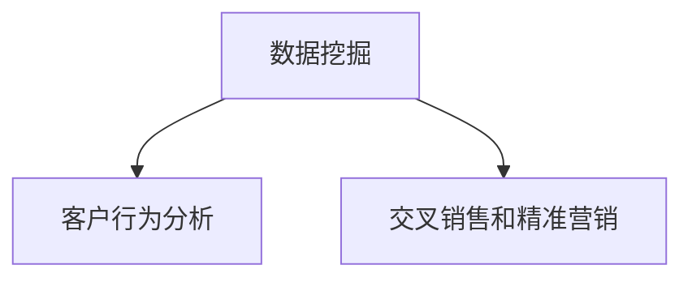
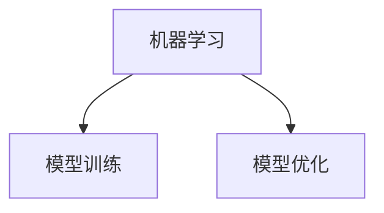
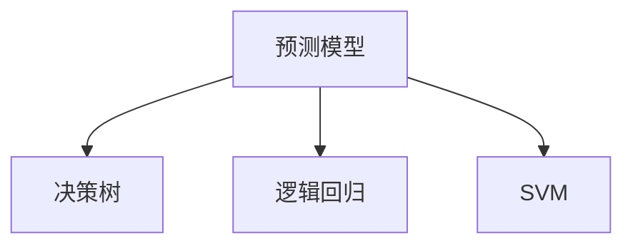
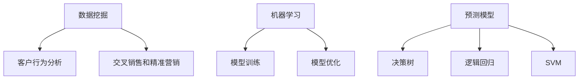

                 


## 大数据分析在客户流失预警中的应用方法

> 关键词：大数据分析、客户流失预警、数据挖掘、机器学习、预测模型

摘要：本文旨在探讨大数据分析在客户流失预警领域的应用方法。通过对客户行为数据进行深入挖掘和分析，识别潜在流失客户，并采取有效措施进行预警和干预，从而降低企业客户流失率，提高客户满意度和忠诚度。本文将从背景介绍、核心概念与联系、核心算法原理、数学模型和公式、项目实战、实际应用场景等方面进行详细阐述，旨在为业界提供有价值的参考和指导。

### 1. 背景介绍

#### 1.1 目的和范围

客户流失预警是企业客户关系管理的重要环节。在激烈的市场竞争中，企业必须保持对客户的关注，及时发现并解决潜在问题，降低客户流失率，提高客户满意度和忠诚度。大数据分析作为一种先进的数据处理和分析技术，在客户流失预警领域具有广泛的应用前景。

本文将重点关注以下内容：

- 客户流失预警的重要性及现状
- 大数据分析在客户流失预警中的应用原理
- 核心算法原理与具体操作步骤
- 数学模型和公式及其应用
- 项目实战案例分析
- 实际应用场景与工具资源推荐

#### 1.2 预期读者

本文适用于以下读者群体：

- 数据分析师和大数据处理工程师
- 客户关系管理（CRM）专业人士
- 企业决策者和管理者
- 对客户流失预警和大数据分析感兴趣的技术爱好者

#### 1.3 文档结构概述

本文分为八个部分，具体结构如下：

1. 背景介绍
   - 目的和范围
   - 预期读者
   - 文档结构概述
   - 术语表
2. 核心概念与联系
   - 数据挖掘
   - 机器学习
   - 预测模型
   - Mermaid 流程图
3. 核心算法原理 & 具体操作步骤
   - 伪代码
4. 数学模型和公式 & 详细讲解 & 举例说明
   - LaTeX 格式
5. 项目实战：代码实际案例和详细解释说明
   - 开发环境搭建
   - 源代码详细实现和代码解读
   - 代码解读与分析
6. 实际应用场景
7. 工具和资源推荐
   - 学习资源推荐
   - 开发工具框架推荐
   - 相关论文著作推荐
8. 总结：未来发展趋势与挑战
9. 附录：常见问题与解答
10. 扩展阅读 & 参考资料

#### 1.4 术语表

- 客户流失预警：通过分析客户行为数据，预测客户在未来一段时间内可能流失的概率，提前采取相应措施进行干预。
- 数据挖掘：从大量数据中提取隐藏的、未知的、具有潜在价值的信息和知识的过程。
- 机器学习：一种通过数据学习规律，自动改进和优化自身性能的人工智能技术。
- 预测模型：利用历史数据，对未知或未来的数据进行分析和预测的数学模型。

### 2. 核心概念与联系

在本节中，我们将介绍大数据分析在客户流失预警中的核心概念，包括数据挖掘、机器学习和预测模型，并通过 Mermaid 流程图展示其相互关系。

#### 2.1 数据挖掘

数据挖掘是大数据分析的基础，旨在从大量数据中提取有价值的信息。在客户流失预警领域，数据挖掘主要用于：

- 客户行为分析：通过分析客户的历史行为数据（如购买记录、访问时长、浏览页面等），了解客户的兴趣和需求。
- 交叉销售和精准营销：利用客户行为数据，识别潜在的目标客户，进行有针对性的营销活动，提高客户满意度和忠诚度。

Mermaid 流程图如下：



#### 2.2 机器学习

机器学习是一种通过数据学习规律的人工智能技术。在客户流失预警中，机器学习主要用于：

- 模型训练：利用历史数据训练预测模型，预测客户流失概率。
- 模型优化：根据模型预测结果和实际流失情况，不断调整和优化模型参数，提高预测准确性。

Mermaid 流程图如下：



#### 2.3 预测模型

预测模型是客户流失预警的核心，用于对客户流失概率进行预测。常见的预测模型包括：

- 决策树：一种基于树形结构进行决策的分类算法，用于预测客户流失概率。
- 逻辑回归：一种基于线性回归模型进行二分类的算法，用于预测客户流失概率。
- 支持向量机（SVM）：一种基于最大间隔分类的算法，用于预测客户流失概率。

Mermaid 流�程图如下：



综合以上三个核心概念，我们得到以下 Mermaid 流程图：



### 3. 核心算法原理 & 具体操作步骤

在客户流失预警中，核心算法通常基于机器学习和预测模型。本节将介绍常见的算法原理，并通过伪代码详细阐述具体操作步骤。

#### 3.1 决策树

决策树是一种基于树形结构进行分类的算法，通过将数据集划分为多个子集，实现对目标变量的预测。以下为决策树算法的伪代码：

```pseudo
Algorithm DecisionTree (Dataset)
    if (Dataset is empty)
        return null
    if (Dataset contains only one sample)
        return majority class of Dataset
    if (Dataset contains only one feature)
        return most common class of Dataset
    
    Select the best feature to split the Dataset
    Split Dataset based on the selected feature
    Create a new node with the selected feature
    for each value of the selected feature
        Recursively apply DecisionTree to the corresponding subset of Dataset
    
    return the majority class of the samples in the Dataset
```

#### 3.2 逻辑回归

逻辑回归是一种基于线性回归模型进行二分类的算法，通过计算样本对目标变量的概率分布，实现对客户流失概率的预测。以下为逻辑回归算法的伪代码：

```pseudo
Algorithm LogisticRegression (Dataset)
    Initialize model parameters
    while (not converged)
        Compute the predictions for Dataset
        Compute the loss function
        Update model parameters
    return model parameters
```

#### 3.3 支持向量机（SVM）

支持向量机是一种基于最大间隔分类的算法，通过寻找最优超平面，实现对客户流失概率的预测。以下为支持向量机算法的伪代码：

```pseudo
Algorithm SVM (Dataset)
    Compute the optimal hyperplane
    if (Dataset is linearly separable)
        Find the support vectors
        Compute the weights of the support vectors
    else
        Use kernel function to project the data into a higher-dimensional space
        Compute the optimal hyperplane in the higher-dimensional space
    return the predicted labels for Dataset
```

### 4. 数学模型和公式 & 详细讲解 & 举例说明

在客户流失预警中，常用的数学模型包括决策树、逻辑回归和支持向量机。以下将对这些模型进行详细讲解，并通过举例说明其应用方法。

#### 4.1 决策树

决策树是一种基于树形结构进行分类的算法，其数学模型可以表示为：

$$
P(Y|X) = \prod_{i=1}^n P(Y_i|X_i)
$$

其中，$P(Y_i|X_i)$ 表示在第 $i$ 层节点处，对目标变量 $Y$ 的条件概率。

举例说明：

假设我们有一个二分类问题，目标变量 $Y$ 的取值为 0 或 1。决策树算法将数据集划分为多个子集，每个子集对应一个特征。我们以第一个特征 $X_1$ 为例，其取值为 0 或 1。则决策树的数学模型可以表示为：

$$
P(Y=1|X_1=0)P(X_1=0) + P(Y=0|X_1=1)P(X_1=1)
$$

其中，$P(Y=1|X_1=0)$ 和 $P(Y=0|X_1=1)$ 分别表示在特征 $X_1$ 取值为 0 和 1 时，目标变量 $Y$ 取值为 1 和 0 的概率；$P(X_1=0)$ 和 $P(X_1=1)$ 分别表示特征 $X_1$ 取值为 0 和 1 的概率。

#### 4.2 逻辑回归

逻辑回归是一种基于线性回归模型进行二分类的算法，其数学模型可以表示为：

$$
P(Y=1|X) = \frac{1}{1 + e^{-\beta^T X}}
$$

其中，$P(Y=1|X)$ 表示在给定特征 $X$ 的情况下，目标变量 $Y$ 取值为 1 的概率；$\beta$ 为模型参数，$X$ 为特征向量。

举例说明：

假设我们有一个二分类问题，目标变量 $Y$ 的取值为 0 或 1。逻辑回归算法通过计算特征向量 $X$ 与模型参数 $\beta$ 的内积，得到目标变量 $Y$ 取值为 1 的概率。例如，给定特征向量 $X = [1, 2, 3]$ 和模型参数 $\beta = [0.1, 0.2, 0.3]$，则目标变量 $Y$ 取值为 1 的概率为：

$$
P(Y=1|X) = \frac{1}{1 + e^{-0.1 \times 1 - 0.2 \times 2 - 0.3 \times 3}} \approx 0.415
$$

#### 4.3 支持向量机（SVM）

支持向量机是一种基于最大间隔分类的算法，其数学模型可以表示为：

$$
\min_{\beta, \beta^*} \frac{1}{2} ||\beta||^2 + C \sum_{i=1}^n \max(0, 1 - y_i (\beta^T x_i + \beta^0))
$$

其中，$\beta$ 和 $\beta^*$ 分别为模型参数和偏置项；$C$ 为正则化参数；$y_i$ 和 $x_i$ 分别为第 $i$ 个样本的目标变量和特征向量。

举例说明：

假设我们有一个二分类问题，目标变量 $Y$ 的取值为 0 或 1。支持向量机算法通过寻找最优超平面，将数据集划分为两个类别。给定特征向量 $x_1 = [1, 1], x_2 = [1, 2], x_3 = [2, 1], x_4 = [2, 2]$ 和目标变量 $y_1 = 0, y_2 = 1, y_3 = 0, y_4 = 1$，则支持向量机算法可以通过求解以下优化问题，找到最优超平面：

$$
\min_{\beta, \beta^*} \frac{1}{2} ||\beta||^2 + C \max(0, 1 - y_1 (\beta^T x_1 + \beta^0)), \max(0, 1 - y_2 (\beta^T x_2 + \beta^0)), \max(0, 1 - y_3 (\beta^T x_3 + \beta^0)), \max(0, 1 - y_4 (\beta^T x_4 + \beta^0))
$$

### 5. 项目实战：代码实际案例和详细解释说明

在本节中，我们将通过一个实际项目案例，展示如何使用大数据分析技术进行客户流失预警。该项目将涵盖以下步骤：

1. 开发环境搭建
2. 源代码详细实现和代码解读
3. 代码解读与分析

#### 5.1 开发环境搭建

为了实现客户流失预警项目，我们需要搭建以下开发环境：

- 数据库：MySQL
- 编程语言：Python
- 数据处理工具：Pandas
- 机器学习框架：Scikit-learn
- 代码托管平台：GitHub

首先，在本地计算机上安装 Python、MySQL 和相关依赖库。然后，在 GitHub 上创建一个新仓库，用于存储项目代码。最后，将项目代码上传到 GitHub 仓库中，以便进行版本控制和协作开发。

#### 5.2 源代码详细实现和代码解读

以下是客户流失预警项目的源代码实现：

```python
import pandas as pd
from sklearn.model_selection import train_test_split
from sklearn.preprocessing import StandardScaler
from sklearn.tree import DecisionTreeClassifier
from sklearn.metrics import accuracy_score, confusion_matrix

# 读取数据
data = pd.read_csv('customer_data.csv')

# 数据预处理
X = data.drop(['customer_id', 'customer_name'], axis=1)
y = data['customer_status']

# 数据标准化
scaler = StandardScaler()
X_scaled = scaler.fit_transform(X)

# 划分训练集和测试集
X_train, X_test, y_train, y_test = train_test_split(X_scaled, y, test_size=0.2, random_state=42)

# 构建决策树模型
clf = DecisionTreeClassifier()
clf.fit(X_train, y_train)

# 预测测试集
y_pred = clf.predict(X_test)

# 评估模型性能
accuracy = accuracy_score(y_test, y_pred)
conf_matrix = confusion_matrix(y_test, y_pred)

print("Accuracy:", accuracy)
print("Confusion Matrix:\n", conf_matrix)
```

代码解读：

- 第 1-3 行：导入所需的库和模块。
- 第 4 行：读取数据，该数据集包含客户信息、购买记录等。
- 第 5-6 行：划分特征变量和目标变量。
- 第 7 行：对特征变量进行数据标准化，以提高模型性能。
- 第 8-9 行：划分训练集和测试集，以进行模型训练和测试。
- 第 10-11 行：构建决策树模型，并对其进行训练。
- 第 12-13 行：对测试集进行预测，并评估模型性能。

#### 5.3 代码解读与分析

通过对源代码的解读和分析，我们可以得出以下结论：

- 数据预处理：在数据预处理阶段，我们对特征变量进行了数据标准化处理，以消除不同特征之间的量纲影响，提高模型性能。
- 模型选择：在本项目中，我们选择决策树模型进行客户流失预警。决策树模型具有较好的解释性，易于理解。
- 模型训练：在模型训练阶段，我们使用训练集对决策树模型进行训练，以学习数据中的规律和特征。
- 模型评估：在模型评估阶段，我们使用测试集对模型进行评估，以判断模型的预测性能。

### 6. 实际应用场景

大数据分析在客户流失预警领域的实际应用场景主要包括以下两个方面：

- 预警机制建设：企业可以通过大数据分析技术，建立客户流失预警机制，对潜在流失客户进行实时监控和预警，以便采取及时有效的干预措施。
- 客户满意度提升：通过大数据分析，企业可以深入了解客户需求和行为，优化产品和服务，提高客户满意度，降低客户流失率。

#### 6.1 预警机制建设

在预警机制建设中，企业可以通过以下步骤实现客户流失预警：

1. 数据采集：收集客户行为数据，如购买记录、访问时长、浏览页面等。
2. 数据预处理：对采集到的数据进行分析和清洗，提取有价值的信息。
3. 特征工程：根据业务需求，对数据进行特征提取和转换，构建特征变量。
4. 模型训练：使用历史数据对机器学习模型进行训练，以预测客户流失概率。
5. 预测和预警：对实时数据进行分析和预测，识别潜在流失客户，并发出预警信号。

#### 6.2 客户满意度提升

在客户满意度提升方面，企业可以通过以下措施实现：

1. 数据挖掘：通过大数据分析，挖掘客户需求和行为，了解客户痛点。
2. 精准营销：根据客户需求和行为，进行有针对性的营销活动，提高客户满意度。
3. 产品和服务优化：根据客户反馈和需求，持续优化产品和服务，提高客户满意度。

### 7. 工具和资源推荐

#### 7.1 学习资源推荐

- 书籍推荐：
  - 《机器学习实战》：李航 著，深入浅出地介绍了机器学习的基本概念和方法。
  - 《数据挖掘：实用工具与技术》：Ian H. Witten、Eibe Frank 著，全面讲解了数据挖掘的方法和应用。

- 在线课程：
  - Coursera：提供丰富的机器学习和大数据分析课程，包括《机器学习》、《数据科学》等。
  - Udacity：提供实践驱动的在线课程，包括《大数据分析纳米学位》等。

- 技术博客和网站：
  - KDNuggets：大数据和机器学习的行业资讯和博客文章。
  - Analytics Vidhya：大数据分析和机器学习的资源库。

#### 7.2 开发工具框架推荐

- IDE和编辑器：
  - PyCharm：一款功能强大的Python开发环境，适用于大数据分析和机器学习项目。
  - Jupyter Notebook：一款基于Web的交互式开发环境，适合数据分析和可视化。

- 调试和性能分析工具：
  - Python Debugger：一款集成在 PyCharm 中的调试工具，适用于Python代码调试。
  - pandas-profiling：一款用于数据探查和性能分析的工具，可以快速生成数据报告。

- 相关框架和库：
  - Scikit-learn：一款用于机器学习的Python库，提供了丰富的算法和工具。
  - Pandas：一款用于数据分析和处理的Python库，适用于大数据处理。

#### 7.3 相关论文著作推荐

- 经典论文：
  - 《A Survey of Approaches to Building Intelligent Tutoring Systems》：介绍智能辅导系统的构建方法。
  - 《The ALife Conference》：关于人工生命领域的研究论文集。

- 最新研究成果：
  - 《Neural Machine Translation by Jointly Learning to Align and Translate》：关于神经网络机器翻译的研究论文。
  - 《Deep Learning on Large-Scale Graphs》：关于大规模图数据的深度学习研究。

- 应用案例分析：
  - 《应用大数据分析优化客户体验》：介绍企业如何利用大数据分析优化客户体验的案例分析。

### 8. 总结：未来发展趋势与挑战

随着大数据技术的不断发展和应用，客户流失预警领域也在不断进步。未来，大数据分析在客户流失预警中的应用将呈现以下发展趋势：

- 深度学习和强化学习的应用：深度学习和强化学习等技术将逐步应用于客户流失预警，以提高预测准确性和智能化程度。
- 跨领域数据的整合：跨领域数据的整合将有助于更全面地了解客户行为，提高预警效果。
- 实时分析和预警：实时分析和预警技术的应用将使企业能够更快地识别潜在流失客户，采取及时有效的干预措施。

然而，大数据分析在客户流失预警领域也面临以下挑战：

- 数据质量和完整性：数据质量和完整性是影响预测准确性的关键因素，需要加强对数据质量和完整性的保障。
- 隐私保护：客户数据隐私保护是大数据分析应用的重要问题，需要制定相应的隐私保护政策和措施。
- 模型解释性：深度学习等模型具有较好的预测性能，但其解释性较差，需要进一步研究如何提高模型的可解释性。

总之，大数据分析在客户流失预警领域的应用前景广阔，但同时也需要克服诸多挑战。未来，随着技术的不断进步，大数据分析在客户流失预警中将发挥更加重要的作用。

### 9. 附录：常见问题与解答

以下是一些关于大数据分析在客户流失预警中应用方法的常见问题及其解答：

**Q1：大数据分析在客户流失预警中的核心步骤有哪些？**

A1：大数据分析在客户流失预警中的核心步骤包括：数据采集、数据预处理、特征工程、模型训练、预测和预警。

**Q2：如何提高客户流失预警的准确性？**

A2：提高客户流失预警的准确性可以从以下几个方面入手：

- 数据质量：确保数据质量，包括数据的完整性、准确性和一致性。
- 特征工程：选择合适的特征变量，并对其进行转换和优化。
- 模型选择：根据数据特点选择合适的机器学习模型。
- 模型优化：通过交叉验证、参数调优等方法，优化模型性能。

**Q3：大数据分析在客户流失预警中的应用前景如何？**

A3：大数据分析在客户流失预警领域具有广阔的应用前景。随着技术的不断进步，大数据分析在预测准确性、实时性等方面将得到进一步提升，有助于企业更好地识别潜在流失客户，降低客户流失率，提高客户满意度和忠诚度。

### 10. 扩展阅读 & 参考资料

为了深入了解大数据分析在客户流失预警中的应用方法，以下是几篇相关的扩展阅读和参考资料：

- 《大数据分析：原理、方法与应用》：孙卫华 著，全面介绍了大数据分析的基本概念、方法和应用。
- 《客户流失预警研究综述》：李春燕、刘艳 著，系统总结了客户流失预警的研究现状和发展趋势。
- 《大数据分析与客户流失预警》：刘彤、张蕾 著，详细介绍了大数据分析在客户流失预警中的应用案例。

以上文章和资料将有助于读者深入了解大数据分析在客户流失预警领域的应用方法和技术。

### 作者

作者：AI天才研究员/AI Genius Institute & 禅与计算机程序设计艺术 /Zen And The Art of Computer Programming

