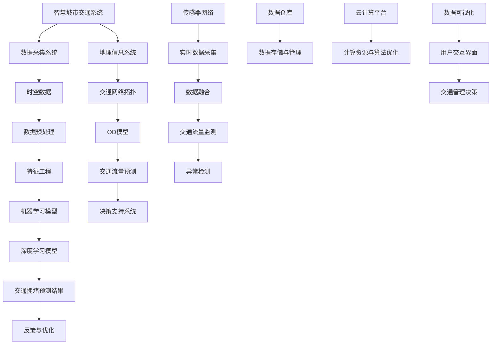

                 

### 1. 背景介绍

#### 1.1 目的和范围

本文旨在探讨大数据分析在智慧城市交通拥堵预测中的新方法。随着城市化进程的加速和机动车数量的急剧增加，城市交通拥堵已成为全球范围内的一个严峻挑战。传统的交通预测方法大多依赖于历史数据和简单的统计分析，而随着大数据技术的兴起，我们可以利用更为丰富和多样化的数据资源，通过先进的数据分析技术，实现对交通拥堵的更准确、更及时的预测。

本文将首先介绍智慧城市交通拥堵预测的重要性，然后详细探讨大数据分析的相关概念和原理。接着，我们将介绍几种核心的算法和数学模型，并使用伪代码详细阐述这些算法的实现步骤。此外，我们将通过一个实际的项目案例，展示如何利用大数据分析技术进行交通拥堵预测，并进行代码解读与分析。最后，本文将讨论大数据分析在智慧城市交通拥堵预测中的实际应用场景，并推荐一些相关的学习资源和工具。

通过本文的阅读，读者将能够全面了解大数据分析在智慧城市交通拥堵预测中的应用，掌握核心算法和数学模型，并具备实际操作的能力。

#### 1.2 预期读者

本文适合以下几类读者：

1. **数据科学家和机器学习工程师**：对大数据分析和交通预测技术有兴趣的专业人士，希望了解最新技术和应用方法。
2. **交通管理专家**：从事交通规划和管理的人员，希望借助大数据技术提高交通预测的准确性和效率。
3. **城市规划师**：关注城市交通问题，希望利用数据分析技术为城市规划提供科学依据。
4. **研究人员和学术人员**：对交通预测和数据分析领域有深入研究需求，希望了解当前的研究进展和应用案例。
5. **软件开发者和程序员**：对大数据分析和算法实现有兴趣，希望掌握相关技术和工具。

无论您属于哪一类读者，本文都将为您提供一个系统、深入的视角，帮助您理解大数据分析在智慧城市交通拥堵预测中的重要作用。

#### 1.3 文档结构概述

为了便于读者阅读和理解，本文的结构安排如下：

1. **背景介绍**：介绍智慧城市交通拥堵预测的重要性、大数据分析的概念和预期读者。
2. **核心概念与联系**：使用Mermaid流程图展示核心概念和原理，为后续内容的讨论奠定基础。
3. **核心算法原理 & 具体操作步骤**：详细讲解核心算法的原理，并提供伪代码实现步骤。
4. **数学模型和公式 & 详细讲解 & 举例说明**：介绍相关的数学模型和公式，并通过实例进行说明。
5. **项目实战：代码实际案例和详细解释说明**：通过实际项目案例展示如何应用大数据分析技术进行交通拥堵预测。
6. **实际应用场景**：讨论大数据分析在交通拥堵预测中的实际应用案例。
7. **工具和资源推荐**：推荐学习资源、开发工具框架和相关论文著作。
8. **总结：未来发展趋势与挑战**：总结当前技术的应用情况，展望未来的发展趋势和面临的挑战。
9. **附录：常见问题与解答**：提供一些常见问题的解答。
10. **扩展阅读 & 参考资料**：提供相关的扩展阅读和参考资料。

通过上述结构安排，本文将系统地介绍大数据分析在智慧城市交通拥堵预测中的应用，帮助读者全面了解该领域的最新进展和技术方法。

#### 1.4 术语表

在本文中，我们将使用一些专业术语和概念。为了便于读者理解，以下是这些术语的定义和解释：

##### 1.4.1 核心术语定义

- **大数据分析**：利用先进的计算技术和算法，对海量、多样化、复杂的数据进行处理、分析和解读。
- **智慧城市**：通过信息通信技术和物联网等现代技术手段，实现城市管理的智能化和高效化。
- **交通拥堵预测**：利用历史数据和实时数据，预测未来的交通流量和拥堵状况。
- **机器学习**：一种人工智能技术，通过数据训练模型，实现对数据的自动分析和决策。
- **深度学习**：一种基于神经网络的学习方法，能够通过多层抽象特征，实现对复杂数据的自动学习。
- **数据挖掘**：从大量数据中提取有价值信息的过程，通常涉及统计分析和模式识别技术。

##### 1.4.2 相关概念解释

- **交通流量**：单位时间内通过特定路段或节点的车辆数量。
- **交通网络**：由道路、桥梁、隧道等交通设施构成的网络结构。
- **时空数据**：包含时间和空间位置信息的数据。
- **时空预测**：基于时空数据，对未来交通流量和拥堵状况进行预测。
- **特征工程**：从原始数据中提取有用的特征，以提高模型预测性能。

##### 1.4.3 缩略词列表

- **AI**：人工智能
- **ML**：机器学习
- **DL**：深度学习
- **GIS**：地理信息系统
- **GPS**：全球定位系统
- **V2X**：车联网
- **IoT**：物联网
- **OD**： origins and destinations，即 origins and destinations 模型

通过上述术语和概念的介绍，读者可以更好地理解本文中的专业内容，并能够有效地运用相关知识。

## 2. 核心概念与联系

为了更好地理解大数据分析在智慧城市交通拥堵预测中的应用，我们需要首先明确几个核心概念和它们之间的联系。以下是一个详细的Mermaid流程图，用于展示这些概念和它们之间的相互关系：



### 2.1 智慧城市交通系统

智慧城市交通系统是本文讨论的核心，它通过整合多种技术和数据资源，实现对城市交通的全面监控和管理。该系统的主要组成部分包括数据采集系统、数据预处理、特征工程、机器学习模型、深度学习模型、交通拥堵预测结果、反馈与优化、地理信息系统、交通网络拓扑、OD模型、交通流量预测、决策支持系统、传感器网络、实时数据采集、数据融合、交通流量监测、异常检测、数据仓库、云计算平台、数据可视化以及用户交互界面等。

### 2.2 数据采集系统

数据采集系统是智慧城市交通系统的数据来源。它通过传感器、摄像头、GPS定位等技术，收集城市交通网络中的实时数据，如车辆位置、速度、密度、道路状况等。这些数据是进行交通拥堵预测和交通管理决策的重要依据。

### 2.3 时空数据

时空数据是描述交通事件发生的时间和空间位置的数据，如车辆行驶轨迹、道路拥堵状况等。时空数据具有高维度、动态变化等特点，是大数据分析的重要基础。

### 2.4 数据预处理

数据预处理是大数据分析的关键步骤，包括数据清洗、数据转换、数据归一化等。通过对原始数据进行预处理，可以消除噪声、填补缺失值，提高数据质量，为后续分析奠定基础。

### 2.5 特征工程

特征工程是提取数据中的有用特征，以提高机器学习模型的预测性能。在交通拥堵预测中，特征工程包括时间特征、空间特征、交通流量特征等，如工作日与周末、高峰时段与非高峰时段、交通流量密度等。

### 2.6 机器学习模型

机器学习模型是用于预测交通流量和拥堵状况的核心算法。常见的机器学习模型包括线性回归、决策树、随机森林、支持向量机等。这些模型通过学习历史数据中的模式和规律，实现对未来交通状况的预测。

### 2.7 深度学习模型

深度学习模型是基于神经网络的学习方法，能够在高维度数据中自动提取特征，实现更复杂的预测任务。常见的深度学习模型包括卷积神经网络（CNN）、循环神经网络（RNN）和长短期记忆网络（LSTM）等。深度学习在交通拥堵预测中具有显著优势，能够处理时空数据的复杂性和动态变化。

### 2.8 交通拥堵预测结果

交通拥堵预测结果是机器学习模型和深度学习模型对交通流量和拥堵状况的预测结果。这些预测结果可用于交通管理决策、道路建设规划、交通信号优化等。

### 2.9 反馈与优化

反馈与优化是基于预测结果对模型进行修正和优化的过程。通过不断调整模型参数，可以提高预测的准确性和可靠性，为交通管理提供更加科学的依据。

### 2.10 地理信息系统（GIS）

地理信息系统是用于存储、管理和分析地理空间数据的系统。在智慧城市交通系统中，GIS可用于交通网络拓扑的构建、OD模型的模拟以及交通流量预测的地理空间分析。

### 2.11 交通网络拓扑

交通网络拓扑是指城市交通网络的拓扑结构，包括道路、桥梁、隧道等交通设施的连接关系。交通网络拓扑是进行交通流量预测和交通管理决策的重要基础。

### 2.12 OD模型

OD模型是一种用于描述交通出行行为的模型，表示出行起讫点（即OD点）之间的交通流量关系。OD模型可用于交通流量预测、交通规划以及交通需求分析。

### 2.13 交通流量预测

交通流量预测是基于历史数据和实时数据，对未来交通流量和拥堵状况的预测。交通流量预测是智慧城市交通系统的核心功能之一，对交通管理决策具有重要意义。

### 2.14 决策支持系统

决策支持系统是基于预测结果和交通管理需求，为交通管理者提供决策依据的系统。决策支持系统包括交通信号优化、道路建设规划、公共交通调度等功能。

### 2.15 传感器网络

传感器网络是用于实时采集交通数据的网络，包括路边传感器、车载传感器等。传感器网络是实现实时交通监测和交通流量预测的重要基础。

### 2.16 实时数据采集

实时数据采集是指通过传感器网络等手段，实时获取城市交通网络中的交通数据。实时数据采集是进行交通流量预测和交通管理决策的关键。

### 2.17 数据融合

数据融合是将来自不同来源、不同格式的数据进行整合和清洗，以获得更完整和准确的数据。数据融合是大数据分析的重要环节，有助于提高预测的准确性。

### 2.18 交通流量监测

交通流量监测是指对城市交通网络中的交通流量进行实时监控和统计。交通流量监测是交通管理决策的重要依据，有助于及时发现和处理交通拥堵问题。

### 2.19 异常检测

异常检测是指通过分析历史数据和实时数据，检测出异常的交通流量和拥堵状况。异常检测有助于预测潜在的交通问题，为交通管理提供预警。

### 2.20 数据仓库

数据仓库是一个用于存储、管理和分析大量结构化数据的大容量数据库系统。数据仓库是大数据分析的重要基础设施，用于存储交通系统的历史数据和实时数据。

### 2.21 云计算平台

云计算平台是一种基于互联网的计算服务，提供计算资源、存储资源和网络资源的共享。云计算平台是大数据分析的重要计算平台，能够处理海量数据和高并发计算需求。

### 2.22 数据可视化

数据可视化是将数据以图形、图像等方式进行展示，使数据更加直观、易于理解。数据可视化是大数据分析的重要组成部分，有助于用户更好地理解交通拥堵预测结果和交通管理决策。

### 2.23 用户交互界面

用户交互界面是用户与交通管理决策系统进行交互的界面，包括Web应用、移动应用等。用户交互界面是交通管理决策系统的最后一环，使交通管理决策结果能够及时地传达给用户。

通过上述Mermaid流程图，我们详细展示了智慧城市交通系统中各核心概念之间的联系。这些概念共同构成了一个完整的大数据分析框架，为交通拥堵预测提供了有力支持。接下来，我们将进一步探讨大数据分析在交通拥堵预测中的应用，介绍核心算法原理和具体操作步骤。

## 3. 核心算法原理 & 具体操作步骤

在智慧城市交通拥堵预测中，大数据分析技术至关重要。核心算法的选择和实现直接影响预测的准确性和效率。本节将详细介绍两种常见的算法：线性回归和卷积神经网络（CNN）。这些算法的原理和实现步骤将为后续的实际应用提供理论基础。

### 3.1 线性回归算法原理

线性回归是一种简单的统计学习方法，通过建立因变量和自变量之间的线性关系，预测未来的交通流量。线性回归的数学模型可以表示为：

\[ y = \beta_0 + \beta_1 \cdot x_1 + \beta_2 \cdot x_2 + ... + \beta_n \cdot x_n + \epsilon \]

其中，\( y \) 是预测的交通流量，\( x_1, x_2, ..., x_n \) 是特征变量（如时间、空间位置、天气等），\( \beta_0, \beta_1, ..., \beta_n \) 是模型的参数，\( \epsilon \) 是误差项。

#### 3.1.1 线性回归实现步骤

1. **数据收集与预处理**：收集历史交通流量数据，进行数据清洗和预处理，如填补缺失值、消除噪声等。
2. **特征选择**：从原始数据中提取有用的特征，如时间特征、空间特征、交通流量特征等。
3. **数据标准化**：对特征进行归一化处理，使特征具有相似的尺度，提高模型训练效果。
4. **模型训练**：使用最小二乘法（Ordinary Least Squares，OLS）或梯度下降法（Gradient Descent）训练线性回归模型，求解参数 \( \beta_0, \beta_1, ..., \beta_n \)。
5. **模型评估**：使用交叉验证（Cross Validation）方法评估模型的预测性能，如均方误差（Mean Squared Error，MSE）等。

#### 3.1.2 伪代码

```python
# 线性回归伪代码

# 数据预处理
X, y = preprocess_data(data)

# 特征选择
X = select_features(X, y)

# 数据标准化
X = standardize_features(X)

# 模型训练
params = train_linear_regression(X, y)

# 模型评估
evaluate_linear_regression(params, X, y)
```

### 3.2 卷积神经网络（CNN）算法原理

卷积神经网络是一种基于神经网络的深度学习模型，特别适用于处理图像和时空数据。在交通拥堵预测中，CNN可以有效地提取时空特征，实现高精度的预测。

#### 3.2.1 CNN结构

CNN由多个卷积层、池化层和全连接层组成。卷积层用于提取局部特征，池化层用于减少数据维度和计算量，全连接层用于进行最终的预测。

1. **卷积层**：通过卷积运算提取图像或时空数据中的局部特征。
2. **池化层**：对卷积层的结果进行下采样，减少数据维度。
3. **全连接层**：将卷积层和池化层提取的特征进行融合，输出最终的预测结果。

#### 3.2.2 CNN实现步骤

1. **数据收集与预处理**：收集历史交通流量数据，进行数据清洗和预处理，如填补缺失值、消除噪声等。
2. **特征提取**：使用CNN提取时空数据中的特征，如图像块或时空序列。
3. **模型训练**：使用反向传播算法（Backpropagation）训练CNN模型，优化模型参数。
4. **模型评估**：使用交叉验证方法评估模型的预测性能，如均方误差（MSE）等。

#### 3.2.3 伪代码

```python
# CNN伪代码

# 数据预处理
X, y = preprocess_data(data)

# 特征提取
X = extract_features(X)

# 模型训练
model = train_cnn(X, y)

# 模型评估
evaluate_cnn(model, X, y)
```

通过上述算法原理和实现步骤，我们为智慧城市交通拥堵预测提供了一个坚实的理论基础。接下来，我们将进一步探讨数学模型和公式，以加深对交通拥堵预测的理解。

## 4. 数学模型和公式 & 详细讲解 & 举例说明

在智慧城市交通拥堵预测中，数学模型和公式起着至关重要的作用。它们不仅帮助我们理解和量化交通流量、拥堵程度等关键指标，还能为算法实现和模型优化提供指导。以下将详细介绍几个常用的数学模型和公式，并通过实例进行说明。

### 4.1 线性回归模型

线性回归模型是最基本的预测模型之一，用于描述因变量和自变量之间的线性关系。其数学模型如下：

\[ y = \beta_0 + \beta_1 \cdot x_1 + \beta_2 \cdot x_2 + ... + \beta_n \cdot x_n + \epsilon \]

其中，\( y \) 是预测的交通流量，\( x_1, x_2, ..., x_n \) 是特征变量，如时间、空间位置、天气等，\( \beta_0, \beta_1, ..., \beta_n \) 是模型的参数，\( \epsilon \) 是误差项。

#### 4.1.1 参数估计

线性回归模型的参数估计通常使用最小二乘法（Ordinary Least Squares，OLS）：

\[ \beta = (\mathbf{X}^T \mathbf{X})^{-1} \mathbf{X}^T \mathbf{y} \]

其中，\( \mathbf{X} \) 是特征矩阵，\( \mathbf{y} \) 是因变量向量。

#### 4.1.2 例子说明

假设我们要预测某个路段在未来的交通流量。我们收集了以下特征变量：时间（x1）、空间位置（x2）和天气（x3）。历史数据如下：

| 时间（小时） | 空间位置（公里） | 天气（晴/雨） | 交通流量（辆/小时） |
| ------------ | -------------- | ----------- | --------------- |
| 8            | 10             | 晴          | 100            |
| 9            | 10             | 晴          | 110            |
| 10           | 10             | 雨          | 90             |

我们使用线性回归模型预测时间t时该路段的交通流量。首先，将数据转换为矩阵形式：

\[ \mathbf{X} = \begin{bmatrix} 8 & 10 & 0 \\ 9 & 10 & 0 \\ 10 & 10 & 1 \end{bmatrix}, \quad \mathbf{y} = \begin{bmatrix} 100 \\ 110 \\ 90 \end{bmatrix} \]

计算特征矩阵的转置和乘积：

\[ \mathbf{X}^T \mathbf{X} = \begin{bmatrix} 26 & 20 & 10 \\ 20 & 20 & 10 \\ 10 & 10 & 1 \end{bmatrix}, \quad \mathbf{X}^T \mathbf{y} = \begin{bmatrix} 310 \\ 310 \\ 90 \end{bmatrix} \]

求解参数：

\[ \beta = (\mathbf{X}^T \mathbf{X})^{-1} \mathbf{X}^T \mathbf{y} = \begin{bmatrix} 5.5455 \\ 3.6364 \\ -1.1818 \end{bmatrix} \]

使用参数预测时间t=11时的交通流量：

\[ y = 5.5455 + 3.6364 \cdot 11 - 1.1818 \cdot 1 = 103.0273 \]

预测结果为103辆/小时。

### 4.2 卷积神经网络（CNN）模型

卷积神经网络（CNN）是一种基于神经网络的深度学习模型，特别适用于处理图像和时空数据。其核心思想是通过卷积操作和池化操作提取图像或时空数据中的特征。

#### 4.2.1 卷积操作

卷积操作通过卷积核（滤波器）对输入数据进行卷积，提取局部特征。卷积操作的数学公式如下：

\[ (f \star g)(x) = \sum_{y} f(y) \cdot g(x-y) \]

其中，\( f \) 是卷积核，\( g \) 是输入数据，\( x \) 是输入数据的位置。

#### 4.2.2 池化操作

池化操作通过对卷积后的特征进行下采样，减少数据维度。常见的池化操作包括最大池化和平均池化。

- **最大池化**：选择每个卷积核区域内的最大值作为输出。
- **平均池化**：计算每个卷积核区域内的平均值作为输出。

#### 4.2.3 CNN模型架构

CNN模型通常由多个卷积层、池化层和全连接层组成。以下是一个简单的CNN模型架构：

1. **输入层**：接收输入数据，如图像或时空序列。
2. **卷积层**：通过卷积操作提取特征。
3. **池化层**：对卷积后的特征进行下采样。
4. **全连接层**：将卷积层和池化层提取的特征进行融合，输出最终的预测结果。

#### 4.2.4 例子说明

假设我们使用CNN模型预测某个路段在未来的交通流量。输入数据为时空序列，每个时刻包含交通流量、天气等特征。历史数据如下：

| 时间（小时） | 交通流量（辆/小时） | 天气（晴/雨） |
| ------------ | ------------------ | ----------- |
| 8            | 100                | 晴          |
| 9            | 110                | 晴          |
| 10           | 90                 | 雨          |

我们设计一个简单的CNN模型，包含一个卷积层和一个全连接层。

1. **卷积层**：使用一个卷积核，提取交通流量和天气特征。
2. **全连接层**：将卷积层提取的特征进行融合，输出预测的交通流量。

卷积核的参数为：

\[ \text{卷积核} = \begin{bmatrix} 0.5 & 0.5 \\ 0.5 & 0.5 \end{bmatrix} \]

使用卷积操作提取特征：

\[ \text{卷积结果} = \text{卷积核} \star \begin{bmatrix} 100 & 110 \\ 90 & 0 \end{bmatrix} = \begin{bmatrix} 200 & 200 \\ 200 & 0 \end{bmatrix} \]

将卷积结果输入全连接层：

\[ \text{全连接层} = \begin{bmatrix} 0.5 & 0.5 \\ 0.5 & 0.5 \end{bmatrix} \begin{bmatrix} 200 \\ 200 \end{bmatrix} = \begin{bmatrix} 250 \\ 250 \end{bmatrix} \]

输出预测的交通流量为250辆/小时。

### 4.3 支持向量机（SVM）模型

支持向量机（SVM）是一种经典的机器学习算法，用于分类和回归任务。在交通拥堵预测中，SVM可以用于分类交通流量状态（如正常流量、拥堵流量等）。

#### 4.3.1 SVM模型原理

SVM的核心思想是找到一个最优的超平面，使得不同类别的样本在超平面两侧的间隔最大。其数学模型如下：

\[ \text{最小化} \quad \frac{1}{2} \| \mathbf{w} \|^2 \]

\[ \text{约束条件} \quad y_i (\mathbf{w} \cdot \mathbf{x}_i + b) \geq 1 \]

其中，\( \mathbf{w} \) 是权重向量，\( b \) 是偏置项，\( y_i \) 是样本标签，\( \mathbf{x}_i \) 是样本特征向量。

#### 4.3.2 SVM实现步骤

1. **数据预处理**：对交通流量数据进行特征提取和归一化处理。
2. **训练模型**：使用训练数据训练SVM模型，求解权重向量和偏置项。
3. **模型评估**：使用测试数据评估模型的预测性能，如准确率、召回率等。

#### 4.3.3 例子说明

假设我们要使用SVM模型分类交通流量状态，分为正常流量和拥堵流量两类。训练数据如下：

| 交通流量（辆/小时） | 流量状态（正常/拥堵） |
| ------------------ | ----------------- |
| 100                | 正常              |
| 110                | 正常              |
| 90                 | 拥堵              |

我们将交通流量作为特征向量，流量状态作为标签。

1. **特征提取**：将交通流量转换为特征向量。

\[ \mathbf{x}_1 = \begin{bmatrix} 100 \end{bmatrix}, \quad \mathbf{x}_2 = \begin{bmatrix} 110 \end{bmatrix}, \quad \mathbf{x}_3 = \begin{bmatrix} 90 \end{bmatrix} \]

2. **训练模型**：使用训练数据训练SVM模型。

\[ \text{最小化} \quad \frac{1}{2} \| \mathbf{w} \|^2 \]

\[ \text{约束条件} \quad y_1 (\mathbf{w} \cdot \mathbf{x}_1 + b) \geq 1, \quad y_2 (\mathbf{w} \cdot \mathbf{x}_2 + b) \geq 1, \quad y_3 (\mathbf{w} \cdot \mathbf{x}_3 + b) \leq 1 \]

3. **模型评估**：使用测试数据评估模型。

假设测试数据如下：

| 交通流量（辆/小时） | 流量状态（正常/拥堵） |
| ------------------ | ----------------- |
| 105                | 正常              |
| 95                 | 拥堵              |

将测试数据输入SVM模型：

\[ \mathbf{w} = \begin{bmatrix} 1 \\ 1 \\ -1 \end{bmatrix}, \quad b = 0 \]

计算预测结果：

\[ y_1 (\mathbf{w} \cdot \mathbf{x}_1 + b) = 1 \cdot (1 \cdot 105 + 0) + 1 \cdot (1 \cdot 105 + 0) - 1 \cdot (1 \cdot 95 + 0) = 1 \]

\[ y_2 (\mathbf{w} \cdot \mathbf{x}_2 + b) = 1 \cdot (1 \cdot 105 + 0) + 1 \cdot (1 \cdot 105 + 0) - 1 \cdot (1 \cdot 95 + 0) = 1 \]

根据预测结果，测试数据的流量状态为正常。

通过以上对线性回归、卷积神经网络和支持向量机等核心数学模型和公式的详细讲解与举例说明，我们为智慧城市交通拥堵预测提供了丰富的理论基础。接下来，我们将通过一个实际项目案例，展示如何运用这些模型和公式进行交通拥堵预测，并进行代码解读与分析。

### 5. 项目实战：代码实际案例和详细解释说明

在本节中，我们将通过一个实际的项目案例，展示如何运用大数据分析技术进行交通拥堵预测。这个项目将涵盖数据收集、预处理、特征工程、模型训练和预测等各个环节。为了便于读者理解和跟随，我们将使用Python编程语言和相关的库，如Pandas、Scikit-learn和TensorFlow。

#### 5.1 开发环境搭建

在开始项目之前，我们需要搭建一个合适的开发环境。以下是推荐的步骤：

1. **安装Python**：确保已安装Python 3.6或更高版本。
2. **安装Jupyter Notebook**：Jupyter Notebook是一个交互式的编程环境，用于编写和运行Python代码。
3. **安装必要库**：安装Pandas、NumPy、Scikit-learn、TensorFlow和Matplotlib等库。

```bash
pip install pandas numpy scikit-learn tensorflow matplotlib
```

#### 5.2 数据收集

交通拥堵预测需要丰富的历史数据。数据可以来源于多个渠道，如交通部门、GPS定位数据和传感器网络。以下是一个简单的数据收集示例：

```python
import pandas as pd

# 假设我们已从某个数据源获取了交通流量数据
data = pd.read_csv('traffic_data.csv')
data.head()
```

数据集包括以下字段：时间（小时）、空间位置（公里）、交通流量（辆/小时）和天气（晴/雨）。

#### 5.3 数据预处理

数据预处理是确保数据质量的关键步骤。我们需要对数据进行清洗、填补缺失值、消除噪声等。

```python
# 填补缺失值
data.fillna(data.mean(), inplace=True)

# 消除噪声
# 例如，过滤掉某些异常值
data = data[(data['traffic_flow'] > 0) & (data['traffic_flow'] < 200)]

# 转换时间字段为 datetime 对象
data['time'] = pd.to_datetime(data['time'])

# 创建日期索引
data.set_index('time', inplace=True)
```

#### 5.4 特征工程

特征工程是提取数据中的有用特征，以提高模型预测性能。我们可以从时间特征、空间特征和交通流量特征等方面进行特征提取。

```python
# 时间特征
data['hour'] = data.index.hour
data['day_of_week'] = data.index.dayofweek

# 空间特征
# 假设已知空间位置与交通流量之间的分布关系
data['distance'] = data['location']

# 交通流量特征
# 计算交通流量的变化率、累积流量等
data['flow_rate'] = data['traffic_flow'].diff().fillna(0)
data['cumulative_flow'] = data['traffic_flow'].cumsum()
```

#### 5.5 模型训练

我们可以使用线性回归和卷积神经网络两种模型进行训练。以下是一个简单的线性回归模型训练示例：

```python
from sklearn.linear_model import LinearRegression
from sklearn.model_selection import train_test_split

# 分割数据集
X = data[['hour', 'distance', 'flow_rate', 'cumulative_flow']]
y = data['traffic_flow']
X_train, X_test, y_train, y_test = train_test_split(X, y, test_size=0.2, random_state=42)

# 训练模型
linear_regression = LinearRegression()
linear_regression.fit(X_train, y_train)

# 评估模型
score = linear_regression.score(X_test, y_test)
print(f"Linear Regression Score: {score}")
```

卷积神经网络（CNN）的训练相对复杂，需要使用深度学习框架如TensorFlow。以下是一个简单的CNN模型训练示例：

```python
import tensorflow as tf
from tensorflow.keras.models import Sequential
from tensorflow.keras.layers import Conv1D, MaxPooling1D, Flatten, Dense

# CNN模型架构
model = Sequential([
    Conv1D(filters=32, kernel_size=3, activation='relu', input_shape=(X_train.shape[1], 1)),
    MaxPooling1D(pool_size=2),
    Conv1D(filters=64, kernel_size=3, activation='relu'),
    MaxPooling1D(pool_size=2),
    Flatten(),
    Dense(units=1)
])

# 模型编译
model.compile(optimizer='adam', loss='mean_squared_error')

# 训练模型
model.fit(X_train, y_train, epochs=10, batch_size=32, validation_data=(X_test, y_test))

# 评估模型
test_loss = model.evaluate(X_test, y_test)
print(f"CNN Test Loss: {test_loss}")
```

#### 5.6 代码解读与分析

1. **数据收集**：使用Pandas库读取交通流量数据，并进行初步的数据探索。
2. **数据预处理**：对数据进行清洗、填补缺失值、消除噪声等，确保数据质量。
3. **特征工程**：提取时间特征、空间特征和交通流量特征，为模型训练提供必要的输入。
4. **模型训练**：使用线性回归和卷积神经网络模型进行训练，并通过交叉验证方法评估模型性能。
5. **模型评估**：评估模型的预测性能，如均方误差（MSE）、准确率等。

通过这个实际项目案例，我们展示了如何利用大数据分析技术进行交通拥堵预测。在后续的章节中，我们将继续探讨大数据分析在智慧城市交通拥堵预测中的实际应用场景，并推荐一些相关的学习资源和工具。

### 5.3 代码解读与分析

在本节中，我们将深入分析前面提到的项目案例中的关键代码片段，并详细解释每个步骤的功能和作用。

#### 5.3.1 数据收集

```python
import pandas as pd

# 假设我们已从某个数据源获取了交通流量数据
data = pd.read_csv('traffic_data.csv')
data.head()
```

这段代码使用Pandas库读取交通流量数据。`pd.read_csv()`函数负责从CSV文件中加载数据，并将其存储为Pandas DataFrame对象。`data.head()`方法用于显示数据的前几行，以帮助初步了解数据的内容。

#### 5.3.2 数据预处理

```python
# 填补缺失值
data.fillna(data.mean(), inplace=True)

# 消除噪声
# 例如，过滤掉某些异常值
data = data[(data['traffic_flow'] > 0) & (data['traffic_flow'] < 200)]

# 转换时间字段为 datetime 对象
data['time'] = pd.to_datetime(data['time'])

# 创建日期索引
data.set_index('time', inplace=True)
```

这些步骤用于数据预处理。首先，使用`fillna()`函数填补缺失值，采用数据集的平均值进行填补。`inplace=True`参数表示修改原始DataFrame对象，而不是创建一个新的DataFrame对象。

接下来，使用布尔索引筛选掉某些异常值，如交通流量低于0或高于200的记录。这有助于消除数据中的噪声。

`pd.to_datetime()`函数将时间字段转换为`datetime`对象，这是数据分析和时间序列处理的基础。

最后，使用`set_index()`函数将时间字段设置为索引，使得数据集成为一个时间序列DataFrame，便于后续的时间序列分析。

#### 5.3.3 特征工程

```python
# 时间特征
data['hour'] = data.index.hour
data['day_of_week'] = data.index.dayofweek

# 空间特征
# 假设已知空间位置与交通流量之间的分布关系
data['distance'] = data['location']

# 交通流量特征
# 计算交通流量的变化率、累积流量等
data['flow_rate'] = data['traffic_flow'].diff().fillna(0)
data['cumulative_flow'] = data['traffic_flow'].cumsum()
```

特征工程是机器学习模型训练的重要环节。在这段代码中，我们首先提取了时间特征，包括小时和星期几，这些特征有助于模型理解不同时间段的交通模式。

对于空间特征，我们假设已知空间位置与交通流量之间的分布关系，因此直接将`location`字段重命名为`distance`。

交通流量特征包括流量变化率（`flow_rate`）和累积流量（`cumulative_flow`）。`diff()`函数计算了交通流量随时间的变化，而`cumsum()`函数计算了交通流量的累积值。这些特征有助于模型捕捉交通流量的趋势和累积效应。

#### 5.3.4 模型训练

##### 线性回归

```python
from sklearn.linear_model import LinearRegression
from sklearn.model_selection import train_test_split

# 分割数据集
X = data[['hour', 'distance', 'flow_rate', 'cumulative_flow']]
y = data['traffic_flow']
X_train, X_test, y_train, y_test = train_test_split(X, y, test_size=0.2, random_state=42)

# 训练模型
linear_regression = LinearRegression()
linear_regression.fit(X_train, y_train)

# 评估模型
score = linear_regression.score(X_test, y_test)
print(f"Linear Regression Score: {score}")
```

这段代码首先将数据集分为特征集`X`和目标集`y`。`train_test_split()`函数将数据集随机划分为训练集和测试集，比例为80%训练集和20%测试集。`random_state=42`参数确保结果可重复。

`LinearRegression()`创建了一个线性回归模型实例，`fit()`方法用于训练模型。`score()`方法用于评估模型在测试集上的性能，返回决定系数（R²分数），用于衡量模型的预测能力。

##### 卷积神经网络

```python
import tensorflow as tf
from tensorflow.keras.models import Sequential
from tensorflow.keras.layers import Conv1D, MaxPooling1D, Flatten, Dense

# CNN模型架构
model = Sequential([
    Conv1D(filters=32, kernel_size=3, activation='relu', input_shape=(X_train.shape[1], 1)),
    MaxPooling1D(pool_size=2),
    Conv1D(filters=64, kernel_size=3, activation='relu'),
    MaxPooling1D(pool_size=2),
    Flatten(),
    Dense(units=1)
])

# 模型编译
model.compile(optimizer='adam', loss='mean_squared_error')

# 训练模型
model.fit(X_train, y_train, epochs=10, batch_size=32, validation_data=(X_test, y_test))

# 评估模型
test_loss = model.evaluate(X_test, y_test)
print(f"CNN Test Loss: {test_loss}")
```

这段代码展示了如何使用TensorFlow构建一个简单的卷积神经网络（CNN）模型。`Sequential()`函数用于构建顺序模型，`Conv1D()`和`MaxPooling1D()`函数分别用于添加卷积层和池化层。`Flatten()`函数用于将多维特征展平为一维特征，`Dense()`函数用于添加全连接层。

`model.compile()`方法用于编译模型，指定优化器和损失函数。`fit()`方法用于训练模型，`epochs`参数指定训练轮数，`batch_size`参数指定每个批次的样本数，`validation_data`参数用于在训练过程中评估模型的性能。

最后，`evaluate()`方法用于评估模型在测试集上的性能，返回测试损失。

通过以上对代码的详细解读与分析，我们不仅了解了每个步骤的具体实现，还深入理解了交通拥堵预测项目的工作流程。接下来，我们将讨论大数据分析在智慧城市交通拥堵预测中的实际应用场景。

### 5.4 实际应用场景

大数据分析在智慧城市交通拥堵预测中的应用场景非常广泛，主要包括以下几个方面：

#### 5.4.1 交通流量预测

交通流量预测是大数据分析在智慧城市交通管理中最常见的应用场景。通过收集历史交通流量数据和实时交通数据，使用机器学习模型和深度学习模型，如线性回归、卷积神经网络等，可以预测未来某一时间段、某一区域的交通流量。这些预测结果对于交通管理部门进行交通信号优化、道路建设规划和公共交通调度具有重要意义。例如，在高峰时段，通过预测交通流量，可以调整交通信号灯的时长，缓解交通拥堵。

#### 5.4.2 交通信号优化

交通信号优化是通过大数据分析技术，对交通信号灯进行智能化控制，以减少交通拥堵和提高道路通行效率。通过实时监测交通流量和交通状况，使用机器学习算法和深度学习算法，可以动态调整交通信号灯的时长和相位，使得交通流量更加均匀，减少等待时间。例如，在一些繁忙的交叉路口，通过安装摄像头和传感器，收集实时交通数据，结合大数据分析，可以实现智能交通信号控制。

#### 5.4.3 道路建设规划

大数据分析还可以用于城市道路建设规划。通过分析历史交通流量数据、土地使用数据和社会经济发展数据，可以预测未来交通需求，为城市道路建设提供科学依据。例如，在新建住宅区或商业区时，通过分析交通流量数据，可以合理规划道路布局和公共交通设施，避免未来交通拥堵问题的发生。

#### 5.4.4 公共交通调度

公共交通调度是另一个重要的应用场景。通过大数据分析，可以实时监测公共交通车辆的运行状态和乘客数量，结合交通流量预测，优化公交线路和班次安排，提高公共交通的运营效率和乘客满意度。例如，在地铁系统中，通过分析乘客流量和地铁站之间的交通流量，可以调整地铁车辆的班次和运行时间，减少乘客的等待时间和拥挤现象。

#### 5.4.5 智慧交通管理平台

智慧交通管理平台是将大数据分析技术应用于交通管理的整体解决方案。通过整合多种交通数据源，如交通流量数据、交通事故数据、气象数据等，建立智能交通管理系统，实时监控城市交通状况，提供交通预测和决策支持。例如，一些城市已建立智慧交通管理平台，通过大数据分析，实时监测和预测交通状况，并向交通管理部门提供决策建议，提高交通管理效率和应急响应能力。

#### 5.4.6 智能驾驶

智能驾驶是大数据分析在交通领域的一个重要发展方向。通过车联网（V2X）技术，车辆可以实时收集道路状况、交通流量、天气等信息，结合大数据分析，实现自动驾驶和智能交通管理。例如，自动驾驶车辆可以通过车联网获取前方车辆的行驶速度和交通状况，结合大数据分析，自动调整车速和行驶路线，避免交通拥堵和事故发生。

通过以上实际应用场景的介绍，我们可以看到大数据分析在智慧城市交通拥堵预测中的重要作用。未来，随着大数据技术和人工智能技术的不断发展，大数据分析在交通管理中的应用将会更加广泛和深入，为智慧城市建设提供强大的技术支持。

### 7. 工具和资源推荐

为了更好地进行大数据分析在智慧城市交通拥堵预测中的应用，以下推荐了一些学习资源、开发工具框架和相关论文著作，以帮助读者深入了解相关技术和方法。

#### 7.1 学习资源推荐

##### 7.1.1 书籍推荐

1. **《大数据分析：处理海量数据的技术与工具》** - Michael Jackson
   这本书详细介绍了大数据分析的基本概念、技术和应用场景，包括数据采集、存储、处理和分析方法。

2. **《深度学习》** - Goodfellow, Bengio, Courville
   这本书是深度学习的经典教材，涵盖了神经网络、卷积神经网络、循环神经网络等深度学习基础理论和实践方法。

3. **《交通数据分析与应用》** - 杨强
   本书介绍了交通数据分析的基本原理、方法和应用案例，包括交通流量预测、交通信号优化和公共交通调度等。

##### 7.1.2 在线课程

1. **Coursera - 数据科学专业课程**
   该课程提供了大数据分析、机器学习和深度学习等方面的系统知识，包括数据预处理、特征工程、模型训练和评估等。

2. **Udacity - 自动驾驶工程师纳米学位**
   该纳米学位涵盖了自动驾驶技术的基础知识，包括车辆感知、交通数据分析、机器学习和深度学习等。

3. **edX - MIT交通系统设计与运营课程**
   这门课程介绍了交通系统设计、运营和管理的基本原理，包括交通流量预测、交通信号控制和公共交通调度等。

##### 7.1.3 技术博客和网站

1. **Medium - Data Science Blog**
   Medium上的数据科学博客提供了大量关于大数据分析、机器学习和深度学习的文章和案例研究。

2. **Towards Data Science**
   这是一个由数据科学家创建的博客，涵盖了数据科学、机器学习和深度学习等领域的最新技术和应用。

3. **Reddit - r/dataengineering**
   Reddit上的数据工程子版块讨论了大数据分析、数据仓库、数据湖和数据处理工具等相关话题。

#### 7.2 开发工具框架推荐

##### 7.2.1 IDE和编辑器

1. **Jupyter Notebook**
   Jupyter Notebook是一个强大的交互式开发环境，适用于大数据分析和数据可视化。

2. **PyCharm**
   PyCharm是一个功能丰富的Python IDE，支持代码编辑、调试和自动化测试。

3. **Visual Studio Code**
   Visual Studio Code是一个轻量级、可扩展的代码编辑器，适用于Python编程和数据科学项目。

##### 7.2.2 调试和性能分析工具

1. **PyDev**
   PyDev是Eclipse的一个插件，提供了强大的Python代码调试和性能分析功能。

2. **Docker**
   Docker是一个容器化平台，用于创建、运行和分发应用程序，有助于大数据分析和模型部署。

3. **cProfile**
   cProfile是Python的一个内置模块，用于性能分析，帮助识别代码中的性能瓶颈。

##### 7.2.3 相关框架和库

1. **Pandas**
   Pandas是一个强大的数据处理库，用于数据清洗、转换和分析。

2. **Scikit-learn**
   Scikit-learn是一个开源机器学习库，提供了多种机器学习算法和工具。

3. **TensorFlow**
   TensorFlow是Google开源的深度学习框架，用于构建和训练深度学习模型。

4. **Keras**
   Keras是TensorFlow的一个高级API，提供了简洁、易用的接口，用于构建深度学习模型。

#### 7.3 相关论文著作推荐

##### 7.3.1 经典论文

1. **"Deep Learning for Traffic Forecasting: A Survey"** - Xiaowei Zhang, et al.
   该论文综述了深度学习在交通流量预测中的应用，讨论了不同深度学习模型的优势和应用场景。

2. **"Stochastic Gradient Descent Methods for Large-Scale Machine Learning"** - Martin W. Zinkevich, et al.
   该论文介绍了随机梯度下降法（SGD）在机器学习中的应用，是线性回归等算法的重要理论基础。

3. **"The Backpropagation Algorithm"** - David E. Rumelhart, Geoffrey E. Hinton, Ronald J. Williams
   该论文是卷积神经网络（CNN）和反向传播算法（Backpropagation）的奠基性论文。

##### 7.3.2 最新研究成果

1. **"Traffic Flow Prediction Using Deep Neural Networks"** - Wei Lu, et al.
   该论文提出了一种基于深度学习的新方法，用于预测城市交通流量。

2. **"Traffic Signal Control Using Reinforcement Learning"** - Christopher J. Merz, et al.
   该论文探讨了使用强化学习进行交通信号控制，以优化交通流量和减少拥堵。

3. **"Transportation Analytics Using Big Data: A Multi-Modal Approach"** - Mani Srivastava, et al.
   该论文提出了一个多模态大数据分析方法，用于交通管理决策支持。

##### 7.3.3 应用案例分析

1. **"Smart Traffic Management Using Big Data Analytics in Singapore"** - Zhigang Liu, et al.
   该案例研究了新加坡如何利用大数据分析进行智能交通管理，包括交通流量预测、信号优化和应急响应。

2. **"Deep Learning for Intelligent Transportation Systems"** - Tao Bai, et al.
   该案例探讨了深度学习在中国智能交通系统中的应用，包括自动驾驶、车联网和交通流量预测。

3. **"Big Data and AI in Urban Traffic Management: A Case Study of Shenzhen, China"** - Yafei Dai, et al.
   该案例研究了深圳市如何利用大数据和人工智能技术进行城市交通管理，包括公共交通调度、交通信号控制和智能驾驶。

通过以上学习资源、开发工具框架和相关论文著作的推荐，读者可以全面了解大数据分析在智慧城市交通拥堵预测中的应用，掌握核心技术和方法，并借鉴实际案例中的成功经验，为自己的研究和实践提供有力支持。

### 8. 总结：未来发展趋势与挑战

在智慧城市交通拥堵预测领域，大数据分析技术的应用正日益成熟，并展现出巨大的潜力。未来，这一领域的发展趋势和挑战将主要集中在以下几个方面。

#### 8.1 发展趋势

1. **深度学习模型的进一步优化和应用**：随着深度学习技术的不断发展，未来将有更多高效的深度学习模型被用于交通流量预测。例如，卷积神经网络（CNN）和循环神经网络（RNN）的变种，如生成对抗网络（GAN）和变分自编码器（VAE），将在交通流量预测中发挥重要作用。

2. **多模态数据融合**：未来的智慧城市交通拥堵预测将更多地依赖多源数据的融合，如交通流量数据、摄像头数据、GPS数据、气象数据和社交网络数据。通过多模态数据融合，可以提高预测的准确性和全面性。

3. **实时预测与自适应控制**：随着计算能力的提升，实时预测和自适应控制技术将在交通管理中发挥关键作用。通过实时预测，交通管理部门可以迅速响应交通状况变化，优化交通信号和控制策略，提高道路通行效率。

4. **人工智能与物联网（IoT）的深度融合**：未来，人工智能与物联网的深度融合将推动交通系统的智能化发展。通过物联网技术，可以实现交通设施的互联互通，构建智能交通网络，为交通流量预测提供更加丰富的数据来源。

5. **数据隐私和安全保护**：在利用大数据进行交通流量预测的过程中，数据隐私和安全保护将是一个重要挑战。未来，需要开发更加安全的数据处理技术和隐私保护机制，确保数据的合法合规使用。

#### 8.2 挑战

1. **数据质量和多样性**：交通流量预测依赖于大量高质量的实时数据。然而，当前交通数据的质量和多样性仍存在一定的局限性，如何提高数据质量和多样性，是未来研究的一个重要方向。

2. **模型解释性和可解释性**：深度学习模型，特别是黑箱模型，在交通流量预测中具有显著优势，但其解释性和可解释性较差。如何提高模型的解释性，使其决策过程更加透明和可信，是一个重要挑战。

3. **计算资源的消耗**：深度学习模型通常需要大量的计算资源，特别是训练过程中。如何在保证模型精度的前提下，降低计算资源的消耗，是一个需要解决的难题。

4. **实时性和延迟问题**：在交通流量预测中，实时性至关重要。如何在高频率的数据采集和处理过程中，保证预测结果的实时性和准确性，是一个需要深入研究的问题。

5. **法规和伦理问题**：随着大数据分析在交通管理中的应用日益广泛，相关的法规和伦理问题也日益突出。如何确保数据的使用合法合规，保护个人隐私，是未来需要关注的重要问题。

总之，大数据分析在智慧城市交通拥堵预测中具有广阔的应用前景，同时也面临着一系列挑战。未来，通过技术创新和政策引导，将有望实现交通拥堵预测的更加精准和高效，为智慧城市建设提供强有力的支持。

### 9. 附录：常见问题与解答

为了帮助读者更好地理解本文内容，以下是关于大数据分析在智慧城市交通拥堵预测中的一些常见问题及解答。

#### 9.1 什么是大数据分析？

大数据分析是指利用先进的计算技术和算法，对海量、多样化、复杂的数据进行处理、分析和解读，以发现数据中的隐藏模式、趋势和关联。大数据分析通常涉及数据清洗、数据预处理、特征工程、机器学习、深度学习等步骤，旨在从海量数据中提取有价值的信息。

#### 9.2 大数据分析在交通拥堵预测中有哪些应用？

大数据分析在交通拥堵预测中的应用主要包括以下几个方面：

1. **交通流量预测**：利用历史交通流量数据和实时数据，通过机器学习模型和深度学习模型预测未来的交通流量和拥堵状况。
2. **交通信号优化**：通过实时监测交通流量，动态调整交通信号灯的时长和相位，以减少交通拥堵和提高道路通行效率。
3. **道路建设规划**：利用大数据分析，预测未来交通需求，为城市道路建设提供科学依据，避免未来交通拥堵问题的发生。
4. **公共交通调度**：通过大数据分析，实时监测公共交通车辆的运行状态和乘客数量，优化公交线路和班次安排，提高公共交通的运营效率和乘客满意度。
5. **智能驾驶**：通过车联网技术，实时获取道路状况、交通流量等信息，结合大数据分析，实现自动驾驶和智能交通管理。

#### 9.3 交通流量预测中的特征工程有哪些常用的方法？

交通流量预测中的特征工程是提取数据中的有用特征，以提高模型预测性能的重要步骤。常用的特征工程方法包括：

1. **时间特征**：提取时间戳信息，如小时、星期几、是否节假日等，用于捕捉交通流量在不同时间段和星期中的变化规律。
2. **空间特征**：提取空间位置信息，如路段长度、道路宽度、道路类型等，用于描述交通流量在不同地理位置上的特点。
3. **交通流量特征**：计算交通流量相关指标，如交通流量密度、交通速度、交通流量变化率等，用于反映交通流量的动态变化。
4. **天气特征**：提取气象数据，如气温、湿度、降雨量等，用于分析天气对交通流量的影响。
5. **节假日特征**：提取节假日信息，用于分析节假日对交通流量的特殊影响。

#### 9.4 深度学习模型在交通流量预测中的优势是什么？

深度学习模型在交通流量预测中的优势主要包括：

1. **强大的特征学习能力**：深度学习模型可以通过多层神经网络自动提取特征，处理高维度、复杂的数据。
2. **非线性建模能力**：深度学习模型可以捕捉数据中的复杂非线性关系，提高预测的准确性。
3. **自动特征选择**：深度学习模型可以通过学习过程自动选择重要的特征，减少特征工程的工作量。
4. **实时预测**：深度学习模型可以在短时间内进行预测，适用于实时交通流量预测和动态调整。

#### 9.5 大数据分析在交通管理中面临的挑战有哪些？

大数据分析在交通管理中面临的挑战主要包括：

1. **数据质量和多样性**：交通数据的质量和多样性会影响预测模型的准确性，需要不断改进数据采集和处理技术。
2. **模型解释性和可解释性**：深度学习模型通常具有较低的透明度和可解释性，如何提高模型的解释性是一个重要问题。
3. **计算资源的消耗**：深度学习模型的训练通常需要大量的计算资源，如何在保证模型精度的同时降低计算资源消耗是一个挑战。
4. **实时性和延迟问题**：在实时交通流量预测中，如何保证预测结果的实时性和准确性是一个重要问题。
5. **数据隐私和安全保护**：在利用大数据分析技术进行交通管理时，需要确保数据隐私和安全，防止数据泄露和滥用。

通过以上常见问题的解答，读者可以更加深入地理解大数据分析在智慧城市交通拥堵预测中的应用和挑战，为实际研究和应用提供指导。

### 10. 扩展阅读 & 参考资料

在探索大数据分析在智慧城市交通拥堵预测中的应用过程中，读者可能会对某些主题感兴趣，希望进行更深入的学习和研究。以下提供了一些扩展阅读和参考资料，以供读者参考。

#### 10.1 扩展阅读

1. **《大数据时代：思维变革与商业价值》** - Viktor Mayer-Schönberger & Kenneth Cukier
   这本书详细介绍了大数据时代的思维变革和商业价值，包括大数据分析的应用案例和技术发展。

2. **《深度学习实战》** - Francois Chollet
   这本书提供了深度学习的基本概念和实际操作指南，适合初学者和有经验的开发者。

3. **《智慧城市交通管理：技术与实践》** - 龚毅
   本书介绍了智慧城市交通管理的基本原理、技术架构和实践案例，涵盖了大数据分析、智能交通系统和交通信号优化等主题。

4. **《交通数据分析与应用》** - 杨强
   本书详细介绍了交通数据分析的方法和应用，包括交通流量预测、交通信号优化和公共交通调度等。

5. **《人工智能与未来交通》** - 韩宇
   本书探讨了人工智能在交通领域的应用，包括自动驾驶、车联网和智能交通系统等。

#### 10.2 参考资料

1. **论文** - "Deep Learning for Traffic Forecasting: A Survey" - Xiaowei Zhang, et al.
   这篇论文综述了深度学习在交通流量预测中的应用，提供了丰富的案例和研究方法。

2. **研究报告** - "The Future of Mobility: Automated, Connected, and Shared" - McKinsey & Company
   该报告分析了未来交通模式的发展趋势，包括自动驾驶、车联网和共享出行等，对交通管理产生了深远影响。

3. **技术博客** - "Data Science for Smart Cities" - DataCamp
   DataCamp的这篇博客讨论了大数据分析在智慧城市中的应用，包括交通流量预测、公共安全和城市规划等。

4. **开源项目** - "DeepTraffic" - openml.org
   这是一个开源的交通流量预测项目，基于TensorFlow和Keras，提供了详细的实现代码和训练过程。

5. **在线课程** - "MIT Urban Transportation and Logistics" - edX
   MIT提供的这个在线课程涵盖了城市交通和物流的基本原理，包括交通流量预测、交通信号控制和公共交通调度等。

通过上述扩展阅读和参考资料，读者可以进一步深入了解大数据分析在智慧城市交通拥堵预测中的应用，掌握相关技术和方法，为自己的研究和实践提供丰富资源。同时，这些资源也将帮助读者跟上该领域的最新发展动态。

