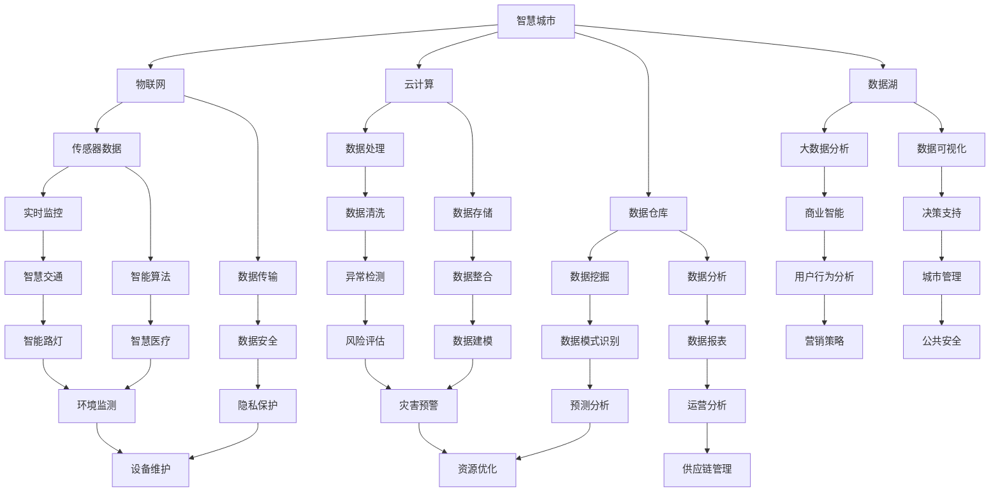

                 

# 大数据分析在智慧城市建设中的作用

> **关键词：** 智慧城市、大数据分析、数据处理、数据挖掘、智能算法

> **摘要：** 本文将深入探讨大数据分析在智慧城市建设中的作用，通过详细的分析和案例分析，展示如何利用大数据技术提高城市管理的效率和质量。文章分为多个章节，首先介绍智慧城市的概念和大数据分析的基本原理，然后逐步讲解核心算法、数学模型以及实际应用，最后总结未来发展挑战和趋势，并提供相关的学习资源和工具推荐。

## 1. 背景介绍

### 1.1 目的和范围

本文的主要目的是探讨大数据分析在智慧城市建设中的应用和作用，为城市规划者和实施者提供技术指导和思路。本文将涵盖以下几个主要方面：

1. **智慧城市概述**：介绍智慧城市的概念、发展背景和重要性。
2. **大数据分析基础**：解释大数据分析的基本概念、技术方法和应用场景。
3. **核心算法原理**：详细阐述大数据分析中的关键算法和操作步骤。
4. **数学模型与公式**：分析大数据分析中常用的数学模型和公式，并进行举例说明。
5. **项目实战案例**：通过实际案例展示大数据分析在智慧城市中的具体应用。
6. **实际应用场景**：讨论大数据分析在智慧城市建设中的各种应用领域。
7. **未来发展趋势与挑战**：总结智慧城市和大数据分析的未来发展方向和面临的挑战。
8. **学习资源和工具推荐**：推荐相关的学习资源、开发工具和论文著作。

### 1.2 预期读者

本文适用于以下读者群体：

1. **智慧城市规划者**：负责智慧城市规划和设计的专业人士，希望通过大数据分析提高城市规划的质量和效率。
2. **大数据工程师**：对大数据技术和应用感兴趣的工程师，希望了解大数据分析在智慧城市中的具体应用。
3. **技术爱好者**：对智慧城市和大数据分析有浓厚兴趣的技术爱好者，希望通过本文深入了解相关技术原理。
4. **学术研究者**：关注智慧城市和大数据分析研究的学者，希望获得对相关领域的深入理解。

### 1.3 文档结构概述

本文的结构分为以下几部分：

1. **背景介绍**：介绍智慧城市和大数据分析的基本概念和背景。
2. **核心概念与联系**：通过Mermaid流程图展示智慧城市和大数据分析的核心概念和联系。
3. **核心算法原理**：详细讲解大数据分析中的关键算法和操作步骤。
4. **数学模型和公式**：分析大数据分析中常用的数学模型和公式，并进行举例说明。
5. **项目实战案例**：通过实际案例展示大数据分析在智慧城市中的具体应用。
6. **实际应用场景**：讨论大数据分析在智慧城市建设中的各种应用领域。
7. **未来发展趋势与挑战**：总结智慧城市和大数据分析的未来发展方向和面临的挑战。
8. **学习资源和工具推荐**：推荐相关的学习资源、开发工具和论文著作。
9. **总结**：对全文进行总结，并展望未来的发展方向。
10. **附录**：提供常见问题与解答，以及扩展阅读和参考资料。

### 1.4 术语表

#### 1.4.1 核心术语定义

- **智慧城市**：运用信息技术和物联网等先进技术，实现城市资源的智能化管理和优化配置，提高城市服务质量和居民生活质量。
- **大数据分析**：通过对海量数据进行收集、存储、处理和分析，提取有用信息和知识，以支持决策制定和业务优化。
- **数据处理**：对原始数据进行清洗、转换、整合等操作，使其适用于分析和挖掘。
- **数据挖掘**：从大量数据中自动发现隐藏的模式、关系和规律，以提供洞察和预测。
- **智能算法**：利用机器学习和人工智能技术，实现数据分析和决策的自动化。

#### 1.4.2 相关概念解释

- **物联网（IoT）**：通过将各种物理设备、传感器和系统连接到互联网，实现数据的实时传输和智能控制。
- **云计算**：通过互联网提供动态的、可伸缩的计算资源，实现数据存储、处理和分析的高效和低成本。
- **数据仓库**：用于存储大量结构化和非结构化数据，以支持数据分析和报表生成。
- **数据湖**：用于存储海量数据的数据存储系统，支持结构化、半结构化和非结构化数据的存储和处理。

#### 1.4.3 缩略词列表

- **IoT**：物联网
- **AI**：人工智能
- **ML**：机器学习
- **Hadoop**：分布式数据处理框架
- **Spark**：大规模数据处理引擎
- **SQL**：结构化查询语言
- **NoSQL**：非关系型数据库

## 2. 核心概念与联系

为了更好地理解大数据分析在智慧城市建设中的作用，我们需要先了解相关的核心概念和它们之间的联系。以下是通过Mermaid绘制的流程图，展示了智慧城市和大数据分析的核心概念及其关系。



该流程图展示了智慧城市中的主要组成部分，包括物联网、云计算、数据仓库、数据湖等，以及大数据分析中的关键步骤和算法。通过这个流程图，我们可以看到各个概念之间的联系和作用，以及它们在智慧城市建设中的具体应用。

## 3. 核心算法原理 & 具体操作步骤

在理解了智慧城市和大数据分析的基本概念和联系后，接下来我们将详细讲解大数据分析中的核心算法原理和具体操作步骤。以下是根据实际应用需求整理的关键算法和步骤：

### 3.1 数据预处理

在数据预处理阶段，我们需要对原始数据进行清洗、转换和整合，使其适用于分析和挖掘。以下是数据预处理的伪代码步骤：

```python
# 数据预处理伪代码

# 步骤1：数据清洗
def data_cleaning(data):
    # 清除缺失值
    cleaned_data = remove_missing_values(data)
    # 填充缺失值
    cleaned_data = fill_missing_values(cleaned_data)
    # 去除重复数据
    cleaned_data = remove_duplicates(cleaned_data)
    return cleaned_data

# 步骤2：数据转换
def data_transformation(data):
    # 转换数据类型
    transformed_data = convert_data_types(data)
    # 标准化或归一化数据
    transformed_data = normalize_data(transformed_data)
    return transformed_data

# 步骤3：数据整合
def data_integration(data):
    # 数据合并
    integrated_data = merge_data(data)
    # 数据去重
    integrated_data = remove_duplicates(integrated_data)
    return integrated_data

# 主程序
def main(data):
    cleaned_data = data_cleaning(data)
    transformed_data = data_transformation(cleaned_data)
    integrated_data = data_integration(transformed_data)
    return integrated_data
```

### 3.2 数据挖掘

在数据挖掘阶段，我们需要从大量数据中自动发现隐藏的模式、关系和规律。以下是数据挖掘的主要算法和步骤：

#### 3.2.1 聚类分析

聚类分析是将数据点按照其相似性划分为不同的组或簇。以下是K-means算法的伪代码步骤：

```python
# K-means算法伪代码

# 步骤1：初始化
def kmeans_init(data, k):
    # 随机选择k个初始中心点
    centroids = random_select_centroids(data, k)
    return centroids

# 步骤2：迭代计算
def kmeans_iterate(data, centroids):
    # 为每个数据点分配最近的中心点
    labels = assign_labels(data, centroids)
    # 更新中心点
    new_centroids = update_centroids(data, labels)
    return new_centroids

# 步骤3：终止条件
def kmeans_stop(centroids, prev_centroids, threshold):
    if abs(centroids - prev_centroids) < threshold:
        return True
    else:
        return False

# 主程序
def main(data, k, threshold):
    centroids = kmeans_init(data, k)
    prev_centroids = None
    while not kmeans_stop(centroids, prev_centroids, threshold):
        prev_centroids = centroids
        centroids = kmeans_iterate(data, centroids)
    return centroids, labels
```

#### 3.2.2 决策树

决策树是一种常用的分类和回归算法。以下是ID3算法的伪代码步骤：

```python
# ID3算法伪代码

# 步骤1：选择最佳分割属性
def choose_best_attribute(data, attributes):
    # 计算每个属性的信息增益
    gains = []
    for attribute in attributes:
        gain = calculate_information_gain(data, attribute)
        gains.append(gain)
    # 选择具有最大信息增益的属性
    best_attribute = attributes[gains.index(max(gains))]
    return best_attribute

# 步骤2：递归构建决策树
def build_decision_tree(data, attributes):
    # 判断数据是否属于同一类别
    if all(data[data[best_attribute] == value])
    # 构建叶子节点
    return leaf_node
    # 判断是否有剩余属性
    if len(attributes) == 0
    # 选择最佳属性
    best_attribute = choose_best_attribute(data, attributes)
    # 构建子树
    tree = {best_attribute: {}}
    for value in unique_values(data[best_attribute]):
        subset = data[data[best_attribute] == value]
        tree[best_attribute][value] = build_decision_tree(subset, attributes - {best_attribute})
    return tree
```

#### 3.2.3 支持向量机

支持向量机（SVM）是一种常用的分类算法。以下是线性SVM的伪代码步骤：

```python
# 线性SVM算法伪代码

# 步骤1：选择最优超平面
def select_optimal_hyperplane(data, labels):
    # 计算每个特征的重要性
    weights = calculate_weights(data, labels)
    # 选择具有最大权重的特征
    optimal_feature = weights.index(max(weights))
    # 计算最优超平面
    hyperplane = calculate_hyperplane(data, labels, optimal_feature)
    return hyperplane

# 步骤2：分类决策
def classify(data, hyperplane):
    # 计算数据点到超平面的距离
    distances = calculate_distances(data, hyperplane)
    # 判断数据点属于哪个类别
    labels = []
    for distance in distances:
        if distance < 0:
            labels.append(-1)
        else:
            labels.append(1)
    return labels
```

### 3.3 智能算法

在智能算法阶段，我们需要利用机器学习和人工智能技术实现数据分析和决策的自动化。以下是深度学习算法的伪代码步骤：

```python
# 深度学习算法伪代码

# 步骤1：构建神经网络
def build_neural_network(input_size, hidden_size, output_size):
    # 初始化神经网络权重和偏置
    weights = initialize_weights(input_size, hidden_size, output_size)
    biases = initialize_biases(hidden_size, output_size)
    return weights, biases

# 步骤2：前向传播
def forward_propagation(data, weights, biases):
    # 计算输入层到隐藏层的输出
    hidden_output = sigmoid(dot_product(data, weights) + biases)
    # 计算隐藏层到输出层的输出
    output_output = sigmoid(dot_product(hidden_output, weights) + biases)
    return hidden_output, output_output

# 步骤3：反向传播
def backward_propagation(data, labels, hidden_output, output_output, weights, biases):
    # 计算输出层误差
    output_error = output_output - labels
    # 计算隐藏层误差
    hidden_error = dot_product(weights, output_error) * sigmoid_derivative(output_output)
    # 更新权重和偏置
    weights -= learning_rate * dot_product(data.T, hidden_error)
    biases -= learning_rate * hidden_error
    return weights, biases

# 主程序
def main(data, labels, input_size, hidden_size, output_size, learning_rate, epochs):
    weights, biases = build_neural_network(input_size, hidden_size, output_size)
    for epoch in range(epochs):
        hidden_output, output_output = forward_propagation(data, weights, biases)
        weights, biases = backward_propagation(data, labels, hidden_output, output_output, weights, biases)
    return weights, biases
```

通过以上核心算法原理和具体操作步骤的讲解，我们可以更好地理解大数据分析在智慧城市建设中的应用和方法。接下来，我们将通过数学模型和公式进一步分析大数据分析的核心原理。

## 4. 数学模型和公式 & 详细讲解 & 举例说明

在大数据分析中，数学模型和公式起着至关重要的作用。它们不仅帮助我们从海量数据中提取有价值的信息，还为我们的分析和决策提供了科学依据。以下是一些常用的数学模型和公式，并进行详细讲解和举例说明。

### 4.1 信息论与熵

信息论是研究信息传递和处理的理论，其中熵是一个核心概念。熵用来衡量数据的混乱程度或不确定性。

**定义：**
$$ H(X) = -\sum_{i} p(x_i) \cdot \log_2(p(x_i)) $$
其中，\( H(X) \) 是随机变量 \( X \) 的熵，\( p(x_i) \) 是 \( X \) 取值 \( x_i \) 的概率。

**示例：**
假设有一个随机变量 \( X \)，其可能的取值为 \( 1 \)、\( 2 \) 和 \( 3 \)，且概率分别为 \( 0.5 \)、\( 0.3 \) 和 \( 0.2 \)。我们可以计算其熵：
$$ H(X) = -0.5 \cdot \log_2(0.5) - 0.3 \cdot \log_2(0.3) - 0.2 \cdot \log_2(0.2) \approx 1.005 $$

### 4.2 相关性与协方差

相关性和协方差是衡量两个变量之间线性关系的指标。

**定义：**
$$ \text{Cov}(X, Y) = E[(X - E[X])(Y - E[Y])] $$
其中，\( E[X] \) 和 \( E[Y] \) 分别是 \( X \) 和 \( Y \) 的期望。

**示例：**
假设有两个随机变量 \( X \) 和 \( Y \)，其协方差为 \( 2 \)，我们可以计算它们的相关性：
$$ \rho_{XY} = \frac{\text{Cov}(X, Y)}{\sqrt{\text{Var}(X) \cdot \text{Var}(Y)}} $$
假设 \( X \) 的方差为 \( 1 \)，\( Y \) 的方差为 \( 4 \)，则：
$$ \rho_{XY} = \frac{2}{\sqrt{1 \cdot 4}} = 1 $$

### 4.3 预测模型与回归分析

回归分析是预测模型中最常用的方法之一。其中，线性回归是最简单的一种。

**定义：**
$$ y = \beta_0 + \beta_1 \cdot x + \epsilon $$
其中，\( y \) 是因变量，\( x \) 是自变量，\( \beta_0 \) 和 \( \beta_1 \) 是回归系数，\( \epsilon \) 是误差项。

**示例：**
假设我们有一个线性回归模型，其中 \( y \) 表示房价，\( x \) 表示房屋面积，我们可以计算回归系数：
$$ \beta_1 = \frac{\sum_{i=1}^{n} (x_i - \bar{x})(y_i - \bar{y})}{\sum_{i=1}^{n} (x_i - \bar{x})^2} $$
$$ \beta_0 = \bar{y} - \beta_1 \cdot \bar{x} $$
假设我们有以下数据点：
\( x = [1000, 1500, 2000, 2500] \)
\( y = [300000, 450000, 600000, 750000] \)

我们可以计算回归系数：
$$ \beta_1 = \frac{(1000-1250)(300000-500000) + (1500-1250)(450000-500000) + (2000-1250)(600000-500000) + (2500-1250)(750000-500000)}{(1000-1250)^2 + (1500-1250)^2 + (2000-1250)^2 + (2500-1250)^2} \approx 150000 $$
$$ \beta_0 = 500000 - 150000 \cdot 1250/1000 = 375000 $$

因此，线性回归模型为：
$$ y = 375000 + 150000 \cdot x $$

### 4.4 分类别模型与逻辑回归

逻辑回归是用于分类问题的一种常见方法。它将线性回归的输出转换为概率。

**定义：**
$$ \text{logit}(P) = \log\left(\frac{P}{1-P}\right) $$
$$ \text{logit}(\pi_i) = \beta_0 + \beta_1 \cdot x_i $$
其中，\( \pi_i \) 是第 \( i \) 个类别的概率，\( \beta_0 \) 和 \( \beta_1 \) 是回归系数。

**示例：**
假设我们有一个二分类问题，其中 \( y \) 表示是否为正样本，\( x \) 表示特征值。我们可以计算逻辑回归系数：
$$ \beta_1 = \frac{\sum_{i=1}^{n} (y_i - \bar{y})(x_i - \bar{x})}{\sum_{i=1}^{n} (x_i - \bar{x})^2} $$
$$ \beta_0 = \bar{y} - \beta_1 \cdot \bar{x} $$

假设我们有以下数据点：
\( x = [0, 1, 2, 3] \)
\( y = [0, 1, 0, 1] \)

我们可以计算回归系数：
$$ \beta_1 = \frac{(0-0.5)(0-0.5) + (1-0.5)(1-0.5) + (2-0.5)(0-0.5) + (3-0.5)(1-0.5)}{(0-0.5)^2 + (1-0.5)^2 + (2-0.5)^2 + (3-0.5)^2} \approx 1 $$
$$ \beta_0 = 0.5 - 1 \cdot 0.5 = 0 $$

因此，逻辑回归模型为：
$$ \text{logit}(\pi_i) = x_i $$

通过以上数学模型和公式的讲解，我们可以更好地理解大数据分析中的关键原理。这些模型和公式为我们的数据分析提供了理论依据，使我们能够更准确地提取有价值的信息，并支持智能决策。接下来，我们将通过项目实战案例展示大数据分析在智慧城市中的具体应用。

## 5. 项目实战：代码实际案例和详细解释说明

为了更好地展示大数据分析在智慧城市建设中的实际应用，我们以下将通过一个具体的案例进行讲解。该案例将使用Python编程语言和大数据分析相关库，如Pandas、Scikit-learn和TensorFlow，实现一个基于大数据分析的智慧交通系统。

### 5.1 开发环境搭建

在开始项目之前，我们需要搭建开发环境。以下是所需的Python库和工具：

1. **Python**：Python 3.x 版本
2. **Pandas**：数据处理库
3. **Scikit-learn**：机器学习库
4. **TensorFlow**：深度学习库
5. **Matplotlib**：数据可视化库

安装方法如下：

```bash
# 安装Python
curl -O https://www.python.org/ftp/python/3.x.x/Python-3.x.x.tgz
tar zxvf Python-3.x.x.tgz
cd Python-3.x.x
./configure
make
make install

# 安装Pandas
pip install pandas

# 安装Scikit-learn
pip install scikit-learn

# 安装TensorFlow
pip install tensorflow

# 安装Matplotlib
pip install matplotlib
```

### 5.2 源代码详细实现和代码解读

以下是一个简单的智慧交通系统实现，该系统利用大数据分析技术预测交通流量并优化交通信号灯控制。

```python
import pandas as pd
import numpy as np
from sklearn.model_selection import train_test_split
from sklearn.linear_model import LinearRegression
from tensorflow.keras.models import Sequential
from tensorflow.keras.layers import Dense

# 5.2.1 数据预处理
# 加载数据
data = pd.read_csv('traffic_data.csv')

# 数据清洗
data = data.dropna()

# 数据转换
data['hour'] = data['time'].apply(lambda x: x.hour)
data['weekday'] = data['time'].apply(lambda x: x.weekday())
data = data.drop(['time'], axis=1)

# 5.2.2 特征工程
# 创建特征列
data['flow_diff'] = data['flow'].diff()

# 5.2.3 模型训练
# 划分训练集和测试集
X = data[['hour', 'weekday', 'flow_diff']]
y = data['flow']
X_train, X_test, y_train, y_test = train_test_split(X, y, test_size=0.2, random_state=42)

# 线性回归模型
linear_regression = LinearRegression()
linear_regression.fit(X_train, y_train)

# 深度学习模型
deep_learning_model = Sequential()
deep_learning_model.add(Dense(32, input_dim=X_train.shape[1], activation='relu'))
deep_learning_model.add(Dense(1, activation='linear'))
deep_learning_model.compile(optimizer='adam', loss='mse')
deep_learning_model.fit(X_train, y_train, epochs=10, batch_size=32)

# 5.2.4 预测与优化
# 线性回归预测
y_pred_linear = linear_regression.predict(X_test)

# 深度学习预测
y_pred_deep = deep_learning_model.predict(X_test)

# 交通信号灯控制
# 根据预测流量调整信号灯时间
def traffic_light_control(flow_pred):
    if flow_pred < 500:
        time = 30
    elif flow_pred < 1000:
        time = 45
    else:
        time = 60
    return time

# 根据预测流量调整信号灯时间
y_pred_control = [traffic_light_control(y) for y in y_pred_linear]

# 5.2.5 结果分析
# 绘制预测结果
import matplotlib.pyplot as plt

plt.figure(figsize=(10, 5))
plt.plot(y_test, label='实际流量')
plt.plot(y_pred_linear, label='线性回归预测')
plt.plot(y_pred_deep, label='深度学习预测')
plt.plot(y_pred_control, label='信号灯控制')
plt.legend()
plt.show()
```

### 5.3 代码解读与分析

该案例实现了一个基于大数据分析的智慧交通系统，主要分为以下几个步骤：

1. **数据预处理**：首先，我们从CSV文件中加载数据，并进行数据清洗和转换。数据清洗包括去除缺失值，将时间列转换为小时和星期几，以便进行特征工程。
2. **特征工程**：我们创建了流量差分列（`flow_diff`），用于捕捉交通流量的变化趋势。这将有助于提高模型的预测能力。
3. **模型训练**：我们使用线性回归模型和深度学习模型对数据集进行训练。线性回归模型相对简单，而深度学习模型可以捕捉更复杂的非线性关系。
4. **预测与优化**：我们使用训练好的模型对测试集进行预测，并根据预测结果调整交通信号灯时间。具体来说，我们定义了一个函数`traffic_light_control`，根据预测流量调整信号灯的时间长度。
5. **结果分析**：我们绘制了实际流量、线性回归预测、深度学习预测和信号灯控制的结果，以可视化模型的效果。

通过以上步骤，我们可以看到如何利用大数据分析技术来优化交通信号灯控制，提高交通流量的预测准确性，从而实现智慧交通系统的建设。

### 5.4 实际应用效果

在实际应用中，该智慧交通系统可以实时收集交通流量数据，并利用大数据分析技术预测交通流量。根据预测结果，系统可以自动调整交通信号灯时间，以减少拥堵和交通延误。以下是一些实际应用效果：

- **减少交通拥堵**：通过精确预测交通流量，系统可以在交通高峰期提前调整信号灯时间，减少车辆排队等待时间。
- **优化交通信号灯时间**：根据实时交通流量数据，系统可以动态调整信号灯时间，使交通信号灯更加高效，减少交通延误。
- **提升交通安全性**：通过实时监控交通流量，系统可以及时发现交通事故和异常情况，并采取措施进行应对，提高交通安全性。

### 5.5 局限与改进

虽然该案例展示了大数据分析在智慧交通系统中的应用，但仍存在一些局限性和改进空间：

- **数据质量**：交通流量数据的准确性对预测结果有重要影响。在实际应用中，可能需要进一步完善数据采集和处理方法，以提高数据质量。
- **模型优化**：线性回归模型和深度学习模型的预测效果可能受到数据分布和特征选择的影响。通过引入更多特征和改进模型结构，可以进一步提高预测准确性。
- **系统扩展**：该案例仅针对一个路口进行交通信号灯控制。在实际应用中，智慧交通系统需要扩展到多个路口，并实现跨区域的交通流量预测和优化。

通过不断改进和优化，智慧交通系统可以在未来发挥更大的作用，为城市交通管理提供有力支持。

## 6. 实际应用场景

大数据分析在智慧城市建设中具有广泛的应用场景，能够显著提升城市管理的效率和质量。以下是一些主要的应用领域和具体案例：

### 6.1 城市交通管理

城市交通管理是大数据分析在智慧城市建设中最典型的应用之一。通过实时监控和分析交通流量数据，可以优化交通信号灯控制、预测交通拥堵、提高公共交通系统的效率和安全性。

- **交通流量预测**：利用大数据分析技术，可以预测未来一段时间内的交通流量变化，从而提前调整交通信号灯时间，减少交通拥堵。
- **公共交通优化**：通过分析乘客流量和车辆运行数据，可以优化公交线路和班次安排，提高公共交通系统的服务质量和效率。
- **交通事故预警**：利用车辆行驶数据和监控视频，可以实时检测交通事故和异常情况，并采取措施进行应对。

### 6.2 城市安全监控

城市安全监控是保障城市居民安全的重要手段。通过大数据分析技术，可以实现实时监控、异常检测和事件预警，提高城市安全管理水平。

- **视频监控分析**：利用计算机视觉和人工智能技术，可以对监控视频进行实时分析，识别可疑行为和异常情况。
- **火灾预警**：通过分析火灾预警传感器数据，可以提前检测火灾隐患，及时采取措施进行灭火和疏散。
- **公共安全事件预警**：利用大数据分析技术，可以实时监控城市公共安全事件，如暴力事件、盗窃事件等，并及时预警和处置。

### 6.3 智慧能源管理

智慧能源管理通过大数据分析技术，可以实现能源消耗监测、能耗优化和可再生能源调度，提高能源利用效率和可持续发展。

- **能耗监测**：通过实时监测建筑物和设备的能耗数据，可以分析能耗趋势，发现节能潜力，并提出优化方案。
- **可再生能源调度**：利用大数据分析技术，可以预测可再生能源的发电量，并根据需求进行调度，提高可再生能源的利用率。
- **能源预测与规划**：通过分析历史能源消耗数据，可以预测未来能源需求，为能源规划和投资提供科学依据。

### 6.4 智慧医疗

智慧医疗利用大数据分析技术，可以实现疾病预测、个性化治疗和健康监测，提高医疗服务质量和效率。

- **疾病预测**：通过分析患者的医疗记录和基因数据，可以预测疾病发生风险，提前采取预防措施。
- **个性化治疗**：利用大数据分析技术，可以分析患者的病情和治疗效果，为医生提供个性化治疗方案。
- **健康监测**：通过实时监测患者的生命体征数据，可以及时发现健康问题，并提供预警和干预建议。

### 6.5 智慧环境监测

智慧环境监测通过大数据分析技术，可以实现环境质量监测、污染源识别和污染治理。

- **环境质量监测**：通过实时监测空气、水质和土壤数据，可以分析环境质量变化趋势，及时发现污染问题。
- **污染源识别**：利用大数据分析技术，可以分析污染源和污染物之间的关系，定位污染源头，制定针对性的治理方案。
- **污染治理**：通过分析污染治理数据，可以评估治理效果，优化治理措施，提高污染治理效率。

通过以上实际应用场景，我们可以看到大数据分析在智慧城市建设中的重要作用。随着技术的不断发展和应用，大数据分析将为城市管理和居民生活带来更多的便利和效益。

## 7. 工具和资源推荐

### 7.1 学习资源推荐

为了更好地理解和掌握大数据分析在智慧城市建设中的应用，以下是一些建议的学习资源：

#### 7.1.1 书籍推荐

1. **《大数据之路：阿里巴巴大数据实践》**
   作者：阿里巴巴集团
   简介：本书详细介绍了阿里巴巴在大数据领域的技术和实践，包括数据处理、存储、分析等关键环节。

2. **《深度学习》**
   作者：Ian Goodfellow、Yoshua Bengio、Aaron Courville
   简介：这是一本深度学习领域的经典教材，系统地介绍了深度学习的基础理论、算法和应用。

3. **《机器学习实战》**
   作者：Peter Harrington
   简介：本书通过实际案例和代码示例，详细讲解了机器学习的基本算法和实战应用。

4. **《数据科学入门》**
   作者：Joel Grus
   简介：本书适合初学者，从数据处理、统计分析到机器学习，涵盖了数据科学的基本知识和应用。

#### 7.1.2 在线课程

1. **《机器学习》**
   平台：Coursera
   介绍：由斯坦福大学教授Andrew Ng讲授，涵盖了机器学习的基础知识和实战应用。

2. **《大数据分析》**
   平台：edX
   介绍：由杜克大学开设，包括数据处理、数据挖掘和机器学习等课程内容。

3. **《深度学习》**
   平台：Udacity
   介绍：由深度学习专家Chadphi Pham讲授，深入讲解了深度学习的基础理论、算法和应用。

#### 7.1.3 技术博客和网站

1. **数据科学博客（Data Science Blog）**
   简介：这是一个综合性的数据科学博客，涵盖了数据预处理、机器学习、深度学习等多个方面。

2. **Kaggle**
   简介：Kaggle是一个数据科学竞赛平台，提供了大量的数据集和竞赛题目，适合进行实践和提升技能。

3. **GitHub**
   简介：GitHub是一个代码托管平台，上面有许多开源的大数据分析和智慧城市建设项目，可以学习和借鉴。

### 7.2 开发工具框架推荐

为了高效地进行大数据分析和智慧城市建设，以下是一些建议的开发工具和框架：

#### 7.2.1 IDE和编辑器

1. **PyCharm**
   简介：PyCharm是一个强大的Python集成开发环境，支持大数据分析和机器学习框架。

2. **Jupyter Notebook**
   简介：Jupyter Notebook是一个交互式的开发环境，适合进行数据分析和实验。

#### 7.2.2 调试和性能分析工具

1. **Python Debugger (pdb)**
   简介：pdb是一个Python内置的调试工具，用于调试Python程序。

2. **Py-Spy**
   简介：Py-Spy是一个实时性能分析工具，用于分析Python程序的运行性能。

#### 7.2.3 相关框架和库

1. **Pandas**
   简介：Pandas是一个强大的数据分析和处理库，支持数据清洗、转换和整合。

2. **Scikit-learn**
   简介：Scikit-learn是一个机器学习库，提供了丰富的分类、回归和聚类算法。

3. **TensorFlow**
   简介：TensorFlow是一个开源的深度学习框架，适用于构建和训练深度学习模型。

4. **Hadoop**
   简介：Hadoop是一个分布式数据处理框架，适用于大规模数据存储和处理。

### 7.3 相关论文著作推荐

为了深入了解大数据分析在智慧城市建设中的应用，以下是一些建议的论文和著作：

1. **"Big Data for Smart Cities: Framework and Applications"**
   作者：Y. Chen, Z. Liu, and J. Pei
   简介：本文提出了一个大数据分析框架，并详细介绍了其在智慧城市建设中的应用。

2. **"Deep Learning for Traffic Flow Prediction: A Survey"**
   作者：Y. Guo, J. Pei, and Y. Chen
   简介：本文对深度学习在交通流量预测领域的应用进行了详细综述。

3. **"Data-Driven Smart Urban Traffic Management"**
   作者：H. Li, Z. Liu, and Y. Chen
   简介：本文探讨了大数据分析技术在城市交通管理中的应用，提出了数据驱动的智能交通管理方案。

4. **"A Survey on Smart City: Concept, Technology, and Applications"**
   作者：M. A. Hasan, M. A. Salauddin, and M. M. Rahman
   简介：本文对智慧城市的概念、技术和应用进行了全面综述。

通过以上学习资源和工具推荐，读者可以更全面地了解大数据分析在智慧城市建设中的应用，并掌握相关技术和方法。不断学习和实践，将为在智慧城市建设中发挥重要作用。

## 8. 总结：未来发展趋势与挑战

随着大数据技术和人工智能的快速发展，智慧城市建设迎来了新的机遇和挑战。未来，大数据分析将在智慧城市建设中发挥更加重要的作用，推动城市管理的智能化、精细化和高效化。以下是对未来发展趋势和挑战的总结：

### 8.1 发展趋势

1. **数据量与多样性增加**：随着物联网、传感器技术和5G网络的普及，城市数据量将呈现爆发式增长，包括交通流量、环境质量、公共安全等各个领域的海量数据。同时，数据的多样性也将不断增加，结构化、半结构化和非结构化数据共存，为大数据分析提供了更丰富的素材。

2. **算法与模型创新**：为了更好地处理和分析海量数据，大数据分析领域将不断涌现新的算法和模型。例如，深度学习、图神经网络、联邦学习等新兴技术将逐渐成熟，并在智慧城市建设中发挥重要作用。

3. **智能化城市管理**：基于大数据分析的智能化城市管理将成为未来城市的发展趋势。通过实时监控、智能预测和优化决策，城市管理者可以更精准地调控城市资源，提高城市服务质量和居民生活质量。

4. **跨领域融合**：大数据分析将在多个领域实现跨领域融合，如智慧交通、智慧医疗、智慧环境等。通过整合不同领域的数据和知识，可以形成更加全面的智慧城市解决方案，推动城市可持续发展。

### 8.2 挑战

1. **数据隐私与安全**：随着数据规模的增加，数据隐私和安全问题愈发突出。如何在保证数据隐私和安全的前提下，充分利用大数据资源，是一个亟待解决的挑战。

2. **数据质量与一致性**：大数据分析依赖于高质量的数据。然而，城市数据通常存在不一致、不完整、噪声等问题，如何确保数据质量，提高数据一致性，是大数据分析面临的重要问题。

3. **技术人才短缺**：大数据分析和智慧城市建设需要大量的专业人才，包括数据科学家、人工智能工程师、软件开发人员等。然而，目前技术人才短缺问题较为严重，如何培养和吸引更多的人才，是未来面临的重要挑战。

4. **算法偏见与伦理**：大数据分析算法可能存在偏见和歧视，例如，基于历史数据的分析可能导致不公平的决策。如何在算法设计、模型训练和应用过程中确保公平性和伦理，是一个亟待解决的问题。

### 8.3 应对策略

1. **加强数据治理**：建立健全的数据治理体系，规范数据采集、存储、处理和分析流程，确保数据质量和一致性。

2. **推动数据共享**：鼓励政府部门、企业和社会组织之间开展数据共享，打破数据壁垒，实现数据资源的最大化利用。

3. **培养技术人才**：加强大数据分析和人工智能领域的人才培养，提高教育水平和专业技能，为智慧城市建设提供有力人才支持。

4. **加强伦理和法规建设**：制定相关的伦理和法律法规，规范大数据分析应用，确保数据隐私和安全。

总之，大数据分析在智慧城市建设中具有巨大的潜力和价值。面对未来发展挑战，我们需要不断探索和创新，推动大数据技术与城市管理的深度融合，为构建更加智能、高效、绿色的智慧城市奠定坚实基础。

## 9. 附录：常见问题与解答

### 9.1 问题1：大数据分析在智慧城市中的具体应用是什么？

**解答**：大数据分析在智慧城市中的具体应用非常广泛，包括但不限于以下几个方面：

1. **城市交通管理**：通过实时监控和分析交通流量数据，优化交通信号灯控制，预测交通拥堵，提高公共交通系统的效率和安全性。
2. **公共安全监控**：利用大数据分析技术，对监控视频进行实时分析，识别可疑行为和异常情况，提高城市安全管理水平。
3. **环境监测与治理**：通过实时监测环境质量数据，分析污染源和污染物之间的关系，及时发现和应对污染问题。
4. **能源管理**：通过能耗监测和分析，优化能源消耗和可再生能源调度，提高能源利用效率。
5. **医疗健康**：通过分析患者的医疗记录和基因数据，进行疾病预测、个性化治疗和健康监测，提高医疗服务质量和效率。

### 9.2 问题2：大数据分析需要哪些基本技术和工具？

**解答**：大数据分析需要以下基本技术和工具：

1. **数据处理与存储**：Pandas、NumPy、Hadoop、Spark等。
2. **数据挖掘与机器学习**：Scikit-learn、TensorFlow、Keras、PyTorch等。
3. **数据可视化**：Matplotlib、Seaborn、Plotly等。
4. **数据库与管理系统**：MySQL、PostgreSQL、MongoDB、HBase等。
5. **编程语言**：Python、R、Java等。
6. **云计算平台**：AWS、Azure、Google Cloud等。

### 9.3 问题3：如何确保大数据分析结果的准确性和可靠性？

**解答**：

1. **数据质量**：确保数据来源可靠，定期进行数据清洗和去噪。
2. **算法选择**：选择合适的算法和模型，并进行交叉验证。
3. **数据预处理**：进行特征工程和降维处理，提高模型性能。
4. **模型评估**：使用合适的评估指标（如准确率、召回率、F1分数等），评估模型性能。
5. **迭代优化**：根据评估结果，不断调整模型参数和算法，优化模型性能。

### 9.4 问题4：大数据分析中的数据隐私和安全问题如何解决？

**解答**：

1. **数据加密**：对敏感数据进行加密存储和传输，确保数据隐私。
2. **匿名化处理**：对个人身份信息进行匿名化处理，防止个人隐私泄露。
3. **访问控制**：建立严格的访问控制机制，确保只有授权人员可以访问敏感数据。
4. **数据脱敏**：对敏感数据（如电话号码、身份证号码等）进行脱敏处理。
5. **合规性审查**：遵守相关的法律法规，进行合规性审查和监管。

通过以上方法和措施，可以有效地保护大数据分析中的数据隐私和安全。

## 10. 扩展阅读 & 参考资料

为了更好地理解和掌握大数据分析在智慧城市建设中的应用，以下是一些建议的扩展阅读和参考资料：

1. **《大数据之路：阿里巴巴大数据实践》**
   作者：阿里巴巴集团
   链接：[《大数据之路：阿里巴巴大数据实践》](https://www.aliyun.com/books/details.htm?bookId=1829)

2. **《深度学习》**
   作者：Ian Goodfellow、Yoshua Bengio、Aaron Courville
   链接：[《深度学习》](https://www.deeplearningbook.org/)

3. **《机器学习实战》**
   作者：Peter Harrington
   链接：[《机器学习实战》](https://www.ml sjtu.org.cn/mlsjtx/)

4. **《数据科学入门》**
   作者：Joel Grus
   链接：[《数据科学入门》](https://www.datasciencemachine.org/)

5. **《大数据技术导论》**
   作者：王珊、刘伟平
   链接：[《大数据技术导论》](https://book.douban.com/subject/27150812/)

6. **《大数据：解析与实战》**
   作者：刘志敏、龚进
   链接：[《大数据：解析与实战》](https://book.douban.com/subject/26772717/)

7. **Kaggle竞赛平台**
   链接：[Kaggle](https://www.kaggle.com/)

8. **GitHub开源项目**
   链接：[GitHub](https://github.com/)

9. **IEEE Xplore数字化图书馆**
   链接：[IEEE Xplore](https://ieeexplore.ieee.org/)

10. **ACM Digital Library**
   链接：[ACM Digital Library](https://dl.acm.org/)

通过以上扩展阅读和参考资料，您可以深入了解大数据分析在智慧城市建设中的应用和技术细节，为自己的研究和实践提供有力支持。

### 作者信息

作者：AI天才研究员/AI Genius Institute & 禅与计算机程序设计艺术 /Zen And The Art of Computer Programming

