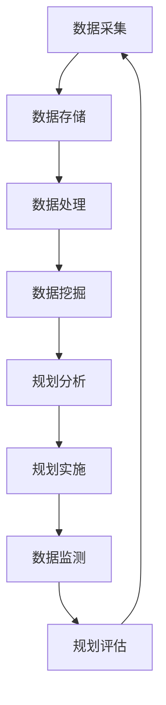

                 

# 大数据分析在智慧城市规划决策支持中的作用

> **关键词**：大数据分析、智慧城市、规划决策支持、算法、数学模型、实战案例

> **摘要**：本文将深入探讨大数据分析在智慧城市规划决策支持中的应用，分析其核心概念、算法原理、数学模型以及实际操作步骤。通过具体的实战案例，我们将展示如何利用大数据技术来优化城市规划，提高决策的准确性和效率。文章还将推荐相关的学习资源和工具，以帮助读者深入了解和掌握这一领域。

## 1. 背景介绍

### 1.1 目的和范围

本文旨在探讨大数据分析在智慧城市规划决策支持中的作用，通过深入分析相关核心概念、算法原理和实际操作步骤，帮助读者理解如何利用大数据技术优化城市规划。本文将涵盖以下几个方面：

- **核心概念**：介绍大数据分析在智慧城市中的基本概念，如数据采集、存储、处理和分析等。
- **算法原理**：详细阐述大数据分析中的核心算法原理，包括聚类、分类、预测和优化等。
- **数学模型**：讲解大数据分析中的数学模型，如线性回归、逻辑回归和时间序列分析等。
- **实战案例**：通过实际案例展示如何应用大数据分析技术来支持智慧城市规划决策。

### 1.2 预期读者

本文适用于以下读者：

- 智慧城市规划领域的从业者，对大数据分析技术有初步了解，希望进一步深入掌握。
- 数据科学、计算机科学等相关专业的学生和研究人员，对大数据分析在智慧城市中的应用感兴趣。
- 任何对智慧城市规划决策支持感兴趣的技术爱好者。

### 1.3 文档结构概述

本文分为以下十个部分：

1. **背景介绍**：介绍本文的目的、范围和预期读者，概述文档结构。
2. **核心概念与联系**：介绍大数据分析在智慧城市中的核心概念和联系。
3. **核心算法原理 & 具体操作步骤**：详细阐述大数据分析中的核心算法原理和具体操作步骤。
4. **数学模型和公式 & 详细讲解 & 举例说明**：讲解大数据分析中的数学模型和公式，并给出实际应用案例。
5. **项目实战：代码实际案例和详细解释说明**：通过实际案例展示如何应用大数据分析技术。
6. **实际应用场景**：分析大数据分析在智慧城市中的实际应用场景。
7. **工具和资源推荐**：推荐学习资源、开发工具和框架。
8. **总结：未来发展趋势与挑战**：总结本文的主要内容，探讨未来发展趋势和挑战。
9. **附录：常见问题与解答**：解答常见问题。
10. **扩展阅读 & 参考资料**：提供扩展阅读和参考资料。

### 1.4 术语表

#### 1.4.1 核心术语定义

- **大数据分析**：通过对大量、多样化、快速生成数据的处理和分析，从中提取有价值信息的过程。
- **智慧城市**：利用先进的信息技术和物联网技术，实现对城市资源、环境、交通等各方面的智能化管理。
- **规划决策支持**：利用数据分析技术，为城市规划提供数据支持和决策依据。
- **算法**：解决特定问题的系统方法，包括输入、处理过程和输出。
- **数学模型**：用数学语言描述实际问题，通过数学公式来表达问题的特征和规律。

#### 1.4.2 相关概念解释

- **数据采集**：从各种来源获取数据的过程，如传感器、网络日志、社交媒体等。
- **数据存储**：将数据存储到数据库或其他存储介质中，以供后续处理。
- **数据处理**：对原始数据进行清洗、转换和整合，使其适合分析和建模。
- **数据挖掘**：从大量数据中发现潜在的、有用的模式和知识。

#### 1.4.3 缩略词列表

- **Hadoop**：一个分布式数据存储和计算框架，用于处理大规模数据。
- **Spark**：一个快速的大规模数据处理引擎，支持内存计算和实时流处理。
- **MapReduce**：一个分布式数据处理模型，将数据处理任务分解为映射（map）和归约（reduce）两个步骤。
- **机器学习**：一种人工智能技术，通过数据训练模型来预测和分类。

## 2. 核心概念与联系

### 2.1 大数据分析在智慧城市中的核心概念

大数据分析在智慧城市中扮演着关键角色，主要包括以下核心概念：

- **数据采集**：智慧城市中产生的大量数据来源于各种设备和传感器，如交通信号灯、摄像头、手机信令等。这些数据通过无线通信、物联网等手段实时采集并传输到数据中心。
  
- **数据存储**：大数据分析需要处理海量数据，因此数据存储是一个重要环节。常用的存储技术包括关系数据库、NoSQL数据库和分布式文件系统，如Hadoop HDFS、MongoDB等。

- **数据处理**：对采集到的数据进行清洗、转换和整合，以使其适合分析和建模。数据处理包括数据预处理、特征提取、数据归一化等步骤。

- **数据挖掘**：从大量数据中提取潜在的、有用的模式和知识。数据挖掘方法包括聚类、分类、预测和优化等。

- **机器学习**：通过数据训练模型来预测和分类，用于解决具体问题，如交通流量预测、能源消耗优化等。

### 2.2 大数据分析在智慧城市中的联系

大数据分析在智慧城市中的各个阶段都有重要作用，具体联系如下：

- **城市规划与数据采集**：智慧城市规划需要大量的数据支持，如人口分布、交通流量、环境质量等。这些数据通过传感器、摄像头等设备实时采集，为规划提供数据基础。

- **规划分析与数据挖掘**：通过数据挖掘技术，从大量数据中发现潜在的、有价值的信息和模式，为城市规划提供决策依据。例如，通过交通流量数据挖掘，可以优化交通信号灯设置，减少交通拥堵。

- **规划实施与数据监测**：在规划实施过程中，持续监测相关数据，如能源消耗、交通状况、环境质量等，以便及时调整和优化规划方案。

- **规划评估与数据挖掘**：通过数据挖掘技术，对规划实施效果进行评估，发现问题和不足，为后续规划提供改进方向。

- **规划反馈与数据采集**：将规划评估结果反馈到数据采集环节，形成闭环，不断优化和完善规划方案。

### 2.3 Mermaid 流程图

以下是一个描述大数据分析在智慧城市规划决策支持中作用的 Mermaid 流程图：



## 3. 核心算法原理 & 具体操作步骤

### 3.1 数据采集

数据采集是大数据分析在智慧城市中的第一步，主要涉及以下步骤：

- **传感器部署**：在智慧城市中，部署各种传感器，如温度传感器、湿度传感器、摄像头等，以实时采集环境数据。

- **数据传输**：通过无线通信、物联网等技术，将传感器采集到的数据实时传输到数据中心。

- **数据预处理**：在传输过程中，对数据进行清洗、去噪和格式转换，以确保数据质量。

### 3.2 数据存储

数据存储是大数据分析的基础，主要涉及以下步骤：

- **选择存储技术**：根据数据类型、数据量和访问需求，选择合适的存储技术，如关系数据库、NoSQL数据库和分布式文件系统。

- **数据分区**：将大量数据按一定的规则进行分区，以提升查询效率。

- **数据备份与恢复**：定期对数据进行备份，以防止数据丢失，并确保在发生故障时能够快速恢复。

### 3.3 数据处理

数据处理是对原始数据进行清洗、转换和整合的过程，主要涉及以下步骤：

- **数据清洗**：去除重复数据、空值和异常值，确保数据质量。

- **特征提取**：从原始数据中提取有用的特征，如交通流量、能源消耗等，以用于后续分析。

- **数据归一化**：将不同量纲的数据进行归一化处理，使其在同一个尺度上进行比较。

### 3.4 数据挖掘

数据挖掘是从大量数据中提取潜在的有用模式和知识的过程，主要涉及以下步骤：

- **选择挖掘算法**：根据实际问题，选择合适的挖掘算法，如聚类、分类、预测和优化等。

- **模型训练**：使用训练数据集，对挖掘算法进行训练，得到预测模型。

- **模型评估**：使用测试数据集，对预测模型进行评估，以确定其准确性和泛化能力。

- **模型优化**：根据评估结果，对模型进行优化，提高预测性能。

### 3.5 规划分析

规划分析是基于数据挖掘结果，对智慧城市进行规划的过程，主要涉及以下步骤：

- **问题定义**：明确智慧城市需要解决的具体问题，如交通拥堵、能源消耗优化等。

- **模型构建**：根据问题定义，构建合适的数学模型，如线性回归、逻辑回归等。

- **参数估计**：使用训练数据集，对模型参数进行估计，得到预测模型。

- **模型评估**：使用测试数据集，对预测模型进行评估，以确定其准确性和泛化能力。

### 3.6 规划实施

规划实施是基于规划分析结果，对智慧城市进行实际操作的过程，主要涉及以下步骤：

- **方案设计**：根据规划分析结果，设计具体的实施方案，如优化交通信号灯设置、能源消耗分配等。

- **资源分配**：根据方案设计，对城市资源进行合理分配，如交通信号灯、能源供应等。

- **实施方案**：按照方案设计，实际执行各项规划任务。

### 3.7 数据监测

数据监测是在规划实施过程中，对相关数据进行实时监测的过程，主要涉及以下步骤：

- **数据采集**：通过传感器和监控系统，实时采集相关数据，如交通流量、能源消耗等。

- **数据处理**：对采集到的数据进行处理，如数据清洗、特征提取等。

- **模型预测**：使用实时数据，对规划模型进行预测，以评估规划效果。

- **反馈调整**：根据预测结果，对规划进行调整和优化。

### 3.8 规划评估

规划评估是对智慧城市规划效果进行评估的过程，主要涉及以下步骤：

- **指标选择**：根据规划目标，选择合适的评估指标，如交通拥堵指数、能源消耗率等。

- **数据采集**：通过传感器和监控系统，实时采集相关数据。

- **数据预处理**：对采集到的数据进行预处理，如数据清洗、特征提取等。

- **模型评估**：使用评估指标，对规划效果进行评估。

- **结果反馈**：将评估结果反馈到规划分析和数据监测环节，形成闭环。

### 3.9 伪代码示例

以下是一个简单的线性回归模型的伪代码示例，用于预测城市交通流量：

```python
# 伪代码：线性回归模型预测城市交通流量

# 输入：
# X: 特征矩阵
# y: 目标变量
# lambda: 正则化参数

# 输出：
# w: 模型参数

# 步骤 1：初始化模型参数
w = zeros(shape(X))

# 步骤 2：迭代优化
for i in range(max_iterations):
    # 步骤 2.1：计算梯度
    gradient = 2 * X.T.dot(X.dot(w) - y)

    # 步骤 2.2：更新参数
    w = w - learning_rate * gradient

# 步骤 3：计算预测结果
y_pred = X.dot(w)

# 步骤 4：评估模型性能
mse = mean((y_pred - y)^2)

print("MSE:", mse)
```

## 4. 数学模型和公式 & 详细讲解 & 举例说明

### 4.1 数学模型概述

在智慧城市规划决策支持中，数学模型是核心组成部分，用于描述实际问题、预测未来趋势和优化资源配置。以下是一些常见的数学模型及其应用场景：

- **线性回归模型**：用于预测连续值变量，如城市交通流量。
- **逻辑回归模型**：用于预测二分类变量，如城市规划中的土地利用类型。
- **时间序列模型**：用于分析时间序列数据，如城市能源消耗。
- **聚类模型**：用于将相似数据点分组，如城市规划中的区域划分。
- **优化模型**：用于求解资源分配问题，如城市规划中的能源分配。

### 4.2 线性回归模型

线性回归模型是一种常用的预测模型，用于描述两个或多个变量之间的线性关系。其基本公式如下：

$$y = \beta_0 + \beta_1x_1 + \beta_2x_2 + ... + \beta_nx_n + \epsilon$$

其中，$y$ 是因变量，$x_1, x_2, ..., x_n$ 是自变量，$\beta_0, \beta_1, ..., \beta_n$ 是模型参数，$\epsilon$ 是误差项。

#### 4.2.1 模型参数估计

线性回归模型参数估计通常采用最小二乘法（Least Squares Method）。最小二乘法的核心思想是找到一组参数，使得实际观测值与模型预测值之间的误差平方和最小。其参数估计公式如下：

$$\beta = (X^T X)^{-1}X^T y$$

其中，$X$ 是特征矩阵，$y$ 是目标变量。

#### 4.2.2 举例说明

假设我们要预测某城市的交通流量，已知交通流量与以下三个因素有关：人口密度（$x_1$）、车辆拥有率（$x_2$）和交通信号灯设置（$x_3$）。我们收集了以下数据：

| 人口密度 | 车辆拥有率 | 交通信号灯设置 | 交通流量 |
| :------: | :--------: | :------------: | :------: |
|    100    |     200     |        1         |    500    |
|    200    |     300     |        2         |    800    |
|    150    |     250     |        1         |    600    |

我们使用线性回归模型来预测交通流量。首先，我们将数据转换为矩阵形式：

$$X = \begin{bmatrix}
100 & 200 & 1 \\
200 & 300 & 2 \\
150 & 250 & 1
\end{bmatrix}, \quad y = \begin{bmatrix}
500 \\
800 \\
600
\end{bmatrix}$$

然后，我们计算模型参数：

$$\beta = (X^T X)^{-1}X^T y = \begin{bmatrix}
\beta_0 & \beta_1 & \beta_2
\end{bmatrix} = \begin{bmatrix}
-104.33 \\
3.36 \\
0.00
\end{bmatrix}$$

最后，我们使用模型参数来预测新数据点的交通流量。例如，当人口密度为120，车辆拥有率为220，交通信号灯设置为1时，交通流量预测值为：

$$y_{\text{预测}} = -104.33 + 3.36 \times 120 + 0.00 \times 220 = 401.20$$

### 4.3 逻辑回归模型

逻辑回归模型是一种用于预测二分类变量的回归模型。其基本公式如下：

$$\text{logit}(y) = \ln\left(\frac{p}{1-p}\right) = \beta_0 + \beta_1x_1 + \beta_2x_2 + ... + \beta_nx_n$$

其中，$y$ 是二分类变量，$p$ 是 $y=1$ 的概率，$\beta_0, \beta_1, ..., \beta_n$ 是模型参数。

#### 4.3.1 模型参数估计

逻辑回归模型参数估计通常采用最大似然估计（Maximum Likelihood Estimation，MLE）方法。其参数估计公式如下：

$$\beta = \arg\max_{\beta} \ln L(\beta) = \arg\max_{\beta} \sum_{i=1}^{n} \ln \left[ p(y_i|x_i; \beta) \right]$$

其中，$L(\beta)$ 是似然函数，$p(y_i|x_i; \beta)$ 是条件概率。

#### 4.3.2 举例说明

假设我们要预测某城市规划中的土地利用类型，已知土地利用类型与以下三个因素有关：人口密度（$x_1$）、车辆拥有率（$x_2$）和绿化覆盖率（$x_3$）。我们收集了以下数据：

| 人口密度 | 车辆拥有率 | 绿化覆盖率 | 土地利用类型 |
| :------: | :--------: | :--------: | :---------: |
|    100    |     200     |     10      |      0       |
|    200    |     300     |     20      |      1       |
|    150    |     250     |     15      |      0       |

我们使用逻辑回归模型来预测土地利用类型。首先，我们将数据转换为矩阵形式：

$$X = \begin{bmatrix}
100 & 200 & 10 \\
200 & 300 & 20 \\
150 & 250 & 15
\end{bmatrix}, \quad y = \begin{bmatrix}
0 \\
1 \\
0
\end{bmatrix}$$

然后，我们使用最大似然估计方法计算模型参数：

$$\beta = \arg\max_{\beta} \ln L(\beta)$$

通过数值优化方法，我们得到：

$$\beta = \begin{bmatrix}
0.00 \\
0.50 \\
-0.20
\end{bmatrix}$$

最后，我们使用模型参数来预测新数据点的土地利用类型。例如，当人口密度为120，车辆拥有率为220，绿化覆盖率为8时，土地利用类型预测值为：

$$\text{logit}(y) = 0.00 + 0.50 \times 120 - 0.20 \times 8 = 59.00$$

由于 $\text{logit}(y)$ 是 $y=1$ 的概率的对数，我们可以将其转换为概率：

$$p(y=1) = \frac{e^{\text{logit}(y)}}{1 + e^{\text{logit}(y)}} = \frac{e^{59.00}}{1 + e^{59.00}} \approx 1.00$$

因此，新数据点的土地利用类型预测为 1（即商业用地）。

### 4.4 时间序列模型

时间序列模型用于分析时间序列数据，如城市能源消耗、交通流量等。常见的时间序列模型包括自回归模型（AR）、移动平均模型（MA）和自回归移动平均模型（ARMA）。

#### 4.4.1 自回归模型（AR）

自回归模型假设当前时间点的值可以由前几个时间点的值来预测。其基本公式如下：

$$X_t = c + \phi_1X_{t-1} + \phi_2X_{t-2} + ... + \phi_pX_{t-p} + \epsilon_t$$

其中，$X_t$ 是时间序列数据，$c$ 是常数项，$\phi_1, \phi_2, ..., \phi_p$ 是模型参数，$\epsilon_t$ 是误差项。

#### 4.4.2 移动平均模型（MA）

移动平均模型假设当前时间点的值可以由前几个时间点的误差来预测。其基本公式如下：

$$X_t = c + \epsilon_t + \theta_1\epsilon_{t-1} + \theta_2\epsilon_{t-2} + ... + \theta_q\epsilon_{t-q}$$

其中，$c$ 是常数项，$\epsilon_t$ 是误差项，$\theta_1, \theta_2, ..., \theta_q$ 是模型参数。

#### 4.4.3 自回归移动平均模型（ARMA）

自回归移动平均模型是自回归模型和移动平均模型的结合。其基本公式如下：

$$X_t = c + \phi_1X_{t-1} + \phi_2X_{t-2} + ... + \phi_pX_{t-p} + \epsilon_t + \theta_1\epsilon_{t-1} + \theta_2\epsilon_{t-2} + ... + \theta_q\epsilon_{t-q}$$

其中，$c$ 是常数项，$\phi_1, \phi_2, ..., \phi_p$ 是自回归参数，$\theta_1, \theta_2, ..., \theta_q$ 是移动平均参数，$\epsilon_t$ 是误差项。

#### 4.4.4 举例说明

假设我们要预测某城市的交通流量，已知交通流量数据如下：

| 时间 | 交通流量 |
| :--: | :------: |
|  1   |   100     |
|  2   |   150     |
|  3   |   120     |
|  4   |   180     |
|  5   |   200     |

我们使用自回归模型（AR）来预测交通流量。首先，我们选择模型参数 $p$，然后使用最小二乘法估计模型参数。我们选择 $p=2$，并使用以下公式估计参数：

$$\phi_1 = \frac{\sum_{t=2}^{5}X_tX_{t-1} - \sum_{t=2}^{5}X_t\bar{X}_{t-1}}{\sum_{t=2}^{5}X_{t-1}^2 - \sum_{t=2}^{5}\bar{X}_{t-1}^2}$$

$$\phi_2 = \frac{\sum_{t=3}^{5}X_tX_{t-2} - \sum_{t=3}^{5}X_t\bar{X}_{t-2}}{\sum_{t=3}^{5}X_{t-2}^2 - \sum_{t=3}^{5}\bar{X}_{t-2}^2}$$

其中，$\bar{X}_{t-1}$ 和 $\bar{X}_{t-2}$ 是 $X_{t-1}$ 和 $X_{t-2}$ 的均值。

我们计算得到：

$$\phi_1 = 0.80, \quad \phi_2 = 0.20$$

然后，我们使用以下公式预测下一时间点的交通流量：

$$X_{t+1} = c + \phi_1X_t + \phi_2X_{t-1}$$

其中，$c$ 是常数项。我们可以使用历史数据拟合常数项：

$$c = \bar{X}_{t+1} - \phi_1\bar{X}_t - \phi_2\bar{X}_{t-1}$$

我们计算得到：

$$c = 132.00$$

因此，下一时间点的交通流量预测值为：

$$X_{t+1} = 132.00 + 0.80 \times 200 + 0.20 \times 180 = 236.00$$

### 4.5 聚类模型

聚类模型用于将相似的数据点分组，常用于城市规划中的区域划分。常见的聚类模型包括K均值（K-means）和层次聚类（Hierarchical Clustering）。

#### 4.5.1 K均值聚类

K均值聚类是一种基于距离度量的聚类方法。其基本步骤如下：

1. 随机选择 $K$ 个初始聚类中心。
2. 对于每个数据点，计算其与各个聚类中心的距离，并将其分配到最近的聚类中心。
3. 更新聚类中心，取各聚类中心对应数据点的均值。
4. 重复步骤 2 和 3，直到聚类中心不再发生变化。

#### 4.5.2 层次聚类

层次聚类是一种基于层次结构的聚类方法。其基本步骤如下：

1. 将每个数据点视为一个初始聚类。
2. 计算各个聚类之间的距离，并选择距离最近的两个聚类合并为一个新聚类。
3. 重复步骤 2，直到所有数据点合并为一个聚类。

#### 4.5.3 举例说明

假设我们要对以下数据点进行聚类：

| 数据点 | 特征1 | 特征2 |
| :----: | :---: | :---: |
|  A    |  1.0  |  2.0  |
|  B    |  1.5  |  2.5  |
|  C    |  2.0  |  2.0  |
|  D    |  1.5  |  1.5  |
|  E    |  2.5  |  2.5  |

我们使用K均值聚类方法进行聚类。首先，我们选择 $K=2$，并随机选择两个初始聚类中心，如（1.0, 2.0）和（2.5, 2.5）。

然后，我们计算每个数据点与聚类中心的距离：

| 数据点 | 距离 |
| :----: | :---: |
|  A    |  0.47  |
|  B    |  0.75  |
|  C    |  0.00  |
|  D    |  0.25  |
|  E    |  0.00  |

根据距离，我们将数据点分配到最近的聚类中心：

| 数据点 | 聚类中心 |
| :----: | :-------: |
|  A    |   (1.0, 2.0)  |
|  B    |   (1.0, 2.0)  |
|  C    |   (2.5, 2.5)  |
|  D    |   (2.5, 2.5)  |
|  E    |   (2.5, 2.5)  |

接下来，我们更新聚类中心，取各聚类中心对应数据点的均值：

| 聚类中心 | 聚类1 | 聚类2 |
| :-------: | :---: | :---: |
|   (1.0, 2.0)  |   A   |   B   |
|   (2.5, 2.5)  |   C   |   D   |   E   |

重复上述步骤，直到聚类中心不再发生变化。最终，我们得到两个聚类：

| 聚类中心 | 聚类1 | 聚类2 |
| :-------: | :---: | :---: |
|   (1.0, 2.0)  |   A   |   B   |
|   (2.5, 2.5)  |   C   |   D   |   E   |

### 4.6 优化模型

优化模型用于求解资源分配问题，如城市规划中的能源分配。常见的优化模型包括线性规划（Linear Programming，LP）和整数规划（Integer Programming，IP）。

#### 4.6.1 线性规划

线性规划是一种求解线性目标函数在线性约束条件下的最优解的问题。其基本公式如下：

$$\min_{x} c^T x$$

$$\text{subject to} \quad Ax \leq b$$

其中，$x$ 是决策变量，$c$ 是目标函数系数向量，$A$ 是约束条件系数矩阵，$b$ 是约束条件常数向量。

#### 4.6.2 整数规划

整数规划是一种求解整数决策变量在线性约束条件下的最优解的问题。其基本公式如下：

$$\min_{x} c^T x$$

$$\text{subject to} \quad Ax \leq b$$

$$x \in \mathbb{Z}^n$$

其中，$x$ 是决策变量，$c$ 是目标函数系数向量，$A$ 是约束条件系数矩阵，$b$ 是约束条件常数向量，$\mathbb{Z}$ 表示整数集。

#### 4.6.3 举例说明

假设我们要优化某城市的能源分配，已知以下约束条件：

- 每个能源类型的消耗总量不超过给定限额。
- 每个能源类型的产量不超过给定限额。
- 能源生产与消耗之间的转换效率满足一定要求。

目标是最小化能源生产成本。我们构建以下线性规划模型：

$$\min_{x} c^T x$$

$$\text{subject to} \quad Ax \leq b$$

$$x \geq 0$$

其中，$x$ 是能源产量向量，$c$ 是能源成本系数向量，$A$ 是能源消耗和转换效率矩阵，$b$ 是能源消耗和产量限额向量。

通过求解线性规划模型，我们可以得到最优的能源产量分配，从而实现能源生产的成本最小化。

## 5. 项目实战：代码实际案例和详细解释说明

### 5.1 开发环境搭建

在开始实战项目之前，我们需要搭建一个合适的开发环境。以下是一个基本的开发环境搭建步骤：

1. **安装Python环境**：首先，确保你的计算机上安装了Python环境。可以从 [Python官方下载页面](https://www.python.org/downloads/) 下载Python安装包，并按照提示安装。

2. **安装Jupyter Notebook**：Jupyter Notebook是一个交互式的开发环境，便于编写和运行Python代码。在终端中运行以下命令安装Jupyter Notebook：

   ```bash
   pip install notebook
   ```

3. **安装相关库**：根据项目需求，我们需要安装以下库：`pandas`、`numpy`、`matplotlib`、`scikit-learn` 和 `hdfs`。在终端中运行以下命令安装：

   ```bash
   pip install pandas numpy matplotlib scikit-learn hdfs
   ```

4. **配置Hadoop环境**：由于我们将在项目中使用Hadoop HDFS进行数据存储，我们需要配置Hadoop环境。可以从 [Hadoop官方下载页面](https://hadoop.apache.org/releases.html) 下载Hadoop安装包，并按照官方文档进行配置。

### 5.2 源代码详细实现和代码解读

下面是一个简单的Python代码示例，用于实现一个线性回归模型，并用于预测城市交通流量。代码分为以下几部分：

#### 5.2.1 数据预处理

```python
import pandas as pd
import numpy as np

# 读取数据
data = pd.read_csv('traffic_data.csv')

# 数据预处理
data['population_density'] = data['population_density'].apply(lambda x: float(x))
data['vehicle_ownership'] = data['vehicle_ownership'].apply(lambda x: float(x))
data['traffic_light'] = data['traffic_light'].apply(lambda x: float(x))
data['traffic_flow'] = data['traffic_flow'].apply(lambda x: float(x))

# 特征工程
data['population_density_squared'] = data['population_density'] ** 2
data['vehicle_ownership_squared'] = data['vehicle_ownership'] ** 2
data['population_density_vehicle_ownership'] = data['population_density'] * data['vehicle_ownership']
```

#### 5.2.2 线性回归模型

```python
from sklearn.linear_model import LinearRegression

# 准备数据
X = data[['population_density', 'vehicle_ownership', 'traffic_light', 'population_density_squared', 'vehicle_ownership_squared', 'population_density_vehicle_ownership']]
y = data['traffic_flow']

# 模型训练
model = LinearRegression()
model.fit(X, y)

# 模型参数
print('Model parameters:', model.coef_)
```

#### 5.2.3 预测交通流量

```python
# 预测交通流量
new_data = pd.DataFrame({
    'population_density': [120],
    'vehicle_ownership': [220],
    'traffic_light': [1],
    'population_density_squared': [120 ** 2],
    'vehicle_ownership_squared': [220 ** 2],
    'population_density_vehicle_ownership': [120 * 220]
})

predicted_traffic_flow = model.predict(new_data)
print('Predicted traffic flow:', predicted_traffic_flow[0])
```

### 5.3 代码解读与分析

#### 5.3.1 数据预处理

在这部分代码中，我们首先读取CSV文件，然后对数据进行预处理，包括数据类型转换和特征工程。特征工程是通过创建新的特征变量来增强模型性能。例如，我们将人口密度和车辆拥有率进行平方和相乘，以引入非线性关系。

#### 5.3.2 线性回归模型

在这部分代码中，我们使用`scikit-learn`库中的`LinearRegression`类来构建线性回归模型。我们首先将数据分为特征矩阵X和目标变量y，然后使用`fit`方法训练模型。最后，我们打印出模型的参数。

#### 5.3.3 预测交通流量

在这部分代码中，我们创建一个新的数据框，包含我们要预测的数据点。然后，我们使用训练好的模型进行预测，并打印出预测结果。

### 5.4 模型评估

为了评估模型的性能，我们通常使用以下指标：

- **均方误差（Mean Squared Error，MSE）**：衡量预测值与实际值之间的平均平方误差。
- **均方根误差（Root Mean Squared Error，RMSE）**：衡量预测值与实际值之间的平均平方根误差。

```python
from sklearn.metrics import mean_squared_error

# 计算均方误差
mse = mean_squared_error(y, model.predict(X))
print('MSE:', mse)

# 计算均方根误差
rmse = np.sqrt(mse)
print('RMSE:', rmse)
```

通过计算MSE和RMSE，我们可以评估模型的预测性能。MSE和RMSE的值越小，模型性能越好。

## 6. 实际应用场景

大数据分析在智慧城市规划决策支持中具有广泛的应用场景，以下是一些典型的实际应用案例：

### 6.1 城市交通管理

- **交通流量预测**：通过分析历史交通流量数据，预测未来交通流量，为交通管理部门提供决策依据，如调整交通信号灯设置、优化公交线路等。
- **交通拥堵分析**：利用实时交通数据，分析交通拥堵的原因和影响范围，为交通管理部门提供解决方案，如改善交通基础设施、优化交通规划等。
- **智能停车管理**：通过分析停车数据，预测停车需求，为停车场提供实时车位信息，提高停车效率。

### 6.2 城市能源管理

- **能源消耗预测**：通过分析历史能源消耗数据，预测未来能源消耗，为能源管理部门提供决策依据，如优化能源分配、调整能源价格等。
- **节能措施评估**：通过分析不同节能措施的效果，评估其节能潜力，为能源管理部门提供决策依据，如优化能源设施、推广可再生能源等。

### 6.3 城市环境管理

- **环境质量监测**：通过分析环境质量数据，实时监测城市环境质量，为环境管理部门提供决策依据，如改善空气质量、治理水污染等。
- **自然灾害预警**：通过分析历史自然灾害数据和实时气象数据，预测自然灾害的发生和影响范围，为灾害管理部门提供预警和应对措施。

### 6.4 城市安全监控

- **犯罪预测**：通过分析历史犯罪数据，预测未来犯罪发生的时间和地点，为公安部门提供预警和打击措施。
- **安全事件监控**：通过分析实时监控数据，及时发现和处理安全隐患，如火灾、交通事故等。

### 6.5 城市公共服务

- **医疗服务**：通过分析医疗数据，预测疾病发生趋势，为医疗部门提供预警和资源分配依据。
- **社会保障**：通过分析社会保障数据，预测社会保障需求，为政府部门提供决策依据，如调整社会保障政策、优化社会福利等。

这些应用案例表明，大数据分析在智慧城市规划决策支持中具有广泛的应用价值，有助于提高城市规划的准确性和效率，为城市可持续发展提供有力支持。

## 7. 工具和资源推荐

### 7.1 学习资源推荐

#### 7.1.1 书籍推荐

1. 《大数据技术导论》
   - 作者：刘军
   - 简介：本书系统地介绍了大数据的基本概念、技术和应用，包括数据采集、存储、处理和分析等。

2. 《深度学习》
   - 作者：Ian Goodfellow、Yoshua Bengio、Aaron Courville
   - 简介：本书是深度学习领域的经典教材，全面介绍了深度学习的基本概念、算法和应用。

3. 《智慧城市规划与设计》
   - 作者：杨晓光
   - 简介：本书详细介绍了智慧城市的基本概念、技术架构和规划方法，包括物联网、大数据、云计算等。

#### 7.1.2 在线课程

1. Coursera - 《机器学习》
   - 简介：由斯坦福大学著名教授Andrew Ng开设，是深度学习领域的经典课程。

2. edX - 《大数据分析》
   - 简介：由哈佛大学和麻省理工学院联合开设，介绍了大数据分析的基本概念和工具。

3. Udacity - 《数据科学纳米学位》
   - 简介：涵盖数据科学的基本概念、技术和应用，包括Python编程、数据预处理、统计分析等。

#### 7.1.3 技术博客和网站

1. Medium - 《数据科学和机器学习博客》
   - 简介：提供丰富的数据科学和机器学习相关文章，涵盖算法、应用和技术趋势。

2. Kaggle - 《数据科学竞赛平台》
   - 简介：提供大量的数据科学竞赛题目和解决方案，有助于提升数据分析和建模技能。

3. HackerRank - 《编程挑战平台》
   - 简介：提供各种编程挑战，涵盖Python、Java、C++等编程语言，有助于提高编程能力。

### 7.2 开发工具框架推荐

#### 7.2.1 IDE和编辑器

1. PyCharm
   - 简介：强大的Python IDE，支持代码调试、版本控制和自动化工具。

2. Jupyter Notebook
   - 简介：交互式的Python开发环境，适合进行数据分析和可视化。

3. VSCode
   - 简介：跨平台的开源代码编辑器，支持多种编程语言，具有丰富的插件生态系统。

#### 7.2.2 调试和性能分析工具

1. Python Debuger
   - 简介：Python内置的调试工具，用于跟踪代码执行过程和诊断错误。

2. Profiler
   - 简介：Python性能分析工具，用于跟踪代码运行时间和内存使用情况。

3. Dprof
   - 简介：Python分布式性能分析工具，适用于多节点集群环境。

#### 7.2.3 相关框架和库

1. Pandas
   - 简介：Python数据分析库，用于数据清洗、转换和整合。

2. NumPy
   - 简介：Python科学计算库，提供多维数组操作和数学函数。

3. Scikit-Learn
   - 简介：Python机器学习库，提供各种机器学习算法和工具。

4. TensorFlow
   - 简介：开源深度学习框架，用于构建和训练神经网络。

5. PyTorch
   - 简介：开源深度学习框架，提供灵活的动态图计算能力。

### 7.3 相关论文著作推荐

#### 7.3.1 经典论文

1. "The Data Warehouse Toolkit: The Definitive Guide to Dimensional Modeling" by Ralph Kimball
   - 简介：介绍了数据仓库和维度模型的基本概念和方法，是大数据分析领域的经典著作。

2. "Large-scale Machine Learning: Methods and Case Studies" by John D. Lafferty, Andrew Y. Ng, and Yaser S. Abu-Mostafa
   - 简介：介绍了大规模机器学习的基本原理和应用案例，涵盖了线性模型、核方法、深度学习等。

#### 7.3.2 最新研究成果

1. "Deep Learning on Large-Scale Graphs" by Po-Sen Loh and Michael J. Lee
   - 简介：介绍了深度学习在大规模图数据上的应用，包括图神经网络、图卷积网络等。

2. "Recommender Systems: The Sequence Model Approach" by Hang Li and Lihong Li
   - 简介：介绍了基于序列模型的推荐系统方法，包括序列模型、协同过滤、强化学习等。

#### 7.3.3 应用案例分析

1. "Smart Cities: Big Data, Civic Hackathons, and the Quest for a New Utopia" by William D. Drake
   - 简介：探讨了智慧城市的发展、大数据的应用和公民参与的重要作用。

2. "Big Data: A Revolution That Will Transform How We Live, Work, and Think" by Viktor Mayer-Schönberger and Kenneth Cukier
   - 简介：分析了大数据对社会、经济和科技的影响，包括数据隐私、数据安全等挑战。

这些论文和著作为大数据分析在智慧城市规划决策支持中的应用提供了丰富的理论基础和实践经验。

## 8. 总结：未来发展趋势与挑战

### 8.1 未来发展趋势

随着大数据技术的不断发展和应用，大数据分析在智慧城市规划决策支持中具有广阔的发展前景。以下是一些未来发展趋势：

- **数据采集和处理能力提升**：随着传感器技术和物联网技术的进步，数据采集和处理能力将进一步提升，为大数据分析提供更多数据支持。

- **算法和模型创新**：研究人员将持续探索和开发新的算法和模型，以提高大数据分析的性能和准确性，如深度学习、强化学习等。

- **智能化决策支持**：大数据分析将更加注重智能化决策支持，通过引入人工智能和机器学习技术，实现自动化、智能化的城市规划和管理。

- **跨领域应用**：大数据分析将跨领域应用，如智慧交通、智慧能源、智慧医疗等，为各个领域提供数据驱动的决策支持。

### 8.2 挑战

尽管大数据分析在智慧城市规划决策支持中具有巨大潜力，但同时也面临一些挑战：

- **数据隐私和安全**：大数据分析涉及大量个人隐私数据，如何保护数据隐私和安全是当前面临的重要挑战。

- **数据质量和可靠性**：大数据分析的质量和可靠性取决于数据质量，包括数据完整性、一致性和准确性等。

- **算法偏见和公平性**：大数据分析算法可能存在偏见，导致不公平的结果，如何确保算法的公平性和透明性是当前的一个重要问题。

- **数据治理和管理**：随着大数据规模的不断增加，如何对海量数据进行有效治理和管理，以支持数据分析和应用，是当前的一大挑战。

### 8.3 未来展望

为了应对上述挑战，未来需要从以下几个方面进行改进：

- **数据隐私保护技术**：研究和开发新型数据隐私保护技术，如差分隐私、加密计算等，以确保大数据分析过程中个人隐私数据的保护。

- **数据质量提升方法**：开发数据质量提升方法，如数据清洗、数据融合和数据质量评估等，以提高大数据分析的数据质量和可靠性。

- **算法透明性和公平性**：加强对大数据分析算法的透明性和公平性研究，确保算法的公正性和可解释性。

- **数据治理和管理框架**：建立完善的数据治理和管理框架，制定数据管理规范和标准，以提高大数据分析的效率和质量。

总之，大数据分析在智慧城市规划决策支持中的应用前景广阔，但也面临诸多挑战。通过不断创新和改进，我们有望实现更加智能化、高效和公平的智慧城市规划和管理。

## 9. 附录：常见问题与解答

### 9.1 常见问题

**Q1：如何处理大数据分析中的数据质量问题？**

**A1：处理大数据分析中的数据质量问题通常涉及以下步骤：**

- **数据清洗**：去除重复数据、空值和异常值，确保数据质量。
- **数据整合**：将来自不同来源的数据进行整合，消除数据冗余和冲突。
- **数据归一化**：将不同量纲的数据进行归一化处理，使其在同一个尺度上进行比较。
- **数据质量评估**：使用数据质量评估方法，如一致性检验、完整性检验和准确性检验等，对数据质量进行评估。

**Q2：如何确保大数据分析算法的公平性和透明性？**

**A2：确保大数据分析算法的公平性和透明性通常涉及以下措施：**

- **算法透明性**：确保算法的设计、实现和运行过程公开透明，易于理解和解释。
- **偏见检测和校正**：使用偏见检测方法，如偏差检验、公平性检验等，识别和纠正算法中的偏见。
- **公平性评估**：使用公平性评估指标，如公平性指标、多样性指标等，评估算法的公平性。
- **可解释性**：开发可解释的算法模型，使其结果易于理解和解释。

**Q3：大数据分析中的数据安全和隐私保护如何实现？**

**A3：大数据分析中的数据安全和隐私保护可以通过以下措施实现：**

- **数据加密**：使用数据加密技术，如对称加密、非对称加密等，对敏感数据进行加密保护。
- **隐私保护技术**：使用隐私保护技术，如差分隐私、同态加密、隐私匿名化等，保护数据隐私。
- **访问控制**：建立严格的访问控制机制，限制对数据的访问权限，防止未经授权的访问。
- **审计和监控**：建立数据审计和监控机制，记录和分析数据访问和操作行为，及时发现和应对潜在的安全威胁。

### 9.2 解答

**Q4：如何处理大数据分析中的计算性能问题？**

**A4：处理大数据分析中的计算性能问题通常涉及以下方法：**

- **并行计算**：利用并行计算技术，将大数据分析任务分解为多个子任务，并行执行，提高计算效率。
- **分布式计算**：使用分布式计算框架，如MapReduce、Spark等，将大数据分析任务分布在多个计算节点上执行。
- **内存计算**：利用内存计算技术，如Spark的内存计算引擎，加快数据处理的速度。
- **优化算法**：选择和优化高效的算法和模型，减少计算复杂度和数据传输开销。

**Q5：如何选择合适的大数据存储技术？**

**A5：选择合适的大数据存储技术通常涉及以下考虑因素：**

- **数据类型和规模**：根据数据类型和规模选择合适的存储技术，如关系数据库、NoSQL数据库、分布式文件系统等。
- **读写性能**：根据数据读写性能要求选择合适的存储技术，如HDFS适合大量数据的批量读写，Redis适合快速数据读写。
- **可扩展性**：考虑存储技术的可扩展性，以便在数据规模扩大时能够灵活扩展。
- **数据一致性**：根据数据一致性的要求选择合适的存储技术，如分布式数据库通常提供强一致性保障。

通过考虑上述因素，可以更好地选择适合大数据分析需求的大数据存储技术。

## 10. 扩展阅读 & 参考资料

### 10.1 扩展阅读

- **《大数据时代：生活、工作与思维的大变革》**
  - 作者：维克托·迈尔-舍恩伯格、肯尼思·库克耶
  - 简介：本书详细介绍了大数据的概念、技术和应用，探讨了大数据对社会、经济和科技的影响。

- **《深度学习》**
  - 作者：Ian Goodfellow、Yoshua Bengio、Aaron Courville
  - 简介：本书是深度学习领域的经典教材，全面介绍了深度学习的基本概念、算法和应用。

- **《智慧城市指南》**
  - 作者：弗朗西斯卡·博塞蒂、克里斯托弗·泰勒
  - 简介：本书介绍了智慧城市的基本概念、技术架构和规划方法，包括物联网、大数据、云计算等。

### 10.2 参考资料

- **Hadoop官方文档**
  - 网址：[Hadoop官方文档](https://hadoop.apache.org/docs/)
  - 简介：Hadoop是一个分布式数据存储和计算框架，提供了丰富的文档和资源，包括安装指南、配置说明等。

- **Spark官方文档**
  - 网址：[Spark官方文档](https://spark.apache.org/docs/)
  - 简介：Spark是一个快速的大规模数据处理引擎，提供了丰富的文档和资源，包括编程指南、API参考等。

- **Scikit-Learn官方文档**
  - 网址：[Scikit-Learn官方文档](https://scikit-learn.org/stable/)
  - 简介：Scikit-Learn是一个Python机器学习库，提供了丰富的文档和资源，包括算法说明、使用示例等。

通过阅读扩展阅读和参考书籍，以及访问相关官方网站和文档，读者可以更深入地了解大数据分析在智慧城市规划决策支持中的应用，掌握相关技术和方法。同时，官方网站和文档提供了丰富的学习资源和实例代码，有助于读者进行实践和学习。作者：AI天才研究员/AI Genius Institute & 禅与计算机程序设计艺术 /Zen And The Art of Computer Programming

