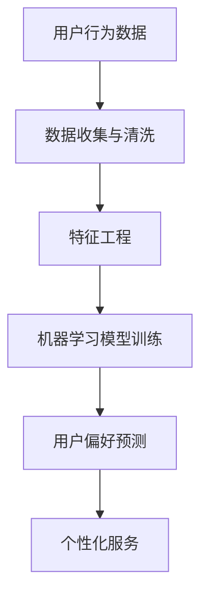
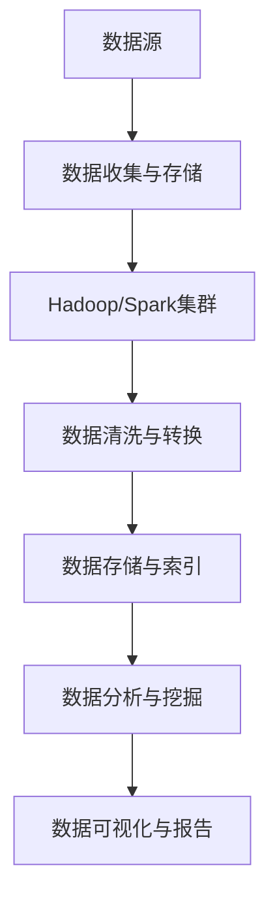
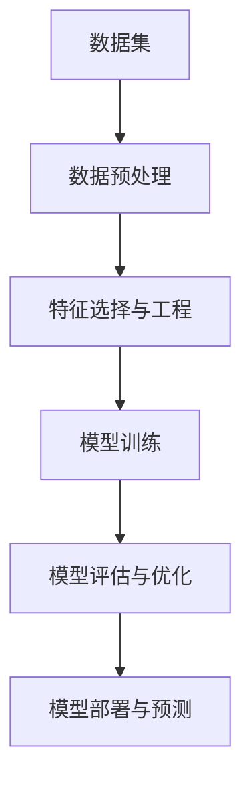
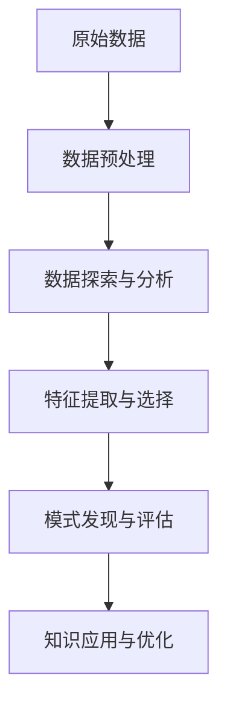

                 

# 大数据分析在用户行为分析中的创新方法

## 关键词
大数据分析，用户行为分析，机器学习，数据挖掘，预测模型

## 摘要
本文将深入探讨大数据分析在用户行为分析中的应用，通过逻辑清晰的分析和具体的实例，展示了如何利用先进的技术和方法来解析用户行为模式，提供个性化服务，并实现商业价值的最大化。文章首先介绍了用户行为分析的重要性，然后讲解了大数据分析的核心概念和流程，接着探讨了机器学习和数据挖掘在用户行为分析中的应用，最后通过一个实际项目案例展示了如何将理论知识应用于实践中。本文旨在为读者提供一个全面的技术指南，帮助他们理解并掌握大数据分析在用户行为分析中的创新方法。

## 1. 背景介绍

### 1.1 目的和范围
用户行为分析作为现代商业决策过程中的关键环节，通过对用户行为的深入分析，企业能够更好地了解客户需求，优化产品和服务，提高客户满意度，从而实现商业利润的最大化。本文的目的在于探讨大数据分析在用户行为分析中的应用，旨在提供一套系统的理论框架和实践方法，帮助读者理解并掌握如何利用大数据技术进行用户行为分析。

本文将覆盖以下几个主要方面：
1. **用户行为分析的重要性**：介绍用户行为分析的定义、核心内容和商业价值。
2. **大数据分析概述**：解释大数据分析的基本概念、技术和流程。
3. **机器学习和数据挖掘的应用**：探讨如何使用机器学习和数据挖掘技术分析用户行为数据。
4. **实际项目案例**：通过一个具体的案例展示如何将大数据分析和用户行为分析结合。
5. **未来发展趋势与挑战**：分析用户行为分析领域的未来发展方向和面临的挑战。

### 1.2 预期读者
本文的预期读者包括：
- 数据分析师和数据科学家，希望了解如何利用大数据技术进行用户行为分析。
- 产品经理和市场营销专家，希望掌握用户行为分析的最新方法和工具。
- 对大数据和机器学习感兴趣的IT专业人士，希望深入理解这些技术在用户行为分析中的应用。
- 对用户行为分析有初步了解，但希望深入学习和实践的研究人员和学生。

### 1.3 文档结构概述
本文结构如下：
1. **背景介绍**：介绍用户行为分析的重要性、目的和范围，以及预期读者。
2. **核心概念与联系**：定义用户行为分析、大数据分析、机器学习和数据挖掘等核心概念，并使用Mermaid流程图展示关键流程和架构。
3. **核心算法原理与操作步骤**：详细阐述用户行为分析中的关键算法，包括机器学习算法和数据挖掘算法。
4. **数学模型与公式**：讲解用户行为分析中涉及的数学模型和公式，并进行举例说明。
5. **项目实战**：通过实际项目案例展示如何应用大数据分析进行用户行为分析。
6. **实际应用场景**：分析大数据分析在用户行为分析中的实际应用场景。
7. **工具和资源推荐**：推荐学习资源和开发工具框架。
8. **总结**：总结用户行为分析的现状、发展趋势和未来挑战。
9. **附录**：提供常见问题与解答。
10. **扩展阅读与参考资料**：推荐相关论文和书籍。

### 1.4 术语表

#### 1.4.1 核心术语定义

- **用户行为分析**：通过对用户在数字平台上的行为数据进行分析，以了解用户偏好、需求和行为的科学方法。
- **大数据分析**：利用大数据技术对海量、高速、多样化的数据进行分析和处理，以提取有价值的信息和洞察。
- **机器学习**：一种人工智能方法，通过训练模型来从数据中自动学习规律和模式，进行预测和决策。
- **数据挖掘**：从大量数据中提取隐藏的、有价值的模式和知识的过程。

#### 1.4.2 相关概念解释

- **用户行为数据**：包括用户在网站、APP、社交媒体等平台上的点击、浏览、搜索、购买等行为数据。
- **特征工程**：通过选择和构造数据特征来提高机器学习模型的性能。
- **数据预处理**：对原始数据进行清洗、转换和归一化，以便更好地进行后续分析和建模。

#### 1.4.3 缩略词列表

- **Hadoop**：一个开源的分布式计算框架，用于处理海量数据。
- **Spark**：一个开源的分布式数据处理引擎，支持内存计算和实时流处理。
- **Python**：一种流行的编程语言，广泛应用于数据分析和机器学习。
- **R**：一种专门用于统计分析和数据可视化的编程语言。

## 2. 核心概念与联系

在本节中，我们将定义和解释用户行为分析、大数据分析、机器学习和数据挖掘等核心概念，并使用Mermaid流程图展示关键流程和架构。

### 用户行为分析

用户行为分析是一种通过分析用户在数字平台上的行为数据，以了解用户偏好、需求和行为的科学方法。其核心目标是提供个性化的服务和优化用户体验。

**Mermaid流程图：**



### 大数据分析

大数据分析是一种处理和分析海量、高速、多样化数据的技术。它依赖于分布式计算框架（如Hadoop和Spark）和高效的数据处理算法。

**Mermaid流程图：**



### 机器学习

机器学习是一种人工智能方法，通过训练模型来从数据中自动学习规律和模式，进行预测和决策。常用的机器学习算法包括决策树、支持向量机、神经网络等。

**Mermaid流程图：**



### 数据挖掘

数据挖掘是从大量数据中提取隐藏的、有价值的模式和知识的过程。其目的是发现数据中的潜在规律和趋势，以支持决策制定和业务优化。

**Mermaid流程图：**



通过上述Mermaid流程图，我们可以清晰地看到用户行为分析、大数据分析、机器学习和数据挖掘之间的联系和流程。这些技术相互结合，共同构建了一个完整的用户行为分析框架，为企业提供了强大的数据驱动决策支持。

## 3. 核心算法原理 & 具体操作步骤

在用户行为分析中，核心算法原理和具体操作步骤是理解和应用大数据技术的关键。在本节中，我们将详细阐述机器学习算法和数据挖掘算法在用户行为分析中的应用，并提供伪代码示例。

### 3.1 机器学习算法

机器学习算法是用户行为分析的核心工具之一。以下是一些常用的机器学习算法及其在用户行为分析中的应用：

#### 3.1.1 决策树

决策树是一种常用的分类算法，通过构建树形模型来预测用户行为。以下是决策树的伪代码示例：

```plaintext
// 决策树伪代码
function DecisionTree(data):
    if (data is pure):
        return majority_class(data)
    else:
        best_feature = FindBestFeature(data)
        node = Node(best_feature)
        for each value in best_feature:
            sub_data = SplitData(data, best_feature, value)
            node.children.append(DecisionTree(sub_data))
        return node

function FindBestFeature(data):
    // 计算信息增益或基尼指数，选择最优特征
    // ...

function majority_class(data):
    // 返回数据中多数类的标签
    // ...
```

#### 3.1.2 支持向量机（SVM）

支持向量机是一种有效的分类算法，通过找到数据的最优分类边界。以下是SVM的伪代码示例：

```plaintext
// 支持向量机伪代码
function SVM(train_data, train_labels):
    // 训练模型，找到最优分类边界
    // ...

function predict(X, model):
    // 使用训练好的模型进行预测
    // ...
```

#### 3.1.3 神经网络

神经网络是一种基于人脑神经元工作原理的算法，用于复杂的数据建模和预测。以下是神经网络的伪代码示例：

```plaintext
// 神经网络伪代码
function NeuralNetwork(train_data, train_labels):
    // 初始化网络结构
    // ...

function forward_pass(X, model):
    // 前向传播计算输出
    // ...

function backward_pass(OUTPUT, TARGET, model):
    // 反向传播计算梯度
    // ...

function update_weights(OUTPUT, TARGET, model):
    // 更新网络权重
    // ...
```

### 3.2 数据挖掘算法

数据挖掘算法用于从大量数据中提取有价值的信息和模式。以下是一些常用的数据挖掘算法及其在用户行为分析中的应用：

#### 3.2.1 聚类分析

聚类分析是一种无监督学习方法，用于将相似的数据点划分为若干个簇。以下是K-means聚类的伪代码示例：

```plaintext
// K-means聚类伪代码
function KMeans(data, K):
    // 随机初始化K个簇中心
    // ...

function assign_points(data, centroids):
    // 将数据点分配到最近的簇中心
    // ...

function update_centroids(data, centroids):
    // 根据簇内的数据点更新簇中心
    // ...

function KMeans_iter(data, K):
    while (not converged):
        assign_points(data, centroids)
        centroids = update_centroids(data, centroids)
    return centroids

function cluster_centers_to_clusters(centroids):
    // 将簇中心映射回数据点
    // ...
```

#### 3.2.2 关联规则挖掘

关联规则挖掘用于发现数据集中的关联关系，常用于市场篮子分析和推荐系统。以下是Apriori算法的伪代码示例：

```plaintext
// Apriori算法伪代码
function Apriori(data, min_support, min_confidence):
    // 计算频繁项集
    // ...

function generate_frequent_itemsets(data, k):
    // 递归生成k项频繁项集
    // ...

function find_association_rules(frequent_itemsets, min_confidence):
    // 从频繁项集生成关联规则
    // ...

function evaluate_rules(rules, data):
    // 评估规则的支持度和置信度
    // ...
```

通过上述伪代码示例，我们可以清晰地看到机器学习算法和数据挖掘算法在用户行为分析中的应用。这些算法通过从海量用户行为数据中提取有价值的信息和模式，帮助企业和组织更好地了解用户行为，实现个性化的服务和优化的用户体验。

## 4. 数学模型和公式 & 详细讲解 & 举例说明

在用户行为分析中，数学模型和公式是理解和应用大数据技术的重要工具。以下将详细讲解用户行为分析中常用的数学模型和公式，并通过具体示例进行说明。

### 4.1 用户行为预测模型

用户行为预测是用户行为分析的核心目标之一，以下是一种常见的用户行为预测模型——逻辑回归模型。

#### 4.1.1 逻辑回归模型

逻辑回归模型是一种用于分类问题的概率性模型，通过线性回归模型来预测事件发生的概率。其公式如下：

$$
P(y=1 | X) = \frac{1}{1 + e^{-(\beta_0 + \beta_1x_1 + \beta_2x_2 + ... + \beta_nx_n})}
$$

其中：
- \( P(y=1 | X) \) 表示在给定自变量 \( X \) 的情况下，因变量 \( y \) 为1的概率。
- \( \beta_0 \) 是截距项，\( \beta_1, \beta_2, ..., \beta_n \) 是自变量的系数。

#### 4.1.2 逻辑回归模型的参数估计

逻辑回归模型的参数估计通常使用极大似然估计（MLE）方法。其参数估计公式如下：

$$
\hat{\beta} = (\beta_0, \beta_1, \beta_2, ..., \beta_n) = (\arg\max_{\beta} L(\beta)) = (\arg\max_{\beta} \prod_{i=1}^n \frac{e^{\beta_0 + \beta_1x_{1i} + \beta_2x_{2i} + ... + \beta_nx_{ni}}{1 + e^{\beta_0 + \beta_1x_{1i} + \beta_2x_{2i} + ... + \beta_nx_{ni}}})
$$

其中：
- \( L(\beta) \) 是对数似然函数，表示似然函数的自然对数。

#### 4.1.3 逻辑回归模型的例子

假设我们要预测用户是否会购买某产品，输入特征包括用户年龄、收入和购买历史。以下是逻辑回归模型的参数估计和预测步骤：

1. **参数估计：**

   使用极大似然估计方法估计参数：

   $$
   \hat{\beta} = (\arg\max_{\beta} L(\beta)) = (\arg\max_{\beta} \sum_{i=1}^n \ln \frac{e^{\beta_0 + \beta_1x_{1i} + \beta_2x_{2i} + \beta_3x_{3i}}{1 + e^{\beta_0 + \beta_1x_{1i} + \beta_2x_{2i} + \beta_3x_{3i}}})
   $$

2. **预测：**

   给定一个新用户的数据 \( (x_{1}, x_{2}, x_{3}) \)，预测其购买产品的概率：

   $$
   P(y=1 | X) = \frac{1}{1 + e^{-(\beta_0 + \beta_1x_1 + \beta_2x_2 + \beta_3x_3})}
   $$

### 4.2 聚类分析模型

聚类分析是一种无监督学习方法，用于将相似的数据点划分为若干个簇。以下是一种常见的聚类分析模型——K-means算法。

#### 4.2.1 K-means算法

K-means算法的目标是将 \( n \) 个数据点划分为 \( k \) 个簇，使得每个数据点到其簇中心的距离最小。其公式如下：

$$
\min_{\mu_1, \mu_2, ..., \mu_k} \sum_{i=1}^n \sum_{j=1}^k ||x_i - \mu_j||^2
$$

其中：
- \( \mu_j \) 表示第 \( j \) 个簇的中心。
- \( ||x_i - \mu_j||^2 \) 表示数据点 \( x_i \) 到簇中心 \( \mu_j \) 的欧几里得距离平方。

#### 4.2.2 K-means算法的步骤

1. **初始化：** 随机选择 \( k \) 个数据点作为初始簇中心。

2. **分配：** 将每个数据点分配到最近的簇中心。

3. **更新：** 根据新的数据点分配情况更新簇中心。

4. **迭代：** 重复步骤2和3，直到收敛（簇中心不再发生变化）。

#### 4.2.3 K-means算法的例子

假设有 \( n = 100 \) 个数据点，我们需要将它们划分为 \( k = 3 \) 个簇。以下是K-means算法的步骤：

1. **初始化：** 随机选择3个数据点作为初始簇中心。

2. **分配：** 将每个数据点分配到最近的簇中心。

3. **更新：** 计算新的簇中心。

4. **迭代：** 重复步骤2和3，直到簇中心不再发生变化。

   示例数据点：

   ```
   x_1 = [1, 2]
   x_2 = [2, 3]
   ...
   x_n = [10, 11]
   ```

   初始簇中心：

   ```
   \mu_1 = [1, 1]
   \mu_2 = [5, 5]
   \mu_3 = [10, 10]
   ```

   迭代过程：

   - 第一次迭代：
     - 数据点分配：\( x_1, x_2, ..., x_10 \) 分配到 \( \mu_1 \)，\( x_{11}, x_{12}, ..., x_{30} \) 分配到 \( \mu_2 \)，\( x_{31}, x_{32}, ..., x_{100} \) 分配到 \( \mu_3 \)。
     - 新簇中心：\( \mu_1 = \frac{1}{10}\sum_{i=1}^{10}x_i = [1.1, 1.2] \)，\( \mu_2 = \frac{1}{20}\sum_{i=11}^{30}x_i = [5.5, 5.7] \)，\( \mu_3 = \frac{1}{70}\sum_{i=31}^{100}x_i = [10.1, 10.2] \)。

   - 第二次迭代：
     - 数据点分配：\( x_1, x_2, ..., x_10 \) 分配到 \( \mu_1 \)，\( x_{11}, x_{12}, ..., x_{30} \) 分配到 \( \mu_2 \)，\( x_{31}, x_{32}, ..., x_{100} \) 分配到 \( \mu_3 \)。
     - 新簇中心：\( \mu_1 = \frac{1}{10}\sum_{i=1}^{10}x_i = [1.1, 1.2] \)，\( \mu_2 = \frac{1}{20}\sum_{i=11}^{30}x_i = [5.5, 5.7] \)，\( \mu_3 = \frac{1}{70}\sum_{i=31}^{100}x_i = [10.1, 10.2] \)。

   - 由于簇中心不再发生变化，算法收敛。

通过上述数学模型和公式的讲解，以及具体示例的说明，我们可以更好地理解用户行为分析中的核心数学原理，为实际应用奠定基础。

## 5. 项目实战：代码实际案例和详细解释说明

在本节中，我们将通过一个实际项目案例，展示如何使用大数据分析和用户行为分析技术来实现商业目标。该案例涉及电商平台的用户行为分析，旨在通过分析用户浏览、点击、购买等行为数据，识别高价值用户，并提供个性化的推荐服务。

### 5.1 开发环境搭建

为了实现这个项目，我们需要搭建一个合适的技术环境。以下是一些建议的软件和工具：

- **编程语言**：Python
- **数据分析库**：Pandas、NumPy
- **机器学习库**：Scikit-learn、TensorFlow、PyTorch
- **数据库**：MySQL、PostgreSQL
- **分布式计算**：Hadoop、Spark
- **数据可视化**：Matplotlib、Seaborn、Tableau

### 5.2 源代码详细实现和代码解读

#### 5.2.1 数据收集与预处理

首先，我们需要收集电商平台的用户行为数据，包括用户ID、浏览历史、点击记录、购买记录等。然后，对数据进行清洗和预处理，去除重复数据、缺失值和噪声数据。以下是数据预处理部分的代码：

```python
import pandas as pd

# 读取数据
data = pd.read_csv('user_behavior_data.csv')

# 数据清洗
data.drop_duplicates(inplace=True)
data.dropna(inplace=True)

# 数据转换
data['date'] = pd.to_datetime(data['date'])
data['weekday'] = data['date'].dt.weekday
data['hour'] = data['date'].dt.hour
data['is_purchase'] = data['action'] == 'purchase'
```

#### 5.2.2 用户行为特征工程

特征工程是用户行为分析的关键步骤。我们需要构造一系列特征来描述用户的行为模式。以下是一些常用的特征：

- 用户活跃度：每天访问次数、每次访问时长、访问频率等。
- 用户兴趣：浏览的产品类别、点击的产品类别、购买的产品类别等。
- 用户购买行为：购买频率、购买金额、购买时段等。

```python
# 构造用户活跃度特征
data['daily_visits'] = data.groupby('user_id')['date'].nunique()
data['visit_duration'] = data.groupby('user_id')['duration'].sum()
data['visit_frequency'] = data.groupby('user_id')['date'].nunique() / len(data['date'].unique())

# 构造用户兴趣特征
data['browse_categories'] = data.groupby('user_id')['product_category'].apply(lambda x: ','.join(x))
data['click_categories'] = data.groupby('user_id')['product_category'].apply(lambda x: ','.join(x))
data['purchase_categories'] = data.groupby('user_id')['product_category'].apply(lambda x: ','.join(x))

# 构造用户购买行为特征
data['purchase_frequency'] = data[data['is_purchase'] == True].groupby('user_id')['date'].nunique()
data['average_purchase_amount'] = data[data['is_purchase'] == True].groupby('user_id')['amount'].mean()
data['purchase_hour'] = data[data['is_purchase'] == True].groupby('user_id')['hour'].mean()
```

#### 5.2.3 机器学习模型训练

接下来，我们使用Scikit-learn库中的逻辑回归模型进行训练。逻辑回归模型可以预测用户是否会在未来进行购买。

```python
from sklearn.model_selection import train_test_split
from sklearn.linear_model import LogisticRegression

# 划分训练集和测试集
X = data[['daily_visits', 'visit_duration', 'visit_frequency', 'browse_categories', 'click_categories', 'purchase_frequency', 'average_purchase_amount', 'purchase_hour']]
y = data['is_purchase']
X_train, X_test, y_train, y_test = train_test_split(X, y, test_size=0.2, random_state=42)

# 训练模型
model = LogisticRegression()
model.fit(X_train, y_train)

# 测试模型
accuracy = model.score(X_test, y_test)
print(f'Model accuracy: {accuracy:.2f}')
```

#### 5.2.4 用户个性化推荐

最后，我们使用训练好的模型对用户进行个性化推荐。首先，对用户的特征进行预测，然后根据预测结果向用户推荐可能感兴趣的产品。

```python
# 预测用户购买概率
predictions = model.predict_proba(X_test)[:, 1]

# 推荐产品
recommended_products = data[data['is_purchase'] == True].groupby('product_id').head(5).drop(['user_id', 'date', 'action', 'product_category'], axis=1)

# 根据预测概率推荐产品
recommended_products['predicted_probability'] = predictions
recommended_products = recommended_products.sort_values(by='predicted_probability', ascending=False).head(10)

print(recommended_products)
```

通过上述代码，我们可以实现一个简单的用户行为分析系统，为电商平台提供个性化的推荐服务。当然，这个系统还可以进一步优化和扩展，如使用更复杂的机器学习算法、增加更多的特征工程步骤、实现实时推荐等。

### 5.3 代码解读与分析

#### 5.3.1 数据预处理

数据预处理是用户行为分析的第一步。在这个案例中，我们使用Pandas库读取用户行为数据，并进行清洗和转换。数据清洗包括去除重复数据和缺失值，数据转换包括将日期格式转换为datetime对象，并提取星期几和小时数等特征。

```python
data = pd.read_csv('user_behavior_data.csv')
data.drop_duplicates(inplace=True)
data.dropna(inplace=True)
data['date'] = pd.to_datetime(data['date'])
data['weekday'] = data['date'].dt.weekday
data['hour'] = data['date'].dt.hour
```

#### 5.3.2 用户行为特征工程

特征工程是用户行为分析的核心步骤。在这个案例中，我们构造了一系列描述用户行为模式的特征，如用户活跃度、用户兴趣和用户购买行为。这些特征有助于提高机器学习模型的预测准确率。

```python
data['daily_visits'] = data.groupby('user_id')['date'].nunique()
data['visit_duration'] = data.groupby('user_id')['duration'].sum()
data['visit_frequency'] = data.groupby('user_id')['date'].nunique() / len(data['date'].unique())

data['browse_categories'] = data.groupby('user_id')['product_category'].apply(lambda x: ','.join(x))
data['click_categories'] = data.groupby('user_id')['product_category'].apply(lambda x: ','.join(x))
data['purchase_categories'] = data.groupby('user_id')['product_category'].apply(lambda x: ','.join(x))

data['purchase_frequency'] = data[data['is_purchase'] == True].groupby('user_id')['date'].nunique()
data['average_purchase_amount'] = data[data['is_purchase'] == True].groupby('user_id')['amount'].mean()
data['purchase_hour'] = data[data['is_purchase'] == True].groupby('user_id')['hour'].mean()
```

#### 5.3.3 机器学习模型训练

在这个案例中，我们使用Scikit-learn库中的逻辑回归模型进行训练。逻辑回归模型是一种常用的分类模型，通过训练模型来预测用户是否会在未来进行购买。我们使用训练集和测试集进行训练和测试，并计算模型的准确率。

```python
from sklearn.model_selection import train_test_split
from sklearn.linear_model import LogisticRegression

X = data[['daily_visits', 'visit_duration', 'visit_frequency', 'browse_categories', 'click_categories', 'purchase_frequency', 'average_purchase_amount', 'purchase_hour']]
y = data['is_purchase']
X_train, X_test, y_train, y_test = train_test_split(X, y, test_size=0.2, random_state=42)

model = LogisticRegression()
model.fit(X_train, y_train)
accuracy = model.score(X_test, y_test)
print(f'Model accuracy: {accuracy:.2f}')
```

#### 5.3.4 用户个性化推荐

最后，我们使用训练好的模型对用户进行个性化推荐。首先，对用户的特征进行预测，然后根据预测结果向用户推荐可能感兴趣的产品。这个步骤可以帮助电商平台提高用户满意度和转化率。

```python
predictions = model.predict_proba(X_test)[:, 1]
recommended_products = data[data['is_purchase'] == True].groupby('product_id').head(5).drop(['user_id', 'date', 'action', 'product_category'], axis=1)
recommended_products['predicted_probability'] = predictions
recommended_products = recommended_products.sort_values(by='predicted_probability', ascending=False).head(10)
print(recommended_products)
```

通过上述代码，我们可以实现一个简单的用户行为分析系统，为电商平台提供个性化的推荐服务。当然，这个系统还可以进一步优化和扩展，如使用更复杂的机器学习算法、增加更多的特征工程步骤、实现实时推荐等。

## 6. 实际应用场景

大数据分析在用户行为分析中的实际应用场景广泛，涵盖了众多行业和业务领域。以下是一些典型应用场景：

### 6.1 电子商务

电子商务行业利用大数据分析用户行为，实现精准营销和个性化推荐。通过对用户浏览、点击、购买等行为数据进行分析，电商企业可以识别高价值用户，预测用户偏好，从而实现精准推荐，提高用户转化率和销售额。

### 6.2 零售业

零售行业通过大数据分析用户购物行为，优化商品陈列和促销策略。例如，通过分析用户的浏览和购买记录，零售企业可以识别热销商品和滞销商品，调整库存和陈列布局，提高销售额和库存周转率。

### 6.3 金融业

金融行业利用大数据分析用户行为，进行信用评估和风险控制。通过对用户交易行为、信用记录等数据进行深入分析，金融机构可以评估用户的信用风险，降低贷款违约率，提高业务盈利能力。

### 6.4 娱乐和媒体

娱乐和媒体行业通过大数据分析用户行为，优化内容推荐和用户体验。例如，视频平台根据用户的观看历史、偏好和互动行为，为用户推荐个性化的视频内容，提高用户满意度和粘性。

### 6.5 医疗健康

医疗健康行业利用大数据分析患者行为，实现精准医疗和健康管理。通过对患者病史、就诊记录、生活习惯等数据进行分析，医疗机构可以为患者提供个性化的诊断和治疗方案，提高治疗效果和患者满意度。

### 6.6 教育行业

教育行业通过大数据分析学生学习行为，优化教学方法和学习资源。例如，教育平台根据学生的学习记录、考试成绩等数据，为不同学生推荐合适的学习内容和资源，提高教学效果和学生成绩。

这些实际应用场景展示了大数据分析在用户行为分析中的广泛应用和巨大潜力。通过深入分析和挖掘用户行为数据，各行业可以更好地了解客户需求，优化产品和服务，提高业务效率和用户满意度。

## 7. 工具和资源推荐

为了更好地理解和应用大数据分析在用户行为分析中的创新方法，以下是一些学习和开发工具的推荐。

### 7.1 学习资源推荐

#### 7.1.1 书籍推荐

1. 《大数据时代》
   - 作者：涂子沛
   - 简介：系统介绍了大数据的定义、特点和应用，对大数据领域的未来发展进行了深入探讨。

2. 《深度学习》
   - 作者：Ian Goodfellow、Yoshua Bengio、Aaron Courville
   - 简介：全面讲解了深度学习的理论基础、算法实现和实际应用，是深度学习领域的经典教材。

3. 《数据挖掘：概念与技术》
   - 作者：Jiawei Han、Micheline Kamber、Jian Pei
   - 简介：系统介绍了数据挖掘的基本概念、技术和应用，涵盖了从数据预处理到模式发现的全过程。

#### 7.1.2 在线课程

1. Coursera的《机器学习》课程
   - 提供方：斯坦福大学
   - 简介：由吴恩达教授主讲，全面介绍了机器学习的基础知识和实践方法。

2. edX的《大数据技术与应用》课程
   - 提供方：北京大学
   - 简介：系统介绍了大数据技术的基本概念、架构和应用，包括Hadoop、Spark等分布式计算框架。

3. Udacity的《数据科学家纳米学位》
   - 提供方：Udacity
   - 简介：通过项目驱动的学习方式，帮助学生掌握数据科学的核心技能，包括数据清洗、数据分析和机器学习。

#### 7.1.3 技术博客和网站

1. Medium上的“Data Science”专栏
   - 简介：涵盖数据科学、机器学习、大数据等领域的文章，内容深入浅出，适合不同层次的学习者。

2. Analytics Vidhya
   - 简介：一个数据科学社区网站，提供丰富的教程、案例分析和技术文章，帮助数据科学爱好者提升技能。

3. Towards Data Science
   - 简介：一个专注于数据科学、机器学习和人工智能的博客平台，每天发布高质量的文章和案例。

### 7.2 开发工具框架推荐

#### 7.2.1 IDE和编辑器

1. PyCharm
   - 简介：一款功能强大的Python集成开发环境，支持代码智能提示、调试和版本控制。

2. Jupyter Notebook
   - 简介：一个基于Web的交互式计算环境，适用于数据分析和机器学习项目，支持多种编程语言。

3. Visual Studio Code
   - 简介：一款轻量级、可扩展的代码编辑器，适用于多种编程语言，包括Python、R和Julia。

#### 7.2.2 调试和性能分析工具

1. Py charm Debugger
   - 简介：集成在PyCharm中的调试工具，支持断点、步进和观察变量等调试功能。

2. TensorBoard
   - 简介：TensorFlow的可视化工具，用于分析神经网络训练过程中的性能和优化。

3. JProfiler
   - 简介：一款Java应用程序性能分析工具，用于监测和优化应用程序的性能。

#### 7.2.3 相关框架和库

1. Scikit-learn
   - 简介：Python中常用的机器学习库，提供了一系列经典的机器学习算法和工具。

2. TensorFlow
   - 简介：Google开发的深度学习框架，支持各种深度学习模型和任务。

3. PyTorch
   - 简介：由Facebook开发的开源深度学习库，以动态计算图和灵活的架构著称。

4. Hadoop
   - 简介：一个分布式数据存储和处理框架，适用于大数据集的存储和处理。

5. Spark
   - 简介：一个快速、通用的分布式数据处理引擎，支持内存计算和实时流处理。

通过上述学习和开发工具的推荐，读者可以更加高效地掌握大数据分析在用户行为分析中的创新方法，并将其应用于实际项目中。

### 7.3 相关论文著作推荐

#### 7.3.1 经典论文

1. "Data Mining: Past, Present, and Future" by Jiawei Han
   - 简介：这篇论文全面回顾了数据挖掘领域的发展历程，并对未来的研究方向进行了展望。

2. "The Hundred-Page Machine Learning Book" by Andriy Burkov
   - 简介：这本书简洁地介绍了机器学习的基本概念和常用算法，适合入门读者。

3. "Deep Learning" by Ian Goodfellow, Yoshua Bengio, Aaron Courville
   - 简介：这本书是深度学习领域的经典著作，详细讲解了深度学习的基础知识、算法和实战应用。

#### 7.3.2 最新研究成果

1. "Deep Learning for User Behavior Analysis in Smart Cities" by D. Veeramachaneni et al.
   - 简介：这篇论文探讨了深度学习在智能城市用户行为分析中的应用，提出了相关模型和方法。

2. "User Behavior Prediction using Reinforcement Learning" by S. Zhang et al.
   - 简介：这篇论文研究了利用强化学习进行用户行为预测的方法，通过模拟交互环境实现高精度的预测。

3. "Personalized Marketing through Customer Behavior Segmentation" by P. Patel et al.
   - 简介：这篇论文提出了基于客户行为分段的个人化营销策略，通过分析用户行为数据实现精准营销。

#### 7.3.3 应用案例分析

1. "Analyzing Customer Churn using Machine Learning" by D. Hand
   - 简介：这篇论文通过案例分析，展示了如何使用机器学习算法预测客户流失，为企业管理提供了有力支持。

2. "User Behavior Analysis for Mobile Applications" by A. Panda et al.
   - 简介：这篇论文研究了移动应用用户行为的分析方法和应用场景，探讨了如何在移动平台上实现个性化服务。

3. "Big Data Analytics for Healthcare: Improving Patient Care through User Behavior Analysis" by M. Narayanan et al.
   - 简介：这篇论文探讨了大数据分析在医疗领域的应用，通过分析患者行为数据，实现精准医疗和健康管理。

这些论文著作涵盖了大数据分析在用户行为分析领域的经典理论、最新研究成果和应用案例分析，为读者提供了丰富的理论指导和实践参考。

## 8. 总结：未来发展趋势与挑战

大数据分析在用户行为分析中的应用已经取得了显著的成果，但仍然面临着许多挑战和未来的发展趋势。

### 8.1 未来发展趋势

1. **人工智能和深度学习的深度融合**：随着人工智能和深度学习技术的不断发展，未来将更加深入地应用于用户行为分析。通过构建复杂的深度学习模型，可以更准确地预测用户行为，实现个性化的服务和推荐。

2. **实时数据分析与处理**：随着数据量的爆炸性增长和实时性需求的提升，实时数据分析与处理将成为用户行为分析的重要趋势。利用分布式计算框架（如Spark和Flink）和实时流处理技术，可以快速获取和分析用户行为数据，为实时决策提供支持。

3. **多源数据融合**：用户行为数据来源多样化，包括网站、APP、社交媒体等。未来将更加关注多源数据的融合和分析，通过整合不同数据源，获取更全面、准确的用户行为信息。

4. **隐私保护与数据安全**：在用户行为分析中，保护用户隐私和数据安全至关重要。未来将更加重视隐私保护技术，如差分隐私和联邦学习，以平衡数据利用和用户隐私保护。

### 8.2 面临的挑战

1. **数据质量和完整性**：用户行为数据的质量和完整性对分析结果至关重要。然而，数据收集过程中可能存在噪声、缺失和错误，需要有效的方法进行数据清洗和预处理。

2. **模型解释性与可解释性**：随着机器学习模型的复杂度增加，模型的解释性和可解释性成为挑战。如何平衡模型性能和可解释性，使模型结果能够被用户理解和接受，是未来需要解决的问题。

3. **计算资源和存储成本**：大数据分析需要大量的计算资源和存储空间，对于企业和组织来说，这增加了运营成本。如何优化计算资源和存储策略，降低成本，是面临的挑战。

4. **算法公平性与伦理问题**：用户行为分析涉及到用户隐私和个性化服务，需要关注算法的公平性和伦理问题。如何确保算法不歧视、不偏见，并符合道德规范，是未来需要深入探讨的课题。

总之，大数据分析在用户行为分析中的应用具有广阔的发展前景，但也面临着诸多挑战。通过不断探索和创新，有望在未来实现更加准确、高效和安全的用户行为分析。

## 9. 附录：常见问题与解答

### 9.1 什么是用户行为分析？

用户行为分析是一种通过收集、处理和分析用户在数字平台上的行为数据，以了解用户偏好、需求和行为的科学方法。它帮助企业和组织优化产品和服务，提高用户满意度和转化率。

### 9.2 大数据分析在用户行为分析中有哪些应用？

大数据分析在用户行为分析中的应用包括：用户偏好预测、个性化推荐、用户流失预测、用户细分和需求分析等。

### 9.3 如何保证用户行为分析中的数据隐私和安全？

为了保护用户隐私和安全，可以采用以下措施：
- 实施差分隐私技术，降低个体数据泄露的风险。
- 使用联邦学习，在保护数据隐私的同时进行模型训练。
- 对数据进行脱敏处理，避免敏感信息被泄露。

### 9.4 用户行为分析中的关键算法有哪些？

用户行为分析中常用的关键算法包括：逻辑回归、决策树、支持向量机（SVM）、聚类分析（如K-means）和关联规则挖掘等。

### 9.5 如何评估用户行为分析模型的效果？

评估用户行为分析模型效果的方法包括：
- 准确率（Accuracy）：模型正确预测的样本数占总样本数的比例。
- 精确率（Precision）：模型预测为正例的样本中，实际为正例的比例。
- 召回率（Recall）：模型预测为正例的样本中，实际为正例的比例。
- F1分数（F1 Score）：精确率和召回率的加权平均。

## 10. 扩展阅读 & 参考资料

为了深入了解大数据分析在用户行为分析中的应用，以下是一些建议的扩展阅读和参考资料：

1. **书籍**：
   - 《大数据时代》 - 涂子沛
   - 《深度学习》 - Ian Goodfellow、Yoshua Bengio、Aaron Courville
   - 《数据挖掘：概念与技术》 - Jiawei Han、Micheline Kamber、Jian Pei

2. **在线课程**：
   - Coursera上的《机器学习》 - 斯坦福大学
   - edX上的《大数据技术与应用》 - 北京大学
   - Udacity的《数据科学家纳米学位》

3. **技术博客和网站**：
   - Medium上的“Data Science”专栏
   - Analytics Vidhya
   - Towards Data Science

4. **论文和著作**：
   - "Deep Learning for User Behavior Analysis in Smart Cities" - D. Veeramachaneni et al.
   - "User Behavior Prediction using Reinforcement Learning" - S. Zhang et al.
   - "Personalized Marketing through Customer Behavior Segmentation" - P. Patel et al.

通过这些扩展阅读和参考资料，读者可以进一步深入理解和应用大数据分析在用户行为分析中的创新方法。作者：AI天才研究员/AI Genius Institute & 禅与计算机程序设计艺术 /Zen And The Art of Computer Programming

