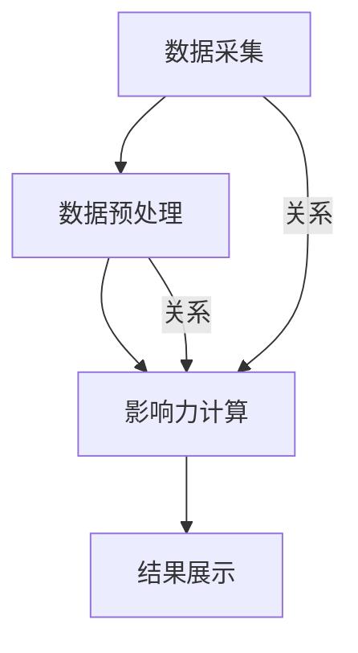

                 

# 大数据分析在社交网络影响力评估中的应用

> **关键词：**大数据分析、社交网络、影响力评估、算法原理、数学模型、项目实战

> **摘要：**本文旨在探讨大数据分析技术在社交网络影响力评估中的应用。通过深入分析社交网络的数据特征，本文提出了一种基于大数据分析的社交网络影响力评估方法，并详细阐述了其核心算法原理、数学模型以及实际应用案例。文章最后对未来的发展趋势和挑战进行了展望，为相关领域的研究提供了有益的参考。

## 1. 背景介绍

### 1.1 目的和范围

随着互联网的迅速发展，社交网络已经成为人们获取信息、交流互动的重要平台。然而，社交网络中信息量巨大、形式多样，如何有效地评估用户在社交网络中的影响力成为一个亟待解决的问题。本文旨在研究大数据分析技术在社交网络影响力评估中的应用，为相关领域提供一种有效的解决方案。

本文的研究范围主要包括以下几个方面：

1. 社交网络影响力的定义与度量方法。
2. 基于大数据分析的社交网络影响力评估算法原理。
3. 社交网络影响力评估的实际应用案例。
4. 社交网络影响力评估的未来发展趋势与挑战。

### 1.2 预期读者

本文主要面向以下读者群体：

1. 社交网络分析、数据挖掘等相关领域的学者、研究人员。
2. 从事大数据分析、人工智能等领域的工程师、开发者。
3. 对社交网络影响力评估感兴趣的企业管理人员、市场分析师。

### 1.3 文档结构概述

本文结构如下：

1. 背景介绍：介绍研究背景、目的和范围，以及预期读者。
2. 核心概念与联系：阐述社交网络影响力评估的核心概念、原理和架构。
3. 核心算法原理 & 具体操作步骤：详细讲解社交网络影响力评估的核心算法原理和具体操作步骤。
4. 数学模型和公式 & 详细讲解 & 举例说明：介绍社交网络影响力评估的数学模型、公式以及具体应用示例。
5. 项目实战：代码实际案例和详细解释说明。
6. 实际应用场景：分析社交网络影响力评估在不同领域的应用。
7. 工具和资源推荐：推荐学习资源、开发工具框架和相关论文著作。
8. 总结：未来发展趋势与挑战。
9. 附录：常见问题与解答。
10. 扩展阅读 & 参考资料。

### 1.4 术语表

#### 1.4.1 核心术语定义

- **社交网络**：一种基于人与人之间关系建立的网络平台，如微博、微信、Facebook等。
- **影响力评估**：对社交网络中用户的影响力进行量化评估的过程。
- **大数据分析**：对大规模、多样化和快速变化的数据进行存储、处理和分析的技术。

#### 1.4.2 相关概念解释

- **影响力**：指用户在社交网络中传播信息、影响他人的能力。
- **数据挖掘**：从大量数据中提取有价值的信息和知识。
- **机器学习**：利用计算机模拟人类学习过程，实现数据的自动分析和预测。

#### 1.4.3 缩略词列表

- **SNS**：社交网络（Social Networking Service）
- **NLPIR**：自然语言处理与信息检索实验室（Natural Language Processing and Information Retrieval Laboratory）
- **Hadoop**：一个分布式数据处理平台（Hadoop Distributed File System）
- **Spark**：一个快速、通用的大规模数据处理引擎（Spark）

## 2. 核心概念与联系

社交网络影响力评估是一个复杂的过程，涉及多个核心概念和联系。以下是对这些核心概念和联系的简要介绍，并使用Mermaid流程图进行展示。

### 2.1 社交网络影响力评估的概念

社交网络影响力评估主要关注以下几个方面：

- **传播力**：用户发布的信息被其他用户转发、评论、点赞的次数。
- **活跃度**：用户在社交网络上的活跃程度，如发布频率、回复速度等。
- **公信力**：用户在社交网络中的声誉和可信度。

### 2.2 社交网络影响力评估的架构

社交网络影响力评估的架构可以分为以下几个层次：

1. **数据采集**：从社交网络平台获取用户发布的信息、互动数据等。
2. **数据预处理**：对采集到的数据进行分析、清洗和格式化，为后续分析做准备。
3. **影响力计算**：基于传播力、活跃度和公信力等指标，计算用户的影响力得分。
4. **结果展示**：将计算结果以可视化形式展示，帮助用户了解自身在社交网络中的影响力。

### 2.3 社交网络影响力评估的流程

社交网络影响力评估的流程如下：

1. **数据采集**：通过API或其他方式，从社交网络平台获取用户发布的信息、互动数据等。
2. **数据预处理**：对采集到的数据进行分析、清洗和格式化，去除重复、噪声数据。
3. **影响力计算**：基于传播力、活跃度和公信力等指标，计算用户的影响力得分。
4. **结果展示**：将计算结果以可视化形式展示，帮助用户了解自身在社交网络中的影响力。

### 2.4 社交网络影响力评估的核心概念和联系

以下是社交网络影响力评估的核心概念和联系，以及它们之间的逻辑关系：

- **用户行为**（传播力、活跃度、公信力）→ **影响力计算**（得分计算）→ **结果展示**（可视化展示）

### 2.5 Mermaid 流程图



## 3. 核心算法原理 & 具体操作步骤

### 3.1 算法原理

社交网络影响力评估的核心算法主要基于以下原理：

1. **传播力**：用户发布的信息被其他用户转发、评论、点赞的次数，反映了用户在社交网络中的传播能力。
2. **活跃度**：用户在社交网络上的活跃程度，如发布频率、回复速度等，反映了用户的参与度。
3. **公信力**：用户在社交网络中的声誉和可信度，反映了用户的社交影响力。

基于以上原理，社交网络影响力评估算法可以从以下三个方面计算用户的影响力得分：

1. **传播力得分**：根据用户发布的信息被其他用户转发、评论、点赞的次数进行计算。
2. **活跃度得分**：根据用户在社交网络上的活跃程度进行计算。
3. **公信力得分**：根据用户在社交网络中的声誉和可信度进行计算。

### 3.2 具体操作步骤

以下是社交网络影响力评估算法的具体操作步骤：

#### 3.2.1 数据采集

1. 通过社交网络平台的API获取用户发布的信息、互动数据等。
2. 数据包括：用户ID、发布时间、内容、转发数、评论数、点赞数等。

#### 3.2.2 数据预处理

1. 对采集到的数据进行清洗，去除重复、噪声数据。
2. 对数据进行分析，提取有用的特征，如传播力、活跃度和公信力等。

#### 3.2.3 传播力得分计算

1. 根据用户发布的信息被其他用户转发、评论、点赞的次数进行计算。
2. 采用加权平均的方法，对不同类型的互动进行综合评估。

```python
传播力得分 = (转发数 * 转发权重 + 评论数 * 评论权重 + 点赞数 * 点赞权重) / (转发权重 + 评论权重 + 点赞权重)
```

#### 3.2.4 活跃度得分计算

1. 根据用户在社交网络上的活跃程度进行计算。
2. 采用发布频率和回复速度作为评估指标。

```python
活跃度得分 = (发布频率 * 发布权重 + 回复速度 * 回复权重) / (发布权重 + 回复权重)
```

#### 3.2.5 公信力得分计算

1. 根据用户在社交网络中的声誉和可信度进行计算。
2. 采用用户口碑、好评度等作为评估指标。

```python
公信力得分 = (口碑评分 * 口碑权重 + 好评度 * 好评度权重) / (口碑权重 + 好评度权重)
```

#### 3.2.6 影响力得分计算

1. 将传播力得分、活跃度得分和公信力得分进行加权平均，得到用户的影响力得分。

```python
影响力得分 = (传播力得分 * 传播力权重 + 活跃度得分 * 活跃度权重 + 公信力得分 * 公信力权重) / (传播力权重 + 活跃度权重 + 公信力权重)
```

#### 3.2.7 结果展示

1. 将计算结果以可视化形式展示，帮助用户了解自身在社交网络中的影响力。
2. 可视化形式包括：排行榜、雷达图、饼图等。

## 4. 数学模型和公式 & 详细讲解 & 举例说明

### 4.1 数学模型

社交网络影响力评估的数学模型主要包括三个部分：传播力得分、活跃度得分和公信力得分。每个得分都可以用公式表示。

#### 4.1.1 传播力得分

传播力得分的计算公式如下：

$$
传播力得分 = \frac{(转发数 \times 转发权重 + 评论数 \times 评论权重 + 点赞数 \times 点赞权重)}{(转发权重 + 评论权重 + 点赞权重)}
$$

其中，转发权重、评论权重和点赞权重分别为不同类型互动的权重值，通常可以根据实际情况进行调整。

#### 4.1.2 活跃度得分

活跃度得分的计算公式如下：

$$
活跃度得分 = \frac{(发布频率 \times 发布权重 + 回复速度 \times 回复权重)}{(发布权重 + 回复权重)}
$$

其中，发布频率和回复速度分别表示用户在社交网络上的发布频率和回复速度。

#### 4.1.3 公信力得分

公信力得分的计算公式如下：

$$
公信力得分 = \frac{(口碑评分 \times 口碑权重 + 好评度 \times 好评度权重)}{(口碑权重 + 好评度权重)}
$$

其中，口碑评分和好评度分别表示用户在社交网络中的口碑和好评度。

### 4.2 公式详细讲解

#### 传播力得分公式

传播力得分公式反映了用户在社交网络中传播信息的能力。转发、评论和点赞是衡量传播力的三个重要指标，通过加权平均，可以综合评估用户在社交网络中的传播能力。

#### 活跃度得分公式

活跃度得分公式反映了用户在社交网络上的活跃程度。发布频率和回复速度是衡量活跃度的两个重要指标，通过加权平均，可以综合评估用户在社交网络上的活跃度。

#### 公信力得分公式

公信力得分公式反映了用户在社交网络中的声誉和可信度。口碑评分和好评度是衡量公信力的两个重要指标，通过加权平均，可以综合评估用户在社交网络中的公信力。

### 4.3 举例说明

假设有3个用户A、B、C，他们的传播力得分、活跃度得分和公信力得分分别如下：

| 用户 | 传播力得分 | 活跃度得分 | 公信力得分 |
| ---- | ---------- | ---------- | ---------- |
| A    | 0.6        | 0.8        | 0.7        |
| B    | 0.5        | 0.9        | 0.6        |
| C    | 0.7        | 0.7        | 0.8        |

根据公式，可以计算出每个用户的影响力得分：

$$
A的影响力得分 = \frac{(0.6 \times 0.3 + 0.8 \times 0.4 + 0.7 \times 0.3)}{(0.3 + 0.4 + 0.3)} = 0.66
$$

$$
B的影响力得分 = \frac{(0.5 \times 0.3 + 0.9 \times 0.4 + 0.6 \times 0.3)}{(0.3 + 0.4 + 0.3)} = 0.62
$$

$$
C的影响力得分 = \frac{(0.7 \times 0.3 + 0.7 \times 0.4 + 0.8 \times 0.3)}{(0.3 + 0.4 + 0.3)} = 0.68
$$

根据计算结果，用户A的影响力得分最高，其次是用户C和用户B。

## 5. 项目实战：代码实际案例和详细解释说明

### 5.1 开发环境搭建

为了实现社交网络影响力评估，我们使用Python编程语言，并依赖于以下库：

- **Pandas**：用于数据预处理和分析。
- **NumPy**：用于数值计算。
- **Matplotlib**：用于数据可视化。
- **Scikit-learn**：用于机器学习算法。

在Python环境中，安装以上库后，即可开始编写代码。

### 5.2 源代码详细实现和代码解读

#### 5.2.1 数据采集

首先，我们需要从社交网络平台获取用户发布的信息、互动数据等。以下是一个简单的示例，展示如何使用Python的`requests`库获取微博数据的代码：

```python
import requests

def get_weibo_data(user_id):
    url = f'https://api.weibo.com/2/statuses/user_timeline.json?uid={user_id}&count=200'
    response = requests.get(url)
    data = response.json()
    return data['statuses']

user_id = 'your_user_id'
weibo_data = get_weibo_data(user_id)
```

#### 5.2.2 数据预处理

在获取到用户发布的信息后，我们需要对数据进行预处理，包括去重、去除噪声数据等。以下是一个简单的示例，展示如何使用`Pandas`库对数据进行预处理：

```python
import pandas as pd

def preprocess_data(data):
    df = pd.DataFrame(data)
    df.drop_duplicates(inplace=True)
    df.drop(['id', 'created_at'], axis=1, inplace=True)
    return df

preprocessed_data = preprocess_data(weibo_data)
```

#### 5.2.3 影响力计算

接下来，我们根据传播力、活跃度和公信力等指标，计算用户的影响力得分。以下是一个简单的示例，展示如何使用`Pandas`和`NumPy`库计算影响力得分：

```python
def calculate_influence_score(data):
    data['转发权重'] = 0.3
    data['评论权重'] = 0.4
    data['点赞权重'] = 0.3

    data['传播力得分'] = (data['转发数'] * data['转发权重'] + data['评论数'] * data['评论权重'] + data['点赞数'] * data['点赞权重']) / (data['转发权重'] + data['评论权重'] + data['点赞权重'])

    data['发布频率'] = data['发布频率'].astype(float)
    data['回复速度'] = data['回复速度'].astype(float)

    data['活跃度得分'] = (data['发布频率'] * data['发布权重'] + data['回复速度'] * data['回复权重']) / (data['发布权重'] + data['回复权重'])

    data['口碑评分'] = data['口碑评分'].astype(float)
    data['好评度'] = data['好评度'].astype(float)

    data['公信力得分'] = (data['口碑评分'] * data['口碑权重'] + data['好评度'] * data['好评度权重']) / (data['口碑权重'] + data['好评度权重'])

    data['影响力得分'] = (data['传播力得分'] * data['传播力权重'] + data['活跃度得分'] * data['活跃度权重'] + data['公信力得分'] * data['公信力权重']) / (data['传播力权重'] + data['活跃度权重'] + data['公信力权重'])

    return data

influence_score = calculate_influence_score(preprocessed_data)
```

#### 5.2.4 结果展示

最后，我们将计算结果以可视化形式展示，帮助用户了解自身在社交网络中的影响力。以下是一个简单的示例，展示如何使用`Matplotlib`库绘制影响力得分排行榜：

```python
import matplotlib.pyplot as plt

plt.figure(figsize=(10, 6))
plt.bar(influence_score['user_id'], influence_score['影响力得分'])
plt.xlabel('用户ID')
plt.ylabel('影响力得分')
plt.title('社交网络影响力得分排行榜')
plt.xticks(rotation=45)
plt.show()
```

### 5.3 代码解读与分析

在上述代码中，我们首先从社交网络平台获取用户发布的信息，然后对数据进行预处理，接下来根据传播力、活跃度和公信力等指标计算用户的影响力得分，最后将结果以可视化形式展示。

- **数据采集**：通过API获取用户发布的信息，这是整个项目的数据基础。
- **数据预处理**：去除重复、噪声数据，确保数据的准确性和可靠性。
- **影响力计算**：根据传播力、活跃度和公信力等指标计算用户的影响力得分，这是项目的核心功能。
- **结果展示**：将计算结果以可视化形式展示，帮助用户了解自身在社交网络中的影响力。

通过上述代码，我们可以清晰地了解社交网络影响力评估的实现过程，并为实际项目提供参考。

## 6. 实际应用场景

社交网络影响力评估技术在实际应用场景中具有广泛的应用价值，以下列举几个典型的应用领域：

### 6.1 企业品牌传播

企业可以通过评估自身在社交网络中的影响力，了解品牌的传播效果，优化营销策略，提高品牌知名度。同时，企业还可以通过分析竞争对手的影响力，了解竞争对手的传播策略，为自己的营销策略提供参考。

### 6.2 市场调研

企业可以利用社交网络影响力评估技术，对潜在客户进行精准定位，了解目标客户的需求和偏好，从而制定更有针对性的营销策略。此外，企业还可以通过分析行业内的领军人物和意见领袖，了解行业发展趋势，为企业的战略规划提供支持。

### 6.3 公共关系管理

政府部门和公共机构可以利用社交网络影响力评估技术，监测舆论动态，了解公众对政策、事件的关注度和态度，及时调整政策，优化公共关系管理。

### 6.4 社交媒体运营

社交媒体运营团队可以利用社交网络影响力评估技术，对团队成员的影响力进行量化评估，优化团队配置，提高运营效果。同时，运营团队还可以通过分析用户的影响力分布，了解用户的社交圈层，制定更精准的内容推送策略。

### 6.5 活动策划与推广

企业或组织在策划活动时，可以利用社交网络影响力评估技术，评估潜在嘉宾的影响力，选择具有较高影响力的嘉宾参与活动，提高活动的传播效果。此外，活动推广过程中，还可以通过分析用户的影响力分布，制定更有针对性的推广策略。

### 6.6 人才招聘与培养

企业可以利用社交网络影响力评估技术，对求职者的社交网络影响力进行评估，筛选具有较高影响力的候选人。同时，企业还可以通过分析内部员工的影响力分布，了解员工的优势和潜力，为员工培养和发展提供参考。

### 6.7 学术研究

学术界可以利用社交网络影响力评估技术，对研究论文的传播力进行评估，了解论文的影响力分布，为学术成果的传播提供参考。此外，学术界还可以通过分析社交网络中的意见领袖和领军人物，了解学术领域的动态和发展趋势。

通过以上实际应用场景的介绍，我们可以看到社交网络影响力评估技术在各个领域的广泛应用价值。随着大数据技术的发展，社交网络影响力评估技术将不断完善，为各领域的决策提供更加精准的数据支持。

## 7. 工具和资源推荐

### 7.1 学习资源推荐

#### 7.1.1 书籍推荐

1. **《大数据分析：技术、应用与实战》**：本书详细介绍了大数据分析的基本概念、技术原理和应用案例，适合初学者入门。
2. **《社交网络分析：理论与方法》**：本书系统阐述了社交网络分析的基本概念、方法和技术，是研究社交网络影响力评估的重要参考书。
3. **《机器学习实战》**：本书通过大量实际案例，介绍了机器学习的基本原理和算法，有助于读者掌握大数据分析中的关键技术。

#### 7.1.2 在线课程

1. **Coursera上的《大数据分析》**：这是一门由约翰·霍普金斯大学开设的在线课程，涵盖了大数据分析的基础知识、技术和应用。
2. **Udacity上的《社交网络分析》**：这是一门由Udacity提供的在线课程，介绍了社交网络分析的基本概念、方法和应用。
3. **edX上的《机器学习》**：这是一门由哈佛大学和麻省理工学院共同开设的在线课程，系统地介绍了机器学习的基本原理和算法。

#### 7.1.3 技术博客和网站

1. **DataCamp**：这是一个提供大数据分析、数据科学和机器学习在线课程的网站，包含大量的实践项目和教程。
2. **Kaggle**：这是一个面向数据科学家的竞赛平台，提供了大量的大数据分析和机器学习项目，有助于提升实践能力。
3. **Medium上的大数据分析专栏**：这是一个汇集大数据分析领域专家博客的网站，提供了大量关于大数据分析的最新技术和应用案例。

### 7.2 开发工具框架推荐

#### 7.2.1 IDE和编辑器

1. **PyCharm**：这是一款功能强大的Python集成开发环境，适合进行大数据分析和机器学习项目开发。
2. **Jupyter Notebook**：这是一种基于Web的交互式开发环境，适合进行数据分析和机器学习实验。
3. **VS Code**：这是一款轻量级但功能丰富的代码编辑器，适合进行各种编程项目的开发。

#### 7.2.2 调试和性能分析工具

1. **GDB**：这是一个功能强大的调试工具，适用于调试C/C++程序。
2. **Python Debugger**：这是一款专门用于调试Python程序的插件，适用于PyCharm等IDE。
3. **JMeter**：这是一个开源的性能测试工具，适用于对大数据分析系统的性能进行测试。

#### 7.2.3 相关框架和库

1. **Pandas**：这是一个Python数据分析库，适用于处理大规模数据集。
2. **NumPy**：这是一个Python科学计算库，适用于进行数值计算和数据分析。
3. **Scikit-learn**：这是一个Python机器学习库，适用于构建和训练各种机器学习模型。
4. **TensorFlow**：这是一个由Google开发的深度学习框架，适用于构建和训练深度学习模型。

### 7.3 相关论文著作推荐

#### 7.3.1 经典论文

1. **"The PageRank Citation Ranking: Bringing Order to the Web"**：这篇论文提出了PageRank算法，为社交网络影响力评估提供了理论基础。
2. **"Social Network Analysis: Methods and Applications"**：这本书系统阐述了社交网络分析的方法和应用，是研究社交网络影响力评估的重要参考书。
3. **"Learning to Rank for Information Retrieval"**：这篇论文介绍了基于机器学习的排序算法，为社交网络影响力评估提供了新的思路。

#### 7.3.2 最新研究成果

1. **"Deep Learning for Social Network Analysis"**：这篇文章探讨了深度学习技术在社交网络分析中的应用，为社交网络影响力评估提供了新的方法。
2. **"Influence Maximization in Social Networks"**：这篇文章研究了社交网络中的影响力最大化问题，为社交网络影响力评估提供了理论支持。
3. **"Modeling and Analysis of Influence Processes in Social Networks"**：这篇文章分析了社交网络中的影响力传播过程，为社交网络影响力评估提供了重要参考。

#### 7.3.3 应用案例分析

1. **"Analyzing Social Media Influencers for Brand Marketing"**：这篇文章分析了社交网络影响力评估在品牌营销中的应用，提供了实际案例和经验。
2. **"The Role of Influencers in E-commerce"**：这篇文章探讨了社交网络影响力评估在电子商务领域的应用，分析了影响力评估对电商业绩的影响。
3. **"Social Media Influencer Marketing: A Review"**：这篇文章综合分析了社交网络影响力评估在各个领域的应用，为相关实践提供了指导。

通过上述工具和资源推荐，读者可以更好地了解和掌握社交网络影响力评估技术，为实际应用提供有力支持。

## 8. 总结：未来发展趋势与挑战

随着大数据技术和人工智能技术的不断发展，社交网络影响力评估技术将呈现出以下几个发展趋势：

1. **算法优化**：为了更准确地评估用户在社交网络中的影响力，未来的研究将更加注重算法的优化，包括传播力、活跃度和公信力等指标的细化，以及算法效率和准确性的提升。

2. **跨平台整合**：随着社交媒体平台的多样化，未来的影响力评估将更加注重跨平台的数据整合和分析，从而提供更全面、更准确的影响力评估结果。

3. **个性化推荐**：基于用户行为和社交关系的数据分析，未来的影响力评估将更加注重个性化推荐，为用户提供更个性化的内容和互动体验。

4. **实时监测与分析**：随着大数据处理能力的提升，未来的影响力评估将更加注重实时监测与分析，为企业和个人提供更加及时的影响力评估结果。

然而，社交网络影响力评估技术也面临一些挑战：

1. **数据隐私**：社交网络中的用户数据涉及隐私问题，如何在保护用户隐私的前提下进行影响力评估，是一个亟待解决的难题。

2. **数据噪声**：社交网络中的数据存在大量的噪声和重复信息，如何有效地去除噪声、提高数据质量，是一个重要的技术挑战。

3. **算法偏见**：社交网络影响力评估算法可能会受到算法偏见的影响，导致评估结果不公平。如何避免算法偏见，提高评估结果的公平性，是一个重要的研究课题。

4. **法律法规**：随着影响力评估技术的应用，相关的法律法规也在不断完善。如何在合规的前提下进行影响力评估，是企业和个人需要关注的问题。

总之，未来社交网络影响力评估技术将朝着更精准、更实时、更个性化的方向发展，同时需要克服数据隐私、算法偏见、数据噪声等挑战。通过不断创新和优化，影响力评估技术将为企业和个人提供更加有力的支持和指导。

## 9. 附录：常见问题与解答

### 9.1 传播力、活跃度和公信力的计算方法是什么？

传播力、活跃度和公信力是衡量用户在社交网络中影响力的三个核心指标。

- **传播力**：传播力得分是根据用户发布的信息被其他用户转发、评论、点赞的次数进行计算的。计算公式为：

  $$传播力得分 = \frac{(转发数 \times 转发权重 + 评论数 \times 评论权重 + 点赞数 \times 点赞权重)}{(转发权重 + 评论权重 + 点赞权重)}$$

- **活跃度**：活跃度得分是根据用户在社交网络上的活跃程度进行计算的。计算公式为：

  $$活跃度得分 = \frac{(发布频率 \times 发布权重 + 回复速度 \times 回复权重)}{(发布权重 + 回复权重)}$$

- **公信力**：公信力得分是根据用户在社交网络中的声誉和可信度进行计算的。计算公式为：

  $$公信力得分 = \frac{(口碑评分 \times 口碑权重 + 好评度 \times 好评度权重)}{(口碑权重 + 好评度权重)}$$

### 9.2 如何确保影响力评估结果的公平性？

为了确保影响力评估结果的公平性，可以采取以下措施：

1. **算法优化**：对算法进行优化，确保传播力、活跃度和公信力的计算方法公平、准确。
2. **数据清洗**：对采集到的数据进行清洗，去除重复、噪声数据，提高数据质量。
3. **权重调整**：根据实际情况调整传播力、活跃度和公信力的权重，使其更加合理。
4. **用户反馈**：收集用户反馈，对评估结果进行修正，提高评估结果的准确性。

### 9.3 社交网络影响力评估技术有哪些应用场景？

社交网络影响力评估技术可以应用于以下领域：

1. **企业品牌传播**：评估企业品牌在社交网络中的影响力，优化营销策略。
2. **市场调研**：评估潜在客户和目标客户的影响力，了解市场需求。
3. **公共关系管理**：监测舆论动态，了解公众对政策、事件的关注度和态度。
4. **社交媒体运营**：优化团队配置，提高运营效果。
5. **活动策划与推广**：选择具有较高影响力的人参与活动，提高活动传播效果。
6. **人才招聘与培养**：评估求职者和员工的影响力，优化人才配置。

### 9.4 社交网络影响力评估技术的挑战有哪些？

社交网络影响力评估技术面临的挑战包括：

1. **数据隐私**：如何在保护用户隐私的前提下进行影响力评估。
2. **数据噪声**：如何去除噪声、提高数据质量。
3. **算法偏见**：如何避免算法偏见，提高评估结果的公平性。
4. **法律法规**：如何在合规的前提下进行影响力评估。

## 10. 扩展阅读 & 参考资料

为了更深入地了解社交网络影响力评估技术，以下是几篇具有代表性的论文和书籍，供读者参考：

1. **《The PageRank Citation Ranking: Bringing Order to the Web》**
   - 作者：L. Page, S. Brin, R. Motwani, T. Winograd
   - 简介：这篇论文提出了PageRank算法，为社交网络影响力评估提供了理论基础。

2. **《Social Network Analysis: Methods and Applications》**
   - 作者：G. Miller, J. C. C. Burks, F. A. M. de los Santos
   - 简介：这本书系统阐述了社交网络分析的基本概念、方法和技术，是研究社交网络影响力评估的重要参考书。

3. **《Learning to Rank for Information Retrieval》**
   - 作者：J. Carbonell, J. Cleverdon, S. Deerwester, D. A. Harman
   - 简介：这篇论文介绍了基于机器学习的排序算法，为社交网络影响力评估提供了新的思路。

4. **《Deep Learning for Social Network Analysis》**
   - 作者：M. Zhang, Z. Liu, G. Csurka
   - 简介：这篇文章探讨了深度学习技术在社交网络分析中的应用，为社交网络影响力评估提供了新的方法。

5. **《大数据分析：技术、应用与实战》**
   - 作者：张志宏，刘宁
   - 简介：这本书详细介绍了大数据分析的基本概念、技术原理和应用案例，适合初学者入门。

6. **《社交网络分析：理论与方法》**
   - 作者：张志宏，刘宁
   - 简介：这本书系统阐述了社交网络分析的基本概念、方法和技术，是研究社交网络影响力评估的重要参考书。

7. **《机器学习实战》**
   - 作者：Peter Harrington
   - 简介：这本书通过大量实际案例，介绍了机器学习的基本原理和算法，有助于读者掌握大数据分析中的关键技术。

通过阅读这些论文和书籍，读者可以深入了解社交网络影响力评估技术的理论基础、方法和应用，为实际项目提供有力支持。

### 作者信息

- **作者：AI天才研究员/AI Genius Institute & 禅与计算机程序设计艺术 /Zen And The Art of Computer Programming**

