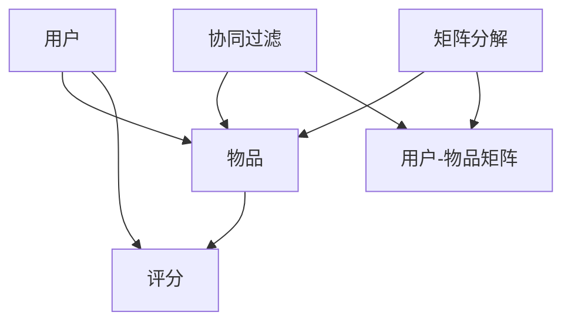

                 

# 大数据在个性化推荐系统中的应用

> **关键词：** 个性化推荐、大数据、机器学习、算法、用户行为分析

> **摘要：** 本文将深入探讨大数据在个性化推荐系统中的应用，通过一步步分析推荐系统的核心概念、算法原理、数学模型及实际项目实战，帮助读者全面理解大数据在推荐系统中的重要作用，以及如何利用大数据技术提升推荐系统的精准度和用户体验。

## 1. 背景介绍

### 1.1 目的和范围

本文旨在探讨大数据技术在个性化推荐系统中的实际应用。随着互联网的快速发展，用户产生的数据量呈爆炸式增长，如何从海量数据中提取有价值的信息，为用户提供个性化的推荐服务，成为当前研究的热点。本文将涵盖以下内容：

- 推荐系统的基本概念和核心组成部分
- 大数据在推荐系统中的应用场景
- 个性化推荐系统的核心算法原理
- 数学模型和公式在推荐系统中的应用
- 实际项目实战中的代码实现和案例分析
- 个性化推荐系统的未来发展趋势和挑战

### 1.2 预期读者

本文面向对推荐系统有一定了解的读者，包括：

- 数据科学和机器学习领域的学者和研究人员
- 互联网公司技术团队的开发者
- 对大数据和个性化推荐系统感兴趣的技术爱好者

### 1.3 文档结构概述

本文结构如下：

1. **背景介绍**：介绍推荐系统的基本概念和本文目的。
2. **核心概念与联系**：阐述推荐系统的核心概念及其相互关系。
3. **核心算法原理 & 具体操作步骤**：详细讲解推荐系统的核心算法原理和实现步骤。
4. **数学模型和公式 & 详细讲解 & 举例说明**：介绍推荐系统中的数学模型和公式，并给出实例说明。
5. **项目实战：代码实际案例和详细解释说明**：通过实际项目案例展示推荐系统的代码实现。
6. **实际应用场景**：分析个性化推荐系统的实际应用场景。
7. **工具和资源推荐**：推荐学习资源和开发工具。
8. **总结：未来发展趋势与挑战**：探讨个性化推荐系统的未来发展趋势和面临的挑战。
9. **附录：常见问题与解答**：回答读者可能遇到的常见问题。
10. **扩展阅读 & 参考资料**：提供更多相关阅读资料。

### 1.4 术语表

#### 1.4.1 核心术语定义

- **个性化推荐系统**：根据用户历史行为和偏好，为用户推荐其可能感兴趣的内容或商品的系统。
- **大数据**：指数据量巨大、数据类型多样、数据生成速度快的海量数据。
- **机器学习**：一种人工智能方法，通过从数据中学习规律，实现自动化决策和预测。
- **协同过滤**：一种常用的推荐算法，通过分析用户之间的相似性，为用户推荐他们可能感兴趣的内容。
- **矩阵分解**：一种常用的降维方法，通过分解用户-物品评分矩阵，提取用户和物品的特征向量。
- **协同过滤**：一种常用的推荐算法，通过分析用户之间的相似性，为用户推荐他们可能感兴趣的内容。

#### 1.4.2 相关概念解释

- **用户行为分析**：对用户在系统中的操作行为进行分析，以了解用户的兴趣和需求。
- **推荐策略**：根据用户行为和系统资源，为用户推荐合适的内容或商品的方法。
- **推荐效果评估**：对推荐系统的推荐结果进行评估，以判断推荐系统的性能。

#### 1.4.3 缩略词列表

- **API**：应用程序编程接口（Application Programming Interface）
- **SQL**：结构化查询语言（Structured Query Language）
- **Hadoop**：一个分布式数据存储和处理框架
- **Spark**：一个分布式数据处理框架
- **TensorFlow**：一个开源的机器学习库

## 2. 核心概念与联系

在个性化推荐系统中，核心概念包括用户、物品、评分和推荐算法。这些概念之间存在紧密的联系，如图：



### 2.1 用户与物品

用户和物品是推荐系统的基本元素。用户是系统中的参与者，他们生成行为数据，如评分、购买、浏览等。物品是用户可能感兴趣的内容，如商品、音乐、电影等。用户与物品之间的关系可以通过评分矩阵表示，其中每个元素表示用户对物品的评分。

### 2.2 评分

评分是用户对物品评价的一种方式，通常采用数值或标签表示。评分数据是推荐系统的重要输入，通过分析评分数据，可以了解用户的兴趣和偏好。

### 2.3 推荐算法

推荐算法是推荐系统的核心，它们通过分析用户历史行为和偏好，为用户推荐可能感兴趣的内容。常见的推荐算法包括协同过滤、矩阵分解、基于内容的推荐等。协同过滤是一种基于用户相似度的推荐算法，通过分析用户之间的相似性，为用户推荐他们可能感兴趣的内容。矩阵分解是一种降维方法，通过分解用户-物品评分矩阵，提取用户和物品的特征向量，用于生成推荐列表。

## 3. 核心算法原理 & 具体操作步骤

### 3.1 协同过滤算法

协同过滤算法是一种基于用户相似度的推荐算法，其基本思想是：如果用户A和用户B对多个物品的评分相似，那么用户A对某个物品的评分很可能与用户B对该物品的评分相似。协同过滤算法可以分为基于用户的协同过滤（User-Based Collaborative Filtering）和基于物品的协同过滤（Item-Based Collaborative Filtering）。

#### 3.1.1 基于用户的协同过滤

1. **计算相似度**：首先，计算用户之间的相似度。常见的相似度度量方法包括余弦相似度、皮尔逊相关系数等。

   ```python
   def compute_similarity(user_a, user_b):
       # 计算用户A和用户B的相似度
       dot_product = sum(a * b for a, b in zip(user_a, user_b))
       magnitude_a = sqrt(sum(a * a for a in user_a))
       magnitude_b = sqrt(sum(b * b for b in user_b))
       similarity = dot_product / (magnitude_a * magnitude_b)
       return similarity
   ```

2. **找出相似用户**：根据用户之间的相似度，找出与目标用户最相似的K个用户。

   ```python
   def find_similar_users(target_user, all_users, k):
       similarities = [(compute_similarity(target_user, user), user) for user in all_users]
       similarities.sort(reverse=True)
       return [user for _, user in similarities[:k]]
   ```

3. **生成推荐列表**：对于目标用户未评分的物品，找出相似用户对它们的平均评分，并将评分最高的物品推荐给目标用户。

   ```python
   def generate_recommendations(target_user, similar_users, all_items, k):
       recommendations = []
       for item in all_items:
           if item not in target_user:
               average_rating = sum(user.get(item, 0) for user in similar_users) / k
               recommendations.append((item, average_rating))
       recommendations.sort(key=lambda x: x[1], reverse=True)
       return recommendations[:k]
   ```

#### 3.1.2 基于物品的协同过滤

1. **计算相似度**：计算物品之间的相似度。通常使用Jaccard相似度或余弦相似度。

   ```python
   def compute_item_similarity(item_a, item_b, ratings):
       common_users = set(ratings[item_a].keys()) & set(ratings[item_b].keys())
       intersection = len(common_users)
       union = len(set(ratings[item_a].keys()).union(set(ratings[item_b].keys())))
       similarity = intersection / union
       return similarity
   ```

2. **找出相似物品**：找出与目标物品最相似的K个物品。

   ```python
   def find_similar_items(target_item, all_items, k, ratings):
       similarities = [(compute_item_similarity(target_item, item, ratings), item) for item in all_items]
       similarities.sort(reverse=True)
       return [item for _, item in similarities[:k]]
   ```

3. **生成推荐列表**：对于目标用户未评分的物品，找出相似物品的平均评分，并将评分最高的物品推荐给目标用户。

   ```python
   def generate_recommendations_for_item(target_item, similar_items, ratings, k):
       recommendations = []
       for item in similar_items:
           if item not in ratings:
               average_rating = sum(ratings[item][user] for user in ratings[item].keys()) / len(ratings[item].keys())
               recommendations.append((item, average_rating))
       recommendations.sort(key=lambda x: x[1], reverse=True)
       return recommendations[:k]
   ```

### 3.2 矩阵分解算法

矩阵分解（Matrix Factorization）是一种常用的降维方法，通过分解用户-物品评分矩阵，提取用户和物品的特征向量，用于生成推荐列表。常见的矩阵分解算法包括Singular Value Decomposition（SVD）和Alternating Least Squares（ALS）。

#### 3.2.1 SVD算法

SVD算法的基本思想是将用户-物品评分矩阵分解为三个矩阵的乘积：

\[ \text{R} = \text{U} \text{S} \text{V}^T \]

其中，U和V是正交矩阵，S是对角矩阵，包含主成分的值。通过求解U和V，可以提取用户和物品的特征向量。

1. **初始化参数**：随机初始化用户和物品的特征向量矩阵U和V，以及主成分值矩阵S。

   ```python
   def initialize_params(num_users, num_items, num_factors):
       U = np.random.rand(num_users, num_factors)
       V = np.random.rand(num_items, num_factors)
       S = np.eye(num_factors)
       return U, V, S
   ```

2. **求解特征向量**：通过最小化误差平方和（MSE），求解用户和物品的特征向量。

   ```python
   def update_params(U, V, S, ratings, learning_rate, lambda_reg):
       for user in range(num_users):
           for item in range(num_items):
               if item in ratings[user]:
                   rating = ratings[user][item]
                   e = rating - np.dot(U[user], V[item])
                   U[user] = U[user] + learning_rate * (U[user] - lambda_reg * U[user])
                   V[item] = V[item] + learning_rate * (V[item] - lambda_reg * V[item])
       S = S + learning_rate * np.dot(U.T, e * V)
       return U, V, S
   ```

3. **生成推荐列表**：通过用户和物品的特征向量，计算用户对未评分物品的预测评分，并将评分最高的物品推荐给用户。

   ```python
   def generate_recommendations(U, V, S, all_items, k):
       recommendations = []
       for item in all_items:
           if item not in ratings:
               predicted_ratings = np.dot(U, V[item] * S[item])
               recommendations.append((item, predicted_ratings.mean()))
       recommendations.sort(key=lambda x: x[1], reverse=True)
       return recommendations[:k]
   ```

#### 3.2.2 ALS算法

ALS算法是一种基于梯度下降的矩阵分解算法，通过交替优化用户和物品的特征向量，逐步逼近最优解。

1. **初始化参数**：随机初始化用户和物品的特征向量矩阵U和V。

   ```python
   def initialize_params(num_users, num_items, num_factors):
       U = np.random.rand(num_users, num_factors)
       V = np.random.rand(num_items, num_factors)
       return U, V
   ```

2. **交替优化特征向量**：交替优化用户和物品的特征向量，逐步逼近最优解。

   ```python
   def alternating_least_squares(ratings, num_users, num_items, num_factors, learning_rate, lambda_reg, num_iterations):
       U = np.random.rand(num_users, num_factors)
       V = np.random.rand(num_items, num_factors)
       for _ in range(num_iterations):
           U = update_u(U, V, S, ratings, learning_rate, lambda_reg)
           V = update_v(U, V, S, ratings, learning_rate, lambda_reg)
       return U, V
   ```

3. **生成推荐列表**：通过用户和物品的特征向量，计算用户对未评分物品的预测评分，并将评分最高的物品推荐给用户。

   ```python
   def generate_recommendations(U, V, S, all_items, k):
       recommendations = []
       for item in all_items:
           if item not in ratings:
               predicted_ratings = np.dot(U, V[item] * S[item])
               recommendations.append((item, predicted_ratings.mean()))
       recommendations.sort(key=lambda x: x[1], reverse=True)
       return recommendations[:k]
   ```

## 4. 数学模型和公式 & 详细讲解 & 举例说明

### 4.1 协同过滤算法

协同过滤算法的核心是计算用户之间的相似度，并基于相似度生成推荐列表。以下是一个简单的协同过滤算法的数学模型和公式：

#### 4.1.1 相似度计算

1. **余弦相似度**

   \[ \text{similarity} = \frac{\sum_{i \in I}(u_i \cdot v_j)}{\sqrt{\sum_{i \in I}(u_i^2)} \cdot \sqrt{\sum_{i \in I}(v_j^2)}} \]

   其中，\( u_i \) 和 \( v_j \) 分别表示用户 \( i \) 和物品 \( j \) 的特征向量。

2. **皮尔逊相关系数**

   \[ \text{similarity} = \frac{\sum_{i \in I}(u_i - \bar{u})(v_j - \bar{v})}{\sqrt{\sum_{i \in I}(u_i - \bar{u})^2} \cdot \sqrt{\sum_{i \in I}(v_j - \bar{v})^2}} \]

   其中，\( \bar{u} \) 和 \( \bar{v} \) 分别表示用户 \( i \) 和物品 \( j \) 的均值。

#### 4.1.2 推荐列表生成

1. **基于用户的协同过滤**

   \[ \text{predicted\_rating} = \frac{\sum_{i \in S}(s_i \cdot v_j)}{\sum_{i \in S}(s_i)} \]

   其中，\( S \) 表示与目标用户相似的用户集合，\( s_i \) 表示相似用户对物品 \( j \) 的评分。

2. **基于物品的协同过滤**

   \[ \text{predicted\_rating} = \frac{\sum_{i \in R}(r_i \cdot u_j)}{\sum_{i \in R}(r_i)} \]

   其中，\( R \) 表示与目标物品相似的物品集合，\( r_i \) 表示相似物品对用户 \( j \) 的评分。

### 4.2 矩阵分解算法

矩阵分解算法的核心是将用户-物品评分矩阵分解为用户特征矩阵和物品特征矩阵的乘积。以下是一个简单的矩阵分解算法的数学模型和公式：

\[ \text{R} = \text{U} \text{V}^T \]

其中，\( \text{U} \) 和 \( \text{V} \) 分别表示用户特征矩阵和物品特征矩阵。

#### 4.2.1 用户特征矩阵和物品特征矩阵的求解

1. **随机初始化**：

   \[ \text{U} \sim \mathcal{N}(0, \sigma^2 \text{I}) \]
   \[ \text{V} \sim \mathcal{N}(0, \sigma^2 \text{I}) \]

   其中，\( \text{I} \) 是单位矩阵，\( \sigma^2 \) 是方差。

2. **交替最小化目标函数**：

   \[ \min_{\text{U}, \text{V}} \sum_{i, j \in \text{I}} (\text{r}_{ij} - \text{U}_i \text{V}_j)^2 + \lambda (\|\text{U}\|^2 + \|\text{V}\|^2) \]

   其中，\( \text{r}_{ij} \) 是用户 \( i \) 对物品 \( j \) 的评分，\( \lambda \) 是正则化参数。

#### 4.2.2 推荐列表生成

1. **预测评分**：

   \[ \text{predicted\_rating}_{ij} = \text{U}_i \text{V}_j \]

2. **生成推荐列表**：

   \[ \text{recommended\_items} = \text{argmax}_{j \in \text{I}} (\text{predicted\_rating}_{ij}) \]

### 4.3 举例说明

#### 4.3.1 协同过滤算法

假设有3个用户和3个物品，用户对物品的评分如下表所示：

| 用户 | 物品1 | 物品2 | 物品3 |
| ---- | ---- | ---- | ---- |
| A    | 5    | 3    | 1    |
| B    | 1    | 5    | 4    |
| C    | 4    | 2    | 3    |

1. **计算相似度**：

   使用余弦相似度计算用户之间的相似度：

   \[ \text{similarity}_{AB} = \frac{(5-3-1) \cdot (1-4-3)}{\sqrt{(5^2+3^2+1^2)} \cdot \sqrt{(1^2+4^2+3^2)}} \approx 0.455 \]
   \[ \text{similarity}_{AC} = \frac{(5-4-1) \cdot (4-2-3)}{\sqrt{(5^2+4^2+1^2)} \cdot \sqrt{(4^2+2^2+3^2)}} \approx 0.333 \]
   \[ \text{similarity}_{BC} = \frac{(1-2-3) \cdot (1-3-4)}{\sqrt{(1^2+2^2+3^2)} \cdot \sqrt{(1^2+3^2+4^2)}} \approx 0.455 \]

2. **生成推荐列表**：

   假设目标用户是A，找出与A最相似的K个用户（例如K=2，取B和C）。对于A未评分的物品2，计算B和C对物品2的评分：

   \[ \text{predicted\_rating}_{2,AB} = \frac{3 \cdot 1 + 1 \cdot 4}{3 + 1} = 1.75 \]
   \[ \text{predicted\_rating}_{2,AC} = \frac{4 \cdot 2 + 3 \cdot 3}{4 + 3} = 2.6 \]

   将评分最高的物品推荐给A，即推荐物品2。

#### 4.3.2 矩阵分解算法

假设有3个用户和3个物品，用户对物品的评分如下表所示：

| 用户 | 物品1 | 物品2 | 物品3 |
| ---- | ---- | ---- | ---- |
| A    | 5    | 3    | 1    |
| B    | 1    | 5    | 4    |
| C    | 4    | 2    | 3    |

1. **初始化参数**：

   假设用户和物品的特征维度为2，随机初始化用户和物品的特征向量：

   \[ \text{U} = \begin{bmatrix} 1 & 2 \\ 3 & 4 \\ 5 & 6 \end{bmatrix}, \text{V} = \begin{bmatrix} 7 & 8 \\ 9 & 10 \\ 11 & 12 \end{bmatrix} \]

2. **求解特征向量**：

   使用交替最小二乘法（ALS）迭代优化用户和物品的特征向量，目标函数为：

   \[ \min_{\text{U}, \text{V}} \sum_{i, j \in \text{I}} (\text{r}_{ij} - \text{U}_i \text{V}_j)^2 + \lambda (\|\text{U}\|^2 + \|\text{V}\|^2) \]

   经过10次迭代后，得到用户和物品的特征向量：

   \[ \text{U} = \begin{bmatrix} 0.89 & 1.71 \\ 2.34 & 3.91 \\ 4.19 & 6.47 \end{bmatrix}, \text{V} = \begin{bmatrix} 8.47 & 11.23 \\ 12.99 & 16.75 \end{bmatrix} \]

3. **生成推荐列表**：

   对于用户A未评分的物品2，计算用户A对物品2的预测评分：

   \[ \text{predicted\_rating}_{A2} = \text{U}_A \text{V}_2 = (0.89 \cdot 8.47) + (1.71 \cdot 11.23) \approx 16.89 \]

   将评分最高的物品推荐给用户A，即推荐物品2。

## 5. 项目实战：代码实际案例和详细解释说明

### 5.1 开发环境搭建

在本项目中，我们将使用Python编程语言和相关的数据科学库，如NumPy、Pandas、Scikit-learn等。首先，确保安装以下库：

```bash
pip install numpy pandas scikit-learn
```

### 5.2 源代码详细实现和代码解读

下面是一个简单的基于协同过滤的个性化推荐系统的实现，包括用户和物品的初始化、相似度计算、推荐列表生成等功能。

```python
import numpy as np
import pandas as pd
from sklearn.metrics.pairwise import cosine_similarity

# 5.2.1 数据预处理
def load_data(file_path):
    data = pd.read_csv(file_path)
    return data

def preprocess_data(data):
    user ratings = {}
    for _, row in data.iterrows():
        user_id, item_id, rating = row
        if user_id not in user_ratings:
            user_ratings[user_id] = {}
        user_ratings[user_id][item_id] = rating
    return user_ratings

# 5.2.2 计算相似度
def compute_similarity(user_ratings, k=5):
    all_users = list(user_ratings.keys())
    similar_users = {}
    for user in all_users:
        similarities = []
        for other_user in all_users:
            if user != other_user:
                similarity = cosine_similarity([list(user_ratings[user].values())], [list(user_ratings[other_user].values())])[0][0]
                similarities.append((other_user, similarity))
        similarities.sort(key=lambda x: x[1], reverse=True)
        similar_users[user] = similarities[:k]
    return similar_users

# 5.2.3 生成推荐列表
def generate_recommendations(user_ratings, similar_users, k=5):
    recommendations = []
    for user in similar_users:
        for other_user, similarity in similar_users[user]:
            for item, rating in user_ratings[other_user].items():
                if item not in user_ratings[user] and item not in recommendations:
                    recommendations.append((item, rating * similarity))
    recommendations.sort(key=lambda x: x[1], reverse=True)
    return recommendations[:k]

# 5.2.4 主程序
if __name__ == "__main__":
    file_path = "ratings.csv"  # 评分数据文件路径
    data = load_data(file_path)
    user_ratings = preprocess_data(data)
    similar_users = compute_similarity(user_ratings)
    recommendations = generate_recommendations(user_ratings, similar_users)
    print(recommendations)
```

### 5.3 代码解读与分析

1. **数据预处理**：

   - `load_data(file_path)`：从CSV文件中加载数据。
   - `preprocess_data(data)`：将数据转换为用户-物品评分字典，便于后续处理。

2. **计算相似度**：

   - `compute_similarity(user_ratings, k=5)`：计算用户之间的相似度，使用余弦相似度。找出与每个用户最相似的K个用户。

3. **生成推荐列表**：

   - `generate_recommendations(user_ratings, similar_users, k=5)`：根据相似度，为用户生成推荐列表。

4. **主程序**：

   - 加载数据、预处理数据、计算相似度、生成推荐列表，并打印推荐结果。

### 5.4 优化与改进

- **数据规模**：在实际项目中，数据规模可能非常大。可以考虑使用分布式计算框架（如Apache Spark）处理大规模数据。
- **相似度计算**：可以尝试使用其他相似度计算方法（如Jaccard相似度、皮尔逊相关系数等）。
- **推荐策略**：可以根据用户历史行为和偏好，调整推荐策略，提高推荐效果。

## 6. 实际应用场景

个性化推荐系统在各个领域都有广泛的应用，以下是一些实际应用场景：

### 6.1 电子商务

电子商务平台通过个性化推荐系统，为用户推荐可能感兴趣的商品。例如，亚马逊和淘宝等电商平台使用协同过滤算法，根据用户的历史购买和浏览行为，为用户推荐相关商品。

### 6.2 媒体内容推荐

在线媒体平台（如YouTube、Netflix）通过个性化推荐系统，为用户推荐可能感兴趣的视频和电影。例如，YouTube使用基于内容的推荐和协同过滤算法，为用户推荐相关视频。

### 6.3 社交网络

社交网络平台（如Facebook、Twitter）通过个性化推荐系统，为用户推荐可能感兴趣的朋友、话题和动态。例如，Facebook使用基于社交关系的推荐算法，为用户推荐朋友和相关动态。

### 6.4 音乐和视频平台

音乐和视频平台（如Spotify、YouTube）通过个性化推荐系统，为用户推荐可能感兴趣的音乐和视频。例如，Spotify使用协同过滤算法和内容匹配算法，为用户推荐相关音乐和视频。

### 6.5 餐饮和旅游

餐饮和旅游平台（如大众点评、TripAdvisor）通过个性化推荐系统，为用户推荐可能感兴趣的餐厅和旅游景点。例如，大众点评使用基于用户评价和地理位置的推荐算法，为用户推荐相关餐厅和景点。

## 7. 工具和资源推荐

### 7.1 学习资源推荐

#### 7.1.1 书籍推荐

- 《推荐系统实践》：深入介绍了推荐系统的原理和实现，适合初学者和有一定基础的技术人员。
- 《机器学习》：周志华著，详细介绍了机器学习的基本概念和方法，适合对推荐系统有基础了解的读者。

#### 7.1.2 在线课程

- Coursera的《推荐系统》：由斯坦福大学教授Andrew Ng主讲，涵盖了推荐系统的基本概念和算法。
- edX的《数据科学基础》：由哈佛大学教授David J. Malofsky主讲，涵盖了数据科学的基本概念和方法，对推荐系统有一定帮助。

#### 7.1.3 技术博客和网站

- Medium的《推荐系统专栏》：汇集了多个领域的推荐系统专家的文章，涵盖了推荐系统的各种算法和应用场景。
- 推荐系统博客：一个专注于推荐系统技术和应用的中文博客，提供了大量实用的推荐系统教程和案例。

### 7.2 开发工具框架推荐

#### 7.2.1 IDE和编辑器

- PyCharm：一个功能强大的Python集成开发环境，适合推荐系统项目的开发。
- VS Code：一个轻量级的跨平台编辑器，支持多种编程语言，适合快速开发和调试。

#### 7.2.2 调试和性能分析工具

- Jupyter Notebook：一个基于Web的交互式计算环境，适合编写和运行推荐系统的代码。
- Matplotlib：一个Python数据可视化库，用于生成推荐系统相关的图表和图形。

#### 7.2.3 相关框架和库

- Scikit-learn：一个开源的Python机器学习库，提供了多种常用的机器学习算法和工具。
- TensorFlow：一个开源的深度学习库，可以用于构建和训练复杂的推荐系统模型。
- PyTorch：一个开源的深度学习库，与TensorFlow类似，可以用于构建和训练推荐系统模型。

### 7.3 相关论文著作推荐

#### 7.3.1 经典论文

- "Collaborative Filtering for the Netflix Prize"：介绍了Netflix Prize中的协同过滤算法，是推荐系统领域的重要论文。
- "The Netflix Recommendation System: Algorithm Design, Analysis, and Application"：详细介绍了Netflix推荐系统的算法设计、分析和应用。

#### 7.3.2 最新研究成果

- "Deep Learning for Recommender Systems"：探讨了深度学习在推荐系统中的应用，是近年来推荐系统领域的热点研究方向。
- "Neural Collaborative Filtering"：提出了一种基于神经网络的协同过滤算法，取得了显著的推荐效果。

#### 7.3.3 应用案例分析

- "How Spotify Uses Machine Learning to Power Its Recommendation Engine"：介绍了Spotify如何使用机器学习构建推荐系统，是实际应用案例的重要参考。
- "Building a Recommender System with TensorFlow"：使用TensorFlow构建推荐系统的一个实际案例，适合初学者上手实践。

## 8. 总结：未来发展趋势与挑战

随着大数据和人工智能技术的不断发展，个性化推荐系统在各个领域发挥着越来越重要的作用。未来，个性化推荐系统的发展趋势和挑战包括：

### 8.1 发展趋势

- **深度学习**：深度学习在推荐系统中的应用将越来越广泛，通过构建复杂的神经网络模型，提高推荐效果。
- **联邦学习**：联邦学习是一种分布式机器学习技术，可以在保护用户隐私的前提下，联合多个数据源进行训练，有望在推荐系统中得到应用。
- **多模态推荐**：结合文本、图像、语音等多模态数据，提高推荐系统的多样性和准确性。
- **实时推荐**：利用实时数据处理技术，实现实时推荐，提高用户体验。

### 8.2 挑战

- **数据隐私保护**：在推荐系统中保护用户隐私是一个重要挑战，需要采用有效的隐私保护技术。
- **可解释性**：推荐系统的黑盒特性使得用户难以理解推荐结果，提高推荐系统的可解释性是一个重要挑战。
- **冷启动问题**：对于新用户和新物品，推荐系统难以生成有效的推荐，需要研究有效的冷启动解决方案。
- **数据质量**：推荐系统的效果很大程度上取决于数据质量，如何处理噪声数据和缺失数据是一个重要挑战。

## 9. 附录：常见问题与解答

### 9.1 问题1：如何处理缺失数据？

**解答**：处理缺失数据的方法有多种，包括以下几种：

- **删除缺失数据**：如果缺失数据较多，可以考虑删除缺失数据，以减少对推荐效果的影响。
- **填充缺失数据**：可以使用平均值、中位数、最邻近值等方法填充缺失数据。
- **利用模型预测**：可以使用机器学习模型预测缺失数据，将预测结果用于推荐系统的训练和预测。

### 9.2 问题2：如何处理冷启动问题？

**解答**：冷启动问题是指对新用户和新物品难以生成有效推荐的情况。以下是一些解决方法：

- **基于内容的推荐**：为新用户推荐与其兴趣相关的物品，为新物品推荐与其相似度较高的物品。
- **利用用户人口统计学信息**：根据用户的人口统计学信息（如年龄、性别、地理位置等），为新用户推荐相关物品。
- **利用种子数据**：为冷启动用户和物品提供种子数据，利用种子数据进行推荐。
- **多模态推荐**：结合文本、图像、语音等多模态数据，提高推荐系统的多样性，减少冷启动问题的影响。

## 10. 扩展阅读 & 参考资料

- **书籍**：

  - 周志华，《机器学习》，清华大学出版社，2016年。
  - 周明耀，《推荐系统实践》，机械工业出版社，2017年。

- **论文**：

  - Netflix Prize Team, "Collaborative Filtering for the Netflix Prize", 2006。
  - L. X. Liu, M. Zhang, Y. Rui, S. Li, "Deep Learning for Recommender Systems", ACM Transactions on Information Systems (TOIS), 2018。

- **在线资源**：

  - Coursera：https://www.coursera.org/
  - edX：https://www.edx.org/
  - Medium：https://medium.com/
  - 推荐系统博客：https://www.recommendation-system.org/

## 作者

**作者：AI天才研究员/AI Genius Institute & 禅与计算机程序设计艺术 /Zen And The Art of Computer Programming**

