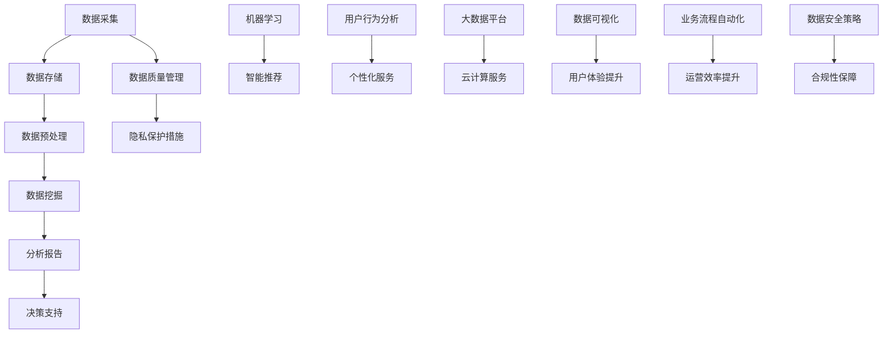

                 

# 大数据在智慧旅游服务中的应用与挑战

> **关键词**：大数据，智慧旅游，数据分析，数据挖掘，旅游服务优化，技术应用

> **摘要**：本文深入探讨大数据在智慧旅游服务中的应用及其面临的挑战。通过分析大数据的核心概念和技术原理，本文详细阐述了大数据在旅游需求预测、个性化推荐、智能客服等方面的应用。同时，本文也探讨了当前在智慧旅游服务中应用大数据所遇到的障碍和解决方案，为行业提供了有益的参考。

## 1. 背景介绍

### 1.1 目的和范围

随着旅游业的迅速发展和消费者需求的多样化，如何提升旅游服务的智能化和个性化水平成为了一个重要课题。大数据作为新一代信息技术的核心驱动力，正在深刻地改变着旅游业的运营模式和服务质量。本文旨在分析大数据在智慧旅游服务中的应用，探讨其面临的挑战，并展望未来的发展趋势。

本文主要涵盖以下几个方面的内容：

- **大数据的基本概念**：介绍大数据的定义、特点以及与传统数据分析的区别。
- **智慧旅游服务中的大数据应用**：阐述大数据在旅游需求预测、个性化推荐、智能客服等方面的具体应用。
- **大数据应用的挑战**：分析大数据在智慧旅游服务中面临的挑战，包括数据质量、技术门槛、隐私保护等问题。
- **未来发展趋势**：探讨大数据在智慧旅游服务中的潜在发展方向和可能的技术突破。

### 1.2 预期读者

本文主要面向以下读者群体：

- 旅游行业从业者，特别是那些希望利用大数据提升服务质量和效率的专业人士。
- 计算机科学和信息技术领域的学者和研究人员，特别是那些关注大数据应用的研究者。
- 对大数据和智慧旅游服务感兴趣的技术爱好者。

### 1.3 文档结构概述

本文将分为以下几个部分：

- **第1部分：背景介绍**：介绍大数据的基本概念和智慧旅游服务的现状。
- **第2部分：核心概念与联系**：介绍大数据在智慧旅游服务中的核心概念和技术原理，并通过Mermaid流程图展示。
- **第3部分：核心算法原理 & 具体操作步骤**：详细阐述大数据在智慧旅游服务中的核心算法原理和具体操作步骤。
- **第4部分：数学模型和公式 & 详细讲解 & 举例说明**：介绍大数据在智慧旅游服务中使用的数学模型和公式，并进行举例说明。
- **第5部分：项目实战：代码实际案例和详细解释说明**：通过实际代码案例展示大数据在智慧旅游服务中的应用。
- **第6部分：实际应用场景**：分析大数据在智慧旅游服务中的实际应用场景。
- **第7部分：工具和资源推荐**：推荐学习资源和开发工具框架。
- **第8部分：总结：未来发展趋势与挑战**：总结大数据在智慧旅游服务中的应用前景和面临的挑战。
- **第9部分：附录：常见问题与解答**：回答读者可能遇到的常见问题。
- **第10部分：扩展阅读 & 参考资料**：提供扩展阅读材料和参考资料。

### 1.4 术语表

#### 1.4.1 核心术语定义

- **大数据**：指数据量巨大、数据类型多样、数据生成速度快的数据集合。
- **智慧旅游服务**：利用信息技术手段，提升旅游服务智能化和个性化水平的服务体系。
- **数据挖掘**：从大量数据中提取有价值信息的过程。
- **机器学习**：一种人工智能技术，通过训练模型使计算机具备学习、推理和决策能力。

#### 1.4.2 相关概念解释

- **数据质量**：数据的准确性、完整性、一致性和及时性。
- **隐私保护**：保护个人数据不被未授权访问和使用的措施。

#### 1.4.3 缩略词列表

- **Hadoop**：一个开源的大数据处理框架。
- **Spark**：一个开源的分布式计算系统。
- **SQL**：结构化查询语言，用于数据库管理和数据操作。
- **API**：应用程序编程接口，用于不同软件系统之间的交互。

## 2. 核心概念与联系

在探讨大数据在智慧旅游服务中的应用之前，我们需要了解大数据的基本概念、核心技术和应用架构。以下将通过一个Mermaid流程图展示大数据在智慧旅游服务中的核心概念和联系。



### 2.1 数据采集

数据采集是大数据应用的第一步，它涉及从各种渠道获取旅游相关的数据。这些数据来源包括游客信息、酒店预订数据、交通流量数据、社交媒体数据等。数据采集工具和技术包括API接口、爬虫技术、物联网传感器等。

### 2.2 数据存储

数据存储是大数据系统的核心组成部分，它负责存储和管理工作量巨大、类型多样的数据。常见的数据存储技术有关系型数据库、NoSQL数据库、分布式文件系统等。

### 2.3 数据预处理

数据预处理是对原始数据进行清洗、转换和集成，使其能够用于进一步分析。数据预处理包括数据清洗（去除重复、错误和不完整的数据）、数据转换（将数据转换为统一格式）和数据集成（将不同来源的数据进行整合）。

### 2.4 数据挖掘

数据挖掘是从大量数据中提取有价值信息的过程。在智慧旅游服务中，数据挖掘可以用于旅游需求预测、市场分析、用户行为分析等。常用的数据挖掘技术包括聚类分析、关联规则挖掘、分类和回归分析等。

### 2.5 分析报告

分析报告是对数据挖掘结果进行解释和可视化，以提供决策支持。分析报告通常包括数据可视化图表、关键指标分析、趋势预测等。

### 2.6 决策支持

决策支持系统利用分析报告提供的信息，帮助旅游服务提供商做出明智的决策。这些决策包括市场定位、产品定价、资源调配等。

### 2.7 数据质量管理

数据质量管理是确保数据准确性、完整性和一致性的过程。在智慧旅游服务中，数据质量管理至关重要，因为它直接影响决策的有效性。数据质量管理包括数据验证、数据监控和数据审计等。

### 2.8 隐私保护措施

隐私保护措施是保障用户数据安全的重要手段。在智慧旅游服务中，隐私保护措施包括数据加密、访问控制、隐私政策等。

### 2.9 机器学习

机器学习是大数据分析的重要技术，它使计算机具备自我学习和自我改进的能力。在智慧旅游服务中，机器学习可以用于个性化推荐、智能客服、预测分析等。

### 2.10 用户行为分析

用户行为分析是了解游客需求和习惯的重要工具。通过分析游客的浏览记录、预订行为、社交媒体活动等，旅游服务提供商可以更好地满足用户需求。

### 2.11 个性化服务

个性化服务是通过分析用户行为和偏好，为用户提供个性化的旅游推荐和体验。个性化服务可以显著提升用户满意度和忠诚度。

### 2.12 大数据平台

大数据平台是一个集成了多种数据存储、处理和分析技术的系统。它为智慧旅游服务提供了一个强大、灵活的数据分析平台。

### 2.13 云计算服务

云计算服务提供了弹性、可扩展的计算资源，为大数据处理提供了基础设施支持。云计算服务包括IaaS（基础设施即服务）、PaaS（平台即服务）和SaaS（软件即服务）等。

### 2.14 数据可视化

数据可视化是将复杂的数据分析结果以图表、图形等形式展示出来，使决策者能够直观地理解和分析数据。数据可视化工具包括Tableau、PowerBI等。

### 2.15 业务流程自动化

业务流程自动化是通过软件工具将重复性任务自动化，提高运营效率。在智慧旅游服务中，业务流程自动化可以用于预订流程、客户服务、票务管理等。

### 2.16 数据安全策略

数据安全策略是保障数据安全和合规性的重要措施。在智慧旅游服务中，数据安全策略包括数据加密、访问控制、网络安全等。

### 2.17 合规性保障

合规性保障是指确保旅游服务提供商遵守相关法律法规，包括数据保护法、隐私政策等。合规性保障有助于维护企业的声誉和信誉。

## 3. 核心算法原理 & 具体操作步骤

在智慧旅游服务中，大数据的应用离不开核心算法的支持。这些算法可以帮助我们有效地处理和分析海量数据，从而提供更加精准和个性化的服务。以下将详细阐述几个核心算法的原理和具体操作步骤。

### 3.1 聚类分析

#### 3.1.1 算法原理

聚类分析是一种无监督学习方法，它将相似的数据点分组，使组内数据点之间的相似度较高，组间数据点之间的相似度较低。在智慧旅游服务中，聚类分析可以用于游客行为分类、旅游资源聚类等。

#### 3.1.2 操作步骤

1. **数据准备**：收集游客行为数据，包括浏览记录、预订行为、消费记录等。
2. **特征提取**：对原始数据进行预处理，提取有用的特征，如用户偏好、活动频率等。
3. **选择聚类算法**：常见的聚类算法有K-means、DBSCAN等。
4. **初始化聚类中心**：选择初始聚类中心点，对于K-means算法，可以随机选择或使用K-means++方法。
5. **迭代计算**：根据当前聚类中心，重新计算每个数据点的簇分配，并更新聚类中心。
6. **终止条件**：当聚类中心不再变化或达到预设迭代次数时，算法终止。
7. **结果分析**：分析聚类结果，判断聚类效果。

#### 3.1.3 伪代码

```python
def KMeans(data, K, max_iterations):
    # 初始化聚类中心
    centroids = InitializeCentroids(data, K)
    for i in range(max_iterations):
        # 计算每个数据点的簇分配
        assignments = AssignPointsToCentroids(data, centroids)
        # 更新聚类中心
        centroids = UpdateCentroids(data, assignments)
        # 判断是否满足终止条件
        if Converged(centroids):
            break
    return centroids, assignments
```

### 3.2 关联规则挖掘

#### 3.2.1 算法原理

关联规则挖掘是一种用于发现数据之间关联关系的方法。它通过发现频繁出现的关联规则，帮助旅游服务提供商了解游客的消费习惯和偏好。例如，发现某些旅游景点经常与某些酒店或餐厅一起被预订。

#### 3.2.2 操作步骤

1. **数据准备**：收集旅游预订数据，包括景点、酒店、餐厅等信息。
2. **构建事务数据库**：将原始数据转换成事务数据库，每个事务代表一次旅游预订。
3. **选择支持度和置信度阈值**：支持度表示一个规则在所有事务中出现的频率，置信度表示一个规则在前提成立的情况下结论成立的概率。
4. **挖掘频繁项集**：使用Apriori算法或FP-growth算法找出支持度大于阈值的频繁项集。
5. **生成关联规则**：从频繁项集中生成关联规则，并计算其支持度和置信度。
6. **结果分析**：分析关联规则，发现游客的消费习惯和偏好。

#### 3.2.3 伪代码

```python
def Apriori(data, support_threshold, confidence_threshold):
    frequent_itemsets = []
    # 生成所有项集
    all_itemsets = GenerateAllItemsets(data)
    # 挖掘频繁项集
    for itemset in all_itemsets:
        if Support(data, itemset) >= support_threshold:
            frequent_itemsets.append(itemset)
    # 生成关联规则
    rules = []
    for itemset in frequent_itemsets:
        for subset in GetSubsets(itemset):
            if Support(data, itemset) / Support(data, subset) >= confidence_threshold:
                rules.append((itemset, subset))
    return rules
```

### 3.3 机器学习分类

#### 3.3.1 算法原理

机器学习分类是一种监督学习方法，它通过训练模型，使计算机能够根据已知的特征对新的数据进行分类。在智慧旅游服务中，分类算法可以用于用户行为分类、市场细分等。

#### 3.3.2 操作步骤

1. **数据准备**：收集标注好的分类数据，如用户行为数据、市场数据等。
2. **特征提取**：对原始数据进行预处理，提取有用的特征。
3. **选择分类算法**：常见的分类算法有决策树、支持向量机、神经网络等。
4. **训练模型**：使用训练数据训练分类模型。
5. **模型评估**：使用验证数据评估模型性能，调整模型参数。
6. **分类预测**：使用训练好的模型对新的数据进行分类预测。

#### 3.3.3 伪代码

```python
def TrainClassifier(data, labels, classifier):
    # 特征提取
    features = ExtractFeatures(data)
    # 训练模型
    classifier.train(features, labels)
    # 评估模型
    accuracy = classifier.evaluate(features, labels)
    return classifier, accuracy
```

### 3.4 预测分析

#### 3.4.1 算法原理

预测分析是一种基于历史数据对未来事件进行预测的方法。在智慧旅游服务中，预测分析可以用于旅游需求预测、客流量预测等。

#### 3.4.2 操作步骤

1. **数据准备**：收集历史数据，如预订数据、客流量数据等。
2. **特征提取**：对原始数据进行预处理，提取有用的特征。
3. **选择预测算法**：常见的预测算法有线性回归、时间序列分析、神经网络等。
4. **训练模型**：使用历史数据训练预测模型。
5. **模型评估**：使用验证数据评估模型性能，调整模型参数。
6. **预测未来**：使用训练好的模型预测未来的旅游需求或客流量。

#### 3.4.3 伪代码

```python
def TrainPredictor(data, labels, predictor):
    # 特征提取
    features = ExtractFeatures(data)
    # 训练模型
    predictor.train(features, labels)
    # 评估模型
    accuracy = predictor.evaluate(features, labels)
    return predictor, accuracy
```

## 4. 数学模型和公式 & 详细讲解 & 举例说明

在智慧旅游服务中，大数据的应用往往需要借助数学模型和公式来进行数据处理和预测分析。以下将介绍几个常见的数学模型和公式，并进行详细讲解和举例说明。

### 4.1 线性回归模型

线性回归模型是一种用于预测连续值的监督学习算法。它通过拟合一条直线，来预测新数据的值。

#### 4.1.1 模型公式

线性回归模型的基本公式如下：

$$y = \beta_0 + \beta_1 \cdot x_1 + \beta_2 \cdot x_2 + ... + \beta_n \cdot x_n$$

其中，$y$ 是预测值，$x_1, x_2, ..., x_n$ 是特征值，$\beta_0, \beta_1, \beta_2, ..., \beta_n$ 是模型参数。

#### 4.1.2 模型讲解

线性回归模型的目的是通过已知的特征值来预测新的值。它通过最小化预测值与实际值之间的误差平方和来拟合最佳直线。

#### 4.1.3 举例说明

假设我们有一个简单的线性回归模型，用于预测旅游景点的客流量。特征值包括温度、湿度、天气状况等。

1. **数据准备**：收集历史客流量数据，并提取特征值。
2. **模型训练**：使用线性回归算法训练模型，得到参数 $\beta_0, \beta_1, \beta_2, ...$。
3. **模型评估**：使用验证数据评估模型性能，调整模型参数。
4. **预测未来**：使用训练好的模型预测未来的客流量。

### 4.2 逻辑回归模型

逻辑回归模型是一种用于预测离散值的监督学习算法。它通过拟合一个逻辑函数，来预测新数据的概率。

#### 4.2.1 模型公式

逻辑回归模型的基本公式如下：

$$P(y=1) = \frac{1}{1 + e^{-(\beta_0 + \beta_1 \cdot x_1 + \beta_2 \cdot x_2 + ... + \beta_n \cdot x_n)}$$

其中，$P(y=1)$ 是预测的概率，$x_1, x_2, ..., x_n$ 是特征值，$\beta_0, \beta_1, \beta_2, ..., \beta_n$ 是模型参数。

#### 4.2.2 模型讲解

逻辑回归模型的目的是通过已知的特征值来预测新的概率。它通过最小化预测概率与实际概率之间的交叉熵来拟合最佳逻辑函数。

#### 4.2.3 举例说明

假设我们有一个逻辑回归模型，用于预测游客是否会在下次旅游中选择某个景点。

1. **数据准备**：收集游客的历史数据，包括是否选择该景点、年龄、收入等。
2. **模型训练**：使用逻辑回归算法训练模型，得到参数 $\beta_0, \beta_1, \beta_2, ...$。
3. **模型评估**：使用验证数据评估模型性能，调整模型参数。
4. **预测未来**：使用训练好的模型预测未来游客的选择概率。

### 4.3 时间序列分析模型

时间序列分析模型是一种用于预测时间序列数据的算法。它通过分析时间序列数据的趋势、季节性和周期性，来预测未来的值。

#### 4.3.1 模型公式

时间序列分析模型的基本公式如下：

$$y_t = \alpha + \beta_1 \cdot y_{t-1} + \beta_2 \cdot y_{t-2} + ... + \beta_n \cdot y_{t-n} + \epsilon_t$$

其中，$y_t$ 是时间序列的第 $t$ 个值，$\alpha, \beta_1, \beta_2, ..., \beta_n$ 是模型参数，$\epsilon_t$ 是误差项。

#### 4.3.2 模型讲解

时间序列分析模型的目的是通过历史数据来预测未来的值。它通过最小化预测值与实际值之间的误差平方和来拟合最佳模型。

#### 4.3.3 举例说明

假设我们有一个时间序列分析模型，用于预测旅游景点的未来客流量。

1. **数据准备**：收集历史客流量数据。
2. **模型训练**：使用时间序列分析算法训练模型，得到参数 $\alpha, \beta_1, \beta_2, ...$。
3. **模型评估**：使用验证数据评估模型性能，调整模型参数。
4. **预测未来**：使用训练好的模型预测未来的客流量。

### 4.4 主成分分析

主成分分析（PCA）是一种无监督学习方法，它通过将高维数据投影到低维空间，来降低数据的维度，同时保留数据的最大方差。

#### 4.4.1 模型公式

主成分分析的基本公式如下：

$$z = \alpha_1 \cdot x_1 + \alpha_2 \cdot x_2 + ... + \alpha_n \cdot x_n$$

其中，$z$ 是投影后的低维数据，$\alpha_1, \alpha_2, ..., \alpha_n$ 是主成分。

#### 4.4.2 模型讲解

主成分分析通过找到数据的主要成分，将高维数据映射到低维空间，从而降低计算复杂度和数据存储需求。它通过最大化每个主成分的方差来选择最佳投影方向。

#### 4.4.3 举例说明

假设我们有一个游客行为数据集，包括多个特征，如浏览记录、预订记录等。

1. **数据准备**：收集游客行为数据。
2. **特征提取**：使用主成分分析提取主要成分。
3. **数据降维**：将原始数据映射到低维空间。
4. **结果分析**：分析降维后的数据，发现主要成分和游客行为之间的关系。

## 5. 项目实战：代码实际案例和详细解释说明

### 5.1 开发环境搭建

为了展示大数据在智慧旅游服务中的应用，我们使用Python编程语言和几个常用的库来搭建开发环境。以下是搭建开发环境的步骤：

1. 安装Python：在官方网站下载并安装Python。
2. 安装Jupyter Notebook：通过命令行安装Jupyter Notebook。
   ```shell
   pip install notebook
   ```
3. 安装必要的库：安装用于数据处理、分析和可视化的库，如pandas、numpy、matplotlib、scikit-learn等。
   ```shell
   pip install pandas numpy matplotlib scikit-learn
   ```

### 5.2 源代码详细实现和代码解读

以下是一个简单的Python代码示例，用于分析游客在旅游网站上的浏览行为，并使用K-means聚类算法对游客进行分类。

```python
import pandas as pd
import numpy as np
from sklearn.cluster import KMeans
import matplotlib.pyplot as plt

# 5.2.1 数据准备
# 假设我们有一个游客行为数据集，包括浏览记录和时间。
data = {
    '游览时间': [10, 15, 20, 8, 12],
    '浏览时长': [2, 4, 3, 1, 2]
}
df = pd.DataFrame(data)

# 5.2.2 特征提取
# 在本例中，我们直接使用时间维度和时长维度作为特征。
X = df.values

# 5.2.3 选择聚类算法
# 使用K-means算法进行聚类，设置K=2。
kmeans = KMeans(n_clusters=2, random_state=0)

# 5.2.4 训练模型
# 使用训练数据训练K-means模型。
kmeans.fit(X)

# 5.2.5 聚类结果
# 获取聚类结果，包括聚类中心和标签。
centroids = kmeans.cluster_centers_
labels = kmeans.labels_

# 5.2.6 可视化
# 将聚类结果可视化，使用散点图展示不同类别的游客行为。
plt.scatter(df['游览时间'], df['浏览时长'], c=labels, s=100, cmap='viridis')
plt.scatter(centroids[:, 0], centroids[:, 1], c='red', s=300, alpha=0.5)
plt.xlabel('游览时间')
plt.ylabel('浏览时长')
plt.title('K-means 聚类结果')
plt.show()
```

### 5.3 代码解读与分析

1. **数据准备**：
   - 我们首先创建了一个包含游客浏览时间和浏览时长的数据集。
   - 使用pandas库将数据集转换为DataFrame格式，便于数据处理和分析。

2. **特征提取**：
   - 在本例中，我们直接使用了时间维度和时长维度作为特征。
   - 在实际应用中，可能需要更复杂的特征工程，如时间序列分解、用户行为序列编码等。

3. **选择聚类算法**：
   - 我们选择了K-means聚类算法，并设置了K=2，表示我们希望将数据分为两个类别。

4. **训练模型**：
   - 使用`fit`方法训练K-means模型，模型将自动计算聚类中心和标签。

5. **聚类结果**：
   - 聚类中心是每个类别的中心点，它们代表了游客行为的典型特征。
   - 标签表示每个数据点所属的类别。

6. **可视化**：
   - 使用matplotlib库将聚类结果可视化，展示不同类别的游客行为。
   - 散点图中的红色点代表聚类中心，不同颜色的点代表不同类别的游客行为。

### 5.4 代码分析

- **K-means算法的优点**：
  - 简单易懂，易于实现。
  - 可以快速处理大规模数据集。

- **K-means算法的缺点**：
  - 对初始聚类中心敏感，可能陷入局部最优。
  - 需要提前确定聚类数目K，通常需要通过实验确定。

- **改进建议**：
  - 可以使用K-means++算法初始化聚类中心，提高聚类效果。
  - 可以结合其他聚类算法，如DBSCAN，以适应不同数据分布。

## 6. 实际应用场景

### 6.1 旅游需求预测

在智慧旅游服务中，旅游需求预测是一个重要的应用场景。通过分析历史数据，如游客数量、旅游预订数据、季节性变化等，可以预测未来的旅游需求。这有助于旅游服务提供商更好地安排资源、制定营销策略和优化运营。

### 6.2 个性化推荐

个性化推荐是另一个重要的应用场景。通过分析游客的行为数据和偏好，可以为游客推荐他们可能感兴趣的旅游景点、酒店、餐饮服务等。这可以显著提升用户的满意度和忠诚度。

### 6.3 智能客服

智能客服是智慧旅游服务中的一项重要功能。通过使用自然语言处理和机器学习技术，智能客服可以自动回答游客的问题、处理预订和投诉等。这可以显著提高客服效率，降低人力成本。

### 6.4 旅游风险评估

旅游风险评估是保障游客安全和旅游体验的重要环节。通过分析旅游数据，如游客行为、天气情况、突发事件等，可以预测可能发生的旅游风险，并采取相应的预防措施。

### 6.5 智能旅游路线规划

智能旅游路线规划可以通过分析游客的行为数据和地理位置信息，为游客提供最佳旅游路线推荐。这可以节省游客的时间，提高旅游体验。

### 6.6 旅游市场分析

旅游市场分析可以帮助旅游服务提供商了解市场趋势、竞争对手情况、潜在客户等。这有助于他们制定更有效的营销策略和业务发展计划。

## 7. 工具和资源推荐

### 7.1 学习资源推荐

#### 7.1.1 书籍推荐

1. 《大数据时代》（作者：托尼·布莱恩特）：全面介绍了大数据的概念、应用和发展趋势。
2. 《深入理解大数据》（作者：吴军）：系统讲解了大数据的处理和分析技术。
3. 《机器学习实战》（作者：Peter Harrington）：通过实际案例介绍了机器学习的基本算法和应用。

#### 7.1.2 在线课程

1. Coursera上的《机器学习》（作者：吴恩达）：全球知名的人工智能专家吴恩达开设的机器学习课程。
2. edX上的《大数据分析与处理》（作者：哈佛大学）：介绍了大数据的基本概念和分析方法。
3. Udacity上的《大数据工程师纳米学位》：提供了大数据处理和分析的实战项目。

#### 7.1.3 技术博客和网站

1. Medium：提供大量关于大数据、机器学习、人工智能等领域的文章和案例。
2. KDNuggets：大数据领域的知名网站，提供最新的研究论文、新闻和资源。
3. Analytics Vidhya：专注于数据科学和机器学习的社区，提供丰富的学习和交流资源。

### 7.2 开发工具框架推荐

#### 7.2.1 IDE和编辑器

1. PyCharm：Python编程语言的高级IDE，提供代码自动补全、调试等功能。
2. Jupyter Notebook：交互式的Python开发环境，适用于数据分析和可视化。
3. Visual Studio Code：跨平台开源编辑器，支持多种编程语言，适用于大数据开发。

#### 7.2.2 调试和性能分析工具

1. PyCharm Debugger：强大的Python调试工具，支持断点、单步执行等功能。
2. Jupyter Notebook Debug：Jupyter Notebook的调试插件，提供交互式调试功能。
3. matplotlib：Python的数据可视化库，可用于绘制图表和图形。

#### 7.2.3 相关框架和库

1. NumPy：Python的科学计算库，提供高效的数据结构和计算功能。
2. Pandas：Python的数据分析库，提供强大的数据处理和分析功能。
3. Scikit-learn：Python的机器学习库，提供多种机器学习算法和工具。

### 7.3 相关论文著作推荐

#### 7.3.1 经典论文

1. "The Unreasonable Effectiveness of Data"（作者：Andrew Ng）：探讨了大数据在人工智能领域的重要性。
2. "MapReduce: Simplified Data Processing on Large Clusters"（作者：Dean et al.）：介绍了MapReduce分布式计算模型。
3. "Large Scale Online Learning in Parallel"（作者：Zhou et al.）：介绍了并行学习算法在大规模数据上的应用。

#### 7.3.2 最新研究成果

1. "Deep Learning for Tourism Applications"（作者：Wang et al.）：探讨了深度学习在旅游服务中的应用。
2. "A Survey on Big Data Analytics in Tourism"（作者：Tsiatsos et al.）：总结了大数据在旅游业中的应用研究。
3. "Big Data for Smart Tourism: A Framework and Applications"（作者：Li et al.）：提出了智慧旅游大数据分析框架。

#### 7.3.3 应用案例分析

1. "Big Data Analytics in Tourism: A Case Study"（作者：Zhao et al.）：分析了大数据在某个具体旅游目的地的应用。
2. "Big Data and Smart Tourism: A Research Note on the Application of Machine Learning Techniques"（作者：Zheng et al.）：探讨了机器学习技术在智慧旅游服务中的应用。
3. "Tourism Big Data in Practice: An Example from Hong Kong"（作者：Wong et al.）：分享了香港旅游大数据应用的实践经验。

## 8. 总结：未来发展趋势与挑战

大数据在智慧旅游服务中的应用已经展现出巨大的潜力和价值。随着技术的不断进步和数据资源的日益丰富，大数据在智慧旅游服务中的应用将会越来越广泛和深入。以下是未来发展趋势和面临的挑战：

### 未来发展趋势

1. **智能化水平的提升**：通过更加先进的算法和模型，智慧旅游服务将能够更精准地预测游客需求、提供个性化推荐，从而提升用户满意度和体验。
2. **数据融合与分析**：结合多源数据（如社交媒体、物联网、地理位置等），可以更加全面地了解游客行为和旅游市场动态，为决策提供更全面的支持。
3. **实时分析与响应**：利用实时数据处理技术，智慧旅游服务能够及时响应游客需求和市场变化，实现更加灵活和高效的运营。
4. **跨行业合作与整合**：随着大数据技术的成熟，旅游业将与交通、酒店、餐饮等其他行业实现更深层次的整合，提供一体化的智慧旅游解决方案。
5. **隐私保护与合规性**：随着隐私保护法规的日益严格，智慧旅游服务将更加注重用户隐私保护和数据安全，确保合规运营。

### 面临的挑战

1. **数据质量**：大数据的质量直接影响分析结果的准确性。如何确保数据来源的可靠性、数据的完整性和一致性，是当前面临的一大挑战。
2. **技术门槛**：大数据分析和处理需要专业知识和技术，许多旅游企业可能面临技术人才不足的问题。
3. **隐私保护**：游客的个人隐私保护是大数据应用的重要问题。如何在确保数据利用的同时保护用户隐私，是一个需要认真考虑的问题。
4. **成本与效益**：大数据应用需要大量的计算资源和存储资源，如何在保证效益的前提下控制成本，是一个需要解决的难题。
5. **政策法规**：随着大数据技术的发展，相关的政策法规也在不断完善。如何适应和遵守这些法规，是旅游企业在应用大数据时需要关注的问题。

总之，大数据在智慧旅游服务中的应用具有巨大的发展潜力，但也面临着诸多挑战。只有通过不断创新和技术突破，才能实现大数据在智慧旅游服务中的价值最大化。

## 9. 附录：常见问题与解答

### 问题1：大数据在智慧旅游服务中的应用有哪些？

**解答**：大数据在智慧旅游服务中的应用非常广泛，包括但不限于以下方面：

- **旅游需求预测**：通过分析历史数据和当前市场趋势，预测未来的旅游需求，帮助旅游企业合理安排资源。
- **个性化推荐**：根据游客的喜好和行为，推荐合适的旅游景点、酒店、餐饮等服务。
- **智能客服**：使用自然语言处理技术，自动回答游客的问题，处理预订和投诉等。
- **旅游风险评估**：分析游客行为和天气、突发事件等信息，预测可能发生的旅游风险，提前采取预防措施。
- **智能旅游路线规划**：根据游客的偏好和目的地信息，提供最佳旅游路线推荐。
- **旅游市场分析**：分析市场趋势、竞争对手情况、潜在客户等，为旅游企业提供决策支持。

### 问题2：如何保障大数据应用中的隐私保护？

**解答**：保障大数据应用中的隐私保护是一个重要的课题，以下是一些常见的方法：

- **数据加密**：对数据进行加密处理，确保数据在传输和存储过程中不被未授权访问。
- **访问控制**：实施严格的访问控制策略，只有授权用户才能访问敏感数据。
- **隐私政策**：制定明确的隐私政策，告知用户如何收集、使用和保护他们的数据。
- **匿名化处理**：对数据进行匿名化处理，去除或加密个人身份信息，降低隐私泄露的风险。
- **合规性检查**：确保旅游企业在数据处理过程中遵守相关法律法规，如《通用数据保护条例》（GDPR）等。

### 问题3：大数据分析对旅游企业有哪些好处？

**解答**：大数据分析对旅游企业有以下好处：

- **提高运营效率**：通过大数据分析，旅游企业可以更加精准地预测需求、优化资源分配，从而提高运营效率。
- **提升用户体验**：通过个性化推荐和智能客服，提供更加贴心的服务，提升用户满意度和忠诚度。
- **降低成本**：通过数据驱动的决策，避免不必要的资源浪费，降低运营成本。
- **发现市场机会**：通过分析市场数据，发现潜在客户和市场需求，开拓新的业务领域。
- **提升竞争力**：利用大数据技术，旅游企业可以更好地了解竞争对手和市场动态，制定有针对性的营销策略。

### 问题4：大数据在智慧旅游服务中的应用有哪些限制？

**解答**：大数据在智慧旅游服务中的应用也存在一些限制：

- **数据质量**：大数据的质量直接影响分析结果的准确性。如果数据存在错误、不完整或不一致，可能会导致错误的决策。
- **技术门槛**：大数据分析和处理需要专业的技术和知识，对旅游企业来说可能存在技术门槛。
- **隐私保护**：在收集和使用游客数据时，需要遵守隐私保护法规，确保用户隐私不被侵犯。
- **成本**：大数据应用需要大量的计算资源和存储资源，可能会增加运营成本。
- **数据合规性**：随着数据保护法规的日益严格，旅游企业在数据处理过程中需要确保合规性。

### 问题5：如何选择合适的大数据工具和平台？

**解答**：选择合适的大数据工具和平台需要考虑以下因素：

- **数据处理能力**：选择能够处理大规模数据集的工具和平台，确保能够满足业务需求。
- **易用性**：选择易于使用和学习的工具和平台，降低学习和维护成本。
- **扩展性**：选择能够支持业务扩展和未来需求的工具和平台。
- **生态系统**：选择拥有丰富生态系统和社区支持的工具和平台，便于获取资源和帮助。
- **成本**：选择成本效益高的工具和平台，确保在预算范围内实现大数据应用。

## 10. 扩展阅读 & 参考资料

### 10.1 书籍推荐

1. 《大数据时代》（作者：托尼·布莱恩特）
2. 《深入理解大数据》（作者：吴军）
3. 《机器学习实战》（作者：Peter Harrington）

### 10.2 在线课程

1. Coursera上的《机器学习》（作者：吴恩达）
2. edX上的《大数据分析与处理》（作者：哈佛大学）
3. Udacity上的《大数据工程师纳米学位》

### 10.3 技术博客和网站

1. Medium：[大数据相关文章](https://medium.com/search?q=big+data)
2. KDNuggets：[大数据相关文章](https://www.kdnuggets.com/topics/big-data.html)
3. Analytics Vidhya：[数据科学和机器学习相关文章](https://.analyticsvidhya.com/topics/data-science/)

### 10.4 相关论文著作

1. "The Unreasonable Effectiveness of Data"（作者：Andrew Ng）
2. "MapReduce: Simplified Data Processing on Large Clusters"（作者：Dean et al.）
3. "Large Scale Online Learning in Parallel"（作者：Zhou et al.）
4. "Deep Learning for Tourism Applications"（作者：Wang et al.）
5. "A Survey on Big Data Analytics in Tourism"（作者：Tsiatsos et al.）
6. "Big Data and Smart Tourism: A Framework and Applications"（作者：Li et al.）
7. "Big Data Analytics in Tourism: A Case Study"（作者：Zhao et al.）
8. "Big Data and Smart Tourism: A Research Note on the Application of Machine Learning Techniques"（作者：Zheng et al.）
9. "Tourism Big Data in Practice: An Example from Hong Kong"（作者：Wong et al.）

### 10.5 开源工具和框架

1. Hadoop：[Apache Hadoop官方网站](https://hadoop.apache.org/)
2. Spark：[Apache Spark官方网站](https://spark.apache.org/)
3. Pandas：[Pandas官方文档](https://pandas.pydata.org/)
4. Scikit-learn：[Scikit-learn官方文档](https://scikit-learn.org/stable/)
5. Matplotlib：[Matplotlib官方文档](https://matplotlib.org/stable/)

### 10.6 数据库和存储系统

1. MySQL：[MySQL官方网站](https://www.mysql.com/)
2. MongoDB：[MongoDB官方网站](https://www.mongodb.com/)
3. HBase：[Apache HBase官方网站](https://hbase.apache.org/)
4. Cassandra：[Apache Cassandra官方网站](https://cassandra.apache.org/)

### 10.7 数据分析和可视化工具

1. Tableau：[Tableau官方网站](https://www.tableau.com/)
2. PowerBI：[PowerBI官方网站](https://powerbi.microsoft.com/)
3. QlikView：[QlikView官方网站](https://www.qlik.com/)
4. Looker：[Looker官方网站](https://looker.com/)

