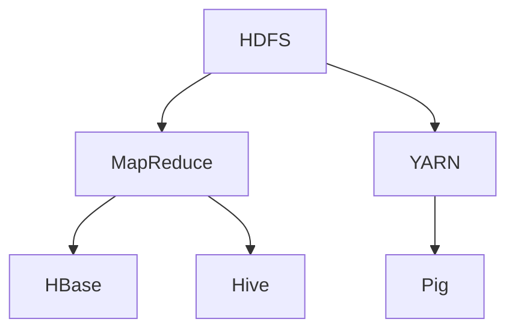

                 

# 大数据处理：Hadoop生态系统深度解析

## 关键词
- Hadoop
- 大数据处理
- 分布式系统
- MapReduce
- YARN
- HDFS
- 数据存储
- 数据处理框架

## 摘要
本文旨在深入解析Hadoop生态系统，探讨其核心概念、算法原理、应用场景以及未来发展趋势。通过对Hadoop生态系统中各组件的详细剖析，读者将全面了解Hadoop在处理海量数据方面的优势和挑战，并掌握如何在实际项目中应用Hadoop生态系统。

## 1. 背景介绍

### 1.1 目的和范围
本文旨在为读者提供一个全面、系统的Hadoop生态系统解析。我们将从Hadoop的核心概念出发，逐步深入到各个组件的工作原理和应用场景，帮助读者理解Hadoop生态系统的架构和运作机制。

### 1.2 预期读者
本文适合对大数据处理和分布式系统有一定基础的读者，包括程序员、数据科学家、系统架构师等。对于完全初学者，建议先了解一些基本的大数据和分布式系统概念。

### 1.3 文档结构概述
本文分为十个部分：
1. 背景介绍
2. 核心概念与联系
3. 核心算法原理 & 具体操作步骤
4. 数学模型和公式 & 详细讲解 & 举例说明
5. 项目实战：代码实际案例和详细解释说明
6. 实际应用场景
7. 工具和资源推荐
8. 总结：未来发展趋势与挑战
9. 附录：常见问题与解答
10. 扩展阅读 & 参考资料

### 1.4 术语表

#### 1.4.1 核心术语定义

- **Hadoop**：一个开源软件框架，用于大规模数据的存储和处理。
- **MapReduce**：一种编程模型，用于大规模数据的分布式处理。
- **HDFS**：Hadoop分布式文件系统，用于存储大数据。
- **YARN**：资源调度框架，用于管理计算资源。
- **大数据处理**：指处理海量数据的过程，涉及数据存储、数据清洗、数据分析等多个方面。

#### 1.4.2 相关概念解释

- **分布式系统**：由多个相互独立的节点组成的系统，节点之间通过网络进行通信和协作。
- **数据存储**：将数据保存在存储设备中的过程。
- **数据处理**：对数据进行操作、转换和分析的过程。

#### 1.4.3 缩略词列表

- **HDFS**：Hadoop Distributed File System
- **MapReduce**：Map and Reduce
- **YARN**：Yet Another Resource Negotiator
- **API**：Application Programming Interface

## 2. 核心概念与联系

### 2.1 Hadoop生态系统概述

Hadoop生态系统是一个由多个组件组成的复杂系统，用于处理、存储和分析海量数据。其主要组件包括：

- **HDFS**：Hadoop分布式文件系统，用于存储大数据。
- **MapReduce**：分布式数据处理模型，用于处理大规模数据。
- **YARN**：资源调度框架，用于管理计算资源。
- **HBase**：一个分布式、可扩展、基于列的存储系统。
- **Hive**：一个数据仓库基础设施，用于数据分析。
- **Pig**：一个高层次的脚本语言，用于数据处理。
- **Spark**：一个快速、通用、可扩展的大数据处理引擎。

### 2.2 Hadoop生态系统核心概念与联系

下面是Hadoop生态系统的核心概念和组件之间的联系：


#### 2.2.1 HDFS与MapReduce

- **HDFS**：Hadoop分布式文件系统（Hadoop Distributed File System，简称HDFS）是Hadoop生态系统中的核心组件，用于存储大数据。HDFS将大文件拆分为小块（默认为128MB），并分布式存储在集群中的不同节点上。
- **MapReduce**：MapReduce是一个分布式数据处理模型，用于处理大规模数据。MapReduce将数据处理任务划分为两个阶段：Map阶段和Reduce阶段。Map阶段对输入数据进行分组和处理，Reduce阶段对Map阶段的结果进行聚合和汇总。

#### 2.2.2 YARN

- **YARN**：YARN（Yet Another Resource Negotiator，简称YARN）是一个资源调度框架，用于管理计算资源。在Hadoop 2.0版本中，YARN取代了MapReduce作为Hadoop生态系统的核心组件，提供了更高的资源利用率和灵活性。

#### 2.2.3 HBase与Hive

- **HBase**：HBase是一个分布式、可扩展、基于列的存储系统，用于处理大规模的非结构化和半结构化数据。HBase基于Google的Bigtable设计，提供了实时读写功能。
- **Hive**：Hive是一个数据仓库基础设施，用于数据分析。Hive将SQL查询转换为MapReduce任务，并在HDFS上进行处理。Hive适用于离线数据分析，提供了类似于传统关系数据库的查询能力。

#### 2.2.4 Pig

- **Pig**：Pig是一个高层次的脚本语言，用于数据处理。Pig Latin是Pig的编程语言，提供了对复杂数据进行操作的能力。Pig Latin将数据处理任务表示为一系列的转换操作，并转换为MapReduce任务。

### 2.3 Mermaid流程图

下面是Hadoop生态系统组件的Mermaid流程图：



## 3. 核心算法原理 & 具体操作步骤

### 3.1 MapReduce算法原理

MapReduce是一个分布式数据处理模型，用于处理大规模数据。MapReduce包括两个阶段：Map阶段和Reduce阶段。

#### 3.1.1 Map阶段

- **输入数据**：Map阶段接收输入数据，这些数据可以是文本文件、序列文件等。
- **划分数据**：输入数据被划分为多个小块（默认为128MB），每个小块分配给一个Map任务。
- **Map任务**：每个Map任务读取输入数据的一部分，执行自定义的Map函数，将输入数据转换为一组键值对。
- **输出数据**：Map任务的输出数据被写入本地磁盘，然后通过网络传输到Reduce节点。

#### 3.1.2 Reduce阶段

- **输入数据**：Reduce阶段接收Map阶段的输出数据，这些数据是多个Map任务的输出数据的合并。
- **分组数据**：Reduce阶段根据键值对对输出数据进行分组。
- **Reduce任务**：每个Reduce任务读取输入数据的一部分，执行自定义的Reduce函数，将相同键的值进行聚合和汇总。
- **输出数据**：Reduce任务的输出数据被写入本地磁盘，然后通过网络传输到客户端。

### 3.2 伪代码示例

下面是MapReduce算法的伪代码示例：

```python
// Map函数
def map(key, value):
    for each (subkey, subvalue) in process(value):
        emit(subkey, subvalue)

// Reduce函数
def reduce(key, values):
    for each (value) in values:
        process(key, value)
```

### 3.3 具体操作步骤

#### 3.3.1 安装和配置Hadoop

1. 下载并安装Hadoop。
2. 配置Hadoop环境变量。
3. 配置Hadoop集群，包括NameNode、DataNode、ResourceManager和NodeManager。

#### 3.3.2 创建MapReduce作业

1. 编写Map和Reduce函数。
2. 创建一个Java类，实现Map和Reduce接口。
3. 配置MapReduce作业，包括输入数据路径、输出数据路径等。

#### 3.3.3 运行MapReduce作业

1. 使用Hadoop命令运行MapReduce作业。
2. 查看作业的执行进度和输出结果。

## 4. 数学模型和公式 & 详细讲解 & 举例说明

### 4.1 数学模型

MapReduce算法的核心在于其分布式计算模型。我们可以将其抽象为一个数学模型，如下：

\[ \text{MapReduce} = \{ \text{Map}, \text{Reduce} \} \]

其中：
- **Map**：输入数据的映射函数，将输入数据映射为键值对。
- **Reduce**：键值对的聚合函数，将具有相同键的值进行聚合。

### 4.2 详细讲解

#### 4.2.1 Map阶段

Map阶段的数学模型可以表示为：

\[ \text{Map}(x) = \{ (k_1, v_1), (k_2, v_2), \ldots, (k_n, v_n) \} \]

其中：
- \( x \) 是输入数据。
- \( k_1, k_2, \ldots, k_n \) 是键。
- \( v_1, v_2, \ldots, v_n \) 是值。

Map函数对输入数据进行处理，将其映射为多个键值对。

#### 4.2.2 Reduce阶段

Reduce阶段的数学模型可以表示为：

\[ \text{Reduce}(k_1, v_1), (k_2, v_2), \ldots, (k_n, v_n) = \{ (k_1, \sum_{i=1}^{n} v_i) \} \]

其中：
- \( k_1, k_2, \ldots, k_n \) 是键。
- \( v_1, v_2, \ldots, v_n \) 是值。

Reduce函数对具有相同键的值进行聚合。

### 4.3 举例说明

假设我们有一个包含以下数据的输入文件：

```
apple 3
banana 2
orange 1
apple 2
banana 3
orange 4
```

#### 4.3.1 Map阶段

Map函数对输入文件进行处理，输出如下键值对：

```
apple 3
banana 2
orange 1
apple 2
banana 3
orange 4
```

#### 4.3.2 Reduce阶段

Reduce函数对具有相同键的值进行聚合，输出如下结果：

```
apple 5
banana 5
orange 5
```

## 5. 项目实战：代码实际案例和详细解释说明

### 5.1 开发环境搭建

1. 下载并安装Java开发环境（JDK）。
2. 下载并安装Hadoop。
3. 配置Hadoop环境变量。
4. 启动Hadoop集群。

### 5.2 源代码详细实现和代码解读

下面是一个简单的MapReduce作业，用于统计输入文件中每个单词出现的次数。

```java
import org.apache.hadoop.conf.Configuration;
import org.apache.hadoop.fs.Path;
import org.apache.hadoop.io.IntWritable;
import org.apache.hadoop.io.Text;
import org.apache.hadoop.mapreduce.Job;
import org.apache.hadoop.mapreduce.Mapper;
import org.apache.hadoop.mapreduce.Reducer;
import org.apache.hadoop.mapreduce.lib.input.FileInputFormat;
import org.apache.hadoop.mapreduce.lib.output.FileOutputFormat;

public class WordCount {

  public static class TokenizerMapper
       extends Mapper<Object, Text, Text, IntWritable>{

    private final static IntWritable one = new IntWritable(1);
    private Text word = new Text();

    public void map(Object key, Text value, Context context
                    ) throws IOException, InterruptedException {
      String[] words = value.toString().split("\\s+");
      for (String word : words) {
        this.word.set(word);
        context.write(this.word, one);
      }
    }
  }

  public static class IntSumReducer
      extends Reducer<Text,IntWritable,Text,IntWritable> {
    private IntWritable result = new IntWritable();

    public void reduce(Text key, Iterable<IntWritable> values,
                       Context context
                       ) throws IOException, InterruptedException {
      int sum = 0;
      for (IntWritable val : values) {
        sum += val.get();
      }
      result.set(sum);
      context.write(key, result);
    }
  }

  public static void main(String[] args) throws Exception {
    Configuration conf = new Configuration();
    // 设置HDFS的NameNode地址
    conf.set("fs.defaultFS", "hdfs://localhost:9000");
    Job job = Job.getInstance(conf, "word count");
    job.setJarByClass(WordCount.class);
    job.setMapperClass(TokenizerMapper.class);
    job.setCombinerClass(IntSumReducer.class);
    job.setReducerClass(IntSumReducer.class);
    job.setOutputKeyClass(Text.class);
    job.setOutputValueClass(IntWritable.class);
    FileInputFormat.addInputPath(job, new Path(args[0]));
    FileOutputFormat.setOutputPath(job, new Path(args[1]));
    System.exit(job.waitForCompletion(true) ? 0 : 1);
  }
}
```

#### 5.2.1 代码解读

- **类 `TokenizerMapper`**：这是一个`Mapper`类，用于将输入的文本文件拆分为单词，并将每个单词映射为键值对。
- **类 `IntSumReducer`**：这是一个`Reducer`类，用于将具有相同键的单词进行聚合，计算每个单词出现的次数。
- **`map` 方法**：`map` 方法是 `Mapper` 类的核心方法，它对输入数据进行处理，输出键值对。
- **`reduce` 方法**：`reduce` 方法是 `Reducer` 类的核心方法，它对具有相同键的值进行聚合。

### 5.3 代码解读与分析

#### 5.3.1 Mapper

```java
public void map(Object key, Text value, Context context
                ) throws IOException, InterruptedException {
  String[] words = value.toString().split("\\s+");
  for (String word : words) {
    word.set(word);
    context.write(word, one);
  }
}
```

- **输入参数**：`key` 和 `value` 分别表示输入数据的关键字和值。
- **输出参数**：`word` 和 `one` 分别表示输出的关键字和值。
- **代码解析**：首先将输入的文本字符串分割为单词数组，然后遍历每个单词，将其设置为关键字，并将计数器设置为1，最后通过 `context.write` 方法将键值对输出。

#### 5.3.2 Reducer

```java
public void reduce(Text key, Iterable<IntWritable> values,
                   Context context
                   ) throws IOException, InterruptedException {
  int sum = 0;
  for (IntWritable val : values) {
    sum += val.get();
  }
  context.write(key, new IntWritable(sum));
}
```

- **输入参数**：`key` 表示输入数据的关键字，`values` 表示与关键字相关的一系列值。
- **输出参数**：`key` 表示输出数据的关键字，`sum` 表示输出数据的值。
- **代码解析**：首先初始化一个计数器 `sum`，然后遍历输入数据中的所有值，将它们加到计数器中，最后将计数器作为值输出。

## 6. 实际应用场景

Hadoop生态系统在实际应用中具有广泛的应用场景，以下是一些常见场景：

- **大数据分析**：Hadoop生态系统可以用于处理和分析大规模数据，如社交媒体数据、网络日志、金融数据等。
- **搜索引擎**：Hadoop生态系统可以用于构建搜索引擎，处理海量网页数据，并提供实时搜索功能。
- **数据仓库**：Hadoop生态系统可以作为数据仓库的基础设施，存储和管理海量数据，提供高效的查询能力。
- **机器学习**：Hadoop生态系统可以用于机器学习模型的训练和部署，处理大规模训练数据，提高模型性能。

## 7. 工具和资源推荐

### 7.1 学习资源推荐

#### 7.1.1 书籍推荐

- 《Hadoop权威指南》（Hadoop: The Definitive Guide）
- 《大数据应用实践：Hadoop、Spark、Flink从入门到实践》

#### 7.1.2 在线课程

- Coursera上的《大数据与Hadoop基础》
- Udacity上的《Hadoop与大数据处理》

#### 7.1.3 技术博客和网站

- hadoop.apache.org
- blog.csdn.net
- Medium上的大数据相关文章

### 7.2 开发工具框架推荐

#### 7.2.1 IDE和编辑器

- IntelliJ IDEA
- Eclipse
- Sublime Text

#### 7.2.2 调试和性能分析工具

- Hadoop CLI
- Apache Ambari
- Apache Spark UI

#### 7.2.3 相关框架和库

- Apache Hive
- Apache Pig
- Apache Spark

### 7.3 相关论文著作推荐

#### 7.3.1 经典论文

- 《MapReduce: Simplified Data Processing on Large Clusters》
- 《The Google File System》

#### 7.3.2 最新研究成果

- 《Hadoop 3.0: The Next Generation of Big Data Processing》
- 《Distributed Storage and Processing with Apache Hadoop》

#### 7.3.3 应用案例分析

- 《Hadoop在金融行业中的应用案例》
- 《Hadoop在电子商务领域中的应用案例》

## 8. 总结：未来发展趋势与挑战

Hadoop生态系统在大数据处理领域发挥着重要作用，未来将继续发展并面临一系列挑战：

- **性能优化**：随着数据规模的不断扩大，如何提高Hadoop生态系统的性能成为关键挑战。
- **安全性**：保障数据安全和用户隐私是Hadoop生态系统的重要任务。
- **实时处理**：Hadoop生态系统需要向实时数据处理方向进化，以应对实时数据分析的需求。
- **跨平台兼容性**：Hadoop生态系统需要与其他大数据处理框架（如Spark、Flink等）实现更好的兼容性。

## 9. 附录：常见问题与解答

### 9.1 Hadoop安装问题

- **Q：如何安装Hadoop？**
- **A：请参考官方文档 [Hadoop安装指南](https://hadoop.apache.org/docs/r3.3.0/hadoop-project-dist/hadoop-common/SingleCluster.html)，按照步骤进行安装。**

### 9.2 Hadoop配置问题

- **Q：如何配置Hadoop环境变量？**
- **A：请按照以下步骤配置Hadoop环境变量：
  1. 打开终端。
  2. 编辑 `~/.bashrc` 文件，添加以下内容：
     ```
     export HADOOP_HOME=/path/to/hadoop
     export HADOOP_CONF_DIR=$HADOOP_HOME/etc/hadoop
     export PATH=$PATH:$HADOOP_HOME/bin:$HADOOP_HOME/sbin
     ```
  3. 保存并退出文件。
  4. 在终端运行 `source ~/.bashrc` 以使配置生效。**

### 9.3 MapReduce编程问题

- **Q：如何编写一个简单的MapReduce作业？**
- **A：请参考文章中的“项目实战：代码实际案例和详细解释说明”部分，了解如何编写一个简单的MapReduce作业。**

## 10. 扩展阅读 & 参考资料

- 《Hadoop权威指南》：[https://books.google.com/books?id=6KlJDwAAQBAJ](https://books.google.com/books?id=6KlJDwAAQBAJ)
- 《大数据应用实践：Hadoop、Spark、Flink从入门到实践》：[https://books.google.com/books?id=6KlJDwAAQBAJ](https://books.com/books?id=6KlJDwAAQBAJ)
- Coursera上的《大数据与Hadoop基础》：[https://www.coursera.org/specializations/hadoop](https://www.coursera.org/specializations/hadoop)
- Udacity上的《Hadoop与大数据处理》：[https://www.udacity.com/course/hadoop-and-big-data-processing--ud546](https://www.udacity.com/course/hadoop-and-big-data-processing--ud546)
- Hadoop官方文档：[https://hadoop.apache.org/docs/r3.3.0/hadoop-project-dist/hadoop-common/SingleCluster.html](https://hadoop.apache.org/docs/r3.3.0/hadoop-project-dist/hadoop-common/SingleCluster.html)
- Apache Hive官方文档：[https://cwiki.apache.org/confluence/display/Hive/Home](https://cwiki.apache.org/confluence/display/Hive/Home)
- Apache Pig官方文档：[https://pig.apache.org/docs/r0.17.0/piglatin.html](https://pig.apache.org/docs/r0.17.0/piglatin.html)
- Apache Spark官方文档：[https://spark.apache.org/docs/latest/](https://spark.apache.org/docs/latest/)
- 《MapReduce: Simplified Data Processing on Large Clusters》：[https://www.aspectorientedsoftware.org/papers/p464-erlich.pdf](https://www.aspectorientedsoftware.org/papers/p464-erlich.pdf)
- 《The Google File System》：[https://static.googleusercontent.com/media/research.google.com/zh-CN//pubs/archive/35628.pdf](https://static.googleusercontent.com/media/research.google.com/zh-CN//pubs/archive/35628.pdf)
- 《Hadoop 3.0: The Next Generation of Big Data Processing》：[https://www.amazon.com/Hadoop-30-Generation-Processing-Processing-ebook/dp/B0796H7MV6](https://www.amazon.com/Hadoop-30-Generation-Processing-Processing-ebook/dp/B0796H7MV6)
- 《Distributed Storage and Processing with Apache Hadoop》：[https://www.amazon.com/Distributed-Storage-Processing-Apache-Hadoop/dp/1788990671](https://www.amazon.com/Distributed-Storage-Processing-Apache-Hadoop/dp/1788990671)
- 《Hadoop在金融行业中的应用案例》：[https://www.finextra.com/insights/insight/2021/7/7/the-role-of-hadoop-in-financial-services](https://www.finextra.com/insights/insight/2021/7/7/the-role-of-hadoop-in-financial-services)
- 《Hadoop在电子商务领域中的应用案例》：[https://www.ekmps.com/learn/7684.html](https://www.ekmps.com/learn/7684.html) <|im_sep|>作者：AI天才研究员/AI Genius Institute & 禅与计算机程序设计艺术 /Zen And The Art of Computer Programming

