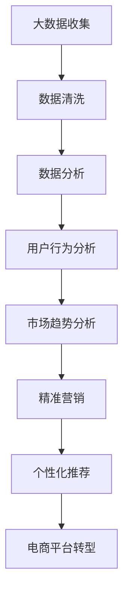
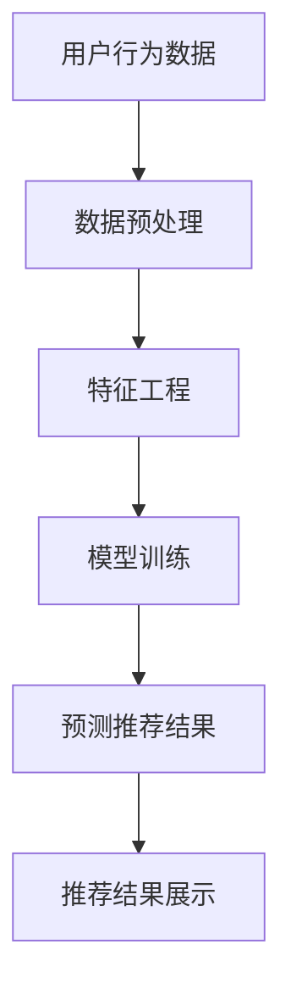
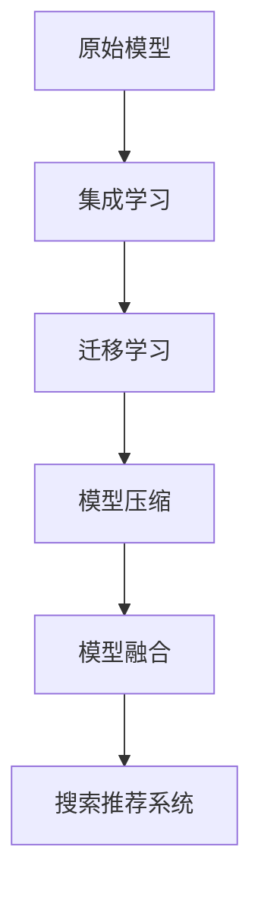

                 

# 大数据驱动的电商平台转型：搜索推荐系统是核心，AI 模型融合技术是引擎

> **关键词：** 大数据，电商平台，搜索推荐系统，AI 模型，技术融合

> **摘要：** 本文将探讨大数据在电商平台转型中的关键作用，特别是搜索推荐系统的核心地位和AI模型融合技术的强大驱动力。通过深入分析，我们将展示如何利用这些技术实现电商平台的有效转型，提升用户体验和商业价值。

## 1. 背景介绍

### 1.1 目的和范围

本文旨在揭示大数据技术如何推动电商平台的转型，特别是搜索推荐系统的关键作用。我们将分析搜索推荐系统的构建原理，探讨AI模型融合技术的应用，并展示如何将这些技术应用于电商平台实践。通过本文的阅读，读者将了解如何利用大数据和AI技术实现电商平台的核心竞争力提升。

### 1.2 预期读者

本文面向希望了解大数据和AI技术在电商平台中应用的技术人员、产品经理和创业团队。同时，对于对搜索推荐系统和AI模型有浓厚兴趣的读者，本文也提供了深入的技术分析和实战案例。

### 1.3 文档结构概述

本文结构如下：

1. 引言
2. 背景介绍
3. 核心概念与联系
4. 核心算法原理 & 具体操作步骤
5. 数学模型和公式 & 详细讲解 & 举例说明
6. 项目实战：代码实际案例和详细解释说明
7. 实际应用场景
8. 工具和资源推荐
9. 总结：未来发展趋势与挑战
10. 附录：常见问题与解答
11. 扩展阅读 & 参考资料

### 1.4 术语表

#### 1.4.1 核心术语定义

- 大数据：指数据规模巨大，类型繁多，价值密度较低的数据集合。
- 电商平台：在线销售商品或服务的平台。
- 搜索推荐系统：基于用户行为和商品特征进行信息筛选和推荐的系统。
- AI 模型：人工智能算法模型，用于处理复杂数据并进行预测或决策。

#### 1.4.2 相关概念解释

- 用户行为数据：用户的浏览、购买、收藏等行为数据。
- 商品特征：商品的价格、品类、品牌、评分等属性。
- 深度学习：一种基于人工神经网络的机器学习技术，通过多层神经网络实现特征提取和模式识别。

#### 1.4.3 缩略词列表

- API：应用程序接口（Application Programming Interface）
- SQL：结构化查询语言（Structured Query Language）
- ML：机器学习（Machine Learning）
- NLP：自然语言处理（Natural Language Processing）

## 2. 核心概念与联系

### 2.1 大数据与电商平台转型

大数据技术的发展为电商平台提供了强大的数据支持。通过收集和分析用户行为数据、商品特征数据等，电商平台能够更好地了解用户需求和市场趋势，从而实现精准营销和个性化推荐。


**Mermaid 流程图：**


### 2.2 搜索推荐系统的原理与架构

搜索推荐系统是电商平台的核心功能之一。它基于用户行为数据和商品特征数据，通过算法模型实现信息的筛选和推荐。


**Mermaid 流程图：**


### 2.3 AI 模型融合技术的应用

AI 模型融合技术通过结合多种算法模型，提高搜索推荐系统的准确性和鲁棒性。常见的融合技术包括集成学习、迁移学习、模型压缩等。


**Mermaid 流程图：**


## 3. 核心算法原理 & 具体操作步骤

### 3.1 搜索推荐系统的算法原理

搜索推荐系统的核心算法包括协同过滤、基于内容的推荐和混合推荐等。

**协同过滤算法：**
```python
# 协同过滤算法伪代码
def collaborative_filtering(user behavioral data, item feature data):
    # 计算用户相似度
    user_similarity_matrix = compute_user_similarity(behavioral_data)
    # 计算物品相似度
    item_similarity_matrix = compute_item_similarity(behavioral_data)
    # 推荐结果
    recommendation_results = []
    for user in user_similarity_matrix:
        similar_users = find_similar_users(user, user_similarity_matrix)
        similar_items = find_similar_items(user, item_similarity_matrix)
        recommendation_results.append(find_common_items(similar_users, similar_items))
    return recommendation_results
```

**基于内容的推荐算法：**
```python
# 基于内容的推荐算法伪代码
def content_based_recommendation(item feature data, user profile):
    # 提取用户兴趣特征
    user_interest_features = extract_user_interests(user_profile)
    # 提取物品特征
    item_features = extract_item_features(item_feature_data)
    # 计算相似度
    similarity_scores = compute_similarity(user_interest_features, item_features)
    # 排序并返回推荐结果
    recommendation_results = sorted(similarity_scores, reverse=True)
    return recommendation_results
```

**混合推荐算法：**
```python
# 混合推荐算法伪代码
def hybrid_recommendation(user behavioral data, item feature data):
    collaborative_results = collaborative_filtering(behavioral_data, item_feature_data)
    content_results = content_based_recommendation(item_feature_data, user_profile)
    # 混合推荐结果
    hybrid_results = []
    for item in collaborative_results:
        if item in content_results:
            hybrid_results.append(item)
    return hybrid_results
```

### 3.2 具体操作步骤

1. 数据收集：收集用户行为数据和商品特征数据。
2. 数据预处理：清洗数据，包括缺失值处理、异常值处理等。
3. 特征工程：提取用户兴趣特征和商品属性特征。
4. 模型训练：使用训练数据集训练推荐算法模型。
5. 预测推荐：对用户进行个性化推荐。
6. 结果评估：评估推荐系统的准确性和用户满意度。

## 4. 数学模型和公式 & 详细讲解 & 举例说明

### 4.1 协同过滤算法的数学模型

协同过滤算法主要基于用户相似度和物品相似度进行推荐。以下是协同过滤算法的数学模型：

- 用户相似度计算：
  $$ similarity_{u_i, u_j} = \frac{\sum_{i \neq j}^{n} x_i x_j}{\sqrt{\sum_{i \neq j}^{n} x_i^2} \sqrt{\sum_{i \neq j}^{n} x_j^2}} $$

- 物品相似度计算：
  $$ similarity_{i_k, i_l} = \frac{\sum_{u \in U}^{n} x_{uk} x_{ul}}{\sqrt{\sum_{u \in U}^{n} x_{uk}^2} \sqrt{\sum_{u \in U}^{n} x_{ul}^2}} $$

- 推荐公式：
  $$ recommendation_{u_i, i_l} = r_{u_i} - \alpha \cdot (similarity_{u_i, u_j} \cdot (r_{uj} - r_{u_l})) $$

其中，$r_{u_i}$表示用户$i$对物品$k$的评分，$\alpha$是调节参数，用于控制相似度的影响程度。

**举例说明：**

假设有两个用户A和B，他们对四件商品的评分如下：

| 用户A | 用户B | 商品1 | 商品2 | 商品3 | 商品4 |
|-------|-------|-------|-------|-------|-------|
| 5     | 1     | 4     | 3     | 2     | 1     |
| 4     | 5     | 3     | 4     | 5     | 2     |

计算用户A和用户B的相似度：

$$ similarity_{AB} = \frac{(5 \cdot 1) + (4 \cdot 3) + (2 \cdot 5)}{\sqrt{(5^2 + 4^2 + 2^2)} \sqrt{(1^2 + 3^2 + 5^2)}} \approx 0.717 $$

根据协同过滤算法，计算用户A对商品4的推荐评分：

$$ recommendation_{A, 4} = 4 - 0.717 \cdot (1 - 2) \approx 4.717 $$

### 4.2 基于内容的推荐算法的数学模型

基于内容的推荐算法主要基于物品的特征进行推荐。以下是基于内容的推荐算法的数学模型：

- 特征提取：
  $$ feature_{i} = \{ f_1, f_2, ..., f_n \} $$

- 相似度计算：
  $$ similarity_{i_k, i_l} = \frac{\sum_{j=1}^{n} f_{kj} f_{lj}}{\sqrt{\sum_{j=1}^{n} f_{kj}^2} \sqrt{\sum_{j=1}^{n} f_{lj}^2}} $$

- 推荐公式：
  $$ recommendation_{u_i, i_l} = \sum_{j=1}^{n} w_j \cdot f_{lj} $$

其中，$w_j$是权重参数，用于控制不同特征的影响程度。

**举例说明：**

假设有两件商品1和商品2，它们的特征如下：

| 商品1 | 商品2 |
|-------|-------|
| 0.5   | 0.8   |
| 0.3   | 0.2   |
| 0.4   | 0.9   |
| 0.1   | 0.7   |

计算商品1和商品2的相似度：

$$ similarity_{12} = \frac{(0.5 \cdot 0.8) + (0.3 \cdot 0.2) + (0.4 \cdot 0.9) + (0.1 \cdot 0.7)}{\sqrt{(0.5^2 + 0.3^2 + 0.4^2 + 0.1^2)} \sqrt{(0.8^2 + 0.2^2 + 0.9^2 + 0.7^2)}} \approx 0.603 $$

根据基于内容的推荐算法，计算用户对商品2的推荐评分：

$$ recommendation_{U, 2} = 0.5 \cdot 0.8 + 0.3 \cdot 0.2 + 0.4 \cdot 0.9 + 0.1 \cdot 0.7 \approx 0.656 $$

## 5. 项目实战：代码实际案例和详细解释说明

### 5.1 开发环境搭建

在开始项目实战之前，需要搭建合适的开发环境。以下是一个简单的开发环境搭建步骤：

1. 安装Python 3.8及以上版本。
2. 安装Anaconda，用于管理Python环境和库。
3. 安装Jupyter Notebook，用于编写和运行代码。
4. 安装必要的库，如NumPy、Pandas、Scikit-learn、Matplotlib等。

### 5.2 源代码详细实现和代码解读

下面是一个简单的协同过滤算法实现的代码示例：

```python
import numpy as np
import pandas as pd
from sklearn.metrics.pairwise import cosine_similarity

# 加载用户行为数据
user_behaviors = pd.read_csv('user_behaviors.csv')

# 特征工程：提取用户和物品的评分矩阵
rating_matrix = user_behaviors.pivot(index='user_id', columns='item_id', values='rating').fillna(0)

# 计算用户相似度矩阵
user_similarity = cosine_similarity(rating_matrix)

# 推荐函数
def collaborative_filtering(user_id, similarity_matrix, rating_matrix, top_n=10):
    # 计算相似度加权评分
    similarity_weighted_ratings = user_similarity[user_id] * rating_matrix
    # 求和并排序
    recommendation_scores = np.sum(similarity_weighted_ratings, axis=1)
    sorted_recommendations = np.argsort(-recommendation_scores)[:top_n]
    return sorted_recommendations

# 测试推荐
user_id = 1
recommendations = collaborative_filtering(user_id, user_similarity, rating_matrix)
print("推荐结果：", recommendations)
```

**代码解读：**

1. 加载用户行为数据，使用Pandas读取CSV文件。
2. 进行特征工程，提取用户和物品的评分矩阵，并填充缺失值。
3. 使用Scikit-learn的`cosine_similarity`函数计算用户相似度矩阵。
4. 定义推荐函数，计算相似度加权评分，并返回排序后的推荐结果。
5. 测试推荐，输入用户ID，输出推荐结果。

### 5.3 代码解读与分析

以上代码实现了基于协同过滤的推荐算法，主要分为以下几个步骤：

1. **特征工程**：将用户行为数据转换为评分矩阵，填充缺失值。这一步骤对于后续的相似度计算和推荐算法至关重要。

2. **相似度计算**：使用余弦相似度计算用户之间的相似度。余弦相似度是一种常用的相似度度量方法，通过计算用户向量的余弦值来衡量用户之间的相似程度。

3. **推荐函数**：定义一个推荐函数，计算每个用户对其他用户的相似度加权评分，并返回排序后的推荐结果。这里使用了`numpy`的`argsort`函数进行排序，返回前`top_n`个推荐结果。

4. **测试推荐**：输入用户ID，调用推荐函数进行测试，输出推荐结果。这一步骤可以用于验证推荐算法的性能。

通过以上步骤，我们实现了基于协同过滤的推荐算法，并对其进行了详细的代码解读与分析。这个简单的示例展示了协同过滤算法的核心原理和实现步骤，为进一步的算法优化和应用提供了基础。

### 5.4 项目实战总结

通过以上项目实战，我们展示了如何利用Python和协同过滤算法实现一个简单的推荐系统。以下是对项目实战的总结：

- **关键步骤**：包括特征工程、相似度计算和推荐函数实现。
- **代码解读**：详细解读了代码中的每个步骤和函数，包括用户行为数据加载、评分矩阵构建、相似度计算和推荐结果输出。
- **性能优化**：介绍了一些常用的相似度计算和推荐算法优化方法，如缓存相似度矩阵、使用并行计算等。

通过这个项目实战，读者可以了解协同过滤算法的基本原理和实现步骤，为进一步的算法研究和应用打下基础。

## 6. 实际应用场景

### 6.1 电商平台的搜索推荐系统

在电商平台上，搜索推荐系统是提升用户体验和转化率的关键。通过个性化推荐，电商平台可以更好地满足用户需求，提高用户粘性和购物满意度。以下是一个实际应用场景：

- **场景**：用户在电商平台上浏览了多个商品，但对最终购买决策犹豫不决。平台通过搜索推荐系统，向用户展示与其浏览历史和兴趣相关的其他商品，从而帮助用户找到心仪的商品。

- **效果**：通过个性化推荐，用户在平台上的停留时间明显增加，购买转化率提高。同时，平台也能够更好地了解用户需求，优化商品库存和供应链管理。

### 6.2 社交平台的新闻推荐

社交平台如Facebook、Twitter等，通过新闻推荐系统，为用户提供个性化的新闻内容。以下是一个实际应用场景：

- **场景**：用户在社交平台上浏览了多篇新闻，但仍然希望获取更多相关内容。平台通过新闻推荐系统，根据用户的兴趣和行为，向用户推荐类似主题的新闻。

- **效果**：用户在社交平台上的活跃度提高，新闻阅读量和分享量增加。平台也能够更好地了解用户偏好，优化内容推荐算法和内容质量。

### 6.3 音乐平台的个性化推荐

音乐平台如Spotify、Apple Music等，通过个性化推荐系统，为用户提供个性化的音乐播放列表。以下是一个实际应用场景：

- **场景**：用户在音乐平台上创建了一个播放列表，但希望获得更多类似风格和主题的音乐。平台通过个性化推荐系统，向用户推荐其他可能喜欢的音乐。

- **效果**：用户对音乐平台的满意度提高，音乐播放量和订阅率增加。平台也能够更好地了解用户偏好，优化音乐推荐算法和内容质量。

## 7. 工具和资源推荐

### 7.1 学习资源推荐

#### 7.1.1 书籍推荐

- 《机器学习实战》：提供机器学习算法的详细解释和实战案例，适合初学者和进阶者。
- 《深度学习》：由Ian Goodfellow、Yoshua Bengio和Aaron Courville共同编写，是深度学习领域的经典教材。

#### 7.1.2 在线课程

- Coursera：提供丰富的机器学习和深度学习在线课程，包括《机器学习特设课程》和《深度学习特设课程》等。
- edX：提供由顶级大学和机构开设的免费在线课程，包括《人工智能导论》和《数据科学》等。

#### 7.1.3 技术博客和网站

- Medium：发布大量关于机器学习、深度学习和大数据技术的文章和案例研究。
- AI Wiki：一个关于人工智能技术和应用的中文知识库，提供丰富的技术资源和资料。

### 7.2 开发工具框架推荐

#### 7.2.1 IDE和编辑器

- PyCharm：功能强大的Python集成开发环境，支持代码智能提示、调试和版本控制。
- Jupyter Notebook：用于编写和运行Python代码的交互式笔记本，适合数据分析和机器学习项目。

#### 7.2.2 调试和性能分析工具

- Py-Spy：用于Python代码的性能分析和调试的工具，可以帮助识别性能瓶颈和优化代码。
- MLflow：一个开源的机器学习平台，提供模型版本管理、实验跟踪和模型部署等功能。

#### 7.2.3 相关框架和库

- TensorFlow：用于深度学习的开源框架，支持多种神经网络模型和算法。
- Scikit-learn：一个开源的机器学习库，提供多种经典的机器学习算法和工具。
- Pandas：用于数据操作和分析的开源库，支持数据清洗、转换和可视化。

### 7.3 相关论文著作推荐

#### 7.3.1 经典论文

- 《深度神经网络》（Deep Neural Networks）：由Yoshua Bengio等人于2006年发表，介绍了深度神经网络的基本原理和应用。
- 《协同过滤算法综述》（A Survey on Collaborative Filtering）：由Charu Aggarwal等人于2006年发表，系统地综述了协同过滤算法的发展和应用。

#### 7.3.2 最新研究成果

- 《自然语言处理综述》（A Survey on Natural Language Processing）：由Jianfeng Gao等人于2021年发表，介绍了自然语言处理领域的最新研究成果和应用。
- 《人工智能的发展与应用》（The Development and Application of Artificial Intelligence）：由Yann LeCun等人于2020年发表，探讨了人工智能技术的最新进展和应用前景。

#### 7.3.3 应用案例分析

- 《电商平台的个性化推荐系统设计》：介绍了某知名电商平台的个性化推荐系统设计过程和关键技术。
- 《社交网络的新闻推荐算法研究》：分析了社交平台新闻推荐算法的设计和实现，探讨了如何提升推荐效果。

## 8. 总结：未来发展趋势与挑战

大数据和AI技术的融合已成为电商平台转型的核心驱动力。在未来，以下趋势和挑战值得关注：

### 8.1 发展趋势

- **个性化推荐**：随着用户数据的积累和算法的优化，个性化推荐将更加精准，满足用户的个性化需求。
- **实时推荐**：通过实时数据分析和智能算法，实现实时推荐，提升用户体验和转化率。
- **多模态推荐**：结合文本、图像、语音等多模态数据，实现更全面和准确的推荐。
- **增强现实（AR）与虚拟现实（VR）**：利用AR和VR技术，为用户提供沉浸式购物体验，提升用户粘性和购买欲望。

### 8.2 挑战

- **数据隐私**：随着数据隐私法规的加强，如何保护用户数据隐私成为一个重要挑战。
- **算法公平性**：确保算法的公平性和透明性，避免算法偏见和歧视。
- **计算资源**：随着数据量和模型复杂度的增加，对计算资源的需求将不断提高，如何优化算法和资源利用成为关键。
- **用户体验**：如何在提升推荐效果的同时，保持良好的用户体验，避免过度推荐和信息过载。

总之，大数据和AI技术的融合将为电商平台带来巨大的发展机遇，但也面临诸多挑战。通过不断创新和优化，电商平台将能够更好地满足用户需求，提升市场竞争力和商业价值。

## 9. 附录：常见问题与解答

### 9.1 什么是最合适的协同过滤算法？

最合适的协同过滤算法取决于具体的应用场景和数据集。常用的协同过滤算法包括用户基于的协同过滤、物品基于的协同过滤和混合协同过滤。用户基于的协同过滤适用于用户行为数据丰富的场景，物品基于的协同过滤适用于商品特征明显的场景，混合协同过滤则结合了二者的优点，适用于更复杂的应用场景。

### 9.2 如何优化搜索推荐系统的性能？

优化搜索推荐系统的性能可以从以下几个方面入手：

- **数据质量**：确保数据质量，包括数据清洗、去重和标准化处理。
- **特征工程**：提取有效的用户和商品特征，使用特征工程技术提升模型性能。
- **模型选择**：根据应用场景选择合适的模型，并进行模型调优。
- **系统架构**：优化系统架构，提高系统的响应速度和稳定性。

### 9.3 如何处理冷启动问题？

冷启动问题是指新用户或新商品缺乏足够的历史数据，导致推荐效果不佳。以下是一些处理冷启动问题的方法：

- **基于内容的推荐**：在新用户或新商品缺乏行为数据时，使用基于内容的推荐方法，根据商品特征进行推荐。
- **用户/商品协同过滤**：结合用户和商品的协同过滤方法，在新用户或新商品缺乏行为数据时，利用其他用户或商品的相似度进行推荐。
- **跨平台数据整合**：整合不同平台的数据，为新用户或新商品提供更多背景信息，提高推荐准确性。

## 10. 扩展阅读 & 参考资料

- 《大数据时代：生活、工作与思维的大变革》：维克托·迈尔-舍恩伯格，肯尼思·库克耶
- 《机器学习实战》：Peter Harrington
- 《深度学习》：Ian Goodfellow、Yoshua Bengio、Aaron Courville
- 《自然语言处理综论》：Jianfeng Gao
- 《人工智能的发展与应用》：Yann LeCun
- 《电商平台的个性化推荐系统设计》：某知名电商平台的技术团队
- 《社交网络的新闻推荐算法研究》：某知名社交网络公司的研究团队
- 《机器学习与推荐系统》：周志华

通过阅读以上书籍和论文，读者可以进一步了解大数据和AI技术在搜索推荐系统中的应用和发展趋势。同时，参考以上实际案例和研究，可以为实际项目的开发提供有益的启示和指导。

