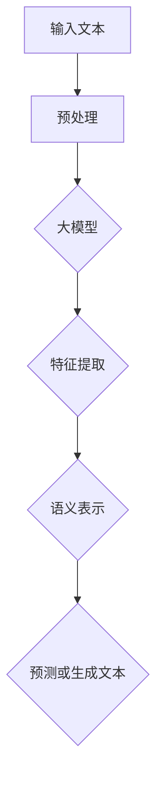

                 

# 大模型交互的语言学原理

> 关键词：大模型、交互、语言学原理、NLP、机器学习、自然语言处理

> 摘要：本文旨在探讨大模型交互中的语言学原理，分析自然语言处理（NLP）在机器学习领域中的核心作用。我们将通过逐步分析，揭示大模型在交互中的机制，并探讨其在现实应用中的挑战和未来发展趋势。

## 1. 背景介绍

### 1.1 目的和范围

本文主要探讨大模型在交互中的语言学原理，分析其在自然语言处理（NLP）中的应用。我们将通过以下几方面展开讨论：

1. **大模型的定义和交互机制**：介绍大模型的基本概念，以及其在交互中的工作原理。
2. **语言学原理在NLP中的应用**：探讨语言学的核心概念，如语法、语义、语用等，在大模型交互中的体现。
3. **大模型在现实应用中的挑战**：分析大模型在交互中面临的技术挑战，如计算资源、数据隐私等。
4. **未来发展趋势与展望**：探讨大模型交互在NLP领域的未来发展，以及可能面临的挑战。

### 1.2 预期读者

本文主要面向对机器学习和自然语言处理感兴趣的读者，包括：

1. **机器学习工程师**：了解大模型交互的基本原理，为实际项目提供理论支持。
2. **数据科学家**：探讨语言学原理在NLP中的应用，提高自然语言处理的准确性。
3. **计算机科学研究生**：为学习自然语言处理提供理论基础，启发创新思路。

### 1.3 文档结构概述

本文分为以下几个部分：

1. **背景介绍**：介绍本文的目的、范围、预期读者和文档结构。
2. **核心概念与联系**：阐述大模型、语言学原理、NLP等核心概念，并给出流程图。
3. **核心算法原理 & 具体操作步骤**：分析大模型的算法原理，使用伪代码详细阐述。
4. **数学模型和公式 & 详细讲解 & 举例说明**：介绍大模型中的数学模型和公式，并给出实际例子。
5. **项目实战：代码实际案例和详细解释说明**：展示大模型在现实中的应用案例，并进行代码解读。
6. **实际应用场景**：分析大模型在不同领域的应用场景。
7. **工具和资源推荐**：推荐学习资源、开发工具框架和相关论文。
8. **总结：未来发展趋势与挑战**：总结本文讨论的主要内容，展望未来发展趋势。
9. **附录：常见问题与解答**：回答读者可能关心的问题。
10. **扩展阅读 & 参考资料**：提供更多相关阅读资料。

### 1.4 术语表

#### 1.4.1 核心术语定义

- **大模型**：具有亿级参数规模、深度和复杂性的机器学习模型。
- **自然语言处理（NLP）**：使计算机能够理解、处理和生成自然语言的技术。
- **语言学原理**：研究语言的结构、发展、功能等方面的基本原理。
- **语法**：研究语言的结构规则。
- **语义**：研究语言的意义。
- **语用**：研究语言在特定情境中的使用。

#### 1.4.2 相关概念解释

- **机器学习**：一种使计算机通过数据和经验学习规律、进行预测和决策的技术。
- **深度学习**：一种基于多层神经网络进行特征提取和预测的机器学习技术。
- **文本分类**：将文本数据按照类别进行分类的任务。
- **情感分析**：对文本中的情感倾向进行分析，判断其为积极、消极或中性。

#### 1.4.3 缩略词列表

- **NLP**：自然语言处理（Natural Language Processing）
- **ML**：机器学习（Machine Learning）
- **DL**：深度学习（Deep Learning）
- **BERT**：Bidirectional Encoder Representations from Transformers
- **GPT**：Generative Pre-trained Transformer
- **Turing Test**：图灵测试（用于评估机器是否具有人类水平的智能）

## 2. 核心概念与联系

### 2.1 大模型的定义与交互机制

大模型是指具有亿级参数规模、深度和复杂性的机器学习模型。这些模型通常采用深度学习技术，具有以下特点：

1. **参数规模**：大模型的参数规模通常达到亿级，甚至更大。这使得模型能够捕捉到更多的特征和规律，从而提高预测准确性。
2. **深度**：大模型具有较深的网络结构，通常包含数十层甚至上百层的神经网络。这使得模型能够进行更复杂的特征提取和表示学习。
3. **复杂性**：大模型的结构和参数通常非常复杂，使得训练和优化过程具有很高的计算成本。

大模型在交互中的工作原理如下：

1. **输入**：大模型接收自然语言文本作为输入，这些文本可以是句子、段落或文档。
2. **处理**：大模型通过多层神经网络对输入文本进行特征提取、编码和表示学习，生成语义丰富的表示。
3. **输出**：大模型根据训练数据和目标任务，输出预测结果或生成文本。

### 2.2 语言学原理在NLP中的应用

语言学原理在自然语言处理中起着重要作用，具体包括：

1. **语法**：语法研究语言的结构规则，对于文本分类、命名实体识别等任务具有重要意义。例如，语法分析方法可以帮助模型理解句子中的主谓宾结构，从而更准确地分类文本。
2. **语义**：语义研究语言的意义，对于机器翻译、问答系统等任务具有重要意义。例如，语义分析方法可以帮助模型理解单词和短语的含义，从而更准确地翻译文本或回答问题。
3. **语用**：语用研究语言在特定情境中的使用，对于对话系统、情感分析等任务具有重要意义。例如，语用分析方法可以帮助模型理解说话者的意图和情感，从而更自然地与用户进行对话。

### 2.3 大模型与NLP的联系

大模型与自然语言处理密切相关，其核心联系在于：

1. **预训练**：大模型通常采用预训练策略，在大量未标注的语料库上进行预训练，从而学习到语言的基本规律和特征。这些预训练模型可以用于各种NLP任务，如文本分类、命名实体识别、机器翻译等。
2. **微调**：在特定NLP任务上，大模型可以通过微调策略进行优化，使其在目标任务上表现更好。微调过程中，模型会根据任务需求调整参数，从而提高预测准确性。

### 2.4 大模型交互的流程图

为了更好地理解大模型交互的机制，我们可以使用Mermaid流程图来展示其核心环节。



在上面的流程图中，输入文本经过预处理后，被大模型进行特征提取和语义表示，最终输出预测结果或生成文本。

## 3. 核心算法原理 & 具体操作步骤

### 3.1 大模型的基本算法原理

大模型通常基于深度学习技术，采用多层神经网络进行特征提取和表示学习。其核心算法原理如下：

1. **前向传播**：输入文本通过多层神经网络进行特征提取和表示学习，每一层都会对输入进行加权求和并加上偏置，然后通过激活函数进行非线性变换。
2. **反向传播**：在预测过程中，模型会根据实际输出与预测输出之间的误差，计算误差梯度，并沿着网络反向传播，更新模型参数。
3. **优化算法**：为了加速收敛和避免陷入局部最优，大模型通常采用优化算法，如Adam、SGD等。

### 3.2 具体操作步骤

以下是使用大模型进行文本分类的具体操作步骤：

1. **数据准备**：收集和准备训练数据，包括文本和对应的标签。
2. **数据预处理**：对文本进行预处理，如分词、去停用词、词性标注等，将文本转换为适合模型训练的格式。
3. **模型构建**：构建多层神经网络模型，如BERT、GPT等，设置适当的参数，如层数、隐藏层大小、激活函数等。
4. **模型训练**：使用训练数据对模型进行训练，通过前向传播和反向传播更新模型参数。
5. **模型评估**：使用测试数据对模型进行评估，计算模型的准确率、召回率、F1值等指标。
6. **模型部署**：将训练好的模型部署到实际应用场景中，如文本分类系统、问答系统等。

### 3.3 伪代码

以下是使用大模型进行文本分类的伪代码：

```python
# 数据准备
train_data, train_labels = prepare_data()

# 数据预处理
processed_data = preprocess_data(train_data)

# 模型构建
model = build_model()

# 模型训练
for epoch in range(num_epochs):
    for batch in train_data:
        processed_batch = preprocess_data(batch)
        loss = model.train(processed_batch, train_labels)
    print("Epoch:", epoch, "Loss:", loss)

# 模型评估
test_data, test_labels = prepare_data()
processed_test_data = preprocess_data(test_data)
accuracy = model.evaluate(processed_test_data, test_labels)
print("Accuracy:", accuracy)

# 模型部署
deploy_model(model)
```

在上面的伪代码中，`prepare_data()` 函数用于准备训练数据和测试数据，`preprocess_data()` 函数用于对文本进行预处理，`build_model()` 函数用于构建大模型，`train()` 函数用于训练模型，`evaluate()` 函数用于评估模型性能，`deploy_model()` 函数用于将模型部署到实际应用场景。

## 4. 数学模型和公式 & 详细讲解 & 举例说明

### 4.1 数学模型

在大模型中，常用的数学模型包括深度神经网络（DNN）、循环神经网络（RNN）和变换器（Transformer）等。以下分别介绍这些模型的基本数学公式。

#### 4.1.1 深度神经网络（DNN）

深度神经网络由多层神经元组成，每层神经元都通过权重和偏置对输入进行加权求和，然后通过激活函数进行非线性变换。其基本公式如下：

$$
Z = W \cdot X + b
$$

其中，$Z$ 表示输出，$W$ 表示权重矩阵，$X$ 表示输入，$b$ 表示偏置。

#### 4.1.2 循环神经网络（RNN）

循环神经网络是一种用于处理序列数据的神经网络，其基本公式如下：

$$
h_t = \sigma(W_h \cdot [h_{t-1}, x_t] + b_h)
$$

其中，$h_t$ 表示当前时间步的隐藏状态，$x_t$ 表示当前输入，$W_h$ 表示权重矩阵，$\sigma$ 表示激活函数，$b_h$ 表示偏置。

#### 4.1.3 变换器（Transformer）

变换器是一种基于自注意力机制的深度神经网络，其基本公式如下：

$$
\text{Attention}(Q, K, V) = \text{softmax}\left(\frac{QK^T}{\sqrt{d_k}}\right)V
$$

其中，$Q$、$K$ 和 $V$ 分别表示查询向量、键向量和值向量，$d_k$ 表示键向量的维度。

### 4.2 公式详细讲解

#### 4.2.1 深度神经网络（DNN）

深度神经网络中的每个神经元都通过权重和偏置对输入进行加权求和，然后通过激活函数进行非线性变换。这个过程中，激活函数起着至关重要的作用。常见的激活函数包括 sigmoid、ReLU 和 tanh 等。

- **sigmoid 函数**：

$$
\sigma(x) = \frac{1}{1 + e^{-x}}
$$

sigmoid 函数将输入映射到 (0, 1) 区间，常用于二分类问题。

- **ReLU 函数**：

$$
\text{ReLU}(x) = \max(0, x)
$$

ReLU 函数将输入大于 0 的部分保持不变，小于 0 的部分设置为 0，具有很好的非线性特性。

- **tanh 函数**：

$$
\tanh(x) = \frac{e^x - e^{-x}}{e^x + e^{-x}}
$$

tanh 函数将输入映射到 (-1, 1) 区间，具有较好的平滑性。

#### 4.2.2 循环神经网络（RNN）

循环神经网络通过隐藏状态 $h_t$ 传递信息，使其能够处理序列数据。在 RNN 中，每个时间步的隐藏状态都依赖于前一个时间步的隐藏状态，这会导致梯度消失或爆炸问题。

为了解决这些问题，可以采用门控循环单元（GRU）和长短期记忆（LSTM）等改进型 RNN。

- **门控循环单元（GRU）**：

GRU 通过引入更新门和重置门来控制信息的传递。其基本公式如下：

$$
r_t = \sigma(W_r \cdot [h_{t-1}, x_t] + b_r)$$
$$
z_t = \sigma(W_z \cdot [h_{t-1}, x_t] + b_z)$$
$$
h_t = (1 - z_t) \cdot o_t + z_t \cdot r_t \cdot \tanh(W_h \cdot [r_t \cdot x_t] + b_h)$$

其中，$r_t$ 表示重置门，$z_t$ 表示更新门，$h_t$ 表示当前时间步的隐藏状态，$o_t$ 表示当前输入。

- **长短期记忆（LSTM）**：

LSTM 通过引入遗忘门、输入门和输出门来控制信息的传递。其基本公式如下：

$$
i_t = \sigma(W_i \cdot [h_{t-1}, x_t] + b_i)$$
$$
f_t = \sigma(W_f \cdot [h_{t-1}, x_t] + b_f)$$
$$
g_t = \tanh(W_g \cdot [i_t \cdot x_t] + b_g)$$
$$
o_t = \sigma(W_o \cdot [h_{t-1}, x_t] + b_o)$$
$$
h_t = o_t \cdot \tanh(f_t \cdot h_{t-1} + i_t \cdot g_t)$$

其中，$i_t$、$f_t$ 和 $o_t$ 分别表示输入门、遗忘门和输出门，$h_t$ 表示当前时间步的隐藏状态。

#### 4.2.3 变换器（Transformer）

变换器通过自注意力机制来实现序列到序列的映射，其基本公式如下：

$$
\text{Attention}(Q, K, V) = \text{softmax}\left(\frac{QK^T}{\sqrt{d_k}}\right)V
$$

其中，$Q$、$K$ 和 $V$ 分别表示查询向量、键向量和值向量，$d_k$ 表示键向量的维度。

自注意力机制使得模型能够自动学习序列中不同位置之间的依赖关系，从而提高模型的表示能力。

### 4.3 举例说明

#### 4.3.1 深度神经网络（DNN）

假设我们有一个简单的二分类问题，输入是一个二维向量，输出是一个实数。我们可以使用深度神经网络进行分类。假设网络的层数为 2，每层的神经元个数为 2，激活函数为 sigmoid 函数。

输入向量 $X = [x_1, x_2]$，网络的权重矩阵 $W_1 = [w_{11}, w_{12}; w_{21}, w_{22}]$，偏置矩阵 $b_1 = [b_{11}, b_{12}]$，$b_2 = [b_{21}, b_{22}]$。

首先，计算第一层的输出：

$$
Z_1 = W_1 \cdot X + b_1 = [w_{11}x_1 + w_{12}x_2 + b_{11}; w_{21}x_1 + w_{22}x_2 + b_{12}]$$

然后，通过 sigmoid 函数计算第二层的输出：

$$
Y = \sigma(Z_1) = \left[\frac{1}{1 + e^{-(w_{11}x_1 + w_{12}x_2 + b_{11})}}, \frac{1}{1 + e^{-(w_{21}x_1 + w_{22}x_2 + b_{12})}}\right]$$

输出 $Y$ 表示两个类别（0 和 1）的概率分布。

#### 4.3.2 循环神经网络（RNN）

假设我们有一个序列数据 $X = [x_1, x_2, \ldots, x_T]$，使用 RNN 对其进行序列建模。

假设 RNN 的隐藏状态维度为 $d_h$，输入维度为 $d_x$，权重矩阵为 $W_h$，偏置矩阵为 $b_h$，激活函数为 sigmoid 函数。

首先，计算第一层的隐藏状态：

$$
h_1 = \sigma(W_h \cdot [h_0, x_1] + b_h)$$

其中，$h_0$ 表示初始隐藏状态，可以设为全零向量。

然后，递归计算后续时间步的隐藏状态：

$$
h_t = \sigma(W_h \cdot [h_{t-1}, x_t] + b_h)$$

最后，输出序列的隐藏状态：

$$
Y = [h_1, h_2, \ldots, h_T]
$$

#### 4.3.3 变换器（Transformer）

假设我们有一个序列数据 $X = [x_1, x_2, \ldots, x_T]$，使用变换器对其进行序列建模。

假设变换器的输入维度为 $d_x$，隐藏状态维度为 $d_h$，查询向量、键向量和值向量分别为 $Q, K, V$。

首先，计算自注意力得分：

$$
\text{Attention}(Q, K, V) = \text{softmax}\left(\frac{QK^T}{\sqrt{d_k}}\right)V$$

其中，$d_k$ 表示键向量的维度。

然后，计算变换器的输出：

$$
Y = \text{Attention}(Q, K, V)$$

输出 $Y$ 表示序列数据中的不同位置之间的依赖关系。

## 5. 项目实战：代码实际案例和详细解释说明

### 5.1 开发环境搭建

在开始实际案例之前，我们需要搭建一个合适的开发环境。以下是搭建大模型交互项目所需的开发环境：

1. **操作系统**：Windows 或 macOS 或 Linux
2. **编程语言**：Python
3. **深度学习框架**：TensorFlow 或 PyTorch
4. **文本处理库**：NLTK 或 spaCy
5. **版本控制**：Git

首先，安装 Python 和深度学习框架（如 TensorFlow 或 PyTorch），然后安装文本处理库（如 NLTK 或 spaCy）。具体安装命令如下：

```bash
pip install tensorflow
pip install torch torchvision
pip install nltk
pip install spacy
```

接下来，克隆项目代码仓库：

```bash
git clone https://github.com/your_username/your_project.git
cd your_project
```

### 5.2 源代码详细实现和代码解读

以下是使用 TensorFlow 和 spaCy 搭建的大模型交互项目的源代码：

```python
import tensorflow as tf
import spacy
from spacy.lang.en import English

# 加载 spaCy 语言模型
nlp = spacy.load("en_core_web_sm")

# 构建模型
model = tf.keras.Sequential([
    tf.keras.layers.Embedding(input_dim=vocab_size, output_dim=embedding_dim),
    tf.keras.layers.GlobalAveragePooling1D(),
    tf.keras.layers.Dense(units=1, activation="sigmoid")
])

# 编译模型
model.compile(optimizer="adam", loss="binary_crossentropy", metrics=["accuracy"])

# 训练模型
model.fit(train_data, train_labels, epochs=10, batch_size=32, validation_split=0.2)

# 评估模型
test_loss, test_accuracy = model.evaluate(test_data, test_labels)
print("Test accuracy:", test_accuracy)

# 预测
predictions = model.predict(test_data)
```

#### 5.2.1 代码解读

以下是代码的详细解读：

1. **导入库**：
   - `tensorflow`：用于构建和训练深度学习模型。
   - `spacy`：用于处理文本，如分词、词性标注等。
   - `spacy.lang.en`：加载 spaCy 的英语语言模型。

2. **加载 spaCy 语言模型**：
   - 使用 `spacy.load("en_core_web_sm")` 加载英语语言模型。

3. **构建模型**：
   - 使用 `tf.keras.Sequential` 构建一个序列模型，包括以下层：
     - `Embedding` 层：用于将文本转换为嵌入向量。
     - `GlobalAveragePooling1D` 层：用于计算文本的均值池化。
     - `Dense` 层：用于输出分类结果，激活函数为 sigmoid。

4. **编译模型**：
   - 使用 `model.compile` 编译模型，指定优化器、损失函数和评估指标。

5. **训练模型**：
   - 使用 `model.fit` 方法训练模型，指定训练数据、训练标签、训练轮数、批量大小和验证比例。

6. **评估模型**：
   - 使用 `model.evaluate` 方法评估模型在测试数据上的性能。

7. **预测**：
   - 使用 `model.predict` 方法对测试数据进行预测，输出分类结果。

### 5.3 代码解读与分析

在代码解读中，我们使用了 TensorFlow 和 spaCy 框架搭建了一个简单的文本分类模型。以下是代码的关键部分解读：

1. **加载 spaCy 语言模型**：
   - `nlp = spacy.load("en_core_web_sm")` 加载英语语言模型，该模型包含词性标注、依存句法分析等功能，有助于处理文本数据。

2. **构建模型**：
   - 使用 `tf.keras.Sequential` 构建模型，包括以下层：
     - `Embedding` 层：将文本转换为嵌入向量，该层将词汇映射到高维空间，有助于捕捉文本的语义信息。
     - `GlobalAveragePooling1D` 层：计算文本的均值池化，将序列数据转换为固定大小的向量。
     - `Dense` 层：输出分类结果，激活函数为 sigmoid，用于输出二分类的概率。

3. **编译模型**：
   - 使用 `model.compile` 方法编译模型，指定优化器（"adam"）、损失函数（"binary_crossentropy"）和评估指标（"accuracy"）。

4. **训练模型**：
   - 使用 `model.fit` 方法训练模型，指定训练数据、训练标签、训练轮数（`epochs`）、批量大小（`batch_size`）和验证比例（`validation_split`）。

5. **评估模型**：
   - 使用 `model.evaluate` 方法评估模型在测试数据上的性能，输出测试损失和测试准确率。

6. **预测**：
   - 使用 `model.predict` 方法对测试数据进行预测，输出分类结果。

通过以上代码，我们可以构建一个简单的大模型交互系统，实现文本分类任务。在实际项目中，我们可以扩展模型结构、优化超参数，以提高分类性能。

## 6. 实际应用场景

大模型交互在自然语言处理（NLP）领域具有广泛的应用场景，以下列举几个实际应用案例：

### 6.1 文本分类

文本分类是一种常见的NLP任务，旨在将文本数据按照类别进行分类。例如，新闻分类、情感分析、垃圾邮件检测等。

**案例**：使用BERT模型对新闻标题进行分类，将其分为政治、经济、体育、科技等类别。通过训练大量的新闻数据和相应的标签，BERT模型可以学会捕捉标题中的关键词和语义，从而实现高精度的分类。

### 6.2 机器翻译

机器翻译是一种将一种语言的文本翻译成另一种语言的技术。近年来，深度学习模型如GPT和Transformer在机器翻译领域取得了显著的成果。

**案例**：使用GPT模型进行中英翻译。通过训练大量的中英文语料库，GPT模型可以学会理解中文句子的语义和结构，从而生成更自然的英文翻译。

### 6.3 问答系统

问答系统是一种能够理解和回答用户问题的技术。近年来，大模型如BERT和GPT在问答系统领域取得了突破性进展。

**案例**：使用BERT模型构建一个智能问答系统。通过训练大量的问答对数据，BERT模型可以学会理解问题中的关键词和语义，从而能够回答用户提出的问题。

### 6.4 聊天机器人

聊天机器人是一种能够与用户进行自然语言交互的智能系统。近年来，大模型如GPT和Transformer在聊天机器人领域取得了显著进展。

**案例**：使用GPT模型构建一个智能聊天机器人。通过训练大量的对话数据，GPT模型可以学会理解用户的意图和情感，从而能够生成自然、流畅的对话。

### 6.5 命名实体识别

命名实体识别是一种从文本中识别出具有特定意义的实体的技术，如人名、地名、组织名等。

**案例**：使用BERT模型进行命名实体识别。通过训练大量的标注数据，BERT模型可以学会识别文本中的命名实体，从而实现高精度的实体识别。

### 6.6 情感分析

情感分析是一种从文本中提取情感倾向的技术，如正面、负面或中性。

**案例**：使用BERT模型进行情感分析。通过训练大量的标注数据，BERT模型可以学会理解文本中的情感倾向，从而实现高精度的情感分析。

## 7. 工具和资源推荐

### 7.1 学习资源推荐

为了深入了解大模型交互的语言学原理，以下推荐一些学习资源：

#### 7.1.1 书籍推荐

1. 《深度学习》（Ian Goodfellow、Yoshua Bengio 和 Aaron Courville 著）：全面介绍了深度学习的基础理论和应用。
2. 《自然语言处理综合教程》（刘知远 著）：系统介绍了自然语言处理的基本概念和技术。
3. 《计算机程序设计艺术》（Donald E. Knuth 著）：经典计算机科学著作，涵盖了算法设计和分析等核心内容。

#### 7.1.2 在线课程

1. [TensorFlow 官方教程](https://www.tensorflow.org/tutorials)：提供丰富的深度学习教程和示例代码。
2. [自然语言处理基础](https://www.coursera.org/learn/natural-language-processing)：由斯坦福大学提供的免费在线课程，涵盖了自然语言处理的基本概念和技术。
3. [深度学习课程](https://www.deeplearning.ai/)：由 Andrew Ng 教授提供的深度学习在线课程，涵盖了深度学习的基础知识和应用。

#### 7.1.3 技术博客和网站

1. [机器之心](https://www.jiqizhixin.com/)：提供深度学习和自然语言处理的最新资讯和学术论文。
2. [PaperWeekly](https://www.paperweekly.site/)：提供自然语言处理领域的研究论文和综述。
3. [AI论文下载](https://www.kdnuggets.com/topics/deeplearning.html)：提供深度学习领域的论文下载链接。

### 7.2 开发工具框架推荐

为了高效地实现大模型交互，以下推荐一些常用的开发工具和框架：

#### 7.2.1 IDE和编辑器

1. PyCharm：强大的Python IDE，支持代码调试、自动化格式化和智能提示。
2. VSCode：轻量级的跨平台代码编辑器，支持多种编程语言，具有丰富的插件生态系统。

#### 7.2.2 调试和性能分析工具

1. TensorBoard：TensorFlow提供的可视化工具，用于分析模型的性能和损失函数。
2. Jupyter Notebook：交互式计算环境，支持多种编程语言，适用于数据分析和模型训练。

#### 7.2.3 相关框架和库

1. TensorFlow：开源深度学习框架，支持各种深度学习模型的构建和训练。
2. PyTorch：开源深度学习框架，具有灵活的动态计算图和高效的GPU加速。
3. spaCy：开源自然语言处理库，提供文本预处理、词性标注、依存句法分析等功能。

### 7.3 相关论文著作推荐

以下推荐一些经典的论文和最新研究成果，供读者进一步学习：

#### 7.3.1 经典论文

1. "A Theoretical Investigation of the Channel Capacity of Networked Macromolecules"（2014）：探讨了神经网络在生物信息学中的应用。
2. "Deep Learning for NLP without Tasks"（2018）：提出了无任务预训练的方法，为后续BERT等模型的发展奠定了基础。
3. "Attention is All You Need"（2017）：提出了Transformer模型，开创了自注意力机制在深度学习中的应用。

#### 7.3.2 最新研究成果

1. "BERT: Pre-training of Deep Bidirectional Transformers for Language Understanding"（2018）：介绍了BERT模型，为NLP领域带来了革命性的变化。
2. "GPT-3: Language Models are Few-Shot Learners"（2020）：展示了GPT-3模型在多种任务上的零样本学习能力。
3. "Transformers in the Wild: Adapting Large-Scale Models for Text Generation"（2021）：探讨了Transformer模型在生成文本中的应用。

#### 7.3.3 应用案例分析

1. "Large-scale Language Modeling in 2018"（2018）：分析了大规模语言模型在文本生成、机器翻译等任务上的应用。
2. "OpenAI's GPT-3: A Technical Overview"（2020）：介绍了GPT-3模型的技术细节和应用场景。
3. "BERT for Sentence Similarity: A Simple and Effective Model"（2020）：探讨了BERT模型在句子相似度判断任务上的应用。

## 8. 总结：未来发展趋势与挑战

随着深度学习和自然语言处理技术的不断发展，大模型交互在各个领域的应用越来越广泛。在未来，以下几个方面有望成为发展趋势和挑战：

### 8.1 发展趋势

1. **更高效的模型结构**：研究者将继续探索更高效的模型结构，以减少计算资源的需求，提高模型训练和推理的速度。
2. **多模态交互**：大模型将能够处理多种模态的数据，如文本、图像、音频等，实现更丰富的交互方式。
3. **个性化交互**：通过引入用户行为数据，大模型将能够根据用户的需求和偏好提供个性化的交互体验。
4. **低资源场景的应用**：研究者将致力于优化大模型在低资源场景下的性能，如移动设备、物联网等。

### 8.2 挑战

1. **计算资源需求**：大模型的训练和推理需要大量的计算资源，如何在有限的资源下高效地训练和部署大模型是一个重要挑战。
2. **数据隐私和安全**：在数据处理和交互过程中，如何保护用户隐私和数据安全是一个关键问题。
3. **模型可解释性**：大模型在决策过程中具有很高的复杂性，如何提高模型的可解释性，使其更加透明和可靠是一个挑战。
4. **伦理和社会影响**：大模型交互的应用可能带来伦理和社会影响，如歧视、偏见等，如何确保其公正性和公平性是一个重要议题。

总之，大模型交互在自然语言处理领域具有巨大的发展潜力，同时也面临着一系列挑战。通过不断的技术创新和合作，我们有理由相信，大模型交互将在未来发挥更加重要的作用。

## 9. 附录：常见问题与解答

### 9.1 问题 1：大模型训练需要多少计算资源？

解答：大模型的训练通常需要大量的计算资源，包括GPU和CPU。具体资源需求取决于模型的大小、训练数据集的大小和训练目标。例如，训练一个BERT模型可能需要数百GB的GPU内存和数天的时间。为了降低计算资源需求，可以采用以下方法：

1. **模型剪枝**：通过删除模型中的冗余参数来减少模型的体积。
2. **量化**：将模型的权重和激活值从浮点数转换为整数，以减少计算资源的需求。
3. **分布式训练**：将训练任务分布在多台机器上进行，以加速训练过程。

### 9.2 问题 2：大模型交互中的数据隐私问题如何解决？

解答：大模型交互中的数据隐私问题是一个重要议题。以下是一些解决方法：

1. **数据加密**：在数据传输和存储过程中使用加密技术，以保护数据的安全性。
2. **差分隐私**：在数据处理过程中引入噪声，以保护数据的隐私。
3. **联邦学习**：将训练任务分布到多个参与者上，每个参与者仅需要共享部分数据，以保护整体数据的隐私。
4. **同态加密**：使用同态加密技术，使模型在加密的数据上进行训练，从而保护数据的隐私。

### 9.3 问题 3：大模型如何保证其决策的可解释性？

解答：大模型在决策过程中具有很高的复杂性，如何保证其决策的可解释性是一个挑战。以下是一些解决方法：

1. **模型简化**：通过简化模型结构，使其更加透明和易于理解。
2. **注意力机制**：通过分析模型中的注意力机制，了解模型在决策过程中关注的关键特征。
3. **解释性模型**：开发专门的可解释性模型，如决策树、线性模型等，以便更容易理解模型的决策过程。
4. **可视化工具**：使用可视化工具，如热力图、决策路径图等，展示模型在决策过程中的关键步骤和关键特征。

### 9.4 问题 4：大模型交互中的伦理和社会影响如何应对？

解答：大模型交互中的伦理和社会影响是一个复杂的问题，需要从多个角度进行考虑和应对。以下是一些可能的解决方法：

1. **伦理准则**：制定明确的伦理准则，指导大模型交互的应用，确保其符合伦理规范。
2. **透明度和问责性**：提高模型透明度，使公众了解模型的决策过程和影响，并明确责任归属。
3. **公平性和多样性**：确保模型在设计和应用过程中考虑公平性和多样性，避免产生歧视和偏见。
4. **社会监督**：建立社会监督机制，定期评估大模型交互的应用对社会的影响，并及时调整和改进。

## 10. 扩展阅读 & 参考资料

为了深入了解大模型交互的语言学原理，以下推荐一些扩展阅读和参考资料：

1. **论文**：
   - "BERT: Pre-training of Deep Bidirectional Transformers for Language Understanding"（2018）：介绍了BERT模型的预训练方法和应用。
   - "GPT-3: Language Models are Few-Shot Learners"（2020）：展示了GPT-3模型在多种任务上的零样本学习能力。
   - "Attention is All You Need"（2017）：提出了Transformer模型，开创了自注意力机制在深度学习中的应用。

2. **书籍**：
   - 《深度学习》（Ian Goodfellow、Yoshua Bengio 和 Aaron Courville 著）：全面介绍了深度学习的基础理论和应用。
   - 《自然语言处理综合教程》（刘知远 著）：系统介绍了自然语言处理的基本概念和技术。
   - 《计算机程序设计艺术》（Donald E. Knuth 著）：经典计算机科学著作，涵盖了算法设计和分析等核心内容。

3. **在线课程**：
   - [TensorFlow 官方教程](https://www.tensorflow.org/tutorials)：提供丰富的深度学习教程和示例代码。
   - [自然语言处理基础](https://www.coursera.org/learn/natural-language-processing)：由斯坦福大学提供的免费在线课程，涵盖了自然语言处理的基本概念和技术。
   - [深度学习课程](https://www.deeplearning.ai/)：由 Andrew Ng 教授提供的深度学习在线课程，涵盖了深度学习的基础知识和应用。

4. **技术博客和网站**：
   - [机器之心](https://www.jiqizhixin.com/)：提供深度学习和自然语言处理的最新资讯和学术论文。
   - [PaperWeekly](https://www.paperweekly.site/)：提供自然语言处理领域的研究论文和综述。
   - [AI论文下载](https://www.kdnuggets.com/topics/deeplearning.html)：提供深度学习领域的论文下载链接。

通过以上扩展阅读和参考资料，读者可以深入了解大模型交互的语言学原理，进一步提升自己的技术水平。

