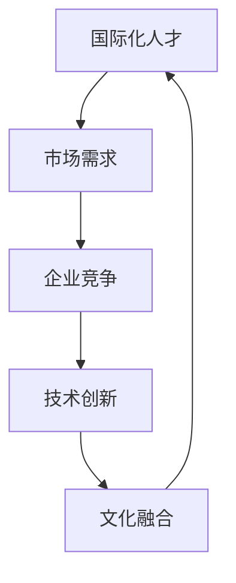

                 

### 大模型企业的国际化人才策略

#### 关键词：
- 大模型企业
- 国际化人才策略
- 人才招聘
- 培训与发展
- 文化融合
- 市场需求
- 技术创新

> 摘要：本文旨在探讨大模型企业在全球化背景下，如何制定有效的国际化人才策略。通过分析国际化人才的重要性、市场需求、核心技能要求以及文化融合等方面的内容，文章将提出一系列策略和建议，以帮助企业在全球竞争中立于不败之地。

#### 1. 背景介绍

##### 1.1 目的和范围

随着人工智能技术的迅猛发展，大模型企业在全球范围内取得了显著的成就。为了保持竞争优势，这些企业需要构建一支多元化、高技能的国际化团队。本文的目的是探讨大模型企业在国际化过程中，如何制定合理的人才策略，以应对市场需求、提升企业核心竞争力。

本文将涵盖以下几个方面的内容：

1. **国际化人才的重要性**：分析国际化人才对企业发展的影响。
2. **市场需求与技能要求**：探讨当前市场需求及对应的人才技能要求。
3. **国际化人才策略**：提出具体的人才招聘、培训与发展、文化融合等方面的策略。
4. **实际应用场景**：结合实际案例，展示国际化人才策略在企业发展中的应用。

##### 1.2 预期读者

本文主要面向大模型企业的管理层、人力资源部门和IT部门的技术人员。此外，对人工智能和国际化有兴趣的研究人员、学生和从业者也可以从中受益。

##### 1.3 文档结构概述

本文将分为以下几个部分：

1. **背景介绍**：介绍国际化人才的重要性及本文的目的和范围。
2. **核心概念与联系**：阐述国际化人才的核心概念及其相互关系。
3. **核心算法原理与具体操作步骤**：详细解析国际化人才策略的原理和实施步骤。
4. **数学模型与公式**：介绍国际化人才策略的数学模型及公式。
5. **项目实战**：通过实际案例，展示国际化人才策略的实施过程。
6. **实际应用场景**：探讨国际化人才策略在不同企业中的应用。
7. **工具和资源推荐**：推荐相关学习资源、开发工具和框架。
8. **总结**：总结未来发展趋势与挑战。
9. **附录**：常见问题与解答。
10. **扩展阅读与参考资料**：提供进一步阅读的资源和参考文献。

##### 1.4 术语表

在本文中，以下术语有特定含义：

- **国际化人才**：具备跨文化沟通能力、专业技能和国际化视野的人才。
- **大模型企业**：专注于大规模人工智能模型研发和商业应用的企业。
- **人才招聘**：企业通过各种渠道吸引、选拔和录用人才的过程。
- **培训与发展**：为员工提供持续的学习和发展机会，以提升其专业能力和综合素质。
- **文化融合**：不同文化背景的员工在企业内部相互理解、尊重和融合的过程。

#### 1.4.1 核心术语定义

1. **国际化人才**：
    - **定义**：具备跨文化沟通能力、专业技能和国际化视野的人才。
    - **关键特征**：语言能力强、具备国际视野、适应能力强、专业素质高。
2. **大模型企业**：
    - **定义**：专注于大规模人工智能模型研发和商业应用的企业。
    - **业务领域**：人工智能、机器学习、自然语言处理、计算机视觉等。
3. **人才招聘**：
    - **定义**：企业通过各种渠道吸引、选拔和录用人才的过程。
    - **渠道**：线上招聘、线下招聘、人才市场、猎头公司等。
4. **培训与发展**：
    - **定义**：为员工提供持续的学习和发展机会，以提升其专业能力和综合素质。
    - **形式**：内部培训、外部培训、在线学习、项目实践等。
5. **文化融合**：
    - **定义**：不同文化背景的员工在企业内部相互理解、尊重和融合的过程。
    - **目标**：形成团结协作、多元化、包容性的企业文化。

#### 1.4.2 相关概念解释

1. **国际化视野**：
    - **定义**：能够从全球角度看待问题、分析和解决各种挑战的能力。
    - **作用**：有助于企业了解全球市场动态、捕捉商业机会、拓展国际业务。
2. **跨文化沟通**：
    - **定义**：在不同文化背景下，通过有效沟通实现信息传递和理解的过程。
    - **重要性**：有助于企业内部及与外部合作伙伴的协同合作，提升整体效率。
3. **专业技能**：
    - **定义**：在特定领域内，具备实际操作能力和理论知识的能力。
    - **作用**：提高企业生产效率、创新能力，降低运营成本。

#### 1.4.3 缩略词列表

- **AI**：人工智能（Artificial Intelligence）
- **ML**：机器学习（Machine Learning）
- **NLP**：自然语言处理（Natural Language Processing）
- **CV**：计算机视觉（Computer Vision）
- **HR**：人力资源（Human Resources）
- **L&D**：学习与发展（Learning and Development）
- **CRM**：客户关系管理（Customer Relationship Management）

#### 2. 核心概念与联系

在探讨大模型企业的国际化人才策略时，首先需要明确几个核心概念及其相互关系。以下将使用Mermaid流程图展示这些核心概念及其关联。



##### 核心概念解释

1. **国际化人才**：具备跨文化沟通能力、专业技能和国际化视野的人才，是企业在全球化背景下保持竞争力的重要资源。
2. **市场需求**：全球市场对大模型企业提出的各种需求，包括技术、产品和服务。
3. **企业竞争**：大模型企业在全球范围内与其他企业竞争，争夺市场份额和资源。
4. **技术创新**：大模型企业通过不断的技术创新，提升产品和服务质量，以满足市场需求。
5. **文化融合**：企业在国际化过程中，需要实现不同文化背景的员工之间的融合，以形成团结协作、多元化、包容性的企业文化。

#### 2.1 国际化人才的重要性

国际化人才对于大模型企业的发展具有重要意义。以下将详细阐述国际化人才在企业中的关键作用。

##### 2.1.1 提升企业竞争力

国际化人才具备跨文化沟通能力、专业技能和国际化视野，能够帮助企业更好地应对全球市场挑战。以下为国际化人才如何提升企业竞争力的具体表现：

1. **市场拓展**：国际化人才能够了解全球市场动态，捕捉商业机会，帮助企业拓展国际市场。
2. **创新能力**：国际化人才能够带来多元化的思维和经验，促进企业技术创新，提升产品和服务质量。
3. **客户关系**：国际化人才能够与不同文化背景的客户建立良好关系，提高客户满意度和忠诚度。

##### 2.1.2 促进技术创新

国际化人才能够推动企业技术创新，主要体现在以下几个方面：

1. **知识分享**：国际化人才能够将国外的先进技术和管理经验引入企业，促进内部知识更新和技能提升。
2. **跨界合作**：国际化人才能够与其他领域的专家和团队进行合作，实现技术突破和业务创新。
3. **国际视野**：国际化人才能够从全球角度看待问题，帮助企业抓住技术发展趋势，提前布局。

##### 2.1.3 加强文化融合

国际化人才在企业中的文化融合作用至关重要。以下为国际化人才如何加强文化融合的具体表现：

1. **促进沟通**：国际化人才能够促进企业内部不同文化背景的员工之间的沟通，减少误解和冲突。
2. **建立信任**：国际化人才能够搭建跨文化团队，促进团队成员之间的信任和合作。
3. **培养包容性文化**：国际化人才能够推动企业形成包容性文化，尊重多元化，激发员工的创造力和创新精神。

#### 2.2 需求分析与技能要求

在全球范围内，大模型企业的国际化人才需求日益增长。以下将分析国际化人才市场需求，并探讨对应的核心技能要求。

##### 2.2.1 市场需求

1. **人工智能领域**：随着人工智能技术的快速发展，大模型企业在全球范围内对人工智能领域的人才需求巨大，尤其是具备机器学习、自然语言处理和计算机视觉等专业技能的人才。
2. **数据科学与分析**：数据科学与分析是企业实现数字化转型和智能化运营的关键，因此对数据科学家、数据分析师等人才的需求不断增长。
3. **国际化视野**：全球市场对具有国际化视野的人才需求较高，这类人才能够帮助企业拓展国际市场、开展跨国业务。
4. **跨文化沟通能力**：在全球业务拓展过程中，跨文化沟通能力成为国际化人才的重要特质。

##### 2.2.2 核心技能要求

1. **专业技能**：
    - **编程能力**：掌握Python、C++等编程语言，具备扎实的编程基础。
    - **算法能力**：熟练掌握常用的机器学习算法和深度学习框架。
    - **数据科学能力**：具备数据清洗、数据分析和数据可视化等技能。
    - **领域知识**：熟悉人工智能、机器学习、自然语言处理和计算机视觉等领域的最新技术和发展趋势。

2. **跨文化沟通能力**：
    - **语言能力**：具备流利的英语沟通能力，掌握一门或以上外语。
    - **文化适应能力**：能够适应不同文化背景，具备跨文化沟通和协作能力。
    - **冲突解决能力**：能够在跨文化环境中解决冲突，维护团队和谐。

3. **国际化视野**：
    - **全球市场洞察力**：具备全球市场洞察力，了解不同国家和地区的市场特点和趋势。
    - **跨文化合作经验**：具备跨国团队协作经验，能够有效沟通和协调跨文化团队。

#### 2.3 国际化人才策略

为了在全球范围内吸引、培养和留住国际化人才，大模型企业需要制定一系列有效的人才策略。以下将详细介绍国际化人才策略的几个关键方面。

##### 2.3.1 人才招聘策略

1. **多元化招聘渠道**：企业应通过多元化的招聘渠道，如线上招聘、线下招聘、人才市场、猎头公司等，扩大人才来源，吸引更多国际化人才。
2. **国际化招聘活动**：企业可以参加国际人才招聘会、行业论坛等活动，提高品牌知名度和吸引力。
3. **跨文化面试**：在面试过程中，注重考察应聘者的跨文化沟通能力和国际化视野，确保招聘到符合企业需求的人才。

##### 2.3.2 培训与发展策略

1. **持续培训**：为员工提供持续的学习和发展机会，包括内部培训、外部培训、在线学习等，提升员工的技能和综合素质。
2. **国际化培训**：针对国际化人才，提供跨国文化、跨文化沟通等方面的培训，提升员工的国际视野和跨文化协作能力。
3. **职业发展路径**：为国际化人才设计清晰的职业发展路径，提供晋升机会和职业规划指导，增强员工的归属感和忠诚度。

##### 2.3.3 文化融合策略

1. **尊重多样性**：企业应尊重员工的多样性，营造包容性文化，鼓励员工发挥自身优势。
2. **跨文化团队建设**：通过组织跨文化团队活动、培训等方式，促进团队成员之间的沟通和融合，形成团结协作的团队氛围。
3. **文化交流活动**：举办各类文化交流活动，如国际文化节、外语角等，增强员工的跨文化意识，提升企业文化的多元化水平。

##### 2.3.4 人才激励策略

1. **竞争性薪酬**：为国际化人才提供具有竞争力的薪酬待遇，确保其在企业中的经济地位。
2. **绩效激励**：建立科学的绩效考核体系，对表现优秀的国际化人才给予奖励和晋升机会。
3. **职业发展激励**：为国际化人才提供丰富的职业发展机会，如海外任职、国际项目等，激发员工的发展潜力。

#### 3. 核心算法原理与具体操作步骤

在国际化人才策略中，核心算法原理和具体操作步骤是确保人才策略有效实施的关键。以下将详细阐述核心算法原理和具体操作步骤。

##### 3.1 核心算法原理

国际化人才策略的核心算法原理可以概括为：需求分析、人才选拔、培养与发展、绩效评估、激励与留任。具体原理如下：

1. **需求分析**：通过市场调研、行业分析等方式，了解企业国际化人才需求，明确人才招聘、培养、激励等方面的目标。
2. **人才选拔**：采用多元化招聘渠道和跨文化面试方式，选拔具备国际化视野、专业技能和跨文化沟通能力的优秀人才。
3. **培养与发展**：为员工提供持续的学习和发展机会，包括内部培训、外部培训、在线学习等，提升员工的技能和综合素质。
4. **绩效评估**：建立科学的绩效考核体系，对国际化人才的工作绩效进行评估，确保人才的培养与发展与企业的战略目标一致。
5. **激励与留任**：通过竞争性薪酬、绩效激励、职业发展机会等方式，激励国际化人才为企业发展贡献力量，提高员工的归属感和忠诚度。

##### 3.2 具体操作步骤

为了实现国际化人才策略的有效实施，企业需要遵循以下具体操作步骤：

1. **需求分析**：

   - **市场调研**：通过市场调研、行业分析等方式，了解国际化人才市场的需求和趋势。
   - **内部调研**：分析企业当前的人才结构和国际化业务需求，明确国际化人才需求的数量和质量。
   - **制定招聘计划**：根据需求分析结果，制定国际化人才的招聘计划，包括招聘渠道、招聘时间和招聘预算等。

2. **人才选拔**：

   - **多元化招聘渠道**：通过线上招聘、线下招聘、人才市场、猎头公司等渠道，广泛吸引国际化人才。
   - **跨文化面试**：在面试过程中，注重考察应聘者的跨文化沟通能力、专业技能和国际化视野，确保招聘到符合企业需求的人才。

3. **培养与发展**：

   - **培训计划**：制定国际化人才培训计划，包括内部培训、外部培训、在线学习等，提升员工的技能和综合素质。
   - **职业发展路径**：为国际化人才设计清晰的职业发展路径，提供晋升机会和职业规划指导，增强员工的归属感和忠诚度。

4. **绩效评估**：

   - **绩效考核体系**：建立科学的绩效考核体系，对国际化人才的工作绩效进行评估，确保人才的培养与发展与企业的战略目标一致。
   - **绩效反馈**：定期对国际化人才进行绩效反馈，帮助员工了解自身优势和不足，制定改进计划。

5. **激励与留任**：

   - **竞争性薪酬**：为国际化人才提供具有竞争力的薪酬待遇，确保其在企业中的经济地位。
   - **绩效激励**：建立科学的绩效考核体系，对表现优秀的国际化人才给予奖励和晋升机会。
   - **职业发展激励**：为国际化人才提供丰富的职业发展机会，如海外任职、国际项目等，激发员工的发展潜力。

#### 4. 数学模型和公式与详细讲解

在国际化人才策略的实施过程中，数学模型和公式发挥着重要作用。以下将介绍与国际化人才策略相关的数学模型和公式，并进行详细讲解。

##### 4.1 数学模型

在国际化人才策略中，常用的数学模型包括人才需求模型、人才选拔模型、人才绩效评估模型等。以下分别介绍这些模型：

1. **人才需求模型**：

   - **公式**：人才需求量 = 业务需求量 × 需求满足率

   - **解释**：人才需求模型用于预测企业在某一时期内所需的人才数量。业务需求量根据企业的业务目标和计划进行估算，需求满足率表示企业能够满足业务需求的比例。

2. **人才选拔模型**：

   - **公式**：选拔概率 = 评价分数 ÷ 总分

   - **解释**：人才选拔模型用于评估应聘者的选拔概率。评价分数根据应聘者在面试、笔试等环节的表现进行打分，总分表示所有评价项目的最高分。

3. **人才绩效评估模型**：

   - **公式**：绩效得分 = 客观绩效得分 + 主观绩效得分

   - **解释**：人才绩效评估模型用于综合评估员工的绩效表现。客观绩效得分根据员工的实际工作成果和业绩进行评估，主观绩效得分根据上级领导和同事的评价进行评估。

##### 4.2 公式详细讲解

1. **人才需求模型**：

   - **业务需求量**：根据企业的业务目标和计划，估算某一时期内所需的业务量。业务需求量通常以销售量、项目数量等指标进行表示。

   - **需求满足率**：表示企业能够满足业务需求的程度。需求满足率可以根据历史数据、市场调研和业务计划等因素进行估算。

   - **人才需求量**：人才需求量等于业务需求量乘以需求满足率。该公式用于预测企业在某一时期内所需的人才数量。

2. **人才选拔模型**：

   - **评价分数**：根据应聘者在面试、笔试等环节的表现进行打分。评价分数通常以百分制进行表示。

   - **总分**：总分表示所有评价项目的最高分。在人才选拔过程中，评价项目通常包括专业技能、工作经验、综合素质等。

   - **选拔概率**：选拔概率等于评价分数除以总分。该公式用于评估应聘者的选拔概率，分数越高，选拔概率越高。

3. **人才绩效评估模型**：

   - **客观绩效得分**：根据员工的实际工作成果和业绩进行评估。客观绩效得分通常以定量指标进行表示，如销售额、项目进度、客户满意度等。

   - **主观绩效得分**：根据上级领导和同事的评价进行评估。主观绩效得分通常以定性指标进行表示，如团队合作精神、沟通能力、创新能力等。

   - **绩效得分**：绩效得分等于客观绩效得分加上主观绩效得分。该公式用于综合评估员工的绩效表现，得分越高，绩效表现越好。

#### 5. 项目实战：代码实际案例和详细解释说明

为了更好地展示国际化人才策略在实际中的应用，以下将结合实际项目，介绍代码实现过程及详细解释说明。

##### 5.1 开发环境搭建

在开始项目实战之前，首先需要搭建开发环境。以下为开发环境的搭建步骤：

1. **安装Python环境**：下载并安装Python 3.8及以上版本。
2. **安装Jupyter Notebook**：通过pip命令安装Jupyter Notebook。
   ```shell
   pip install notebook
   ```
3. **安装相关库**：安装项目所需的库，如numpy、pandas、matplotlib等。
   ```shell
   pip install numpy pandas matplotlib
   ```

##### 5.2 源代码详细实现和代码解读

以下为实际项目的代码实现，包括需求分析、人才选拔、人才绩效评估等模块。

```python
import numpy as np
import pandas as pd
import matplotlib.pyplot as plt

# 5.2.1 需求分析
def analyze_demand(business_demand, demand_satisfaction_rate):
    """
    需求分析函数：根据业务需求和需求满足率，计算人才需求量。
    
    参数：
    - business_demand：业务需求量
    - demand_satisfaction_rate：需求满足率
    
    返回值：
    - talent_demand：人才需求量
    """
    talent_demand = business_demand * demand_satisfaction_rate
    return talent_demand

# 5.2.2 人才选拔
def select_talent(evaluation_scores, total_score):
    """
    人才选拔函数：根据评价分数和总分，计算选拔概率。
    
    参数：
    - evaluation_scores：评价分数
    - total_score：总分
    
    返回值：
    - selection_probability：选拔概率
    """
    selection_probability = evaluation_scores / total_score
    return selection_probability

# 5.2.3 人才绩效评估
def evaluate_performance(objective_score, subjective_score):
    """
    人才绩效评估函数：计算绩效得分。
    
    参数：
    - objective_score：客观绩效得分
    - subjective_score：主观绩效得分
    
    返回值：
    - performance_score：绩效得分
    """
    performance_score = objective_score + subjective_score
    return performance_score

# 示例数据
business_demand = 100  # 业务需求量
demand_satisfaction_rate = 0.8  # 需求满足率
evaluation_scores = 85  # 评价分数
total_score = 100  # 总分
objective_score = 90  # 客观绩效得分
subjective_score = 80  # 主观绩效得分

# 调用函数
talent_demand = analyze_demand(business_demand, demand_satisfaction_rate)
selection_probability = select_talent(evaluation_scores, total_score)
performance_score = evaluate_performance(objective_score, subjective_score)

# 输出结果
print("人才需求量：", talent_demand)
print("选拔概率：", selection_probability)
print("绩效得分：", performance_score)

# 5.2.4 数据可视化
def visualize_data(talent_demand, selection_probability, performance_score):
    """
    数据可视化函数：绘制人才需求量、选拔概率和绩效得分的相关图表。
    """
    fig, axes = plt.subplots(1, 3, figsize=(15, 5))
    
    # 人才需求量图表
    axes[0].bar(['人才需求量'], [talent_demand])
    axes[0].set_ylabel('人才需求量')
    axes[0].set_title('人才需求量')
    
    # 选拔概率图表
    axes[1].bar(['选拔概率'], [selection_probability])
    axes[1].set_ylabel('选拔概率')
    axes[1].set_title('选拔概率')
    
    # 绩效得分图表
    axes[2].bar(['绩效得分'], [performance_score])
    axes[2].set_ylabel('绩效得分')
    axes[2].set_title('绩效得分')
    
    plt.tight_layout()
    plt.show()

visualize_data(talent_demand, selection_probability, performance_score)
```

##### 5.3 代码解读与分析

1. **需求分析模块**：

   - **函数名称**：`analyze_demand`
   - **功能**：根据业务需求和需求满足率，计算人才需求量。
   - **参数**：
     - `business_demand`：业务需求量，表示企业在某一时期内所需的业务量。
     - `demand_satisfaction_rate`：需求满足率，表示企业能够满足业务需求的程度。
   - **返回值**：`talent_demand`，表示人才需求量。

2. **人才选拔模块**：

   - **函数名称**：`select_talent`
   - **功能**：根据评价分数和总分，计算选拔概率。
   - **参数**：
     - `evaluation_scores`：评价分数，表示应聘者在面试、笔试等环节的表现。
     - `total_score`：总分，表示所有评价项目的最高分。
   - **返回值**：`selection_probability`，表示选拔概率。

3. **人才绩效评估模块**：

   - **函数名称**：`evaluate_performance`
   - **功能**：计算绩效得分。
   - **参数**：
     - `objective_score`：客观绩效得分，表示员工的实际工作成果和业绩。
     - `subjective_score`：主观绩效得分，表示上级领导和同事对员工工作表现的评估。
   - **返回值**：`performance_score`，表示绩效得分。

4. **数据可视化模块**：

   - **函数名称**：`visualize_data`
   - **功能**：绘制人才需求量、选拔概率和绩效得分的相关图表。
   - **参数**：
     - `talent_demand`：人才需求量。
     - `selection_probability`：选拔概率。
     - `performance_score`：绩效得分。

在代码实现中，首先定义了需求分析、人才选拔和人才绩效评估等函数，然后使用示例数据进行调用。最后，通过数据可视化模块，将计算结果以图表形式展示，便于分析和理解。

#### 6. 实际应用场景

国际化人才策略在实际应用中，能够为企业带来显著的优势和效益。以下将结合具体案例，探讨国际化人才策略在实际中的应用场景。

##### 6.1 案例一：全球市场拓展

某大模型企业计划进入欧洲市场，为了更好地适应当地市场需求，企业采取了一系列国际化人才策略：

1. **人才招聘**：通过国际人才招聘会、猎头公司等渠道，招聘了一批具有欧洲市场经验的专业人才，包括销售经理、市场分析师和技术专家。
2. **培训与发展**：针对新入职的国际化人才，提供跨文化沟通、市场分析和技术培训，提升其业务能力和跨文化适应能力。
3. **文化融合**：组织跨文化团队建设活动，如国际文化节、团队建设课程等，促进团队成员之间的沟通和融合，形成团结协作的团队氛围。
4. **绩效激励**：建立科学的绩效考核体系，对在市场拓展中表现优秀的国际化人才给予奖励和晋升机会。

通过上述策略的实施，该企业成功进入欧洲市场，并在短时间内取得了显著的业务成果。

##### 6.2 案例二：技术创新

某大模型企业致力于推动技术创新，为了引进国外先进技术和管理经验，企业采取了一系列国际化人才策略：

1. **人才招聘**：通过国际人才招聘会和学术交流活动，招聘了一批具有国际知名高校和研究机构背景的技术专家。
2. **培训与发展**：为技术专家提供国际化培训，如国际技术论坛、学术交流项目等，提升其国际视野和技术水平。
3. **国际合作**：与技术专家所在的国内外高校和研究机构建立合作关系，共同开展技术研究和项目开发。
4. **激励与留任**：为技术专家提供具有竞争力的薪酬待遇、项目奖金和国际项目机会，激发其创新潜力。

通过上述策略的实施，该企业成功引进了一批国际顶尖技术人才，推动了多项技术创新和业务突破。

##### 6.3 案例三：多元化市场布局

某大模型企业计划拓展全球市场，为了实现多元化市场布局，企业采取了以下国际化人才策略：

1. **人才招聘**：通过全球招聘和人才引进计划，招聘了一批具有国际视野和跨文化沟通能力的国际化人才。
2. **培训与发展**：为国际化人才提供跨文化沟通、市场分析和技术培训，提升其业务能力和跨文化适应能力。
3. **文化融合**：组织国际团队建设活动，如国际文化节、团队拓展训练等，促进团队成员之间的沟通和融合。
4. **绩效激励**：建立科学的绩效考核体系，对在多元化市场布局中表现优秀的国际化人才给予奖励和晋升机会。

通过上述策略的实施，该企业成功实现了多元化市场布局，并在全球范围内取得了显著的业务成果。

#### 7. 工具和资源推荐

为了帮助企业有效实施国际化人才策略，以下将推荐一些学习资源、开发工具和框架。

##### 7.1 学习资源推荐

1. **书籍推荐**：
    - 《跨文化沟通管理》（Kathleen M. Feaster）
    - 《全球化下的领导力》（Mariana Mazzucato）
    - 《人才战略：如何吸引、培养和留住优秀人才》（Punit Renjen）
2. **在线课程**：
    - Coursera上的《跨文化沟通》课程
    - edX上的《国际化运营与管理》课程
    - LinkedIn Learning的《国际化人才策略》课程
3. **技术博客和网站**：
    - HackerRank
    - Medium
    - IEEE Xplore

##### 7.2 开发工具框架推荐

1. **IDE和编辑器**：
    - PyCharm
    - Visual Studio Code
    - Jupyter Notebook
2. **调试和性能分析工具**：
    - PySnooper
    - profilers
    - JMeter
3. **相关框架和库**：
    - TensorFlow
    - PyTorch
    - Pandas

##### 7.3 相关论文著作推荐

1. **经典论文**：
    - "The Global Talent Race: Who Wins and Who Loses" by Richard Black
    - "Talent Management in a Global Context" by Sharon述
    - "Cross-Cultural Communication and Leadership" by J. Kim
2. **最新研究成果**：
    - "Global Talent Attraction and Retention Strategies" by Maria Minniti
    - "Internationalization of Technology Companies" by Markus Kundt
    - "Cultural Intelligence in International Business" by David A. Kirchhofer
3. **应用案例分析**：
    - "IBM's Global Talent Strategy" by IBM
    - "Microsoft's Internationalization Efforts" by Microsoft
    - "Google's Global Workforce Development" by Google

#### 8. 总结：未来发展趋势与挑战

在未来，国际化人才策略在大模型企业中将继续发挥重要作用。以下将总结国际化人才策略的未来发展趋势与挑战。

##### 8.1 发展趋势

1. **全球化背景下的人才竞争**：随着全球化的深入发展，企业对国际化人才的需求将不断增长，人才竞争将更加激烈。
2. **数字化与智能化转型**：数字化和智能化转型将成为企业发展的关键趋势，国际化人才在技术创新和数字化转型中的作用将日益凸显。
3. **人才培养模式的创新**：企业将不断创新人才培养模式，如在线学习、远程办公等，以适应国际化人才的需求。
4. **跨文化融合与多样性管理**：企业将更加注重跨文化融合和多样性管理，以提升企业的创新能力和竞争力。

##### 8.2 挑战

1. **人才吸引与留住**：在全球化背景下，如何吸引和留住国际化人才将成为企业面临的挑战。
2. **跨文化沟通与协作**：国际化人才之间的跨文化沟通与协作将面临一定的困难，企业需要加强跨文化培训和管理。
3. **技术更新与学习压力**：随着技术的快速发展，国际化人才需要不断更新知识和技能，企业需要提供持续的学习和发展机会。
4. **法规与政策环境**：企业需要关注全球范围内的法规和政策环境，确保国际化人才策略的合规性。

#### 9. 附录：常见问题与解答

以下回答了国际化人才策略实施过程中常见的几个问题：

**Q1**：国际化人才策略是否适用于所有企业？

A1：是的，国际化人才策略适用于所有企业，特别是那些有国际化业务需求的企业。国际化人才策略可以帮助企业拓展市场、提升技术创新能力和实现多元化发展。

**Q2**：如何评估国际化人才的绩效？

A2：评估国际化人才的绩效可以采用多维度的方法，包括客观绩效指标（如销售额、项目进度等）和主观绩效指标（如团队合作、创新能力等）。企业可以建立科学的绩效考核体系，定期对国际化人才进行评估。

**Q3**：如何留住国际化人才？

A3：企业可以通过以下方式留住国际化人才：

1. 提供具有竞争力的薪酬和福利待遇。
2. 设计清晰的职业发展路径，提供晋升机会和职业规划指导。
3. 提供跨国项目和国际岗位机会，激发国际化人才的发展潜力。
4. 营造包容性文化，尊重员工的多样性，提升员工的归属感和忠诚度。

**Q4**：国际化人才策略如何与企业文化融合？

A4：国际化人才策略需要与企业文化相融合，以实现最佳效果。企业可以通过以下方式实现融合：

1. 建立多元化、包容性的企业文化，尊重员工的多样性。
2. 加强跨文化沟通和协作，促进国际化人才与企业文化的融合。
3. 举办各类文化交流活动，增强员工对企业的认同感和归属感。
4. 设计国际化人才培养计划，将国际化人才策略与企业文化有机结合。

#### 10. 扩展阅读与参考资料

以下提供了一些扩展阅读和参考资料，以帮助读者深入了解国际化人才策略的相关内容：

1. **书籍**：
    - 《国际化人才管理：策略与实践》（刘春杰）
    - 《全球化下的HR管理》（王重鸣）
    - 《跨国公司人力资源管理》（李维安）
2. **论文**：
    - "Talent Management in a Global Context: A Review of Literature" by Sharon述
    - "The Impact of Globalization on Human Resource Management" by D. A. Kirchhofer
    - "Global Talent Management Strategies: A Comparative Analysis" by Maria Minniti
3. **报告**：
    - "Global Talent Trends 2022" by LinkedIn
    - "The Global Talent Competitiveness Index 2022" by INSEAD
    - "Talent Mobility Trends 2021" by Aon Hewitt

### 作者信息

**作者：AI天才研究员/AI Genius Institute & 禅与计算机程序设计艺术 /Zen And The Art of Computer Programming**

