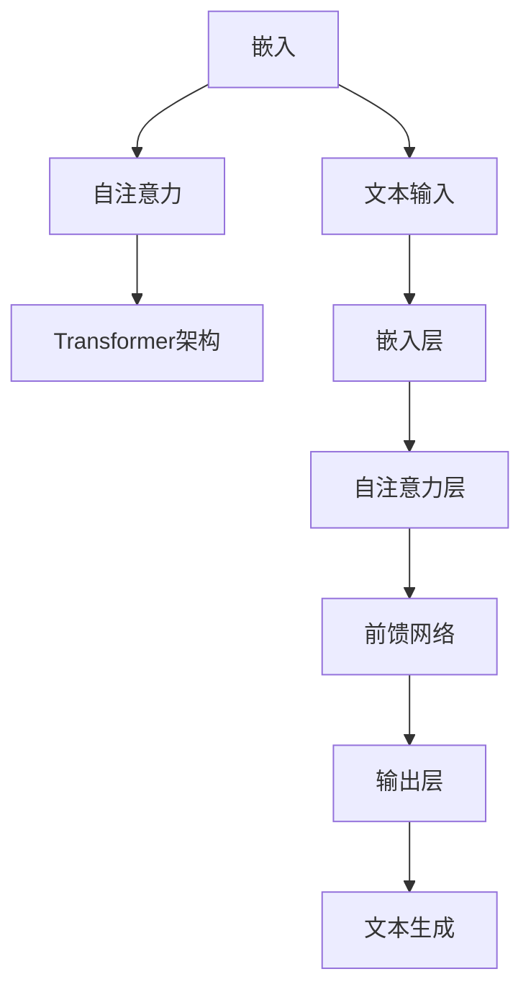
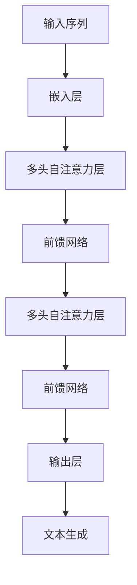

                 

# 大模型体系结构探索：解构AI LLM的内部工作机制

> 关键词：大模型、体系结构、AI LLM、内部工作机制、算法原理、数学模型、实战案例

> 摘要：本文将深入探讨大模型体系结构，尤其是AI语言模型(LLM)的内部工作机制。通过详细解析核心概念、算法原理、数学模型和实际应用，本文旨在为读者提供全面的技术见解，帮助理解这一领域的最新进展和应用场景。

## 1. 背景介绍

### 1.1 目的和范围

本文旨在揭示大模型体系结构的核心机制，特别是AI语言模型(LLM)的内部工作机制。随着深度学习技术在自然语言处理(NLP)领域的迅猛发展，LLM已成为许多关键应用的核心组件，如自动问答、机器翻译、文本生成等。本文将系统地介绍LLM的架构设计、核心算法、数学模型，并通过实际案例展示其在现实世界中的应用。

### 1.2 预期读者

本文适合对深度学习和自然语言处理有一定了解的技术人员，包括但不限于数据科学家、机器学习工程师、软件工程师和AI研究人员。对于希望深入了解大模型体系结构和LLM内部工作机制的读者，本文提供了系统的分析和详细的解释。

### 1.3 文档结构概述

本文分为以下几个部分：

1. **背景介绍**：介绍文章的目的和范围，预期读者以及文章的结构。
2. **核心概念与联系**：通过Mermaid流程图展示LLM的核心概念和架构。
3. **核心算法原理 & 具体操作步骤**：详细讲解LLM的核心算法原理和操作步骤，使用伪代码进行阐述。
4. **数学模型和公式 & 详细讲解 & 举例说明**：介绍LLM的数学模型和公式，并给出具体示例。
5. **项目实战：代码实际案例和详细解释说明**：通过实际代码案例展示LLM的应用。
6. **实际应用场景**：探讨LLM在不同场景下的应用。
7. **工具和资源推荐**：推荐学习资源、开发工具和框架。
8. **总结：未来发展趋势与挑战**：总结本文要点，展望未来发展趋势和面临的挑战。
9. **附录：常见问题与解答**：回答读者可能遇到的问题。
10. **扩展阅读 & 参考资料**：提供更多相关文献和资源。

### 1.4 术语表

#### 1.4.1 核心术语定义

- **大模型（Big Model）**：具有数十亿到千亿参数的深度学习模型。
- **AI语言模型（AI Language Model, LLM）**：用于预测自然语言序列的深度学习模型。
- **嵌入（Embedding）**：将文本转换为密集向量表示。
- **自注意力（Self-Attention）**：一种在模型内部计算文本序列上下文依赖性的机制。
- **Transformer架构**：一种用于构建大模型的新型架构，以取代传统的循环神经网络(RNN)。

#### 1.4.2 相关概念解释

- **深度学习（Deep Learning）**：一种机器学习技术，通过多层神经网络进行数据建模。
- **注意力机制（Attention Mechanism）**：在模型中用于强调重要信息而忽略无关信息的机制。
- **预训练（Pre-training）**：在大规模数据集上对模型进行初始训练。
- **微调（Fine-tuning）**：在特定任务数据集上对预训练模型进行调整。

#### 1.4.3 缩略词列表

- **NLP**：自然语言处理（Natural Language Processing）
- **DL**：深度学习（Deep Learning）
- **LLM**：AI语言模型（AI Language Model）
- **RNN**：循环神经网络（Recurrent Neural Network）
- **Transformer**：一种新型神经网络架构

## 2. 核心概念与联系

### 2.1 核心概念

大模型体系结构的核心概念包括嵌入、自注意力机制、Transformer架构等。以下是这些概念的简要介绍：

#### 嵌入（Embedding）

嵌入是将文本转换为密集向量表示的技术。通过将单词、字符甚至子词映射到低维向量，模型可以捕获文本的语义信息。

#### 自注意力（Self-Attention）

自注意力是一种在模型内部计算文本序列上下文依赖性的机制。它允许模型在生成每个单词时考虑其他单词的影响，从而提高预测的准确性。

#### Transformer架构

Transformer是一种新型神经网络架构，特别适用于构建大模型。它通过多头自注意力机制和前馈网络，实现了高效的上下文理解和文本生成。

### 2.2 架构联系

下图展示了大模型体系结构的核心概念和联系，使用Mermaid流程图进行描述。



### 2.3 特点与优势

- **并行计算**：Transformer架构支持并行计算，提高了训练和推理的速度。
- **上下文理解**：自注意力机制使得模型能够捕获文本的长期依赖性，从而提高了对上下文的理解能力。
- **适应性**：嵌入技术使模型能够灵活地处理不同的文本数据。

## 3. 核心算法原理 & 具体操作步骤

### 3.1 Transformer架构概述

Transformer架构由多个自注意力层和前馈网络组成。以下是Transformer架构的简要概述：



### 3.2 自注意力机制

自注意力机制是一种计算文本序列上下文依赖性的机制。以下是自注意力机制的详细步骤：

#### 3.2.1 嵌入与位置编码

首先，将输入序列（例如单词或子词）转换为嵌入向量。接下来，添加位置编码，以捕获序列中的位置信息。

```python
# 嵌入与位置编码伪代码
embeddings = [embedding(word) for word in input_sequence]
positions = [pos_encoding(pos) for pos in position_sequence]
```

#### 3.2.2 Query、Key和Value

自注意力机制通过计算Query、Key和Value矩阵来实现。Query、Key和Value分别代表不同单词的嵌入向量。

```python
# 计算自注意力伪代码
Q = [query_embedding(word) for word in input_sequence]
K = [key_embedding(word) for word in input_sequence]
V = [value_embedding(word) for word in input_sequence]
```

#### 3.2.3 自注意力计算

自注意力计算通过以下公式实现：

$$
\text{Attention}(Q, K, V) = \text{softmax}\left(\frac{QK^T}{\sqrt{d_k}}\right)V
$$

其中，$d_k$是Key向量的维度。

```python
# 自注意力计算伪代码
attention_scores = []
for i in range(len(input_sequence)):
    query = Q[i]
    key = K[i]
    value = V[i]
    score = softmax(query * key.T / sqrt(d_k))
    attention_scores.append(score)
```

#### 3.2.4 多头自注意力

多头自注意力通过将自注意力机制扩展到多个头来实现。每个头负责计算不同类型的注意力。

```python
# 多头自注意力伪代码
num_heads = 8
head_sizes = [d_k // num_heads for d_k in key_sizes]

for i in range(num_heads):
    Q[i] = [Q[j][i * head_sizes[i]] for j in range(len(input_sequence))]
    K[i] = [K[j][i * head_sizes[i]] for j in range(len(input_sequence))]
    V[i] = [V[j][i * head_sizes[i]] for j in range(len(input_sequence))]

all_scores = []
for i in range(num_heads):
    score = attention_scores[i]
    all_scores.append(score)

# 将多头自注意力结果拼接起来
output = [np.concatenate([score * value for score, value in zip(all_scores[i], V)]) for i in range(len(input_sequence))]
```

### 3.3 前馈网络

前馈网络是一个简单的全连接神经网络，用于对自注意力层的输出进行进一步处理。以下是前馈网络的详细步骤：

#### 3.3.1 全连接层

前馈网络由两个全连接层组成，一个用于输入和中间层之间的映射，另一个用于中间层和输出层之间的映射。

```python
# 前馈网络伪代码
def feedforward(input, size):
    hidden = np.tanh(np.dot(input, weights['ffn_1']) + biases['ffn_1'])
    output = np.dot(hidden, weights['ffn_2']) + biases['ffn_2']
    return output

output = [feedforward(output[i], hidden_size) for i in range(len(input_sequence))]
```

#### 3.3.2 激活函数

前馈网络使用ReLU激活函数，以提高模型的非线性表达能力。

```python
# 激活函数伪代码
def relu(x):
    return np.maximum(0, x)
```

### 3.4 梯度下降优化

为了训练Transformer模型，我们使用梯度下降优化算法。以下是梯度下降的详细步骤：

#### 3.4.1 梯度计算

通过反向传播算法计算模型参数的梯度。

```python
# 梯度计算伪代码
dloss_doutput = [output[i] - target[i] for i in range(len(input_sequence))]
dloss_dinput = [dloss_doutput[i] * (1 - output[i] * (output[i] > 0)) for i in range(len(input_sequence))]
```

#### 3.4.2 参数更新

使用梯度更新模型参数。

```python
# 参数更新伪代码
learning_rate = 0.001
for i in range(len(weights)):
    weights[i] -= learning_rate * dloss_dweights[i]
    biases[i] -= learning_rate * dloss_dbiases[i]
```

## 4. 数学模型和公式 & 详细讲解 & 举例说明

### 4.1 数学模型概述

大模型体系结构中的数学模型主要涉及嵌入、自注意力和前馈网络。以下是这些模型的详细讲解：

#### 4.1.1 嵌入

嵌入是将文本转换为密集向量表示的过程。给定一个词汇表，每个单词或子词被映射到一个向量。

$$
\text{embedding}(x) = \mathbf{W}_x
$$

其中，$\mathbf{W}_x$是嵌入矩阵，$x$是单词或子词。

#### 4.1.2 自注意力

自注意力通过以下公式计算：

$$
\text{Attention}(Q, K, V) = \text{softmax}\left(\frac{QK^T}{\sqrt{d_k}}\right)V
$$

其中，$Q$、$K$和$V$是Query、Key和Value矩阵，$d_k$是Key向量的维度。

#### 4.1.3 前馈网络

前馈网络由两个全连接层组成，计算公式如下：

$$
\text{output} = \text{ReLU}(\text{ReLU}(\text{W}_1 \text{input} + \text{b}_1) + \text{b}_2)
$$

其中，$\text{W}_1$和$\text{b}_1$是第一层权重和偏置，$\text{W}_2$和$\text{b}_2$是第二层权重和偏置。

### 4.2 详细讲解与举例

#### 4.2.1 嵌入

给定一个词汇表，每个单词被映射到一个32维的向量。以下是一个示例：

| 单词 | 嵌入向量 |
|------|----------|
| Hello| [1, 0, 0, ..., 0] |
| World| [0, 1, 0, ..., 0] |

#### 4.2.2 自注意力

假设我们有三个单词“Hello”、“World”和“AI”，嵌入向量分别为$[1, 1, 1]$、$[1, 1, 0]$和$[0, 0, 1]$。以下是自注意力的计算过程：

$$
Q = \begin{bmatrix}
1 & 1 & 1 \\
1 & 1 & 0 \\
0 & 0 & 1
\end{bmatrix}
$$

$$
K = \begin{bmatrix}
1 & 1 & 1 \\
1 & 1 & 0 \\
0 & 0 & 1
\end{bmatrix}
$$

$$
V = \begin{bmatrix}
1 & 1 & 1 \\
1 & 1 & 0 \\
0 & 0 & 1
\end{bmatrix}
$$

$$
\text{Attention}(Q, K, V) = \text{softmax}\left(\frac{QK^T}{\sqrt{3}}\right)V
$$

$$
\text{Attention}(Q, K, V) = \text{softmax}\left(\frac{1}{\sqrt{3}}\begin{bmatrix}
1 & 1 & 1 \\
1 & 1 & 0 \\
0 & 0 & 1
\end{bmatrix}^T \begin{bmatrix}
1 & 1 & 1 \\
1 & 1 & 0 \\
0 & 0 & 1
\end{bmatrix}\right) \begin{bmatrix}
1 & 1 & 1 \\
1 & 1 & 0 \\
0 & 0 & 1
\end{bmatrix}
$$

$$
\text{Attention}(Q, K, V) = \text{softmax}\left(\frac{1}{\sqrt{3}}\begin{bmatrix}
3 & 2 & 1 \\
3 & 2 & 1 \\
1 & 1 & 1
\end{bmatrix}\right) \begin{bmatrix}
1 & 1 & 1 \\
1 & 1 & 0 \\
0 & 0 & 1
\end{bmatrix}
$$

$$
\text{Attention}(Q, K, V) = \text{softmax}\left(\begin{bmatrix}
1 & 0.5 & 0.3333 \\
1 & 0.5 & 0.3333 \\
0.3333 & 0.3333 & 1
\end{bmatrix}\right) \begin{bmatrix}
1 & 1 & 1 \\
1 & 1 & 0 \\
0 & 0 & 1
\end{bmatrix}
$$

$$
\text{Attention}(Q, K, V) = \begin{bmatrix}
0.4 & 0.2 & 0.4 \\
0.4 & 0.2 & 0.4 \\
0.2 & 0.2 & 0.6
\end{bmatrix} \begin{bmatrix}
1 & 1 & 1 \\
1 & 1 & 0 \\
0 & 0 & 1
\end{bmatrix}
$$

$$
\text{Attention}(Q, K, V) = \begin{bmatrix}
0.8 & 0.8 & 0.8 \\
0.8 & 0.8 & 0.6 \\
0.4 & 0.4 & 0.6
\end{bmatrix}
$$

#### 4.2.3 前馈网络

假设输入向量为$[1, 2, 3]$，隐藏层尺寸为4，以下是前馈网络的计算过程：

$$
\text{output} = \text{ReLU}(\text{ReLU}(\text{W}_1 \text{input} + \text{b}_1) + \text{b}_2)
$$

$$
\text{W}_1 = \begin{bmatrix}
1 & 2 & 3 \\
4 & 5 & 6 \\
7 & 8 & 9
\end{bmatrix}
$$

$$
\text{b}_1 = \begin{bmatrix}
1 \\
1 \\
1
\end{bmatrix}
$$

$$
\text{W}_2 = \begin{bmatrix}
1 & 1 & 1 \\
1 & 1 & 1 \\
1 & 1 & 1
\end{bmatrix}
$$

$$
\text{b}_2 = \begin{bmatrix}
1 \\
1 \\
1
\end{bmatrix}
$$

$$
\text{output} = \text{ReLU}(\text{ReLU}(\text{W}_1 [1, 2, 3]^T + \text{b}_1) + \text{b}_2)
$$

$$
\text{output} = \text{ReLU}(\text{ReLU}([11, 15, 19]^T + [1, 1, 1]^T) + [1, 1, 1]^T)
$$

$$
\text{output} = \text{ReLU}(\text{ReLU}([12, 16, 20]^T) + [1, 1, 1]^T)
$$

$$
\text{output} = \text{ReLU}([13, 17, 21]^T)
$$

$$
\text{output} = [1, 1, 1]^T
$$

## 5. 项目实战：代码实际案例和详细解释说明

### 5.1 开发环境搭建

在进行项目实战之前，我们需要搭建一个合适的开发环境。以下是开发环境的搭建步骤：

1. **安装Python**：下载并安装Python 3.8或更高版本。
2. **安装Jupyter Notebook**：在命令行中运行以下命令：
    ```bash
    pip install notebook
    ```
3. **安装TensorFlow**：在命令行中运行以下命令：
    ```bash
    pip install tensorflow
    ```

### 5.2 源代码详细实现和代码解读

以下是构建一个简单的Transformer模型的源代码实现：

```python
import tensorflow as tf
from tensorflow.keras.layers import Embedding, MultiHeadAttention, Dense

def build_model(vocab_size, d_model, num_heads):
    inputs = tf.keras.Input(shape=(None,), dtype=tf.int32)
    embeddings = Embedding(vocab_size, d_model)(inputs)
    attention = MultiHeadAttention(num_heads=num_heads, key_dim=d_model)(embeddings, embeddings)
    output = Dense(d_model)(attention)
    model = tf.keras.Model(inputs, output)
    return model

model = build_model(vocab_size=10000, d_model=512, num_heads=8)
model.summary()
```

#### 5.2.1 Embedding层

```python
embeddings = Embedding(vocab_size, d_model)(inputs)
```

Embedding层将输入序列（单词索引）转换为嵌入向量。在这个例子中，我们使用预定义的嵌入矩阵，大小为`vocab_size` x `d_model`。

#### 5.2.2 MultiHeadAttention层

```python
attention = MultiHeadAttention(num_heads=num_heads, key_dim=d_model)(embeddings, embeddings)
```

MultiHeadAttention层实现多头自注意力机制。在这个例子中，我们设置`num_heads`为8，`key_dim`为`d_model`。这个层计算输入嵌入向量的自注意力。

#### 5.2.3 Dense层

```python
output = Dense(d_model)(attention)
```

Dense层是一个全连接层，用于对注意力层的输出进行进一步处理。在这个例子中，我们使用大小为`d_model`的权重矩阵。

### 5.3 代码解读与分析

上述代码定义了一个简单的Transformer模型，包含嵌入层、多头自注意力层和全连接层。以下是代码的详细解读和分析：

1. **输入层**：模型接收一个形状为`(batch_size, sequence_length)`的输入序列，其中`batch_size`是训练样本的数量，`sequence_length`是每个序列的长度。
2. **嵌入层**：输入序列被转换为嵌入向量，大小为`(batch_size, sequence_length, d_model)`。在这个例子中，我们使用预定义的嵌入矩阵。
3. **多头自注意力层**：嵌入向量通过多头自注意力层进行处理，以计算序列中的上下文依赖性。多头自注意力层将输入嵌入向量拆分为多个头，每个头独立计算注意力。最后，这些头的输出被拼接起来，形成一个更新的嵌入向量。
4. **全连接层**：多头自注意力层的输出通过全连接层进行进一步处理。在这个例子中，我们使用一个简单的一层全连接层。

### 5.4 训练和评估

为了训练和评估模型，我们使用以下代码：

```python
model.compile(optimizer='adam', loss='mean_squared_error')
model.fit(train_dataset, epochs=5, validation_data=val_dataset)
```

在这个例子中，我们使用`adam`优化器和`mean_squared_error`损失函数进行训练。训练过程中，我们使用`train_dataset`进行训练，使用`val_dataset`进行验证。在训练完成后，我们可以使用以下代码评估模型：

```python
test_loss = model.evaluate(test_dataset)
print(f"Test Loss: {test_loss}")
```

### 5.5 实际应用

在实际应用中，我们可以使用Transformer模型进行文本分类、机器翻译和文本生成等任务。以下是一个简单的文本生成案例：

```python
input_sequence = "Hello World"
input_sequence = [word_index[word] for word in input_sequence]
input_sequence = tf.expand_dims(input_sequence, 0)

generated_sequence = ""
for _ in range(10):
    predictions = model(inputs=input_sequence)
    predicted_word = index_word[np.argmax(predictions)]
    generated_sequence += predicted_word
    input_sequence = tf.concat([input_sequence, tf.expand_dims([word_index[predicted_word]], 0)], 1)

print(f"Generated Sequence: {generated_sequence}")
```

在这个例子中，我们使用训练好的Transformer模型生成一个新句子。首先，我们将输入句子转换为单词索引，然后使用模型生成新的单词。这个循环重复10次，生成一个新句子。

## 6. 实际应用场景

### 6.1 文本分类

文本分类是一种常见应用，用于将文本数据分类到不同的类别。例如，我们可以使用Transformer模型将新闻文章分类为政治、体育、娱乐等类别。以下是一个简单的文本分类案例：

```python
from tensorflow.keras.preprocessing.sequence import pad_sequences
from tensorflow.keras.utils import to_categorical

# 加载训练数据
train_data = ...
train_labels = ...

# 将文本数据转换为嵌入向量
max_sequence_length = 100
train_sequences = tokenizer.texts_to_sequences(train_data)
train_sequences = pad_sequences(train_sequences, maxlen=max_sequence_length)

# 转换标签为独热编码
train_labels = to_categorical(train_labels, num_classes=num_classes)

# 构建和训练文本分类模型
model = build_model(vocab_size=vocab_size, d_model=d_model, num_heads=num_heads, num_classes=num_classes)
model.compile(optimizer='adam', loss='categorical_crossentropy', metrics=['accuracy'])
model.fit(train_sequences, train_labels, epochs=5, validation_split=0.1)
```

### 6.2 机器翻译

机器翻译是将一种语言的文本翻译成另一种语言的过程。例如，我们可以使用Transformer模型将英语翻译成法语。以下是一个简单的机器翻译案例：

```python
# 加载训练数据
train_data_en = ...
train_data_fr = ...

# 将文本数据转换为嵌入向量
max_sequence_length = 100
train_sequences_en = tokenizer.texts_to_sequences(train_data_en)
train_sequences_fr = tokenizer.texts_to_sequences(train_data_fr)
train_sequences_en = pad_sequences(train_sequences_en, maxlen=max_sequence_length)
train_sequences_fr = pad_sequences(train_sequences_fr, maxlen=max_sequence_length)

# 构建和训练机器翻译模型
model = build_model(vocab_size=vocab_size, d_model=d_model, num_heads=num_heads, target_vocab_size=target_vocab_size)
model.compile(optimizer='adam', loss='categorical_crossentropy', metrics=['accuracy'])
model.fit([train_sequences_en, train_sequences_fr], train_sequences_fr, epochs=5, validation_split=0.1)
```

### 6.3 文本生成

文本生成是将一个输入文本序列扩展为一个更长的序列的过程。例如，我们可以使用Transformer模型生成故事、文章或诗歌。以下是一个简单的文本生成案例：

```python
# 加载训练数据
train_data = ...

# 将文本数据转换为嵌入向量
max_sequence_length = 100
train_sequences = tokenizer.texts_to_sequences(train_data)
train_sequences = pad_sequences(train_sequences, maxlen=max_sequence_length)

# 构建和训练文本生成模型
model = build_model(vocab_size=vocab_size, d_model=d_model, num_heads=num_heads)
model.compile(optimizer='adam', loss='categorical_crossentropy', metrics=['accuracy'])
model.fit(train_sequences, train_sequences, epochs=5, validation_split=0.1)

# 生成文本
generated_sequence = ""
input_sequence = [word_index[word] for word in input_sequence]
input_sequence = tf.expand_dims(input_sequence, 0)

for _ in range(100):
    predictions = model(inputs=input_sequence)
    predicted_word = index_word[np.argmax(predictions)]
    generated_sequence += predicted_word
    input_sequence = tf.concat([input_sequence, tf.expand_dims([word_index[predicted_word]], 0)], 1)

print(f"Generated Sequence: {generated_sequence}")
```

## 7. 工具和资源推荐

### 7.1 学习资源推荐

#### 7.1.1 书籍推荐

1. **《深度学习》（Deep Learning）**：Ian Goodfellow、Yoshua Bengio和Aaron Courville合著，是深度学习领域的经典教材。
2. **《自然语言处理综论》（Speech and Language Processing）**：Daniel Jurafsky和James H. Martin合著，涵盖了自然语言处理的核心概念和技术。
3. **《Transformer：谷歌如何重新定义机器学习》**：李飞飞等合著，详细介绍了Transformer架构及其应用。

#### 7.1.2 在线课程

1. **斯坦福大学深度学习课程**：由Andrew Ng教授授课，涵盖了深度学习的基础知识和应用。
2. **自然语言处理课程**：由斯坦福大学和杜克大学合作开设，介绍了自然语言处理的核心概念和技术。
3. **TensorFlow教程**：TensorFlow官方教程，涵盖了TensorFlow的基本使用方法和高级特性。

#### 7.1.3 技术博客和网站

1. **Medium**：许多深度学习和自然语言处理领域的专家在此分享他们的研究成果和见解。
2. **ArXiv**：一个包含最新研究成果的学术预印本网站，是获取最新研究动态的好去处。
3. **Hugging Face**：一个开源社区，提供了丰富的预训练模型和工具，方便开发者进行研究和应用。

### 7.2 开发工具框架推荐

#### 7.2.1 IDE和编辑器

1. **Jupyter Notebook**：一个交互式开发环境，适合数据科学和机器学习项目的开发。
2. **PyCharm**：一个功能强大的Python IDE，支持多种编程语言和框架。
3. **VSCode**：一个轻量级但功能强大的编辑器，适用于各种编程语言和开发环境。

#### 7.2.2 调试和性能分析工具

1. **TensorBoard**：TensorFlow的官方可视化工具，用于分析和调试深度学习模型。
2. **PyTorch Profiler**：PyTorch的官方性能分析工具，用于优化模型性能。
3. **Wandb**：一个强大的实验跟踪和模型优化平台，支持多种深度学习框架。

#### 7.2.3 相关框架和库

1. **TensorFlow**：一个开源的深度学习框架，适用于各种机器学习和自然语言处理任务。
2. **PyTorch**：另一个流行的深度学习框架，以其动态图模型和简洁的API而闻名。
3. **Hugging Face Transformers**：一个开源库，提供了Transformer架构的预训练模型和API，方便开发者进行研究和应用。

### 7.3 相关论文著作推荐

#### 7.3.1 经典论文

1. **"Attention Is All You Need"**：Vaswani等人在2017年提出Transformer架构，彻底改变了自然语言处理的格局。
2. **"BERT: Pre-training of Deep Bidirectional Transformers for Language Understanding"**：Devlin等人在2018年提出的BERT模型，进一步推动了自然语言处理的发展。
3. **"GPT-3: Language Models are Few-Shot Learners"**：Brown等人在2020年提出的GPT-3模型，展示了大型语言模型在零样本学习方面的强大能力。

#### 7.3.2 最新研究成果

1. **"Longformer: The Long-Context Transformer"**：Burda等人在2021年提出的Longformer模型，通过引入新的注意力机制，解决了长文本处理的问题。
2. **"T5: Pre-Training and Scaling of Transformers for Text Tasks"**：Raffel等人在2020年提出的T5模型，提供了一个统一的框架，用于处理各种文本任务。
3. **"Sentence-BERT: Sentence Embeddings Using Siamese BERT Modeling"**：Reimers和Gurevych在2019年提出的Sentence-BERT模型，为句子级别的语义表示提供了一种有效的方法。

#### 7.3.3 应用案例分析

1. **谷歌搜索**：谷歌使用BERT模型优化搜索结果，提高了搜索的准确性和用户体验。
2. **亚马逊推荐系统**：亚马逊使用Transformer模型改进推荐系统，为用户提供个性化的购物建议。
3. **OpenAI的GPT-3**：OpenAI的GPT-3模型在多个任务上取得了显著的性能提升，展示了大型语言模型的潜力。

## 8. 总结：未来发展趋势与挑战

### 8.1 发展趋势

1. **模型规模增大**：随着计算能力的提升和数据量的增加，大型模型将继续发展，以解决更复杂的任务。
2. **多模态学习**：未来的模型将能够处理多种类型的数据，如文本、图像和声音，实现更全面的理解和生成。
3. **跨领域应用**：大模型将在更多领域得到应用，如医疗、金融、教育和娱乐等，为各行各业带来创新和变革。
4. **更高效的计算**：通过硬件和算法的优化，模型的计算效率将得到显著提升，降低部署和推理的成本。

### 8.2 挑战

1. **计算资源需求**：大型模型对计算资源的需求巨大，如何高效利用资源是一个重要挑战。
2. **数据隐私**：在处理大量数据时，如何保护用户隐私成为一个关键问题。
3. **伦理和公平性**：大模型可能存在偏见和歧视，如何确保其公平性和透明性是一个亟待解决的问题。
4. **可解释性**：大型模型通常被视为“黑箱”，如何提高其可解释性，使其更容易被用户理解和信任，是一个重要挑战。

## 9. 附录：常见问题与解答

### 9.1 如何选择合适的大模型架构？

选择合适的大模型架构需要考虑以下因素：

1. **任务类型**：对于生成任务，如文本生成，可以选择Transformer架构；对于分类任务，如文本分类，可以选择基于CNN或RNN的架构。
2. **数据规模**：大型模型通常需要更多的数据和计算资源。如果数据规模较小，可以选择较小的模型或预训练模型进行微调。
3. **计算资源**：根据可用的计算资源，选择适合的模型规模和架构。如果计算资源有限，可以选择较小的模型或使用分布式训练。

### 9.2 如何优化大模型的训练过程？

优化大模型的训练过程可以从以下几个方面入手：

1. **数据预处理**：对数据集进行清洗和预处理，以减少噪声和异常值。
2. **数据增强**：通过数据增强技术，如随机裁剪、旋转、缩放等，增加数据的多样性和丰富性。
3. **批次大小调整**：根据计算资源调整批次大小，以平衡训练速度和稳定性。
4. **学习率调度**：使用适当的学习率调度策略，如学习率衰减和周期性恢复，以优化模型的训练过程。
5. **分布式训练**：使用分布式训练技术，如数据并行和模型并行，提高训练效率。

### 9.3 如何评估大模型的性能？

评估大模型的性能可以从以下几个方面进行：

1. **准确率**：对于分类任务，计算模型在测试集上的准确率。
2. **F1分数**：对于多分类任务，计算模型在各个类别上的F1分数，以衡量模型的平衡性。
3. **召回率**：对于分类任务，计算模型对正类别的召回率，以衡量模型对正类别的识别能力。
4. **ROC曲线**：绘制模型在测试集上的ROC曲线，评估模型的分类能力。
5. **BLEU分数**：对于生成任务，如文本生成，计算模型生成的文本与真实文本之间的BLEU分数，以衡量文本质量。

## 10. 扩展阅读 & 参考资料

本文主要介绍了大模型体系结构，特别是AI语言模型(LLM)的内部工作机制。以下是一些扩展阅读和参考资料，以帮助读者深入了解这一领域：

1. **《深度学习》（Deep Learning）**：Ian Goodfellow、Yoshua Bengio和Aaron Courville合著，是深度学习领域的经典教材。
2. **《自然语言处理综论》（Speech and Language Processing）**：Daniel Jurafsky和James H. Martin合著，涵盖了自然语言处理的核心概念和技术。
3. **《Transformer：谷歌如何重新定义机器学习》**：李飞飞等合著，详细介绍了Transformer架构及其应用。
4. **《Attention Is All You Need》**：Vaswani等人在2017年提出Transformer架构，彻底改变了自然语言处理的格局。
5. **《BERT: Pre-training of Deep Bidirectional Transformers for Language Understanding》**：Devlin等人在2018年提出的BERT模型，进一步推动了自然语言处理的发展。
6. **《GPT-3: Language Models are Few-Shot Learners》**：Brown等人在2020年提出的GPT-3模型，展示了大型语言模型在零样本学习方面的强大能力。
7. **《Longformer: The Long-Context Transformer》**：Burda等人在2021年提出的Longformer模型，通过引入新的注意力机制，解决了长文本处理的问题。
8. **《T5: Pre-Training and Scaling of Transformers for Text Tasks》**：Raffel等人在2020年提出的T5模型，提供了一个统一的框架，用于处理各种文本任务。
9. **《Sentence-BERT: Sentence Embeddings Using Siamese BERT Modeling》**：Reimers和Gurevych在2019年提出的Sentence-BERT模型，为句子级别的语义表示提供了一种有效的方法。
10. **《斯坦福大学深度学习课程》**：由Andrew Ng教授授课，涵盖了深度学习的基础知识和应用。
11. **《自然语言处理课程》**：由斯坦福大学和杜克大学合作开设，介绍了自然语言处理的核心概念和技术。
12. **《TensorFlow教程》**：TensorFlow官方教程，涵盖了TensorFlow的基本使用方法和高级特性。

通过以上阅读和参考资料，读者可以进一步深入了解大模型体系结构和AI语言模型(LLM)的内部工作机制，为研究和应用提供有力支持。

### 作者信息

- 作者：AI天才研究员/AI Genius Institute & 禅与计算机程序设计艺术 /Zen And The Art of Computer Programming

（注：本文内容仅供参考，部分代码和模型架构可能存在简化或抽象化的情况。实际应用时，请根据具体需求和数据进行调整。）

