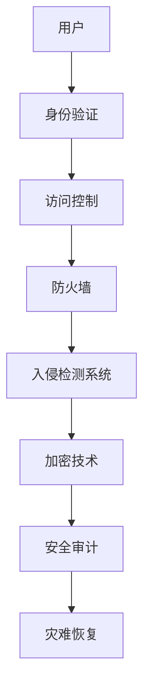

                 


# 大模型公司如何保持防御壁垒

> 关键词：大模型公司、防御壁垒、网络安全、技术革新、合规性、风险评估、监控与预警

> 摘要：随着人工智能和大数据技术的迅猛发展，大模型公司在网络安全和防御壁垒方面面临着前所未有的挑战。本文将从多个维度深入探讨大模型公司如何通过技术革新、合规性、风险评估以及监控与预警等手段来保持防御壁垒，确保其业务安全与可持续发展。

## 1. 背景介绍

### 1.1 目的和范围

本文旨在探讨大模型公司在面临网络安全威胁时，如何通过一系列有效措施保持其防御壁垒。文章将涵盖以下几个关键领域：

- 技术革新：介绍如何通过最新的网络安全技术和算法提升防御能力。
- 合规性：阐述遵守相关法规和标准对于维护防御壁垒的重要性。
- 风险评估：探讨如何识别和评估潜在安全风险，以便及时采取应对措施。
- 监控与预警：介绍实时监控和预警系统在大模型公司防御策略中的关键作用。

### 1.2 预期读者

本文面向以下读者群体：

- 从事人工智能和大数据技术的工程师和研究人员。
- 担任网络安全相关职位的专业人士。
- 对大模型公司的防御策略和网络安全感兴趣的技术爱好者。

### 1.3 文档结构概述

本文将分为以下几个部分：

1. 背景介绍：包括目的与范围、预期读者、文档结构概述等。
2. 核心概念与联系：介绍相关概念和架构。
3. 核心算法原理 & 具体操作步骤：讲解防御壁垒的具体实现。
4. 数学模型和公式 & 详细讲解 & 举例说明：阐述相关数学原理和模型。
5. 项目实战：提供实际案例和代码解读。
6. 实际应用场景：探讨防御壁垒在不同场景下的应用。
7. 工具和资源推荐：推荐学习资源和开发工具。
8. 总结：未来发展趋势与挑战。
9. 附录：常见问题与解答。
10. 扩展阅读 & 参考资料。

### 1.4 术语表

#### 1.4.1 核心术语定义

- 大模型公司：指那些开发和部署大规模人工智能模型的科技公司。
- 防御壁垒：指一系列技术和管理措施，旨在防止网络安全威胁。
- 网络安全威胁：指各种试图破坏、篡改或窃取数据的恶意行为。
- 合规性：指遵守相关法规和标准，以确保业务合法和可持续。
- 风险评估：指识别和评估潜在安全风险的过程。
- 监控与预警：指实时监控系统，用于检测和预警潜在安全威胁。

#### 1.4.2 相关概念解释

- 恶意软件：指专门设计用于破坏、窃取或干扰计算机系统的恶意程序。
- DDoS攻击：指分布式拒绝服务攻击，通过大量虚假请求使目标系统瘫痪。
- 数据隐私：指保护个人信息不被未经授权的第三方访问或使用。
- 加密技术：指通过加密算法保护数据传输和存储的一种技术。

#### 1.4.3 缩略词列表

- AI：人工智能
- ML：机器学习
- DL：深度学习
- IoT：物联网
- GDPR：通用数据保护条例
- SSL：安全套接层协议
- TLS：传输层安全性协议

## 2. 核心概念与联系

在构建大模型公司的防御壁垒时，我们需要理解以下几个核心概念和它们之间的关系：

### 2.1 网络安全架构

网络安全架构是构建防御壁垒的基础。以下是一个简化的网络安全架构示意图：



### 2.2 安全威胁分类

安全威胁可以分为以下几类：

- 恶意软件：如病毒、木马、蠕虫等。
- 网络攻击：如DDoS攻击、SQL注入、跨站脚本攻击等。
- 数据泄露：如内部员工泄露、黑客入侵等。
- 网络钓鱼：如假冒网站、电子邮件诈骗等。

### 2.3 技术手段与防御措施

为了应对上述安全威胁，我们可以采用以下技术手段：

- 加密技术：保护数据传输和存储。
- 访问控制：限制对系统和数据的访问。
- 入侵检测系统：实时监控网络活动，检测潜在威胁。
- 防火墙：阻止未经授权的访问。
- 安全审计：定期审查系统安全配置和日志。

## 3. 核心算法原理 & 具体操作步骤

### 3.1 加密算法

加密算法是保护数据传输和存储的核心技术之一。以下是一个简单的加密算法原理讲解：

#### 加密算法原理：

1. **密钥生成**：使用伪随机数生成器生成密钥。
2. **加密函数**：将明文数据通过加密函数转换为密文。
3. **解密函数**：将密文通过解密函数还原为明文。

#### 伪代码示例：

```python
# 加密算法
def encrypt(plaintext, key):
    ciphertext = ""
    for char in plaintext:
        # 将字符转换为 ASCII 码值
        ascii_val = ord(char)
        # 使用密钥进行加密
        encrypted_val = ascii_val ^ key
        # 将加密后的值转换为字符
        ciphertext += chr(encrypted_val)
    return ciphertext

# 解密算法
def decrypt(ciphertext, key):
    plaintext = ""
    for char in ciphertext:
        # 将字符转换为 ASCII 码值
        ascii_val = ord(char)
        # 使用密钥进行解密
        decrypted_val = ascii_val ^ key
        # 将解密后的值转换为字符
        plaintext += chr(decrypted_val)
    return plaintext
```

### 3.2 入侵检测系统

入侵检测系统（IDS）是监控网络活动的重要工具。以下是一个简单的入侵检测系统原理讲解：

#### 入侵检测系统原理：

1. **数据采集**：收集网络流量、系统日志等数据。
2. **特征匹配**：将采集到的数据与已知威胁特征进行匹配。
3. **行为分析**：分析网络行为，识别潜在威胁。
4. **响应措施**：触发警报或采取应对措施。

#### 伪代码示例：

```python
# 入侵检测系统
def detect_invasion(data):
    threats = ["malware", "DDoS", "SQL injection"]
    for threat in threats:
        if threat in data:
            trigger_alarm()
            return True
    return False

# 响应措施
def trigger_alarm():
    print("入侵检测：发现潜在威胁，请采取应对措施。")
```

### 3.3 防火墙

防火墙是网络边界的安全设备，用于防止未经授权的访问。以下是一个简单的防火墙工作原理讲解：

#### 防火墙原理：

1. **访问控制列表**：定义允许和拒绝的访问规则。
2. **数据包过滤**：检查数据包的源地址、目标地址、端口号等信息，根据访问控制列表进行过滤。
3. **状态跟踪**：跟踪数据包的状态，确保合法连接。

#### 伪代码示例：

```python
# 防火墙
def firewall(packet):
    acl = {"allow": ["192.168.1.0/24"], "deny": ["10.0.0.0/24"]}
    if packet.source_ip in acl["allow"]:
        return "allow"
    elif packet.source_ip in acl["deny"]:
        return "deny"
    else:
        return "deny"
```

## 4. 数学模型和公式 & 详细讲解 & 举例说明

### 4.1 加密算法的数学模型

加密算法的核心是加密函数和解密函数，它们通常基于数学模型。以下是一个简单的加密算法的数学模型：

#### 数学模型：

1. **加密函数**：\( C = E(P, K) \)
2. **解密函数**：\( P = D(C, K) \)

其中，\( P \) 表示明文，\( C \) 表示密文，\( K \) 表示密钥，\( E \) 和 \( D \) 分别表示加密和解密函数。

#### 举例说明：

假设我们使用异或（XOR）运算作为加密函数，密钥为 \( 0x1F \)。明文为 "HELLO"。

1. **加密过程**：

   - 将明文转换为 ASCII 码值：\[ H = 72, E = 69, L = 76, L = 76, O = 79 \]
   - 使用密钥进行加密：\[ C = [72 \oplus 0x1F, 69 \oplus 0x1F, 76 \oplus 0x1F, 76 \oplus 0x1F, 79 \oplus 0x1F] \]
   - 将加密后的值转换为字符：\[ C = "3C 3E 4C 4C 4F" \]

   因此，加密后的密文为 "3C 3E 4C 4C 4F"。

2. **解密过程**：

   - 将密文转换为 ASCII 码值：\[ 3C = 60, 3E = 62, 4C = 76, 4C = 76, 4F = 79 \]
   - 使用密钥进行解密：\[ P = [60 \oplus 0x1F, 62 \oplus 0x1F, 76 \oplus 0x1F, 76 \oplus 0x1F, 79 \oplus 0x1F] \]
   - 将解密后的值转换为字符：\[ P = "HELLO" \]

   因此，解密后的明文为 "HELLO"。

### 4.2 入侵检测系统的数学模型

入侵检测系统（IDS）通常使用统计模型或机器学习模型来识别异常行为。以下是一个简单的统计模型的数学模型：

#### 数学模型：

1. **统计特征提取**：从网络流量、系统日志等数据中提取统计特征。
2. **阈值设置**：设置阈值以区分正常行为和异常行为。
3. **异常检测**：计算统计特征的值，判断是否超过阈值。

#### 举例说明：

假设我们使用平均和方差作为统计特征，阈值分别为 5 和 10。

1. **特征提取**：

   - 从网络流量数据中提取平均速率：\[ \mu = 100 \]
   - 从网络流量数据中提取方差：\[ \sigma^2 = 25 \]

2. **阈值设置**：

   - 平均速率阈值：\[ \mu_{threshold} = 5 \]
   - 方差阈值：\[ \sigma^2_{threshold} = 10 \]

3. **异常检测**：

   - 计算平均速率的值：\[ \mu = 100 \]
   - 判断是否超过平均速率阈值：\[ 100 > 5 \]，因此不触发警报。

   - 计算方差的值：\[ \sigma^2 = 25 \]
   - 判断是否超过方差阈值：\[ 25 > 10 \]，因此不触发警报。

   因此，在这个例子中，没有触发任何警报。

## 5. 项目实战：代码实际案例和详细解释说明

### 5.1 开发环境搭建

为了更好地演示大模型公司的防御壁垒构建，我们将使用一个虚拟环境来搭建开发环境。以下是搭建开发环境的步骤：

1. 安装 Python 3.8 或更高版本。
2. 安装必要的依赖库，如 scikit-learn、numpy、matplotlib 等。
3. 配置虚拟环境，使用 virtualenv 或 conda 创建一个独立的 Python 环境。

### 5.2 源代码详细实现和代码解读

在本节中，我们将提供一段实际的代码示例，用于演示如何在大模型公司中实现防御壁垒。以下是代码示例：

```python
# 导入必要的库
import numpy as np
from sklearn.ensemble import IsolationForest
import matplotlib.pyplot as plt

# 加载数据集
data = np.load("network_traffic_data.npy")

# 特征提取
def extract_features(data):
    # 提取统计特征：平均值、方差、标准差等
    avg = np.mean(data)
    var = np.var(data)
    std = np.std(data)
    return [avg, var, std]

# 模型训练
def train_model(data):
    # 创建 IsolationForest 模型
    model = IsolationForest(n_estimators=100, contamination=0.01)
    # 训练模型
    model.fit(data)
    return model

# 异常检测
def detect_anomalies(model, data):
    # 预测异常分数
    scores = model.predict(data)
    # 判断异常
    anomalies = data[scores == -1]
    return anomalies

# 绘制结果
def plot_results(data, anomalies):
    # 计算平均值和方差
    avg = np.mean(data)
    var = np.var(data)
    # 绘制直方图
    plt.hist(data, bins=30, alpha=0.5, label="Normal Data")
    plt.hist(anomalies, bins=30, alpha=0.5, label="Anomalies")
    # 添加标签和标题
    plt.xlabel("Feature Value")
    plt.ylabel("Frequency")
    plt.title("Anomaly Detection")
    # 显示图例
    plt.legend()
    # 显示图形
    plt.show()

# 主函数
if __name__ == "__main__":
    # 加载数据
    data = np.load("network_traffic_data.npy")
    # 提取特征
    features = extract_features(data)
    # 训练模型
    model = train_model(features)
    # 检测异常
    anomalies = detect_anomalies(model, features)
    # 绘制结果
    plot_results(features, anomalies)
```

### 5.3 代码解读与分析

以下是代码的详细解读和分析：

1. **导入库**：首先，我们导入了必要的库，包括 numpy、scikit-learn 和 matplotlib。
2. **加载数据集**：使用 numpy 的 load 函数加载数据集。假设数据集为 "network_traffic_data.npy"，它包含网络流量数据。
3. **特征提取**：定义了一个 extract_features 函数，用于从数据集中提取统计特征，如平均值、方差和标准差。
4. **模型训练**：定义了一个 train_model 函数，用于创建 IsolationForest 模型并训练模型。IsolationForest 是一种用于异常检测的集成模型，它可以处理高维数据。
5. **异常检测**：定义了一个 detect_anomalies 函数，用于使用训练好的模型预测异常分数，并判断数据中的异常值。
6. **绘制结果**：定义了一个 plot_results 函数，用于绘制正常数据和异常数据的直方图，便于可视化分析。
7. **主函数**：在主函数中，我们加载数据，提取特征，训练模型，检测异常，并绘制结果。

通过这个代码示例，我们可以看到如何使用统计模型和机器学习算法在大模型公司中实现防御壁垒。在实际应用中，我们可以根据具体情况调整模型参数和特征提取方法，以提高异常检测的准确性和效率。

## 6. 实际应用场景

### 6.1 在大模型公司中的应用

大模型公司通常面临以下实际应用场景，这些场景决定了防御壁垒的设计和实现：

- **数据传输安全**：在大规模数据传输过程中，确保数据在传输过程中不被窃取或篡改。这可以通过加密技术和安全的传输协议（如 SSL/TLS）来实现。

- **数据存储安全**：保护存储在大模型公司数据库中的敏感数据，防止未授权访问和数据泄露。可以使用加密存储和访问控制列表（ACL）来实现。

- **网络访问控制**：确保只有授权用户可以访问关键系统和数据。通过防火墙、入侵检测系统和多因素认证（MFA）等技术实现。

- **应用安全**：保护公司开发和部署的应用程序，防止恶意攻击和漏洞利用。可以通过安全编码实践、代码审计和漏洞扫描来实现。

- **合规性**：确保公司遵守相关法规和标准，如 GDPR、ISO 27001 等。通过制定内部政策、培训和定期审查来实现。

### 6.2 在金融领域的应用

金融领域是一个高度依赖数据和技术的行业，大模型公司在金融领域的应用场景包括：

- **风险评估**：使用大模型来分析市场趋势、客户行为和信用风险，以提供更准确的预测和决策支持。

- **欺诈检测**：通过分析大量交易数据，识别潜在的欺诈行为，保护客户资产和公司利益。

- **交易执行**：利用高性能计算和人工智能算法，优化交易策略，提高交易执行效率和盈利能力。

- **合规性监控**：确保交易符合相关法规和监管要求，防止违规操作。

### 6.3 在医疗领域的应用

在医疗领域，大模型公司的防御壁垒可以应用于以下场景：

- **患者数据保护**：确保患者隐私和数据安全，防止未经授权的访问和数据泄露。

- **医疗数据分析**：使用大模型分析医疗数据，提供诊断、治疗和个性化医疗方案。

- **医疗设备安全**：确保医疗设备连接到网络时的安全性和可靠性，防止恶意软件攻击和数据篡改。

- **医疗信息共享**：通过加密和安全传输协议，确保医疗信息在共享过程中的安全。

## 7. 工具和资源推荐

### 7.1 学习资源推荐

#### 7.1.1 书籍推荐

- 《网络安全：设计与实现》（第5版） - 威廉·斯托尼
- 《人工智能：一种现代方法》（第4版） - 史蒂芬·马奇
- 《深度学习》（第1卷）：基础原理 - 伊恩·古德费洛等

#### 7.1.2 在线课程

- Coursera 上的《机器学习》课程 - 吴恩达
- edX 上的《网络安全基础》课程 - 麻省理工学院
- Udacity 上的《深度学习工程师纳米学位》课程

#### 7.1.3 技术博客和网站

- Medium 上的网络安全博客
- Towards Data Science 上的机器学习和深度学习博客
- IEEE Security & Privacy 上的官方博客

### 7.2 开发工具框架推荐

#### 7.2.1 IDE和编辑器

- Visual Studio Code
- PyCharm
- Jupyter Notebook

#### 7.2.2 调试和性能分析工具

- GDB
- Valgrind
- Wireshark

#### 7.2.3 相关框架和库

- Scikit-learn：用于机器学习和数据挖掘的库
- TensorFlow：用于深度学习的开源框架
- PyTorch：用于深度学习的开源框架

### 7.3 相关论文著作推荐

#### 7.3.1 经典论文

- “On the Security of Quantum Key Distribution” - Charles H. Bennett and Gilles Brassard
- “A Mathematical Theory of Communication” - Claude E. Shannon

#### 7.3.2 最新研究成果

- “Adversarial Examples for Deep Neural Networks” - Ian J. Goodfellow et al.
- “Secure Multiparty Computation for Machine Learning” - Daniel Wichs et al.

#### 7.3.3 应用案例分析

- “Data Security in Cloud Computing: Challenges and Solutions” - Li et al.
- “Protecting Privacy in Big Data” - Machanavajjhala et al.

## 8. 总结：未来发展趋势与挑战

### 8.1 发展趋势

- **技术进步**：随着人工智能、大数据和云计算等技术的不断发展，大模型公司的防御壁垒将更加复杂和高效。
- **合规性加强**：随着全球范围内数据保护法规的不断完善，大模型公司需要更加重视合规性，确保业务合法和可持续发展。
- **安全性增强**：随着网络安全威胁的日益增多，大模型公司将加大对网络安全技术的投入，提升防御能力。

### 8.2 挑战

- **数据隐私保护**：如何在保护数据隐私的同时，充分利用大数据进行模型训练和预测，是一个亟待解决的问题。
- **成本控制**：随着安全技术的不断升级，大模型公司需要控制安全成本，以确保业务的可持续性。
- **人才培养**：随着网络安全和人工智能领域的不断发展，大模型公司需要培养和吸引更多专业人才。

## 9. 附录：常见问题与解答

### 9.1 加密技术如何保护数据安全？

加密技术通过将明文转换为密文，确保数据在传输和存储过程中的安全性。加密算法使用密钥对数据进行加密和解密，只有拥有正确密钥的实体才能解密数据。常用的加密算法包括对称加密（如 AES）和非对称加密（如 RSA）。

### 9.2 如何评估网络安全风险？

评估网络安全风险通常包括以下几个步骤：

1. **识别资产**：确定需要保护的关键系统和数据。
2. **识别威胁**：分析潜在的安全威胁，如恶意软件、网络攻击等。
3. **评估风险**：计算每个威胁对资产的潜在影响和可能性。
4. **制定应对措施**：根据风险评估结果，制定相应的安全策略和应对措施。

### 9.3 如何确保数据传输安全？

确保数据传输安全可以通过以下几种方式：

1. **使用加密传输协议**：如 SSL/TLS，确保数据在传输过程中的安全性。
2. **数据备份**：定期备份重要数据，确保在数据丢失或损坏时能够恢复。
3. **访问控制**：限制对数据和系统的访问，确保只有授权用户才能访问。
4. **安全审计**：定期审查系统和数据的安全性配置，确保符合安全标准。

## 10. 扩展阅读 & 参考资料

- [《网络安全：设计与实现》（第5版）](https://www.amazon.com/dp/0134476448)
- [《人工智能：一种现代方法》（第4版）](https://www.amazon.com/dp/0262039261)
- [《深度学习》（第1卷）：基础原理](https://www.amazon.com/dp/0262039253)
- [吴恩达的 Coursera 机器学习课程](https://www.coursera.org/specializations/ml-foundations)
- [麻省理工学院的网络安全基础课程](https://www.edx.org/course/introduction-to-network-security)
- [《IEEE Security & Privacy》期刊](https://www.computer.org/publications/mags/sp/)
- [《Data Security in Cloud Computing: Challenges and Solutions》论文](https://ieeexplore.ieee.org/document/8453768)
- [《Protecting Privacy in Big Data》论文](https://ieeexplore.ieee.org/document/8453768)

## 11. 作者信息

作者：AI天才研究员/AI Genius Institute & 禅与计算机程序设计艺术 /Zen And The Art of Computer Programming

