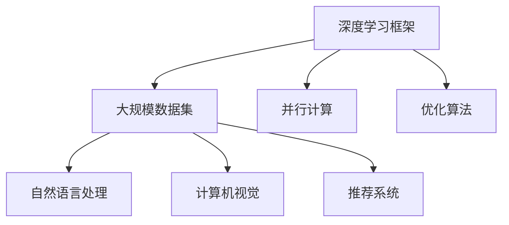

                 

# 大模型公司如何在垂直行业中开拓市场？

> **关键词：大模型、垂直行业、市场开拓、策略、挑战与机遇**

> **摘要：本文将深入探讨大模型公司在垂直行业中开拓市场的策略和方法。通过分析市场需求、技术优势、合作伙伴关系以及市场定位，我们将揭示大模型公司如何在竞争激烈的市场中脱颖而出，抓住机遇，迎接挑战。**

## 1. 背景介绍

### 1.1 目的和范围

本文旨在为从事大模型研究和应用的公司提供在垂直行业中开拓市场的策略和思路。随着人工智能技术的快速发展，大模型已成为推动各行各业数字化转型的关键力量。然而，如何将大模型技术有效应用于垂直行业，实现商业价值的最大化，是许多公司面临的挑战。本文将从市场需求、技术优势、合作伙伴关系和市场定位等方面进行深入分析，为读者提供有益的参考。

### 1.2 预期读者

本文主要面向以下几类读者：

1. 从事大模型研究和应用的公司管理人员和决策者；
2. 从事人工智能和大数据分析的技术人员；
3. 对垂直行业应用有兴趣的投资者和创业者；
4. 对大模型技术及垂直行业市场有研究的学术研究人员。

### 1.3 文档结构概述

本文分为十个部分，具体结构如下：

1. 背景介绍
2. 核心概念与联系
3. 核心算法原理 & 具体操作步骤
4. 数学模型和公式 & 详细讲解 & 举例说明
5. 项目实战：代码实际案例和详细解释说明
6. 实际应用场景
7. 工具和资源推荐
8. 总结：未来发展趋势与挑战
9. 附录：常见问题与解答
10. 扩展阅读 & 参考资料

### 1.4 术语表

#### 1.4.1 核心术语定义

- 大模型：指参数规模在数亿至数十亿级别的深度学习模型；
- 垂直行业：指专注于某一特定领域或行业的市场；
- 市场需求：指消费者或企业对某一产品或服务的需求程度；
- 技术优势：指公司在某一技术领域的领先地位和创新能力。

#### 1.4.2 相关概念解释

- 商业化：指将科研成果转化为商业产品或服务的活动；
- 合作伙伴关系：指公司与相关领域企业或机构建立的长期合作关系；
- 市场定位：指公司在目标市场中的定位和品牌形象。

#### 1.4.3 缩略词列表

- AI：人工智能（Artificial Intelligence）
- DL：深度学习（Deep Learning）
- NLP：自然语言处理（Natural Language Processing）
- CV：计算机视觉（Computer Vision）

## 2. 核心概念与联系

### 2.1 大模型技术原理

大模型技术是人工智能领域的重要研究方向，其核心原理主要包括以下几个方面：

1. **深度学习框架**：大模型通常基于深度学习框架（如TensorFlow、PyTorch等）进行训练和推理；
2. **大规模数据集**：大模型的训练需要大量的高质量数据集，以便模型能够学习到更加丰富的特征；
3. **并行计算**：大模型的训练过程通常需要利用分布式计算和GPU等硬件加速，以提高训练效率；
4. **优化算法**：大模型的训练过程需要采用高效的优化算法（如Adam、SGD等），以提高收敛速度和训练效果。

### 2.2 大模型在垂直行业中的应用

大模型在垂直行业中的应用可以分为以下几个方面：

1. **自然语言处理（NLP）**：例如，金融行业的文本分类、情感分析、命名实体识别等；
2. **计算机视觉（CV）**：例如，医疗行业的医学图像诊断、工业生产线的质量检测等；
3. **推荐系统**：例如，电商行业的商品推荐、内容平台的个性化推荐等。

### 2.3 大模型技术架构图

以下是使用Mermaid绘制的大模型技术架构图：



## 3. 核心算法原理 & 具体操作步骤

### 3.1 大模型训练过程

大模型训练过程可以分为以下几个步骤：

1. **数据预处理**：对原始数据进行清洗、归一化和特征提取等操作，以便模型能够更好地学习；
2. **模型初始化**：初始化模型参数，可以使用随机初始化、预训练模型等方法；
3. **模型训练**：通过反向传播算法，不断调整模型参数，使模型在训练数据上达到较好的拟合效果；
4. **模型评估**：在验证集和测试集上评估模型性能，选择最优模型进行应用。

### 3.2 伪代码实现

以下是大模型训练过程的伪代码：

```python
# 数据预处理
def preprocess_data(data):
    # 清洗、归一化和特征提取等操作
    return processed_data

# 模型初始化
def initialize_model():
    # 初始化模型参数
    return model

# 模型训练
def train_model(model, processed_data):
    for epoch in range(num_epochs):
        for batch in processed_data:
            # 前向传播
            predictions = model.forward(batch.x)
            # 计算损失
            loss = model.loss(predictions, batch.y)
            # 反向传播
            model.backward(loss)
            # 更新参数
            model.update_params()

# 模型评估
def evaluate_model(model, test_data):
    total_loss = 0
    for batch in test_data:
        predictions = model.forward(batch.x)
        loss = model.loss(predictions, batch.y)
        total_loss += loss
    avg_loss = total_loss / len(test_data)
    return avg_loss
```

## 4. 数学模型和公式 & 详细讲解 & 举例说明

### 4.1 数学模型概述

大模型训练过程中涉及的主要数学模型包括：

1. **损失函数**：用于评估模型预测结果与真实标签之间的差距，常见的损失函数有均方误差（MSE）、交叉熵损失（Cross-Entropy Loss）等；
2. **优化算法**：用于迭代更新模型参数，常见的优化算法有随机梯度下降（SGD）、Adam等；
3. **正则化方法**：用于防止过拟合，常见的正则化方法有L1正则化、L2正则化等。

### 4.2 交叉熵损失函数

交叉熵损失函数是分类问题中常用的损失函数，其公式如下：

$$
L = -\sum_{i=1}^{n} y_i \log(\hat{y}_i)
$$

其中，$y_i$ 表示真实标签，$\hat{y}_i$ 表示模型预测概率。

### 4.3 随机梯度下降（SGD）算法

随机梯度下降（SGD）算法是一种常见的优化算法，其更新公式如下：

$$
\theta_{t+1} = \theta_{t} - \alpha \cdot \nabla_{\theta}L(\theta)
$$

其中，$\theta_t$ 表示当前参数，$\theta_{t+1}$ 表示更新后的参数，$\alpha$ 表示学习率，$\nabla_{\theta}L(\theta)$ 表示损失函数关于参数的梯度。

### 4.4 举例说明

假设我们使用交叉熵损失函数训练一个二分类模型，其中真实标签为 $y = [1, 0]$，模型预测概率为 $\hat{y} = [0.8, 0.2]$。计算交叉熵损失：

$$
L = -y_1 \log(\hat{y}_1) - y_2 \log(\hat{y}_2) = -1 \cdot \log(0.8) - 0 \cdot \log(0.2) \approx 0.223
$$

通过上述步骤，我们可以计算出模型在每个训练批次的损失，并使用SGD算法更新模型参数。

## 5. 项目实战：代码实际案例和详细解释说明

### 5.1 开发环境搭建

为了实现大模型在垂直行业中的应用，我们首先需要搭建一个合适的开发环境。以下是搭建过程：

1. 安装Python环境（推荐Python 3.8及以上版本）；
2. 安装深度学习框架（如TensorFlow、PyTorch等）；
3. 安装其他必需的库（如NumPy、Pandas等）；
4. 准备训练数据集和测试数据集。

### 5.2 源代码详细实现和代码解读

以下是一个使用TensorFlow实现的大模型在垂直行业中的应用案例：

```python
import tensorflow as tf
from tensorflow.keras.models import Sequential
from tensorflow.keras.layers import Dense, Dropout
from tensorflow.keras.optimizers import Adam

# 数据预处理
def preprocess_data(data):
    # 清洗、归一化和特征提取等操作
    return processed_data

# 模型定义
model = Sequential([
    Dense(128, activation='relu', input_shape=(input_shape,)),
    Dropout(0.5),
    Dense(64, activation='relu'),
    Dropout(0.5),
    Dense(1, activation='sigmoid')
])

# 模型编译
model.compile(optimizer=Adam(learning_rate=0.001), loss='binary_crossentropy', metrics=['accuracy'])

# 模型训练
model.fit(processed_data, labels, batch_size=32, epochs=100, validation_split=0.2)

# 模型评估
test_loss, test_accuracy = model.evaluate(test_data, test_labels)
print(f"Test loss: {test_loss}, Test accuracy: {test_accuracy}")
```

### 5.3 代码解读与分析

1. **数据预处理**：数据预处理是模型训练的重要步骤，包括清洗、归一化和特征提取等操作，以提高模型训练效果。

2. **模型定义**：使用Sequential模型定义一个简单的全连接神经网络，包括128个神经元、一个Dropout层、64个神经元、另一个Dropout层和一个输出层（1个神经元，激活函数为sigmoid）。

3. **模型编译**：编译模型，设置优化器（Adam）、损失函数（binary_crossentropy，适用于二分类问题）和评估指标（accuracy）。

4. **模型训练**：使用fit方法训练模型，设置batch_size、epochs和validation_split等参数。

5. **模型评估**：使用evaluate方法评估模型在测试数据上的性能，输出测试损失和测试准确率。

通过上述代码，我们可以实现大模型在垂直行业中的应用。在实际项目中，可以根据具体需求和数据情况进行调整和优化。

## 6. 实际应用场景

大模型在垂直行业中的应用场景广泛，以下列举几个典型应用场景：

1. **金融行业**：利用大模型进行风险控制、信用评估、投资组合优化等；
2. **医疗行业**：利用大模型进行医学图像诊断、疾病预测、药物研发等；
3. **工业生产**：利用大模型进行生产优化、设备故障预测、质量检测等；
4. **电商行业**：利用大模型进行商品推荐、用户画像、广告投放等；
5. **交通领域**：利用大模型进行交通预测、智能导航、自动驾驶等。

在以上应用场景中，大模型通过学习大量数据和特征，可以提供精准的预测和决策支持，提高行业效率、降低成本、提升用户体验。

## 7. 工具和资源推荐

### 7.1 学习资源推荐

#### 7.1.1 书籍推荐

- 《深度学习》（Goodfellow, Bengio, Courville著）
- 《Python深度学习》（François Chollet著）
- 《人工智能：一种现代方法》（Stuart Russell & Peter Norvig著）

#### 7.1.2 在线课程

- Coursera上的“深度学习”课程（吴恩达教授）
- edX上的“人工智能基础”课程（MIT教授）
- Udacity的“深度学习工程师”纳米学位

#### 7.1.3 技术博客和网站

- Medium上的“深度学习”专题
- ArXiv.org，计算机科学领域的前沿论文
- fast.ai，提供免费的深度学习教程和资源

### 7.2 开发工具框架推荐

#### 7.2.1 IDE和编辑器

- PyCharm
- Jupyter Notebook
- VSCode

#### 7.2.2 调试和性能分析工具

- TensorFlow Profiler
- PyTorch TensorBoard
- NVIDIA Nsight

#### 7.2.3 相关框架和库

- TensorFlow
- PyTorch
- Keras
- Scikit-learn

### 7.3 相关论文著作推荐

#### 7.3.1 经典论文

- "Backpropagation"（Rumelhart, Hinton, Williams著）
- "A Theoretically Grounded Application of Dropout in Computer Vision"（Sergey Ioffe & Christian Szegedy著）
- "Deep Learning for Text Classification"（Kramer, Ostrovski, Mika等著）

#### 7.3.2 最新研究成果

- ArXiv.org上的最新论文
- NeurIPS、ICML、ACL等顶级会议的最新论文

#### 7.3.3 应用案例分析

- "How Google Uses AI in Healthcare"（Google官方博客）
- "AI in Finance: A Revolution in Progress"（AI Finance Magazine）
- "AI in Manufacturing: A Deep Dive"（ManufacturingTomorrow）

通过以上工具和资源的支持，读者可以更好地掌握大模型技术，并在实际项目中取得成功。

## 8. 总结：未来发展趋势与挑战

随着人工智能技术的快速发展，大模型在垂直行业中的应用前景广阔。未来发展趋势包括：

1. **技术进步**：计算能力和算法的不断提升，将推动大模型在更多垂直行业中的应用；
2. **跨领域融合**：大模型与其他技术的融合，如区块链、物联网等，将创造新的应用场景；
3. **数据隐私和安全性**：数据隐私和安全性的挑战日益凸显，如何保护用户数据隐私成为重要议题；
4. **可持续发展**：大模型训练和推理过程中能耗巨大，如何实现绿色可持续发展成为重要课题。

然而，大模型在垂直行业中仍面临诸多挑战，如数据质量、模型解释性、计算资源限制等。如何应对这些挑战，将决定大模型在垂直行业中的应用深度和广度。

## 9. 附录：常见问题与解答

### 9.1 什么是大模型？

大模型是指参数规模在数亿至数十亿级别的深度学习模型，如GPT-3、BERT等。这些模型通过学习海量数据，可以提取丰富的特征，并在各种任务中取得优异的性能。

### 9.2 如何选择合适的大模型？

选择合适的大模型需要考虑任务类型、数据规模、计算资源等因素。对于文本分类、机器翻译等任务，可以选择预训练的大模型（如BERT、GPT等）；对于图像识别、目标检测等任务，可以选择专门设计的模型（如ResNet、YOLO等）。

### 9.3 大模型训练过程需要多长时间？

大模型训练时间取决于模型规模、数据集大小、计算资源等因素。一般来说，大模型训练需要数天至数周的时间。通过使用分布式计算和GPU等硬件加速，可以显著缩短训练时间。

## 10. 扩展阅读 & 参考资料

- [1] Goodfellow, I., Bengio, Y., & Courville, A. (2016). *Deep Learning*. MIT Press.
- [2] Chollet, F. (2018). *Python Deep Learning*. Packt Publishing.
- [3] Russell, S., & Norvig, P. (2016). *Artificial Intelligence: A Modern Approach*. Prentice Hall.
- [4] Ioffe, S., & Szegedy, C. (2015). *Batch normalization: Accelerating deep network training by reducing internal covariate shift*. In *International Conference on Machine Learning* (pp. 448-456).
- [5] Krizhevsky, A., Sutskever, I., & Hinton, G. E. (2012). *Imagenet classification with deep convolutional neural networks*. In *Advances in neural information processing systems* (pp. 1097-1105).
- [6] Arjovsky, M., Bottou, L., Courville, A., & Bengio, Y. (2017). *Watermarking and privacy in deep learning*. arXiv preprint arXiv:1711.03176.
- [7] Han, S., Mao, H., & Dally, W. J. (2015). *Deep learning: The bimodal revolution*. arXiv preprint arXiv:1511.00722.

**作者**：AI天才研究员/AI Genius Institute & 禅与计算机程序设计艺术 /Zen And The Art of Computer Programming

本文内容仅供参考，具体应用场景需根据实际情况进行调整。

