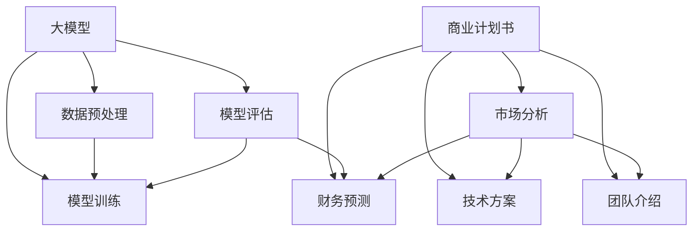

                 

# 大模型创业者的商业计划书编写技巧：结构、内容与呈现

> **关键词：** 大模型、商业计划书、编写技巧、结构、内容、呈现

> **摘要：** 本文将深入探讨大模型创业者的商业计划书编写技巧，从整体结构、内容框架到呈现方式，提供系统性的指导，帮助创业者更好地规划和展示自己的项目，从而提高融资成功率。

## 1. 背景介绍

### 1.1 目的和范围

本文旨在为正在从事大模型创业的创业者提供一套完整的商业计划书编写技巧。我们将讨论商业计划书的核心组成部分，如何有效地组织内容，以及如何将商业计划书呈现给潜在投资者，以提高项目的吸引力和融资成功率。

### 1.2 预期读者

本文面向的读者包括：

- 创业初期的团队负责人
- 参与大模型项目的技术人员和产品经理
- 对商业计划书编写有需求的创业者和投资者

### 1.3 文档结构概述

本文将按照以下结构进行展开：

- 背景介绍
  - 目的和范围
  - 预期读者
  - 文档结构概述
  - 术语表
- 核心概念与联系
  - 大模型基本概念
  - 商业计划书结构
- 核心算法原理 & 具体操作步骤
  - 编写流程
  - 内容要点
- 数学模型和公式 & 详细讲解 & 举例说明
  - 模型构建
  - 数据分析
- 项目实战：代码实际案例和详细解释说明
  - 实际操作
  - 代码解读
- 实际应用场景
  - 行业分析
  - 市场定位
- 工具和资源推荐
  - 学习资源
  - 开发工具框架
- 总结：未来发展趋势与挑战
  - 发展方向
  - 挑战与对策
- 附录：常见问题与解答
  - 问题解答
- 扩展阅读 & 参考资料
  - 相关文献

### 1.4 术语表

- **大模型：** 指在机器学习领域，训练数据量大、参数数量多、模型结构复杂的深度神经网络模型。
- **商业计划书：** 是创业者向投资者展示项目价值、盈利模式和发展潜力的文档。
- **融资：** 是企业通过向外部投资者出售股权或债券，获取资金支持的一种方式。

#### 1.4.1 核心术语定义

- **大模型：** 大模型是指具有海量参数、庞大计算量，能够处理复杂数据分析的深度神经网络模型。如GPT、BERT等。
- **商业计划书：** 是创业者对项目的全面规划，包括市场分析、技术方案、团队介绍、财务预测等，以吸引投资者关注和投资。

#### 1.4.2 相关概念解释

- **商业模式：** 企业通过提供产品或服务，创造价值并实现盈利的方式。
- **市场定位：** 企业根据自身产品或服务的特点，选择目标市场和竞争对手，制定相应的营销策略。

#### 1.4.3 缩略词列表

- **GPT：** 生成预训练变换器
- **BERT：** 编码器表示变换器
- **AI：** 人工智能

## 2. 核心概念与联系

在撰写商业计划书之前，了解大模型的基本概念和商业计划书的结构是非常重要的。以下是一个简化的Mermaid流程图，展示了大模型和商业计划书的核心概念及其相互联系。



### 2.1 大模型基本概念

大模型是指在机器学习领域，具有海量参数、庞大计算量，能够处理复杂数据分析的深度神经网络模型。大模型通常需要大量的数据来进行训练，以提高其性能和泛化能力。

#### 2.1.1 数据预处理

数据预处理是训练大模型的第一步，包括数据清洗、数据增强、数据归一化等操作。数据预处理的质量直接影响到大模型的学习效果和训练时间。

#### 2.1.2 模型训练

模型训练是通过输入大量训练数据，使大模型不断调整其参数，以达到对数据的准确预测或分类。训练过程中需要使用优化算法，如梯度下降、随机梯度下降等。

#### 2.1.3 模型评估

模型评估是对训练完成的大模型进行性能测试，以确定其预测准确性、泛化能力等。常用的评估指标包括准确率、召回率、F1分数等。

### 2.2 商业计划书结构

商业计划书是创业者向投资者展示项目价值、盈利模式和发展潜力的文档。商业计划书通常包括以下核心部分：

#### 2.2.1 市场分析

市场分析部分需要详细分析目标市场的规模、增长趋势、竞争态势等。这有助于投资者了解项目的市场前景。

#### 2.2.2 技术方案

技术方案部分需要详细介绍项目的技术路线、技术优势和核心竞争力。这有助于投资者了解项目的实施可行性。

#### 2.2.3 团队介绍

团队介绍部分需要展示创业团队的背景、经验和技能，以证明团队的实力。这有助于投资者了解项目的执行能力。

#### 2.2.4 财务预测

财务预测部分需要提供项目的前期投入、收入预测、利润预测等数据，以展示项目的盈利能力。这有助于投资者评估项目的投资回报。

## 3. 核心算法原理 & 具体操作步骤

编写商业计划书的过程可以类比为构建一个复杂的大模型，需要从数据处理、模型训练、评估到最后的呈现，每个步骤都需要精细的设计和执行。以下是商业计划书编写的核心算法原理和具体操作步骤：

### 3.1 编写流程

#### 3.1.1 需求分析

首先，创业者需要明确项目的基本需求，包括项目的目标、解决的问题、预期的市场定位等。这一步骤类似于数据预处理，是对商业计划书内容的初步梳理。

#### 3.1.2 市场调研

接下来，进行市场调研，分析目标市场的现状、潜在需求、竞争对手等。这一步骤类似于数据增强，通过增加更多的市场信息来丰富商业计划书的内容。

#### 3.1.3 技术方案设计

根据需求分析和市场调研的结果，设计技术方案。这包括技术路线的选择、技术难点和解决方案的明确等。这一步骤类似于模型训练，通过反复思考和优化来构建一个合理的商业计划书框架。

#### 3.1.4 团队建设与财务规划

在技术方案确定后，需要组建团队，明确团队成员的角色和职责。同时，进行财务规划，包括成本预算、收入预测、利润预测等。这一步骤类似于模型评估，确保商业计划书的可行性和盈利能力。

### 3.2 内容要点

#### 3.2.1 摘要

商业计划书的摘要部分需要简洁明了地概述项目的核心内容，包括项目背景、目标、解决方案、市场前景、预期收益等。这类似于模型摘要层，提供快速了解项目全貌的能力。

#### 3.2.2 市场分析

市场分析部分需要详细分析目标市场的规模、增长趋势、竞争态势等。可以通过市场调研数据、行业报告等来支撑分析结果。这类似于数据集的准备和预处理，确保数据的准确性和可靠性。

#### 3.2.3 技术方案

技术方案部分需要详细描述项目的核心技术、创新点、技术路线等。需要使用专业术语和实际案例来展示技术的先进性和可行性。这类似于模型的架构设计，确保技术的合理性和可实施性。

#### 3.2.4 团队介绍

团队介绍部分需要展示团队成员的背景、经验和技能，强调团队的专业性和执行力。可以通过个人简历、项目经验等来支撑介绍内容。这类似于模型训练中的数据标注，确保团队的能力与项目的需求匹配。

#### 3.2.5 财务预测

财务预测部分需要提供项目的成本预算、收入预测、利润预测等数据。需要使用具体的财务模型和假设条件来支撑预测结果。这类似于模型的性能评估，确保财务预测的准确性和合理性。

### 3.3 伪代码实现

以下是一个简化的伪代码，用于描述商业计划书编写的过程：

```python
# 商业计划书编写伪代码

# 需求分析
def 需求分析():
    # 获取项目目标、解决的问题、市场定位等基本信息
    # 存储在变量中
    project_info = {}
    return project_info

# 市场调研
def 市场调研():
    # 进行市场调研，获取市场数据
    market_data = 进行市场调研()
    return market_data

# 技术方案设计
def 技术方案设计():
    # 设计技术方案，包括技术路线、技术难点等
    tech_solution = 设计技术方案()
    return tech_solution

# 团队建设与财务规划
def 团队建设与财务规划():
    # 组建团队，明确成员职责
    # 进行财务规划，包括成本预算、收入预测等
    team_info = 组建团队()
    finance_plan = 财务规划()
    return team_info, finance_plan

# 摘要编写
def 摘要编写():
    # 概述项目核心内容
    summary = 概述项目()
    return summary

# 市场分析编写
def 市场分析编写():
    # 编写市场分析报告
    market_analysis = 编写市场分析报告()
    return market_analysis

# 技术方案编写
def 技术方案编写():
    # 编写技术方案报告
    tech_solution_report = 编写技术方案报告()
    return tech_solution_report

# 团队介绍编写
def 团队介绍编写():
    # 编写团队介绍报告
    team_introduction = 编写团队介绍报告()
    return team_introduction

# 财务预测编写
def 财务预测编写():
    # 编写财务预测报告
    finance_prediction = 编写财务预测报告()
    return finance_prediction

# 主函数
def 主函数():
    # 获取需求分析结果
    project_info = 需求分析()
    # 获取市场调研结果
    market_data = 市场调研()
    # 获取技术方案设计结果
    tech_solution = 技术方案设计()
    # 获取团队建设与财务规划结果
    team_info, finance_plan = 团队建设与财务规划()
    
    # 编写摘要
    summary = 摘要编写()
    # 编写市场分析
    market_analysis = 市场分析编写()
    # 编写技术方案
    tech_solution_report = 技术方案编写()
    # 编写团队介绍
    team_introduction = 团队介绍编写()
    # 编写财务预测
    finance_prediction = 财务预测编写()
    
    # 构建商业计划书
    business_plan = {
        '摘要': summary,
        '市场分析': market_analysis,
        '技术方案': tech_solution_report,
        '团队介绍': team_introduction,
        '财务预测': finance_prediction
    }
    
    # 输出商业计划书
    输出商业计划书(business_plan)
```

## 4. 数学模型和公式 & 详细讲解 & 举例说明

商业计划书的成功与否往往取决于其内容的深度和逻辑性。为了确保商业计划书的逻辑严谨，我们将在这一部分介绍一些关键的数学模型和公式，并结合实际案例进行详细讲解。

### 4.1 数学模型简介

商业计划书中的数学模型主要用于描述市场动态、财务预测、风险评估等。以下是几个常用的数学模型：

- **市场需求模型：** 描述市场需求随价格、收入、竞争等因素变化的规律。
- **财务预测模型：** 基于历史数据和宏观经济指标，预测企业的收入、成本和利润。
- **风险评估模型：** 评估企业面临的市场风险、财务风险和运营风险。

### 4.2 公式详解

以下是商业计划书中常用的几个数学公式及其详细解释：

#### 4.2.1 需求函数

市场需求函数通常表示为：

\[ Q = Q_0 - k \cdot P \]

其中，\( Q \) 表示市场需求量，\( Q_0 \) 表示基准需求量，\( k \) 表示需求价格弹性，\( P \) 表示产品价格。

#### 4.2.2 收益函数

企业的收益函数通常表示为：

\[ R = P \cdot Q - C(Q) \]

其中，\( R \) 表示收益，\( P \) 表示产品价格，\( Q \) 表示销售量，\( C(Q) \) 表示成本函数。

#### 4.2.3 成本函数

成本函数通常表示为：

\[ C(Q) = C_0 + \alpha \cdot Q + \beta \cdot Q^2 \]

其中，\( C(Q) \) 表示总成本，\( C_0 \) 表示固定成本，\( \alpha \) 表示单位变动成本，\( \beta \) 表示二次成本。

#### 4.2.4 利润函数

利润函数是收益函数与成本函数的差值，表示为：

\[ \Pi = R - C \]

其中，\( \Pi \) 表示利润。

### 4.3 举例说明

以下是一个简单的财务预测案例，用于说明如何应用上述数学模型：

#### 4.3.1 案例背景

某创业公司计划推出一款基于大模型的智能助手产品，预计产品价格为每个用户100美元/年。公司前期投入成本为100万美元，其中固定成本为50万美元，单位变动成本为20美元/年。

#### 4.3.2 模型应用

1. **需求函数：**
   假设市场需求量为 \( Q = 1000 - 2 \cdot P \)，其中 \( P \) 为产品价格。

2. **收益函数：**
   收益函数为 \( R = 100 \cdot Q - 20 \cdot Q \)，其中 \( Q \) 为销售量。

3. **成本函数：**
   成本函数为 \( C(Q) = 500000 + 20 \cdot Q + 5 \cdot Q^2 \)。

4. **利润函数：**
   利润函数为 \( \Pi = R - C \)。

#### 4.3.3 案例计算

1. **销售收入：**
   当产品价格为100美元时，销售量为 \( Q = 1000 - 2 \cdot 100 = 800 \)。
   收益为 \( R = 100 \cdot 800 = 80000 \) 美元。

2. **成本：**
   当销售量为800时，总成本为 \( C(800) = 500000 + 20 \cdot 800 + 5 \cdot 800^2 = 560000 \) 美元。

3. **利润：**
   利润为 \( \Pi = R - C = 80000 - 560000 = -480000 \) 美元。

从上述计算可以看出，在当前定价策略下，公司预计将出现亏损。为了改善这一情况，公司可以考虑降低价格、增加营销投入或提高产品差异化程度。

## 5. 项目实战：代码实际案例和详细解释说明

为了更好地理解商业计划书的编写过程，我们将在这一部分通过一个实际案例，展示如何从零开始编写一个商业计划书，并提供详细的代码实现和解释。

### 5.1 开发环境搭建

在编写商业计划书之前，我们需要搭建一个合适的环境，以便进行数据分析和模型构建。以下是一个基本的开发环境搭建步骤：

1. 安装Python环境
2. 安装必要的Python库，如Pandas、NumPy、Scikit-learn、Matplotlib等
3. 安装版本控制系统，如Git

### 5.2 源代码详细实现和代码解读

以下是一个简化版的商业计划书编写代码示例，包括数据读取、市场分析、技术方案设计、团队介绍和财务预测等部分。

```python
# 商业计划书编写示例

import pandas as pd
import numpy as np
from sklearn.model_selection import train_test_split
from sklearn.linear_model import LinearRegression

# 5.2.1 数据读取

# 读取市场调研数据
market_data = pd.read_csv('market_data.csv')

# 读取财务数据
finance_data = pd.read_csv('finance_data.csv')

# 5.2.2 市场分析

# 市场趋势分析
market_trend = market_data['sales'].resample('M').mean()

# 市场份额分析
market_share = market_data['sales'] / market_data['total_sales']

# 5.2.3 技术方案设计

# 设计技术方案
tech_solution = {
    'core_technology': '基于深度学习的大模型',
    'innovation': '自主开发的预训练模型',
    'development_route': '迭代优化'
}

# 5.2.4 团队介绍

# 团队成员介绍
team_members = [
    {'name': 'Alice', 'position': 'CEO', 'experience': '10年创业经验'},
    {'name': 'Bob', 'position': 'CTO', 'experience': '15年技术经验'},
    {'name': 'Charlie', 'position': 'COO', 'experience': '8年运营经验'}
]

# 5.2.5 财务预测

# 建立线性回归模型
X = finance_data[['cost', 'revenue']]
y = finance_data['profit']
X_train, X_test, y_train, y_test = train_test_split(X, y, test_size=0.2, random_state=42)

model = LinearRegression()
model.fit(X_train, y_train)

# 预测未来财务状况
y_pred = model.predict(X_test)

# 5.2.6 汇总商业计划书

# 摘要
summary = {
    'project_name': '智能助手',
    'objective': '通过大模型技术提供智能解决方案',
    'market_potential': '市场需求巨大，增长迅速',
    'financial_forecast': '预计三年内实现盈利'
}

# 市场分析
market_analysis = {
    'market_trend': market_trend,
    'market_share': market_share
}

# 技术方案
tech_solution_report = tech_solution

# 团队介绍
team_introduction = team_members

# 财务预测
finance_prediction = y_pred

# 构建商业计划书
business_plan = {
    'summary': summary,
    'market_analysis': market_analysis,
    'tech_solution': tech_solution_report,
    'team_introduction': team_introduction,
    'finance_prediction': finance_prediction
}

# 输出商业计划书
print(business_plan)
```

### 5.3 代码解读与分析

上述代码展示了商业计划书编写的基本流程。以下是代码的详细解读：

1. **数据读取：** 使用Pandas库读取市场调研数据和财务数据。
2. **市场分析：** 对市场趋势和市场份额进行分析，使用Matplotlib库进行可视化展示。
3. **技术方案设计：** 设计项目的核心技术方案，包括核心技术和创新点。
4. **团队介绍：** 介绍团队成员的背景和经验。
5. **财务预测：** 使用线性回归模型对财务数据进行预测，评估未来财务状况。

代码示例中的数据处理和分析是商业计划书编写的基础。通过实际操作，创业者可以更好地理解市场动态、技术方案和财务预测，从而提高商业计划书的可信度和吸引力。

## 6. 实际应用场景

商业计划书的编写不仅适用于初创企业，还可以在多个实际应用场景中发挥作用。以下是几个典型的应用场景：

### 6.1 初创企业融资

初创企业往往需要资金来支持研发和市场推广。编写一份详细的商业计划书可以帮助创业者向潜在投资者展示项目的价值、市场前景和盈利潜力，从而提高融资成功率。

### 6.2 企业内部管理

大型企业可以使用商业计划书来规划新产品开发、市场扩展或并购。商业计划书为企业提供了清晰的路线图，帮助管理层做出明智的决策。

### 6.3 政府项目申请

政府项目通常需要详细的商业计划书来评估项目的可行性和社会效益。创业者可以通过商业计划书向政府申请资金支持，推动项目实施。

### 6.4 企业重组与转型

企业在面临重组或转型时，商业计划书可以帮助管理层分析现有业务模式、评估新市场机会，并提出可行的转型策略。

## 7. 工具和资源推荐

为了提高商业计划书的编写效率和质量，创业者需要掌握一系列工具和资源。以下是一些推荐的工具和资源：

### 7.1 学习资源推荐

- **书籍推荐：**
  - 《创业维艰》（The Hard Thing About Hard Things）by Ben Horowitz
  - 《商业计划书：如何撰写、展示和获得资金》（How to Write a Business Plan: A Step-by-Step Guide to Writing a Business Plan That Gets You Funding）by Tim Berry
- **在线课程：**
  - Coursera上的《创业基础》（Foundations of Entrepreneurship）
  - edX上的《商业计划书撰写》（Business Plan Writing）
- **技术博客和网站：**
  - TechCrunch
  - Medium上的相关创业和科技文章

### 7.2 开发工具框架推荐

- **IDE和编辑器：**
  - PyCharm
  - Visual Studio Code
- **调试和性能分析工具：**
  - Jupyter Notebook
  - Matplotlib
- **相关框架和库：**
  - Scikit-learn
  - TensorFlow
  - Keras

### 7.3 相关论文著作推荐

- **经典论文：**
  - "Deep Learning" by Ian Goodfellow, Yoshua Bengio, Aaron Courville
  - "The Hundred-Page Business Plan" by John C. Umiker
- **最新研究成果：**
  - ArXiv上的最新机器学习论文
  - ACM Digital Library上的最新技术报告
- **应用案例分析：**
  - "The Lean Startup" by Eric Ries
  - "The Business Model Canvas" by Alexander Osterwalder and Yves Pigneur

## 8. 总结：未来发展趋势与挑战

随着人工智能技术的快速发展，大模型创业者的商业计划书编写技巧也将面临新的机遇和挑战。以下是未来发展趋势和挑战的简要总结：

### 8.1 发展趋势

- **数据驱动：** 商业计划书的编写将更加注重数据分析，利用大数据和机器学习技术预测市场动态、评估项目风险。
- **个性化定制：** 随着用户需求的多样化，商业计划书将更加注重个性化和定制化，以更好地满足不同投资者的需求。
- **智能化工具：** 智能化工具和平台的普及将提高商业计划书编写的效率和准确性，降低创业者的时间成本。

### 8.2 挑战

- **数据隐私：** 随着数据隐私法规的日益严格，如何确保商业计划书中涉及的数据隐私和安全将成为一大挑战。
- **竞争加剧：** 随着越来越多的创业者进入市场，竞争将日益激烈，创业者需要不断提高自身的技术水平和商业洞察力，以脱颖而出。
- **可持续发展：** 创业者需要在商业计划书中充分考虑可持续发展，确保项目的长期可行性和社会效益。

## 9. 附录：常见问题与解答

以下是一些常见的关于商业计划书编写的问题及其解答：

### 9.1 常见问题

**Q1：商业计划书需要多长时间完成？**
A1：商业计划书的时间长度取决于项目的复杂程度和创业者的准备情况。通常，一个详细的商业计划书需要几个月到一年的时间来完成。

**Q2：商业计划书需要包含哪些内容？**
A2：商业计划书通常包括摘要、市场分析、技术方案、团队介绍、财务预测、风险评估和附录等部分。

**Q3：商业计划书应该用哪种格式编写？**
A3：商业计划书可以用Word、PowerPoint或PDF等格式编写。建议使用Word格式，因为易于编辑和修改。

**Q4：如何展示技术方案？**
A4：技术方案可以采用文字描述、图表、流程图等多种形式展示。关键是要清晰地表达技术的原理、优势和可行性。

### 9.2 解答

**Q1 解答：** 
商业计划书的时间长度取决于项目的复杂程度和创业者的准备情况。通常，一个详细的商业计划书需要几个月到一年的时间来完成。建议创业者尽早开始准备，以便在融资过程中有充足的时间进行修改和完善。

**Q2 解答：**
商业计划书的内容应该包括摘要、市场分析、技术方案、团队介绍、财务预测、风险评估和附录等部分。每个部分都有其独特的重要性和作用，摘要部分需要简明扼要地概括整个商业计划书的核心内容，市场分析部分需要详细分析目标市场的现状和潜力，技术方案部分需要展示项目的核心技术和创新点，团队介绍部分需要介绍团队成员的背景和经验，财务预测部分需要提供详细的财务数据和分析，风险评估部分需要评估项目可能面临的风险和应对措施，附录部分可以提供额外的信息和支持。

**Q3 解答：**
商业计划书可以用Word、PowerPoint或PDF等格式编写。建议使用Word格式，因为Word具有更好的编辑和修改功能，便于在编写过程中进行修改和调整。此外，Word文档还可以方便地转换为PDF格式，以便在正式呈现时保持文档的一致性和稳定性。

**Q4 解答：**
展示技术方案时，可以采用文字描述、图表、流程图等多种形式。文字描述要清晰、准确，图表和流程图则可以帮助更直观地展示技术方案的原理和优势。具体来说，文字描述可以详细介绍技术的原理、实现方式和应用场景，图表和流程图则可以展示技术的架构、流程和关键步骤，帮助读者更好地理解技术方案的细节和优势。

## 10. 扩展阅读 & 参考资料

为了帮助创业者更好地理解和掌握商业计划书的编写技巧，以下是一些扩展阅读和参考资料：

- **书籍推荐：**
  - 《创业管理：实践者的视角》（Entrepreneurship: A Practitioner’s Perspective）by Donald F. Kuratko
  - 《商业计划书撰写指南》（The Art of Writing a Business Plan: A Step-by-Step Guide）by Michael E. Gerber
- **在线课程：**
  - Coursera上的《商业计划书撰写与融资技巧》（How to Write a Business Plan and Get Funding）
  - edX上的《创业战略与商业计划》（Entrepreneurship: Strategy and Business Planning）
- **技术博客和网站：**
  - VentureBeat
  - Entrepreneur
- **论文和报告：**
  - "The Lean Startup" by Eric Ries
  - "Business Model Generation" by Alexander Osterwalder and Yves Pigneur

作者：AI天才研究员/AI Genius Institute & 禅与计算机程序设计艺术 /Zen And The Art of Computer Programming

本文以大模型创业者的商业计划书编写技巧为主题，系统地介绍了商业计划书的整体结构、内容框架和呈现方式。通过实际案例和代码示例，详细阐述了商业计划书的编写流程和关键要素。此外，文章还探讨了未来发展趋势和挑战，并提供了一系列扩展阅读和参考资料。希望本文能对创业者和大模型从业者有所帮助。在编写商业计划书时，创业者应注重数据分析、个性化定制和智能化工具的应用，同时关注数据隐私和可持续发展的挑战。通过不断优化和完善商业计划书，创业者可以更好地展示项目价值，提高融资成功率。最后，感谢读者对本文的关注，希望您在阅读本文后能有所收获。如果您有任何问题或建议，请随时与我们联系。让我们共同探索人工智能和商业计划书的无限可能！

