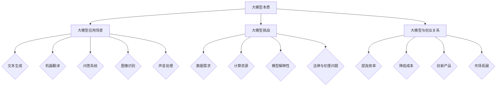

                 

# 大模型创业：产品创新与市场分析

> 关键词：大模型、创业、产品创新、市场分析、人工智能

> 摘要：本文旨在探讨大模型创业过程中，如何通过产品创新和市场分析实现商业成功。我们将从背景介绍、核心概念与联系、核心算法原理、数学模型和公式、项目实战、实际应用场景、工具和资源推荐等方面展开深入分析，为创业者提供具有实际操作价值的指导。

## 1. 背景介绍

### 1.1 目的和范围

本文的目的是为创业者提供在大模型创业过程中关于产品创新和市场分析的实用建议。我们将探讨以下几个关键领域：

- 大模型的本质及其在创业中的应用
- 产品创新的方法与策略
- 市场分析的步骤与工具
- 创业过程中面临的挑战与应对策略

### 1.2 预期读者

本文主要面向以下读者群体：

- 创业者：希望在大模型领域开展业务的人士
- 技术人员：对人工智能和机器学习有一定了解，希望将技术应用于商业场景
- 产品经理：关注产品创新和市场分析，寻求提升产品竞争力的方法

### 1.3 文档结构概述

本文分为十个部分，具体结构如下：

1. 背景介绍
2. 核心概念与联系
3. 核心算法原理 & 具体操作步骤
4. 数学模型和公式 & 详细讲解 & 举例说明
5. 项目实战：代码实际案例和详细解释说明
6. 实际应用场景
7. 工具和资源推荐
8. 总结：未来发展趋势与挑战
9. 附录：常见问题与解答
10. 扩展阅读 & 参考资料

### 1.4 术语表

#### 1.4.1 核心术语定义

- 大模型：指具有大规模参数的神经网络模型，如GPT、BERT等
- 产品创新：指通过创造新颖的产品或改进现有产品，满足市场需求的过程
- 市场分析：指对市场需求、竞争状况、用户行为等进行研究，以指导产品开发和营销策略

#### 1.4.2 相关概念解释

- 人工智能：指模拟人类智能的技术，包括机器学习、深度学习等
- 创业：指创建新企业或开展新业务的过程

#### 1.4.3 缩略词列表

- GPT：Generative Pre-trained Transformer
- BERT：Bidirectional Encoder Representations from Transformers
- AI：Artificial Intelligence
- ML：Machine Learning
- DL：Deep Learning

## 2. 核心概念与联系

在探讨大模型创业之前，我们首先需要理解以下几个核心概念及其相互关系。

### 2.1 大模型的本质

大模型是指具有大规模参数的神经网络模型，如GPT、BERT等。这些模型通过在海量数据上进行预训练，获得了强大的语义理解、文本生成和分类能力。大模型的本质是一种人工智能技术，具有如下特点：

- 高参数量：大模型通常拥有数十亿至数万亿个参数，使其在处理复杂任务时具有优势
- 预训练：大模型通过在大量无标签数据上进行预训练，为后续的特定任务提供了强大的基础
- 通用性：大模型在多种任务上表现出色，如文本生成、机器翻译、问答系统等

### 2.2 大模型的应用场景

大模型在创业中的应用场景非常广泛，以下列举几个典型的应用场景：

- 文本生成：如自动写作、聊天机器人、内容生成等
- 机器翻译：如实时翻译、跨语言检索等
- 问答系统：如智能客服、智能助手等
- 图像识别：如人脸识别、物体检测等
- 声音处理：如语音识别、语音合成等

### 2.3 大模型的挑战

尽管大模型在多个领域取得了显著成果，但在创业过程中仍面临一系列挑战：

- 数据需求：大模型需要大量高质量的数据进行训练，这对数据获取和处理提出了高要求
- 计算资源：大模型训练和推理需要大量的计算资源，对硬件和能耗有较高要求
- 模型解释性：大模型的决策过程往往是非线性和复杂的，难以进行准确解释
- 法律与伦理问题：大模型在应用过程中涉及数据隐私、偏见等问题，需要遵守相关法律法规和道德规范

### 2.4 大模型与创业的关系

大模型在创业中的应用，可以为企业带来以下几个方面的优势：

- 提高效率：大模型可以自动化处理大量任务，提高企业运营效率
- 降低成本：大模型可以减少人力成本和重复性工作，降低企业运营成本
- 创新产品：大模型可以为企业提供创新的解决方案，助力产品创新
- 市场拓展：大模型可以为企业开拓新的市场，增加业务收入

综上所述，大模型作为人工智能的核心技术，在创业过程中具有广泛的应用前景。然而，创业者在应用大模型时，需要充分考虑其挑战，采取相应的策略和措施，以实现商业成功。

### 2.5 Mermaid 流程图

下面是关于大模型创业的核心概念与联系的 Mermaid 流程图：



## 3. 核心算法原理 & 具体操作步骤

### 3.1 大模型算法原理

大模型的核心算法是深度学习，尤其是基于神经网络的方法。深度学习是一种通过多层神经网络对数据进行特征提取和转换的方法，其基本原理包括以下几个步骤：

- **数据输入**：输入大量数据，通常是无标签的原始数据，如文本、图像、声音等
- **特征提取**：通过多层神经网络对输入数据进行特征提取，每一层神经网络都会对输入数据进行一次非线性变换
- **参数优化**：通过优化网络参数，使模型在训练数据上取得更好的性能，常用的优化算法有梯度下降、Adam等
- **模型评估**：在测试数据上评估模型性能，以验证模型在未知数据上的泛化能力

### 3.2 具体操作步骤

下面我们以GPT-3为例，详细讲解大模型的具体操作步骤：

#### 3.2.1 数据准备

1. **数据收集**：收集大量无标签文本数据，如维基百科、新闻、社交媒体等
2. **数据预处理**：对文本数据进行清洗和预处理，如去除特殊字符、分词、词向量化等

#### 3.2.2 模型架构设计

1. **选择模型**：选择合适的预训练模型，如GPT-3
2. **调整超参数**：根据任务需求和硬件资源，调整模型参数，如学习率、批量大小等

#### 3.2.3 模型训练

1. **前向传播**：将输入数据传递给模型，计算输出结果
2. **计算损失**：计算模型输出与真实值之间的差距，即损失函数
3. **反向传播**：根据损失函数计算梯度，更新模型参数
4. **迭代训练**：重复前向传播和反向传播过程，直至模型收敛

#### 3.2.4 模型评估

1. **选择评估指标**：根据任务类型选择合适的评估指标，如准确率、F1值等
2. **在测试集上评估**：在测试集上评估模型性能，以验证模型泛化能力

#### 3.2.5 模型应用

1. **部署模型**：将训练好的模型部署到生产环境中，如服务器、云端等
2. **应用场景**：根据任务需求，将模型应用于实际场景，如文本生成、机器翻译、问答系统等

### 3.3 伪代码实现

下面是GPT-3的伪代码实现：

```python
# 数据准备
data = load_pretrained_dataset()

# 模型架构设计
model = GPT3_model(vocab_size=50000, layer_size=12, hidden_size=1024, learning_rate=0.00015)

# 模型训练
for epoch in range(num_epochs):
    for batch in data_loader(data):
        # 前向传播
        output = model(batch)

        # 计算损失
        loss = compute_loss(output, target)

        # 反向传播
        model.backward(loss)

        # 更新参数
        model.update_params()

# 模型评估
evaluate(model, test_data)

# 模型应用
deploy_model(model, production_environment)
```

## 4. 数学模型和公式 & 详细讲解 & 举例说明

### 4.1 数学模型

大模型的核心是深度学习，其数学模型主要包括以下部分：

- **神经网络模型**：由多个神经元（节点）和连接（边）组成的网络结构，用于对数据进行特征提取和转换
- **激活函数**：对神经网络中的节点输出进行非线性变换，常用的激活函数有ReLU、Sigmoid、Tanh等
- **损失函数**：用于衡量模型预测值与真实值之间的差距，常用的损失函数有均方误差（MSE）、交叉熵（Cross-Entropy）等
- **优化算法**：用于更新模型参数，使模型在训练数据上取得更好的性能，常用的优化算法有梯度下降（Gradient Descent）、Adam等

### 4.2 公式讲解

下面我们将详细介绍几个常用的数学公式。

#### 4.2.1 梯度下降

梯度下降是一种优化算法，用于更新模型参数。其公式如下：

$$
\theta_{\text{new}} = \theta_{\text{current}} - \alpha \cdot \nabla_{\theta} J(\theta)
$$

其中，$\theta$ 表示模型参数，$\alpha$ 表示学习率，$J(\theta)$ 表示损失函数。

#### 4.2.2 交叉熵

交叉熵是一种损失函数，用于衡量模型预测值与真实值之间的差距。其公式如下：

$$
J(\theta) = -\sum_{i} y_i \log(p_i)
$$

其中，$y_i$ 表示真实值，$p_i$ 表示模型预测值。

#### 4.2.3 Adam优化算法

Adam是一种基于梯度下降的优化算法，其公式如下：

$$
\begin{cases}
v_t = \beta_1 x_t + (1 - \beta_1) (x_t - \mu_t) \\
s_t = \beta_2 x_t^2 + (1 - \beta_2) (x_t^2 - \mu_t^2) \\
\theta_{\text{new}} = \theta_{\text{current}} - \alpha \cdot \frac{m_t}{\sqrt{s_t} + \epsilon}
\end{cases}
$$

其中，$v_t$ 和 $s_t$ 分别为momen

