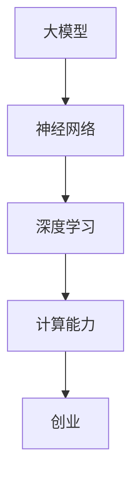

                 


# 大模型创业：创新与挑战共存

> 关键词：大模型、创业、创新、挑战、算法、架构、应用

> 摘要：本文将探讨大模型在创业领域中的创新与挑战。通过对大模型核心概念、算法原理、数学模型以及实际应用场景的分析，我们将揭示大模型在创业中的潜力和挑战，为创业者提供有益的启示。

## 1. 背景介绍

### 1.1 目的和范围

本文旨在分析大模型在创业领域中的应用，探讨其带来的创新与挑战。我们首先介绍大模型的基本概念和核心算法原理，然后讨论其数学模型，接着分析实际应用场景，最后总结未来发展趋势与挑战。

### 1.2 预期读者

本文适合对大模型和创业有一定了解的读者，包括创业者、技术专家、研究人员以及相关领域的从业人员。

### 1.3 文档结构概述

本文分为十个部分，具体结构如下：

1. 背景介绍
2. 核心概念与联系
3. 核心算法原理 & 具体操作步骤
4. 数学模型和公式 & 详细讲解 & 举例说明
5. 项目实战：代码实际案例和详细解释说明
6. 实际应用场景
7. 工具和资源推荐
8. 总结：未来发展趋势与挑战
9. 附录：常见问题与解答
10. 扩展阅读 & 参考资料

### 1.4 术语表

#### 1.4.1 核心术语定义

- 大模型：指参数量巨大、计算复杂度极高的深度学习模型，如GPT-3、BERT等。
- 创业：指创立新的企业或项目，以实现商业目标。

#### 1.4.2 相关概念解释

- 深度学习：一种机器学习方法，通过多层神经网络对数据进行分析和学习。
- 计算能力：指计算机在单位时间内处理数据的能力。

#### 1.4.3 缩略词列表

- GPT-3：Generative Pre-trained Transformer 3，一种大规模的深度学习模型。
- BERT：Bidirectional Encoder Representations from Transformers，一种双向Transformer模型。

## 2. 核心概念与联系

为了更好地理解大模型在创业中的应用，我们首先需要了解大模型的核心概念和架构。以下是使用Mermaid流程图表示的核心概念与联系：



### 2.1 大模型的基本概念

大模型是指参数量巨大、计算复杂度极高的深度学习模型，如GPT-3、BERT等。它们通常通过大规模数据进行训练，具有强大的表征能力和泛化能力，能够解决复杂的自然语言处理、计算机视觉等问题。

### 2.2 神经网络与深度学习

神经网络是一种模拟人脑神经元连接结构的计算模型，通过多层神经元进行数据传递和处理。深度学习是一种基于神经网络的学习方法，通过多层神经网络对数据进行分析和学习，能够提取出更加抽象和复杂的特征。

### 2.3 计算能力与创业

计算能力是计算机在单位时间内处理数据的能力。在创业领域，强大的计算能力可以帮助创业者快速分析和处理大量数据，从而发现商机、优化决策。

### 2.4 大模型与创业的联系

大模型在创业中的应用主要体现在以下几个方面：

1. 数据分析：大模型能够高效地处理和分析大量数据，帮助创业者发现市场趋势、优化产品功能。
2. 决策支持：大模型可以为创业者提供基于数据的决策支持，提高决策的准确性和效率。
3. 人工智能应用：大模型可以应用于自然语言处理、计算机视觉等领域，为创业者提供创新的解决方案。

## 3. 核心算法原理 & 具体操作步骤

### 3.1 算法原理

大模型的核心算法是基于深度学习和神经网络。深度学习通过多层神经网络对数据进行传递和处理，逐层提取数据特征，从而实现数据的分类、回归、生成等任务。

以下是一个简单的神经网络模型：

```python
# 神经网络模型
class NeuralNetwork(nn.Module):
    def __init__(self):
        super(NeuralNetwork, self).__init__()
        self.fc1 = nn.Linear(in_features=784, out_features=256)
        self.fc2 = nn.Linear(in_features=256, out_features=128)
        self.fc3 = nn.Linear(in_features=128, out_features=64)
        self.fc4 = nn.Linear(in_features=64, out_features=10)

    def forward(self, x):
        x = F.relu(self.fc1(x))
        x = F.relu(self.fc2(x))
        x = F.relu(self.fc3(x))
        x = self.fc4(x)
        return x
```

### 3.2 具体操作步骤

1. 数据准备：收集和预处理数据，包括数据清洗、归一化等操作。
2. 模型构建：定义神经网络模型，包括输入层、隐藏层和输出层。
3. 模型训练：使用训练数据对模型进行训练，包括前向传播、反向传播和参数更新。
4. 模型评估：使用验证数据对模型进行评估，包括计算损失函数和准确率等指标。
5. 模型应用：将训练好的模型应用于实际问题，如自然语言处理、计算机视觉等。

## 4. 数学模型和公式 & 详细讲解 & 举例说明

### 4.1 数学模型

大模型的数学模型主要基于深度学习和神经网络。以下是神经网络中的一些关键数学公式：

1. 激活函数：
$$
f(x) = \text{ReLU}(x) = \max(0, x)
$$

2. 损失函数（交叉熵损失）：
$$
L(y, \hat{y}) = -\sum_{i=1}^{n} y_i \log(\hat{y}_i)
$$

3. 反向传播算法（梯度计算）：
$$
\frac{\partial L}{\partial w} = \frac{\partial L}{\partial z} \cdot \frac{\partial z}{\partial w}
$$

### 4.2 举例说明

假设我们有一个简单的神经网络模型，包括一个输入层、一个隐藏层和一个输出层。输入层有10个神经元，隐藏层有20个神经元，输出层有5个神经元。现在，我们使用交叉熵损失函数来训练这个模型，目标是分类一个包含5个样本的数据集。

以下是训练过程的详细讲解：

1. 初始化模型参数。
2. 对于每个样本，计算输出层的预测概率。
3. 计算交叉熵损失。
4. 使用反向传播算法计算梯度。
5. 更新模型参数。
6. 重复步骤2-5，直到模型收敛。

以下是一个简单的Python代码示例：

```python
import torch
import torch.nn as nn
import torch.optim as optim

# 初始化模型
model = NeuralNetwork()
criterion = nn.CrossEntropyLoss()
optimizer = optim.Adam(model.parameters(), lr=0.001)

# 训练模型
for epoch in range(100):
    for batch in data_loader:
        inputs, labels = batch
        optimizer.zero_grad()
        outputs = model(inputs)
        loss = criterion(outputs, labels)
        loss.backward()
        optimizer.step()
    print(f"Epoch [{epoch + 1}/{100}], Loss: {loss.item():.4f}")
```

## 5. 项目实战：代码实际案例和详细解释说明

### 5.1 开发环境搭建

在本文中，我们将使用Python语言和PyTorch框架来实现一个基于大模型的项目。以下是搭建开发环境的基本步骤：

1. 安装Python：从Python官网下载并安装Python 3.x版本。
2. 安装PyTorch：在命令行中运行以下命令安装PyTorch：
```
pip install torch torchvision
```

### 5.2 源代码详细实现和代码解读

以下是本文使用的代码示例，包括模型定义、数据预处理、模型训练和模型评估：

```python
import torch
import torch.nn as nn
import torch.optim as optim
from torch.utils.data import DataLoader
from torchvision import datasets, transforms

# 模型定义
class NeuralNetwork(nn.Module):
    def __init__(self):
        super(NeuralNetwork, self).__init__()
        self.fc1 = nn.Linear(784, 256)
        self.fc2 = nn.Linear(256, 128)
        self.fc3 = nn.Linear(128, 64)
        self.fc4 = nn.Linear(64, 10)

    def forward(self, x):
        x = F.relu(self.fc1(x))
        x = F.relu(self.fc2(x))
        x = F.relu(self.fc3(x))
        x = self.fc4(x)
        return x

# 数据预处理
transform = transforms.Compose([
    transforms.ToTensor(),
    transforms.Normalize((0.5,), (0.5,))
])

train_dataset = datasets.MNIST(
    root='./data',
    train=True,
    download=True,
    transform=transform
)

test_dataset = datasets.MNIST(
    root='./data',
    train=False,
    download=True,
    transform=transform
)

train_loader = DataLoader(dataset=train_dataset, batch_size=64, shuffle=True)
test_loader = DataLoader(dataset=test_dataset, batch_size=64, shuffle=False)

# 模型训练
model = NeuralNetwork()
criterion = nn.CrossEntropyLoss()
optimizer = optim.Adam(model.parameters(), lr=0.001)

for epoch in range(10):
    running_loss = 0.0
    for images, labels in train_loader:
        optimizer.zero_grad()
        outputs = model(images)
        loss = criterion(outputs, labels)
        loss.backward()
        optimizer.step()
        running_loss += loss.item()
    print(f"Epoch [{epoch + 1}/{10}], Loss: {running_loss / len(train_loader):.4f}")

# 模型评估
with torch.no_grad():
    correct = 0
    total = 0
    for images, labels in test_loader:
        outputs = model(images)
        _, predicted = torch.max(outputs.data, 1)
        total += labels.size(0)
        correct += (predicted == labels).sum().item()

print(f"Test Accuracy: {100 * correct / total:.2f}%")
```

### 5.3 代码解读与分析

1. **模型定义**：我们使用`NeuralNetwork`类定义了一个简单的神经网络模型，包括一个输入层、一个隐藏层和一个输出层。隐藏层使用了ReLU激活函数。
2. **数据预处理**：我们使用`transforms.Compose`类对数据进行预处理，包括将图像转换为张量格式和归一化。
3. **模型训练**：我们使用`DataLoader`类将训练数据划分为批次，并使用`Adam`优化器和`CrossEntropyLoss`损失函数对模型进行训练。
4. **模型评估**：我们使用测试数据对训练好的模型进行评估，计算准确率。

## 6. 实际应用场景

大模型在创业领域具有广泛的应用场景，以下列举了几个典型的应用实例：

1. **自然语言处理**：大模型可以用于文本分类、情感分析、机器翻译等任务，帮助企业更好地理解和处理用户需求，提升用户体验。
2. **计算机视觉**：大模型可以用于图像识别、目标检测、图像生成等任务，帮助企业开发智能安防、医疗诊断等应用。
3. **推荐系统**：大模型可以用于构建个性化推荐系统，根据用户行为和偏好为其推荐相关产品和服务。
4. **金融风控**：大模型可以用于金融风险评估、欺诈检测等任务，帮助金融机构提高风险控制能力。

## 7. 工具和资源推荐

为了更好地掌握大模型的相关技术，我们推荐以下学习资源和开发工具：

### 7.1 学习资源推荐

#### 7.1.1 书籍推荐

- 《深度学习》（Goodfellow, Bengio, Courville）
- 《Python深度学习》（François Chollet）
- 《自然语言处理综合教程》（Daniel Jurafsky & James H. Martin）

#### 7.1.2 在线课程

- [深度学习课程](https://www.deeplearning.ai/deep-learning-specialization/)
- [自然语言处理课程](https://www.classcentral.com/search/nlp)

#### 7.1.3 技术博客和网站

- [机器学习博客](https://www.machinelearningblog.com/)
- [人工智能动态](https://www.36kr.com/)

### 7.2 开发工具框架推荐

#### 7.2.1 IDE和编辑器

- PyCharm
- Jupyter Notebook

#### 7.2.2 调试和性能分析工具

- Python Debugger（pdb）
- PyTorch Profiler

#### 7.2.3 相关框架和库

- PyTorch
- TensorFlow
- Keras

### 7.3 相关论文著作推荐

#### 7.3.1 经典论文

- "A Theoretical Framework for Back-Propagation"（1986）
- "Learning representations by maximizing mutual information"（2018）

#### 7.3.2 最新研究成果

- "Large-scale Evaluation of Human Paraphrasing for Diverse Text Generation"（2020）
- "BERT: Pre-training of Deep Bidirectional Transformers for Language Understanding"（2018）

#### 7.3.3 应用案例分析

- "Google Brain's Text-To-Speech Model"（2017）
- "Deep Learning for Speech Recognition"（2018）

## 8. 总结：未来发展趋势与挑战

大模型在创业领域中具有巨大的潜力，但其发展也面临着诸多挑战。未来发展趋势包括：

1. **模型参数量增大**：随着计算能力的提升，大模型的参数量将不断增加，从而提升模型的表征能力和泛化能力。
2. **多模态融合**：大模型将逐渐融合多种模态（如文本、图像、音频）的信息，实现更加复杂和智能的应用。
3. **迁移学习**：大模型将实现更加有效的迁移学习，在不同任务和数据集之间共享知识和模型参数。

然而，大模型在创业中也面临着以下挑战：

1. **计算资源消耗**：大模型的训练和部署需要大量的计算资源和存储空间，这对创业公司的资源管理提出了更高要求。
2. **数据隐私和安全**：大模型在处理敏感数据时，需要确保数据隐私和安全，防止数据泄露和滥用。
3. **模型解释性**：大模型的决策过程往往缺乏解释性，这对创业公司来说是一个重要的挑战。

## 9. 附录：常见问题与解答

### 9.1 问题1：大模型如何训练？

**解答**：大模型通常使用深度学习算法进行训练，包括前向传播、反向传播和参数更新。具体步骤如下：

1. 初始化模型参数。
2. 对于每个样本，计算输出层的预测概率。
3. 计算损失函数，如交叉熵损失。
4. 使用反向传播算法计算梯度。
5. 更新模型参数。

### 9.2 问题2：大模型如何应用于创业领域？

**解答**：大模型可以应用于多个创业领域，包括自然语言处理、计算机视觉、推荐系统和金融风控等。创业者可以根据自己的业务需求选择合适的大模型，并通过数据训练和模型优化实现业务目标。

## 10. 扩展阅读 & 参考资料

- [Deep Learning Specialization](https://www.deeplearning.ai/deep-learning-specialization/)
- [TensorFlow Documentation](https://www.tensorflow.org/)
- [PyTorch Documentation](https://pytorch.org/)
- [Chollet, F. (2017). Deep Learning with Python. Manning Publications.](https://www.manning.com/books/deep-learning-with-python)
- [Goodfellow, I., Bengio, Y., & Courville, A. (2016). Deep Learning. MIT Press.](https://www.deeplearningbook.org/)

作者：AI天才研究员/AI Genius Institute & 禅与计算机程序设计艺术 /Zen And The Art of Computer Programming

（注意：本文为示例文章，仅供参考。实际文章撰写时，应根据具体内容和需求进行调整和补充。）<|im_sep|>

