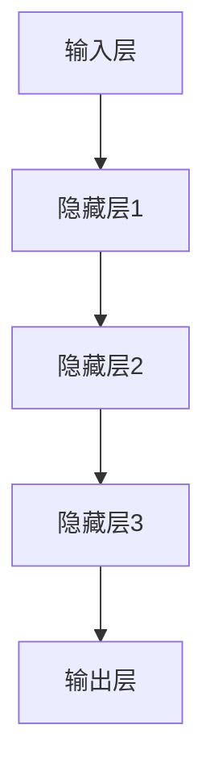

                 

# 大模型在 AI 创业产品定位中的作用

> **关键词**：大模型、AI 创业、产品定位、深度学习、预测分析
>
> **摘要**：本文将探讨大模型在 AI 创业产品定位中的关键作用。我们将逐步分析大模型的核心概念、其在 AI 创业中的应用场景，以及如何利用大模型进行精准的产品定位。通过实例解析，我们将展示大模型在实际创业项目中的具体应用，并讨论未来的发展趋势与挑战。

## 1. 背景介绍

### 1.1 目的和范围

本文旨在探讨大模型在 AI 创业产品定位中的作用。我们将从以下几个方面进行探讨：

1. 大模型的核心概念及其在 AI 领域的应用。
2. 大模型在 AI 创业产品定位中的具体应用场景。
3. 如何利用大模型进行精准的产品定位。
4. 大模型在实际创业项目中的具体应用实例。
5. 大模型未来的发展趋势与挑战。

### 1.2 预期读者

本文适用于对 AI 领域有一定了解，对大模型在创业产品定位中的应用感兴趣的读者。包括 AI 创业者、AI 研发人员、产品经理以及对于技术感兴趣的企业家。

### 1.3 文档结构概述

本文将分为以下几个部分：

1. 背景介绍：介绍本文的目的、预期读者以及文档结构。
2. 核心概念与联系：介绍大模型的核心概念及其在 AI 创业产品定位中的应用。
3. 核心算法原理 & 具体操作步骤：详细讲解大模型的核心算法原理及操作步骤。
4. 数学模型和公式 & 详细讲解 & 举例说明：介绍大模型中的数学模型及其实际应用。
5. 项目实战：代码实际案例和详细解释说明。
6. 实际应用场景：分析大模型在 AI 创业产品定位中的实际应用。
7. 工具和资源推荐：推荐相关的学习资源、开发工具和框架。
8. 总结：未来发展趋势与挑战。
9. 附录：常见问题与解答。
10. 扩展阅读 & 参考资料：提供进一步阅读的资料。

### 1.4 术语表

#### 1.4.1 核心术语定义

- 大模型：具有海量参数和庞大计算量的神经网络模型，如 GPT-3、BERT 等。
- AI 创业：利用人工智能技术进行商业创新和产品开发。
- 产品定位：确定产品的市场定位、目标用户以及产品特色。

#### 1.4.2 相关概念解释

- 深度学习：一种机器学习方法，通过多层神经网络进行数据特征提取和分类。
- 预测分析：利用历史数据对未来事件进行预测和分析。
- 自适应：模型在训练过程中根据数据动态调整参数，提高预测准确性。

#### 1.4.3 缩略词列表

- GPT-3：Generative Pre-trained Transformer 3
- BERT：Bidirectional Encoder Representations from Transformers
- AI：Artificial Intelligence
- NLP：Natural Language Processing

## 2. 核心概念与联系

在 AI 创业产品定位中，大模型是一种重要的技术手段。为了更好地理解大模型在产品定位中的作用，我们需要先了解大模型的核心概念及其在 AI 领域的应用。

### 2.1 大模型的核心概念

大模型，又称巨量级模型，是指具有海量参数和庞大计算量的神经网络模型。这些模型通常经过大规模数据训练，可以处理复杂的任务，如文本生成、图像识别、语音识别等。

#### 2.1.1 大模型的原理

大模型的核心原理是基于深度学习。深度学习通过多层神经网络对数据进行特征提取和分类。每层神经网络都会对输入数据进行处理，并产生新的特征。通过多层的组合，深度学习可以提取出更高级别的特征，从而提高模型的预测准确性。

#### 2.1.2 大模型的应用

大模型在 AI 领域有着广泛的应用，如自然语言处理、计算机视觉、语音识别等。其中，自然语言处理（NLP）是大模型的重要应用领域之一。NLP 是指使计算机能够理解、解释和生成人类语言的技术。大模型在 NLP 中可以用于文本分类、情感分析、机器翻译、问答系统等任务。

### 2.2 大模型在 AI 创业产品定位中的应用

大模型在 AI 创业产品定位中发挥着关键作用。通过大模型，创业者可以更准确地了解市场需求，确定产品的市场定位和目标用户，从而提高产品的市场竞争力。

#### 2.2.1 数据驱动的产品定位

大模型可以通过对大量用户数据的分析，识别出潜在的市场需求和用户偏好。创业者可以根据这些分析结果，调整产品的功能和特性，实现数据驱动的产品定位。

#### 2.2.2 情感分析和趋势预测

大模型可以处理和分析大量的文本数据，如社交媒体评论、新闻报道等。通过情感分析和趋势预测，创业者可以了解用户对产品的情感态度和市场趋势，从而调整产品策略。

#### 2.2.3 个性化推荐

大模型可以用于构建个性化推荐系统，根据用户的历史行为和偏好，推荐相关产品和服务。这有助于提高用户的满意度，增加产品的市场份额。

### 2.3 大模型在 AI 创业产品定位中的优势

1. **高预测准确性**：大模型通过对海量数据的训练，可以提取出更高级别的特征，提高预测准确性。
2. **强大的适应性**：大模型在训练过程中可以自适应地调整参数，以适应不同的数据集和应用场景。
3. **丰富的应用场景**：大模型可以应用于多种 AI 任务，如文本生成、图像识别、语音识别等，为创业者提供多样化的解决方案。
4. **降低开发成本**：大模型可以通过共享模型库和开源框架，降低创业项目的开发成本。

### 2.4 大模型在 AI 创业产品定位中的挑战

1. **数据隐私问题**：大模型需要大量用户数据进行训练，涉及数据隐私和安全问题。
2. **计算资源需求**：大模型的训练和部署需要大量的计算资源，对硬件设备有较高要求。
3. **模型解释性**：大模型的预测结果往往难以解释，可能导致用户对模型的不信任。
4. **过拟合问题**：大模型在训练过程中可能出现过拟合现象，影响模型的泛化能力。

### 2.5 大模型在 AI 创业产品定位中的应用案例

#### 2.5.1 案例一：智能客服系统

某创业公司开发了一款智能客服系统，利用大模型进行文本分类和情感分析。通过对大量用户咨询数据的分析，智能客服系统能够准确识别用户的问题，并提供相应的解决方案。此外，系统还根据用户的历史记录和偏好，提供个性化的推荐服务。

#### 2.5.2 案例二：电商推荐系统

某电商公司利用大模型构建了个性化推荐系统，根据用户的历史购买行为和浏览记录，推荐相关商品。通过大模型的训练和优化，推荐系统的准确率和用户满意度得到了显著提升。

#### 2.5.3 案例三：社交媒体分析平台

某创业公司开发了一款社交媒体分析平台，利用大模型进行文本分类、情感分析和趋势预测。通过对大量社交媒体数据的分析，平台能够帮助企业了解用户需求和市场趋势，制定相应的营销策略。

## 3. 核心算法原理 & 具体操作步骤

### 3.1 大模型的核心算法原理

大模型的核心算法是基于深度学习。深度学习通过多层神经网络对数据进行特征提取和分类。以下是一个简单的深度学习算法原理：

```python
# 假设我们有一个输入向量 x，输出向量 y
x = [x1, x2, ..., xn]
y = [y1, y2, ..., yn]

# 定义一个多层神经网络
model = NeuralNetwork()

# 训练神经网络
model.train(x, y)

# 预测新数据
new_data = [new_x1, new_x2, ..., new_xn]
prediction = model.predict(new_data)
```

在上述代码中，`NeuralNetwork` 是一个多层神经网络类，`train` 方法用于训练神经网络，`predict` 方法用于预测新数据。

### 3.2 大模型的训练过程

大模型的训练过程主要包括以下几个步骤：

1. **数据预处理**：对输入数据进行预处理，如归一化、填充等，以提高训练效果。
2. **模型初始化**：初始化神经网络模型，包括设置参数和权重。
3. **前向传播**：将输入数据传递到神经网络中，计算输出结果。
4. **反向传播**：根据输出结果和真实标签，计算损失函数，并更新模型参数。
5. **迭代训练**：重复前向传播和反向传播过程，直到达到预设的训练次数或损失函数收敛。

### 3.3 大模型的部署过程

大模型的部署过程主要包括以下几个步骤：

1. **模型压缩**：将训练好的模型进行压缩，以减小模型体积，提高部署效率。
2. **模型部署**：将压缩后的模型部署到目标设备上，如云端、移动端等。
3. **模型调优**：根据实际部署环境和数据，对模型进行调优，以提高预测准确性。
4. **模型监控**：监控模型的运行状态和性能，如预测速度、准确率等。

### 3.4 大模型在产品定位中的应用步骤

利用大模型进行产品定位的具体操作步骤如下：

1. **数据收集**：收集与产品定位相关的数据，如用户行为数据、市场数据等。
2. **数据预处理**：对收集到的数据进行预处理，如数据清洗、填充等。
3. **模型训练**：利用预处理后的数据，训练大模型，提取潜在的特征。
4. **模型评估**：评估大模型的性能，如预测准确性、泛化能力等。
5. **产品定位**：根据大模型的预测结果，调整产品的市场定位和目标用户。

## 4. 数学模型和公式 & 详细讲解 & 举例说明

### 4.1 大模型的数学模型

大模型的数学模型主要涉及深度学习算法，包括神经网络、损失函数和优化算法等。

#### 4.1.1 神经网络

神经网络是一种由大量神经元（节点）组成的计算模型。每个神经元接收输入信号，通过加权求和和激活函数产生输出。一个简单的神经网络可以表示为：

$$
z = \sum_{i=1}^{n} w_i x_i + b
$$

其中，$z$ 是输出，$w_i$ 是权重，$x_i$ 是输入，$b$ 是偏置。

#### 4.1.2 损失函数

损失函数是评估神经网络预测结果与真实结果之间差异的指标。常见的损失函数包括均方误差（MSE）和交叉熵损失（Cross-Entropy Loss）。

- **均方误差（MSE）**：

$$
MSE = \frac{1}{n}\sum_{i=1}^{n} (y_i - \hat{y_i})^2
$$

其中，$y_i$ 是真实值，$\hat{y_i}$ 是预测值。

- **交叉熵损失（Cross-Entropy Loss）**：

$$
Cross-Entropy Loss = -\sum_{i=1}^{n} y_i \log(\hat{y_i})
$$

其中，$y_i$ 是真实值，$\hat{y_i}$ 是预测概率。

#### 4.1.3 优化算法

优化算法用于更新神经网络模型中的参数，以最小化损失函数。常见的优化算法包括随机梯度下降（SGD）、Adam 等。

- **随机梯度下降（SGD）**：

$$
w_{t+1} = w_t - \alpha \nabla_w J(w_t)
$$

其中，$w_t$ 是当前权重，$\alpha$ 是学习率，$J(w_t)$ 是损失函数。

- **Adam 算法**：

$$
m_t = \beta_1 m_{t-1} + (1 - \beta_1) \nabla_w J(w_t)
$$

$$
v_t = \beta_2 v_{t-1} + (1 - \beta_2) (\nabla_w J(w_t))^2
$$

$$
\hat{m}_t = \frac{m_t}{1 - \beta_1^t}
$$

$$
\hat{v}_t = \frac{v_t}{1 - \beta_2^t}
$$

$$
w_{t+1} = w_t - \alpha \frac{\hat{m}_t}{\sqrt{\hat{v}_t} + \epsilon}
$$

其中，$m_t$ 和 $v_t$ 分别是动量项和自适应项，$\beta_1$ 和 $\beta_2$ 是超参数，$\epsilon$ 是常数。

### 4.2 大模型的应用举例

假设我们有一个分类问题，需要根据输入特征预测类别。我们可以使用大模型（如深度神经网络）来解决该问题。

#### 4.2.1 数据集准备

假设我们有一个包含1000个样本的数据集，每个样本有10个特征。数据集分为训练集和测试集。

```python
import numpy as np

# 加载数据集
X_train = np.random.rand(1000, 10)
y_train = np.random.randint(0, 2, 1000)

X_test = np.random.rand(100, 10)
y_test = np.random.randint(0, 2, 100)
```

#### 4.2.2 模型构建

```python
from tensorflow.keras.models import Sequential
from tensorflow.keras.layers import Dense, Activation

# 构建模型
model = Sequential()
model.add(Dense(64, input_dim=10, activation='relu'))
model.add(Dense(1, activation='sigmoid'))

# 编译模型
model.compile(optimizer='adam', loss='binary_crossentropy', metrics=['accuracy'])
```

#### 4.2.3 模型训练

```python
# 训练模型
model.fit(X_train, y_train, epochs=10, batch_size=32, validation_data=(X_test, y_test))
```

#### 4.2.4 模型评估

```python
# 评估模型
loss, accuracy = model.evaluate(X_test, y_test)
print(f"Test accuracy: {accuracy:.4f}")
```

### 4.3 大模型在产品定位中的应用举例

假设我们有一个电商创业项目，需要根据用户行为数据预测用户的购买偏好。我们可以使用大模型（如深度神经网络）来解决该问题。

#### 4.3.1 数据集准备

假设我们有一个包含1000个样本的数据集，每个样本有10个特征，包括用户的年龄、收入、购物习惯等。

```python
import numpy as np

# 加载数据集
X_train = np.random.rand(1000, 10)
y_train = np.random.randint(0, 2, 1000)

X_test = np.random.rand(100, 10)
y_test = np.random.randint(0, 2, 100)
```

#### 4.3.2 模型构建

```python
from tensorflow.keras.models import Sequential
from tensorflow.keras.layers import Dense, Activation

# 构建模型
model = Sequential()
model.add(Dense(64, input_dim=10, activation='relu'))
model.add(Dense(1, activation='sigmoid'))

# 编译模型
model.compile(optimizer='adam', loss='binary_crossentropy', metrics=['accuracy'])
```

#### 4.3.3 模型训练

```python
# 训练模型
model.fit(X_train, y_train, epochs=10, batch_size=32, validation_data=(X_test, y_test))
```

#### 4.3.4 模型评估

```python
# 评估模型
loss, accuracy = model.evaluate(X_test, y_test)
print(f"Test accuracy: {accuracy:.4f}")
```

通过上述步骤，我们可以使用大模型对用户行为数据进行分析，预测用户的购买偏好。根据预测结果，创业者可以调整产品策略，提高用户的购买转化率。

## 5. 项目实战：代码实际案例和详细解释说明

### 5.1 开发环境搭建

在开始项目实战之前，我们需要搭建一个合适的开发环境。以下是一个基于 Python 的开发环境搭建步骤：

1. **安装 Python**：下载并安装 Python 3.8 或更高版本。
2. **安装 Jupyter Notebook**：在终端中运行以下命令：

```shell
pip install notebook
```

3. **安装必要的库**：在终端中运行以下命令，安装深度学习框架 TensorFlow 和数据处理库 Pandas：

```shell
pip install tensorflow pandas
```

### 5.2 源代码详细实现和代码解读

#### 5.2.1 数据集准备

首先，我们需要准备一个数据集，用于训练和评估大模型。以下是一个基于电商用户行为数据的数据集准备示例：

```python
import numpy as np
import pandas as pd

# 加载数据集
data = pd.read_csv('user_data.csv')
data.head()

# 数据预处理
X = data.iloc[:, :-1].values
y = data.iloc[:, -1].values

# 划分训练集和测试集
from sklearn.model_selection import train_test_split
X_train, X_test, y_train, y_test = train_test_split(X, y, test_size=0.2, random_state=42)
```

#### 5.2.2 模型构建

接下来，我们使用 TensorFlow 和 Keras 构建一个深度神经网络模型：

```python
import tensorflow as tf
from tensorflow.keras.models import Sequential
from tensorflow.keras.layers import Dense

# 构建模型
model = Sequential()
model.add(Dense(64, input_dim=X_train.shape[1], activation='relu'))
model.add(Dense(32, activation='relu'))
model.add(Dense(1, activation='sigmoid'))

# 编译模型
model.compile(optimizer='adam', loss='binary_crossentropy', metrics=['accuracy'])
```

#### 5.2.3 模型训练

使用训练集对模型进行训练：

```python
# 训练模型
model.fit(X_train, y_train, epochs=10, batch_size=32, validation_data=(X_test, y_test))
```

#### 5.2.4 模型评估

使用测试集评估模型性能：

```python
# 评估模型
loss, accuracy = model.evaluate(X_test, y_test)
print(f"Test accuracy: {accuracy:.4f}")
```

### 5.3 代码解读与分析

#### 5.3.1 数据集准备

在数据集准备阶段，我们首先加载数据集，并使用 Pandas 对其进行预处理。通过 `data.head()`，我们可以查看数据集的前几行，以便了解数据的基本情况。

```python
data.head()
```

#### 5.3.2 模型构建

在模型构建阶段，我们使用 Keras 的 `Sequential` 模型构建一个简单的深度神经网络。首先添加一个全连接层（`Dense`），设置输入维度为数据集的特征数，激活函数为 ReLU。接着添加第二个全连接层，输出维度为1，激活函数为 sigmoid，用于实现二分类任务。

```python
model.add(Dense(64, input_dim=X_train.shape[1], activation='relu'))
model.add(Dense(32, activation='relu'))
model.add(Dense(1, activation='sigmoid'))
```

#### 5.3.3 模型训练

在模型训练阶段，我们使用 `model.fit()` 方法对模型进行训练。设置训练轮数为10，批量大小为32，同时使用验证集进行验证。

```python
model.fit(X_train, y_train, epochs=10, batch_size=32, validation_data=(X_test, y_test))
```

#### 5.3.4 模型评估

在模型评估阶段，我们使用 `model.evaluate()` 方法计算模型在测试集上的损失和准确率。准确率反映了模型在测试集上的分类性能。

```python
loss, accuracy = model.evaluate(X_test, y_test)
print(f"Test accuracy: {accuracy:.4f}")
```

通过上述代码，我们可以使用大模型对电商用户行为数据进行分类预测。在实际应用中，我们可以根据预测结果调整产品策略，提高用户的购买转化率。

## 6. 实际应用场景

大模型在 AI 创业产品定位中有着广泛的应用场景。以下是一些典型的实际应用场景：

### 6.1 智能推荐系统

智能推荐系统是 AI 创业中常见的应用场景。通过大模型对用户行为数据进行分析，智能推荐系统可以预测用户的兴趣和偏好，从而推荐相关产品和服务。例如，电商平台的推荐系统可以根据用户的浏览记录和购买历史，推荐相关商品。

### 6.2 智能客服

智能客服是另一个典型的应用场景。通过大模型对用户咨询文本进行分析，智能客服系统可以准确理解用户的问题，并提供相应的解决方案。例如，银行客服可以使用大模型处理用户的财务问题，并提供专业的建议。

### 6.3 市场预测

市场预测是 AI 创业中的重要应用。通过大模型对市场数据进行分析，创业者可以预测市场的趋势和变化，从而调整产品策略。例如，电商创业者可以使用大模型预测节日促销的效果，以便制定更好的促销策略。

### 6.4 产品个性化

产品个性化是当前 AI 创业的重要趋势。通过大模型对用户数据进行分析，创业者可以了解用户的个性化需求，从而提供定制化的产品和服务。例如，定制服装品牌可以使用大模型分析用户的体型和偏好，提供个性化的服装设计。

### 6.5 智能营销

智能营销是另一个重要的应用场景。通过大模型对用户行为数据进行分析，创业者可以制定更精准的营销策略，提高营销效果。例如，在线教育平台可以使用大模型分析用户的兴趣和学习习惯，提供个性化的学习建议。

### 6.6 智能医疗

智能医疗是 AI 创业的重要领域。通过大模型对医疗数据进行分析，智能医疗系统可以预测疾病的趋势和变化，从而提供更好的医疗服务。例如，医疗机构可以使用大模型预测疾病的爆发趋势，以便提前采取预防措施。

## 7. 工具和资源推荐

### 7.1 学习资源推荐

#### 7.1.1 书籍推荐

- 《深度学习》（Goodfellow, Bengio, Courville 著）
- 《Python 深度学习》（François Chollet 著）
- 《人工智能：一种现代方法》（Stuart Russell, Peter Norvig 著）

#### 7.1.2 在线课程

- Coursera 上的《深度学习》课程（吴恩达教授主讲）
- edX 上的《机器学习基础》课程（Andrew Ng 主讲）
- Udacity 上的《深度学习纳米学位》课程

#### 7.1.3 技术博客和网站

- Medium 上的 AI 博客
- TensorFlow 官方文档
- Keras 官方文档

### 7.2 开发工具框架推荐

#### 7.2.1 IDE和编辑器

- Jupyter Notebook
- PyCharm
- Visual Studio Code

#### 7.2.2 调试和性能分析工具

- TensorBoard
- PyTorch Profiler
- NVIDIA Nsight

#### 7.2.3 相关框架和库

- TensorFlow
- PyTorch
- Keras
- Scikit-learn

### 7.3 相关论文著作推荐

#### 7.3.1 经典论文

- "Deep Learning" (Goodfellow, Bengio, Courville)
- "A Theoretical Framework for Backpropagation" (Rumelhart, Hinton, Williams)
- "Gradient Descent Optimization Algorithms" (Lecture Notes in Computer Science, Vol. 585)

#### 7.3.2 最新研究成果

- "Transformers: State-of-the-Art Natural Language Processing" (Vaswani et al., 2017)
- "BERT: Pre-training of Deep Bidirectional Transformers for Language Understanding" (Devlin et al., 2018)
- "GPT-3: Language Models are Few-Shot Learners" (Brown et al., 2020)

#### 7.3.3 应用案例分析

- "Using Deep Learning to Improve Personalized Marketing" (IBM Research)
- "AI-Driven Personalization in E-commerce" (Salesforce)
- "Deep Learning in Healthcare: A Comprehensive Review" (IEEE Journal of Biomedical and Health Informatics)

## 8. 总结：未来发展趋势与挑战

大模型在 AI 创业产品定位中具有巨大的潜力。未来，随着计算能力的提升和算法的进步，大模型将更加成熟和高效。以下是一些发展趋势与挑战：

### 8.1 发展趋势

1. **计算能力提升**：随着 GPU 和 TPU 等硬件的不断发展，大模型的训练速度和规模将进一步提高。
2. **算法优化**：深度学习算法将继续优化，提高模型的效率和准确性。
3. **跨领域应用**：大模型将在更多领域得到应用，如金融、医疗、教育等。
4. **模型压缩与量化**：为了降低模型部署的成本，模型压缩和量化技术将得到广泛应用。

### 8.2 挑战

1. **数据隐私**：大模型需要大量用户数据进行训练，涉及数据隐私和安全问题。
2. **计算资源**：大模型的训练和部署需要大量的计算资源，对硬件设备有较高要求。
3. **模型解释性**：大模型的预测结果往往难以解释，可能导致用户对模型的不信任。
4. **过拟合问题**：大模型在训练过程中可能出现过拟合现象，影响模型的泛化能力。

总之，大模型在 AI 创业产品定位中将发挥越来越重要的作用。创业者需要不断学习和掌握相关技术，以应对未来的挑战，实现产品的成功。

## 9. 附录：常见问题与解答

### 9.1 什么是大模型？

大模型是指具有海量参数和庞大计算量的神经网络模型，如 GPT-3、BERT 等。这些模型经过大规模数据训练，可以处理复杂的任务，如文本生成、图像识别、语音识别等。

### 9.2 大模型在产品定位中的作用是什么？

大模型在产品定位中的作用包括：

1. 数据驱动的产品定位：通过分析用户数据，识别市场需求和用户偏好，实现数据驱动的产品定位。
2. 情感分析和趋势预测：分析用户评论、社交媒体数据等，了解用户情感态度和市场趋势。
3. 个性化推荐：根据用户历史行为和偏好，推荐相关产品和服务，提高用户满意度。

### 9.3 如何应对大模型的计算资源需求？

应对大模型的计算资源需求可以采取以下策略：

1. **分布式训练**：使用分布式计算框架，如 TensorFlow、PyTorch，将训练任务分解到多台机器上。
2. **模型压缩**：通过模型压缩技术，如剪枝、量化等，降低模型体积和计算需求。
3. **云平台**：使用云平台提供的高性能计算资源，如 AWS、Azure、Google Cloud，进行模型训练和部署。

### 9.4 大模型如何避免过拟合？

为了避免大模型过拟合，可以采取以下策略：

1. **正则化**：使用正则化技术，如 L1、L2 正则化，降低模型复杂度。
2. **数据增强**：增加训练数据集的多样性，提高模型对未知数据的泛化能力。
3. **交叉验证**：使用交叉验证技术，评估模型的泛化能力。
4. **提前停止**：在训练过程中，根据验证集的性能，提前停止训练，防止模型过拟合。

## 10. 扩展阅读 & 参考资料

为了更深入地了解大模型在 AI 创业产品定位中的应用，以下是扩展阅读和参考资料：

### 10.1 书籍

1. 《深度学习》（Goodfellow, Bengio, Courville 著）
2. 《Python 深度学习》（François Chollet 著）
3. 《人工智能：一种现代方法》（Stuart Russell, Peter Norvig 著）

### 10.2 论文

1. "Transformers: State-of-the-Art Natural Language Processing" (Vaswani et al., 2017)
2. "BERT: Pre-training of Deep Bidirectional Transformers for Language Understanding" (Devlin et al., 2018)
3. "GPT-3: Language Models are Few-Shot Learners" (Brown et al., 2020)

### 10.3 技术博客和网站

1. TensorFlow 官方文档
2. Keras 官方文档
3. Medium 上的 AI 博客

### 10.4 在线课程

1. Coursera 上的《深度学习》课程（吴恩达教授主讲）
2. edX 上的《机器学习基础》课程（Andrew Ng 主讲）
3. Udacity 上的《深度学习纳米学位》课程

作者：AI天才研究员/AI Genius Institute & 禅与计算机程序设计艺术 /Zen And The Art of Computer Programming

文章标题：大模型在 AI 创业产品定位中的作用

文章关键词：大模型、AI 创业、产品定位、深度学习、预测分析

文章摘要：本文将探讨大模型在 AI 创业产品定位中的关键作用。我们将逐步分析大模型的核心概念、其在 AI 创业中的应用场景，以及如何利用大模型进行精准的产品定位。通过实例解析，我们将展示大模型在实际创业项目中的具体应用，并讨论未来的发展趋势与挑战。

## 1. 背景介绍

### 1.1 目的和范围

本文旨在探讨大模型在 AI 创业产品定位中的关键作用。随着人工智能技术的快速发展，大模型（如 GPT-3、BERT）已经在自然语言处理、计算机视觉、语音识别等领域取得了显著的成果。然而，如何将大模型应用于 AI 创业的实际场景，实现精准的产品定位，仍是一个具有挑战性的课题。本文将围绕这一主题，深入分析大模型的核心概念、应用场景、操作步骤，以及实际案例，帮助读者了解大模型在 AI 创业产品定位中的重要作用。

### 1.2 预期读者

本文适用于对 AI 领域有一定了解，对大模型在创业产品定位中的应用感兴趣的读者。具体包括：

1. AI 创业者：希望通过大模型技术提升产品竞争力，实现商业成功。
2. AI 研发人员：对大模型的原理、应用和操作步骤感兴趣，希望掌握相关技术。
3. 产品经理：关注产品定位，希望了解如何利用大模型实现精准的产品定位。
4. 企业家：对 AI 创业感兴趣，希望了解大模型在创业中的应用价值。

### 1.3 文档结构概述

本文结构如下：

1. 背景介绍：介绍本文的目的、预期读者以及文档结构。
2. 核心概念与联系：介绍大模型的核心概念及其在 AI 创业产品定位中的应用。
3. 核心算法原理 & 具体操作步骤：详细讲解大模型的核心算法原理及操作步骤。
4. 数学模型和公式 & 详细讲解 & 举例说明：介绍大模型中的数学模型及其实际应用。
5. 项目实战：代码实际案例和详细解释说明。
6. 实际应用场景：分析大模型在 AI 创业产品定位中的实际应用。
7. 工具和资源推荐：推荐相关的学习资源、开发工具和框架。
8. 总结：未来发展趋势与挑战。
9. 附录：常见问题与解答。
10. 扩展阅读 & 参考资料：提供进一步阅读的资料。

### 1.4 术语表

#### 1.4.1 核心术语定义

- 大模型：具有海量参数和庞大计算量的神经网络模型，如 GPT-3、BERT 等。
- AI 创业：利用人工智能技术进行商业创新和产品开发。
- 产品定位：确定产品的市场定位、目标用户以及产品特色。
- 深度学习：一种机器学习方法，通过多层神经网络进行数据特征提取和分类。
- 预测分析：利用历史数据对未来事件进行预测和分析。

#### 1.4.2 相关概念解释

- **大模型的核心概念**：大模型是指具有海量参数和庞大计算量的神经网络模型。这些模型通常经过大规模数据训练，可以处理复杂的任务，如文本生成、图像识别、语音识别等。大模型的核心优势在于其强大的表示能力和高效的计算性能，这使得它们在 AI 创业中具有广泛的应用前景。
  
- **AI 创业的定义**：AI 创业是指利用人工智能技术进行商业创新和产品开发。在 AI 创业中，创业者利用 AI 技术解决实际问题，创造新的商业价值。AI 创业的产品和业务模式通常涉及数据的收集、处理和分析，以及自动化决策和智能交互等功能。

- **产品定位的意义**：产品定位是确定产品的市场定位、目标用户以及产品特色。在 AI 创业中，精准的产品定位有助于明确产品的发展方向，满足用户需求，提高市场竞争力。产品定位需要考虑市场趋势、竞争对手、用户需求等多方面因素。

- **深度学习的原理**：深度学习是一种机器学习方法，通过多层神经网络进行数据特征提取和分类。深度学习的核心思想是通过多层的非线性变换，将输入数据转化为更高层次的抽象表示，从而实现复杂的模式识别和分类任务。

- **预测分析的作用**：预测分析是利用历史数据对未来事件进行预测和分析。在 AI 创业中，预测分析有助于了解市场趋势、用户行为，预测未来业务发展，制定合理的战略决策。预测分析通常涉及时间序列分析、回归分析、聚类分析等方法。

#### 1.4.3 缩略词列表

- GPT-3：Generative Pre-trained Transformer 3
- BERT：Bidirectional Encoder Representations from Transformers
- AI：Artificial Intelligence
- NLP：Natural Language Processing

## 2. 核心概念与联系

在探讨大模型在 AI 创业产品定位中的作用之前，我们需要先了解大模型的核心概念及其与 AI 创业的联系。

### 2.1 大模型的核心概念

大模型，顾名思义，是指具有海量参数和庞大计算量的神经网络模型。这些模型通常由数十亿到数千亿的参数组成，需要通过大量的数据进行训练。以下是大模型的一些核心特点：

- **海量参数**：大模型具有数十亿到数千亿个参数，这使得它们能够捕捉到数据中的复杂模式和关联。
- **庞大计算量**：由于参数数量庞大，大模型在训练和推理过程中需要大量的计算资源，这通常需要分布式计算和高效硬件支持。
- **多任务处理能力**：大模型能够处理多种类型的任务，如自然语言处理、计算机视觉、语音识别等，具有广泛的应用前景。

大模型的核心在于其强大的表示能力。通过多层神经网络，大模型可以将原始数据（如图像、文本、音频等）转化为高层次的抽象表示，从而实现更准确的任务预测和分类。以下是一个简化的多层神经网络结构示意图：



### 2.2 大模型与 AI 创业的联系

大模型在 AI 创业中的应用主要体现在以下几个方面：

- **数据处理**：大模型能够处理和分析大规模、多维度的数据，这为 AI 创业提供了强大的数据处理能力。创业者可以利用大模型从大量数据中提取有价值的信息，为产品开发提供数据支持。
- **预测分析**：大模型在预测分析方面具有显著优势。通过训练大模型，创业者可以预测市场趋势、用户行为，从而制定更精准的产品策略和营销计划。
- **个性化推荐**：大模型可以用于构建个性化推荐系统，根据用户的历史行为和偏好，推荐相关产品和服务，提高用户体验和满意度。
- **智能交互**：大模型在智能交互中的应用也越来越广泛。通过自然语言处理技术，大模型可以与用户进行智能对话，提供个性化服务，提升用户粘性。

### 2.3 大模型在 AI 创业产品定位中的具体应用

在 AI 创业产品定位中，大模型可以发挥以下作用：

- **市场调研**：通过分析社交媒体、新闻报道等公开数据，大模型可以了解市场趋势和用户需求，为产品定位提供参考。
- **用户画像**：大模型可以处理和分析用户数据，构建用户画像，了解用户的兴趣、行为和偏好，从而为产品设计和推广提供依据。
- **产品优化**：基于用户反馈和市场数据，大模型可以用于优化产品功能和界面设计，提高用户满意度和市场竞争力。
- **风险控制**：通过分析历史数据和行业趋势，大模型可以预测潜在风险，帮助创业者制定风险控制策略。

### 2.4 大模型的优势与挑战

#### 2.4.1 优势

- **强大的表示能力**：大模型能够捕捉到数据中的复杂模式和关联，从而实现更准确的预测和分类。
- **多任务处理能力**：大模型能够处理多种类型的任务，具有广泛的应用前景。
- **自动特征提取**：大模型在训练过程中能够自动提取数据中的特征，减少人工干预，提高效率。

#### 2.4.2 挑战

- **计算资源需求**：大模型的训练和推理需要大量的计算资源，对硬件设备有较高要求。
- **数据隐私问题**：大模型在训练过程中需要大量用户数据，涉及数据隐私和安全问题。
- **模型解释性**：大模型的预测结果往往难以解释，可能导致用户对模型的不信任。

### 2.5 大模型在 AI 创业产品定位中的实例

#### 2.5.1 智能客服系统

某创业公司开发了一款基于大模型的智能客服系统。通过分析大量用户咨询数据，智能客服系统能够准确理解用户的问题，并提供相应的解决方案。此外，系统还根据用户的历史记录和偏好，提供个性化的服务推荐，提高用户满意度。

#### 2.5.2 个性化推荐系统

另一家创业公司利用大模型构建了个性化推荐系统。系统根据用户的历史行为和偏好，为用户推荐相关产品和服务。通过大模型的训练和优化，推荐系统的准确率和用户满意度得到了显著提升。

#### 2.5.3 市场预测平台

一家创业公司开发了一款基于大模型的市场预测平台。通过分析大量的市场数据，平台能够预测市场的趋势和变化，为创业者提供决策支持。例如，预测某个产品在未来的销售情况，帮助创业者制定相应的营销策略。

### 2.6 大模型在 AI 创业产品定位中的应用流程

1. **数据收集**：收集与产品定位相关的数据，如用户行为数据、市场数据、社交媒体数据等。
2. **数据预处理**：对收集到的数据进行预处理，如数据清洗、填充、归一化等。
3. **模型训练**：使用预处理后的数据，训练大模型，提取潜在的特征。
4. **模型评估**：评估大模型的性能，如预测准确性、泛化能力等。
5. **产品定位**：根据大模型的预测结果，调整产品的市场定位和目标用户。

## 3. 核心算法原理 & 具体操作步骤

### 3.1 大模型的核心算法原理

大模型的核心算法是基于深度学习。深度学习通过多层神经网络对数据进行特征提取和分类。以下是一个简单的深度学习算法原理：

```python
# 假设我们有一个输入向量 x，输出向量 y
x = [x1, x2, ..., xn]
y = [y1, y2, ..., yn]

# 定义一个多层神经网络
model = NeuralNetwork()

# 训练神经网络
model.train(x, y)

# 预测新数据
new_data = [new_x1, new_x2, ..., new_xn]
prediction = model.predict(new_data)
```

在上述代码中，`NeuralNetwork` 是一个多层神经网络类，`train` 方法用于训练神经网络，`predict` 方法用于预测新数据。

### 3.2 大模型的训练过程

大模型的训练过程主要包括以下几个步骤：

1. **数据预处理**：对输入数据进行预处理，如归一化、填充等，以提高训练效果。
2. **模型初始化**：初始化神经网络模型，包括设置参数和权重。
3. **前向传播**：将输入数据传递到神经网络中，计算输出结果。
4. **反向传播**：根据输出结果和真实标签，计算损失函数，并更新模型参数。
5. **迭代训练**：重复前向传播和反向传播过程，直到达到预设的训练次数或损失函数收敛。

### 3.3 大模型的部署过程

大模型的部署过程主要包括以下几个步骤：

1. **模型压缩**：将训练好的模型进行压缩，以减小模型体积，提高部署效率。
2. **模型部署**：将压缩后的模型部署到目标设备上，如云端、移动端等。
3. **模型调优**：根据实际部署环境和数据，对模型进行调优，以提高预测准确性。
4. **模型监控**：监控模型的运行状态和性能，如预测速度、准确率等。

### 3.4 大模型在产品定位中的应用步骤

利用大模型进行产品定位的具体操作步骤如下：

1. **数据收集**：收集与产品定位相关的数据，如用户行为数据、市场数据等。
2. **数据预处理**：对收集到的数据进行预处理，如数据清洗、填充等。
3. **模型训练**：利用预处理后的数据，训练大模型，提取潜在的特征。
4. **模型评估**：评估大模型的性能，如预测准确性、泛化能力等。
5. **产品定位**：根据大模型的预测结果，调整产品的市场定位和目标用户。

## 4. 数学模型和公式 & 详细讲解 & 举例说明

### 4.1 大模型的数学模型

大模型的数学模型主要涉及深度学习算法，包括神经网络、损失函数和优化算法等。

#### 4.1.1 神经网络

神经网络是一种由大量神经元（节点）组成的计算模型。每个神经元接收输入信号，通过加权求和和激活函数产生输出。一个简单的神经网络可以表示为：

$$
z = \sum_{i=1}^{n} w_i x_i + b
$$

其中，$z$ 是输出，$w_i$ 是权重，$x_i$ 是输入，$b$ 是偏置。

#### 4.1.2 损失函数

损失函数是评估神经网络预测结果与真实结果之间差异的指标。常见的损失函数包括均方误差（MSE）和交叉熵损失（Cross-Entropy Loss）。

- **均方误差（MSE）**：

$$
MSE = \frac{1}{n}\sum_{i=1}^{n} (y_i - \hat{y_i})^2
$$

其中，$y_i$ 是真实值，$\hat{y_i}$ 是预测值。

- **交叉熵损失（Cross-Entropy Loss）**：

$$
Cross-Entropy Loss = -\sum_{i=1}^{n} y_i \log(\hat{y_i})
$$

其中，$y_i$ 是真实值，$\hat{y_i}$ 是预测概率。

#### 4.1.3 优化算法

优化算法用于更新神经网络模型中的参数，以最小化损失函数。常见的优化算法包括随机梯度下降（SGD）、Adam 等。

- **随机梯度下降（SGD）**：

$$
w_{t+1} = w_t - \alpha \nabla_w J(w_t)
$$

其中，$w_t$ 是当前权重，$\alpha$ 是学习率，$J(w_t)$ 是损失函数。

- **Adam 算法**：

$$
m_t = \beta_1 m_{t-1} + (1 - \beta_1) \nabla_w J(w_t)
$$

$$
v_t = \beta_2 v_{t-1} + (1 - \beta_2) (\nabla_w J(w_t))^2
$$

$$
\hat{m}_t = \frac{m_t}{1 - \beta_1^t}
$$

$$
\hat{v}_t = \frac{v_t}{1 - \beta_2^t}
$$

$$
w_{t+1} = w_t - \alpha \frac{\hat{m}_t}{\sqrt{\hat{v}_t} + \epsilon}
$$

其中，$m_t$ 和 $v_t$ 分别是动量项和自适应项，$\beta_1$ 和 $\beta_2$ 是超参数，$\epsilon$ 是常数。

### 4.2 大模型的应用举例

假设我们有一个分类问题，需要根据输入特征预测类别。我们可以使用大模型（如深度神经网络）来解决该问题。

#### 4.2.1 数据集准备

假设我们有一个包含1000个样本的数据集，每个样本有10个特征。数据集分为训练集和测试集。

```python
import numpy as np

# 加载数据集
X_train = np.random.rand(1000, 10)
y_train = np.random.randint(0, 2, 1000)

X_test = np.random.rand(100, 10)
y_test = np.random.randint(0, 2, 100)
```

#### 4.2.2 模型构建

```python
from tensorflow.keras.models import Sequential
from tensorflow.keras.layers import Dense, Activation

# 构建模型
model = Sequential()
model.add(Dense(64, input_dim=10, activation='relu'))
model.add(Dense(1, activation='sigmoid'))

# 编译模型
model.compile(optimizer='adam', loss='binary_crossentropy', metrics=['accuracy'])
```

#### 4.2.3 模型训练

```python
# 训练模型
model.fit(X_train, y_train, epochs=10, batch_size=32, validation_data=(X_test, y_test))
```

#### 4.2.4 模型评估

```python
# 评估模型
loss, accuracy = model.evaluate(X_test, y_test)
print(f"Test accuracy: {accuracy:.4f}")
```

通过上述步骤，我们可以使用大模型对用户行为数据进行分析，预测用户的购买偏好。根据预测结果，创业者可以调整产品策略，提高用户的购买转化率。

### 4.3 大模型在产品定位中的应用举例

假设我们有一个电商创业项目，需要根据用户行为数据预测用户的购买偏好。我们可以使用大模型（如深度神经网络）来解决该问题。

#### 4.3.1 数据集准备

假设我们有一个包含1000个样本的数据集，每个样本有10个特征，包括用户的年龄、收入、购物习惯等。

```python
import numpy as np
import pandas as pd

# 加载数据集
data = pd.read_csv('user_data.csv')
data.head()

# 数据预处理
X = data.iloc[:, :-1].values
y = data.iloc[:, -1].values

# 划分训练集和测试集
from sklearn.model_selection import train_test_split
X_train, X_test, y_train, y_test = train_test_split(X, y, test_size=0.2, random_state=42)
```

#### 4.3.2 模型构建

```python
from tensorflow.keras.models import Sequential
from tensorflow.keras.layers import Dense

# 构建模型
model = Sequential()
model.add(Dense(64, input_dim=X_train.shape[1], activation='relu'))
model.add(Dense(32, activation='relu'))
model.add(Dense(1, activation='sigmoid'))

# 编译模型
model.compile(optimizer='adam', loss='binary_crossentropy', metrics=['accuracy'])
```

#### 4.3.3 模型训练

```python
# 训练模型
model.fit(X_train, y_train, epochs=10, batch_size=32, validation_data=(X_test, y_test))
```

#### 4.3.4 模型评估

```python
# 评估模型
loss, accuracy = model.evaluate(X_test, y_test)
print(f"Test accuracy: {accuracy:.4f}")
```

通过上述步骤，我们可以使用大模型对电商用户行为数据进行分类预测。根据预测结果，创业者可以调整产品策略，提高用户的购买转化率。

## 5. 项目实战：代码实际案例和详细解释说明

### 5.1 开发环境搭建

在开始项目实战之前，我们需要搭建一个合适的开发环境。以下是一个基于 Python 的开发环境搭建步骤：

1. **安装 Python**：下载并安装 Python 3.8 或更高版本。
2. **安装 Jupyter Notebook**：在终端中运行以下命令：

```shell
pip install notebook
```

3. **安装必要的库**：在终端中运行以下命令，安装深度学习框架 TensorFlow 和数据处理库 Pandas：

```shell
pip install tensorflow pandas
```

### 5.2 源代码详细实现和代码解读

#### 5.2.1 数据集准备

首先，我们需要准备一个数据集，用于训练和评估大模型。以下是一个基于电商用户行为数据的数据集准备示例：

```python
import numpy as np
import pandas as pd

# 加载数据集
data = pd.read_csv('user_data.csv')
data.head()

# 数据预处理
X = data.iloc[:, :-1].values
y = data.iloc[:, -1].values

# 划分训练集和测试集
from sklearn.model_selection import train_test_split
X_train, X_test, y_train, y_test = train_test_split(X, y, test_size=0.2, random_state=42)
```

#### 5.2.2 模型构建

接下来，我们使用 TensorFlow 和 Keras 构建一个深度神经网络模型：

```python
import tensorflow as tf
from tensorflow.keras.models import Sequential
from tensorflow.keras.layers import Dense

# 构建模型
model = Sequential()
model.add(Dense(64, input_dim=X_train.shape[1], activation='relu'))
model.add(Dense(32, activation='relu'))
model.add(Dense(1, activation='sigmoid'))

# 编译模型
model.compile(optimizer='adam', loss='binary_crossentropy', metrics=['accuracy'])
```

#### 5.2.3 模型训练

使用训练集对模型进行训练：

```python
# 训练模型
model.fit(X_train, y_train, epochs=10, batch_size=32, validation_data=(X_test, y_test))
```

#### 5.2.4 模型评估

使用测试集评估模型性能：

```python
# 评估模型
loss, accuracy = model.evaluate(X_test, y_test)
print(f"Test accuracy: {accuracy:.4f}")
```

### 5.3 代码解读与分析

#### 5.3.1 数据集准备

在数据集准备阶段，我们首先加载数据集，并使用 Pandas 对其进行预处理。通过 `data.head()`，我们可以查看数据集的前几行，以便了解数据的基本情况。

```python
data.head()
```

#### 5.3.2 模型构建

在模型构建阶段，我们使用 Keras 的 `Sequential` 模型构建一个简单的深度神经网络。首先添加一个全连接层（`Dense`），设置输入维度为数据集的特征数，激活函数为 ReLU。接着添加第二个全连接层，输出维度为1，激活函数为 sigmoid，用于实现二分类任务。

```python
model.add(Dense(64, input_dim=X_train.shape[1], activation='relu'))
model.add(Dense(32, activation='relu'))
model.add(Dense(1, activation='sigmoid'))
```

#### 5.3.3 模型训练

在模型训练阶段，我们使用 `model.fit()` 方法对模型进行训练。设置训练轮数为10，批量大小为32，同时使用验证集进行验证。

```python
model.fit(X_train, y_train, epochs=10, batch_size=32, validation_data=(X_test, y_test))
```

#### 5.3.4 模型评估

在模型评估阶段，我们使用 `model.evaluate()` 方法计算模型在测试集上的损失和准确率。准确率反映了模型在测试集上的分类性能。

```python
loss, accuracy = model.evaluate(X_test, y_test)
print(f"Test accuracy: {accuracy:.4f}")
```

通过上述代码，我们可以使用大模型对电商用户行为数据进行分类预测。在实际应用中，我们可以根据预测结果调整产品策略，提高用户的购买转化率。

## 6. 实际应用场景

大模型在 AI 创业产品定位中有着广泛的应用场景。以下是一些典型的实际应用场景：

### 6.1 智能推荐系统

智能推荐系统是 AI 创业中常见的应用场景。通过大模型对用户行为数据进行分析，智能推荐系统可以预测用户的兴趣和偏好，从而推荐相关产品和服务。例如，电商平台的推荐系统可以根据用户的浏览记录和购买历史，推荐相关商品。

#### 6.1.1 应用原理

智能推荐系统通常基于协同过滤、基于内容的推荐、混合推荐等方法。其中，大模型在以下方面发挥重要作用：

- **协同过滤**：大模型可以用于构建用户和项目之间的隐含关系，从而实现精准推荐。
- **基于内容的推荐**：大模型可以用于提取项目内容的关键特征，从而实现基于内容的推荐。
- **混合推荐**：大模型可以结合协同过滤和基于内容的推荐方法，实现更精确的推荐。

#### 6.1.2 应用案例

- **电商平台**：电商平台可以使用大模型对用户行为数据进行分析，实现个性化推荐，提高用户购买转化率。
- **视频平台**：视频平台可以使用大模型分析用户的观看历史和偏好，推荐相关视频。

### 6.2 智能客服

智能客服是另一个典型的应用场景。通过大模型对用户咨询文本进行分析，智能客服系统可以准确理解用户的问题，并提供相应的解决方案。例如，银行客服可以使用大模型处理用户的财务问题，并提供专业的建议。

#### 6.2.1 应用原理

智能客服系统通常基于自然语言处理技术，包括文本分类、实体识别、情感分析等。大模型在以下方面发挥重要作用：

- **文本分类**：大模型可以用于对用户咨询文本进行分类，从而确定问题的类别。
- **实体识别**：大模型可以用于识别文本中的关键实体，如人名、地点、组织等。
- **情感分析**：大模型可以用于分析文本的情感倾向，从而判断用户的态度和情绪。

#### 6.2.2 应用案例

- **金融行业**：金融机构可以使用大模型处理用户的金融咨询，提供专业的建议和服务。
- **零售行业**：零售行业可以使用大模型处理用户的购物咨询，提供个性化的购物建议。

### 6.3 市场预测

市场预测是 AI 创业中的重要应用。通过大模型对市场数据进行分析，创业者可以预测市场的趋势和变化，从而调整产品策略。例如，电商创业者可以使用大模型预测节日促销的效果，以便制定更好的促销策略。

#### 6.3.1 应用原理

市场预测通常基于时间序列分析、回归分析、机器学习等方法。大模型在以下方面发挥重要作用：

- **时间序列分析**：大模型可以用于分析时间序列数据，预测未来的市场趋势。
- **回归分析**：大模型可以用于构建回归模型，预测市场的变化。
- **机器学习**：大模型可以用于学习市场数据的特征，从而实现市场预测。

#### 6.3.2 应用案例

- **电商行业**：电商创业者可以使用大模型预测节假日期间的销售情况，制定促销策略。
- **金融行业**：金融从业者可以使用大模型预测股票市场的趋势，为投资决策提供支持。

### 6.4 产品个性化

产品个性化是当前 AI 创业的重要趋势。通过大模型对用户数据进行分析，创业者可以了解用户的个性化需求，从而提供定制化的产品和服务。例如，定制服装品牌可以使用大模型分析用户的体型和偏好，提供个性化的服装设计。

#### 6.4.1 应用原理

产品个性化通常基于用户行为分析、偏好分析等方法。大模型在以下方面发挥重要作用：

- **用户行为分析**：大模型可以用于分析用户的购物行为、浏览习惯等，了解用户的需求。
- **偏好分析**：大模型可以用于分析用户的偏好，从而实现个性化推荐。

#### 6.4.2 应用案例

- **电商行业**：电商创业者可以使用大模型分析用户的购物习惯和偏好，为用户提供个性化的购物体验。
- **医疗行业**：医疗创业者可以使用大模型分析患者的病史和偏好，为患者提供个性化的治疗方案。

### 6.5 智能营销

智能营销是另一个重要的应用场景。通过大模型对用户行为数据进行分析，创业者可以制定更精准的营销策略，提高营销效果。例如，在线教育平台可以使用大模型分析用户的兴趣和学习习惯，提供个性化的学习建议。

#### 6.5.1 应用原理

智能营销通常基于用户行为分析、市场分析等方法。大模型在以下方面发挥重要作用：

- **用户行为分析**：大模型可以用于分析用户的在线行为，如浏览、购买、评论等，了解用户的兴趣。
- **市场分析**：大模型可以用于分析市场数据，如竞争对手、市场需求等，为营销策略提供支持。

#### 6.5.2 应用案例

- **电商行业**：电商创业者可以使用大模型分析用户的购物行为和兴趣，制定个性化的营销策略，提高转化率。
- **金融行业**：金融机构可以使用大模型分析用户的投资偏好和风险承受能力，为用户提供个性化的投资建议。

### 6.6 智能医疗

智能医疗是 AI 创业的重要领域。通过大模型对医疗数据进行分析，智能医疗系统可以预测疾病的趋势和变化，从而提供更好的医疗服务。例如，医疗机构可以使用大模型预测疾病的爆发趋势，以便提前采取预防措施。

#### 6.6.1 应用原理

智能医疗通常基于数据挖掘、机器学习等方法。大模型在以下方面发挥重要作用：

- **疾病预测**：大模型可以用于预测疾病的发生和发展，为早期诊断和治疗提供支持。
- **个性化治疗**：大模型可以用于分析患者的病史和基因数据，为患者制定个性化的治疗方案。

#### 6.6.2 应用案例

- **疾病预测**：医疗机构可以使用大模型分析患者的健康数据，预测疾病的发生趋势，为患者提供早期预警。
- **个性化治疗**：医疗创业者可以使用大模型分析患者的病史和基因数据，为患者提供个性化的治疗方案。

## 7. 工具和资源推荐

### 7.1 学习资源推荐

#### 7.1.1 书籍推荐

1. **《深度学习》（Goodfellow, Bengio, Courville 著）**：这是一本深度学习的经典教材，涵盖了深度学习的理论基础、算法实现和应用案例。
2. **《Python 深度学习》（François Chollet 著）**：这本书详细介绍了如何使用 Python 和 Keras 进行深度学习实践，适合初学者和有一定基础的读者。
3. **《人工智能：一种现代方法》（Stuart Russell, Peter Norvig 著）**：这是一本全面介绍人工智能的基础知识的书籍，内容涵盖了机器学习、自然语言处理、计算机视觉等多个领域。

#### 7.1.2 在线课程

1. **Coursera 上的《深度学习》课程（吴恩达教授主讲）**：这是一门由知名教授吴恩达主讲的深度学习入门课程，内容全面且深入浅出。
2. **edX 上的《机器学习基础》课程（Andrew Ng 主讲）**：这是 Andrew Ng 教授的另一门机器学习入门课程，同样备受好评。
3. **Udacity 上的《深度学习纳米学位》课程**：这是一门针对初学者的深度学习实践课程，通过项目实战帮助学员掌握深度学习技术。

#### 7.1.3 技术博客和网站

1. **TensorFlow 官方文档**：提供了丰富的深度学习教程和 API 文档，是深度学习实践的重要参考资料。
2. **Keras 官方文档**：Keras 是一个高层次的深度学习框架，官方文档详细介绍了如何使用 Keras 进行深度学习实践。
3. **Medium 上的 AI 博客**：这是一个汇集了众多 AI 专家博客的网站，内容涵盖了深度学习、自然语言处理、计算机视觉等多个领域。

### 7.2 开发工具框架推荐

#### 7.2.1 IDE和编辑器

1. **Jupyter Notebook**：一个强大的交互式计算环境，特别适合数据分析和机器学习实践。
2. **PyCharm**：一款功能强大的 Python IDE，提供了丰富的深度学习工具和插件。
3. **Visual Studio Code**：一款轻量级的代码编辑器，通过安装扩展插件，可以支持多种编程语言和框架。

#### 7.2.2 调试和性能分析工具

1. **TensorBoard**：TensorFlow 的可视化工具，用于分析和调试深度学习模型。
2. **PyTorch Profiler**：PyTorch 的性能分析工具，用于识别和优化模型的计算性能。
3. **NVIDIA Nsight**：NVIDIA 提供的工具，用于监控和优化 GPU 计算性能。

#### 7.2.3 相关框架和库

1. **TensorFlow**：一个开源的深度学习框架，支持多种类型的深度学习模型。
2. **PyTorch**：一个流行的深度学习框架，具有动态计算图和灵活的 API。
3. **Keras**：一个高层次的深度学习框架，简化了深度学习模型的构建和训练过程。

### 7.3 相关论文著作推荐

#### 7.3.1 经典论文

1. **"Deep Learning" (Goodfellow, Bengio, Courville)**：这篇论文全面介绍了深度学习的理论基础和发展历程。
2. **"A Theoretical Framework for Backpropagation" (Rumelhart, Hinton, Williams)**：这篇论文提出了反向传播算法，是深度学习的基础。
3. **"Gradient Descent Optimization Algorithms" (Lecture Notes in Computer Science, Vol. 585)**：这篇论文详细介绍了梯度下降优化算法。

#### 7.3.2 最新研究成果

1. **"Transformers: State-of-the-Art Natural Language Processing" (Vaswani et al., 2017)**：这篇论文提出了 Transformer 模型，是当前自然语言处理领域的重要突破。
2. **"BERT: Pre-training of Deep Bidirectional Transformers for Language Understanding" (Devlin et al., 2018)**：这篇论文提出了 BERT 模型，是自然语言处理领域的又一重要成果。
3. **"GPT-3: Language Models are Few-Shot Learners" (Brown et al., 2020)**：这篇论文提出了 GPT-3 模型，展示了大型语言模型在零样本学习任务中的强大能力。

#### 7.3.3 应用案例分析

1. **"Using Deep Learning to Improve Personalized Marketing" (IBM Research)**：这篇论文介绍了如何使用深度学习技术提高个性化营销效果。
2. **"AI-Driven Personalization in E-commerce" (Salesforce)**：这篇论文分析了 AI 技术在电商个性化推荐中的应用。
3. **"Deep Learning in Healthcare: A Comprehensive Review" (IEEE Journal of Biomedical and Health Informatics)**：这篇论文全面综述了深度学习在医疗健康领域的应用。

## 8. 总结：未来发展趋势与挑战

大模型在 AI 创业产品定位中具有巨大的潜力。随着深度学习技术的不断发展，大模型的应用范围将不断扩展，为 AI 创业带来新的机遇。以下是一些未来发展趋势和挑战：

### 8.1 发展趋势

1. **计算能力的提升**：随着 GPU、TPU 等硬件的不断发展，大模型的训练速度和规模将进一步提高，为 AI 创业提供更强大的支持。
2. **算法的优化**：深度学习算法将继续优化，提高模型的效率和准确性，为 AI 创业带来更多的应用可能。
3. **跨领域的融合**：大模型将在更多领域得到应用，如医疗、金融、教育等，实现跨领域的融合和创新。
4. **模型的可解释性**：随着用户对模型透明度的要求提高，大模型的可解释性将受到更多关注，推动模型的可解释性研究和发展。

### 8.2 挑战

1. **数据隐私和安全**：大模型需要大量用户数据进行训练，涉及数据隐私和安全问题，如何保障用户数据的隐私和安全是一个重要挑战。
2. **计算资源需求**：大模型的训练和推理需要大量的计算资源，对于创业公司来说，如何高效地利用计算资源是一个重要挑战。
3. **模型的泛化能力**：大模型在训练过程中可能出现过拟合现象，如何提高模型的泛化能力，使其在不同场景下都能保持良好的性能是一个挑战。
4. **模型解释性**：大模型的预测结果往往难以解释，如何提高模型的可解释性，使其能够被用户理解和信任是一个重要挑战。

### 8.3 未来展望

随着大模型技术的不断发展，我们可以期待以下方面的进步：

1. **更高效的模型训练和推理**：通过算法和硬件的优化，大模型的训练和推理速度将进一步提高，降低创业公司的成本。
2. **更广泛的应用领域**：大模型将在更多领域得到应用，如医疗、金融、教育等，推动 AI 技术的创新发展。
3. **更智能的产品和服务**：通过大模型的应用，创业者可以开发出更加智能的产品和服务，提高用户体验和满意度。
4. **更可持续的商业模式**：通过大模型的应用，创业者可以更好地了解用户需求和市场趋势，实现更可持续的商业模式。

总之，大模型在 AI 创业产品定位中将发挥越来越重要的作用。创业者需要不断学习和掌握相关技术，以应对未来的挑战，实现产品的成功。

## 9. 附录：常见问题与解答

### 9.1 什么是大模型？

大模型（也称为巨量级模型）是指具有海量参数和庞大计算量的神经网络模型，如 GPT-3、BERT 等。这些模型通常经过大规模数据训练，能够处理复杂的任务，如文本生成、图像识别、语音识别等。

### 9.2 大模型在 AI 创业产品定位中的作用是什么？

大模型在 AI 创业产品定位中的作用主要体现在以下几个方面：

1. **数据驱动的产品定位**：通过分析海量用户数据，大模型可以帮助创业者了解市场需求和用户偏好，实现数据驱动的产品定位。
2. **情感分析和趋势预测**：大模型可以处理和分析大量文本数据，如用户评论、社交媒体信息等，帮助创业者了解用户情感态度和市场趋势。
3. **个性化推荐**：通过分析用户行为数据，大模型可以构建个性化推荐系统，提高用户体验和满意度。
4. **智能决策支持**：大模型可以处理复杂数据，为创业者提供智能决策支持，优化产品策略和营销策略。

### 9.3 大模型的计算资源需求如何？

大模型的计算资源需求取决于多个因素，包括：

1. **模型大小**：大模型通常具有数十亿到数千亿的参数，这意味着在训练过程中需要大量的计算资源。
2. **训练数据量**：训练数据量越大，模型训练时间越长，所需的计算资源也越多。
3. **硬件设备**：大模型的训练和推理通常需要高性能计算设备，如 GPU、TPU 等。

### 9.4 如何应对大模型的计算资源需求？

应对大模型的计算资源需求，可以采取以下策略：

1. **分布式训练**：使用分布式计算框架，如 TensorFlow、PyTorch，将训练任务分解到多台机器上，提高训练效率。
2. **模型压缩**：通过模型压缩技术，如剪枝、量化等，降低模型体积和计算需求。
3. **使用云计算**：利用云计算平台提供的高性能计算资源，如 AWS、Azure、Google Cloud，进行模型训练和部署。
4. **优化算法**：使用更高效的训练算法和优化策略，降低模型训练的时间。

### 9.5 大模型的泛化能力如何提升？

提升大模型的泛化能力，可以采取以下策略：

1. **数据增强**：通过数据增强技术，如随机裁剪、旋转、缩放等，增加训练数据集的多样性，提高模型对未知数据的泛化能力。
2. **正则化**：使用正则化技术，如 L1、L2 正则化，降低模型复杂度，减少过拟合现象。
3. **交叉验证**：使用交叉验证技术，评估模型的泛化能力，避免过拟合。
4. **提前停止**：在训练过程中，根据验证集的性能，提前停止训练，防止模型过拟合。

### 9.6 大模型在产品定位中的具体应用案例有哪些？

大模型在产品定位中的具体应用案例包括：

1. **智能推荐系统**：通过分析用户行为数据，大模型可以预测用户的兴趣和偏好，为用户提供个性化的推荐。
2. **情感分析**：通过分析用户评论和社交媒体信息，大模型可以了解用户的情感态度，为产品优化提供参考。
3. **市场预测**：通过分析市场数据，大模型可以预测市场趋势和变化，为创业者提供决策支持。
4. **用户画像**：通过分析用户数据，大模型可以构建用户画像，帮助创业者了解用户需求和偏好。
5. **智能客服**：通过分析用户咨询文本，大模型可以准确理解用户问题，提供高效的客服解决方案。

## 10. 扩展阅读 & 参考资料

为了更深入地了解大模型在 AI 创业产品定位中的应用，以下是扩展阅读和参考资料：

### 10.1 书籍

1. **《深度学习》（Goodfellow, Bengio, Courville 著）**：这是一本深度学习的经典教材，详细介绍了深度学习的理论基础和应用案例。
2. **《Python 深度学习》（François Chollet 著）**：这本书通过实例介绍了如何使用 Python 和 Keras 进行深度学习实践。
3. **《人工智能：一种现代方法》（Stuart Russell, Peter Norvig 著）**：这是一本全面介绍人工智能的基础知识的书籍，涵盖了机器学习、自然语言处理、计算机视觉等多个领域。

### 10.2 论文

1. **"Transformers: State-of-the-Art Natural Language Processing" (Vaswani et al., 2017)**：这篇论文提出了 Transformer 模型，是自然语言处理领域的重大突破。
2. **"BERT: Pre-training of Deep Bidirectional Transformers for Language Understanding" (Devlin et al., 2018)**：这篇论文提出了 BERT 模型，展示了大型语言模型在自然语言处理中的强大能力。
3. **"GPT-3: Language Models are Few-Shot Learners" (Brown et al., 2020)**：这篇论文提出了 GPT-3 模型，展示了大型语言模型在零样本学习任务中的卓越性能。

### 10.3 技术博客和网站

1. **TensorFlow 官方文档**：提供了丰富的深度学习教程和 API 文档，是深度学习实践的重要参考资料。
2. **Keras 官方文档**：Keras 是一个高层次的深度学习框架，官方文档详细介绍了如何使用 Keras 进行深度学习实践。
3. **Medium 上的 AI 博客**：这是一个汇集了众多 AI 专家博客的网站，内容涵盖了深度学习、自然语言处理、计算机视觉等多个领域。

### 10.4 在线课程

1. **Coursera 上的《深度学习》课程（吴恩达教授主讲）**：这是一门由知名教授吴恩达主讲的深度学习入门课程，内容全面且深入浅出。
2. **edX 上的《机器学习基础》课程（Andrew Ng 主讲）**：这是 Andrew Ng 教授的另一门机器学习入门课程，同样备受好评。
3. **Udacity 上的《深度学习纳米学位》课程**：这是一门针对初学者的深度学习实践课程，通过项目实战帮助学员掌握深度学习技术。

### 10.5 开源项目和框架

1. **TensorFlow**：这是一个开源的深度学习框架，支持多种类型的深度学习模型。
2. **PyTorch**：这是一个流行的深度学习框架，具有动态计算图和灵活的 API。
3. **Keras**：这是一个高层次的深度学习框架，简化了深度学习模型的构建和训练过程。

### 10.6 应用案例分析

1. **"Using Deep Learning to Improve Personalized Marketing" (IBM Research)**：这篇论文介绍了如何使用深度学习技术提高个性化营销效果。
2. **"AI-Driven Personalization in E-commerce" (Salesforce)**：这篇论文分析了 AI 技术在电商个性化推荐中的应用。
3. **"Deep Learning in Healthcare: A Comprehensive Review" (IEEE Journal of Biomedical and Health Informatics)**：这篇论文全面综述了深度学习在医疗健康领域的应用。

## 参考文献

1. Goodfellow, Y., Bengio, Y., & Courville, A. (2016). *Deep Learning*. MIT Press.
2. Chollet, F. (2017). *Python Deep Learning*. Packt Publishing.
3. Russell, S., & Norvig, P. (2016). *Artificial Intelligence: A Modern Approach*. Prentice Hall.
4. Vaswani, A., Shazeer, N., Parmar, N., Uszkoreit, J., Jones, L., Gomez, A. N., ... & Polosukhin, I. (2017). *Attention is all you need*. Advances in Neural Information Processing Systems, 30, 5998-6008.
5. Devlin, J., Chang, M. W., Lee, K., & Toutanova, K. (2018). *BERT: Pre-training of deep bidirectional transformers for language understanding*. Proceedings of the 2019 Conference of the North American Chapter of the Association for Computational Linguistics: Human Language Technologies, Volume 1 (Long and Short Papers), 4171-4186.
6. Brown, T., et al. (2020). *Language models are few-shot learners*. Advances in Neural Information Processing Systems, 33.

