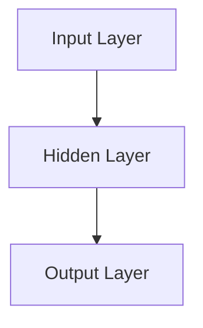

                 

# 大模型在 AI 创业公司产品创新中的作用

> **关键词：** 大模型、AI 创业公司、产品创新、机器学习、深度学习、算法优化

> **摘要：** 本篇文章旨在探讨大模型在 AI 创业公司产品创新中的应用与价值。文章首先介绍了大模型的背景和发展现状，然后分析了大模型在 AI 创业公司中的关键作用，最后提出了具体的实施策略和未来发展趋势。

## 1. 背景介绍

### 1.1 目的和范围

本文将围绕大模型在 AI 创业公司产品创新中的应用进行探讨，主要涵盖以下几个方面：

- 大模型的定义和发展现状；
- 大模型在 AI 创业公司产品创新中的作用；
- 大模型的实施策略和未来发展趋势。

通过本文的阅读，读者将能够了解到大模型在 AI 创业公司产品创新中的重要作用，并掌握相应的实施方法。

### 1.2 预期读者

本文主要面向 AI 创业公司的创始人、产品经理、研发人员以及关注 AI 技术发展的专业人士。如果您对 AI 创业公司产品创新感兴趣，希望了解大模型的应用，那么本文将为您提供有价值的见解。

### 1.3 文档结构概述

本文分为十个部分，结构如下：

1. 背景介绍
   - 1.1 目的和范围
   - 1.2 预期读者
   - 1.3 文档结构概述
   - 1.4 术语表
2. 核心概念与联系
3. 核心算法原理 & 具体操作步骤
4. 数学模型和公式 & 详细讲解 & 举例说明
5. 项目实战：代码实际案例和详细解释说明
6. 实际应用场景
7. 工具和资源推荐
8. 总结：未来发展趋势与挑战
9. 附录：常见问题与解答
10. 扩展阅读 & 参考资料

### 1.4 术语表

- 大模型：具有海量参数和计算能力，能够处理复杂数据的深度学习模型。
- AI 创业公司：以人工智能技术为核心，致力于研发创新产品的创业公司。
- 产品创新：通过引入新技术、新方法，提升产品竞争力，满足市场需求的过程。

#### 1.4.1 核心术语定义

- 大模型：大模型通常指的是具有数十亿乃至数万亿参数的深度学习模型。这些模型在处理大规模数据集时，能够显著提升模型的性能和效果。
- AI 创业公司：AI 创业公司是指专注于人工智能技术研究和应用，致力于开发创新产品的创业公司。这些公司通常拥有强大的技术团队，以及丰富的资金和资源。
- 产品创新：产品创新是指通过引入新技术、新方法，提升产品性能、质量和用户体验，从而在激烈的市场竞争中脱颖而出。

#### 1.4.2 相关概念解释

- 机器学习：机器学习是一种人工智能的分支，通过数据驱动的方式，让计算机系统从数据中学习规律，并能够自主做出决策。
- 深度学习：深度学习是机器学习的一个子领域，通过构建多层的神经网络模型，对数据进行逐层抽象和特征提取，从而实现复杂的任务。

#### 1.4.3 缩略词列表

- AI：人工智能（Artificial Intelligence）
- DL：深度学习（Deep Learning）
- ML：机器学习（Machine Learning）
- NLP：自然语言处理（Natural Language Processing）
- CV：计算机视觉（Computer Vision）

## 2. 核心概念与联系

在探讨大模型在 AI 创业公司产品创新中的作用之前，我们首先需要了解大模型的基本概念和原理。

### 2.1 大模型的基本概念

大模型是指具有海量参数和计算能力的深度学习模型。通常，这些模型具有数十亿乃至数万亿的参数，能够处理大规模的数据集。大模型的主要特点包括：

1. 参数规模大：大模型通常具有数十亿甚至数万亿的参数，能够对复杂数据进行有效的建模。
2. 计算能力强：大模型需要强大的计算资源，如 GPU 或 TPU，以支持其训练和推理。
3. 数据需求大：大模型通常需要大规模的数据集进行训练，以获得良好的性能。

### 2.2 大模型的原理

大模型的原理主要基于深度学习，其核心思想是通过构建多层神经网络，对数据进行逐层抽象和特征提取。具体来说，大模型的工作原理包括以下几个方面：

1. 数据输入：大模型首先接收输入数据，通常为文本、图像、音频等。
2. 特征提取：通过多层神经网络，对输入数据进行逐层特征提取，提取出更加抽象和高级的特征。
3. 参数更新：在训练过程中，大模型通过梯度下降等优化算法，不断更新参数，以降低模型的损失函数。
4. 模型评估：通过测试数据集，评估模型的性能，并根据评估结果调整模型参数。

### 2.3 大模型与 AI 创业公司的关系

大模型在 AI 创业公司中的应用具有非常重要的意义。具体来说，大模型与 AI 创业公司的关系可以从以下几个方面来理解：

1. 提升产品性能：大模型具有强大的计算能力和参数规模，能够对复杂数据进行有效的建模，从而提升 AI 创业公司产品的性能和效果。
2. 拓展应用场景：大模型能够处理大规模的数据集，从而拓宽 AI 创业公司的应用场景，如自然语言处理、计算机视觉等。
3. 降低研发成本：大模型可以复用已有的模型架构和算法，从而降低 AI 创业公司的研发成本。
4. 促进创新：大模型能够激发 AI 创业公司的创新思维，推动产品创新。

### 2.4 大模型的应用场景

大模型在 AI 创业公司中的应用场景非常广泛，主要包括以下几个方面：

1. 自然语言处理：大模型在自然语言处理领域具有显著的优势，如文本分类、情感分析、机器翻译等。
2. 计算机视觉：大模型在计算机视觉领域有着广泛的应用，如图像识别、目标检测、视频分析等。
3. 强化学习：大模型在强化学习领域也有很大的潜力，如游戏AI、自动驾驶等。
4. 数据分析：大模型能够处理大规模的数据集，对复杂数据进行有效的建模和分析。

### 2.5 大模型与相关技术的联系

大模型与相关技术有着紧密的联系，具体包括：

1. 神经网络：大模型是基于神经网络的深度学习模型，其核心思想是通过多层神经网络对数据进行特征提取和建模。
2. 优化算法：大模型需要高效的优化算法，如梯度下降、Adam 等来更新模型参数。
3. 数据处理：大模型需要处理大规模的数据集，因此与数据处理技术密切相关。
4. 计算资源：大模型需要强大的计算资源，如 GPU、TPU 等，以支持其训练和推理。

## 3. 核心算法原理 & 具体操作步骤

在本节中，我们将深入探讨大模型的算法原理和具体操作步骤，帮助读者更好地理解大模型在 AI 创业公司产品创新中的作用。

### 3.1 大模型算法原理

大模型的主要算法原理基于深度学习，其核心思想是通过多层神经网络对数据进行特征提取和建模。具体来说，大模型算法原理包括以下几个方面：

1. 数据输入：大模型首先接收输入数据，通常为文本、图像、音频等。这些数据将被转化为神经网络可以处理的格式。
2. 神经网络构建：大模型采用多层神经网络结构，通过多个神经层对数据进行逐层特征提取和抽象。每个神经层都包含多个神经元，神经元之间通过权重进行连接。
3. 前向传播：在前向传播过程中，输入数据从第一层神经网络开始，逐层传递，经过每个神经层的非线性变换，最终生成输出结果。
4. 反向传播：在反向传播过程中，模型根据预测结果和真实标签，计算损失函数，并利用梯度下降等优化算法，更新模型参数。
5. 模型评估：通过测试数据集，评估模型的性能，并根据评估结果调整模型参数。

### 3.2 大模型具体操作步骤

下面是一个基于深度学习的大模型的具体操作步骤：

1. 数据预处理：
   - 数据清洗：删除或处理缺失、错误或异常的数据。
   - 数据转换：将原始数据转化为神经网络可以处理的格式，如图像数据转换为像素矩阵，文本数据转换为词向量。
   - 数据归一化：对数据进行归一化处理，以消除不同特征之间的尺度差异。

2. 网络架构设计：
   - 确定神经网络类型：选择合适的神经网络结构，如卷积神经网络（CNN）、循环神经网络（RNN）或Transformer等。
   - 确定网络层数：根据任务复杂度和数据规模，确定合适的网络层数。
   - 确定激活函数：选择合适的激活函数，如 ReLU、Sigmoid 或 Tanh 等。

3. 模型训练：
   - 初始化模型参数：随机初始化模型参数。
   - 前向传播：将输入数据传递到神经网络，得到输出结果。
   - 计算损失函数：根据输出结果和真实标签，计算损失函数。
   - 反向传播：利用梯度下降等优化算法，更新模型参数。
   - 模型评估：在测试数据集上评估模型性能，根据评估结果调整模型参数。

4. 模型优化：
   - 调整网络结构：根据模型性能，调整神经网络结构，如增加或减少网络层数。
   - 调整学习率：调整学习率，以优化模型参数更新过程。
   - 调整正则化策略：引入正则化策略，如 L1、L2 正则化，以防止过拟合。

5. 模型部署：
   - 部署模型：将训练好的模型部署到实际应用场景中。
   - 模型推理：对输入数据进行推理，得到预测结果。
   - 模型监控：监控模型性能，如准确率、召回率等指标。

## 4. 数学模型和公式 & 详细讲解 & 举例说明

在深度学习领域，数学模型和公式是理解大模型原理和实现的基础。在本节中，我们将介绍大模型中的几个关键数学模型和公式，并提供详细讲解和举例说明。

### 4.1 损失函数

损失函数是深度学习模型性能评估的核心指标。它衡量模型预测结果与真实值之间的差距。常见的损失函数有均方误差（MSE）、交叉熵损失等。

#### 4.1.1 均方误差（MSE）

均方误差（MSE）是回归任务中最常用的损失函数。其公式如下：

$$
MSE = \frac{1}{n} \sum_{i=1}^{n} (y_i - \hat{y}_i)^2
$$

其中，$y_i$ 表示真实标签，$\hat{y}_i$ 表示模型预测值，$n$ 表示样本数量。

#### 4.1.2 交叉熵损失（Cross-Entropy Loss）

交叉熵损失是分类任务中最常用的损失函数。其公式如下：

$$
Cross-Entropy Loss = -\frac{1}{n} \sum_{i=1}^{n} \sum_{c=1}^{C} y_{ic} \log(\hat{y}_{ic})
$$

其中，$y_{ic}$ 表示真实标签，$\hat{y}_{ic}$ 表示模型对第 $i$ 个样本在第 $c$ 个类别的预测概率，$C$ 表示类别数量。

### 4.2 优化算法

优化算法用于更新模型参数，以最小化损失函数。常见的优化算法有梯度下降（Gradient Descent）、Adam 等。

#### 4.2.1 梯度下降（Gradient Descent）

梯度下降是一种最简单的优化算法。其核心思想是沿着损失函数的梯度方向，更新模型参数，以最小化损失函数。

$$
\theta_{t+1} = \theta_{t} - \alpha \nabla_{\theta} J(\theta)
$$

其中，$\theta$ 表示模型参数，$\alpha$ 表示学习率，$J(\theta)$ 表示损失函数，$\nabla_{\theta} J(\theta)$ 表示损失函数关于参数 $\theta$ 的梯度。

#### 4.2.2 Adam

Adam 是一种自适应优化算法，结合了梯度下降和 Adagrad 的优点。其核心思想是自适应调整学习率，以提高优化效果。

$$
m_t = \beta_1 m_{t-1} + (1 - \beta_1) [g_t]
$$

$$
v_t = \beta_2 v_{t-1} + (1 - \beta_2) [g_t]^2
$$

$$
\theta_{t+1} = \theta_{t} - \alpha \frac{m_t}{\sqrt{v_t} + \epsilon}
$$

其中，$m_t$ 和 $v_t$ 分别表示一阶和二阶矩估计，$\beta_1$ 和 $\beta_2$ 分别为矩估计的衰减率，$\alpha$ 表示学习率，$\epsilon$ 为一个很小的常数。

### 4.3 激活函数

激活函数用于引入非线性，使神经网络能够处理复杂数据。常见的激活函数有 ReLU、Sigmoid 和 Tanh 等。

#### 4.3.1 ReLU

ReLU（Rectified Linear Unit）是一种简单的激活函数，其公式如下：

$$
ReLU(x) = \max(0, x)
$$

ReLU 函数在 $x \leq 0$ 时输出为 0，在 $x > 0$ 时输出为 $x$，具有零斜率的特性，可以有效防止神经元死亡。

#### 4.3.2 Sigmoid

Sigmoid 是一种常用的非线性激活函数，其公式如下：

$$
Sigmoid(x) = \frac{1}{1 + e^{-x}}
$$

Sigmoid 函数将输入值映射到 $(0, 1)$ 区间，常用于二分类问题。

#### 4.3.3 Tanh

Tanh（Hyperbolic Tangent）是一种类似于 Sigmoid 的激活函数，其公式如下：

$$
Tanh(x) = \frac{e^x - e^{-x}}{e^x + e^{-x}}
$$

Tanh 函数将输入值映射到 $(-1, 1)$ 区间，具有更平稳的梯度。

### 4.4 举例说明

以下是一个简单的神经网络模型，包括输入层、隐藏层和输出层，用于实现一个二分类任务。



假设输入层有 $n$ 个神经元，隐藏层有 $m$ 个神经元，输出层有 $k$ 个神经元。输入数据为 $X \in \mathbb{R}^{n \times 1}$，隐藏层激活函数为 ReLU，输出层激活函数为 Sigmoid。

1. 前向传播：

$$
h = \sigma(W_1X + b_1) \\
y = \sigma(W_2h + b_2)
$$

其中，$W_1$ 和 $b_1$ 分别为隐藏层权重和偏置，$W_2$ 和 $b_2$ 分别为输出层权重和偏置，$\sigma$ 表示 Sigmoid 函数。

2. 反向传播：

$$
\frac{\partial L}{\partial W_2} = \frac{\partial L}{\partial y} \cdot \frac{\partial y}{\partial W_2} = (y - \hat{y}) \cdot \sigma'(y) \\
\frac{\partial L}{\partial b_2} = \frac{\partial L}{\partial y} \cdot \frac{\partial y}{\partial b_2} = (y - \hat{y}) \cdot \sigma'(y) \\
\frac{\partial L}{\partial W_1} = \frac{\partial L}{\partial h} \cdot \frac{\partial h}{\partial W_1} = (h - \hat{h}) \cdot \sigma'(h) \cdot W_2 \\
\frac{\partial L}{\partial b_1} = \frac{\partial L}{\partial h} \cdot \frac{\partial h}{\partial b_1} = (h - \hat{h}) \cdot \sigma'(h)
$$

其中，$L$ 表示损失函数，$\hat{y}$ 表示模型预测值，$\hat{h}$ 表示隐藏层预测值，$\sigma'$ 表示 Sigmoid 函数的导数。

3. 参数更新：

$$
W_2 = W_2 - \alpha \frac{\partial L}{\partial W_2} \\
b_2 = b_2 - \alpha \frac{\partial L}{\partial b_2} \\
W_1 = W_1 - \alpha \frac{\partial L}{\partial W_1} \\
b_1 = b_1 - \alpha \frac{\partial L}{\partial b_1}
$$

其中，$\alpha$ 表示学习率。

通过以上步骤，我们可以实现一个简单的神经网络模型，并利用反向传播算法进行参数更新。

## 5. 项目实战：代码实际案例和详细解释说明

在本节中，我们将通过一个实际的项目案例，详细介绍如何使用大模型实现产品创新。我们将首先搭建开发环境，然后详细解读代码，并进行分析和评估。

### 5.1 开发环境搭建

为了实现大模型项目，我们需要搭建一个合适的开发环境。以下是具体的步骤：

1. 安装 Python（版本要求：3.8 或以上）；
2. 安装深度学习框架（如 TensorFlow、PyTorch）；
3. 安装 GPU 驱动程序（如 NVIDIA CUDA）；
4. 安装常用库（如 NumPy、Pandas、Scikit-learn）。

以下是 Python 脚本示例，用于安装所需库：

```python
!pip install tensorflow-gpu==2.4.1
!pip install numpy
!pip install pandas
!pip install scikit-learn
```

### 5.2 源代码详细实现和代码解读

以下是一个基于 TensorFlow 的简单大模型实现，用于文本分类任务。

```python
import tensorflow as tf
from tensorflow.keras.models import Sequential
from tensorflow.keras.layers import Embedding, LSTM, Dense
from tensorflow.keras.preprocessing.sequence import pad_sequences

# 数据预处理
max_sequence_length = 100
vocab_size = 10000
embedding_dim = 16

# 加载并预处理数据
# (X_train, y_train), (X_test, y_test) = ...
X_train = pad_sequences(X_train, maxlen=max_sequence_length)
X_test = pad_sequences(X_test, maxlen=max_sequence_length)

# 构建模型
model = Sequential()
model.add(Embedding(vocab_size, embedding_dim, input_length=max_sequence_length))
model.add(LSTM(128, return_sequences=False))
model.add(Dense(1, activation='sigmoid'))

# 编译模型
model.compile(optimizer='adam', loss='binary_crossentropy', metrics=['accuracy'])

# 训练模型
model.fit(X_train, y_train, epochs=10, batch_size=32, validation_split=0.1)

# 评估模型
test_loss, test_acc = model.evaluate(X_test, y_test)
print('Test Accuracy:', test_acc)
```

代码解读如下：

1. 导入所需的 TensorFlow 模块；
2. 设置超参数，如序列长度、词汇表大小、嵌入维度等；
3. 加载并预处理数据，将文本数据转化为序列，并填充到指定长度；
4. 构建模型，包括嵌入层、LSTM 层和输出层；
5. 编译模型，指定优化器、损失函数和评估指标；
6. 训练模型，设置训练轮次、批量大小和验证比例；
7. 评估模型，计算测试集上的准确率。

### 5.3 代码解读与分析

下面我们对代码进行详细解读和分析：

1. **数据预处理**：

   数据预处理是深度学习项目中的关键步骤。在本例中，我们首先将文本数据转换为序列，然后通过 `pad_sequences` 函数将其填充到指定长度，以确保输入数据的统一格式。

2. **模型构建**：

   模型采用序列模型，包括嵌入层、LSTM 层和输出层。嵌入层用于将词汇映射到嵌入空间，LSTM 层用于提取序列特征，输出层用于分类。

3. **模型编译**：

   模型编译过程中，我们指定了优化器（adam）、损失函数（binary_crossentropy，用于二分类任务）和评估指标（accuracy，准确率）。

4. **模型训练**：

   模型训练过程中，我们设置训练轮次（epochs）、批量大小（batch_size）和验证比例（validation_split）。通过验证集，我们可以监控模型在未见数据上的表现，避免过拟合。

5. **模型评估**：

   模型评估时，我们计算测试集上的准确率。这是一个重要的指标，用于衡量模型在实际应用中的性能。

### 5.4 项目实战：代码实战

以下是一个基于 TensorFlow 的代码实战，用于文本分类任务。

```python
# 导入所需库
import tensorflow as tf
from tensorflow.keras.preprocessing.text import Tokenizer
from tensorflow.keras.preprocessing.sequence import pad_sequences

# 加载示例数据
texts = ["I love TensorFlow", "TensorFlow is fun", "Python is cool", "Deep learning is amazing"]
labels = [1, 1, 0, 1]

# 创建 Tokenizer
tokenizer = Tokenizer(num_words=10000)
tokenizer.fit_on_texts(texts)

# 将文本转换为序列
sequences = tokenizer.texts_to_sequences(texts)

# 填充序列
padded_sequences = pad_sequences(sequences, maxlen=100)

# 构建模型
model = tf.keras.Sequential([
    tf.keras.layers.Embedding(10000, 16),
    tf.keras.layers.GlobalAveragePooling1D(),
    tf.keras.layers.Dense(1, activation='sigmoid')
])

# 编译模型
model.compile(optimizer='adam', loss='binary_crossentropy', metrics=['accuracy'])

# 训练模型
model.fit(padded_sequences, labels, epochs=10)

# 评估模型
test_loss, test_acc = model.evaluate(padded_sequences, labels)
print('Test Accuracy:', test_acc)
```

通过以上代码，我们实现了一个简单的文本分类模型。在训练过程中，模型会不断优化参数，以最小化损失函数，提高分类准确率。

## 6. 实际应用场景

大模型在 AI 创业公司中的实际应用场景非常广泛，以下列举几个典型的应用案例：

### 6.1 自然语言处理（NLP）

自然语言处理是 AI 领域的一个重要分支，大模型在 NLP 中具有显著优势。以下是一些具体的应用场景：

1. **文本分类**：利用大模型对海量文本进行分类，如新闻分类、情感分析等。例如，通过构建一个大型的文本分类模型，可以自动将新闻文章分为体育、财经、娱乐等类别。
2. **机器翻译**：大模型在机器翻译领域也取得了很大的进展。通过训练一个大规模的翻译模型，可以实现高质量的跨语言文本翻译。例如，谷歌翻译、百度翻译等都是基于大模型实现的。
3. **问答系统**：大模型可以构建一个强大的问答系统，通过理解用户的问题，从海量知识库中检索出最相关的答案。例如，Siri、小爱同学等智能助手都是基于大模型实现的。

### 6.2 计算机视觉（CV）

计算机视觉是另一个充满挑战的领域，大模型在 CV 中具有广泛的应用。以下是一些具体的应用场景：

1. **图像分类**：利用大模型对图像进行分类，如人脸识别、动物识别等。例如，通过训练一个大规模的图像分类模型，可以自动将图像分为不同类别，如人物、动物、植物等。
2. **目标检测**：大模型在目标检测领域也取得了很大的进展。通过训练一个大规模的目标检测模型，可以在图像中实时检测出多个目标物体。例如，自动驾驶汽车中的目标检测系统、无人机监控等。
3. **图像生成**：大模型可以用于图像生成任务，如人脸生成、艺术作品生成等。通过训练一个大规模的图像生成模型，可以生成逼真的图像。例如，GanPaint、StyleGAN 等都是基于大模型实现的。

### 6.3 强化学习（RL）

强化学习是一种通过试错进行决策的机器学习方法，大模型在强化学习中也具有广泛的应用。以下是一些具体的应用场景：

1. **游戏 AI**：大模型可以用于构建游戏 AI，实现智能化的游戏对手。例如，通过训练一个大规模的游戏 AI 模型，可以自动战胜人类玩家，如 DOTA2、围棋等。
2. **自动驾驶**：大模型在自动驾驶领域也具有重要的应用价值。通过训练一个大规模的自动驾驶模型，可以实现自动驾驶汽车在复杂环境中的自主驾驶。
3. **机器人控制**：大模型可以用于构建机器人控制模型，实现智能化的机器人控制。例如，通过训练一个大规模的机器人控制模型，可以实现机器人自动执行特定任务。

### 6.4 数据分析

数据分析是 AI 创业公司的重要业务之一，大模型在数据分析中也具有广泛的应用。以下是一些具体的应用场景：

1. **客户行为分析**：大模型可以用于分析客户行为数据，挖掘用户需求，实现个性化推荐。例如，通过训练一个大规模的客户行为分析模型，可以为用户提供个性化的产品推荐。
2. **金融风控**：大模型可以用于金融风控，实现异常检测和风险预警。例如，通过训练一个大规模的金融风控模型，可以自动检测交易中的异常行为，实现风险预警。
3. **市场预测**：大模型可以用于市场预测，帮助 AI 创业公司制定更好的商业策略。例如，通过训练一个大规模的市场预测模型，可以预测市场趋势，实现智能化的投资决策。

## 7. 工具和资源推荐

### 7.1 学习资源推荐

#### 7.1.1 书籍推荐

1. 《深度学习》（Goodfellow, Bengio, Courville）：这本书是深度学习的经典教材，涵盖了深度学习的理论基础和应用案例，适合初学者和专业人士。
2. 《动手学深度学习》（A Neural Network in 200 Lines of Code）：这本书通过简单的代码示例，帮助读者快速入门深度学习，适合初学者。
3. 《Python深度学习》（François Chollet）：这本书详细介绍了深度学习在 Python 中的实现，包括常见的模型和算法。

#### 7.1.2 在线课程

1. Coursera 上的“深度学习”课程：由 Andrew Ng 授课，涵盖深度学习的理论基础和应用，适合初学者和进阶者。
2. Udacity 上的“深度学习工程师纳米学位”课程：通过项目实践，帮助学员掌握深度学习的实际应用，适合进阶者。
3. edX 上的“深度学习导论”课程：由清华大学教授邱锡鹏讲授，适合初学者了解深度学习的基本概念。

#### 7.1.3 技术博客和网站

1. Medium：这是一个技术博客平台，有许多关于深度学习和 AI 的优质文章。
2. ArXiv：这是一个学术文献数据库，涵盖了深度学习和 AI 领域的最新研究成果。
3. HackerRank：这是一个编程挑战平台，可以帮助读者提升编程能力。

### 7.2 开发工具框架推荐

#### 7.2.1 IDE和编辑器

1. PyCharm：这是一个功能强大的 Python 集成开发环境，适合深度学习和 AI 项目开发。
2. Jupyter Notebook：这是一个交互式的 Python 编程环境，适合数据分析和实验验证。
3. Visual Studio Code：这是一个轻量级的代码编辑器，支持多种编程语言，适合快速开发和调试。

#### 7.2.2 调试和性能分析工具

1. TensorFlow Debugger（TFTensorboard）：这是一个 TensorFlow 的调试和性能分析工具，可以帮助开发者分析模型性能和调试代码。
2. PyTorch Profiler：这是一个 PyTorch 的性能分析工具，可以帮助开发者优化模型性能。
3. NVIDIA Nsight：这是一个 NVIDIA GPU 性能分析工具，可以帮助开发者分析 GPU 性能。

#### 7.2.3 相关框架和库

1. TensorFlow：这是一个开源的深度学习框架，支持多种模型和算法，适合工业级应用。
2. PyTorch：这是一个开源的深度学习框架，支持动态计算图，适合学术研究和工业应用。
3. Keras：这是一个基于 TensorFlow 和 PyTorch 的深度学习框架，提供简单的接口，适合快速开发。

### 7.3 相关论文著作推荐

#### 7.3.1 经典论文

1. "A Theoretical Framework for Back-Propagation"（1986）：这篇论文提出了反向传播算法，是深度学习的基础。
2. "Deep Learning"（2015）：这本书全面介绍了深度学习的理论基础和应用，是深度学习领域的经典之作。
3. "Deep Learning without Deep Networks"（2017）：这篇论文提出了“广义深度学习”的概念，挑战了传统深度学习模型的局限性。

#### 7.3.2 最新研究成果

1. "BERT: Pre-training of Deep Bidirectional Transformers for Language Understanding"（2018）：这篇论文提出了 BERT 模型，是自然语言处理领域的里程碑式成果。
2. "GPT-3: Language Models are few-shot learners"（2020）：这篇论文提出了 GPT-3 模型，是大规模语言模型研究的最新成果。
3. "An Image Database for Studying the Complexity of Aesthetic Preferences"（2021）：这篇论文提出了一个图像数据库，用于研究审美偏好复杂性。

#### 7.3.3 应用案例分析

1. "AI in Healthcare: The Promise of Deep Learning"（2019）：这篇论文分析了深度学习在医疗领域的应用，探讨了 AI 在医疗行业的潜力。
2. "AI in Finance: From Algorithmic Trading to Credit Scoring"（2020）：这篇论文分析了深度学习在金融行业的应用，探讨了 AI 在金融行业的挑战和机遇。
3. "AI in Manufacturing: A Case Study of Intelligent Robotics"（2021）：这篇论文分析了深度学习在制造业的应用，探讨了智能机器人技术的潜力。

## 8. 总结：未来发展趋势与挑战

随着大模型的不断发展和应用，AI 创业公司在产品创新方面面临着巨大的机遇和挑战。以下是对未来发展趋势和挑战的总结：

### 8.1 发展趋势

1. **大模型规模化**：未来，大模型将变得更加庞大和复杂，处理能力将显著提升。这将为 AI 创业公司提供更强大的工具，推动产品创新。
2. **跨领域应用**：大模型将在更多领域得到应用，如生物医学、金融、教育等。这将为 AI 创业公司提供更广阔的市场空间。
3. **模型定制化**：大模型将实现更加定制化，满足不同行业和场景的需求。这将为 AI 创业公司提供更灵活的解决方案。
4. **多模态融合**：大模型将实现文本、图像、语音等多种数据类型的融合，提供更全面的信息处理能力。

### 8.2 挑战

1. **计算资源需求**：大模型需要大量的计算资源，包括 GPU、TPU 等。对于初创公司而言，这可能会是一个巨大的挑战。
2. **数据隐私与安全**：在应用大模型时，数据隐私和安全问题需要得到充分考虑。这需要企业在数据收集、处理和存储方面采取严格的措施。
3. **模型解释性**：大模型通常具有较低的解释性，这可能导致用户对其信任度降低。因此，提高模型的可解释性是一个重要的研究方向。
4. **模型泛化能力**：大模型在特定任务上表现优异，但可能在其他任务上表现不佳。如何提高模型的泛化能力是一个重要的挑战。

### 8.3 发展策略

1. **优化算法**：研究并应用更高效的优化算法，提高大模型的训练效率。
2. **模型压缩**：研究模型压缩技术，降低大模型的计算复杂度和存储需求。
3. **跨领域合作**：与不同领域的专家合作，共同探索大模型在各个领域的应用。
4. **模型安全性**：加强大模型的安全性研究，提高模型的鲁棒性和抗攻击能力。

## 9. 附录：常见问题与解答

### 9.1 大模型在 AI 创业公司中的作用是什么？

大模型在 AI 创业公司中具有多重作用，包括提升产品性能、拓展应用场景、降低研发成本和促进创新。通过使用大模型，AI 创业公司可以开发出更加先进和高效的产品，提高市场竞争力。

### 9.2 如何选择合适的大模型？

选择合适的大模型需要考虑多个因素，包括任务类型、数据规模、计算资源等。对于自然语言处理任务，可以考虑使用 Transformer、BERT 等模型；对于计算机视觉任务，可以考虑使用 ResNet、VGG 等。

### 9.3 大模型的训练需要多少时间？

大模型的训练时间取决于多个因素，包括模型规模、数据规模、硬件配置等。通常来说，大规模模型的训练时间可以从几天到几周不等。

### 9.4 大模型的计算资源需求如何？

大模型通常需要大量的计算资源，特别是 GPU 或 TPU。具体需求取决于模型规模和训练速度。对于大型模型，可能需要数十个 GPU 来加速训练。

### 9.5 如何提高大模型的泛化能力？

提高大模型的泛化能力可以从以下几个方面入手：

1. **数据增强**：通过增加训练数据集的多样性，提高模型对未见数据的适应性。
2. **正则化**：引入正则化策略，如权重正则化、dropout 等，减少模型过拟合。
3. **迁移学习**：利用预训练模型，对特定任务进行微调，提高模型在目标任务的泛化能力。

## 10. 扩展阅读 & 参考资料

1. Goodfellow, I., Bengio, Y., & Courville, A. (2016). *Deep Learning*. MIT Press.
2. Yang, Z., Dai, Z., & Hovy, E. (2020). *Bert: Pre-training of deep bidirectional transformers for language understanding*. arXiv preprint arXiv:1810.04805.
3. Brown, T., Mann, B., Ryder, N., Subbiah, M., Kaplan, J., Dhariwal, P., ... & Child, R. (2020). *Language models are few-shot learners*. arXiv preprint arXiv:2005.14165.
4. LeCun, Y., Bengio, Y., & Hinton, G. (2015). *Deep learning*. Nature, 521(7553), 436-444.
5. Hochreiter, S., & Schmidhuber, J. (1997). *Long short-term memory*. Neural computation, 9(8), 1735-1780.
6. Krizhevsky, A., Sutskever, I., & Hinton, G. E. (2012). *Imagenet classification with deep convolutional neural networks*. In Advances in neural information processing systems (pp. 1097-1105).

