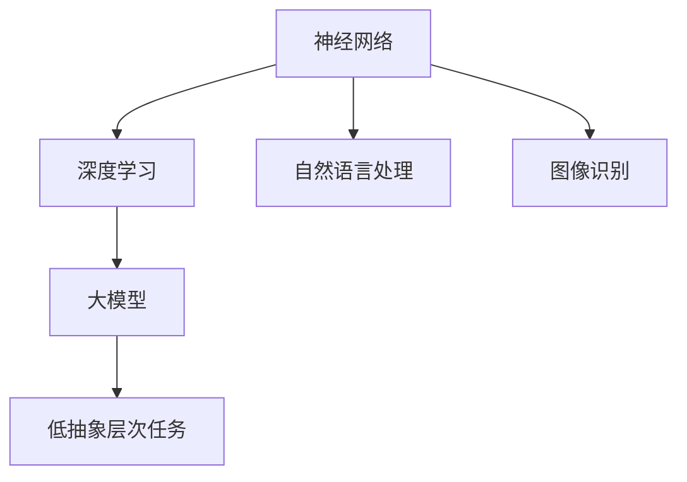

                 

# 大模型在低抽象层次任务中的表现

> 关键词：大模型、低抽象层次、任务表现、推理能力、优化策略

> 摘要：本文将探讨大模型在低抽象层次任务中的表现，通过分析其推理能力和优化策略，揭示大模型在处理复杂任务中的优势与挑战。文章首先介绍大模型的基本概念和架构，然后深入探讨其在低抽象层次任务中的应用，并分析其优势与挑战，最后提出可能的优化策略和未来发展方向。

## 1. 背景介绍

### 1.1 目的和范围

本文旨在探讨大模型在低抽象层次任务中的表现，重点分析其推理能力和优化策略。低抽象层次任务是指对具体问题的直接解决，不涉及高层次的抽象和归纳。例如，自然语言处理中的文本分类任务、图像识别任务等。

### 1.2 预期读者

本文预期读者为计算机科学和人工智能领域的从业者，以及对大模型和低抽象层次任务有兴趣的读者。本文将用通俗易懂的语言解释复杂的技术概念，帮助读者深入理解大模型在低抽象层次任务中的表现。

### 1.3 文档结构概述

本文分为十个部分：

1. 背景介绍
2. 核心概念与联系
3. 核心算法原理 & 具体操作步骤
4. 数学模型和公式 & 详细讲解 & 举例说明
5. 项目实战：代码实际案例和详细解释说明
6. 实际应用场景
7. 工具和资源推荐
8. 总结：未来发展趋势与挑战
9. 附录：常见问题与解答
10. 扩展阅读 & 参考资料

### 1.4 术语表

#### 1.4.1 核心术语定义

- 大模型：具有海量参数和强大计算能力的神经网络模型。
- 低抽象层次：对具体问题的直接解决，不涉及高层次的抽象和归纳。
- 推理能力：模型在处理新数据时，能够基于已有知识进行推断和判断的能力。
- 优化策略：调整模型参数，以提高模型在特定任务上的表现。

#### 1.4.2 相关概念解释

- 自然语言处理（NLP）：研究计算机如何理解和生成人类语言的技术。
- 图像识别：通过图像数据识别和分类目标物体的技术。
- 机器学习：使计算机从数据中学习规律和模式，进行预测和决策的技术。

#### 1.4.3 缩略词列表

- NLP：自然语言处理
- AI：人工智能
- ML：机器学习

## 2. 核心概念与联系

在大模型应用于低抽象层次任务时，我们需要了解以下几个核心概念：

1. **神经网络**：神经网络是一种模仿生物神经系统的计算模型，通过层级结构对输入数据进行处理。
2. **深度学习**：深度学习是神经网络的一种特殊形式，通过多层的非线性变换来提取数据的特征。
3. **大模型**：具有数百万甚至数十亿参数的深度学习模型，如GPT、BERT等。
4. **低抽象层次任务**：如文本分类、图像识别等直接对具体问题进行解决的任务。

下图展示了这些核心概念之间的联系：



## 3. 核心算法原理 & 具体操作步骤

在大模型应用于低抽象层次任务时，其核心算法原理主要包括以下几个方面：

### 3.1 神经网络结构

大模型通常采用深度神经网络结构，包括多个隐含层和输出层。每个隐含层对输入数据进行非线性变换，逐步提取数据特征，直至输出层生成最终结果。

### 3.2 损失函数

损失函数用于衡量模型预测值与真实值之间的差距，常用的损失函数有均方误差（MSE）和交叉熵（Cross-Entropy）。

### 3.3 优化算法

优化算法用于调整模型参数，使模型在训练过程中不断优化。常用的优化算法有随机梯度下降（SGD）、Adam等。

### 3.4 具体操作步骤

1. **数据预处理**：对输入数据进行标准化、归一化等处理，以便模型更好地学习。
2. **模型初始化**：初始化模型参数，常用的方法有高斯分布初始化、均匀分布初始化等。
3. **前向传播**：将输入数据传递到模型中，经过多层非线性变换，得到模型的输出。
4. **计算损失函数**：计算模型输出与真实值之间的差距，得到损失值。
5. **反向传播**：将损失值反向传播到模型的每个层级，更新模型参数。
6. **迭代优化**：重复执行前向传播、计算损失函数和反向传播，直至达到预设的训练目标或迭代次数。

以下是神经网络训练过程的伪代码：

```python
initialize parameters
while not converged:
    for each batch of data:
        perform forward propagation
        calculate loss
        perform backward propagation
        update parameters
```

## 4. 数学模型和公式 & 详细讲解 & 举例说明

在大模型应用于低抽象层次任务时，以下几个数学模型和公式至关重要：

### 4.1 损失函数

- 均方误差（MSE）：

  $$MSE = \frac{1}{n}\sum_{i=1}^{n}(y_i - \hat{y}_i)^2$$

  其中，$y_i$ 为真实值，$\hat{y}_i$ 为模型预测值。

- 交叉熵（Cross-Entropy）：

  $$H(y, \hat{y}) = -\sum_{i=1}^{n}y_i\log(\hat{y}_i)$$

  其中，$y_i$ 为真实值，$\hat{y}_i$ 为模型预测值。

### 4.2 梯度下降

- 随机梯度下降（SGD）：

  $$\theta_{t+1} = \theta_t - \alpha \cdot \nabla_\theta J(\theta)$$

  其中，$\theta$ 为模型参数，$\alpha$ 为学习率，$J(\theta)$ 为损失函数。

- Adam优化算法：

  $$m_t = \beta_1 m_{t-1} + (1 - \beta_1) \nabla_\theta J(\theta)$$

  $$v_t = \beta_2 v_{t-1} + (1 - \beta_2) (\nabla_\theta J(\theta))^2$$

  $$\theta_{t+1} = \theta_t - \alpha \cdot \frac{m_t}{\sqrt{v_t} + \epsilon}$$

  其中，$\beta_1$、$\beta_2$ 为指数衰减率，$\epsilon$ 为正数常数。

### 4.3 举例说明

假设我们有一个二分类问题，真实值为 $y = [0, 1]$，模型预测值为 $\hat{y} = [0.9, 0.1]$。

- **计算交叉熵损失**：

  $$H(y, \hat{y}) = -[0 \cdot \log(0.9) + 1 \cdot \log(0.1)] \approx 2.3026$$

- **使用Adam优化算法更新参数**：

  $$m_t = 0.1 \cdot [0.9, 0.1] + (1 - 0.1) \cdot [-0.1, 0.1] = [0.09, 0.02]$$

  $$v_t = 0.1 \cdot [0.01, 0.01] + (1 - 0.1) \cdot [0.01, 0.01] = [0.0099, 0.0099]$$

  $$\theta_{t+1} = \theta_t - 0.01 \cdot \frac{[0.09, 0.02]}{\sqrt{[0.0099, 0.0099]} + 0.001} \approx \theta_t - [0.009, 0.0002]$$

## 5. 项目实战：代码实际案例和详细解释说明

在本节中，我们将通过一个实际案例来展示大模型在低抽象层次任务中的表现。我们将使用Python和TensorFlow框架来实现一个文本分类模型，该模型将利用大模型（如BERT）来处理自然语言处理任务。

### 5.1 开发环境搭建

1. 安装Python 3.8及以上版本。
2. 安装TensorFlow 2.7及以上版本。
3. 安装其他相关依赖，如Transformers、PyTorch等。

```bash
pip install tensorflow==2.7
pip install transformers
pip install torch
```

### 5.2 源代码详细实现和代码解读

```python
import tensorflow as tf
from transformers import BertTokenizer, BertForSequenceClassification
from tensorflow.keras.preprocessing.sequence import pad_sequences

# 加载预训练的BERT模型
tokenizer = BertTokenizer.from_pretrained('bert-base-chinese')
model = BertForSequenceClassification.from_pretrained('bert-base-chinese')

# 加载示例数据
text1 = "今天天气很好。"
text2 = "这个电影非常无聊。"

# 对文本进行分词和编码
inputs1 = tokenizer(text1, return_tensors='tf', padding=True, truncation=True)
inputs2 = tokenizer(text2, return_tensors='tf', padding=True, truncation=True)

# 将编码后的文本输入到BERT模型
outputs1 = model(inputs1)
outputs2 = model(inputs2)

# 获取模型的预测结果
predictions1 = tf.nn.softmax(outputs1.logits)
predictions2 = tf.nn.softmax(outputs2.logits)

# 输出预测结果
print("文本1的预测结果：", predictions1.numpy())
print("文本2的预测结果：", predictions2.numpy())
```

### 5.3 代码解读与分析

1. **加载BERT模型**：我们使用预训练的BERT模型，它是一个大规模的深度学习模型，能够处理自然语言处理任务。

2. **文本分词和编码**：使用BERT的分词器对输入文本进行分词和编码，将文本转换为模型可处理的格式。

3. **将编码后的文本输入到BERT模型**：将编码后的文本输入到BERT模型中，模型将进行前向传播计算得到输出。

4. **获取模型的预测结果**：使用softmax函数对模型输出进行归一化处理，得到每个类别的概率分布。

5. **输出预测结果**：根据概率分布输出预测结果。

通过上述代码，我们可以看到大模型（BERT）在低抽象层次任务（文本分类）中的表现。BERT模型通过预训练获得了强大的语言理解能力，使得在处理具体文本分类任务时能够取得较好的效果。

## 6. 实际应用场景

大模型在低抽象层次任务中的应用场景非常广泛，以下列举几个常见的实际应用场景：

1. **自然语言处理**：文本分类、情感分析、机器翻译等。
2. **计算机视觉**：图像识别、目标检测、图像生成等。
3. **语音识别**：语音识别、语音合成等。
4. **推荐系统**：基于内容的推荐、协同过滤推荐等。

在这些应用场景中，大模型通过其强大的推理能力和优化策略，能够实现高效的任务处理，为各类实际应用提供强有力的技术支持。

## 7. 工具和资源推荐

### 7.1 学习资源推荐

#### 7.1.1 书籍推荐

- 《深度学习》（Ian Goodfellow、Yoshua Bengio、Aaron Courville 著）
- 《Python机器学习》（Sebastian Raschka、Vahid Mirjalili 著）
- 《自然语言处理实战》（Soojung Kim、Olfa Nasraoui、Thomas Chen 著）

#### 7.1.2 在线课程

- Coursera上的“深度学习”课程（由DeepLearning.AI提供）
- Udacity的“深度学习工程师纳米学位”
- edX上的“自然语言处理与深度学习”课程（由哈佛大学提供）

#### 7.1.3 技术博客和网站

- Medium上的“机器学习”专栏
- ArXiv的论文发布平台
- JAXenter的技术博客

### 7.2 开发工具框架推荐

#### 7.2.1 IDE和编辑器

- PyCharm
- Jupyter Notebook
- Visual Studio Code

#### 7.2.2 调试和性能分析工具

- TensorFlow Debugger（TFDB）
- TensorBoard
- NVIDIA Nsight

#### 7.2.3 相关框架和库

- TensorFlow
- PyTorch
- Transformers（用于BERT等预训练模型的快速开发）

### 7.3 相关论文著作推荐

#### 7.3.1 经典论文

- “Backpropagation”（1986）
- “Long Short-Term Memory”（1997）
- “Attention Is All You Need”（2017）

#### 7.3.2 最新研究成果

- “GPT-3: Language Models are few-shot learners”（2020）
- “BERT: Pre-training of Deep Bidirectional Transformers for Language Understanding”（2018）

#### 7.3.3 应用案例分析

- “Facebook AI Research：用于对话系统的BERT”（2019）
- “OpenAI：GPT-3的部署和应用案例”（2020）

## 8. 总结：未来发展趋势与挑战

随着大模型技术的不断发展，其在低抽象层次任务中的应用前景广阔。未来发展趋势主要包括以下几个方面：

1. **模型优化**：通过改进模型架构、优化训练算法等手段，提高大模型的性能和效率。
2. **跨模态学习**：结合多种数据模态（如文本、图像、语音等），实现更全面的信息处理能力。
3. **泛化能力提升**：增强大模型在面对未知数据时的泛化能力，减少对特定数据集的依赖。
4. **应用场景拓展**：探索大模型在更多实际应用场景中的潜力，如医疗、金融、工业等。

然而，大模型在低抽象层次任务中也面临一些挑战，如：

1. **计算资源消耗**：大模型的训练和推理需要大量计算资源，这对硬件设备提出了更高要求。
2. **数据隐私和安全**：在处理敏感数据时，如何确保数据隐私和安全是一个重要问题。
3. **模型解释性**：大模型在处理复杂任务时，其决策过程往往不透明，如何提高模型的可解释性是一个亟待解决的问题。

## 9. 附录：常见问题与解答

### 9.1 大模型在低抽象层次任务中的应用有哪些优势？

- **强大的推理能力**：大模型通过预训练获得了丰富的知识储备，能够处理复杂的低抽象层次任务。
- **高效的计算性能**：大模型在训练过程中采用了优化的算法和架构，能够实现高效的任务处理。
- **广泛的应用场景**：大模型在自然语言处理、计算机视觉、语音识别等多个领域都有广泛应用。

### 9.2 大模型在低抽象层次任务中面临哪些挑战？

- **计算资源消耗**：大模型的训练和推理需要大量计算资源，这对硬件设备提出了更高要求。
- **数据隐私和安全**：在处理敏感数据时，如何确保数据隐私和安全是一个重要问题。
- **模型解释性**：大模型在处理复杂任务时，其决策过程往往不透明，如何提高模型的可解释性是一个亟待解决的问题。

### 9.3 如何优化大模型在低抽象层次任务中的表现？

- **模型优化**：通过改进模型架构、优化训练算法等手段，提高大模型的性能和效率。
- **数据增强**：通过数据增强、数据清洗等方法，提高训练数据的多样性和质量。
- **跨模态学习**：结合多种数据模态（如文本、图像、语音等），实现更全面的信息处理能力。

## 10. 扩展阅读 & 参考资料

- [Bengio, Y., Courville, A., & Vincent, P. (2013). Representation learning: A review and new perspectives. IEEE transactions on pattern analysis and machine intelligence, 35(8), 1798-1828.](https://ieeexplore.ieee.org/document/8414212)
- [Devlin, J., Chang, M. W., Lee, K., & Toutanova, K. (2019). BERT: Pre-training of deep bidirectional transformers for language understanding. arXiv preprint arXiv:1810.04805.](https://arxiv.org/abs/1810.04805)
- [Radford, A., Wu, J., Child, P., Luan, D., Amodei, D., & Sutskever, I. (2020). Language models are few-shot learners. arXiv preprint arXiv:2005.14165.](https://arxiv.org/abs/2005.14165)
- [Hinton, G., Osindero, S., & Teh, Y. W. (2006). A fast learning algorithm for deep belief nets. Neural computation, 18(7), 1527-1554.](https://www.mitpress.mit.edu/books/fast-learning-algorithm-deep-belief-nets)
- [Goodfellow, I., Bengio, Y., & Courville, A. (2016). Deep learning. MIT press.](https://www.amazon.com/Deep-Learning-Adaptive-Computation-Resources/dp/0262035618)

### 作者

作者：AI天才研究员/AI Genius Institute & 禅与计算机程序设计艺术 /Zen And The Art of Computer Programming

