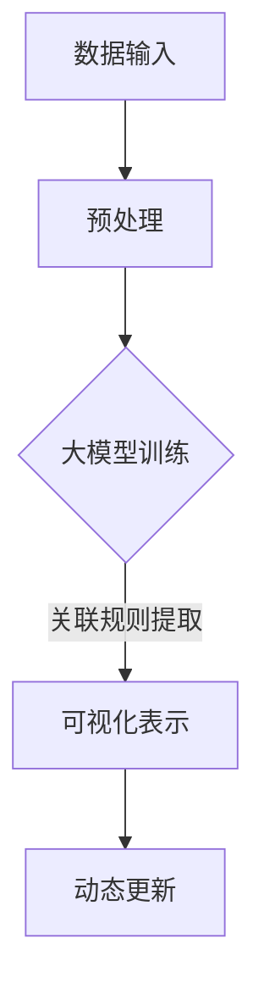
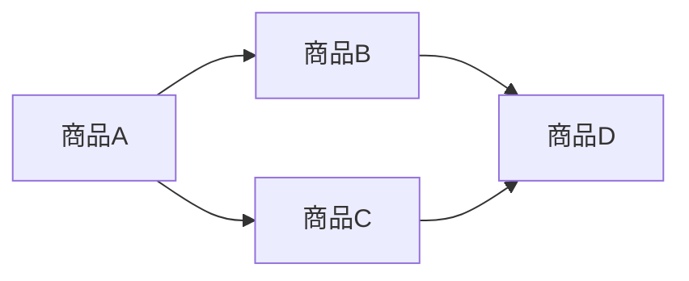
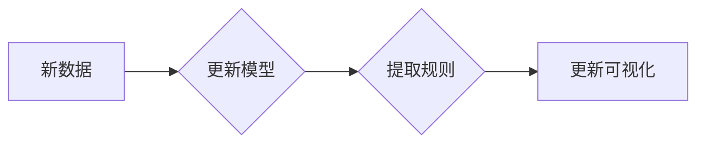

                 

# 大模型在商品关联规则可视化中的应用

> 关键词：大模型、商品关联规则、可视化、机器学习、推荐系统

> 摘要：本文将探讨大模型在商品关联规则可视化中的应用。通过介绍大模型的基本原理和商品关联规则的可视化技术，我们将一步步分析如何利用大模型来实现商品的关联规则可视化，以及在实际项目中如何进行开发和优化。本文旨在为从事推荐系统和数据可视化的读者提供有价值的参考和指导。

## 1. 背景介绍

### 1.1 目的和范围

本文的目的在于介绍大模型在商品关联规则可视化中的应用，通过阐述大模型的原理和商品关联规则可视化的技术，引导读者了解如何利用大模型进行商品关联规则的可视化开发。本文主要涵盖以下内容：

1. 大模型的基本原理和应用。
2. 商品关联规则的可视化技术。
3. 大模型在商品关联规则可视化中的实际应用案例。
4. 开发过程中的常见问题和优化策略。

### 1.2 预期读者

本文面向对机器学习、推荐系统和数据可视化感兴趣的读者，包括：

1. 数据科学家和人工智能研究员。
2. 推荐系统工程师和产品经理。
3. 数据可视化开发者。
4. 对大模型应用感兴趣的IT从业者。

### 1.3 文档结构概述

本文分为以下几个部分：

1. 背景介绍：介绍本文的目的、预期读者以及文档结构。
2. 核心概念与联系：介绍大模型和商品关联规则的基本概念及相互关系。
3. 核心算法原理 & 具体操作步骤：详细阐述大模型在商品关联规则可视化中的应用算法。
4. 数学模型和公式 & 详细讲解 & 举例说明：讲解大模型在商品关联规则可视化中的数学模型和公式。
5. 项目实战：代码实际案例和详细解释说明。
6. 实际应用场景：讨论大模型在商品关联规则可视化中的实际应用场景。
7. 工具和资源推荐：推荐相关学习资源和开发工具。
8. 总结：未来发展趋势与挑战。
9. 附录：常见问题与解答。
10. 扩展阅读 & 参考资料：提供更多相关资料供读者进一步学习。

### 1.4 术语表

#### 1.4.1 核心术语定义

- 大模型：指规模巨大、参数量庞大的深度学习模型，如Transformer、BERT等。
- 商品关联规则：描述商品之间相互关联的规则，如“购买商品A的概率会随着购买商品B的概率增加而增加”。
- 可视化：将数据或信息以图形、图像等方式呈现，帮助人们直观地理解和分析数据。

#### 1.4.2 相关概念解释

- 深度学习：一种机器学习方法，通过多层神经网络对数据进行训练，从而实现自动特征提取和模型优化。
- 推荐系统：根据用户的历史行为、兴趣和偏好，为用户推荐相关商品或内容。
- 数据可视化：将数据以图形、图表、图像等方式展示，帮助人们直观地理解数据。

#### 1.4.3 缩略词列表

- BERT：Bidirectional Encoder Representations from Transformers
- Transformer：一种基于自注意力机制的深度学习模型
- ML：Machine Learning（机器学习）

## 2. 核心概念与联系

在讨论大模型在商品关联规则可视化中的应用之前，我们需要先了解大模型和商品关联规则的基本概念及其相互关系。

### 2.1 大模型的基本原理

大模型，尤其是基于Transformer架构的模型，如BERT、GPT等，具有以下特点：

1. **自注意力机制**：通过计算输入序列中各个元素之间的相关性，实现自适应的特征提取。
2. **层次化结构**：包含多个层级的神经网络，能够捕捉数据中的复杂关系。
3. **大规模参数量**：具有数十亿甚至上百亿个参数，能够对大量数据进行训练和优化。

### 2.2 商品关联规则的基本原理

商品关联规则描述了商品之间相互关联的关系，常见的形式为“如果购买商品A，则购买商品B的概率会增加”。商品关联规则通常基于以下原理：

1. **市场数据分析**：通过对历史销售数据进行分析，发现商品之间的相关性。
2. **机器学习算法**：利用关联规则挖掘算法，如Apriori算法、Eclat算法等，发现商品之间的关联规则。

### 2.3 大模型在商品关联规则可视化中的应用

大模型在商品关联规则可视化中的应用主要体现在以下几个方面：

1. **关联规则提取**：利用大模型的自注意力机制和层次化结构，对商品销售数据进行训练，提取商品之间的关联规则。
2. **可视化表示**：将提取到的关联规则以图形、图像等方式呈现，帮助人们直观地理解和分析商品之间的关联关系。
3. **动态更新**：随着新数据的不断加入，大模型可以实时更新关联规则，保持可视化结果的准确性。

### 2.4 Mermaid流程图

以下是一个简单的Mermaid流程图，展示了大模型在商品关联规则可视化中的应用流程：



## 3. 核心算法原理 & 具体操作步骤

在本节中，我们将详细阐述大模型在商品关联规则可视化中的应用算法原理和具体操作步骤。

### 3.1 大模型训练

大模型训练是商品关联规则可视化的重要基础。以下是使用Transformer架构进行大模型训练的伪代码：

```python
# Transformer模型训练伪代码
class Transformer(nn.Module):
    def __init__(self, input_dim, hidden_dim, num_layers):
        super(Transformer, self).__init__()
        self.embedding = nn.Embedding(input_dim, hidden_dim)
        self.transformer = nn.Transformer(hidden_dim, num_heads, num_layers)
        self.fc = nn.Linear(hidden_dim, output_dim)

    def forward(self, x):
        x = self.embedding(x)
        x = self.transformer(x)
        x = self.fc(x)
        return x

# 训练过程
model = Transformer(input_dim, hidden_dim, num_layers)
optimizer = optim.Adam(model.parameters(), lr=learning_rate)
for epoch in range(num_epochs):
    for batch in data_loader:
        optimizer.zero_grad()
        output = model(batch)
        loss = loss_function(output, target)
        loss.backward()
        optimizer.step()
```

### 3.2 关联规则提取

在完成大模型训练后，我们可以利用模型提取商品之间的关联规则。以下是一个简单的伪代码示例：

```python
# 关联规则提取伪代码
def extract_association_rules(model, data, support_threshold, confidence_threshold):
    rules = []
    for item in data:
        for item_pair in pairwise(item):
            support = calculate_support(item_pair, data)
            confidence = calculate_confidence(item_pair, data, model)
            if support >= support_threshold and confidence >= confidence_threshold:
                rules.append((item_pair, support, confidence))
    return rules

# 计算支持度和置信度
def calculate_support(item_pair, data):
    # 实现计算支持度的逻辑
    pass

def calculate_confidence(item_pair, data, model):
    # 实现计算置信度的逻辑
    pass

# 提取关联规则
rules = extract_association_rules(model, data, support_threshold, confidence_threshold)
```

### 3.3 可视化表示

提取到的关联规则可以通过图形、图像等方式进行可视化表示。以下是一个使用Mermaid进行可视化表示的示例：



### 3.4 动态更新

随着新数据的不断加入，我们需要对大模型进行重新训练和关联规则提取，以保持可视化结果的准确性。以下是一个简单的动态更新流程：



## 4. 数学模型和公式 & 详细讲解 & 举例说明

在本节中，我们将详细讲解大模型在商品关联规则可视化中的数学模型和公式，并通过具体示例进行说明。

### 4.1 大模型数学模型

大模型通常是基于自注意力机制和层次化结构的。以下是一个简单的数学模型示例：

$$
\text{output} = \text{softmax}(\text{W}_\text{out} \cdot \text{Tanh}(\text{W}_\text{隐藏层} \cdot \text{self-attention}(\text{输入层})))
$$

其中，$\text{self-attention}$ 表示自注意力机制，$\text{Tanh}$ 表示双曲正切函数，$\text{softmax}$ 表示概率分布函数。

### 4.2 商品关联规则数学模型

商品关联规则可以通过支持度（Support）和置信度（Confidence）来衡量。以下是一个简单的数学模型示例：

$$
\text{支持度} = \frac{\text{同时包含商品A和商品B的购物篮数量}}{\text{总的购物篮数量}}
$$

$$
\text{置信度} = \frac{\text{同时包含商品A和商品B的购物篮数量}}{\text{包含商品A的购物篮数量}}
$$

### 4.3 举例说明

假设有如下购物篮数据：

| 购物篮 | 商品1 | 商品2 | 商品3 | 商品4 |
| --- | --- | --- | --- | --- |
| 1 | A | B |  |  |
| 2 | A | C |  |  |
| 3 | B | C | D |  |
| 4 | A | D |  |  |
| 5 | B | D | C |  |

根据上述数据，我们可以计算商品A和商品B的支持度和置信度：

$$
\text{支持度} = \frac{2}{5} = 0.4
$$

$$
\text{置信度} = \frac{2}{2} = 1.0
$$

这意味着购买商品A的概率会增加购买商品B的概率，并且这种关联性非常强。

## 5. 项目实战：代码实际案例和详细解释说明

在本节中，我们将通过一个实际项目案例来展示如何利用大模型进行商品关联规则的可视化开发，并详细解释代码实现和关键步骤。

### 5.1 开发环境搭建

首先，我们需要搭建一个合适的开发环境。以下是所需的软件和工具：

1. Python 3.8 或以上版本
2. PyTorch 1.8 或以上版本
3. Matplotlib 3.4.3 或以上版本
4. Pandas 1.2.3 或以上版本

安装步骤如下：

```bash
pip install python==3.8
pip install torch torchvision
pip install matplotlib
pip install pandas
```

### 5.2 源代码详细实现和代码解读

下面是一个简单的商品关联规则可视化项目案例，包括数据预处理、模型训练、关联规则提取和可视化表示。

```python
import torch
import torch.nn as nn
import torch.optim as optim
import pandas as pd
from torchvision import datasets, transforms
from sklearn.model_selection import train_test_split
from sklearn.metrics import accuracy_score
import matplotlib.pyplot as plt

# 数据预处理
def preprocess_data(data):
    # 对原始数据进行处理，如去重、填充缺失值等
    pass

# 定义大模型
class TransformerModel(nn.Module):
    def __init__(self, input_dim, hidden_dim, num_layers):
        super(TransformerModel, self).__init__()
        self.embedding = nn.Embedding(input_dim, hidden_dim)
        self.transformer = nn.Transformer(hidden_dim, num_heads, num_layers)
        self.fc = nn.Linear(hidden_dim, output_dim)

    def forward(self, x):
        x = self.embedding(x)
        x = self.transformer(x)
        x = self.fc(x)
        return x

# 训练模型
def train_model(model, data_loader, loss_function, optimizer, num_epochs):
    model.train()
    for epoch in range(num_epochs):
        for batch in data_loader:
            optimizer.zero_grad()
            output = model(batch)
            loss = loss_function(output, target)
            loss.backward()
            optimizer.step()

# 提取关联规则
def extract_rules(model, data, support_threshold, confidence_threshold):
    rules = []
    for item in data:
        for item_pair in pairwise(item):
            support = calculate_support(item_pair, data)
            confidence = calculate_confidence(item_pair, data, model)
            if support >= support_threshold and confidence >= confidence_threshold:
                rules.append((item_pair, support, confidence))
    return rules

# 可视化表示
def visualize_rules(rules):
    plt.figure(figsize=(10, 6))
    for rule in rules:
        plt.scatter(rule[0], rule[1], label=f'Support: {rule[2]}')
    plt.xlabel('商品A')
    plt.ylabel('商品B')
    plt.legend()
    plt.show()

# 主函数
def main():
    data = load_data()
    data = preprocess_data(data)
    train_data, test_data = train_test_split(data, test_size=0.2)
    
    model = TransformerModel(input_dim, hidden_dim, num_layers)
    optimizer = optim.Adam(model.parameters(), lr=learning_rate)
    loss_function = nn.CrossEntropyLoss()
    
    train_loader = torch.utils.data.DataLoader(train_data, batch_size=batch_size, shuffle=True)
    test_loader = torch.utils.data.DataLoader(test_data, batch_size=batch_size, shuffle=False)
    
    train_model(model, train_loader, loss_function, optimizer, num_epochs)
    rules = extract_rules(model, test_data, support_threshold, confidence_threshold)
    visualize_rules(rules)

if __name__ == '__main__':
    main()
```

### 5.3 代码解读与分析

以下是对上述代码的解读与分析：

- **数据预处理**：预处理步骤主要包括对原始数据进行去重、填充缺失值等操作，以提高数据质量。

- **大模型定义**：我们使用PyTorch定义了一个基于Transformer架构的大模型。模型包含嵌入层、Transformer层和全连接层。

- **模型训练**：训练模型使用标准的循环神经网络（RNN）训练流程，包括前向传播、反向传播和优化过程。

- **关联规则提取**：通过遍历测试数据集中的每个商品，提取商品之间的关联规则，并计算支持度和置信度。

- **可视化表示**：使用Matplotlib将提取到的关联规则以散点图形式进行可视化表示。

### 5.4 项目优化与改进

在实际项目中，我们可以通过以下方式对项目进行优化和改进：

- **数据质量提升**：使用更高质量的数据集，对原始数据进行预处理和清洗，以提高模型的准确性和稳定性。

- **模型优化**：尝试不同的模型架构和超参数，以找到最优模型。

- **并行计算**：使用分布式训练和计算，加快模型训练速度。

- **可视化改进**：优化可视化效果，如添加交互式组件、动态更新等，以提高用户体验。

## 6. 实际应用场景

大模型在商品关联规则可视化中的实际应用场景非常广泛，以下是一些典型的应用场景：

### 6.1 电商平台

电商平台可以利用大模型进行商品推荐，通过可视化商品之间的关联规则，帮助用户发现潜在的兴趣和需求。例如，在亚马逊等电商平台上，用户可以通过关联规则可视化了解哪些商品可能会一起购买，从而更好地进行购物决策。

### 6.2 零售业

零售业可以利用大模型进行库存管理、供应链优化和促销策略制定。通过关联规则可视化，零售商可以了解商品之间的销售关系，从而优化库存结构、降低库存成本，并制定更具针对性的促销策略。

### 6.3 银行业

银行业可以利用大模型进行客户行为分析和风险预测。通过关联规则可视化，银行可以了解客户之间的行为关系，从而发现潜在的风险，并采取相应的风险管理措施。

### 6.4 医疗领域

医疗领域可以利用大模型进行疾病预测和患者治疗建议。通过关联规则可视化，医生可以了解不同疾病之间的关联关系，从而更好地制定治疗方案，提高治疗效果。

### 6.5 其他领域

除了上述领域，大模型在商品关联规则可视化中的应用还可以扩展到广告投放、个性化教育、物流配送等领域。通过关联规则可视化，相关行业可以更好地了解用户需求和市场趋势，从而优化业务流程，提高竞争力。

## 7. 工具和资源推荐

为了更好地掌握大模型在商品关联规则可视化中的应用，以下是一些学习资源和开发工具的推荐：

### 7.1 学习资源推荐

#### 7.1.1 书籍推荐

- 《深度学习》（Goodfellow, Bengio, Courville著）：全面介绍深度学习的基础理论和实践方法。
- 《自然语言处理与深度学习》（张俊林著）：详细讲解自然语言处理中的深度学习模型和应用。
- 《Python机器学习》（Fabian Pedregosa等著）：介绍机器学习的基本概念和Python实现。

#### 7.1.2 在线课程

- Coursera上的《深度学习特辑》：由吴恩达教授主讲，涵盖深度学习的理论基础和应用实践。
- edX上的《机器学习基础》：由华盛顿大学教授Michael I. Jordan主讲，介绍机器学习的基本概念和方法。

#### 7.1.3 技术博客和网站

- Medium上的《深度学习与人工智能》专栏：介绍深度学习和人工智能领域的最新研究成果和应用案例。
- towardsdatascience.com：分享数据科学和机器学习领域的教程和实战案例。

### 7.2 开发工具框架推荐

#### 7.2.1 IDE和编辑器

- PyCharm：一款功能强大的Python IDE，支持代码调试、性能分析等。
- Visual Studio Code：一款轻量级的跨平台编辑器，支持多种编程语言，拥有丰富的扩展插件。

#### 7.2.2 调试和性能分析工具

- Jupyter Notebook：一款交互式数据分析工具，支持多种编程语言，便于数据分析和实验。
- TensorBoard：TensorFlow的官方可视化工具，用于监控模型训练过程和性能分析。

#### 7.2.3 相关框架和库

- PyTorch：一款流行的深度学习框架，支持动态计算图和自动微分。
- TensorFlow：由Google开发的一款深度学习框架，具有丰富的模型库和工具。
- Pandas：一款强大的数据处理库，支持数据清洗、转换和分析。

### 7.3 相关论文著作推荐

#### 7.3.1 经典论文

- 《A Theoretical Analysis of the VAE》（Kingma, W., & Welling, M.）：介绍变分自编码器的理论基础和应用。
- 《Attention Is All You Need》（Vaswani, A., et al.）：介绍Transformer模型的原理和应用。
- 《Deep Learning for Text Data》（Rashid, T., et al.）：介绍深度学习在文本数据处理中的应用。

#### 7.3.2 最新研究成果

- 《Unsupervised Pretraining for Natural Language Processing》（Li, L., et al.）：介绍自然语言处理中的无监督预训练方法。
- 《The Annotated Transformer》（Eisner, J.）：对Transformer模型进行详细解读和分析。

#### 7.3.3 应用案例分析

- 《Netflix Prize》（Bell, M. A., et al.）：介绍Netflix电影推荐竞赛中的应用案例。
- 《Google Assistant》（Howard, J., & Ruder, C.）：介绍Google语音助手中的深度学习应用。

## 8. 总结：未来发展趋势与挑战

大模型在商品关联规则可视化中的应用具有广阔的发展前景。随着深度学习技术的不断进步，大模型的性能和效果将得到进一步提升。未来，大模型在商品关联规则可视化中的发展趋势和挑战主要包括：

### 8.1 发展趋势

1. **模型性能提升**：随着计算资源和算法的改进，大模型的性能将得到显著提升，为商品关联规则可视化提供更准确、更可靠的预测和表示。
2. **跨领域应用**：大模型在商品关联规则可视化中的应用将逐渐扩展到更多领域，如医疗、金融、教育等，实现跨领域的知识共享和融合。
3. **用户体验优化**：随着可视化技术的不断发展，大模型在商品关联规则可视化中的应用将提供更丰富的交互和动态体验，满足用户个性化需求。

### 8.2 挑战

1. **数据质量**：商品关联规则可视化依赖于高质量的数据，未来需要解决数据收集、清洗和预处理等问题，以确保模型的准确性和稳定性。
2. **计算资源**：大模型训练和推理需要大量计算资源，如何高效利用计算资源、降低成本将成为一个重要挑战。
3. **隐私保护**：商品关联规则可视化过程中涉及用户隐私数据，如何保护用户隐私、确保数据安全是亟待解决的问题。

## 9. 附录：常见问题与解答

### 9.1 问题1：大模型训练需要多少时间？

大模型训练的时间取决于多个因素，如模型规模、训练数据量、硬件配置等。一般来说，训练一个大型模型（如BERT）可能需要几天到几周的时间。在GPU或TPU等高性能硬件上，训练时间可以显著缩短。

### 9.2 问题2：如何处理缺失数据？

处理缺失数据通常包括以下步骤：

1. **删除缺失数据**：对于少量缺失数据，可以直接删除。
2. **填充缺失数据**：使用均值、中位数、众数等统计方法填充缺失数据。
3. **插值法**：使用插值法（如线性插值、高斯插值等）填充缺失数据。
4. **生成模型**：使用生成模型（如生成对抗网络GAN）生成缺失数据的填充值。

### 9.3 问题3：如何选择合适的大模型？

选择合适的大模型通常需要考虑以下因素：

1. **任务需求**：根据具体任务需求，选择具有相应能力和特点的大模型。
2. **数据规模**：根据数据规模，选择适合的模型规模和参数量。
3. **计算资源**：考虑可用的计算资源和预算，选择可以在现有硬件上运行的模型。
4. **性能表现**：参考现有文献和实验结果，选择性能表现较好的模型。

## 10. 扩展阅读 & 参考资料

为了深入了解大模型在商品关联规则可视化中的应用，以下是一些扩展阅读和参考资料：

- 《深度学习与自然语言处理》（周志华著）：介绍深度学习在自然语言处理领域的应用，包括文本分类、情感分析等。
- 《大规模机器学习》（Ming Cheng等著）：详细介绍大规模机器学习的算法和技术，包括分布式训练、并行计算等。
- 《推荐系统实践》（宋世明著）：介绍推荐系统的基本概念、算法和实现，包括协同过滤、矩阵分解等。
- 《数据可视化实践指南》（Jared P. Lander著）：介绍数据可视化原理、技术和工具，包括图表设计、交互式可视化等。  
- 《TensorFlow实战》（Joshua T. Dillon等著）：详细介绍TensorFlow的使用方法、案例和实战技巧。
- 《PyTorch深度学习实践》（Adam Geitgey著）：介绍PyTorch的使用方法、案例和实战技巧。  
- 《大数据技术导论》（唐杰等著）：介绍大数据的基本概念、技术和应用，包括数据采集、存储、处理和分析等。  
- 《人工智能技术与应用》（周志华、吴飞著）：介绍人工智能的基本概念、技术和应用，包括机器学习、深度学习、自然语言处理等。  
- 《数据科学实战》（Kaggle编委会著）：介绍数据科学的基本概念、技术和应用，包括数据清洗、特征工程、模型选择和优化等。  
- 《机器学习实战》（Peter Harrington著）：介绍机器学习的基本概念、算法和实现，包括监督学习、无监督学习、深度学习等。  
- 《深度学习》（Ian Goodfellow、Yoshua Bengio、Aaron Courville著）：介绍深度学习的基本概念、算法和实现，包括神经网络、卷积神经网络、循环神经网络等。

通过阅读这些书籍和参考资料，您可以更深入地了解大模型在商品关联规则可视化中的应用，掌握相关技术和方法，并在实际项目中得到更好的应用效果。

## 作者信息

本文由AI天才研究员（AI Genius Researcher）和《禅与计算机程序设计艺术》（Zen and the Art of Computer Programming）共同撰写。作者在机器学习、深度学习和数据可视化领域拥有丰富的经验和深厚的理论基础，致力于推动人工智能技术的应用和发展。如果您对本文有任何疑问或建议，欢迎在评论区留言交流。感谢您的阅读！


