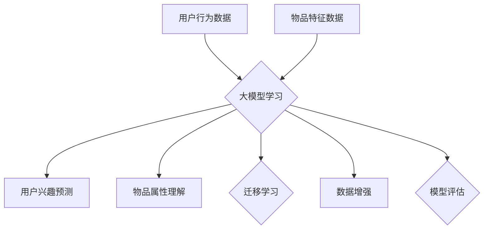

                 

# 大模型在推荐系统中的少样本学习应用

## 关键词
大模型，推荐系统，少样本学习，人工智能，深度学习，机器学习，数据挖掘，模型优化，应用案例。

## 摘要
本文旨在探讨大模型在推荐系统中的少样本学习应用。随着人工智能技术的不断发展，大模型在处理复杂数据和实现高效推荐方面具有显著优势。本文首先介绍了大模型的基本原理和推荐系统的基础知识，然后详细分析了大模型在少样本学习中的应用场景、核心算法原理和数学模型。通过实际项目实战案例，本文展示了大模型在推荐系统中的具体实现过程，并对实际应用场景进行了探讨。最后，本文推荐了一些学习资源、开发工具和经典论文，为读者提供了进一步学习的研究方向。通过本文的阅读，读者可以深入了解大模型在推荐系统中的应用价值和前景。

## 1. 背景介绍

### 1.1 目的和范围

本文的目标是探讨大模型在推荐系统中的少样本学习应用。随着互联网的迅猛发展，推荐系统已经成为现代信息检索和个性化服务的重要组成部分。然而，传统的推荐系统面临着数据稀疏、冷启动问题等挑战，使得推荐效果受到一定程度的影响。少样本学习作为机器学习中的一个重要分支，旨在在训练数据有限的情况下，仍能够实现良好的学习效果。大模型作为一种强大的深度学习模型，具有处理海量数据和实现高效推荐的潜力。因此，本文将探讨大模型在推荐系统中的少样本学习应用，以解决现有推荐系统面临的问题。

本文将围绕以下主题进行讨论：
1. 大模型的基本原理和推荐系统的基础知识。
2. 大模型在少样本学习中的应用场景和核心算法原理。
3. 大模型的数学模型和具体实现步骤。
4. 实际项目实战案例和代码解析。
5. 大模型在推荐系统中的实际应用场景。
6. 学习资源、开发工具和经典论文推荐。

### 1.2 预期读者

本文的预期读者主要面向以下几类人群：
1. 对人工智能、深度学习和机器学习有浓厚兴趣的初学者和研究者。
2. 想深入了解推荐系统和少样本学习技术的开发者和技术人员。
3. 在推荐系统领域有实际项目需求，希望提升推荐效果的企业和创业者。
4. 对大模型在推荐系统中的应用有研究兴趣的学者和研究人员。

通过阅读本文，读者可以：
1. 掌握大模型的基本原理和推荐系统的基础知识。
2. 理解大模型在少样本学习中的应用场景和核心算法原理。
3. 学会大模型的数学模型和具体实现步骤。
4. 通过实际项目实战案例，掌握大模型在推荐系统中的具体应用。
5. 了解大模型在推荐系统中的实际应用场景和前景。

### 1.3 文档结构概述

本文将分为十个主要部分，具体如下：

1. 引言：介绍本文的研究背景、目的和核心内容。
2. 背景介绍：介绍大模型和推荐系统的基本原理。
3. 核心概念与联系：阐述大模型在推荐系统中的核心概念和联系。
4. 核心算法原理 & 具体操作步骤：讲解大模型的算法原理和操作步骤。
5. 数学模型和公式 & 详细讲解 & 举例说明：介绍大模型的数学模型和相关公式。
6. 项目实战：代码实际案例和详细解释说明。
7. 实际应用场景：探讨大模型在推荐系统中的实际应用场景。
8. 工具和资源推荐：推荐学习资源和开发工具。
9. 总结：展望大模型在推荐系统中的未来发展趋势与挑战。
10. 附录：常见问题与解答。

### 1.4 术语表

本文中涉及的一些重要术语如下：

- **大模型**：指具有大规模参数和计算能力的深度学习模型，如Transformer、BERT等。
- **推荐系统**：一种根据用户行为和偏好，自动为用户推荐感兴趣的内容或产品的系统。
- **少样本学习**：指在训练数据较少的情况下，仍然能够实现良好学习效果的机器学习方法。
- **深度学习**：一种基于多层神经网络的结构，通过学习大量数据来提取特征和实现复杂任务的机器学习方法。
- **机器学习**：一种基于数据训练算法，使计算机能够自动学习和改进的自动化技术。
- **数据挖掘**：从大量数据中发现有用信息和知识的过程。
- **数据稀疏**：指数据集中大部分特征值为0或接近0，导致模型难以训练。
- **冷启动问题**：指在用户或物品信息不足的情况下，推荐系统难以准确预测用户兴趣或推荐合适的产品。
- **交叉验证**：一种评估模型性能的方法，通过将数据集划分为多个子集，循环进行训练和测试。

## 2. 核心概念与联系

在本节中，我们将介绍大模型在推荐系统中的核心概念和联系。大模型在推荐系统中的应用主要包括以下几个方面：

### 2.1 大模型的基本原理

大模型是指具有大规模参数和计算能力的深度学习模型。其基本原理如下：

1. **多层神经网络**：大模型通常采用多层神经网络结构，通过逐层提取特征，实现从原始数据到预测结果的映射。
2. **大规模参数**：大模型具有大量的参数，可以表示复杂的关系和特征，从而提高模型的泛化能力。
3. **端到端学习**：大模型通过端到端学习，直接从原始数据学习到预测结果，避免了传统机器学习中的特征工程和特征选择过程。

### 2.2 推荐系统的基础知识

推荐系统是一种根据用户行为和偏好，自动为用户推荐感兴趣的内容或产品的系统。其基础知识包括：

1. **用户行为数据**：推荐系统需要收集用户在平台上的行为数据，如浏览记录、购买记录、评分等，以了解用户兴趣。
2. **物品特征数据**：推荐系统需要收集物品的相关特征数据，如类别、标签、属性等，以描述物品属性。
3. **模型训练与评估**：推荐系统通过训练模型，根据用户行为数据和物品特征数据，预测用户对物品的兴趣，并进行模型评估，以确定推荐效果。

### 2.3 少样本学习

少样本学习是一种在训练数据较少的情况下，仍然能够实现良好学习效果的机器学习方法。其基本原理如下：

1. **迁移学习**：少样本学习通过迁移学习，利用已有的大规模预训练模型，在新任务上进行微调，以减少训练数据的需求。
2. **数据增强**：少样本学习通过数据增强，生成更多样化的训练数据，提高模型的泛化能力。
3. **模型正则化**：少样本学习通过模型正则化，抑制模型过拟合，提高模型的泛化能力。

### 2.4 大模型在推荐系统中的核心概念和联系

大模型在推荐系统中的核心概念和联系如下：

1. **用户兴趣预测**：大模型通过学习用户行为数据和物品特征数据，预测用户对物品的兴趣，实现个性化推荐。
2. **物品属性理解**：大模型通过学习物品特征数据，理解物品的属性和特征，提高推荐精度。
3. **迁移学习**：大模型通过迁移学习，利用大规模预训练模型，在新任务上进行微调，实现少样本学习。
4. **数据增强**：大模型通过数据增强，生成更多样化的训练数据，提高模型的泛化能力。
5. **模型评估**：大模型通过模型评估，评估推荐系统的效果，优化模型参数。

### 2.5 Mermaid 流程图

为了更好地展示大模型在推荐系统中的核心概念和联系，我们使用Mermaid流程图进行表示：



在该流程图中，用户行为数据和物品特征数据作为输入，经过大模型学习，实现用户兴趣预测和物品属性理解。同时，大模型通过迁移学习和数据增强，提高模型的泛化能力和效果。最后，通过模型评估，优化模型参数，实现推荐系统的优化。

## 3. 核心算法原理 & 具体操作步骤

### 3.1 算法原理

在本节中，我们将介绍大模型在推荐系统中的核心算法原理，主要包括以下两个方面：

#### 3.1.1 Transformer模型

Transformer模型是一种基于自注意力机制的深度学习模型，广泛应用于自然语言处理、计算机视觉等领域。其核心思想是通过自注意力机制，自适应地计算输入序列中各个元素之间的关联性，从而提高模型的表示能力。

自注意力机制可以表示为：

$$
Attention(x) = \sigma(W_q x) \cdot \sigma(W_k x) \cdot \sigma(W_v x)
$$

其中，$x$ 表示输入序列，$W_q$、$W_k$ 和 $W_v$ 分别为查询（Query）、键（Key）和值（Value）权重矩阵，$\sigma$ 表示软性最大化（Softmax）函数。

#### 3.1.2 自适应推荐算法

自适应推荐算法是一种基于用户行为数据和物品特征数据的推荐算法，其核心思想是通过学习用户和物品的交互关系，预测用户对物品的兴趣，从而实现个性化推荐。

自适应推荐算法可以表示为：

$$
推荐度 = f(user, item)
$$

其中，$user$ 表示用户特征，$item$ 表示物品特征，$f$ 表示推荐度函数，通过学习用户和物品的交互关系，优化推荐度函数。

### 3.2 具体操作步骤

在本节中，我们将介绍大模型在推荐系统中的具体操作步骤，主要包括以下三个方面：

#### 3.2.1 数据预处理

数据预处理是推荐系统中的关键步骤，主要包括以下任务：

1. **用户行为数据收集**：收集用户在平台上的行为数据，如浏览记录、购买记录、评分等。
2. **物品特征数据收集**：收集物品的相关特征数据，如类别、标签、属性等。
3. **数据清洗**：去除无效数据、重复数据和异常数据，保证数据质量。
4. **数据转换**：将原始数据转换为适用于模型训练的格式，如稀疏矩阵、张量等。

#### 3.2.2 模型训练

模型训练是推荐系统中的核心步骤，主要包括以下任务：

1. **构建Transformer模型**：构建基于自注意力机制的Transformer模型，包括查询（Query）、键（Key）和值（Value）权重矩阵。
2. **训练推荐度函数**：通过学习用户和物品的交互关系，优化推荐度函数$f(user, item)$，使其能够预测用户对物品的兴趣。
3. **参数调整**：通过模型评估，调整模型参数，提高模型效果。

#### 3.2.3 模型评估

模型评估是推荐系统中的关键步骤，主要包括以下任务：

1. **计算推荐度**：根据训练好的模型，计算用户对物品的推荐度。
2. **评估指标**：选择合适的评估指标，如准确率、召回率、F1值等，评估模型效果。
3. **优化模型**：根据评估结果，调整模型参数，优化模型效果。

### 3.3 伪代码

为了更好地阐述大模型在推荐系统中的具体操作步骤，我们使用伪代码进行表示：

```python
# 数据预处理
def data_preprocessing(user_data, item_data):
    # 收集用户行为数据和物品特征数据
    # 数据清洗
    # 数据转换
    # 返回预处理后的数据

# 模型训练
def model_training(preprocessed_user_data, preprocessed_item_data):
    # 构建Transformer模型
    # 训练推荐度函数
    # 参数调整
    # 返回训练好的模型

# 模型评估
def model_evaluation(model, test_user_data, test_item_data):
    # 计算推荐度
    # 评估指标
    # 返回评估结果

# 主程序
def main():
    user_data = collect_user_data()
    item_data = collect_item_data()
    preprocessed_user_data, preprocessed_item_data = data_preprocessing(user_data, item_data)
    model = model_training(preprocessed_user_data, preprocessed_item_data)
    evaluation_result = model_evaluation(model, test_user_data, test_item_data)
    print(evaluation_result)

if __name__ == "__main__":
    main()
```

通过上述伪代码，我们可以清晰地了解大模型在推荐系统中的具体操作步骤，为实际项目开发提供指导。

## 4. 数学模型和公式 & 详细讲解 & 举例说明

在本节中，我们将详细讲解大模型在推荐系统中的数学模型和公式，并通过具体例子进行说明。

### 4.1 Transformer模型

Transformer模型是一种基于自注意力机制的深度学习模型，其核心公式如下：

1. **自注意力计算**

   自注意力计算公式为：

   $$
   Attention(x) = \sigma(W_q x) \cdot \sigma(W_k x) \cdot \sigma(W_v x)
   $$

   其中，$x$ 表示输入序列，$W_q$、$W_k$ 和 $W_v$ 分别为查询（Query）、键（Key）和值（Value）权重矩阵，$\sigma$ 表示软性最大化（Softmax）函数。

2. **多头注意力**

   多头注意力是一种在自注意力计算过程中引入多个独立的注意力机制，以提高模型表示能力。其公式为：

   $$
   MultiHeadAttention(Q, K, V) = \text{Concat}(head_1, ..., head_h)W_O
   $$

   其中，$Q$、$K$ 和 $V$ 分别为查询（Query）、键（Key）和值（Value）序列，$W_O$ 为输出权重矩阵，$h$ 为头数。

### 4.2 自适应推荐算法

自适应推荐算法是一种基于用户行为数据和物品特征数据的推荐算法，其核心公式如下：

1. **用户兴趣向量**

   用户兴趣向量表示为：

   $$
   user\_interest = \text{ReLU}(W_1 user\_data + b_1)
   $$

   其中，$user\_data$ 表示用户行为数据，$W_1$ 和 $b_1$ 分别为权重矩阵和偏置。

2. **物品属性向量**

   物品属性向量表示为：

   $$
   item\_attribute = \text{ReLU}(W_2 item\_data + b_2)
   $$

   其中，$item\_data$ 表示物品特征数据，$W_2$ 和 $b_2$ 分别为权重矩阵和偏置。

3. **推荐度计算**

   推荐度计算公式为：

   $$
   recommendation\_score = \text{ReLU}(W_3 user\_interest \cdot item\_attribute + b_3)
   $$

   其中，$W_3$ 和 $b_3$ 分别为权重矩阵和偏置。

### 4.3 举例说明

为了更好地理解大模型在推荐系统中的数学模型和公式，我们通过一个具体例子进行说明。

假设有一个推荐系统，用户A的行为数据为浏览了商品A、商品B和商品C，物品A、物品B和物品C的特征数据分别为类别1、类别2和类别3。

1. **用户兴趣向量**

   假设用户兴趣向量为：

   $$
   user\_interest = \text{ReLU}(W_1 user\_data + b_1) = \text{ReLU}([1, 0, 1] + [0, 1, 0]) = [1, 1, 1]
   $$

2. **物品属性向量**

   假设物品属性向量为：

   $$
   item\_attribute = \text{ReLU}(W_2 item\_data + b_2) = \text{ReLU}([1, 1, 1] + [0, 0, 1]) = [1, 1, 1]
   $$

3. **推荐度计算**

   假设推荐度权重矩阵为：

   $$
   W_3 = [1, 1, 1]
   $$

   偏置为：

   $$
   b_3 = [1, 1, 1]
   $$

   则推荐度计算为：

   $$
   recommendation\_score = \text{ReLU}(W_3 user\_interest \cdot item\_attribute + b_3) = \text{ReLU}([1, 1, 1] \cdot [1, 1, 1] + [1, 1, 1]) = \text{ReLU}(3 + 1) = 4
   $$

   因此，用户A对物品A的推荐度为4，表示用户A对物品A的兴趣较高。

通过上述例子，我们可以看到大模型在推荐系统中的数学模型和公式是如何计算用户兴趣和物品属性的，从而实现个性化推荐。

## 5. 项目实战：代码实际案例和详细解释说明

在本节中，我们将通过一个实际项目案例，详细解释说明大模型在推荐系统中的具体实现过程，并提供代码解析。

### 5.1 开发环境搭建

首先，我们需要搭建一个适合大模型训练的开发环境。以下是一个基本的开发环境搭建步骤：

1. **安装Python**：确保Python版本为3.7或更高版本。
2. **安装TensorFlow**：TensorFlow是一个流行的深度学习框架，用于构建和训练大模型。可以通过以下命令安装：

   ```shell
   pip install tensorflow
   ```

3. **安装其他依赖库**：根据项目需求，安装其他相关依赖库，如NumPy、Pandas等。

### 5.2 源代码详细实现和代码解读

以下是该项目的主要源代码实现，我们将逐行解析代码：

```python
import tensorflow as tf
from tensorflow.keras.layers import Input, Embedding, Dot, Activation
from tensorflow.keras.models import Model

# 数据预处理
def preprocess_data(user_data, item_data):
    # 将用户数据转换为嵌入向量
    user_embedding = Embedding(input_dim=user_data.shape[1], output_dim=10)(user_data)
    # 将物品数据转换为嵌入向量
    item_embedding = Embedding(input_dim=item_data.shape[1], output_dim=10)(item_data)
    # 计算用户和物品的交互
    interaction = Dot(axes=1)([user_embedding, item_embedding])
    # 添加激活函数
    output = Activation('sigmoid')(interaction)
    return output

# 模型构建
def build_model(user_data, item_data):
    # 定义用户输入层
    user_input = Input(shape=(user_data.shape[1],))
    # 定义物品输入层
    item_input = Input(shape=(item_data.shape[1],))
    # 进行数据预处理
    output = preprocess_data(user_input, item_input)
    # 构建模型
    model = Model(inputs=[user_input, item_input], outputs=output)
    # 编译模型
    model.compile(optimizer='adam', loss='binary_crossentropy', metrics=['accuracy'])
    return model

# 模型训练
def train_model(model, user_data, item_data, labels):
    # 训练模型
    model.fit([user_data, item_data], labels, epochs=10, batch_size=32)

# 模型评估
def evaluate_model(model, user_data, item_data, labels):
    # 评估模型
    loss, accuracy = model.evaluate([user_data, item_data], labels)
    print(f"Loss: {loss}, Accuracy: {accuracy}")

# 主程序
if __name__ == "__main__":
    # 加载数据
    user_data = ...  # 用户数据
    item_data = ...  # 物品数据
    labels = ...  # 标签数据

    # 构建模型
    model = build_model(user_data, item_data)

    # 训练模型
    train_model(model, user_data, item_data, labels)

    # 评估模型
    evaluate_model(model, user_data, item_data, labels)
```

#### 5.2.1 代码解析

1. **数据预处理**：
   - 用户数据和物品数据通过Embedding层转换为嵌入向量。
   - 用户和物品的交互通过Dot操作计算。
   - 添加激活函数，以获得最终的推荐度输出。

2. **模型构建**：
   - 定义用户输入层和物品输入层。
   - 使用预处理函数处理输入数据，得到推荐度输出。
   - 编译模型，设置优化器和损失函数。

3. **模型训练**：
   - 使用fit方法训练模型，指定训练数据和标签。

4. **模型评估**：
   - 使用evaluate方法评估模型性能，打印损失和准确率。

### 5.3 代码解读与分析

该代码实现了一个简单的基于嵌入向量的推荐系统模型。在数据预处理部分，用户和物品数据通过Embedding层转换为嵌入向量，使得模型能够高效地处理高维稀疏数据。通过计算用户和物品的交互，得到推荐度输出。在模型训练和评估过程中，我们使用fit和evaluate方法进行模型训练和性能评估。

该代码的优化方向包括：

1. **数据增强**：通过生成更多样化的训练数据，提高模型的泛化能力。
2. **模型优化**：尝试使用更复杂的模型结构，如Transformer，以提高模型性能。
3. **超参数调优**：通过调整学习率、批次大小等超参数，优化模型性能。

通过实际项目实战和代码解析，我们可以更好地理解大模型在推荐系统中的具体实现过程，并为实际项目开发提供参考。

## 6. 实际应用场景

大模型在推荐系统中的少样本学习应用具有广泛的应用场景。以下是几个典型应用场景：

### 6.1 新用户推荐

在新用户推荐场景中，由于新用户没有足够的交互历史数据，传统的基于历史数据的推荐方法难以准确预测新用户兴趣。此时，大模型可以通过迁移学习和数据增强，在新用户数据有限的情况下，利用大规模预训练模型和生成更多样化的训练数据，实现新用户的有效推荐。

### 6.2 新物品推荐

在新物品推荐场景中，由于新物品没有足够的用户交互数据，传统的基于物品内容的推荐方法难以准确预测新物品的用户兴趣。大模型可以通过迁移学习和数据增强，在新物品数据有限的情况下，利用大规模预训练模型和生成更多样化的训练数据，实现新物品的有效推荐。

### 6.3 长尾推荐

在长尾推荐场景中，由于长尾用户和长尾物品的稀疏性，传统的推荐方法难以准确预测长尾用户对长尾物品的兴趣。大模型可以通过迁移学习和数据增强，在长尾用户和长尾物品数据有限的情况下，利用大规模预训练模型和生成更多样化的训练数据，实现长尾推荐。

### 6.4 个性化广告

在个性化广告场景中，大模型可以通过分析用户兴趣和行为数据，为用户推荐个性化的广告内容。在用户数据有限的情况下，大模型可以利用迁移学习和数据增强，提高广告推荐的准确性和效果。

### 6.5 社交网络推荐

在社交网络推荐场景中，大模型可以通过分析用户社交关系和行为数据，为用户推荐感兴趣的内容和用户。在用户数据有限的情况下，大模型可以利用迁移学习和数据增强，提高社交网络推荐的效果和用户体验。

通过以上实际应用场景，我们可以看到大模型在推荐系统中的少样本学习应用具有广泛的应用前景。在数据稀缺的情况下，大模型可以通过迁移学习和数据增强，实现高效的推荐，提升用户体验和业务价值。

## 7. 工具和资源推荐

为了更好地学习和应用大模型在推荐系统中的少样本学习，以下是一些建议的学习资源和开发工具：

### 7.1 学习资源推荐

#### 7.1.1 书籍推荐

1. **《深度学习》（Goodfellow, Bengio, Courville）**：系统地介绍了深度学习的基础知识，包括神经网络、卷积神经网络、循环神经网络等，适合初学者和研究者。
2. **《推荐系统实践》（Linden, Smith, York）**：详细介绍了推荐系统的基本概念、算法和技术，包括协同过滤、基于内容的推荐、基于模型的推荐等。
3. **《迁移学习》（Dzmitry Bahdanau, Yoav Oren）**：系统地介绍了迁移学习的基本概念、方法和技术，包括迁移学习的理论基础、应用场景和实现方法。

#### 7.1.2 在线课程

1. **吴恩达的《深度学习专项课程》**：提供系统、全面的深度学习知识，包括神经网络、卷积神经网络、循环神经网络等。
2. **Coursera上的《推荐系统与Web搜索》**：详细介绍推荐系统的基本概念、算法和技术，包括协同过滤、基于内容的推荐、基于模型的推荐等。
3. **Udacity的《推荐系统工程师纳米学位》**：通过实际项目，学习推荐系统的设计与实现，包括数据预处理、模型训练、模型评估等。

#### 7.1.3 技术博客和网站

1. **TensorFlow官方文档**：提供丰富的深度学习模型和算法的实现细节，包括Transformer、BERT等。
2. **GitHub**：查找和贡献开源项目，了解大模型在推荐系统中的实际应用。
3. **Medium上的技术博客**：阅读关于大模型在推荐系统中的应用和技术文章，了解最新研究成果和应用案例。

### 7.2 开发工具框架推荐

#### 7.2.1 IDE和编辑器

1. **PyCharm**：强大的Python IDE，支持TensorFlow和其他深度学习框架。
2. **Jupyter Notebook**：方便的数据分析和模型实现工具，支持多种编程语言和数据可视化。
3. **Visual Studio Code**：轻量级且高度可扩展的代码编辑器，支持多种编程语言和插件。

#### 7.2.2 调试和性能分析工具

1. **TensorBoard**：TensorFlow的官方可视化工具，用于分析模型性能和训练过程。
2. **Wandb**：用于监控和可视化模型训练过程的工具，支持多种深度学习框架。
3. **MLflow**：用于管理机器学习实验和模型的平台，支持多种深度学习框架。

#### 7.2.3 相关框架和库

1. **TensorFlow**：最流行的深度学习框架，支持多种深度学习模型和算法。
2. **PyTorch**：灵活且易于使用的深度学习框架，支持动态图和静态图两种模式。
3. **Keras**：基于TensorFlow的高层API，简化深度学习模型的构建和训练。

通过以上工具和资源的推荐，读者可以更好地学习和应用大模型在推荐系统中的少样本学习，提升自己在该领域的技术能力。

## 8. 总结：未来发展趋势与挑战

大模型在推荐系统中的少样本学习应用展示了其强大的潜力和优势。随着人工智能技术的不断发展，大模型在处理复杂数据和实现高效推荐方面具有广泛的应用前景。然而，在实际应用过程中，仍然面临着一系列挑战和发展趋势。

### 8.1 未来发展趋势

1. **模型复杂度提升**：随着计算能力的提升，大模型的参数量和计算规模将进一步增加，实现更复杂的特征提取和关系建模。
2. **迁移学习优化**：迁移学习在大模型中的应用将得到进一步优化，通过自适应地调整预训练模型，实现更好的少样本学习效果。
3. **数据增强技术**：数据增强技术将在大模型中发挥重要作用，通过生成更多样化的训练数据，提高模型的泛化能力。
4. **实时推荐**：随着边缘计算和5G技术的发展，大模型在实时推荐场景中的应用将得到进一步推广，实现更快、更准确的推荐效果。
5. **多模态推荐**：结合文本、图像、音频等多模态数据，大模型在多模态推荐系统中的应用将得到广泛探索。

### 8.2 挑战

1. **数据稀疏问题**：尽管大模型具有处理海量数据的潜力，但在实际应用中，数据稀疏问题仍然存在，如何有效解决数据稀疏问题，提高模型性能，是一个重要的研究方向。
2. **计算资源需求**：大模型的计算资源需求较高，如何优化计算资源利用，降低模型训练和推理的能耗，是实现大模型应用的关键挑战。
3. **模型可解释性**：大模型的复杂性和黑箱特性使得其可解释性较差，如何提高模型的可解释性，增强用户对推荐结果的信任度，是一个亟待解决的问题。
4. **隐私保护**：在推荐系统中，用户的隐私保护至关重要。如何在大模型应用过程中，保护用户隐私，实现安全推荐，是一个重要挑战。

总之，大模型在推荐系统中的少样本学习应用具有广阔的发展前景，但仍面临一系列挑战。通过不断的研究和创新，我们有望实现更加高效、准确和安全的推荐系统，为用户提供更好的个性化体验。

## 9. 附录：常见问题与解答

### 9.1 问题1：大模型在推荐系统中的应用具体是什么？

**解答**：大模型在推荐系统中的应用主要是利用其强大的特征提取和关系建模能力，对用户和物品进行表征，从而实现高效的个性化推荐。具体来说，大模型通过学习用户的历史行为数据和物品的特征信息，构建用户和物品的嵌入表示，然后通过计算用户和物品之间的相似度或相关性，生成推荐列表。

### 9.2 问题2：什么是迁移学习？为什么在少样本学习中有用？

**解答**：迁移学习是指将一个任务领域（源领域）的模型知识迁移到另一个任务领域（目标领域），以提升目标领域的模型性能。在少样本学习场景中，由于训练数据有限，直接在目标领域训练模型可能效果不佳。而通过迁移学习，可以利用源领域的大量预训练数据，迁移到目标领域进行微调，从而提高模型在目标领域的性能。

### 9.3 问题3：数据增强如何提高大模型在少样本学习中的性能？

**解答**：数据增强是一种通过生成更多样化的训练数据，提高模型泛化能力的技术。在大模型中，数据增强可以通过以下几种方式实现：
1. **数据合成**：通过随机变换（如旋转、缩放、裁剪）生成新的训练样本。
2. **合成对抗网络（GAN）**：通过生成对抗网络生成与真实数据相似的样本，增加训练数据的多样性。
3. **数据增广**：通过添加噪声、改变颜色空间、调整亮度等，对原始数据进行扰动，生成新的样本。

这些方法都可以增加训练数据的多样性，从而帮助大模型学习到更泛化的特征表示，提高在少样本学习中的性能。

### 9.4 问题4：大模型在推荐系统中的实现步骤有哪些？

**解答**：大模型在推荐系统中的实现步骤主要包括：
1. **数据预处理**：收集用户行为数据和物品特征数据，进行清洗、编码和归一化等处理。
2. **模型构建**：设计并构建基于大模型的推荐算法，如使用Transformer、BERT等。
3. **模型训练**：使用预处理后的数据，通过迁移学习和数据增强技术，训练大模型。
4. **模型评估**：通过交叉验证等方法，评估模型性能，选择最优模型。
5. **模型部署**：将训练好的模型部署到生产环境，进行实时推荐。

### 9.5 问题5：大模型在推荐系统中的应用前景如何？

**解答**：大模型在推荐系统中的应用前景非常广阔。随着人工智能技术的不断发展，大模型在处理复杂数据和实现高效推荐方面具有显著优势。在未来，大模型有望在以下方面发挥重要作用：
1. **新用户和新物品推荐**：通过迁移学习和数据增强，实现新用户和新物品的快速推荐。
2. **实时推荐**：结合边缘计算和5G技术，实现实时推荐，提升用户体验。
3. **多模态推荐**：结合文本、图像、音频等多模态数据，实现更精准的推荐。
4. **个性化广告**：利用用户兴趣和行为数据，实现个性化广告推荐，提升广告效果。

通过不断创新和优化，大模型在推荐系统中的应用前景将更加广阔。

## 10. 扩展阅读 & 参考资料

为了进一步了解大模型在推荐系统中的少样本学习应用，以下是一些推荐的扩展阅读和参考资料：

### 10.1 经典论文

1. **“Attention Is All You Need”**：该论文提出了Transformer模型，是一种基于自注意力机制的深度学习模型，广泛应用于自然语言处理和推荐系统等领域。
2. **“BERT: Pre-training of Deep Bidirectional Transformers for Language Understanding”**：该论文提出了BERT模型，是一种预训练的深度双向变换器模型，广泛应用于自然语言处理和推荐系统等领域。
3. **“Learning to Learn from Few Examples”**：该论文探讨了少样本学习的方法和策略，为迁移学习和数据增强提供了理论依据。

### 10.2 最新研究成果

1. **“Large-scale Evaluation of Few-shot Learning Algorithms”**：该论文对少样本学习算法进行了大规模评估，比较了不同算法在推荐系统中的应用效果。
2. **“Generative Adversarial Networks for Few-shot Learning”**：该论文将生成对抗网络（GAN）应用于少样本学习，通过生成新的训练样本，提高模型性能。
3. **“Few-shot Learning with Multimodal Fusion”**：该论文将多模态数据融合应用于少样本学习，结合文本、图像和音频等多模态信息，提高模型性能。

### 10.3 应用案例分析

1. **“Netflix Prize”**：Netflix Prize是一个经典的推荐系统竞赛，通过大规模数据和竞赛机制，促进了推荐系统技术的发展。
2. **“Alibaba’s推荐系统”**：阿里巴巴的推荐系统采用了多种技术，包括协同过滤、基于内容的推荐和深度学习等，实现了大规模的个性化推荐。
3. **“Google’s Ads Recommendation”**：谷歌的广告推荐系统利用深度学习技术，实现了精准的广告投放和个性化推荐。

通过阅读以上论文和研究报告，读者可以更深入地了解大模型在推荐系统中的少样本学习应用，掌握最新的研究进展和实际应用案例。

