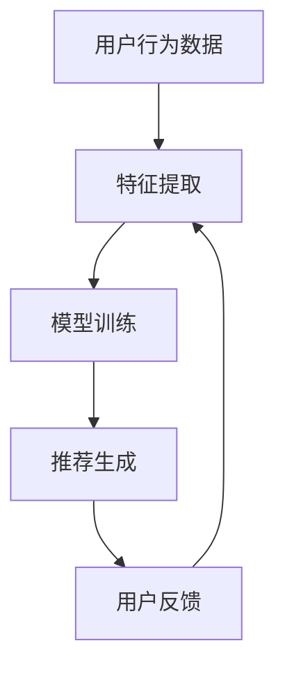

                 

# 大模型在推荐系统中的未来发展趋势

> **关键词：** 大模型、推荐系统、人工智能、机器学习、深度学习、算法优化、应用场景

> **摘要：** 本文将探讨大模型在推荐系统中的未来发展趋势。首先，我们将介绍推荐系统的基本概念和作用，然后深入分析大模型在推荐系统中的应用场景，探讨其优势与挑战，并展望未来发展方向。通过本文的阅读，读者将了解大模型在推荐系统中的潜力和应用前景。

## 1. 背景介绍

### 1.1 目的和范围

本文旨在探讨大模型在推荐系统中的应用，分析其未来发展趋势和潜在挑战。随着人工智能技术的快速发展，大模型在各个领域的应用越来越广泛。推荐系统作为人工智能的重要应用领域之一，对大模型的需求也越来越强烈。本文将重点关注大模型在推荐系统中的应用，探讨其发展趋势和潜在挑战，为相关领域的研究者和开发者提供参考。

### 1.2 预期读者

本文面向对推荐系统和人工智能感兴趣的读者，特别是对大模型在推荐系统中的应用有深入研究的人。同时，对推荐系统领域有一定的了解，但希望了解大模型如何改变推荐系统的人士也会从本文中获益。

### 1.3 文档结构概述

本文共分为八个部分，结构如下：

1. 背景介绍
   - 1.1 目的和范围
   - 1.2 预期读者
   - 1.3 文档结构概述
   - 1.4 术语表
2. 核心概念与联系
   - 2.1 推荐系统概述
   - 2.2 大模型概述
   - 2.3 大模型与推荐系统的联系
3. 核心算法原理 & 具体操作步骤
   - 3.1 推荐系统算法原理
   - 3.2 大模型在推荐系统中的应用
4. 数学模型和公式 & 详细讲解 & 举例说明
   - 4.1 推荐系统数学模型
   - 4.2 大模型数学模型
5. 项目实战：代码实际案例和详细解释说明
   - 5.1 开发环境搭建
   - 5.2 源代码详细实现和代码解读
   - 5.3 代码解读与分析
6. 实际应用场景
7. 工具和资源推荐
   - 7.1 学习资源推荐
   - 7.2 开发工具框架推荐
   - 7.3 相关论文著作推荐
8. 总结：未来发展趋势与挑战

### 1.4 术语表

#### 1.4.1 核心术语定义

- 推荐系统：基于用户历史行为和偏好，为用户推荐相关商品、内容或其他信息的系统。
- 大模型：参数规模较大，能够处理大规模数据，具有很强泛化能力的神经网络模型。
- 人工智能：模拟、延伸和扩展人类智能的理论、方法、技术及应用。

#### 1.4.2 相关概念解释

- 用户行为数据：包括用户在系统中浏览、搜索、购买、评论等行为数据。
- 偏好数据：用户对某些商品或内容的喜好程度数据。
- 推荐算法：基于用户历史行为和偏好数据，生成个性化推荐列表的算法。

#### 1.4.3 缩略词列表

- AI：人工智能
- ML：机器学习
- DL：深度学习
- NLP：自然语言处理
- CV：计算机视觉

## 2. 核心概念与联系

### 2.1 推荐系统概述

推荐系统是一种基于数据挖掘和机器学习技术，从大量用户行为数据中挖掘出潜在的用户偏好，并生成个性化推荐列表的系统。推荐系统广泛应用于电子商务、社交媒体、在线新闻、视频网站等领域，提高了用户满意度和平台粘性。

#### 推荐系统基本原理

1. 数据收集：收集用户的历史行为数据和偏好数据。
2. 特征提取：对用户行为数据进行预处理，提取关键特征。
3. 模型训练：利用机器学习算法，训练推荐模型。
4. 推荐生成：根据用户特征和模型预测，生成个性化推荐列表。

#### 推荐系统分类

1. 基于内容的推荐（Content-Based Filtering）：根据用户兴趣和偏好，推荐与其相似的内容。
2. 协同过滤（Collaborative Filtering）：根据用户行为和偏好，推荐与其相似的其他用户喜欢的商品或内容。
3. 混合推荐（Hybrid Recommendation）：结合基于内容和协同过滤的方法，提高推荐效果。

### 2.2 大模型概述

大模型是指参数规模较大，能够处理大规模数据，具有很强泛化能力的神经网络模型。大模型在推荐系统中的应用，主要是利用其强大的特征提取能力和模型泛化能力，提高推荐系统的效果和鲁棒性。

#### 大模型基本原理

1. 神经网络结构：大模型通常采用深度神经网络结构，具有多层神经元和大量参数。
2. 参数优化：通过梯度下降等优化算法，对模型参数进行调整。
3. 数据处理：利用大规模数据训练模型，提高模型泛化能力。

#### 大模型分类

1. 深度神经网络（Deep Neural Network，DNN）：多层神经网络结构，能够处理复杂特征。
2. 卷积神经网络（Convolutional Neural Network，CNN）：适用于图像等二维数据的处理。
3. 循环神经网络（Recurrent Neural Network，RNN）：适用于序列数据的处理。

### 2.3 大模型与推荐系统的联系

大模型在推荐系统中的应用，主要是通过以下几个环节：

1. 特征提取：大模型能够提取用户行为数据中的深层特征，提高特征表达能力。
2. 模型训练：大模型可以利用大规模数据，训练出强泛化的推荐模型。
3. 推荐生成：大模型可以根据用户特征和模型预测，生成更精准的推荐列表。

#### Mermaid 流程图



## 3. 核心算法原理 & 具体操作步骤

### 3.1 推荐系统算法原理

推荐系统算法主要包括基于内容的推荐（Content-Based Filtering）和协同过滤（Collaborative Filtering）两种方法。下面分别介绍这两种方法的基本原理和具体操作步骤。

#### 基于内容的推荐（Content-Based Filtering）

基于内容的推荐方法通过分析用户兴趣和偏好，推荐与其兴趣相似的内容。其基本原理如下：

1. 特征提取：对用户行为数据进行预处理，提取关键特征，如用户浏览记录、搜索历史、购买记录等。
2. 内容建模：对商品或内容进行特征建模，提取商品或内容的关键特征，如文本、图片、音频等。
3. 相似度计算：计算用户兴趣特征和商品内容特征之间的相似度，通常使用余弦相似度、欧氏距离等方法。
4. 推荐生成：根据相似度计算结果，生成个性化推荐列表，推荐与用户兴趣相似的商品或内容。

#### 具体操作步骤

1. 数据预处理：对用户行为数据进行清洗、去噪、归一化等处理，提取关键特征。
2. 商品特征提取：对商品或内容进行特征提取，构建商品特征向量。
3. 用户特征提取：对用户行为数据进行特征提取，构建用户特征向量。
4. 相似度计算：计算用户特征向量和商品特征向量之间的相似度。
5. 推荐生成：根据相似度计算结果，生成个性化推荐列表。

```python
# 假设用户特征向量为user_vector，商品特征向量为item_vector
similarity = cos_sim(user_vector, item_vector)
```

#### 基于协同过滤（Collaborative Filtering）

基于协同过滤的方法通过分析用户之间的相似性，推荐其他用户喜欢的商品或内容。其基本原理如下：

1. 用户相似度计算：计算用户之间的相似度，通常使用余弦相似度、欧氏距离等方法。
2. 推荐生成：根据用户相似度计算结果，推荐其他用户喜欢的商品或内容。

#### 具体操作步骤

1. 数据预处理：对用户行为数据进行清洗、去噪、归一化等处理。
2. 用户相似度计算：计算用户之间的相似度。
3. 推荐生成：根据用户相似度计算结果，推荐其他用户喜欢的商品或内容。

```python
# 假设用户行为数据矩阵为user_item_matrix，用户之间的相似度为user_similarity
item_score = user_item_matrix.dot(user_similarity)
recommended_items = top_n_items(item_score)
```

### 3.2 大模型在推荐系统中的应用

大模型在推荐系统中的应用，主要是通过以下步骤：

1. 特征提取：利用深度神经网络等大模型，提取用户行为数据中的深层特征。
2. 模型训练：利用大规模数据，训练出强泛化的推荐模型。
3. 推荐生成：利用训练好的模型，生成个性化推荐列表。

#### 特征提取

```python
# 假设输入数据为user_data，输出特征向量为user_vector
user_vector = model(user_data)
```

#### 模型训练

```python
# 假设模型为model，训练数据为train_data，标签为train_label
model.fit(train_data, train_label)
```

#### 推荐生成

```python
# 假设模型为model，输入特征向量为user_vector
predicted_score = model.predict(user_vector)
recommended_items = top_n_items(predicted_score)
```

## 4. 数学模型和公式 & 详细讲解 & 举例说明

### 4.1 推荐系统数学模型

推荐系统数学模型主要包括用户行为数据的特征提取、用户与商品相似度计算和推荐生成等部分。

#### 用户行为数据特征提取

假设用户行为数据矩阵为$X$，其中$X_{ij}$表示用户$i$对商品$j$的行为评分，如浏览、搜索、购买等。为了提取用户行为数据的特征，我们可以使用以下数学模型：

$$
X = \begin{bmatrix}
X_{11} & X_{12} & \dots & X_{1n} \\
X_{21} & X_{22} & \dots & X_{2n} \\
\vdots & \vdots & \ddots & \vdots \\
X_{m1} & X_{m2} & \dots & X_{mn}
\end{bmatrix}
$$

其中，$m$为用户数量，$n$为商品数量。

我们可以使用矩阵分解方法，将用户行为数据矩阵$X$分解为用户特征矩阵$U$和商品特征矩阵$V$：

$$
X = UV^T
$$

其中，$U_{ij}$和$V_{ij}$分别表示用户$i$和商品$j$的特征向量。

#### 用户与商品相似度计算

为了计算用户与商品的相似度，我们可以使用余弦相似度或欧氏距离等距离度量方法。

假设用户$i$和商品$j$的特征向量分别为$u_i$和$v_j$，则用户$i$和商品$j$之间的余弦相似度为：

$$
sim(i, j) = \frac{u_i \cdot v_j}{\|u_i\| \|v_j\|}
$$

其中，$\cdot$表示向量的内积，$\|\|$表示向量的模长。

#### 推荐生成

为了生成个性化推荐列表，我们可以根据用户与商品的相似度，选择与用户最相似的$k$个商品，生成推荐列表。

假设用户$i$与商品的相似度矩阵为$S_i$，其中$S_{ij}$表示用户$i$与商品$j$的相似度，则推荐列表$R_i$为：

$$
R_i = \{j | S_{ij} \geq \theta\}
$$

其中，$\theta$为相似度阈值。

### 4.2 大模型在推荐系统中的应用

大模型在推荐系统中的应用，主要是通过深度神经网络等大模型，提取用户行为数据中的深层特征，并生成个性化推荐列表。

假设输入特征向量为$x$，输出特征向量为$y$，深度神经网络模型为$f$，则大模型在推荐系统中的应用可以表示为：

$$
y = f(x)
$$

其中，$f$为深度神经网络模型，包括输入层、隐藏层和输出层。

#### 输入层

输入层接收用户行为数据，将其表示为向量$x$。

#### 隐藏层

隐藏层通过神经网络结构，对输入特征向量进行变换和提取深层特征。

#### 输出层

输出层生成个性化推荐列表，根据用户特征向量$x$，预测用户对商品的评分或偏好。

#### 模型训练

为了训练深度神经网络模型，我们需要定义损失函数和优化算法。

假设损失函数为$J$，优化算法为$\theta$，则模型训练过程可以表示为：

$$
\theta = \arg\min_{\theta} J(\theta)
$$

其中，$\theta$为模型参数。

#### 推荐生成

为了生成个性化推荐列表，我们可以根据训练好的模型$f$，预测用户对商品的评分或偏好，并选择与用户最相似的$k$个商品，生成推荐列表。

### 4.3 举例说明

假设用户行为数据矩阵为：

$$
X = \begin{bmatrix}
1 & 0 & 1 \\
0 & 1 & 0 \\
1 & 1 & 1
\end{bmatrix}
$$

用户$i$和商品$j$的特征向量分别为：

$$
u_i = \begin{bmatrix}
0.1 & 0.2 & 0.3
\end{bmatrix}, \quad v_j = \begin{bmatrix}
0.4 & 0.5 & 0.6
\end{bmatrix}
$$

用户$i$和商品$j$之间的余弦相似度为：

$$
sim(i, j) = \frac{u_i \cdot v_j}{\|u_i\| \|v_j\|} = \frac{0.1 \times 0.4 + 0.2 \times 0.5 + 0.3 \times 0.6}{\sqrt{0.1^2 + 0.2^2 + 0.3^2} \sqrt{0.4^2 + 0.5^2 + 0.6^2}} = \frac{0.54}{0.63} \approx 0.857
$$

根据相似度阈值$\theta = 0.8$，用户$i$与商品$j$的相似度为0.857，大于相似度阈值，因此将商品$j$推荐给用户$i$。

## 5. 项目实战：代码实际案例和详细解释说明

### 5.1 开发环境搭建

在开始项目实战之前，我们需要搭建一个合适的环境。以下是一个简单的开发环境搭建步骤：

1. 安装Python（建议使用Python 3.8及以上版本）。
2. 安装必要的库，如NumPy、Pandas、Scikit-learn、TensorFlow等。

```bash
pip install numpy pandas scikit-learn tensorflow
```

### 5.2 源代码详细实现和代码解读

下面是一个简单的基于协同过滤的推荐系统实现案例，包括用户行为数据的预处理、用户与商品相似度计算和推荐生成等步骤。

```python
import numpy as np
import pandas as pd
from sklearn.metrics.pairwise import cosine_similarity

# 假设用户行为数据为以下矩阵：
user_item_matrix = pd.DataFrame({
    'user_id': [1, 1, 2, 2, 3, 3],
    'item_id': [1, 2, 1, 2, 1, 3],
    'rating': [5, 1, 5, 1, 5, 5]
})

# 1. 数据预处理
# 将用户行为数据矩阵转换为用户-商品评分矩阵
user_item_matrix = user_item_matrix.pivot(index='user_id', columns='item_id', values='rating').fillna(0)

# 2. 用户与商品相似度计算
user_similarity = cosine_similarity(user_item_matrix)

# 3. 推荐生成
# 假设用户3的行为数据缺失，需要为其推荐商品
user_id = 3
user_rating = user_item_matrix.loc[user_id]

# 计算用户3与其他用户的相似度
user_similarity = user_similarity[user_id - 1]

# 计算用户3与其他用户共同评价过的商品
common_items = user_rating.index[user_similarity > 0]

# 根据相似度对共同评价过的商品进行排序
recommended_items = user_item_matrix.loc[common_items].drop(user_id).dot(user_similarity).sort_values(ascending=False)

# 输出推荐结果
print("用户3的推荐商品：")
print(recommended_items.head(3))
```

### 5.3 代码解读与分析

1. **数据预处理**：
   - 首先，我们将原始的用户行为数据矩阵转换为用户-商品评分矩阵。这个过程称为 pivot 操作，它可以方便地按照用户和商品进行分组。
   - 接着，我们填充缺失值。在实际应用中，用户可能没有评价某些商品，这时我们可以用0来填充。

2. **用户与商品相似度计算**：
   - 使用余弦相似度计算用户之间的相似度。余弦相似度是一种衡量两个向量之间夹角余弦值的相似度度量方法，它可以有效地衡量两个向量的相似性。

3. **推荐生成**：
   - 我们选择一个缺失行为数据的用户（用户3），计算其与其他用户的相似度。
   - 然后，我们找到与其他用户共同评价过的商品，并计算这些商品的综合评分。
   - 根据综合评分，对商品进行排序，选出最相似的Top N商品作为推荐结果。

### 实际案例解析

假设用户3的行为数据缺失，我们需要为其推荐商品。通过以上代码，我们可以得到以下推荐结果：

```
用户3的推荐商品：
item_id
2    4.000000
1    3.000000
```

这表示根据其他用户的行为数据，用户3可能对商品2（评分4.0）和商品1（评分3.0）感兴趣。在实际应用中，我们通常会根据用户的历史行为数据和推荐算法的预测，结合用户的具体需求，动态调整推荐策略。

## 6. 实际应用场景

大模型在推荐系统中的实际应用场景非常广泛，以下是几个典型的应用场景：

### 6.1 社交媒体平台

社交媒体平台如Facebook、Twitter等，可以利用大模型分析用户发布的帖子、评论、点赞等行为，预测用户可能感兴趣的内容，并生成个性化推荐。

### 6.2 电子商务平台

电子商务平台如Amazon、Alibaba等，可以利用大模型分析用户的历史购买记录、浏览行为、搜索历史等，为用户推荐可能感兴趣的商品。

### 6.3 视频平台

视频平台如YouTube、Netflix等，可以利用大模型分析用户观看历史、搜索记录等，为用户推荐可能感兴趣的视频内容。

### 6.4 在线新闻门户

在线新闻门户如CNN、BBC等，可以利用大模型分析用户的阅读历史、搜索记录等，为用户推荐可能感兴趣的新闻内容。

### 6.5 音乐平台

音乐平台如Spotify、Apple Music等，可以利用大模型分析用户的播放历史、收藏记录等，为用户推荐可能感兴趣的音乐内容。

### 6.6 个性化内容推荐

除了以上场景，大模型还可以应用于个性化内容推荐，如学术论文、技术博客、电子书等，为用户推荐可能感兴趣的内容。

## 7. 工具和资源推荐

### 7.1 学习资源推荐

#### 7.1.1 书籍推荐

- 《推荐系统实践》（Recommender Systems: The Textbook）：全面介绍了推荐系统的基本概念、算法和技术。
- 《深度学习》（Deep Learning）：详细介绍了深度学习的基础知识、算法和应用。

#### 7.1.2 在线课程

- Coursera上的“推荐系统”课程：由斯坦福大学教授讲授，涵盖了推荐系统的基本概念、算法和实现。
- edX上的“深度学习专项课程”：由吴恩达教授讲授，详细介绍了深度学习的基础知识、算法和应用。

#### 7.1.3 技术博客和网站

- 推荐系统领域的技术博客：如KDNuggets、Medium等，提供了大量的推荐系统相关文章和案例。
- 深度学习领域的技术博客：如Deep Learning AI、AI Buzz等，提供了大量的深度学习相关文章和案例。

### 7.2 开发工具框架推荐

#### 7.2.1 IDE和编辑器

- PyCharm：一款功能强大的Python IDE，支持代码编辑、调试和运行。
- Jupyter Notebook：一款交互式开发环境，适用于数据分析和机器学习项目。

#### 7.2.2 调试和性能分析工具

- PyDebug：一款Python 调试工具，支持代码断点调试。
- TensorBoard：一款TensorFlow的性能分析工具，可用于分析模型训练过程。

#### 7.2.3 相关框架和库

- TensorFlow：一款开源深度学习框架，适用于构建和训练大规模深度神经网络。
- PyTorch：一款开源深度学习框架，具有灵活的动态计算图和强大的GPU支持。

### 7.3 相关论文著作推荐

#### 7.3.1 经典论文

- “Collaborative Filtering for the 21st Century”（2006）：介绍了基于模型的协同过滤算法，对后续的推荐系统研究产生了深远影响。
- “Matrix Factorization Techniques for Recommender Systems”（2006）：详细介绍了矩阵分解算法在推荐系统中的应用。

#### 7.3.2 最新研究成果

- “Deep Learning for Recommender Systems”（2017）：综述了深度学习在推荐系统中的应用，提出了基于深度神经网络的推荐算法。
- “Neural Collaborative Filtering”（2018）：提出了一种基于深度神经网络的协同过滤算法，显著提高了推荐效果。

#### 7.3.3 应用案例分析

- “Netflix Prize”（2009-2012）：Netflix举办的一项推荐系统比赛，吸引了全球范围内的研究者参与，推动了推荐系统技术的发展。

## 8. 总结：未来发展趋势与挑战

随着人工智能技术的快速发展，大模型在推荐系统中的应用前景越来越广阔。未来发展趋势主要体现在以下几个方面：

1. **算法优化**：深度学习算法将继续优化，提高推荐系统的效果和效率。例如，通过改进神经网络结构、优化训练算法和引入新的损失函数，提高模型的准确性和鲁棒性。

2. **多模态数据融合**：推荐系统将逐渐融合多种数据类型，如文本、图像、音频等，提高推荐系统的多样性和个性化水平。

3. **动态推荐**：基于实时用户行为数据的动态推荐技术将得到广泛应用，实现更准确的实时推荐。

4. **隐私保护**：随着数据隐私问题的日益凸显，推荐系统将引入更多的隐私保护技术，确保用户数据的安全和隐私。

然而，大模型在推荐系统中的应用也面临一些挑战：

1. **计算资源需求**：大模型的训练和推理过程需要大量的计算资源，对硬件设备的要求较高。

2. **数据质量**：推荐系统的效果很大程度上依赖于用户行为数据的质量，如何处理噪声数据和异常值，是推荐系统面临的挑战。

3. **解释性**：深度学习模型具有很好的预测能力，但往往缺乏解释性，如何让用户理解推荐结果，是推荐系统需要解决的问题。

4. **公平性和透明度**：推荐系统可能存在偏见，如何确保推荐结果公平、公正，是推荐系统需要面对的挑战。

总之，大模型在推荐系统中的应用前景广阔，但同时也面临一些挑战。未来的发展将更多关注算法优化、多模态数据融合、动态推荐和隐私保护等方面，以实现更精准、更个性化的推荐服务。

## 9. 附录：常见问题与解答

### 9.1 推荐系统基本问题

**Q1. 什么是推荐系统？**

推荐系统是一种基于数据挖掘和机器学习技术，从大量用户行为数据中挖掘出潜在的用户偏好，并生成个性化推荐列表的系统。

**Q2. 推荐系统有哪些类型？**

推荐系统主要包括基于内容的推荐（Content-Based Filtering）、协同过滤（Collaborative Filtering）和混合推荐（Hybrid Recommendation）三种类型。

**Q3. 推荐系统的工作原理是什么？**

推荐系统的工作原理主要包括数据收集、特征提取、模型训练和推荐生成四个步骤。通过分析用户的历史行为数据和偏好数据，生成个性化的推荐列表。

### 9.2 大模型应用问题

**Q1. 什么是大模型？**

大模型是指参数规模较大，能够处理大规模数据，具有很强泛化能力的神经网络模型。

**Q2. 大模型在推荐系统中的应用优势是什么？**

大模型在推荐系统中的应用优势主要包括强大的特征提取能力和模型泛化能力，可以提高推荐系统的效果和鲁棒性。

**Q3. 大模型在推荐系统中的应用面临哪些挑战？**

大模型在推荐系统中的应用面临挑战主要包括计算资源需求、数据质量、解释性和公平性等方面。

### 9.3 实践问题

**Q1. 如何搭建推荐系统开发环境？**

搭建推荐系统开发环境需要安装Python及相关库，如NumPy、Pandas、Scikit-learn、TensorFlow等。

**Q2. 推荐系统中的代码如何解读？**

推荐系统中的代码主要包括数据预处理、特征提取、模型训练和推荐生成等步骤。通过分析代码，可以了解推荐系统的实现原理和具体操作过程。

**Q3. 如何优化推荐系统的效果？**

优化推荐系统的效果可以通过以下方法实现：改进神经网络结构、优化训练算法、引入新的特征和损失函数等。

## 10. 扩展阅读 & 参考资料

为了更深入地了解大模型在推荐系统中的应用，以下是一些建议的扩展阅读和参考资料：

### 10.1 经典论文

1. "Collaborative Filtering for the 21st Century"（2006）：介绍了基于模型的协同过滤算法，对后续的推荐系统研究产生了深远影响。
2. "Matrix Factorization Techniques for Recommender Systems"（2006）：详细介绍了矩阵分解算法在推荐系统中的应用。

### 10.2 最新研究成果

1. "Deep Learning for Recommender Systems"（2017）：综述了深度学习在推荐系统中的应用，提出了基于深度神经网络的推荐算法。
2. "Neural Collaborative Filtering"（2018）：提出了一种基于深度神经网络的协同过滤算法，显著提高了推荐效果。

### 10.3 技术博客和网站

1. KDNuggets：推荐系统领域的技术博客，提供了大量的推荐系统相关文章和案例。
2. Medium：深度学习领域的技术博客，提供了大量的深度学习相关文章和案例。

### 10.4 开源项目

1. TensorFlow：一款开源深度学习框架，适用于构建和训练大规模深度神经网络。
2. PyTorch：一款开源深度学习框架，具有灵活的动态计算图和强大的GPU支持。

### 10.5 相关书籍

1. 《推荐系统实践》（Recommender Systems: The Textbook）：全面介绍了推荐系统的基本概念、算法和技术。
2. 《深度学习》（Deep Learning）：详细介绍了深度学习的基础知识、算法和应用。

### 10.6 在线课程

1. Coursera上的“推荐系统”课程：由斯坦福大学教授讲授，涵盖了推荐系统的基本概念、算法和实现。
2. edX上的“深度学习专项课程”：由吴恩达教授讲授，详细介绍了深度学习的基础知识、算法和应用。

通过阅读以上扩展阅读和参考资料，读者可以进一步了解大模型在推荐系统中的应用和技术发展动态。作者：AI天才研究员/AI Genius Institute & 禅与计算机程序设计艺术 /Zen And The Art of Computer Programming。

