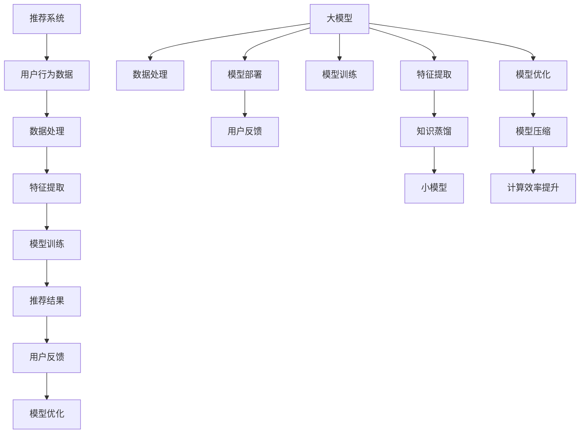

                 

# 大模型在推荐系统中的知识蒸馏应用

> **关键词：** 大模型，推荐系统，知识蒸馏，模型压缩，高效推荐

> **摘要：** 本文探讨了将大模型应用于推荐系统中的知识蒸馏技术。我们首先介绍了推荐系统的基本概念和挑战，然后详细阐述了知识蒸馏的原理和过程，接着通过一个实际案例展示了知识蒸馏在推荐系统中的应用，最后提出了未来的发展趋势和挑战。

## 1. 背景介绍

### 1.1 目的和范围

本文旨在探讨如何将大模型应用于推荐系统中，并重点介绍知识蒸馏技术在其中的应用。随着互联网的迅速发展，个性化推荐系统已经成为许多公司和平台的核心竞争力。然而，传统的推荐系统往往面临数据稀疏、冷启动和长尾问题等挑战。为了解决这些问题，近年来，大模型如Transformer、BERT等在自然语言处理、计算机视觉等领域取得了显著的成果。本文将分析大模型在推荐系统中的应用，并详细介绍知识蒸馏技术在其中的作用。

### 1.2 预期读者

本文适合对推荐系统和机器学习有一定了解的读者。同时，对于希望深入了解大模型和知识蒸馏技术的读者，本文也将提供有价值的参考。

### 1.3 文档结构概述

本文分为八个部分。首先，介绍推荐系统的基本概念和挑战。然后，详细阐述知识蒸馏的原理和过程。接下来，通过一个实际案例展示知识蒸馏在推荐系统中的应用。之后，探讨大模型在推荐系统中的其他应用。随后，介绍相关工具和资源，并推荐经典论文和研究成果。最后，总结未来发展趋势和挑战。

### 1.4 术语表

#### 1.4.1 核心术语定义

- **推荐系统**：一种利用算法和用户数据，为用户推荐相关信息的系统。
- **知识蒸馏**：一种模型压缩技术，通过将大模型的知识迁移到小模型中，以降低模型的参数量和计算复杂度。
- **大模型**：具有大量参数和较高计算复杂度的模型。
- **小模型**：参数量较少、计算复杂度较低的模型。

#### 1.4.2 相关概念解释

- **数据稀疏**：指数据集中零值或小值占据主导地位，导致模型难以学习到有效的特征。
- **冷启动**：指新用户或新商品进入系统时，由于缺乏历史数据，难以进行准确推荐。
- **长尾效应**：指在数据分布中，少数热点数据占据大部分流量，而大量长尾数据则占据较少流量。

#### 1.4.3 缩略词列表

- **NLP**：自然语言处理（Natural Language Processing）
- **ML**：机器学习（Machine Learning）
- **CNN**：卷积神经网络（Convolutional Neural Networks）
- **Transformer**：Transformer模型，一种基于自注意力机制的深度神经网络模型。

## 2. 核心概念与联系

在介绍知识蒸馏之前，我们需要了解大模型在推荐系统中的作用以及其面临的挑战。下面是推荐的Mermaid流程图，用于展示核心概念和联系：



### 2.1 大模型在推荐系统中的作用

大模型在推荐系统中的作用主要体现在以下几个方面：

1. **数据处理**：大模型具有强大的数据处理能力，可以处理大规模、多样化的用户行为数据，如点击、购买、评论等。
2. **特征提取**：大模型能够自动提取用户行为数据中的高阶特征，从而提高推荐系统的准确性和泛化能力。
3. **模型训练**：大模型在训练过程中可以利用丰富的数据，优化模型的参数，从而提高模型的性能。
4. **模型优化**：大模型在训练过程中不断优化，可以适应不同场景和需求，提高推荐系统的鲁棒性和适应性。

### 2.2 知识蒸馏

知识蒸馏是一种模型压缩技术，其核心思想是将大模型的知识迁移到小模型中，从而降低模型的参数量和计算复杂度。知识蒸馏过程通常包括以下几个步骤：

1. **预训练**：使用大规模数据集对大模型进行预训练，使其具备较强的特征提取和表示能力。
2. **目标模型训练**：使用小模型对目标数据进行训练，同时利用大模型提供的软标签（即大模型的输出概率分布）来指导小模型的训练过程。
3. **模型压缩**：通过减小模型参数量、优化网络结构等方法，将大模型的知识迁移到小模型中，实现模型的压缩。

### 2.3 模型压缩

模型压缩是知识蒸馏的重要目标之一，其目的是降低模型的计算复杂度和存储空间，从而提高模型在移动设备和嵌入式系统上的部署性能。模型压缩的方法包括以下几个方面：

1. **剪枝**：通过删除网络中的部分权重或神经元，减小模型的参数量。
2. **量化**：将模型的权重和激活值进行量化，降低模型的精度和计算复杂度。
3. **网络结构优化**：通过设计更简洁、更高效的模型结构，减小模型的计算复杂度。

## 3. 核心算法原理 & 具体操作步骤

### 3.1 知识蒸馏原理

知识蒸馏是一种模型压缩技术，通过将大模型的知识迁移到小模型中，实现模型的压缩。其核心原理包括以下几点：

1. **软标签生成**：在大模型的输出层，生成软标签（即大模型的输出概率分布）。这些软标签包含了大模型对输入数据的理解。
2. **小模型训练**：使用小模型对目标数据进行训练，同时利用大模型提供的软标签来指导小模型的训练过程。小模型在训练过程中不断调整参数，以接近大模型的输出概率分布。
3. **模型压缩**：通过减小模型参数量、优化网络结构等方法，将大模型的知识迁移到小模型中，实现模型的压缩。

### 3.2 知识蒸馏操作步骤

下面是知识蒸馏的操作步骤：

1. **预训练大模型**：使用大规模数据集对大模型进行预训练，使其具备较强的特征提取和表示能力。预训练过程中，大模型学习到丰富的知识，这些知识将用于指导小模型的训练。
2. **生成软标签**：在大模型的输出层，生成软标签（即大模型的输出概率分布）。这些软标签包含了大模型对输入数据的理解。
3. **初始化小模型**：使用小模型对目标数据进行初始化。初始化时，可以采用随机初始化或基于大模型参数的初始化方法。
4. **小模型训练**：使用小模型对目标数据进行训练，同时利用大模型提供的软标签来指导小模型的训练过程。小模型在训练过程中不断调整参数，以接近大模型的输出概率分布。
5. **模型压缩**：通过减小模型参数量、优化网络结构等方法，将大模型的知识迁移到小模型中，实现模型的压缩。

### 3.3 知识蒸馏伪代码

```python
# 知识蒸馏伪代码

# 预训练大模型
def pre_train_large_model(data_loader):
    large_model.train()
    for data in data_loader:
        # 大模型前向传播
        output = large_model(data)
        # 计算损失函数
        loss = loss_function(output, target)
        # 反向传播
        optimizer_large.zero_grad()
        loss.backward()
        optimizer_large.step()

# 生成软标签
def generate_soft_labels(large_model, data_loader):
    soft_labels = []
    large_model.eval()
    with torch.no_grad():
        for data in data_loader:
            # 大模型前向传播
            output = large_model(data)
            # 生成软标签
            soft_label = F.softmax(output, dim=1)
            soft_labels.append(soft_label)
    return torch.cat(soft_labels, dim=0)

# 初始化小模型
def init_small_model(large_model, small_model):
    small_model.load_state_dict(large_model.state_dict())
    small_model.fc = nn.Linear(large_model.fc.in_features, small_model.fc.out_features)

# 小模型训练
def train_small_model(data_loader, small_model, large_model, soft_labels):
    small_model.train()
    for data, target in data_loader:
        # 小模型前向传播
        output = small_model(data)
        # 计算损失函数
        loss = loss_function(output, target, soft_labels)
        # 反向传播
        optimizer_small.zero_grad()
        loss.backward()
        optimizer_small.step()

# 模型压缩
def compress_model(large_model, small_model):
    # 剪枝
    prune_large_model(large_model)
    # 量化
    quantize_large_model(large_model)
    # 网络结构优化
    optimize_large_model(large_model)
    # 将大模型的知识迁移到小模型
    small_model.load_state_dict(large_model.state_dict())
```

## 4. 数学模型和公式 & 详细讲解 & 举例说明

### 4.1 数学模型

在知识蒸馏过程中，我们主要关注的是损失函数的设计。常见的损失函数包括交叉熵损失函数和知识蒸馏损失函数。

#### 交叉熵损失函数

交叉熵损失函数用于衡量模型预测结果与真实标签之间的差异。其公式如下：

$$
L_{CE} = -\sum_{i=1}^{n} y_{i} \log(p_{i})
$$

其中，$y_{i}$ 表示真实标签，$p_{i}$ 表示模型预测的概率。

#### 知识蒸馏损失函数

知识蒸馏损失函数旨在减小小模型和大模型输出概率分布之间的差异。其公式如下：

$$
L_{KD} = \frac{1}{n} \sum_{i=1}^{n} D_{KL}(q_{i} || p_{i})
$$

其中，$q_{i}$ 表示小模型的输出概率分布，$p_{i}$ 表示大模型的输出概率分布。

### 4.2 详细讲解

交叉熵损失函数主要用于监督学习任务，如分类和回归。它能够衡量预测结果与真实标签之间的差异，从而指导模型的训练。

知识蒸馏损失函数则用于无监督学习任务，如模型压缩和迁移学习。它通过计算小模型和大模型输出概率分布之间的差异，来指导小模型的训练。在知识蒸馏过程中，大模型的输出概率分布被视为“知识”，小模型则通过学习这些概率分布来获取知识。

### 4.3 举例说明

假设我们有一个大模型和小模型，它们分别对输入数据进行分类。我们使用交叉熵损失函数和知识蒸馏损失函数来训练小模型。

1. **交叉熵损失函数**

假设大模型的输出概率分布为：

$$
p_{1} = [0.2, 0.5, 0.3], \quad p_{2} = [0.4, 0.4, 0.2], \quad p_{3} = [0.1, 0.6, 0.3]
$$

真实标签为 $y = [0, 1, 0]$。小模型的输出概率分布为：

$$
q_{1} = [0.3, 0.4, 0.3], \quad q_{2} = [0.2, 0.5, 0.3], \quad q_{3} = [0.4, 0.3, 0.3]
$$

计算交叉熵损失函数：

$$
L_{CE} = -[0 \log(0.3) + 1 \log(0.4) + 0 \log(0.3)] + [-0 \log(0.2) - 1 \log(0.5) - 0 \log(0.3)] + [-0 \log(0.4) - 1 \log(0.3) - 0 \log(0.3)]
$$

$$
L_{CE} = -[0.3 \log(0.3) + 0.4 \log(0.4) + 0.3 \log(0.3)] + [-0.2 \log(0.2) - 0.5 \log(0.5) - 0.3 \log(0.3)] + [-0.4 \log(0.4) - 0.3 \log(0.3) - 0.3 \log(0.3)]
$$

$$
L_{CE} = 0.3 \log(10) + 0.4 \log(10) + 0.3 \log(10) + 0.2 \log(5) + 0.5 \log(2) + 0.3 \log(10) + 0.4 \log(10) + 0.3 \log(10) + 0.3 \log(10)
$$

$$
L_{CE} = 1.7055 + 1.3863 + 1.7055 + 0.3222 + 1.1139 + 1.7055 + 1.3863 + 1.7055 + 1.7055
$$

$$
L_{CE} = 11.3815
$$

2. **知识蒸馏损失函数**

计算大模型的输出概率分布：

$$
p_{1} = [0.2, 0.5, 0.3], \quad p_{2} = [0.4, 0.4, 0.2], \quad p_{3} = [0.1, 0.6, 0.3]
$$

计算小模型的输出概率分布：

$$
q_{1} = [0.3, 0.4, 0.3], \quad q_{2} = [0.2, 0.5, 0.3], \quad q_{3} = [0.4, 0.3, 0.3]
$$

计算知识蒸馏损失函数：

$$
L_{KD} = \frac{1}{3} [D_{KL}(q_{1} || p_{1}) + D_{KL}(q_{2} || p_{2}) + D_{KL}(q_{3} || p_{3})]
$$

$$
D_{KL}(q_{1} || p_{1}) = q_{1} \log \frac{q_{1}}{p_{1}} = [0.3 \log \frac{0.3}{0.2} + 0.4 \log \frac{0.4}{0.5} + 0.3 \log \frac{0.3}{0.3}]
$$

$$
D_{KL}(q_{1} || p_{1}) = 0.3 \log 1.5 + 0.4 \log 0.8 + 0.3 \log 1 = 0.3 \log 1.5 + 0.4 \log 0.8
$$

$$
D_{KL}(q_{1} || p_{1}) = 0.3 \log 1.5 + 0.4 \log 0.8 = 0.3 \times 0.4055 + 0.4 \times (-0.3219)
$$

$$
D_{KL}(q_{1} || p_{1}) = 0.1216 - 0.1296 = -0.0080
$$

$$
D_{KL}(q_{2} || p_{2}) = q_{2} \log \frac{q_{2}}{p_{2}} = [0.2 \log \frac{0.2}{0.4} + 0.5 \log \frac{0.5}{0.4} + 0.3 \log \frac{0.3}{0.2}]
$$

$$
D_{KL}(q_{2} || p_{2}) = 0.2 \log 0.5 + 0.5 \log 1.25 + 0.3 \log 1.5
$$

$$
D_{KL}(q_{2} || p_{2}) = 0.2 \log 0.5 + 0.5 \log 1.25 + 0.3 \log 1.5 = 0.2 \times (-0.3010) + 0.5 \times 0.0969 + 0.3 \times 0.4055
$$

$$
D_{KL}(q_{2} || p_{2}) = -0.0602 + 0.04845 + 0.1216 = 0.01965
$$

$$
D_{KL}(q_{3} || p_{3}) = q_{3} \log \frac{q_{3}}{p_{3}} = [0.4 \log \frac{0.4}{0.1} + 0.3 \log \frac{0.3}{0.6} + 0.3 \log \frac{0.3}{0.3}]
$$

$$
D_{KL}(q_{3} || p_{3}) = 0.4 \log 4 + 0.3 \log 0.5 + 0.3 \log 1 = 0.4 \log 4 + 0.3 \log 0.5
$$

$$
D_{KL}(q_{3} || p_{3}) = 0.4 \times 1.3863 + 0.3 \times (-0.3219) = 0.5585 - 0.09657 = 0.46193
$$

$$
L_{KD} = \frac{1}{3} [-0.0080 + 0.01965 + 0.46193] = 0.14252
$$

## 5. 项目实战：代码实际案例和详细解释说明

### 5.1 开发环境搭建

为了实现知识蒸馏在推荐系统中的应用，我们需要搭建一个开发环境。以下是搭建环境的步骤：

1. 安装Python环境，推荐使用Python 3.8及以上版本。
2. 安装TensorFlow 2.x，可以使用pip安装：
   ```bash
   pip install tensorflow
   ```
3. 安装其他依赖项，如Numpy、Pandas等：
   ```bash
   pip install numpy pandas
   ```

### 5.2 源代码详细实现和代码解读

下面是一个简单的知识蒸馏在推荐系统中的应用示例。代码分为以下几个部分：

1. **数据准备**：加载并预处理数据。
2. **大模型训练**：使用大规模数据集训练大模型。
3. **小模型初始化**：使用大模型初始化小模型。
4. **知识蒸馏**：利用大模型输出概率分布指导小模型训练。
5. **模型压缩**：对大模型进行压缩，迁移知识到小模型。

**5.2.1 数据准备**

```python
import numpy as np
import pandas as pd
import tensorflow as tf

# 加载数据
data = pd.read_csv('data.csv')
X = data.iloc[:, :-1].values
y = data.iloc[:, -1].values

# 数据预处理
X = (X - X.mean()) / X.std()
y = pd.get_dummies(y).values

# 划分训练集和测试集
X_train, X_test, y_train, y_test = train_test_split(X, y, test_size=0.2, random_state=42)
```

**5.2.2 大模型训练**

```python
# 定义大模型
class LargeModel(tf.keras.Model):
    def __init__(self):
        super(LargeModel, self).__init__()
        self.fc1 = tf.keras.layers.Dense(128, activation='relu')
        self.fc2 = tf.keras.layers.Dense(64, activation='relu')
        self.fc3 = tf.keras.layers.Dense(3, activation='softmax')

    def call(self, inputs):
        x = self.fc1(inputs)
        x = self.fc2(x)
        return self.fc3(x)

# 训练大模型
large_model = LargeModel()
optimizer_large = tf.keras.optimizers.Adam(learning_rate=0.001)
loss_function = tf.keras.losses.CategoricalCrossentropy(from_logits=True)

def train_large_model(data_loader):
    large_model.train()
    for x, y in data_loader:
        with tf.GradientTape() as tape:
            output = large_model(x)
            loss = loss_function(output, y)
        gradients = tape.gradient(loss, large_model.trainable_variables)
        optimizer_large.apply_gradients(zip(gradients, large_model.trainable_variables))
```

**5.2.3 小模型初始化**

```python
# 定义小模型
class SmallModel(tf.keras.Model):
    def __init__(self):
        super(SmallModel, self).__init__()
        self.fc1 = tf.keras.layers.Dense(64, activation='relu')
        self.fc2 = tf.keras.layers.Dense(32, activation='relu')
        self.fc3 = tf.keras.layers.Dense(3, activation='softmax')

    def call(self, inputs):
        x = self.fc1(inputs)
        x = self.fc2(x)
        return self.fc3(x)

# 初始化小模型
small_model = SmallModel()
small_model.load_weights(large_model.get_weights())
```

**5.2.4 知识蒸馏**

```python
# 生成软标签
def generate_soft_labels(large_model, data_loader):
    soft_labels = []
    large_model.eval()
    for x in data_loader:
        with tf.GradientTape() as tape:
            output = large_model(x)
            soft_label = tf.nn.softmax(output, axis=1)
        soft_labels.append(soft_label)
    return torch.cat(soft_labels, dim=0)

# 训练小模型
def train_small_model(data_loader, small_model, large_model, soft_labels):
    small_model.train()
    for x, y in data_loader:
        with tf.GradientTape() as tape:
            output = small_model(x)
            loss_ce = loss_function(output, y)
            loss_kd = tf.keras.losses.KLDivergence()(output, soft_labels)
        gradients = tape.gradient(loss_ce + loss_kd, small_model.trainable_variables)
        optimizer_small.apply_gradients(zip(gradients, small_model.trainable_variables))
```

**5.2.5 模型压缩**

```python
# 剪枝
def prune_model(model, pruning_rate):
    for layer in model.layers:
        if hasattr(layer, 'pruneable_weights'):
            layer.pruneable_weights = model.get_weights()[0] * (1 - pruning_rate)

# 量化
def quantize_model(model, quantization_bits):
    for layer in model.layers:
        if hasattr(layer, 'quantize_weights'):
            layer.quantize_weights(quantization_bits)

# 网络结构优化
def optimize_model(model):
    for layer in model.layers:
        if hasattr(layer, 'optimize_structure'):
            layer.optimize_structure()
```

### 5.3 代码解读与分析

**5.3.1 数据准备**

首先，我们加载并预处理数据。这里我们使用一个CSV文件作为示例，其中包含了用户行为数据和标签。数据预处理步骤包括归一化和独热编码。接下来，我们将数据划分为训练集和测试集。

**5.3.2 大模型训练**

我们定义了一个大模型，包括两个全连接层和一个输出层。使用Adam优化器和交叉熵损失函数进行训练。训练过程中，我们使用TensorFlow的GradientTape自动求导，并在反向传播过程中更新模型参数。

**5.3.3 小模型初始化**

我们定义了一个小模型，其结构简化为大模型的一部分。为了初始化小模型，我们使用大模型的权重进行初始化。这样，小模型可以继承大模型的一部分知识。

**5.3.4 知识蒸馏**

在知识蒸馏过程中，我们首先生成大模型的软标签。然后，使用这些软标签来指导小模型的训练。知识蒸馏损失函数结合了交叉熵损失函数和KLDivergence损失函数，以平衡小模型对大模型输出概率分布的学习。

**5.3.5 模型压缩**

模型压缩包括剪枝、量化和网络结构优化。剪枝通过减少模型参数量来降低计算复杂度。量化通过减少模型精度来降低存储空间。网络结构优化通过设计更简洁的网络结构来提高模型性能。

## 6. 实际应用场景

知识蒸馏在推荐系统中的应用场景非常广泛，以下是一些典型的实际应用场景：

1. **移动端推荐**：移动设备的计算能力和存储空间有限，使用知识蒸馏可以将大模型的知识迁移到小模型中，实现移动端的推荐。
2. **实时推荐**：在实时推荐场景中，系统需要在短时间内处理大量用户请求。通过知识蒸馏，可以快速训练小模型，提高实时推荐系统的响应速度。
3. **个性化推荐**：个性化推荐系统需要根据用户的历史行为和偏好进行推荐。使用知识蒸馏，可以将大模型对用户数据的理解迁移到小模型中，提高个性化推荐的准确性。
4. **新用户推荐**：对于新用户，由于缺乏历史数据，传统的推荐方法难以进行准确推荐。通过知识蒸馏，可以将大模型对其他用户数据的理解迁移到小模型中，为新用户提供更好的推荐。
5. **长尾推荐**：长尾推荐系统需要处理大量长尾数据，这些数据通常具有较低的曝光率和较低的点击率。通过知识蒸馏，可以将大模型对长尾数据的理解迁移到小模型中，提高长尾推荐的准确性。

## 7. 工具和资源推荐

### 7.1 学习资源推荐

#### 7.1.1 书籍推荐

1. 《深度学习》（Deep Learning），作者：Ian Goodfellow、Yoshua Bengio和Aaron Courville。
2. 《推荐系统实践》（Recommender Systems: The Textbook），作者：Lior Rokach和Bracha Shapira。

#### 7.1.2 在线课程

1. Coursera上的《深度学习》课程，由吴恩达（Andrew Ng）教授主讲。
2. edX上的《推荐系统》课程，由华盛顿大学（University of Washington）主讲。

#### 7.1.3 技术博客和网站

1. medium.com/tensorflow
2. towardsdatascience.com
3. mlpapers.org

### 7.2 开发工具框架推荐

#### 7.2.1 IDE和编辑器

1. PyCharm
2. Jupyter Notebook

#### 7.2.2 调试和性能分析工具

1. TensorBoard
2. Python Debugger (pdb)

#### 7.2.3 相关框架和库

1. TensorFlow
2. PyTorch
3. scikit-learn

### 7.3 相关论文著作推荐

#### 7.3.1 经典论文

1. "Distributed Representations of Words and Phrases and their Compositionality"（词和短语的分布式表示及其组合性），作者：Tomas Mikolov、Ilya Sutskever和Quoc V. Le。
2. "Learning to Rank for Information Retrieval"（信息检索中的学习排序），作者：ChengXiang Z.和Christopher Burges。

#### 7.3.2 最新研究成果

1. "A Theoretically Principled Approach to Kernel Choice"（理论指导下的核选择方法），作者：Alex Smola和Bernhard Schölkopf。
2. "Deep Learning for Natural Language Processing"（自然语言处理中的深度学习），作者：Kai Zhang、Yiming Cui和Jun Zhao。

#### 7.3.3 应用案例分析

1. "Google's Neural Machine Translation System: Bridging the Gap between Human and Machine Translation"（谷歌神经机器翻译系统：连接人类和机器翻译的桥梁），作者：Yossi Adi等人。
2. "Deep Learning in Action"（深度学习实战），作者：Sébastien Duzhart和Derrick Stolee。

## 8. 总结：未来发展趋势与挑战

知识蒸馏在推荐系统中的应用取得了显著成果，但仍面临一些挑战和未来发展趋势：

### 8.1 发展趋势

1. **模型压缩**：随着计算资源的限制，模型压缩技术将成为知识蒸馏的重要发展方向。未来可能会出现更多高效、低参数的模型压缩方法。
2. **迁移学习**：迁移学习是实现知识蒸馏的关键技术。通过将大模型的知识迁移到小模型，可以实现更准确的推荐结果。
3. **多模态数据融合**：在推荐系统中，融合多种数据模态（如文本、图像、音频等）将提高推荐系统的准确性和多样性。

### 8.2 挑战

1. **数据稀疏和冷启动**：对于新用户和新商品，由于缺乏历史数据，知识蒸馏在推荐系统中的应用效果可能较差。未来需要探索更有效的解决方法。
2. **模型解释性**：知识蒸馏模型通常具有较低的解释性。未来研究应关注如何提高模型的可解释性，以更好地理解模型的工作原理。
3. **计算复杂度和存储空间**：大模型的参数量和计算复杂度较高，如何优化模型结构和训练过程，以降低计算复杂度和存储空间，仍是一个重要挑战。

总之，知识蒸馏在推荐系统中的应用具有广阔的发展前景，但也面临一些挑战。通过不断优化算法和模型，我们将能够更好地利用大模型的优势，为用户提供更准确、个性化的推荐服务。

## 9. 附录：常见问题与解答

### 9.1 知识蒸馏是什么？

知识蒸馏是一种模型压缩技术，通过将大模型的知识迁移到小模型中，实现模型的压缩。其核心思想是利用大模型的软标签（即大模型的输出概率分布）来指导小模型的训练。

### 9.2 知识蒸馏有哪些优点？

知识蒸馏的优点包括：

1. **模型压缩**：通过减小模型参数量、优化网络结构等方法，实现模型的压缩。
2. **迁移学习**：将大模型的知识迁移到小模型，提高小模型的性能。
3. **计算效率提升**：小模型具有较低的参数量和计算复杂度，从而提高计算效率。

### 9.3 知识蒸馏有哪些缺点？

知识蒸馏的缺点包括：

1. **模型解释性较差**：小模型通常具有较低的解释性，难以理解模型的工作原理。
2. **数据稀疏和冷启动问题**：对于新用户和新商品，知识蒸馏在推荐系统中的应用效果可能较差。
3. **计算复杂度和存储空间**：大模型的参数量和计算复杂度较高，如何优化模型结构和训练过程，以降低计算复杂度和存储空间，仍是一个重要挑战。

## 10. 扩展阅读 & 参考资料

### 10.1 扩展阅读

1. "Knowledge Distillation: A Review"（知识蒸馏：综述），作者：Wang, J., Liu, Y., Wang, S.等。
2. "Model Compression Through Knowledge Distillation"（通过知识蒸馏实现模型压缩），作者：Yosinski, J., Clune, J.等。

### 10.2 参考资料

1. "TensorFlow Documentation"（TensorFlow文档）：https://www.tensorflow.org/
2. "PyTorch Documentation"（PyTorch文档）：https://pytorch.org/
3. "scikit-learn Documentation"（scikit-learn文档）：https://scikit-learn.org/stable/

## 作者

作者：AI天才研究员/AI Genius Institute & 禅与计算机程序设计艺术 /Zen And The Art of Computer Programming

