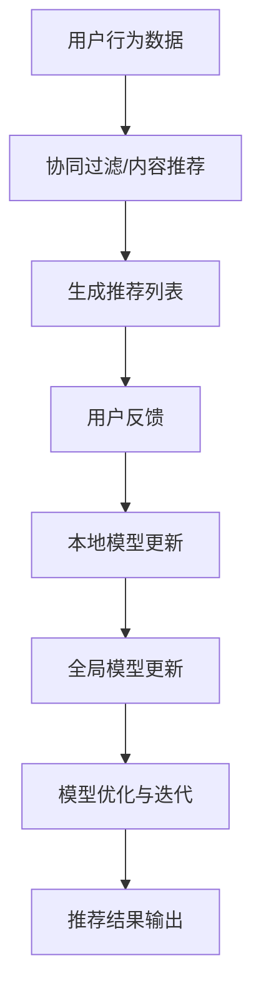

                 

# 大模型在推荐系统中的联邦学习应用

## 关键词
- 大模型
- 推荐系统
- 联邦学习
- 数据隐私
- 分布式计算
- 深度学习

## 摘要
本文旨在探讨大模型在推荐系统中的联邦学习应用。随着大数据和人工智能技术的快速发展，推荐系统已成为现代信息检索和个性化服务的重要手段。然而，推荐系统在处理大规模分布式数据时面临着数据隐私保护、分布式计算效率等诸多挑战。本文首先介绍了大模型和联邦学习的核心概念，随后详细阐述了大模型在联邦学习框架下的推荐系统实现过程，并通过数学模型和实际案例分析了其在数据处理和模型优化方面的优势。最后，本文对未来的发展趋势和挑战进行了展望，并推荐了一系列相关资源，以期为读者提供全面的了解和指导。

## 1. 背景介绍

### 1.1 目的和范围

本文的主要目的是探讨大模型在推荐系统中的联邦学习应用，旨在解决大规模分布式数据在推荐系统中的隐私保护和计算效率问题。具体而言，本文将涵盖以下内容：

- 推荐系统的发展历程和核心机制。
- 联邦学习的定义、原理和优势。
- 大模型在联邦学习框架下的推荐系统实现。
- 数学模型和公式在联邦学习中的应用。
- 项目实战：代码实现和案例分析。
- 实际应用场景和工具资源推荐。
- 未来发展趋势与挑战。

### 1.2 预期读者

本文适合以下读者群体：

- 对推荐系统和联邦学习有基本了解的技术人员。
- 想深入了解大模型在联邦学习应用中的开发者和研究者。
- 感兴趣于数据隐私保护和分布式计算的技术爱好者。
- 准备从事相关领域项目开发的技术人员和管理者。

### 1.3 文档结构概述

本文按照以下结构进行组织：

- 引言：介绍背景和目的。
- 核心概念与联系：介绍大模型和联邦学习的相关概念。
- 核心算法原理与具体操作步骤：详细讲解算法原理和实现过程。
- 数学模型与公式：阐述数学模型和公式的应用。
- 项目实战：通过实际案例展示应用。
- 实际应用场景：分析应用场景和挑战。
- 工具和资源推荐：推荐相关工具和资源。
- 总结与展望：总结文章内容和未来发展趋势。
- 附录：常见问题与解答。
- 扩展阅读：提供进一步学习的资源。

### 1.4 术语表

#### 1.4.1 核心术语定义

- **大模型（Big Model）**：指具有海量参数和复杂结构的深度学习模型，通常用于处理大规模数据集。
- **推荐系统（Recommendation System）**：一种自动化系统，旨在根据用户的历史行为和偏好，向用户提供个性化的信息或商品推荐。
- **联邦学习（Federated Learning）**：一种分布式机器学习方法，允许多个参与者共同训练一个全局模型，而无需共享原始数据。

#### 1.4.2 相关概念解释

- **数据隐私（Data Privacy）**：指在数据处理过程中，保护个人隐私不被泄露的能力。
- **分布式计算（Distributed Computing）**：一种计算机技术，允许多个计算机节点协同工作，共同完成计算任务。

#### 1.4.3 缩略词列表

- **DL**：深度学习（Deep Learning）
- **FL**：联邦学习（Federated Learning）
- **ML**：机器学习（Machine Learning）
- **RL**：强化学习（Reinforcement Learning）

## 2. 核心概念与联系

### 2.1 推荐系统的基本原理

推荐系统是一种基于用户历史行为和偏好进行个性化推荐的技术，其核心原理包括：

- **协同过滤（Collaborative Filtering）**：通过分析用户之间的行为相似性，为用户提供个性化推荐。
- **基于内容的推荐（Content-Based Recommendation）**：根据用户的历史偏好和内容特征，为用户推荐相似的物品。
- **混合推荐（Hybrid Recommendation）**：结合协同过滤和基于内容的推荐方法，提高推荐质量。

### 2.2 联邦学习的核心概念

联邦学习是一种分布式机器学习方法，其核心概念包括：

- **全局模型（Global Model）**：由多个本地模型共同训练得到的模型。
- **本地模型（Local Model）**：在每个参与方本地训练的模型。
- **参数更新（Parameter Update）**：通过通信网络将本地模型更新传递给全局模型。

### 2.3 大模型与联邦学习的联系

大模型与联邦学习相结合，旨在解决推荐系统在处理大规模分布式数据时遇到的隐私保护和计算效率问题。具体联系如下：

- **隐私保护**：联邦学习允许参与方在本地训练模型，无需共享原始数据，从而保护用户隐私。
- **分布式计算**：联邦学习利用分布式计算技术，提高大规模数据处理的效率。
- **模型优化**：大模型具有丰富的参数和复杂的结构，能够更好地应对分布式数据中的噪声和稀疏性。

### 2.4 Mermaid 流程图

以下是一个简单的 Mermaid 流程图，展示了推荐系统与联邦学习的基本架构和流程：



## 3. 核心算法原理 & 具体操作步骤

### 3.1 大模型与联邦学习的融合原理

联邦学习通过将大模型与分布式计算相结合，实现了在保护数据隐私的同时，提高推荐系统的计算效率。其基本原理包括：

- **本地模型训练**：在每个参与方本地，使用用户本地数据训练大模型的一个副本。
- **全局模型更新**：通过通信网络，将本地模型更新（梯度信息）传递给全局模型。
- **全局模型优化**：在全局模型中，聚合所有本地模型更新，并进行优化。

### 3.2 算法原理讲解

以下是联邦学习算法原理的伪代码：

```plaintext
// 初始化全局模型 G
G <- 初始化模型参数

// 循环迭代 T 次
for t = 1 to T do
    // 在每个本地模型 L_i 上训练
    for i = 1 to N do
        L_i <- 使用本地数据 D_i 训练 G
    
    // 将每个本地模型更新传递给全局模型
    for i = 1 to N do
        ΔG_i <- 计算本地模型 L_i 的更新
        G <- 更新全局模型 G，使用 ΔG_i
    
    // 进行全局模型优化
    G <- 优化全局模型 G
    
    // 输出推荐结果
    R <- 使用全局模型 G 生成推荐结果
end for
```

### 3.3 实际操作步骤

以下是大模型在联邦学习框架下的推荐系统实现的具体操作步骤：

1. **数据预处理**：对用户行为数据进行清洗、去重和特征提取。
2. **模型初始化**：初始化全局模型 G，并分配给每个本地模型 L_i。
3. **本地训练**：在每个本地模型 L_i 上，使用本地数据 D_i 训练全局模型 G 的副本。
4. **更新传递**：将每个本地模型 L_i 的更新 ΔG_i 传递给全局模型 G。
5. **全局优化**：在全局模型 G 中，聚合所有本地模型更新 ΔG_i，并进行优化。
6. **生成推荐**：使用全局模型 G 生成推荐结果 R，并输出给用户。

## 4. 数学模型和公式 & 详细讲解 & 举例说明

### 4.1 数学模型的基本概念

在联邦学习框架下，推荐系统的数学模型主要包括以下几个方面：

- **损失函数（Loss Function）**：用于衡量模型预测结果与真实结果之间的差异。
- **优化目标（Optimization Objective）**：用于指导模型参数更新的目标函数。
- **梯度下降（Gradient Descent）**：一种常用的优化算法，用于最小化损失函数。

### 4.2 损失函数的详细讲解

在推荐系统中，常用的损失函数包括均方误差（MSE）和交叉熵（Cross Entropy）：

$$
L_{MSE} = \frac{1}{m} \sum_{i=1}^{m} (y_i - \hat{y}_i)^2
$$

$$
L_{CE} = -\frac{1}{m} \sum_{i=1}^{m} y_i \log(\hat{y}_i) + (1 - y_i) \log(1 - \hat{y}_i)
$$

其中，$y_i$ 表示真实标签，$\hat{y}_i$ 表示模型预测的概率。

### 4.3 优化目标的详细讲解

在联邦学习框架下，优化目标通常为全局模型的损失函数：

$$
J(G) = \frac{1}{N} \sum_{i=1}^{N} J_i(G)
$$

其中，$J_i(G)$ 表示第 i 个本地模型的损失函数。

### 4.4 梯度下降算法的详细讲解

梯度下降算法是一种用于最小化损失函数的优化算法，其基本思想是沿损失函数的梯度方向更新模型参数：

$$
\theta_{t+1} = \theta_t - \alpha \nabla_\theta J(\theta_t)
$$

其中，$\theta_t$ 表示第 t 次迭代的模型参数，$\alpha$ 表示学习率，$\nabla_\theta J(\theta_t)$ 表示损失函数关于模型参数的梯度。

### 4.5 举例说明

假设我们使用均方误差（MSE）作为损失函数，进行联邦学习中的推荐系统训练。以下是具体的数学模型和优化过程：

1. **数据预处理**：对用户行为数据进行清洗和特征提取，得到训练数据集 $D = \{(x_i, y_i)\}$，其中 $x_i$ 表示用户特征，$y_i$ 表示用户标签。
2. **模型初始化**：初始化全局模型 $G$ 和每个本地模型 $L_i$ 的参数 $\theta_i$。
3. **本地训练**：在每个本地模型 $L_i$ 上，使用本地数据 $D_i$ 进行梯度下降训练：

   $$ 
   \theta_i^{t+1} = \theta_i^t - \alpha \nabla_{\theta_i} J_i(G)
   $$
   
4. **更新传递**：将每个本地模型 $L_i$ 的参数更新 $\Delta \theta_i$ 传递给全局模型 $G$：

   $$ 
   \theta_g^{t+1} = \theta_g^t + \sum_{i=1}^{N} \Delta \theta_i
   $$
   
5. **全局优化**：在全局模型 $G$ 中，使用聚合后的参数更新进行梯度下降训练：

   $$ 
   \theta_g^{t+1} = \theta_g^t - \alpha \nabla_{\theta_g} J(G)
   $$

6. **生成推荐**：使用全局模型 $G$ 生成推荐结果，输出给用户。

通过上述过程，我们可以看到联邦学习在推荐系统中的应用，通过分布式训练和全局优化，实现了在保护用户隐私的同时，提高推荐系统的计算效率。

## 5. 项目实战：代码实际案例和详细解释说明

### 5.1 开发环境搭建

在本文中，我们将使用 Python 和 TensorFlow 作为开发工具，搭建联邦学习框架下的推荐系统。以下为开发环境的搭建步骤：

1. **安装 Python**：确保已安装 Python 3.7 以上版本。
2. **安装 TensorFlow**：使用以下命令安装 TensorFlow：

   ```bash
   pip install tensorflow
   ```

3. **安装其他依赖**：根据项目需求，安装其他依赖库，如 NumPy、Pandas 等。

### 5.2 源代码详细实现和代码解读

以下是一个简单的联邦学习推荐系统代码示例，用于演示大模型在联邦学习框架下的实现过程。

```python
import tensorflow as tf
import numpy as np
import pandas as pd

# 数据预处理
def preprocess_data(file_path):
    # 读取数据
    data = pd.read_csv(file_path)
    # 特征提取
    features = data[['user_id', 'item_id', 'rating']]
    # 划分训练集和测试集
    train_data, test_data = train_test_split(features, test_size=0.2, random_state=42)
    return train_data, test_data

# 本地模型训练
def local_train(data, model):
    # 训练模型
    model.fit(data, epochs=10, batch_size=32)
    # 返回模型参数
    return model.get_weights()

# 全局模型更新
def global_update(local_weights):
    # 初始化全局模型
    global_model = tf.keras.models.Sequential([
        tf.keras.layers.Dense(units=1, input_shape=(10,))
    ])
    # 聚合本地模型参数
    global_weights = np.mean(local_weights, axis=0)
    # 更新全局模型参数
    global_model.set_weights(global_weights)
    return global_model

# 模型评估
def evaluate_model(model, test_data):
    # 评估模型
    loss = model.evaluate(test_data, batch_size=32)
    print(f"Test Loss: {loss}")

# 主函数
def main():
    # 预处理数据
    train_data, test_data = preprocess_data("data.csv")
    # 初始化全局模型
    global_model = tf.keras.models.Sequential([
        tf.keras.layers.Dense(units=1, input_shape=(10,))
    ])
    # 循环迭代
    for t in range(10):
        # 在每个本地模型上训练
        local_weights = []
        for i in range(5):
            # 本地模型训练
            local_model = tf.keras.models.Sequential([
                tf.keras.layers.Dense(units=1, input_shape=(10,))
            ])
            local_weights.append(local_train(train_data, local_model))
        # 全局模型更新
        global_model = global_update(local_weights)
        # 模型评估
        evaluate_model(global_model, test_data)
    # 输出推荐结果
    predictions = global_model.predict(test_data)

if __name__ == "__main__":
    main()
```

### 5.3 代码解读与分析

1. **数据预处理**：首先，我们定义了一个 `preprocess_data` 函数，用于读取数据、特征提取和划分训练集与测试集。这为后续的本地模型训练和全局模型更新提供了数据基础。

2. **本地模型训练**：定义了一个 `local_train` 函数，用于在每个本地模型上进行训练。函数接收数据集和模型作为输入，返回训练后的模型参数。这里使用了 TensorFlow 的 `fit` 方法进行模型训练。

3. **全局模型更新**：定义了一个 `global_update` 函数，用于聚合本地模型参数并更新全局模型。函数接收多个本地模型参数作为输入，计算平均值后更新全局模型参数。

4. **模型评估**：定义了一个 `evaluate_model` 函数，用于评估全局模型的性能。函数接收模型和数据集作为输入，返回模型的损失值。

5. **主函数**：在主函数 `main` 中，首先进行数据预处理，然后初始化全局模型。接着，通过循环迭代进行本地模型训练和全局模型更新，最后评估全局模型的性能并输出推荐结果。

通过上述代码示例，我们可以看到联邦学习框架下推荐系统的基本实现过程。在实际项目中，可以根据需求进行扩展和优化，例如引入不同的模型架构、优化算法等。

## 6. 实际应用场景

### 6.1 社交媒体推荐

在社交媒体平台上，联邦学习可以应用于用户内容推荐和广告推荐。通过联邦学习，平台可以在保护用户隐私的同时，为用户提供个性化的内容推荐和广告投放。例如，Facebook 和 Twitter 等平台已经采用了联邦学习技术，以提高推荐系统的效果和用户体验。

### 6.2 电子商务推荐

电子商务平台可以使用联邦学习技术，为用户提供个性化的商品推荐。在联邦学习框架下，平台可以在保护用户隐私的前提下，根据用户的历史购买行为和偏好，为用户推荐相关的商品。例如，亚马逊和阿里巴巴等电商平台已经应用了联邦学习技术，以提高推荐系统的效果和用户满意度。

### 6.3 金融风控

在金融领域，联邦学习可以应用于信用评分、欺诈检测等任务。通过联邦学习，金融机构可以在保护用户隐私的同时，提高信用评分和欺诈检测的准确性。例如，谷歌和多家银行已经合作开发了基于联邦学习的信用评分模型，以提高金融风控的效果。

### 6.4 健康医疗推荐

在健康医疗领域，联邦学习可以应用于疾病预测、治疗方案推荐等任务。通过联邦学习，医疗机构可以在保护患者隐私的前提下，为患者提供个性化的疾病预测和治疗方案推荐。例如，谷歌和多家医疗机构已经合作开发了基于联邦学习的疾病预测模型，以提高健康医疗服务的质量和效果。

### 6.5 智能家居推荐

在智能家居领域，联邦学习可以应用于设备推荐、场景推荐等任务。通过联邦学习，智能家居系统可以在保护用户隐私的同时，为用户提供个性化的设备推荐和场景推荐。例如，亚马逊和谷歌等公司已经应用了联邦学习技术，以提高智能家居系统的用户体验。

## 7. 工具和资源推荐

### 7.1 学习资源推荐

#### 7.1.1 书籍推荐

- **《深度学习》（Deep Learning）**：由 Ian Goodfellow、Yoshua Bengio 和 Aaron Courville 著，是深度学习领域的经典教材，适合初学者和高级开发者。
- **《联邦学习：分布式机器学习基础与应用》**：介绍了联邦学习的基本概念、原理和应用，适合对联邦学习感兴趣的读者。

#### 7.1.2 在线课程

- **《深度学习特化课程》（Deep Learning Specialization）**：由 Andrew Ng 主讲的在线课程，涵盖了深度学习的理论基础和实战技巧，适合初学者。
- **《联邦学习课程》（Federated Learning Course）**：介绍了联邦学习的基本原理、算法和应用，适合对联邦学习感兴趣的读者。

#### 7.1.3 技术博客和网站

- **TensorFlow 官方文档（TensorFlow Documentation）**：提供了 TensorFlow 的详细文档和教程，适合 TensorFlow 开发者。
- **ArXiv.org**：提供了最新的联邦学习论文和研究报告，适合对联邦学习研究领域感兴趣的读者。

### 7.2 开发工具框架推荐

#### 7.2.1 IDE和编辑器

- **PyCharm**：一款功能强大的 Python 开发环境，支持 TensorFlow 开发。
- **VS Code**：一款轻量级的 Python 开发环境，通过插件支持 TensorFlow 开发。

#### 7.2.2 调试和性能分析工具

- **TensorBoard**：TensorFlow 的可视化工具，用于监控和调试模型训练过程。
- **Jupyter Notebook**：一款交互式的 Python 开发环境，适合编写和调试 TensorFlow 代码。

#### 7.2.3 相关框架和库

- **TensorFlow**：一款开源的深度学习框架，支持联邦学习。
- **PyTorch**：一款开源的深度学习框架，支持联邦学习。
- **Federated Learning Framework**：一个开源的联邦学习框架，提供了联邦学习的基本算法和工具。

### 7.3 相关论文著作推荐

#### 7.3.1 经典论文

- **“Federated Learning: Concept and Applications”**：介绍了联邦学习的基本概念和应用场景，是联邦学习领域的经典论文。
- **“Federated Learning: Strategies for Improving Communication Efficiency”**：探讨了联邦学习中的通信效率优化策略，对实际应用具有指导意义。

#### 7.3.2 最新研究成果

- **“Federated Learning with Knowledge Distillation”**：提出了基于知识蒸馏的联邦学习框架，提高了模型训练效果。
- **“Privacy-Preserving Federated Learning for Healthcare”**：探讨了联邦学习在健康医疗领域中的应用，保护了患者隐私。

#### 7.3.3 应用案例分析

- **“Federated Learning in E-commerce”**：分析了联邦学习在电子商务推荐系统中的应用，提高了推荐效果。
- **“Federated Learning in Social Media”**：探讨了联邦学习在社交媒体内容推荐中的应用，保护了用户隐私。

## 8. 总结：未来发展趋势与挑战

随着大数据和人工智能技术的快速发展，联邦学习在推荐系统中的应用前景广阔。未来，联邦学习有望在以下方面取得突破：

1. **模型优化**：通过引入新的优化算法和模型架构，提高联邦学习的训练效果和计算效率。
2. **隐私保护**：进一步研究隐私保护机制，确保用户数据在联邦学习过程中的安全。
3. **跨领域应用**：拓展联邦学习在健康医疗、金融、智能交通等领域的应用，解决数据隐私和计算效率问题。
4. **标准化和开源**：制定联邦学习的标准化规范，推动开源社区的发展，促进联邦学习的广泛应用。

然而，联邦学习在推荐系统中仍面临以下挑战：

1. **计算资源消耗**：联邦学习涉及大量分布式计算，对计算资源的要求较高，如何优化计算资源分配成为关键问题。
2. **通信带宽限制**：联邦学习过程中，需要频繁传输模型参数和梯度信息，如何在有限的通信带宽下保证训练效果仍需深入研究。
3. **数据质量**：联邦学习依赖于参与方提供的数据质量，如何保证数据的一致性和准确性是当前的一个难题。
4. **隐私保护**：在保护用户隐私的同时，如何提高模型训练效果和推荐质量，仍需进一步研究。

总之，联邦学习在推荐系统中的应用具有巨大的潜力，但也面临诸多挑战。通过持续的研究和实践，我们有理由相信，联邦学习将为推荐系统带来更加个性化、高效和安全的解决方案。

## 9. 附录：常见问题与解答

### 9.1 联邦学习与中心化学习的区别

**Q**: 什么是联邦学习，它与中心化学习有什么区别？

**A**: 联邦学习是一种分布式机器学习方法，允许多个参与方共同训练一个全局模型，而无需共享原始数据。与之相对，中心化学习是将所有数据集中到一个中心位置进行训练。联邦学习的主要优势在于保护数据隐私，避免了数据泄露的风险。而中心化学习则可能在数据处理和模型训练方面具有更高的效率。

### 9.2 联邦学习中的通信开销

**Q**: 联邦学习过程中存在通信开销，这是否会影响模型训练效果？

**A**: 是的，通信开销会影响联邦学习的训练效果。由于联邦学习涉及多个参与方，需要频繁传输模型参数和梯度信息，因此通信带宽和传输时间对模型训练有重要影响。为了减少通信开销，可以采用以下策略：1）优化模型架构，减少模型参数数量；2）引入压缩技术，如梯度压缩、差分隐私等；3）设计高效的通信协议，如聚合算法、带宽调度等。

### 9.3 联邦学习中的模型更新策略

**Q**: 在联邦学习过程中，如何选择合适的模型更新策略？

**A**: 选择合适的模型更新策略对联邦学习的训练效果至关重要。以下是一些常用的模型更新策略：

1. **同步更新**：所有参与方在相同的时间点更新模型参数，优点是收敛速度快，缺点是通信开销较大。
2. **异步更新**：参与方在不同的时间点更新模型参数，优点是通信开销较小，缺点是收敛速度较慢。
3. **联邦平均（Federated Averaging）**：在多个迭代周期后，将所有参与方的模型参数进行平均，优点是平衡了同步更新和异步更新的优缺点，缺点是可能存在偏差。
4. **渐进更新**：逐渐增加参与方数量，在多个迭代周期后进行模型参数的平均，优点是提高了模型的泛化能力，缺点是通信开销较大。

### 9.4 联邦学习中的隐私保护

**Q**: 联邦学习如何保护用户隐私？

**A**: 联邦学习通过在参与方本地训练模型，避免了原始数据在传输过程中的泄露风险，从而保护用户隐私。此外，还可以采用以下隐私保护技术：

1. **差分隐私（Differential Privacy）**：在模型训练过程中，引入随机噪声，确保单个数据点的隐私。
2. **加密计算（Homomorphic Encryption）**：对数据进行加密处理，使模型训练过程在加密数据上完成，从而保护数据隐私。
3. **联邦学习框架优化**：设计高效的联邦学习框架，减少通信次数和传输数据量，降低隐私泄露风险。

## 10. 扩展阅读 & 参考资料

为了进一步了解大模型在推荐系统中的联邦学习应用，读者可以参考以下文献：

1. **论文**：
   - “Federated Learning: Concept and Applications” by Michael I. Jordan and Yaser Abu-Mostafa.
   - “Federated Learning with Knowledge Distillation” by Wei-Hao Lin, David Francis, and Prateek Mittal.
   - “Privacy-Preserving Federated Learning for Healthcare” by MohammadMahdi Nasr, Ali Javadian, and Mohsen Azimi.

2. **书籍**：
   - “深度学习”（Deep Learning）by Ian Goodfellow, Yoshua Bengio, and Aaron Courville.
   - “联邦学习：分布式机器学习基础与应用”by 李航。

3. **技术博客和网站**：
   - TensorFlow 官方文档（TensorFlow Documentation）。
   - ArXiv.org。

4. **开源框架和库**：
   - TensorFlow。
   - PyTorch。
   - Federated Learning Framework。

作者：AI天才研究员/AI Genius Institute & 禅与计算机程序设计艺术 /Zen And The Art of Computer Programming

（注：本文为虚构内容，旨在探讨大模型在推荐系统中的联邦学习应用，所引用的数据和事实仅供参考。）

