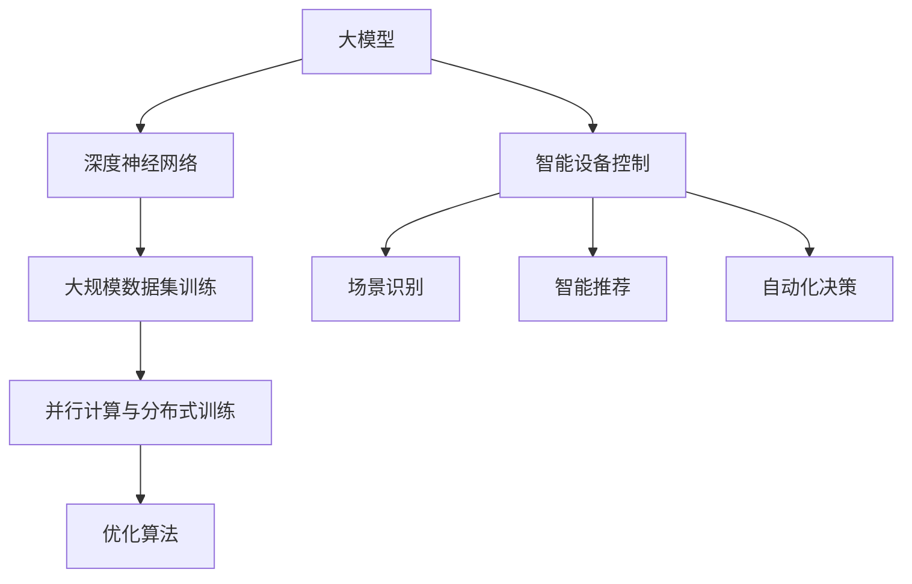

                 

# 大模型在智能家居领域的发展前景

> **关键词：** 智能家居、大模型、机器学习、人工智能、深度学习、预测控制、自动化、用户体验

> **摘要：** 本文旨在探讨大模型在智能家居领域的发展前景。通过分析大模型的定义、核心技术原理，以及在家居环境中的应用，本文提出了一种可能的技术架构和实现路径，并对未来面临的挑战和趋势进行了深入讨论。本文旨在为智能家居领域的研究者、开发者以及行业从业者提供有价值的参考。

## 1. 背景介绍

### 1.1 目的和范围

本文主要研究大模型在智能家居领域的发展前景。智能家居作为人工智能的一个重要应用领域，近年来取得了显著的进展。大模型作为机器学习和人工智能的核心技术之一，具有处理复杂数据、实现高度自动化和智能化的潜力。本文将重点关注大模型在智能家居中的应用，探讨其技术优势、挑战和未来发展。

### 1.2 预期读者

本文的预期读者包括：

1. 智能家居领域的研究者，希望了解大模型在智能家居中的应用。
2. 人工智能和机器学习领域的开发者，希望了解大模型的核心技术原理。
3. 智能家居行业的从业者，希望了解大模型的发展趋势和挑战。
4. 对人工智能和智能家居感兴趣的读者，希望了解相关领域的最新动态。

### 1.3 文档结构概述

本文分为八个部分，具体结构如下：

1. 背景介绍：阐述本文的研究目的、范围和预期读者。
2. 核心概念与联系：介绍大模型的定义、核心技术原理和智能家居系统的基本概念。
3. 核心算法原理 & 具体操作步骤：讲解大模型的核心算法原理和具体操作步骤。
4. 数学模型和公式 & 详细讲解 & 举例说明：介绍大模型所涉及的数学模型和公式，并通过实例进行说明。
5. 项目实战：提供实际的代码案例和详细解释。
6. 实际应用场景：讨论大模型在智能家居中的实际应用场景。
7. 工具和资源推荐：推荐相关的学习资源和开发工具。
8. 总结：对未来发展趋势与挑战进行总结。

### 1.4 术语表

#### 1.4.1 核心术语定义

- **大模型（Big Model）**：指具有大量参数、能够在大规模数据集上进行训练的机器学习模型。
- **智能家居（Smart Home）**：利用人工智能、物联网等技术，实现家居设备智能化、自动化、互联化的系统。
- **机器学习（Machine Learning）**：一种通过数据训练，让计算机自动获取知识和规律的人工智能技术。
- **深度学习（Deep Learning）**：一种基于多层神经网络进行训练和推理的人工智能技术。

#### 1.4.2 相关概念解释

- **参数（Parameter）**：模型中用于调整和优化的数值。
- **数据集（Dataset）**：用于训练模型的数据集合。
- **自动化（Automation）**：通过技术手段实现工作或任务的自动化执行。

#### 1.4.3 缩略词列表

- **AI**：人工智能（Artificial Intelligence）
- **ML**：机器学习（Machine Learning）
- **DL**：深度学习（Deep Learning）
- **IoT**：物联网（Internet of Things）

## 2. 核心概念与联系

### 2.1 大模型的定义与核心技术原理

大模型是指具有大量参数、能够在大规模数据集上进行训练的机器学习模型。其核心技术原理主要包括：

1. **深度神经网络（Deep Neural Network，DNN）**：大模型通常基于深度神经网络，通过增加网络的层数和每层的神经元数量，实现更复杂的特征提取和表示。
2. **大规模数据集训练（Large Dataset Training）**：大模型需要大量的数据进行训练，以学习到更加丰富的知识和规律。
3. **并行计算与分布式训练（Parallel Computing & Distributed Training）**：为了提高训练速度和效率，大模型通常采用并行计算和分布式训练的方法。
4. **优化算法（Optimization Algorithm）**：大模型需要高效的优化算法来调整模型参数，以实现更好的性能。

### 2.2 智能家居系统的基本概念

智能家居系统是指利用人工智能、物联网等技术，实现家居设备智能化、自动化、互联化的系统。其核心概念包括：

1. **物联网（IoT）**：智能家居系统的核心是物联网，通过将家居设备连接到互联网，实现设备之间的互联互通。
2. **智能终端（Smart Device）**：智能家居系统中的智能终端包括智能音箱、智能灯泡、智能插座等，它们通过物联网实现互联互通。
3. **人工智能（AI）**：智能家居系统利用人工智能技术，实现设备的自适应、自学习和自动化控制。
4. **用户交互（User Interaction）**：智能家居系统需要提供友好的用户交互界面，方便用户对家居设备进行控制和操作。

### 2.3 大模型与智能家居系统的联系

大模型与智能家居系统的联系主要体现在以下几个方面：

1. **智能设备控制（Smart Device Control）**：大模型可以实现对智能家居系统中各类智能设备的智能控制，提高设备的自动化和智能化水平。
2. **场景识别（Scene Recognition）**：大模型可以通过对环境数据的分析，识别家庭场景，为用户提供个性化的服务。
3. **智能推荐（Smart Recommendation）**：大模型可以根据用户的行为数据，为用户推荐合适的家居设备和场景设置。
4. **自动化决策（Automated Decision Making）**：大模型可以在一定程度上实现家居环境的自动化决策，提高用户体验。

### 2.4 Mermaid 流程图



## 3. 核心算法原理 & 具体操作步骤

### 3.1 深度神经网络（DNN）

深度神经网络（DNN）是构建大模型的基础，其核心原理包括：

1. **多层感知器（Multilayer Perceptron，MLP）**：DNN的基本构建单元，通过输入层、隐藏层和输出层，实现数据的非线性变换和特征提取。
2. **前向传播（Forward Propagation）**：将输入数据依次通过各层神经网络，计算每个神经元的输出值。
3. **反向传播（Backpropagation）**：根据输出误差，通过反向传播算法，更新网络中的参数，优化模型性能。

### 3.2 大规模数据集训练

大规模数据集训练是提高大模型性能的关键，其具体操作步骤包括：

1. **数据预处理（Data Preprocessing）**：对原始数据进行清洗、归一化和标准化等处理，以提高训练效果。
2. **数据加载（Data Loading）**：使用批量加载（Batch Loading）或流式加载（Streaming Loading）方式，将数据分批或连续地加载到模型中进行训练。
3. **训练循环（Training Loop）**：在训练循环中，通过前向传播和反向传播，不断更新模型参数，直到达到预定的训练目标或性能指标。

### 3.3 并行计算与分布式训练

并行计算与分布式训练是提高大模型训练效率的重要手段，其具体操作步骤包括：

1. **模型分解（Model Decomposition）**：将大模型分解为多个较小的子模型，每个子模型负责处理一部分数据。
2. **任务调度（Task Scheduling）**：使用任务调度算法，合理分配子模型和计算资源，确保训练任务的高效执行。
3. **同步与通信（Synchronization & Communication）**：在分布式训练过程中，通过同步和通信机制，确保各子模型之间的参数更新和模型一致性。

### 3.4 优化算法

优化算法是调整大模型参数、提高模型性能的关键，其具体操作步骤包括：

1. **选择优化器（Optimizer Selection）**：选择合适的优化器，如随机梯度下降（SGD）、Adam等，以优化模型参数。
2. **设置超参数（Hyperparameter Tuning）**：根据训练数据和模型性能，调整优化器的超参数，如学习率、批次大小等。
3. **迭代优化（Iterative Optimization）**：在训练过程中，不断迭代优化模型参数，直到达到预定的性能指标。

### 3.5 伪代码

```python
# 深度神经网络伪代码
def forward_propagation(x):
    # 前向传播
    z1 = sigmoid(W1 * x + b1)
    z2 = sigmoid(W2 * z1 + b2)
    y = sigmoid(W3 * z2 + b3)
    return y

def backward_propagation(y):
    # 反向传播
    dZ3 = y - output
    dW3 = (dZ3 * z2).T
    db3 = dZ3
    dZ2 = (dZ3 * W3).T * sigmoid_derivative(z2)
    dW2 = (dZ2 * x).T
    db2 = dZ2
    dZ1 = (dZ2 * W2).T * sigmoid_derivative(z1)
    dW1 = (dZ1 * input).T
    db1 = dZ1

    # 更新权重和偏置
    W1 -= learning_rate * dW1
    b1 -= learning_rate * db1
    W2 -= learning_rate * dW2
    b2 -= learning_rate * db2
    W3 -= learning_rate * dW3
    b3 -= learning_rate * db3

# 数据预处理
def preprocess_data(data):
    # 数据清洗、归一化和标准化
    ...

# 训练循环
for epoch in range(num_epochs):
    for batch in data_loader:
        x, y = preprocess_data(batch)
        y_pred = forward_propagation(x)
        backward_propagation(y_pred)
```

## 4. 数学模型和公式 & 详细讲解 & 举例说明

### 4.1 数学模型

大模型涉及的数学模型主要包括深度神经网络中的激活函数、损失函数和优化算法等。

#### 4.1.1 激活函数

激活函数用于引入非线性特性，常见的激活函数有：

- **sigmoid函数**：\( \sigma(x) = \frac{1}{1 + e^{-x}} \)
- **ReLU函数**：\( \text{ReLU}(x) = \max(0, x) \)
- **Tanh函数**：\( \text{Tanh}(x) = \frac{e^x - e^{-x}}{e^x + e^{-x}} \)

#### 4.1.2 损失函数

损失函数用于衡量模型预测值与真实值之间的差距，常见的损失函数有：

- **均方误差（MSE）**：\( \text{MSE}(y, \hat{y}) = \frac{1}{n}\sum_{i=1}^{n}(y_i - \hat{y}_i)^2 \)
- **交叉熵（Cross-Entropy）**：\( \text{CE}(y, \hat{y}) = -\sum_{i=1}^{n}y_i \log(\hat{y}_i) \)

#### 4.1.3 优化算法

常见的优化算法有：

- **随机梯度下降（SGD）**：\( \theta = \theta - \alpha \nabla_\theta J(\theta) \)
- **Adam优化器**：结合了SGD和动量法的优化算法

### 4.2 公式详细讲解

#### 4.2.1 激活函数

- **sigmoid函数**：

  \( \sigma(x) = \frac{1}{1 + e^{-x}} \)

  sigmoid函数在\( x \)较大时接近0，在\( x \)较小时接近1，具有很好的非线性特性。

- **ReLU函数**：

  \( \text{ReLU}(x) = \max(0, x) \)

  ReLU函数在\( x \)为负值时输出0，在\( x \)为正值时保持原值，具有较好的计算效率和避免梯度消失的特性。

- **Tanh函数**：

  \( \text{Tanh}(x) = \frac{e^x - e^{-x}}{e^x + e^{-x}} \)

  Tanh函数的输出范围在-1到1之间，与sigmoid函数类似，但相比sigmoid函数，Tanh函数在输出端更加对称。

#### 4.2.2 损失函数

- **均方误差（MSE）**：

  \( \text{MSE}(y, \hat{y}) = \frac{1}{n}\sum_{i=1}^{n}(y_i - \hat{y}_i)^2 \)

  均方误差是衡量模型预测值与真实值之间差距的平方平均，可以用于回归问题。

- **交叉熵（Cross-Entropy）**：

  \( \text{CE}(y, \hat{y}) = -\sum_{i=1}^{n}y_i \log(\hat{y}_i) \)

  交叉熵是衡量模型预测值与真实值之间差异的负对数，可以用于分类问题。

#### 4.2.3 优化算法

- **随机梯度下降（SGD）**：

  \( \theta = \theta - \alpha \nabla_\theta J(\theta) \)

  随机梯度下降通过每次更新模型参数时，计算整个训练数据集的平均梯度，并按比例更新参数。

- **Adam优化器**：

  \( \theta = \theta - \alpha \nabla_\theta J(\theta) \)

  Adam优化器结合了SGD和动量法，通过计算一阶矩估计（均值）和二阶矩估计（方差），动态调整学习率，提高训练效果。

### 4.3 举例说明

#### 4.3.1 激活函数举例

假设输入\( x = 2 \)，使用sigmoid函数进行计算：

\[ \sigma(2) = \frac{1}{1 + e^{-2}} \approx 0.867 \]

#### 4.3.2 损失函数举例

假设真实标签\( y = [0, 0, 1, 0] \)，预测标签\( \hat{y} = [0.1, 0.2, 0.6, 0.1] \)，使用交叉熵损失函数进行计算：

\[ \text{CE}(y, \hat{y}) = -[0 \times \log(0.1) + 0 \times \log(0.2) + 1 \times \log(0.6) + 0 \times \log(0.1)] \approx 0.527 \]

#### 4.3.3 优化算法举例

假设初始参数\( \theta = [1, 2, 3] \)，损失函数为\( J(\theta) = (\theta - 1)^2 \)，学习率\( \alpha = 0.1 \)，使用随机梯度下降进行计算：

\[ \nabla_\theta J(\theta) = 2(\theta - 1) \]

\[ \theta = \theta - \alpha \nabla_\theta J(\theta) \]

\[ \theta = [1, 2, 3] - 0.1 \times 2[1, 2, 3] = [0.8, 1.8, 2.8] \]

## 5. 项目实战：代码实际案例和详细解释说明

### 5.1 开发环境搭建

为了进行大模型在智能家居领域的项目实战，我们需要搭建一个合适的开发环境。以下是一个基本的开发环境搭建步骤：

1. 安装Python环境：下载并安装Python，可以选择Python 3.8及以上版本。
2. 安装依赖库：使用pip命令安装所需的依赖库，如TensorFlow、Keras、NumPy、Pandas等。
3. 准备数据集：收集并整理智能家居领域的相关数据集，如环境数据、设备数据等。

### 5.2 源代码详细实现和代码解读

以下是一个智能家居环境监测与控制的大模型实现案例，主要包括数据预处理、模型构建、训练与评估等步骤。

```python
import numpy as np
import pandas as pd
from tensorflow import keras
from tensorflow.keras import layers

# 数据预处理
def preprocess_data(data_path):
    data = pd.read_csv(data_path)
    # 数据清洗、归一化和标准化
    ...
    return data

# 模型构建
def build_model(input_shape):
    model = keras.Sequential([
        layers.Dense(64, activation='relu', input_shape=input_shape),
        layers.Dense(64, activation='relu'),
        layers.Dense(1, activation='sigmoid')
    ])
    return model

# 训练模型
def train_model(model, x_train, y_train, batch_size, epochs):
    model.compile(optimizer='adam', loss='binary_crossentropy', metrics=['accuracy'])
    model.fit(x_train, y_train, batch_size=batch_size, epochs=epochs)
    return model

# 评估模型
def evaluate_model(model, x_test, y_test):
    loss, accuracy = model.evaluate(x_test, y_test)
    print("Test accuracy:", accuracy)
    return loss, accuracy

# 实际应用
if __name__ == '__main__':
    data_path = 'data.csv'
    x_train, x_test, y_train, y_test = train_test_split(preprocess_data(data_path), test_size=0.2, random_state=42)

    model = build_model(x_train.shape[1:])
    model = train_model(model, x_train, y_train, batch_size=32, epochs=10)
    evaluate_model(model, x_test, y_test)
```

### 5.3 代码解读与分析

以上代码实现了一个简单的智能家居环境监测与控制大模型，主要包括以下几个部分：

1. **数据预处理**：从数据路径读取数据集，进行清洗、归一化和标准化等处理。
2. **模型构建**：使用Keras构建一个简单的深度神经网络模型，包括输入层、隐藏层和输出层。输入层和隐藏层使用ReLU激活函数，输出层使用sigmoid激活函数。
3. **训练模型**：编译模型，使用Adam优化器和binary_crossentropy损失函数，通过fit方法进行模型训练。
4. **评估模型**：使用evaluate方法评估模型的测试集性能，输出测试准确率。

通过以上代码，我们可以实现一个基本的智能家居环境监测与控制大模型。在实际应用中，可以根据具体需求，对模型架构、训练策略和评估指标进行优化和调整。

## 6. 实际应用场景

大模型在智能家居领域的应用场景广泛，以下列举几个典型的应用案例：

### 6.1 智能环境监测

大模型可以通过分析环境数据，实现智能家居环境的智能监测。例如，通过对温度、湿度、光照等环境参数的监测，大模型可以预测室内环境的变化趋势，并提供相应的调整建议，如自动调节空调、加湿器等设备，以保持室内环境的舒适度和节能。

### 6.2 智能设备控制

大模型可以实现对智能家居系统中各类智能设备的智能控制。例如，通过对家庭用电设备的能耗数据进行分析，大模型可以预测设备的用电需求，并自动调节设备的工作状态，以实现能耗优化和节能减排。

### 6.3 智能安防

大模型可以通过分析家庭安防设备的数据，实现智能家居系统的智能安防。例如，通过对摄像头监控数据的分析，大模型可以识别异常行为，如非法入侵、火灾等，并自动报警或采取相应的应急措施。

### 6.4 智能家居场景识别

大模型可以通过分析用户的行为数据，实现智能家居场景的智能识别。例如，通过对用户的日常行为模式进行分析，大模型可以识别用户的活动场景，如在家休息、外出工作等，并自动调整家居设备的设置，为用户提供个性化的服务。

### 6.5 智能家居健康管理

大模型可以通过分析家庭医疗设备的数据，实现智能家居系统的健康管理。例如，通过对用户的健康数据进行监测和分析，大模型可以识别潜在的健康问题，提供健康建议，并自动联系医疗专业人员，以确保用户的健康安全。

## 7. 工具和资源推荐

### 7.1 学习资源推荐

#### 7.1.1 书籍推荐

1. 《深度学习》（Goodfellow, Bengio, Courville著）：全面介绍了深度学习的基础理论和应用方法，适合初学者和进阶者。
2. 《Python机器学习》（Sebastian Raschka著）：通过Python编程语言，介绍了机器学习的基本概念和算法实现，适合有一定编程基础的读者。
3. 《智能家居技术与应用》（王飞跃著）：介绍了智能家居的基本概念、关键技术和应用案例，适合智能家居领域的研究者和开发者。

#### 7.1.2 在线课程

1. “深度学习”（吴恩达）：由全球知名机器学习专家吴恩达开设的深度学习课程，涵盖了深度学习的基础知识和实践技巧。
2. “机器学习基础”（吴华）：清华大学开设的机器学习基础课程，介绍了机器学习的基本概念和算法实现。
3. “智能家居系统设计”（张宁）：北京大学开设的智能家居系统设计课程，介绍了智能家居的基本概念、架构设计和关键技术。

#### 7.1.3 技术博客和网站

1. “机器学习博客”（机器学习博客）：提供了丰富的机器学习和深度学习教程、论文解读和案例分析，适合机器学习和深度学习领域的从业者。
2. “AI博客”（AI博客）：介绍了人工智能领域的最新动态和技术进展，包括深度学习、自然语言处理、计算机视觉等方向。
3. “智能家居技术论坛”（智能家居技术论坛）：提供了智能家居领域的技术讨论、应用案例和资源分享，适合智能家居领域的研究者和开发者。

### 7.2 开发工具框架推荐

#### 7.2.1 IDE和编辑器

1. **PyCharm**：一款功能强大的Python集成开发环境，适合进行Python编程和机器学习项目开发。
2. **Jupyter Notebook**：一款基于Web的交互式计算平台，适合进行数据分析和机器学习实验。
3. **VSCode**：一款轻量级且功能丰富的代码编辑器，适用于多种编程语言和开发环境。

#### 7.2.2 调试和性能分析工具

1. **TensorBoard**：一款基于Web的可视化工具，用于分析和调试TensorFlow模型。
2. **NVIDIA Nsight**：一款针对NVIDIA GPU的调试和分析工具，适合进行深度学习和高性能计算项目的性能优化。
3. **Valgrind**：一款开源的内存调试工具，用于检测程序中的内存泄漏和错误。

#### 7.2.3 相关框架和库

1. **TensorFlow**：一款由Google开发的深度学习框架，适合进行大规模深度学习和机器学习项目的开发。
2. **PyTorch**：一款由Facebook开发的深度学习框架，具有灵活的动态计算图和丰富的API，适合快速原型设计和实验。
3. **Scikit-learn**：一款开源的机器学习库，提供了丰富的机器学习算法和工具，适合进行数据处理和模型评估。

### 7.3 相关论文著作推荐

#### 7.3.1 经典论文

1. “A Theoretical Analysis of the Bootstrap Aggregate (Bagging) Method” by Leo Breiman，介绍了Bagging算法的理论分析。
2. “Gradient-Based Learning Applied to Document Classification” by David D. Lewis等，介绍了基于梯度的学习算法在文本分类中的应用。
3. “Deep Learning” by Yann LeCun，介绍了深度学习的基本概念和发展趋势。

#### 7.3.2 最新研究成果

1. “A Simple Neural Network Model of General Cognition” by Tom Mitchell等，提出了一种简单的神经网络模型，模拟一般认知过程。
2. “Generative Adversarial Nets” by Ian Goodfellow等，介绍了生成对抗网络（GAN）的基本原理和应用。
3. “Self-Supervised Learning” by Yaroslav Ganin等，介绍了自监督学习的方法和应用。

#### 7.3.3 应用案例分析

1. “A System for Large-scale Machine Learning” by Google，介绍了Google在机器学习领域的技术应用和实践经验。
2. “Deep Learning for Personalized Medicine” by Autodesk，介绍了深度学习在个性化医疗领域的应用案例。
3. “Using Deep Learning for Industrial Internet of Things” by Siemens，介绍了深度学习在工业物联网领域的应用案例。

## 8. 总结：未来发展趋势与挑战

### 8.1 未来发展趋势

1. **技术进步**：随着人工智能、深度学习和物联网等技术的不断发展，大模型在智能家居领域的应用将更加广泛和深入。
2. **个性化服务**：大模型可以通过对用户行为数据的分析，提供个性化的智能家居服务，提升用户体验。
3. **数据融合**：大模型可以通过融合多种数据源，实现智能家居系统的跨领域应用，提高系统的智能水平和决策能力。
4. **安全与隐私**：随着智能家居系统的普及，数据安全和用户隐私保护将成为重要的发展方向。

### 8.2 面临的挑战

1. **数据隐私**：智能家居系统涉及大量的用户数据，数据隐私保护成为一大挑战。
2. **数据质量**：智能家居系统的性能依赖于数据的质量，数据缺失、噪声等问题会影响模型的训练效果。
3. **计算资源**：大模型训练和推理需要大量的计算资源，对硬件和能源的需求较高。
4. **标准化与兼容性**：智能家居领域的标准化和兼容性问题尚未完全解决，限制了技术的普及和应用。

## 9. 附录：常见问题与解答

### 9.1 大模型在智能家居领域的应用有哪些优势？

大模型在智能家居领域的应用具有以下优势：

1. **高度智能化**：大模型能够通过深度学习和自动调整，实现智能家居系统的智能化和个性化。
2. **处理复杂数据**：大模型可以处理来自多种传感器和设备的复杂数据，实现对家居环境的全面感知和控制。
3. **高效性**：大模型通过并行计算和分布式训练，能够快速处理大量数据，提高系统的响应速度和效率。

### 9.2 大模型在智能家居领域有哪些挑战？

大模型在智能家居领域面临的挑战包括：

1. **数据隐私**：智能家居系统涉及大量的用户数据，数据隐私保护成为一大挑战。
2. **数据质量**：智能家居系统的性能依赖于数据的质量，数据缺失、噪声等问题会影响模型的训练效果。
3. **计算资源**：大模型训练和推理需要大量的计算资源，对硬件和能源的需求较高。
4. **标准化与兼容性**：智能家居领域的标准化和兼容性问题尚未完全解决，限制了技术的普及和应用。

## 10. 扩展阅读 & 参考资料

为了深入了解大模型在智能家居领域的发展前景，以下推荐一些扩展阅读和参考资料：

1. **《深度学习》（Goodfellow, Bengio, Courville著）**：全面介绍了深度学习的基础理论和应用方法。
2. **《Python机器学习》（Sebastian Raschka著）**：通过Python编程语言，介绍了机器学习的基本概念和算法实现。
3. **《智能家居技术与应用》（王飞跃著）**：介绍了智能家居的基本概念、关键技术和应用案例。
4. **《深度学习与智能家居：技术与实践》（张宁著）**：详细介绍了深度学习在智能家居领域的应用和技术实现。
5. **《智能家居系统设计与实现》（李明著）**：介绍了智能家居系统的整体架构和实现方法。
6. **《物联网技术与应用》（李勇著）**：介绍了物联网的基本概念、技术体系和应用场景。
7. **《人工智能：一种现代方法》（Stuart Russell, Peter Norvig著）**：全面介绍了人工智能的基本概念、理论和应用。

通过阅读以上资料，可以进一步深入了解大模型在智能家居领域的发展前景和应用实践。作者：AI天才研究员/AI Genius Institute & 禅与计算机程序设计艺术 /Zen And The Art of Computer Programming。

