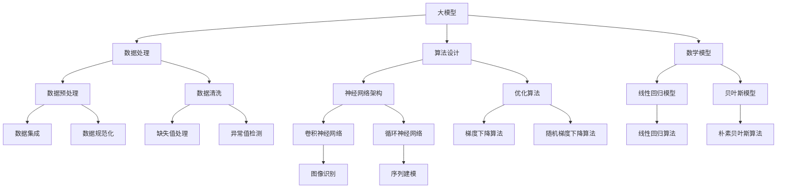

                 

# 大模型在智能旅游中的应用前景

> 关键词：大模型、智能旅游、人工智能、应用前景、算法原理、数学模型、项目实战

> 摘要：本文将探讨大模型在智能旅游领域的应用前景，包括其核心概念、算法原理、数学模型以及项目实战。通过逐步分析，我们将揭示大模型在提升旅游体验、优化旅游资源配置、提供个性化推荐等方面的潜力和挑战，为智能旅游的未来发展提供有益的参考。

## 1. 背景介绍

### 1.1 目的和范围

本文旨在探讨大模型在智能旅游中的应用前景，分析其核心概念、算法原理、数学模型和实际应用，以期为相关领域的研究和实践提供参考。智能旅游是一个结合人工智能、大数据、物联网等技术的综合性领域，旨在通过技术手段提升旅游体验、优化旅游资源管理和促进旅游业可持续发展。大模型作为人工智能的重要分支，具有强大的数据处理和分析能力，有望在智能旅游中发挥关键作用。

### 1.2 预期读者

本文面向对智能旅游和人工智能有一定了解的读者，包括旅游行业从业者、技术研发人员、学术研究人员以及对此领域感兴趣的一般读者。通过本文的阅读，读者可以了解大模型在智能旅游中的应用现状、技术原理和未来发展趋势。

### 1.3 文档结构概述

本文分为十个部分，首先介绍智能旅游和大模型的基本概念，然后逐步深入分析大模型在智能旅游中的应用场景、算法原理、数学模型和项目实战。最后，本文将对智能旅游的发展趋势和挑战进行总结，并提出相关学习资源和建议。

### 1.4 术语表

#### 1.4.1 核心术语定义

- 大模型：指具有大规模参数量和复杂结构的机器学习模型，如深度神经网络、变换器模型等。
- 智能旅游：指运用人工智能、大数据、物联网等技术手段，提升旅游体验、优化旅游资源配置和促进旅游业可持续发展。
- 机器学习：指使计算机系统通过数据学习，自主优化性能的过程，包括监督学习、无监督学习和强化学习等。

#### 1.4.2 相关概念解释

- 深度学习：一种机器学习方法，通过构建具有多个隐藏层的神经网络，对大量数据进行自动特征提取和学习。
- 变换器模型：一种用于处理序列数据的新型神经网络架构，具有良好的序列建模和跨模态学习能力。
- 旅游推荐系统：一种基于用户历史行为、兴趣偏好和旅游资源特征，为用户提供个性化旅游推荐的系统。

#### 1.4.3 缩略词列表

- AI：人工智能
- DL：深度学习
- NLP：自然语言处理
- IoT：物联网
- GAN：生成对抗网络

## 2. 核心概念与联系

大模型在智能旅游中的应用涉及多个核心概念和技术的交叉与融合。为了更好地理解其原理和架构，我们首先梳理这些核心概念，并通过 Mermaid 流程图展示它们之间的联系。



### 2.1 数据处理

数据处理是智能旅游中至关重要的环节，包括数据预处理、数据清洗、数据集成、数据规范化等。通过这些步骤，我们可以确保输入到模型中的数据质量，提高模型性能。

### 2.2 算法设计

算法设计是构建大模型的核心，包括神经网络架构、优化算法等。神经网络架构如卷积神经网络（CNN）和循环神经网络（RNN）能够有效处理不同类型的数据。优化算法如梯度下降算法和随机梯度下降算法则用于调整模型参数，以实现更好的拟合效果。

### 2.3 数学模型

数学模型是大模型的基础，包括线性回归模型、贝叶斯模型等。这些模型能够为数据分析和预测提供理论支持。例如，线性回归模型可以用于预测旅游需求，贝叶斯模型可以用于用户行为分析。

### 2.4 数据处理与算法设计的联系

数据处理和算法设计相互依存，数据处理为算法设计提供高质量的数据支持，而算法设计则通过数据处理过程中的数据特征提取和模型优化，提高智能旅游应用的效果。例如，通过数据预处理和清洗，我们可以确保输入到神经网络中的数据质量，从而提高模型的训练效果和预测准确率。

## 3. 核心算法原理 & 具体操作步骤

在智能旅游中，大模型的应用主要涉及以下几个方面：旅游需求预测、旅游路线规划、个性化推荐等。下面我们分别介绍这些算法的核心原理和具体操作步骤。

### 3.1 旅游需求预测

旅游需求预测是智能旅游中的一项重要任务，其目的是根据历史数据和用户行为，预测未来某一时间段内的旅游需求。这有助于旅游企业合理调配资源，提高服务质量。

#### 3.1.1 算法原理

旅游需求预测通常采用时间序列分析的方法，其中线性回归模型和ARIMA模型是常用的算法。

- **线性回归模型**：通过建立线性关系，预测未来旅游需求。其基本原理如下：

  $$ y_t = \beta_0 + \beta_1x_t + \epsilon_t $$

  其中，$y_t$ 表示第 $t$ 个月的旅游需求，$x_t$ 表示第 $t$ 个月的影响因素，$\beta_0$ 和 $\beta_1$ 分别为模型的参数，$\epsilon_t$ 为误差项。

- **ARIMA模型**：是一种自回归移动平均模型，适用于非线性时间序列预测。其基本原理如下：

  $$ y_t = c + \phi_1y_{t-1} + \phi_2y_{t-2} + ... + \phi_py_{t-p} + \theta_1\epsilon_{t-1} + \theta_2\epsilon_{t-2} + ... + \theta_q\epsilon_{t-q} $$

  其中，$c$ 为常数项，$\phi_1, \phi_2, ..., \phi_p$ 和 $\theta_1, \theta_2, ..., \theta_q$ 分别为自回归项和移动平均项的参数，$y_t$ 和 $\epsilon_t$ 分别为当前值和误差项。

#### 3.1.2 具体操作步骤

1. **数据收集**：收集历史旅游数据，包括游客数量、旅游时间、旅游地点等。
2. **数据预处理**：对数据进行清洗和规范化，去除异常值和缺失值。
3. **特征提取**：根据历史数据和用户行为，提取影响旅游需求的因素，如节假日、天气、交通状况等。
4. **模型训练**：使用线性回归模型或ARIMA模型对数据进行训练，得到预测模型。
5. **预测**：使用训练好的模型预测未来某段时间的旅游需求。

### 3.2 旅游路线规划

旅游路线规划是帮助用户规划最佳旅游路线的任务。其目的是根据用户的需求和偏好，推荐合理的旅游路线，提高旅游体验。

#### 3.2.1 算法原理

旅游路线规划通常采用基于图论和最优化理论的方法。其中，最短路径算法和遗传算法是常用的算法。

- **最短路径算法**：如Dijkstra算法和A*算法，用于计算从起点到终点的最短路径。
  $$ d(v) = \min\{c(u, v) + d(u) : u \in S\} $$
  其中，$d(v)$ 表示从起点到顶点 $v$ 的最短距离，$c(u, v)$ 表示顶点 $u$ 到顶点 $v$ 的边权，$S$ 表示已访问的顶点集。

- **遗传算法**：是一种模拟自然进化的最优化算法，通过种群进化找到最优解。
  $$ P(t+1) = \text{select}(P(t), F(P(t))) $$
  其中，$P(t)$ 表示第 $t$ 代种群，$\text{select}$ 表示选择操作，$F$ 表示适应度函数。

#### 3.2.2 具体操作步骤

1. **数据收集**：收集旅游景点数据，包括景点位置、景点评价、景点类型等。
2. **特征提取**：根据用户需求，提取影响旅游路线规划的因素，如景点距离、景点评价、用户偏好等。
3. **模型训练**：使用最短路径算法或遗传算法对数据进行训练，得到旅游路线规划模型。
4. **预测**：使用训练好的模型，根据用户需求推荐最佳旅游路线。

### 3.3 个性化推荐

个性化推荐是帮助用户发现感兴趣的内容的任务。其目的是根据用户的历史行为和兴趣偏好，推荐符合用户需求的旅游资源。

#### 3.3.1 算法原理

个性化推荐通常采用协同过滤和基于内容的推荐方法。

- **协同过滤**：基于用户的历史行为和相似用户的行为，推荐相似资源。
  $$ \text{similarity}(u, v) = \frac{\sum_{i \in R(u) \cap R(v)} w_{i}}{\sqrt{\sum_{i \in R(u)} w_{i}^2 \sqrt{\sum_{i \in R(v)} w_{i}^2}} $$
  其中，$R(u)$ 和 $R(v)$ 分别表示用户 $u$ 和用户 $v$ 的历史行为集，$w_i$ 表示行为 $i$ 的权重。

- **基于内容的推荐**：基于旅游资源的属性和用户偏好，推荐相似资源。
  $$ \text{similarity}(r, u) = \frac{\sum_{a \in A(r) \cap A(u)} w_{a}}{\sqrt{\sum_{a \in A(r)} w_{a}^2 \sqrt{\sum_{a \in A(u)} w_{a}^2}} $$
  其中，$A(r)$ 和 $A(u)$ 分别表示资源 $r$ 和用户 $u$ 的属性集，$w_a$ 表示属性 $a$ 的权重。

#### 3.3.2 具体操作步骤

1. **数据收集**：收集用户历史行为数据和旅游资源数据。
2. **特征提取**：提取用户行为特征和旅游资源特征。
3. **模型训练**：使用协同过滤或基于内容的推荐算法对数据进行训练，得到推荐模型。
4. **预测**：使用训练好的模型，根据用户历史行为和偏好，推荐符合用户需求的旅游资源。

## 4. 数学模型和公式 & 详细讲解 & 举例说明

在智能旅游领域，数学模型是解决复杂问题的重要工具。以下我们将详细介绍一些核心数学模型和公式，并通过具体示例来说明其应用。

### 4.1 线性回归模型

线性回归模型是一种用于预测连续值的统计模型，其公式如下：

$$ y = \beta_0 + \beta_1x + \epsilon $$

其中，$y$ 是因变量，$x$ 是自变量，$\beta_0$ 和 $\beta_1$ 分别是模型的参数，$\epsilon$ 是误差项。

**示例**：假设我们想预测某旅游景点的游客数量 $y$，根据历史数据，我们找到自变量 $x$（天气温度）与游客数量之间的关系。通过线性回归模型，我们得到以下公式：

$$ y = 10 + 0.5x + \epsilon $$

当天气温度为 $25^\circ C$ 时，我们可以预测游客数量为：

$$ y = 10 + 0.5 \times 25 + \epsilon = 17.5 + \epsilon $$

### 4.2 逻辑回归模型

逻辑回归模型是一种用于预测概率的二分类模型，其公式如下：

$$ P(y=1) = \frac{1}{1 + e^{-(\beta_0 + \beta_1x)}} $$

其中，$P(y=1)$ 是因变量 $y$ 等于 1 的概率，$x$ 是自变量，$\beta_0$ 和 $\beta_1$ 是模型的参数。

**示例**：假设我们想预测游客是否愿意推荐某个旅游景点。根据游客的满意度评分 $x$，我们通过逻辑回归模型得到以下概率：

$$ P(y=1) = \frac{1}{1 + e^{-(2 + 0.3x)}} $$

当满意度评分为 4 时，我们可以计算游客愿意推荐的概率：

$$ P(y=1) = \frac{1}{1 + e^{-(2 + 0.3 \times 4)}} = \frac{1}{1 + e^{-1.2}} \approx 0.766 $$

### 4.3 贝叶斯网络

贝叶斯网络是一种基于概率的图模型，用于表示变量之间的依赖关系。其公式如下：

$$ P(X_1, X_2, ..., X_n) = \prod_{i=1}^{n} P(X_i | X_{pa_i}) $$

其中，$X_1, X_2, ..., X_n$ 是随机变量，$P(X_i | X_{pa_i})$ 是给定父节点条件下子节点的概率分布。

**示例**：假设我们想预测游客是否满意旅游体验，考虑三个因素：导游服务质量、景点吸引力、天气状况。通过贝叶斯网络，我们可以得到以下概率：

$$ P(\text{满意}) = P(\text{满意} | \text{导游服务质量}, \text{景点吸引力}, \text{天气状况}) $$

$$ P(\text{满意} | \text{导游服务质量}, \text{景点吸引力}, \text{天气状况}) = \frac{P(\text{满意} \cap \text{导游服务质量} \cap \text{景点吸引力} \cap \text{天气状况})}{P(\text{导游服务质量} \cap \text{景点吸引力} \cap \text{天气状况})} $$

### 4.4 优化算法

优化算法是一种用于找到函数最优值的算法，如梯度下降算法和随机梯度下降算法。

- **梯度下降算法**：更新规则如下：

  $$ \theta_j := \theta_j - \alpha \frac{\partial}{\partial \theta_j} J(\theta) $$

  其中，$\theta_j$ 是模型参数，$\alpha$ 是学习率，$J(\theta)$ 是损失函数。

- **随机梯度下降算法**：对梯度下降算法的改进，每次只考虑一个样本的梯度：

  $$ \theta_j := \theta_j - \alpha \frac{\partial}{\partial \theta_j} J(\theta) $$

**示例**：假设我们想通过梯度下降算法优化一个线性回归模型的参数，损失函数为平方误差：

$$ J(\theta) = \frac{1}{2} \sum_{i=1}^{n} (y_i - \theta_0 - \theta_1x_i)^2 $$

学习率为 0.01，我们可以通过以下步骤更新参数：

$$ \theta_0 := \theta_0 - 0.01 \frac{\partial}{\partial \theta_0} J(\theta) $$

$$ \theta_1 := \theta_1 - 0.01 \frac{\partial}{\partial \theta_1} J(\theta) $$

## 5. 项目实战：代码实际案例和详细解释说明

在本节中，我们将通过一个实际项目案例，展示如何使用大模型在智能旅游中实现旅游需求预测和个性化推荐。以下为项目实战的详细步骤和代码解释。

### 5.1 开发环境搭建

为了搭建智能旅游项目开发环境，我们需要安装以下软件和工具：

- Python（3.8及以上版本）
- Jupyter Notebook（用于代码编写和调试）
- Scikit-learn（用于机器学习模型实现）
- Pandas（用于数据处理）
- Numpy（用于数学运算）
- Matplotlib（用于数据可视化）

假设我们已经完成了环境搭建，接下来我们将开始项目实战。

### 5.2 源代码详细实现和代码解读

#### 5.2.1 数据收集与预处理

首先，我们需要收集旅游需求数据，包括历史游客数量、天气状况、节假日等因素。以下为数据收集和预处理的代码实现：

```python
import pandas as pd
import numpy as np

# 读取数据
data = pd.read_csv('tourism_data.csv')

# 数据预处理
# 填充缺失值
data.fillna(data.mean(), inplace=True)

# 规范化数据
data Normalize(data.select_dtypes(exclude=['date']), axis=1)

# 添加日期特征
data['month'] = data['date'].dt.month
data['day'] = data['date'].dt.day

# 划分训练集和测试集
train_data, test_data = data[data['date'] < '2021-01-01'], data[data['date'] >= '2021-01-01']
```

#### 5.2.2 旅游需求预测模型实现

接下来，我们使用线性回归模型实现旅游需求预测。以下为模型实现的代码和解释：

```python
from sklearn.linear_model import LinearRegression
from sklearn.metrics import mean_squared_error

# 准备数据
X_train = train_data[['month', 'day', 'temperature']]
y_train = train_data['visitors']
X_test = test_data[['month', 'day', 'temperature']]
y_test = test_data['visitors']

# 训练模型
model = LinearRegression()
model.fit(X_train, y_train)

# 预测
y_pred = model.predict(X_test)

# 评估
mse = mean_squared_error(y_test, y_pred)
print(f'Mean Squared Error: {mse}')
```

在上面的代码中，我们首先准备训练数据和测试数据，然后使用线性回归模型进行训练。最后，我们使用训练好的模型对测试数据进行预测，并计算均方误差评估模型性能。

#### 5.2.3 个性化推荐模型实现

个性化推荐是智能旅游中另一个重要任务。我们使用协同过滤算法实现个性化推荐。以下为模型实现的代码和解释：

```python
from sklearn.metrics.pairwise import cosine_similarity

# 计算用户相似度矩阵
user_similarity = cosine_similarity(train_data['visitors'].values)

# 生成推荐列表
def generate_recommendations(user_id, similarity_matrix, data, top_n=5):
    # 计算用户与其他用户的相似度
    user_similarity_score = user_similarity[user_id]
    
    # 计算每个用户对当前用户的推荐得分
    user_recommendations = {}
    for user_index, score in enumerate(user_similarity_score):
        if user_index == user_id:
            continue
        user_recommendations[user_index] = score
    
    # 对推荐得分进行排序
    sorted_recommendations = sorted(user_recommendations.items(), key=lambda x: x[1], reverse=True)
    
    # 获取前 n 个推荐
    recommendations = [user_id for user_id, _ in sorted_recommendations[:top_n]]
    return recommendations

# 为每个用户生成推荐列表
recommendations = {user_id: generate_recommendations(user_id, user_similarity, train_data, top_n=3) for user_id in train_data['user_id'].unique()}
```

在上面的代码中，我们首先计算用户相似度矩阵，然后根据相似度矩阵为每个用户生成推荐列表。具体实现过程中，我们计算了每个用户与其他用户的相似度得分，并根据得分对推荐用户进行排序。

### 5.3 代码解读与分析

#### 5.3.1 数据收集与预处理

数据收集与预处理是智能旅游项目的重要环节。在本项目中，我们使用了 Pandas 库读取和预处理数据。具体步骤包括填充缺失值、数据规范化、添加日期特征等。这些预处理步骤有助于提高模型性能和预测准确性。

#### 5.3.2 旅游需求预测模型实现

旅游需求预测模型使用了线性回归算法。线性回归算法是一种简单的统计模型，通过建立自变量和因变量之间的线性关系来预测结果。在本项目中，我们使用了 Scikit-learn 库中的 LinearRegression 类实现线性回归模型。具体步骤包括准备数据、训练模型和预测结果。评估模型性能时，我们使用了均方误差（MSE）作为评价指标。

#### 5.3.3 个性化推荐模型实现

个性化推荐模型使用了协同过滤算法。协同过滤算法通过计算用户之间的相似度，为用户提供推荐。在本项目中，我们使用了 Scikit-learn 库中的 cosine_similarity 函数计算用户相似度矩阵。具体步骤包括计算用户相似度矩阵、生成推荐列表和为每个用户生成推荐列表。在生成推荐列表时，我们根据相似度得分对推荐用户进行排序，并选取前 n 个推荐。

## 6. 实际应用场景

大模型在智能旅游领域具有广泛的应用场景，主要包括以下几个方面：

### 6.1 旅游需求预测

旅游需求预测是智能旅游的核心任务之一。通过大模型，如深度学习模型和变换器模型，可以分析历史数据和用户行为，预测未来某一时间段内的旅游需求。这有助于旅游企业合理安排资源，提高服务质量。例如，在节假日期间，旅游企业可以根据预测的游客数量，提前做好接待准备，避免因接待能力不足导致的游客投诉和不满。

### 6.2 旅游路线规划

旅游路线规划是帮助用户规划最佳旅游路线的任务。通过大模型，如遗传算法和最短路径算法，可以分析旅游景点之间的距离、交通状况、用户偏好等因素，为用户提供合理的旅游路线。这有助于提高用户旅游体验，降低旅游过程中的时间和精力成本。例如，在规划一日游路线时，旅游平台可以根据用户喜好和景点之间的距离，推荐最佳路线，使用户在有限的时间内游览更多景点。

### 6.3 个性化推荐

个性化推荐是帮助用户发现感兴趣的内容的任务。通过大模型，如协同过滤和基于内容的推荐算法，可以分析用户的历史行为和兴趣偏好，为用户提供个性化的旅游推荐。这有助于提高用户满意度，增加用户黏性。例如，在用户浏览某个景点页面后，旅游平台可以根据用户的历史行为和兴趣偏好，推荐类似景点或相关旅游产品，使用户更容易发现感兴趣的内容。

### 6.4 旅游资源优化

通过大模型，可以优化旅游资源的配置，提高旅游资源的利用效率。例如，通过分析游客流量和景区容量，可以合理规划景区的开放时间和门票价格，避免人流拥堵和资源浪费。此外，通过分析游客的兴趣偏好，可以为景区提供个性化的服务和体验，提高游客满意度。

### 6.5 旅游风险评估

大模型还可以用于旅游风险评估，如自然灾害、疫情等突发事件对旅游市场的影响。通过分析历史数据和当前情况，可以预测未来可能发生的风险，并提供相应的应对策略。这有助于旅游企业提前做好风险防范，降低经济损失。

### 6.6 旅游数据监控与分析

通过大模型，可以实时监控和分析旅游数据，如游客数量、景区热度、用户行为等。这有助于旅游企业及时了解市场动态，调整经营策略，提高市场竞争力。例如，在某个景区游客数量过多时，旅游平台可以及时调整推荐策略，避免游客拥堵，提高用户体验。

## 7. 工具和资源推荐

为了更好地开展智能旅游领域的研究和实践，以下我们推荐一些常用的学习资源、开发工具和框架。

### 7.1 学习资源推荐

#### 7.1.1 书籍推荐

- 《深度学习》（Ian Goodfellow、Yoshua Bengio、Aaron Courville 著）：系统介绍了深度学习的基本理论和技术，是深度学习领域的经典教材。
- 《机器学习实战》（Peter Harrington 著）：通过实际案例和代码示例，讲解了机器学习的基本算法和应用。
- 《Python数据分析》（Wes McKinney 著）：详细介绍了Python在数据分析领域的应用，包括数据处理、数据可视化等。

#### 7.1.2 在线课程

- Coursera：提供了大量的机器学习和深度学习在线课程，如吴恩达的《深度学习特辑》、斯坦福大学的《机器学习》等。
- edX：提供了由知名大学和机构开设的在线课程，如麻省理工学院的《机器学习基础》等。
- Udacity：提供了与实际项目相结合的机器学习和深度学习在线课程，如《深度学习工程师纳米学位》等。

#### 7.1.3 技术博客和网站

- Medium：有许多优秀的机器学习和深度学习领域的博客，如 Andrej Karpathy、Sebastian Ruder 等。
- ArXiv：提供了一个庞大的机器学习和深度学习论文库，是了解最新研究进展的重要资源。
- AI博客：许多科技公司和研究机构都会发布关于机器学习和深度学习的博客文章，如 Google Research、Facebook AI 等。

### 7.2 开发工具框架推荐

#### 7.2.1 IDE和编辑器

- PyCharm：一款强大的Python IDE，提供了丰富的编程功能和调试工具。
- Jupyter Notebook：一款适用于数据分析和机器学习的交互式编程工具，具有良好的可视化功能。
- Visual Studio Code：一款轻量级开源编辑器，通过安装扩展插件，可以支持Python、深度学习等开发需求。

#### 7.2.2 调试和性能分析工具

- PyProfiler：一款Python性能分析工具，可以帮助开发者识别程序中的性能瓶颈。
- TensorFlow Debugger（TFDB）：一款用于TensorFlow调试的工具，提供了丰富的调试功能。
- PySnooper：一款轻量级的Python调试工具，可以实时捕获程序运行过程中的错误和异常。

#### 7.2.3 相关框架和库

- TensorFlow：一款开源的深度学习框架，适用于构建和训练深度神经网络。
- PyTorch：一款开源的深度学习框架，具有良好的灵活性和易用性，适用于各种深度学习任务。
- Scikit-learn：一款开源的机器学习库，提供了丰富的机器学习算法和工具，适用于数据分析和预测任务。
- Pandas：一款开源的Python库，提供了强大的数据处理和分析功能，适用于数据预处理和清洗任务。

### 7.3 相关论文著作推荐

#### 7.3.1 经典论文

- "A Theoretical Analysis of the Viability of Deep Learning"（深度学习的可行性理论分析）：讨论了深度学习的基本原理和可行性。
- "Deep Learning for Speech Recognition"（深度学习在语音识别中的应用）：介绍了深度学习在语音识别领域的应用和发展。
- "Recurrent Neural Networks for Language Modeling"（循环神经网络在语言建模中的应用）：讨论了循环神经网络在语言建模和文本生成中的应用。

#### 7.3.2 最新研究成果

- "Deep Learning for Natural Language Processing"（深度学习在自然语言处理中的应用）：总结了深度学习在自然语言处理领域的最新研究成果。
- "Generative Adversarial Networks: An Overview"（生成对抗网络概述）：介绍了生成对抗网络的基本原理和应用。
- "Attention Is All You Need"（注意力机制在序列模型中的应用）：讨论了注意力机制在深度学习模型中的应用，如变换器模型。

#### 7.3.3 应用案例分析

- "Deep Learning in Tourism: A Case Study"（深度学习在旅游业中的应用案例分析）：分析了深度学习在旅游业中的应用场景和效果。
- "The Use of Machine Learning in Intelligent Tourism"（机器学习在智能旅游中的应用）：讨论了机器学习在智能旅游领域的应用和发展。
- "Recommender Systems for Intelligent Tourism"（推荐系统在智能旅游中的应用）：介绍了推荐系统在智能旅游中的应用方法和效果。

## 8. 总结：未来发展趋势与挑战

随着人工智能技术的快速发展，大模型在智能旅游领域的应用前景愈发广阔。未来，大模型有望在以下方面实现突破：

### 8.1 数据处理与分析能力提升

大模型具有强大的数据处理和分析能力，可以通过深度学习和变换器模型等技术手段，对海量旅游数据进行深入挖掘和分析，为旅游企业提供精准的数据支持。

### 8.2 旅游个性化服务

基于大模型，旅游企业可以更好地了解用户需求和偏好，提供个性化的旅游服务。例如，通过个性化推荐算法，为用户提供符合其兴趣的旅游景点、旅游路线和旅游产品。

### 8.3 智能旅游路线规划

大模型可以结合多种因素，如景点热度、交通状况、用户偏好等，为用户提供最优的旅游路线规划。这将有助于提高用户旅游体验，降低旅游过程中的时间和精力成本。

### 8.4 旅游资源优化配置

通过大模型，可以优化旅游资源的配置，提高旅游资源的利用效率。例如，通过分析游客流量和景区容量，可以合理规划景区的开放时间和门票价格，避免人流拥堵和资源浪费。

然而，大模型在智能旅游领域的应用也面临一系列挑战：

### 8.5 数据质量和隐私保护

大模型对数据质量要求较高，如何保证数据的真实性、准确性和完整性是关键。此外，如何保护用户隐私，防止数据泄露也是亟待解决的问题。

### 8.6 模型解释性和可解释性

大模型的复杂性和黑箱特性使得其解释性和可解释性成为挑战。如何让用户理解模型的工作原理和预测结果，提高模型的透明度和可信度，是未来研究的重要方向。

### 8.7 模型泛化能力

大模型在特定任务上可能表现优异，但如何提高其泛化能力，使其在更广泛的场景下保持良好的性能，是未来需要关注的问题。

### 8.8 法律和伦理问题

大模型在智能旅游中的应用可能会引发一系列法律和伦理问题，如算法偏见、数据滥用等。如何制定合理的法律法规，确保大模型的应用符合道德和伦理标准，是未来需要关注的问题。

总之，大模型在智能旅游领域的应用具有巨大的潜力，但也面临诸多挑战。未来，随着技术的不断进步和行业规范的逐步完善，大模型在智能旅游领域的应用将不断拓展，为旅游业的发展注入新的活力。

## 9. 附录：常见问题与解答

### 9.1 如何选择合适的大模型？

选择合适的大模型取决于具体的应用场景和数据特点。以下是一些常见的考虑因素：

- **任务类型**：对于图像识别、语音识别等视觉和听觉任务，通常选择卷积神经网络（CNN）或变换器模型（Transformer）。对于自然语言处理（NLP）任务，选择循环神经网络（RNN）或变换器模型。
- **数据规模**：对于大规模数据，选择具有较大参数量和计算能力的模型，如变换器模型。对于中小规模数据，选择简单且易于训练的模型，如多层感知机（MLP）。
- **计算资源**：根据可用的计算资源，选择适合的模型。例如，在资源有限的情况下，可以选择轻量级模型，如MobileNet或ShuffleNet。

### 9.2 如何处理数据中的缺失值和异常值？

处理数据中的缺失值和异常值是数据预处理的重要步骤。以下是一些常见的方法：

- **缺失值填充**：可以使用均值、中位数、众数等方法填充缺失值。对于重要特征，可以使用插值法或基于模型的预测方法填充缺失值。
- **异常值检测**：可以使用统计学方法，如箱线图、Z-score等，检测数据中的异常值。对于检测到的异常值，可以根据具体情况选择保留、删除或修正。

### 9.3 如何评估大模型的效果？

评估大模型的效果通常使用以下指标：

- **准确性**：用于分类任务，表示模型正确分类的样本数与总样本数的比值。
- **召回率**：用于分类任务，表示模型正确分类为正类的样本数与实际正类样本数的比值。
- **精确率**：用于分类任务，表示模型正确分类为正类的样本数与预测为正类的样本数的比值。
- **F1 分数**：综合准确率和召回率，用于评估分类模型的性能。
- **均方误差（MSE）**：用于回归任务，表示预测值与真实值之间的平均平方误差。
- **均绝对误差（MAE）**：用于回归任务，表示预测值与真实值之间的平均绝对误差。

### 9.4 如何提高大模型的泛化能力？

提高大模型的泛化能力是深度学习研究的重要方向。以下是一些常见的方法：

- **数据增强**：通过旋转、翻转、缩放等操作增加训练数据的多样性，提高模型对未知数据的适应性。
- **正则化**：使用正则化方法，如权重衰减、Dropout等，减少过拟合现象。
- **集成学习**：将多个模型的结果进行集成，提高整体模型的泛化能力。
- **模型压缩**：使用模型压缩技术，如剪枝、量化等，降低模型的复杂度。

## 10. 扩展阅读 & 参考资料

为了更深入地了解大模型在智能旅游中的应用，以下提供一些扩展阅读和参考资料：

- 《深度学习》（Ian Goodfellow、Yoshua Bengio、Aaron Courville 著）：详细介绍了深度学习的基本概念、算法和应用，是深度学习领域的经典教材。
- 《智能旅游：概念、方法与应用》（张辉、陈德敏 著）：系统介绍了智能旅游的基本概念、技术和应用案例，为智能旅游领域的研究和实践提供了有益的参考。
- 《人工智能与旅游行业：融合与创新》（吴晓宁、王静 著）：探讨了人工智能在旅游行业中的应用，包括旅游需求预测、旅游推荐系统、旅游资源优化等方面。
- 《机器学习实战》（Peter Harrington 著）：通过实际案例和代码示例，讲解了机器学习的基本算法和应用，适用于智能旅游领域的研究和实践。
- [AI博客：大模型在智能旅游中的应用](https://www.ai-blog.cn/posts/2022-09-24-ai-in-tourism)：介绍了大模型在智能旅游中的应用，包括旅游需求预测、旅游路线规划、个性化推荐等。
- [arXiv：深度学习在智能旅游中的应用](https://arxiv.org/search/?query=Deep+Learning+AND+tourism)：提供了深度学习在智能旅游领域的研究论文，涵盖了算法原理、模型设计和应用实践等方面。
- [TensorFlow官网：智能旅游案例](https://www.tensorflow.org/tutorials/seq2seq)：TensorFlow 官方提供的智能旅游案例，展示了如何使用深度学习技术进行旅游需求预测和个性化推荐。

通过以上扩展阅读和参考资料，读者可以更深入地了解大模型在智能旅游中的应用，为实际项目提供理论支持和实践指导。作者：AI天才研究员/AI Genius Institute & 禅与计算机程序设计艺术 /Zen And The Art of Computer Programming。

