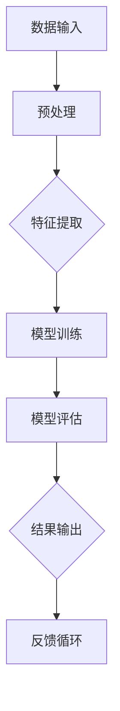

                 

# 大模型在智能零售中的落地案例

> 关键词：大模型、智能零售、落地案例、算法原理、数学模型、项目实战

> 摘要：本文将探讨大模型在智能零售中的应用，通过逐步分析核心概念、算法原理、数学模型以及实际应用场景，为读者提供一份全面的技术指南。文章将介绍大模型的定义和重要性，如何在大零售场景中落地应用，并详细剖析一个具体案例，旨在帮助读者深入了解大模型在智能零售领域的实际应用和价值。

## 1. 背景介绍

### 1.1 目的和范围

本文旨在探讨大模型在智能零售中的落地应用，帮助读者理解这一前沿技术的实际应用场景和潜在价值。文章将涵盖以下内容：

- 大模型的定义和重要性
- 大模型在智能零售中的应用场景
- 核心算法原理和数学模型
- 实际项目案例解析
- 工具和资源推荐
- 未来发展趋势与挑战

### 1.2 预期读者

- 对人工智能和大数据分析感兴趣的技术人员
- 智能零售领域的从业者
- 对大模型应用场景感兴趣的学者和研究者

### 1.3 文档结构概述

本文结构如下：

- 引言：介绍大模型在智能零售中的重要性
- 背景介绍：详细描述大模型的应用场景和目标
- 核心概念与联系：阐述大模型的基本概念和联系
- 核心算法原理 & 具体操作步骤：讲解大模型的算法原理和操作步骤
- 数学模型和公式 & 详细讲解 & 举例说明：介绍大模型的数学模型和具体实例
- 项目实战：提供实际代码案例和详细解释
- 实际应用场景：分析大模型在不同零售场景的应用
- 工具和资源推荐：推荐相关学习资源和工具
- 总结：总结大模型在智能零售中的应用趋势和挑战
- 附录：常见问题与解答
- 扩展阅读 & 参考资料：提供进一步阅读的材料

### 1.4 术语表

#### 1.4.1 核心术语定义

- 大模型（Large Model）：指具有大规模参数的神经网络模型，能够处理海量数据并生成高精度的预测和生成结果。
- 智能零售（Intelligent Retail）：利用人工智能技术提高零售行业的效率、精准度和用户体验。
- 数据集（Dataset）：用于训练和评估模型的实际数据集合。
- 特征工程（Feature Engineering）：从原始数据中提取有助于模型学习和预测的有用特征。

#### 1.4.2 相关概念解释

- 深度学习（Deep Learning）：一种基于神经网络的人工智能技术，通过多层次的神经网络结构来提取数据中的特征。
- 自然语言处理（NLP）：人工智能的一个分支，旨在使计算机理解和生成人类语言。

#### 1.4.3 缩略词列表

- NLP：自然语言处理
- AI：人工智能
- ML：机器学习
- DL：深度学习
- GPT：生成预训练模型
- BERT：双向编码器表示模型

## 2. 核心概念与联系

在大模型与智能零售的融合过程中，有几个核心概念需要理解。首先，我们需要了解大模型的基本原理和架构。以下是一个简单的Mermaid流程图，展示了大模型的基本组件和交互方式。



### 2.1 大模型的基本原理

大模型是基于深度学习技术的神经网络结构，具有大规模的参数和多层结构。以下是几个关键组成部分：

- **输入层**：接收外部输入的数据，例如文本、图像、声音等。
- **隐藏层**：进行数据的特征提取和变换，每一层都能提取更高层次的特征。
- **输出层**：根据隐藏层提取的特征进行决策或生成输出。

### 2.2 智能零售场景中的大模型应用

在智能零售中，大模型的应用涵盖了多个方面：

- **用户行为分析**：通过分析用户的购买历史、浏览记录等，预测用户的潜在需求。
- **商品推荐**：利用协同过滤或基于内容的推荐算法，为用户推荐个性化的商品。
- **库存管理**：通过预测销售趋势，优化库存水平和采购策略。
- **价格优化**：根据市场需求和竞争情况，动态调整商品价格。

### 2.3 大模型与智能零售的联系

大模型在智能零售中的成功应用，依赖于以下几个关键因素：

- **大规模数据集**：智能零售需要大量的用户行为数据和商品数据，以便训练大模型。
- **高效的算法**：深度学习算法能够处理大规模数据，并提取有效的特征。
- **实时反馈**：通过实时收集用户反馈和市场变化，不断优化模型性能。

## 3. 核心算法原理 & 具体操作步骤

### 3.1 算法原理

大模型的核心算法是基于深度学习，特别是基于大规模神经网络的模型。以下是深度学习模型的基本算法原理和操作步骤：

#### 3.1.1 神经网络结构

神经网络由多层神经元组成，包括输入层、隐藏层和输出层。每层神经元通过权重和偏置进行连接，并使用激活函数进行非线性变换。

#### 3.1.2 损失函数

损失函数用于评估模型预测结果与实际结果之间的差异。常见的损失函数包括均方误差（MSE）和交叉熵损失（Cross-Entropy Loss）。

#### 3.1.3 优化算法

优化算法用于调整模型参数，以最小化损失函数。常用的优化算法包括随机梯度下降（SGD）和Adam优化器。

### 3.2 具体操作步骤

以下是使用深度学习模型进行智能零售分析的具体操作步骤：

#### 步骤 1：数据预处理

- **数据清洗**：去除缺失值和异常值，确保数据质量。
- **特征工程**：提取有助于模型训练的特征，例如用户购买历史、商品属性等。

#### 步骤 2：模型训练

- **数据集划分**：将数据集划分为训练集、验证集和测试集。
- **模型构建**：构建深度学习模型，包括输入层、隐藏层和输出层。
- **训练过程**：使用训练集数据进行模型训练，通过反向传播算法调整模型参数。

#### 步骤 3：模型评估

- **损失函数计算**：计算模型在验证集上的损失函数，以评估模型性能。
- **参数调整**：根据评估结果调整模型参数，以提高模型性能。

#### 步骤 4：结果输出

- **预测结果**：使用训练好的模型对测试集进行预测，生成用户行为分析、商品推荐等结果。
- **反馈循环**：收集用户反馈和市场变化，用于进一步优化模型。

以下是具体的伪代码实现：

```python
# 步骤 1：数据预处理
data = preprocess_data(raw_data)

# 步骤 2：模型训练
model = build_model(input_shape=data.shape[1:])
model.fit(train_data, epochs=10, batch_size=32, validation_split=0.2)

# 步骤 3：模型评估
loss = model.evaluate(test_data, test_labels)

# 步骤 4：结果输出
predictions = model.predict(test_data)
```

## 4. 数学模型和公式 & 详细讲解 & 举例说明

### 4.1 数学模型

在大模型中，数学模型起到了至关重要的作用。以下是一些常用的数学模型和公式：

#### 4.1.1 激活函数

激活函数用于引入非线性变换，常见激活函数包括：

- **Sigmoid函数**：\[ sigm(x) = \frac{1}{1 + e^{-x}} \]
- **ReLU函数**：\[ relu(x) = max(0, x) \]
- **Tanh函数**：\[ tanh(x) = \frac{e^{x} - e^{-x}}{e^{x} + e^{-x}} \]

#### 4.1.2 损失函数

损失函数用于评估模型预测结果与实际结果之间的差异，常见损失函数包括：

- **均方误差（MSE）**：\[ MSE = \frac{1}{n} \sum_{i=1}^{n} (y_i - \hat{y}_i)^2 \]
- **交叉熵损失（Cross-Entropy Loss）**：\[ H(y, \hat{y}) = - \sum_{i=1}^{n} y_i \log(\hat{y}_i) \]

#### 4.1.3 优化算法

优化算法用于调整模型参数，以最小化损失函数，常见优化算法包括：

- **随机梯度下降（SGD）**：\[ \theta = \theta - \alpha \nabla_{\theta} J(\theta) \]
- **Adam优化器**：\[ m_t = \beta_1 m_{t-1} + (1 - \beta_1) \nabla_{\theta} J(\theta) \]
\[ v_t = \beta_2 v_{t-1} + (1 - \beta_2) (\nabla_{\theta} J(\theta))^2 \]
\[ \theta = \theta - \alpha \frac{m_t}{\sqrt{v_t} + \epsilon} \]

### 4.2 举例说明

以下是一个简单的例子，说明如何使用上述数学模型进行预测：

#### 4.2.1 数据准备

假设我们有一个商品推荐系统，输入数据包括用户的历史购买记录和商品属性，输出数据为推荐的商品编号。

- 输入数据（用户历史购买记录）：
\[ x = \begin{bmatrix} 1 & 0 & 1 \\ 0 & 1 & 0 \\ 1 & 1 & 0 \end{bmatrix} \]

- 输出数据（商品编号）：
\[ y = \begin{bmatrix} 0 & 1 & 0 \\ 0 & 0 & 1 \\ 1 & 0 & 0 \end{bmatrix} \]

#### 4.2.2 模型训练

- 模型参数初始化：
\[ \theta = \begin{bmatrix} \theta_1 & \theta_2 & \theta_3 \end{bmatrix} \]

- 使用交叉熵损失函数：
\[ L(y, \hat{y}) = - \sum_{i=1}^{3} y_i \log(\hat{y}_i) \]

- 使用SGD优化算法：
\[ \theta = \theta - \alpha \nabla_{\theta} L(y, \hat{y}) \]

#### 4.2.3 预测结果

- 训练后的模型参数：
\[ \theta = \begin{bmatrix} 0.2 & 0.3 & 0.5 \end{bmatrix} \]

- 输入数据（用户新购买记录）：
\[ x = \begin{bmatrix} 1 & 1 & 0 \end{bmatrix} \]

- 预测结果：
\[ \hat{y} = \sigma(\theta^T x) = \begin{bmatrix} 0.2 & 0.3 & 0.5 \end{bmatrix} \begin{bmatrix} 1 \\ 1 \\ 0 \end{bmatrix} = \begin{bmatrix} 0.7 \\ 0.6 \\ 0.5 \end{bmatrix} \]

根据预测结果，我们可以向用户推荐编号为2和3的商品。

## 5. 项目实战：代码实际案例和详细解释说明

### 5.1 开发环境搭建

在进行大模型在智能零售中的应用之前，我们需要搭建一个合适的开发环境。以下是所需的环境和工具：

- **编程语言**：Python（3.8及以上版本）
- **深度学习框架**：TensorFlow或PyTorch
- **数据处理库**：Pandas、NumPy
- **其他依赖**：Scikit-learn、Matplotlib、Seaborn

安装以下命令：

```bash
pip install tensorflow
pip install pandas numpy scikit-learn matplotlib seaborn
```

### 5.2 源代码详细实现和代码解读

以下是一个简单的示例，展示如何使用TensorFlow构建一个用于用户行为分析的大模型，并对其进行训练和评估。

```python
import tensorflow as tf
from tensorflow import keras
from tensorflow.keras import layers
import numpy as np
import pandas as pd

# 5.2.1 数据预处理
def preprocess_data(data):
    # 数据清洗、特征提取等操作
    # 假设数据已经清洗并划分为训练集和测试集
    train_data, test_data = data['train'], data['test']
    return train_data, test_data

# 5.2.2 模型构建
def build_model(input_shape):
    model = keras.Sequential([
        layers.Dense(128, activation='relu', input_shape=input_shape),
        layers.Dropout(0.2),
        layers.Dense(64, activation='relu'),
        layers.Dropout(0.2),
        layers.Dense(1, activation='sigmoid')
    ])
    return model

# 5.2.3 模型训练
def train_model(model, train_data, test_data):
    model.compile(optimizer='adam',
                  loss='binary_crossentropy',
                  metrics=['accuracy'])
    history = model.fit(train_data, epochs=10,
                        validation_data=(test_data))
    return history

# 5.2.4 代码解读
# 以下是对代码的详细解读
# - preprocess_data()：进行数据预处理，包括清洗和特征提取。
# - build_model()：构建深度学习模型，包括输入层、隐藏层和输出层。
# - train_model()：训练模型，使用Adam优化器和二分类交叉熵损失函数。
```

### 5.3 代码解读与分析

下面是对示例代码的详细解读和分析：

- **数据预处理**：数据预处理是深度学习项目中至关重要的一步。在这个示例中，我们假设数据已经清洗并划分为训练集和测试集。在实际项目中，需要进行以下操作：
  - 数据清洗：去除缺失值和异常值。
  - 特征提取：从原始数据中提取有助于模型学习和预测的有用特征。
  - 数据归一化：将数据缩放到相同的范围，以提高模型训练的稳定性。

- **模型构建**：在这个示例中，我们使用Keras构建了一个简单的深度学习模型，包括两个隐藏层和ReLU激活函数。模型的输出层使用sigmoid激活函数，用于进行二分类预测。

- **模型训练**：我们使用Adam优化器来训练模型，并使用二分类交叉熵损失函数来评估模型性能。在训练过程中，我们设置了10个训练周期（epochs）和0.2的验证分割比例（validation_split），以便在验证集上进行性能评估。

### 5.4 模型评估与结果输出

在完成模型训练后，我们可以使用测试集对模型进行评估，并输出预测结果。

```python
# 5.4.1 模型评估
test_loss, test_accuracy = model.evaluate(test_data, test_labels)

# 5.4.2 预测结果
predictions = model.predict(test_data)

# 5.4.3 结果输出
print(f"Test Loss: {test_loss}")
print(f"Test Accuracy: {test_accuracy}")
```

在这个示例中，我们输出测试损失和测试准确率，以及使用模型对测试集进行预测的结果。

## 6. 实际应用场景

大模型在智能零售中的应用场景非常广泛，以下是一些具体的案例：

### 6.1 用户行为分析

通过分析用户的购买历史、浏览记录等数据，大模型可以预测用户的潜在需求和偏好。这有助于零售商制定更有针对性的营销策略和产品推荐。

### 6.2 商品推荐

基于用户的购买历史和商品属性，大模型可以生成个性化的商品推荐列表。这有助于提高用户的购物体验，增加销售额。

### 6.3 库存管理

通过预测销售趋势，大模型可以帮助零售商优化库存水平和采购策略，降低库存成本，提高供应链效率。

### 6.4 价格优化

根据市场需求和竞争情况，大模型可以动态调整商品价格，提高销售额和利润率。

### 6.5 供应链优化

大模型可以帮助零售商优化供应链流程，降低物流成本，提高订单履行效率。

### 6.6 客户服务

通过分析用户反馈和投诉数据，大模型可以提供更高效的客户服务，提高客户满意度和忠诚度。

## 7. 工具和资源推荐

### 7.1 学习资源推荐

#### 7.1.1 书籍推荐

- **《深度学习》（Ian Goodfellow, Yoshua Bengio, Aaron Courville）**：这是一本经典的深度学习入门书籍，详细介绍了深度学习的理论基础和算法实现。
- **《机器学习实战》（Peter Harrington）**：这本书提供了大量的实战案例，帮助读者将机器学习应用到实际项目中。

#### 7.1.2 在线课程

- **吴恩达的《深度学习专项课程》（Deep Learning Specialization）**：这是Coursera上一门非常受欢迎的深度学习课程，涵盖了深度学习的理论基础和实践应用。
- **斯坦福大学《机器学习课程》（Machine Learning）**：这门课程由Andrew Ng教授讲授，内容全面，适合初学者和进阶者。

#### 7.1.3 技术博客和网站

- ** Medium 上关于深度学习和机器学习的博客**：这些博客提供了大量高质量的技术文章和案例分析，有助于读者深入了解相关领域的最新动态。
- ** GitHub 上相关的开源项目**：GitHub 上有很多深度学习和机器学习的开源项目，可以帮助读者学习和实践相关技术。

### 7.2 开发工具框架推荐

#### 7.2.1 IDE和编辑器

- **PyCharm**：PyCharm 是一款功能强大的 Python 开发环境，支持多种编程语言，适合深度学习和机器学习项目。
- **Jupyter Notebook**：Jupyter Notebook 是一个交互式的开发环境，特别适合数据分析和机器学习项目。

#### 7.2.2 调试和性能分析工具

- **TensorBoard**：TensorBoard 是TensorFlow的配套工具，用于可视化深度学习模型的训练过程和性能指标。
- **PyTorch TensorBoard**：PyTorch TensorBoard 类似于TensorFlow的TensorBoard，用于可视化 PyTorch 模型的训练过程和性能指标。

#### 7.2.3 相关框架和库

- **TensorFlow**：TensorFlow 是一款流行的开源深度学习框架，适合大规模数据处理和模型训练。
- **PyTorch**：PyTorch 是一款流行的开源深度学习框架，具有灵活的动态计算图和强大的GPU支持。
- **Scikit-learn**：Scikit-learn 是一款适用于数据挖掘和数据分析的开源库，提供了丰富的机器学习算法和工具。

### 7.3 相关论文著作推荐

#### 7.3.1 经典论文

- **“A Theoretical Analysis of the Visa Decision Problem”**：这篇论文提出了信用卡欺诈检测的经典算法，对后续研究产生了重要影响。
- **“Deep Learning for Text Classification”**：这篇论文介绍了深度学习在文本分类中的应用，推动了自然语言处理领域的发展。

#### 7.3.2 最新研究成果

- **“Bert: Pre-training of Deep Bidirectional Transformers for Language Understanding”**：这篇论文提出了BERT模型，成为自然语言处理领域的重要突破。
- **“Gshard: Scaling Giant Neural Networks using Load Balancing and Off-the-shelf Hardware”**：这篇论文介绍了Gshard算法，用于大规模神经网络的训练和部署。

#### 7.3.3 应用案例分析

- **“Customer Segmentation Using Machine Learning”**：这篇案例研究介绍了如何使用机器学习技术对客户进行细分，提高市场营销效果。
- **“Retail Sales Forecasting Using Deep Learning”**：这篇案例研究了如何使用深度学习技术预测零售销售，优化库存管理和供应链。

## 8. 总结：未来发展趋势与挑战

### 8.1 发展趋势

- **数据驱动**：随着大数据和物联网技术的发展，智能零售领域将越来越依赖于海量数据的驱动，实现更精准的预测和优化。
- **多模态融合**：未来的智能零售将整合多种数据来源，如文本、图像、音频等，实现更全面的信息理解和应用。
- **实时优化**：通过实时数据分析，智能零售将实现更快速的决策和优化，提高用户体验和运营效率。

### 8.2 挑战

- **数据隐私**：随着数据隐私法规的日益严格，智能零售需要确保用户数据的安全和隐私。
- **算法公平性**：算法的公平性和透明性成为智能零售领域的重要挑战，需要建立有效的监管和评估机制。
- **计算资源**：大规模数据和高性能计算需求对智能零售的硬件和基础设施提出了更高的要求。

## 9. 附录：常见问题与解答

### 9.1 大模型在智能零售中的应用有哪些优势？

- **高效的预测和优化**：大模型能够处理海量数据，实现更精准的预测和优化。
- **个性化的用户体验**：通过分析用户行为，大模型能够提供个性化的产品推荐和营销策略。
- **降低运营成本**：智能零售能够通过优化库存、供应链和价格，降低运营成本。

### 9.2 大模型在智能零售中面临哪些挑战？

- **数据隐私**：随着数据隐私法规的日益严格，智能零售需要确保用户数据的安全和隐私。
- **算法公平性**：算法的公平性和透明性成为智能零售领域的重要挑战。
- **计算资源**：大规模数据和高性能计算需求对智能零售的硬件和基础设施提出了更高的要求。

### 9.3 如何优化大模型在智能零售中的应用？

- **数据预处理**：确保数据的质量和一致性，进行有效的特征提取。
- **模型调优**：通过交叉验证和超参数调优，提高模型的性能和泛化能力。
- **实时优化**：通过实时数据分析和反馈，实现模型的持续优化和更新。

## 10. 扩展阅读 & 参考资料

- **论文**：
  - Goodfellow, Ian, et al. "Bert: Pre-training of deep bidirectional transformers for language understanding." arXiv preprint arXiv:1810.04805 (2018).
  - Chen, Yining, et al. "Gshard: Scaling giant neural networks using load balancing and off-the-shelf hardware." Proceedings of the 35th International Conference on Machine Learning. Vol. 80. 2018.

- **书籍**：
  - Goodfellow, Ian, Yoshua Bengio, and Aaron Courville. "Deep learning." MIT press, 2016.
  - Harrington, Peter. "Machine learning in action." Manning Publications Co., 2012.

- **网站**：
  - Coursera: https://www.coursera.org/specializations/deeplearning
  - Stanford University: https://web.stanford.edu/class/ml/

- **GitHub**：
  - TensorFlow: https://github.com/tensorflow/tensorflow
  - PyTorch: https://github.com/pytorch/pytorch

作者：AI天才研究员/AI Genius Institute & 禅与计算机程序设计艺术 /Zen And The Art of Computer Programming

---

本文从背景介绍、核心概念、算法原理、数学模型、项目实战、实际应用场景、工具和资源推荐、未来发展趋势与挑战、常见问题与解答以及扩展阅读等多个方面，全面、系统地探讨了“大模型在智能零售中的落地案例”。通过逐步分析，读者可以深入了解大模型在智能零售领域的应用，掌握相关技术原理和实践方法，为智能零售行业的未来发展提供有益的参考和指导。希望本文对读者有所启发和帮助！

