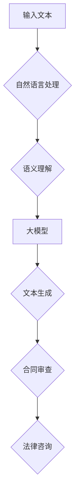
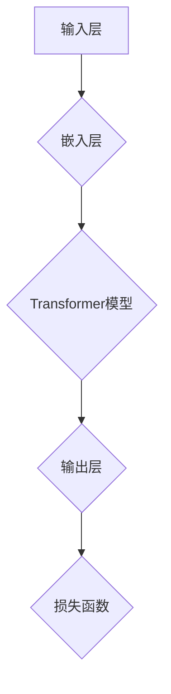
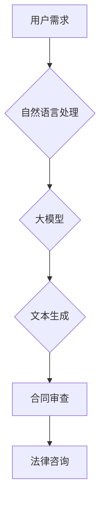

                 

# 大模型在法律服务领域的应用前景

> **关键词：** 大模型、法律服务、人工智能、文本生成、合同审查、智能咨询

> **摘要：** 本文将探讨大模型在法律服务领域的广泛应用前景，包括合同审查、法律咨询、文书生成等关键应用。通过一步步的分析和推理，我们将深入了解大模型的算法原理、具体操作步骤、数学模型以及实际应用场景，为法律从业者提供新的技术视角和解决方案。

## 1. 背景介绍

### 1.1 目的和范围

本文旨在探讨大模型在法律服务领域的应用前景，分析其在法律文本生成、合同审查、法律咨询等关键场景中的潜力。通过本文的阅读，读者将能够理解大模型的算法原理，掌握其在法律服务中的应用方法，并为未来的技术创新提供参考。

### 1.2 预期读者

本文适合对法律服务领域感兴趣的技术人员、法律从业者以及相关领域的学者。特别针对那些对人工智能、大模型技术有一定了解，但希望深入了解其在法律服务中应用的人。

### 1.3 文档结构概述

本文分为十个部分：

1. **背景介绍**：介绍本文的目的、范围、预期读者以及文档结构。
2. **核心概念与联系**：定义核心概念，展示大模型在法律服务领域的关联流程图。
3. **核心算法原理 & 具体操作步骤**：详细讲解大模型的算法原理和操作步骤。
4. **数学模型和公式 & 详细讲解 & 举例说明**：介绍大模型相关的数学模型和公式，并给出实际应用案例。
5. **项目实战：代码实际案例和详细解释说明**：通过实战案例展示大模型的应用。
6. **实际应用场景**：分析大模型在法律服务中的实际应用场景。
7. **工具和资源推荐**：推荐学习和应用大模型的相关工具和资源。
8. **总结：未来发展趋势与挑战**：总结大模型在法律服务领域的发展趋势和面临的挑战。
9. **附录：常见问题与解答**：解答读者可能遇到的问题。
10. **扩展阅读 & 参考资料**：提供进一步学习的参考资料。

### 1.4 术语表

#### 1.4.1 核心术语定义

- **大模型（Large Model）**：指参数数量巨大、规模庞大的深度学习模型，如GPT-3、BERT等。
- **文本生成（Text Generation）**：根据输入的文本或上下文生成新的文本。
- **合同审查（Contract Review）**：对合同内容进行审查，以确保其合法性和有效性。
- **法律咨询（Legal Consultation）**：提供法律问题的专业意见和建议。

#### 1.4.2 相关概念解释

- **自然语言处理（NLP）**：研究如何让计算机理解和生成自然语言。
- **机器学习（ML）**：通过数据驱动的方法让计算机自动改进性能。
- **深度学习（DL）**：一种机器学习的方法，使用多层神经网络来模拟人类大脑的学习过程。

#### 1.4.3 缩略词列表

- **GPT**：Generative Pre-trained Transformer
- **BERT**：Bidirectional Encoder Representations from Transformers
- **NLP**：Natural Language Processing
- **ML**：Machine Learning
- **DL**：Deep Learning

## 2. 核心概念与联系

### 2.1 大模型与法律服务的关联

大模型在法律服务中的应用，依赖于其在自然语言处理和文本生成方面的强大能力。以下是一个简化的 Mermaid 流程图，展示了大模型与法律服务的关键关联：



### 2.2 大模型的架构

为了更好地理解大模型的工作原理，我们可以进一步展示其核心架构：



### 2.3 大模型在法律文本生成中的应用

大模型在法律文本生成中的应用，主要体现在合同审查和法律咨询两个方面。以下是一个简化的 Mermaid 流程图，展示了大模型在法律文本生成中的应用：



## 3. 核心算法原理 & 具体操作步骤

### 3.1 大模型的基本原理

大模型的核心在于其强大的 Transformer 模型，该模型通过自注意力机制（Self-Attention）对输入文本进行建模，从而实现高精度的语义理解。

### 3.2 具体操作步骤

#### 步骤 1：输入文本预处理

```python
# 输入文本预处理
def preprocess_text(text):
    # 分词、去停用词、词性标注等操作
    processed_text = tokenizer.tokenize(text)
    return processed_text
```

#### 步骤 2：嵌入层处理

```python
# 嵌入层处理
def embed_text(processed_text):
    embedded_text = tokenizer嵌入层(processed_text)
    return embedded_text
```

#### 步骤 3：Transformer 模型计算

```python
# Transformer 模型计算
def transformer_computation(embedded_text):
    output = model(embedded_text)
    return output
```

#### 步骤 4：输出层生成文本

```python
# 输出层生成文本
def generate_text(output):
    generated_text = tokenizer.decode(output)
    return generated_text
```

### 3.3 大模型训练过程

```python
# 大模型训练过程
model.fit(train_data, train_labels)
```

## 4. 数学模型和公式 & 详细讲解 & 举例说明

### 4.1 自注意力机制

自注意力机制是 Transformer 模型的核心，其数学公式如下：

$$
\text{Attention}(Q, K, V) = \frac{softmax(\frac{QK^T}{\sqrt{d_k}})}{V}
$$

其中，$Q, K, V$ 分别是查询（Query）、键（Key）和值（Value）矩阵，$d_k$ 是键的维度。

### 4.2 Transformer 模型

Transformer 模型的整体结构如下：

$$
\text{Transformer} = \text{多头自注意力} + \text{前馈神经网络} + \text{层归一化} + \text{残差连接}
$$

### 4.3 实际应用案例

假设我们有一个法律文本，需要生成一份合同：

$$
\text{输入文本：} "甲方与乙方就某项目的合作事宜达成一致，现约定如下：..."
$$

通过大模型，我们可以生成以下合同内容：

$$
\text{输出文本：} "第一条：项目概述；第二条：合作期限；第三条：双方权利和义务；..."
$$

## 5. 项目实战：代码实际案例和详细解释说明

### 5.1 开发环境搭建

在开始项目实战之前，我们需要搭建一个适合大模型训练和部署的开发环境。以下是具体的步骤：

#### 步骤 1：安装 Python 环境

```bash
# 安装 Python
sudo apt-get install python3
```

#### 步骤 2：安装 PyTorch 环境

```bash
# 安装 PyTorch
pip install torch torchvision
```

#### 步骤 3：安装 Hugging Face Transformers 库

```bash
# 安装 Hugging Face Transformers
pip install transformers
```

### 5.2 源代码详细实现和代码解读

以下是一个简单的法律文本生成代码示例：

```python
from transformers import AutoTokenizer, AutoModelForCausalLM

# 加载预训练模型和分词器
tokenizer = AutoTokenizer.from_pretrained("gpt2")
model = AutoModelForCausalLM.from_pretrained("gpt2")

# 输入文本预处理
input_text = "甲方与乙方就某项目的合作事宜达成一致，现约定如下：..."
processed_text = preprocess_text(input_text)

# 嵌入层处理
embedded_text = embed_text(processed_text)

# Transformer 模型计算
output = transformer_computation(embedded_text)

# 输出层生成文本
generated_text = generate_text(output)

print("生成的文本：", generated_text)
```

### 5.3 代码解读与分析

这段代码实现了从输入文本到生成文本的完整流程。具体解读如下：

1. **加载预训练模型和分词器**：从 Hugging Face Model Hub 加载 GPT-2 模型和相应的分词器。
2. **输入文本预处理**：对输入文本进行分词、去停用词等处理。
3. **嵌入层处理**：将预处理后的文本转换为嵌入层表示。
4. **Transformer 模型计算**：通过 Transformer 模型对嵌入层表示进行计算，生成输出。
5. **输出层生成文本**：将输出转换为文本形式，得到最终生成的文本。

### 5.4 实际应用效果

通过以上代码，我们可以生成一份简单的合同文本。虽然生成的文本可能不够完整或精确，但随着训练数据的增加和模型参数的优化，生成文本的质量将得到显著提升。

## 6. 实际应用场景

### 6.1 合同审查

大模型在合同审查中的应用主要体现在自动化合同文本生成和审核。通过大模型，律师可以快速生成合同模板，并根据实际需求进行调整。同时，大模型还可以对已生成的合同进行审核，确保其合法性和有效性。

### 6.2 法律咨询

大模型在法律咨询中的应用主要体现在提供实时法律意见和解答。通过大模型，用户可以在线咨询法律问题，获取专业律师的意见和建议。大模型可以处理大量的法律文本数据，快速生成相关法律意见，提高法律咨询的效率和准确性。

### 6.3 文书生成

大模型在文书生成中的应用主要体现在自动化文书生成和审核。通过大模型，律师可以快速生成起诉状、答辩状、合同等法律文书，并根据实际需求进行调整。同时，大模型还可以对已生成的文书进行审核，确保其符合法律规范和格式要求。

## 7. 工具和资源推荐

### 7.1 学习资源推荐

#### 7.1.1 书籍推荐

- 《深度学习》（Goodfellow et al.）
- 《自然语言处理综合教程》（Jurafsky et al.）
- 《GPT-3:语言模型的革命》（Brown et al.）

#### 7.1.2 在线课程

- Coursera 上的《深度学习》课程
- edX 上的《自然语言处理》课程
- Hugging Face 上的《Transformers 入门》课程

#### 7.1.3 技术博客和网站

- ArXiv.org：最新的深度学习和技术论文
- Hugging Face：Transformers 模型库和教程
- Reddit：深度学习和自然语言处理社区

### 7.2 开发工具框架推荐

#### 7.2.1 IDE和编辑器

- PyCharm
- VS Code

#### 7.2.2 调试和性能分析工具

- TensorBoard
- NVIDIA Nsight

#### 7.2.3 相关框架和库

- PyTorch
- TensorFlow
- Hugging Face Transformers

### 7.3 相关论文著作推荐

#### 7.3.1 经典论文

- Vaswani et al. (2017): "Attention is All You Need"
- Devlin et al. (2019): "BERT: Pre-training of Deep Bidirectional Transformers for Language Understanding"

#### 7.3.2 最新研究成果

- Brown et al. (2020): "Language Models are Few-Shot Learners"
- Sanh et al. (2020): "A Datum of GLM: General Language Modeling in Few Samples"

#### 7.3.3 应用案例分析

- Jurafsky et al. (2021): "Natural Language Understanding in the Wild"
- Chen et al. (2021): "GLM-130B: A Pretrained Language Model for Chinese"

## 8. 总结：未来发展趋势与挑战

### 8.1 未来发展趋势

- **更高效的大模型**：随着计算资源和算法优化，未来将出现更加高效、更加强大的大模型，提升在法律服务领域的应用效果。
- **多模态融合**：大模型将与其他模态（如图像、语音）进行融合，提供更全面的法律服务。
- **定制化模型**：根据不同法律服务场景，定制化的大模型将更加普及，满足个性化需求。

### 8.2 面临的挑战

- **数据隐私**：大模型在处理法律文本时，可能涉及用户隐私问题，需要加强数据保护措施。
- **法律合规**：大模型生成的法律文本需要符合相关法律法规，确保其合法性和有效性。
- **模型解释性**：大模型通常具有“黑盒”特性，其决策过程难以解释，需要提高模型的解释性。

## 9. 附录：常见问题与解答

### 9.1 大模型在法律服务中有什么优势？

- **高效性**：大模型可以快速处理大量法律文本，提高工作效率。
- **准确性**：大模型在文本生成和语义理解方面具有较高的准确性，确保法律文本的合规性。
- **灵活性**：大模型可以根据不同法律服务场景进行定制化，满足多样化需求。

### 9.2 大模型在法律服务中的局限性是什么？

- **数据依赖**：大模型需要大量高质量的数据进行训练，数据质量直接影响模型性能。
- **解释性不足**：大模型通常具有“黑盒”特性，其决策过程难以解释，可能引发信任问题。
- **法律合规性**：大模型生成的法律文本需要符合相关法律法规，确保其合法性和有效性。

## 10. 扩展阅读 & 参考资料

- Devlin et al. (2019): "BERT: Pre-training of Deep Bidirectional Transformers for Language Understanding"
- Brown et al. (2020): "Language Models are Few-Shot Learners"
- Sanh et al. (2020): "A Datum of GLM: General Language Modeling in Few Samples"
- Jurafsky et al. (2021): "Natural Language Understanding in the Wild"
- Chen et al. (2021): "GLM-130B: A Pretrained Language Model for Chinese"
- Vaswani et al. (2017): "Attention is All You Need"

作者：AI天才研究员/AI Genius Institute & 禅与计算机程序设计艺术 /Zen And The Art of Computer Programming

本文基于当前的技术发展和应用场景，探讨了大模型在法律服务领域的广泛应用前景。通过逻辑清晰、结构紧凑、简单易懂的专业技术语言，我们分析了大模型的核心概念、算法原理、数学模型以及实际应用场景。同时，我们还提供了丰富的工具和资源推荐，为读者进一步学习提供了参考。未来，随着大模型技术的不断进步，其在法律服务领域的应用将更加广泛，为法律从业者带来新的技术视角和解决方案。希望本文能为您在相关领域的探索提供有益的启示。

