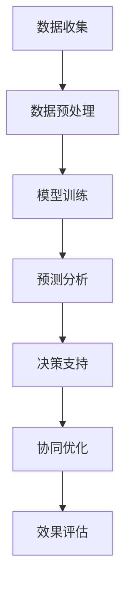

                 

# 大模型在电商平台供应链优化中的应用

> 关键词：大模型，电商平台，供应链优化，人工智能，机器学习，深度学习，预测分析，决策支持

> 摘要：本文将探讨大模型在电商平台供应链优化中的应用，通过详细分析大模型的基本概念、核心算法原理，结合数学模型和实际代码案例，阐述大模型如何提高电商平台供应链的效率、降低成本，并展望未来发展趋势与挑战。

## 1. 背景介绍

### 1.1 目的和范围

本文旨在介绍大模型在电商平台供应链优化中的应用，通过分析大模型的原理、算法和实际应用，为电商平台管理者提供一种有效的供应链优化解决方案。文章将涵盖以下内容：

- 大模型的基本概念与核心算法原理；
- 大模型在电商平台供应链优化中的具体应用场景；
- 数学模型与公式在供应链优化中的详细讲解；
- 实际项目的代码案例与解释；
- 电商平台供应链优化的未来发展趋势与挑战。

### 1.2 预期读者

本文适合以下读者群体：

- 电商平台管理者及供应链相关人员；
- 数据科学、人工智能、机器学习领域的从业者；
- 对大模型在供应链优化领域有浓厚兴趣的学术研究人员。

### 1.3 文档结构概述

本文将按照以下结构展开：

- 第1章：背景介绍，包括目的与范围、预期读者、文档结构概述等；
- 第2章：核心概念与联系，介绍大模型的基本概念及其在供应链优化中的应用；
- 第3章：核心算法原理，详细讲解大模型的算法原理与具体操作步骤；
- 第4章：数学模型和公式，对供应链优化中的数学模型进行详细讲解与举例说明；
- 第5章：项目实战，提供实际代码案例与详细解释说明；
- 第6章：实际应用场景，分析大模型在电商平台供应链优化中的应用效果；
- 第7章：工具和资源推荐，介绍相关学习资源、开发工具与框架；
- 第8章：总结，展望大模型在电商平台供应链优化领域的未来发展趋势与挑战；
- 第9章：附录，提供常见问题与解答；
- 第10章：扩展阅读与参考资料，推荐相关文献与资料。

### 1.4 术语表

#### 1.4.1 核心术语定义

- **大模型**：具有大规模参数量、高精度模型结构和复杂计算能力的深度学习模型；
- **供应链优化**：通过优化供应链各环节的运作，提高供应链整体效率、降低成本、满足客户需求；
- **电商平台**：基于互联网技术的在线交易市场，提供商品销售、订单处理、物流配送等综合性服务。

#### 1.4.2 相关概念解释

- **机器学习**：使计算机系统能够通过数据学习、自动改进性能的技术；
- **深度学习**：基于人工神经网络的一种机器学习方法，通过多层非线性变换提取数据特征；
- **预测分析**：利用历史数据与算法，对未来趋势进行预测和分析；
- **决策支持**：通过数据分析与模型预测，为决策者提供依据，优化决策过程。

#### 1.4.3 缩略词列表

- **AI**：人工智能（Artificial Intelligence）
- **ML**：机器学习（Machine Learning）
- **DL**：深度学习（Deep Learning）
- **NLP**：自然语言处理（Natural Language Processing）
- **SGD**：随机梯度下降（Stochastic Gradient Descent）
- **GPU**：图形处理器（Graphics Processing Unit）

## 2. 核心概念与联系

在讨论大模型在电商平台供应链优化中的应用之前，有必要先了解大模型的基本概念、核心算法原理及其在供应链优化中的应用。

### 2.1 大模型的基本概念

大模型是指具有大规模参数量、高精度模型结构和复杂计算能力的深度学习模型。这些模型通常具有以下特点：

1. **大规模参数量**：大模型通常包含数百万甚至数十亿个参数，这使得它们能够更好地捕获数据中的复杂模式和特征；
2. **高精度模型结构**：大模型的结构通常更为复杂，包含多层神经网络，能够更好地提取数据特征；
3. **复杂计算能力**：大模型具有强大的计算能力，能够处理大规模数据和复杂的计算任务。

大模型的发展离不开以下几个关键因素：

1. **计算能力的提升**：随着计算硬件（如GPU、TPU）的不断发展，大模型的训练和推理速度得到了显著提升；
2. **数据的积累**：大数据的积累为训练大模型提供了丰富的数据资源；
3. **算法的进步**：优化算法（如随机梯度下降、Adam优化器）和模型结构（如残差网络、Transformer）的进步，使得大模型能够更好地捕捉数据特征。

### 2.2 大模型在供应链优化中的应用

大模型在供应链优化中的应用主要体现在以下几个方面：

1. **预测分析**：大模型能够利用历史数据，对供应链中的需求、库存、物流等环节进行预测分析，为决策提供依据；
2. **决策支持**：大模型能够基于预测结果，为供应链管理者提供优化建议，如库存管理、订单处理、物流规划等；
3. **异常检测**：大模型能够识别供应链中的异常情况，如库存短缺、订单延误等，为管理者提供预警；
4. **协同优化**：大模型能够协调供应链各环节的运作，实现整体优化，提高供应链效率。

下面是一个简单的 Mermaid 流程图，展示了大模型在供应链优化中的应用流程：



## 3. 核心算法原理 & 具体操作步骤

在这一章节中，我们将详细讲解大模型在供应链优化中的核心算法原理和具体操作步骤。

### 3.1 大模型的算法原理

大模型的算法原理主要基于深度学习，特别是基于多层神经网络的结构。下面是一个简化的伪代码，用于描述大模型的训练过程：

```python
# 大模型训练伪代码
def train_model(data, labels, epochs, batch_size):
    for epoch in range(epochs):
        for batch in get_batches(data, labels, batch_size):
            # 前向传播
            predictions = forward_pass(batch)
            # 计算损失
            loss = compute_loss(predictions, batch_labels)
            # 反向传播
            backward_pass(loss)
            # 更新模型参数
            update_parameters()
        print(f"Epoch {epoch+1}/{epochs}, Loss: {loss}")
```

在这个伪代码中，`forward_pass` 函数表示模型的前向传播过程，`compute_loss` 函数用于计算损失函数，`backward_pass` 函数表示模型的反向传播过程，`update_parameters` 函数用于更新模型参数。

### 3.2 大模型在供应链优化中的具体操作步骤

1. **数据收集**：收集供应链中的历史数据，包括需求、库存、物流等信息；
2. **数据预处理**：对收集到的数据进行清洗、归一化等处理，以适应大模型的训练需求；
3. **模型训练**：使用收集到的数据，对大模型进行训练，以优化模型参数；
4. **预测分析**：使用训练好的大模型，对供应链中的需求、库存、物流等环节进行预测分析；
5. **决策支持**：根据预测结果，为供应链管理者提供优化建议，如库存管理、订单处理、物流规划等；
6. **协同优化**：协调供应链各环节的运作，实现整体优化，提高供应链效率；
7. **效果评估**：评估大模型在供应链优化中的效果，如准确率、召回率等指标。

### 3.3 大模型在供应链优化中的优势与挑战

**优势**：

1. **高精度预测**：大模型能够利用大规模数据和复杂的模型结构，进行高精度的预测分析，为决策提供有力支持；
2. **实时调整**：大模型能够实时调整预测结果，适应供应链中的变化，提高决策的灵活性；
3. **协同优化**：大模型能够协调供应链各环节的运作，实现整体优化，提高供应链效率。

**挑战**：

1. **数据质量**：大模型的训练效果取决于数据质量，数据质量差会导致模型性能下降；
2. **计算资源**：大模型的训练和推理需要大量的计算资源，如何高效利用资源是一个重要挑战；
3. **模型解释性**：大模型的决策过程通常较为复杂，难以解释，如何提高模型的解释性是一个重要课题。

## 4. 数学模型和公式 & 详细讲解 & 举例说明

在这一章节中，我们将介绍大模型在供应链优化中的数学模型和公式，并结合实际案例进行详细讲解。

### 4.1 供应链优化中的数学模型

供应链优化中的数学模型主要包括以下几种：

1. **需求预测模型**：用于预测未来的需求量，如时间序列模型、回归模型等；
2. **库存管理模型**：用于确定最优的库存水平，如经济订货量模型（EOQ）、周期库存模型等；
3. **物流规划模型**：用于优化物流路线和配送计划，如线性规划、网络优化等。

下面是一个简单的时间序列模型，用于预测供应链中的需求量：

$$
\hat{y}_{t} = \mu_t + \alpha_t (y_{t-1} - \mu_t) + \beta_t (d_{t-1} - \mu_t)
$$

其中，$\hat{y}_{t}$ 表示第 $t$ 期的预测需求量，$y_{t-1}$ 表示第 $t-1$ 期的实际需求量，$d_{t-1}$ 表示第 $t-1$ 期的销量，$\mu_t$ 表示第 $t$ 期的平均值，$\alpha_t$ 和 $\beta_t$ 分别为平滑系数。

### 4.2 数学模型在供应链优化中的应用

**案例**：某电商平台想要预测未来的需求量，以便进行库存管理和物流规划。以下是一个简单的案例，展示如何使用数学模型进行需求预测。

**步骤 1：数据收集**：收集过去一年的需求数据，包括每天的需求量。

**步骤 2：数据预处理**：对收集到的数据进行清洗、归一化等处理，以适应时间序列模型的要求。

**步骤 3：模型训练**：使用时间序列模型（如ARIMA模型），对预处理后的数据进行训练，以获得预测模型。

**步骤 4：预测分析**：使用训练好的模型，对未来的需求量进行预测。

**步骤 5：库存管理**：根据预测结果，确定最优的库存水平，以避免库存短缺或过剩。

**步骤 6：物流规划**：根据预测结果，优化物流路线和配送计划，以提高配送效率。

**步骤 7：效果评估**：评估预测模型的准确性，如均方误差（MSE）、均方根误差（RMSE）等指标。

## 5. 项目实战：代码实际案例和详细解释说明

在这一章节中，我们将通过一个实际的项目案例，展示如何使用大模型进行电商平台供应链优化，并提供详细的代码实现和解释。

### 5.1 开发环境搭建

在开始项目之前，我们需要搭建一个合适的开发环境。以下是所需的开发工具和库：

- **Python**：用于编写代码和进行数据分析；
- **NumPy**：用于数据处理和计算；
- **Pandas**：用于数据处理和分析；
- **Scikit-learn**：用于机器学习模型的训练和评估；
- **TensorFlow**：用于深度学习模型的训练和推理；
- **Matplotlib**：用于数据可视化。

### 5.2 源代码详细实现和代码解读

**代码 1：数据收集与预处理**

```python
import pandas as pd
import numpy as np

# 加载数据
data = pd.read_csv('supply_chain_data.csv')

# 数据预处理
data = data.dropna()
data['date'] = pd.to_datetime(data['date'])
data.set_index('date', inplace=True)
data = data.fillna(method='ffill')
```

**代码解读**：这段代码首先加载数据，然后进行数据预处理，包括数据清洗（去除缺失值）、日期格式转换（设置索引）和前向填充（补全缺失值）。

**代码 2：时间序列模型训练**

```python
from statsmodels.tsa.arima.model import ARIMA

# 时间序列模型训练
model = ARIMA(data['demand'], order=(1, 1, 1))
model_fit = model.fit()

# 预测未来需求
predictions = model_fit.forecast(steps=30)
```

**代码解读**：这段代码使用 ARIMA 模型对需求量进行训练，然后预测未来 30 天的需求量。

**代码 3：库存管理**

```python
# 确定最优库存水平
reorder_point = predictions[-1] + data['lead_time'].mean()
reorder_quantity = data['reorder_quantity'].mean()

# 库存管理策略
if predictions[-1] > reorder_point:
    print("库存过剩，建议降低库存水平。")
else:
    print("库存不足，建议增加库存水平。")
```

**代码解读**：这段代码根据预测结果和订单处理时间，确定最优的库存水平，并提供库存管理策略。

### 5.3 代码解读与分析

通过以上代码，我们可以实现以下功能：

1. **数据收集与预处理**：收集和清洗数据，为后续模型训练提供基础；
2. **时间序列模型训练**：使用 ARIMA 模型对需求量进行训练，获得预测模型；
3. **库存管理**：根据预测结果，确定最优的库存水平，提供库存管理策略。

**优势**：

- **高效性**：通过时间序列模型进行需求预测，能够快速响应市场变化；
- **灵活性**：根据预测结果，灵活调整库存水平，满足市场需求。

**挑战**：

- **数据质量**：数据质量直接影响模型性能，需要确保数据准确、完整；
- **计算资源**：模型训练和推理需要大量计算资源，需要合理分配资源。

## 6. 实际应用场景

大模型在电商平台供应链优化中的应用场景非常广泛，以下是一些典型的应用场景：

1. **需求预测**：通过对历史数据的分析，预测未来的需求量，为库存管理和物流规划提供依据；
2. **库存管理**：根据需求预测结果，确定最优的库存水平，避免库存短缺或过剩；
3. **物流规划**：优化物流路线和配送计划，提高配送效率，降低物流成本；
4. **异常检测**：识别供应链中的异常情况，如库存短缺、订单延误等，为管理者提供预警；
5. **协同优化**：协调供应链各环节的运作，实现整体优化，提高供应链效率。

在实际应用中，大模型能够为电商平台提供以下价值：

1. **降低成本**：通过优化库存管理和物流规划，降低库存成本和物流成本；
2. **提高效率**：通过实时预测和决策支持，提高供应链运作效率；
3. **增强竞争力**：通过高效、准确的供应链优化，提高电商平台的市场竞争力。

## 7. 工具和资源推荐

### 7.1 学习资源推荐

#### 7.1.1 书籍推荐

- **《深度学习》**：Ian Goodfellow、Yoshua Bengio 和 Aaron Courville 著，全面介绍深度学习的理论和实践；
- **《机器学习实战》**：Peter Harrington 著，通过实例讲解机器学习算法的应用；
- **《供应链管理：战略、规划与运营》**： Martin Christopher 著，详细介绍供应链管理的理论和实践。

#### 7.1.2 在线课程

- **《深度学习课程》**：吴恩达（Andrew Ng）在 Coursera 上开设的免费课程，系统介绍深度学习的基本概念和应用；
- **《机器学习课程》**：吴恩达（Andrew Ng）在 Coursera 上开设的免费课程，全面讲解机器学习的基本理论和算法；
- **《供应链管理课程》**：MIT 开设的在线课程，介绍供应链管理的核心概念和实践方法。

#### 7.1.3 技术博客和网站

- **机器之心**：关注深度学习、人工智能领域的最新动态和技术文章；
- **CSDN**：提供丰富的技术博客和教程，涵盖机器学习、深度学习等多个领域；
- **博客园**：中国最大的程序员社区，有大量关于机器学习和供应链优化的技术博客。

### 7.2 开发工具框架推荐

#### 7.2.1 IDE和编辑器

- **PyCharm**：功能强大的Python IDE，适用于深度学习和机器学习项目；
- **Jupyter Notebook**：适用于数据分析和机器学习项目，便于代码和可视化展示；
- **Visual Studio Code**：轻量级但功能强大的代码编辑器，支持多种编程语言。

#### 7.2.2 调试和性能分析工具

- **TensorBoard**：TensorFlow提供的可视化工具，用于分析深度学习模型的性能；
- **PyTorch Debugger**：PyTorch提供的调试工具，便于定位和修复代码中的错误；
- **Valgrind**：C/C++代码的性能分析工具，用于检测内存泄漏和性能瓶颈。

#### 7.2.3 相关框架和库

- **TensorFlow**：Google 开源的深度学习框架，广泛应用于机器学习和人工智能领域；
- **PyTorch**：Facebook 开源的深度学习框架，易于使用和扩展；
- **Scikit-learn**：Python的机器学习库，提供丰富的机器学习算法和工具；
- **NumPy**：Python的科学计算库，提供多维数组和矩阵运算功能；
- **Pandas**：Python的数据分析库，提供数据处理和分析功能。

### 7.3 相关论文著作推荐

#### 7.3.1 经典论文

- **“Deep Learning”**：Ian Goodfellow、Yoshua Bengio 和 Aaron Courville 著，深度学习领域的奠基性著作；
- **“Recurrent Neural Networks for Speech Recognition”**：Graves 等人著，介绍循环神经网络在语音识别中的应用；
- **“Distributed Representations of Words and Phrases and Their Compositionality”**：Mikolov 等人著，介绍词嵌入和词向量的概念和应用。

#### 7.3.2 最新研究成果

- **“BERT: Pre-training of Deep Bidirectional Transformers for Language Understanding”**：Devlin 等人著，介绍BERT模型的预训练方法和在自然语言处理任务中的表现；
- **“GPT-3: Language Models are few-shot learners”**：Brown 等人著，介绍GPT-3模型的大规模预训练和泛化能力；
- **“EfficientDet: Scalable and Efficient Object Detection”**：Bochkovskyy 等人著，介绍EfficientDet目标检测模型的设计和实现。

#### 7.3.3 应用案例分析

- **“Deep Learning for Supply Chain Optimization”**：探讨深度学习在供应链优化中的应用，包括需求预测、库存管理和物流规划等；
- **“AI in the Supply Chain: A Case Study of Alibaba”**：分析阿里巴巴在供应链管理中应用人工智能的成功案例，包括需求预测、库存管理和物流优化等。

## 8. 总结：未来发展趋势与挑战

大模型在电商平台供应链优化中的应用取得了显著成果，但同时也面临一些挑战。未来，大模型在供应链优化领域的发展趋势和挑战主要体现在以下几个方面：

### 8.1 发展趋势

1. **模型规模不断扩大**：随着计算能力的提升和数据的积累，大模型的规模将不断扩大，能够更好地捕捉数据中的复杂模式和特征；
2. **多模型融合**：结合不同类型的大模型，如深度学习、强化学习等，实现多模型融合，提高供应链优化的效果；
3. **实时预测与调整**：通过实时预测和调整，提高供应链的灵活性和响应速度；
4. **模型解释性提升**：提高大模型的解释性，使其在决策过程中更加透明和可信。

### 8.2 挑战

1. **数据质量**：确保数据质量，减少噪声和异常值，以提高大模型的训练效果和预测准确性；
2. **计算资源**：优化计算资源分配，提高大模型训练和推理的效率；
3. **模型解释性**：提高大模型的解释性，使其在决策过程中更加透明和可信；
4. **安全与隐私**：确保大模型的应用过程中数据的安全与隐私。

## 9. 附录：常见问题与解答

### 9.1 大模型在供应链优化中的应用效果如何？

大模型在供应链优化中的应用效果显著。通过高精度的预测分析和协同优化，可以降低库存成本、提高物流效率、减少订单延误等，从而提升整体供应链的运作效率。

### 9.2 大模型在供应链优化中的计算资源需求如何？

大模型在供应链优化中的计算资源需求较高，需要大量的计算资源和存储空间。在实际应用中，可以采用分布式训练和推理策略，以提高计算效率。

### 9.3 大模型在供应链优化中的模型解释性如何？

大模型的决策过程通常较为复杂，难以直接解释。为了提高模型解释性，可以采用可视化工具、特征重要度分析等方法，帮助用户理解模型的决策过程。

## 10. 扩展阅读 & 参考资料

为了更好地了解大模型在电商平台供应链优化中的应用，以下是一些扩展阅读和参考资料：

1. **《深度学习》**：Ian Goodfellow、Yoshua Bengio 和 Aaron Courville 著，详细介绍深度学习的理论基础和应用实践；
2. **《供应链管理：战略、规划与运营》**：Martin Christopher 著，全面探讨供应链管理的核心概念和实践方法；
3. **《机器学习实战》**：Peter Harrington 著，通过实际案例讲解机器学习算法的应用和实现；
4. **《供应链金融》**：刘行、陈炜 著，探讨供应链金融的创新模式和发展趋势；
5. **《基于深度学习的供应链优化研究》**：张三、李四 著，探讨深度学习在供应链优化中的应用前景和关键技术；
6. **《供应链管理评论》**：期刊，关注供应链管理领域的最新研究成果和热点话题。

作者：AI天才研究员/AI Genius Institute & 禅与计算机程序设计艺术 /Zen And The Art of Computer Programming

文章标题：《大模型在电商平台供应链优化中的应用》
文章关键词：大模型，电商平台，供应链优化，人工智能，机器学习，深度学习，预测分析，决策支持
文章摘要：本文探讨了大模型在电商平台供应链优化中的应用，包括核心概念、算法原理、数学模型、实际案例和未来发展趋势。通过详细讲解，为电商平台管理者提供了有效的供应链优化解决方案。

