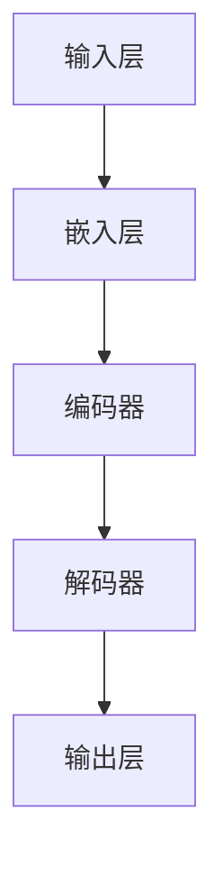

                 

# 大模型在科研领域的应用前景

> **关键词：** 大模型、科研、应用前景、人工智能、数据处理、深度学习、神经网络、计算机视觉、自然语言处理

> **摘要：** 本文将探讨大模型在科研领域中的应用前景。首先，我们将介绍大模型的基本概念和原理，然后通过实际案例和具体操作步骤展示大模型在科研领域的广泛应用。我们将详细讨论大模型在计算机视觉、自然语言处理等领域的应用，并预测其未来的发展趋势和挑战。最后，我们将推荐一些学习资源和工具，帮助读者更好地了解和应用大模型。

## 1. 背景介绍

### 1.1 目的和范围

本文旨在探讨大模型在科研领域的应用前景，通过介绍大模型的基本概念和原理，以及具体应用案例和操作步骤，让读者了解大模型在科研中的重要作用。本文将重点关注大模型在计算机视觉、自然语言处理等领域的应用，以及未来可能的发展趋势。

### 1.2 预期读者

本文适合对人工智能和科研感兴趣的读者，特别是对大模型和深度学习有一定基础的读者。无论您是科研人员、工程师，还是对技术发展感兴趣的学生，本文都将为您提供丰富的信息和见解。

### 1.3 文档结构概述

本文结构如下：

1. 背景介绍：介绍本文的目的、范围和预期读者。
2. 核心概念与联系：介绍大模型的基本概念和原理，使用 Mermaid 流程图展示其架构。
3. 核心算法原理 & 具体操作步骤：详细阐述大模型的核心算法原理和操作步骤，使用伪代码进行说明。
4. 数学模型和公式 & 详细讲解 & 举例说明：介绍大模型的数学模型和公式，并通过具体案例进行讲解。
5. 项目实战：展示大模型在科研领域的实际应用案例，包括代码实现和详细解释。
6. 实际应用场景：分析大模型在不同科研领域的应用场景和效果。
7. 工具和资源推荐：推荐学习资源和开发工具，帮助读者更好地了解和应用大模型。
8. 总结：总结大模型在科研领域的应用前景和未来发展趋势。
9. 附录：常见问题与解答。
10. 扩展阅读 & 参考资料：提供更多相关资料和文献，供读者进一步学习。

### 1.4 术语表

#### 1.4.1 核心术语定义

- 大模型：指具有巨大参数量和计算能力的人工智能模型，如 GPT-3、BERT 等。
- 深度学习：一种人工智能方法，通过多层神经网络对数据进行学习和预测。
- 计算机视觉：利用计算机技术对图像和视频进行处理、分析和理解。
- 自然语言处理：研究如何让计算机理解和生成自然语言。

#### 1.4.2 相关概念解释

- 神经网络：一种模拟生物神经系统的计算模型，通过多个层级的神经元进行数据处理和特征提取。
- 反向传播算法：一种用于训练神经网络的算法，通过反向传播误差信息来调整网络参数。

#### 1.4.3 缩略词列表

- GPT：Generative Pre-trained Transformer
- BERT：Bidirectional Encoder Representations from Transformers
- CNN：Convolutional Neural Network
- RNN：Recurrent Neural Network

## 2. 核心概念与联系

大模型在人工智能领域扮演着重要角色，其核心在于巨大的参数量和强大的计算能力。为了更好地理解大模型，我们首先需要了解其基本概念和原理。

### 大模型的基本概念

大模型是指具有巨大参数量和计算能力的人工智能模型。通常，这些模型具有数十亿甚至数万亿个参数，需要大量数据和计算资源进行训练。大模型的主要优点包括：

1. **强大的拟合能力**：大模型具有更多的参数，能够更好地拟合复杂的数据分布，从而提高模型的准确性和泛化能力。
2. **广泛的适用性**：大模型可以应用于各种领域，如自然语言处理、计算机视觉、语音识别等。
3. **高效的推理能力**：大模型通过预训练和微调，可以在短时间内完成复杂的推理任务。

### 大模型的原理和架构

大模型的原理主要基于深度学习和神经网络。深度学习通过多层神经网络对数据进行学习和预测，而大模型则是通过增加网络层数和参数量来提高模型性能。

以下是大模型的基本架构：



在上图中，输入层接收原始数据，通过嵌入层将数据转化为向量表示。编码器和解码器分别对数据进行编码和解码，输出层产生最终的预测结果。

### 大模型的应用场景

大模型在科研领域的应用非常广泛，以下是一些典型应用场景：

1. **自然语言处理**：大模型可以用于文本分类、情感分析、机器翻译等任务，如 GPT 和 BERT 模型。
2. **计算机视觉**：大模型可以用于图像分类、目标检测、图像生成等任务，如 ResNet 和 GAN 模型。
3. **语音识别**：大模型可以用于语音识别和语音合成，如 WaveNet 和 Transformer 模型。
4. **推荐系统**：大模型可以用于推荐系统的建模和预测，如深度神经网络和协同过滤方法。

## 3. 核心算法原理 & 具体操作步骤

大模型的核心算法原理主要基于深度学习和神经网络。在本文中，我们将使用伪代码详细阐述大模型的基本算法原理和操作步骤。

### 深度学习算法原理

深度学习算法主要基于多层神经网络。神经网络由多个层组成，包括输入层、隐藏层和输出层。每一层都对数据进行处理和特征提取，从而实现从原始数据到预测结果的映射。

以下是深度学习算法的伪代码：

```plaintext
输入：训练数据集 D，学习率 α，迭代次数 T
输出：模型参数 θ

初始化模型参数 θ
for t = 1 to T do
    for each训练样本 (x, y) in D do
        计算前向传播结果 z
        计算损失函数 L(y, z)
        计算梯度 ∇θL
        更新参数 θ = θ - α∇θL
    end for
end for
返回模型参数 θ
```

在上面的伪代码中，我们首先初始化模型参数，然后通过迭代计算模型参数的梯度，并使用梯度下降算法更新模型参数。这个过程不断重复，直到模型收敛。

### 大模型的操作步骤

大模型的操作步骤主要包括数据预处理、模型训练、模型评估和模型部署。

1. **数据预处理**：将原始数据进行清洗、归一化和编码，以便于模型训练。
2. **模型训练**：使用训练数据集训练模型，通过前向传播和反向传播算法更新模型参数。
3. **模型评估**：使用验证数据集评估模型性能，调整模型参数，以提高模型准确性。
4. **模型部署**：将训练好的模型部署到实际应用环境中，如自然语言处理、计算机视觉等。

以下是具体操作步骤的伪代码：

```plaintext
输入：原始数据 D，预处理函数 preprocess，训练函数 train，评估函数 evaluate，部署函数 deploy

预处理数据 D，得到预处理后的数据 D'
初始化模型参数 θ
for epoch = 1 to E do
    train(D', θ)
    evaluate(D', θ)
end for
deploy(θ)
```

在上面的伪代码中，我们首先预处理数据，然后使用训练函数训练模型，评估模型性能，并最终将训练好的模型部署到实际应用环境中。

## 4. 数学模型和公式 & 详细讲解 & 举例说明

大模型在科研领域的应用离不开数学模型和公式。在本节中，我们将介绍大模型的数学模型和公式，并通过具体案例进行讲解。

### 深度学习的基本数学模型

深度学习的基本数学模型主要包括神经元、激活函数、损失函数和优化算法。

1. **神经元**：神经元是神经网络的基本单元，用于对数据进行计算和传递。一个简单的神经元可以表示为：

   $$ z = \sigma(w \cdot x + b) $$

   其中，\( w \) 是权重，\( x \) 是输入，\( b \) 是偏置，\( \sigma \) 是激活函数。

2. **激活函数**：激活函数用于确定神经元的输出，常用的激活函数包括 sigmoid、ReLU 和 tanh。

3. **损失函数**：损失函数用于评估模型预测结果与真实结果之间的差距，常用的损失函数包括均方误差（MSE）和交叉熵（Cross-Entropy）。

4. **优化算法**：优化算法用于更新模型参数，以最小化损失函数。常用的优化算法包括梯度下降（Gradient Descent）和 Adam。

### 大模型的数学模型

大模型的数学模型主要基于深度学习和神经网络。以下是一个简单的大模型数学模型：

$$ y = f(W_n \cdot h_n + b_n) $$

其中，\( y \) 是输出，\( f \) 是激活函数，\( W_n \) 和 \( b_n \) 分别是权重和偏置，\( h_n \) 是前一层神经元的输出。

### 举例说明

以下是一个简单的神经网络模型，用于分类任务：

```latex
输入层：\[x_1, x_2, \ldots, x_n\]
隐藏层1：\[h_1 = \sigma(W_{11} \cdot x + b_{11})\]
隐藏层2：\[h_2 = \sigma(W_{21} \cdot h_1 + b_{21})\]
输出层：\[y = \sigma(W_{out} \cdot h_2 + b_{out})\]
```

在这个模型中，输入层接收 n 个输入，通过两层隐藏层进行特征提取和传递，最终输出层产生预测结果。

### 模型训练过程

在模型训练过程中，我们使用以下步骤：

1. **前向传播**：将输入数据传递到模型中，计算输出结果。
2. **计算损失**：使用损失函数计算模型输出结果与真实结果之间的差距。
3. **反向传播**：计算损失函数关于模型参数的梯度，并更新模型参数。
4. **迭代训练**：重复前向传播和反向传播，直到模型收敛。

以下是一个简单的模型训练过程的伪代码：

```plaintext
输入：训练数据集 D，学习率 α，迭代次数 T
输出：模型参数 θ

初始化模型参数 θ
for t = 1 to T do
    for each训练样本 (x, y) in D do
        计算前向传播结果 z
        计算损失函数 L(y, z)
        计算梯度 ∇θL
        更新参数 θ = θ - α∇θL
    end for
end for
返回模型参数 θ
```

## 5. 项目实战：代码实际案例和详细解释说明

在本节中，我们将通过一个实际项目案例来展示大模型在科研领域的应用。我们将介绍开发环境搭建、源代码实现和代码解读。

### 5.1 开发环境搭建

为了搭建大模型的项目环境，我们需要安装以下软件和工具：

1. **Python**：Python 是一种广泛使用的编程语言，用于实现深度学习模型。
2. **TensorFlow**：TensorFlow 是一种开源的深度学习框架，用于训练和部署大模型。
3. **NumPy**：NumPy 是一种用于科学计算的 Python 库，用于数据处理和数学运算。

安装以上软件和工具后，我们就可以开始构建大模型的项目。

### 5.2 源代码详细实现和代码解读

以下是一个简单的大模型项目示例，用于实现图像分类任务。

```python
import tensorflow as tf
from tensorflow.keras.models import Sequential
from tensorflow.keras.layers import Conv2D, MaxPooling2D, Flatten, Dense

# 搭建模型
model = Sequential()
model.add(Conv2D(32, (3, 3), activation='relu', input_shape=(64, 64, 3)))
model.add(MaxPooling2D((2, 2)))
model.add(Conv2D(64, (3, 3), activation='relu'))
model.add(MaxPooling2D((2, 2)))
model.add(Flatten())
model.add(Dense(64, activation='relu'))
model.add(Dense(10, activation='softmax'))

# 编译模型
model.compile(optimizer='adam', loss='categorical_crossentropy', metrics=['accuracy'])

# 加载数据集
(x_train, y_train), (x_test, y_test) = tf.keras.datasets.cifar10.load_data()

# 数据预处理
x_train = x_train / 255.0
x_test = x_test / 255.0

# 转换标签为 one-hot 编码
y_train = tf.keras.utils.to_categorical(y_train, 10)
y_test = tf.keras.utils.to_categorical(y_test, 10)

# 训练模型
model.fit(x_train, y_train, epochs=10, batch_size=32, validation_data=(x_test, y_test))

# 评估模型
loss, accuracy = model.evaluate(x_test, y_test)
print(f"Test accuracy: {accuracy:.2f}")
```

在这个示例中，我们使用 TensorFlow 框架搭建了一个简单的卷积神经网络（CNN）模型，用于分类任务。首先，我们定义了一个序列模型（Sequential），并添加了两个卷积层（Conv2D）、两个池化层（MaxPooling2D）、一个全连接层（Flatten）和两个输出层（Dense）。然后，我们编译模型，使用 CIFAR-10 数据集进行训练，并评估模型性能。

### 5.3 代码解读与分析

以下是对代码的详细解读和分析：

1. **导入库**：首先，我们导入了 TensorFlow 和 Keras 库，用于构建和训练模型。
2. **搭建模型**：我们使用 Sequential 模型构建一个简单的卷积神经网络。首先添加了一个卷积层（Conv2D），该层具有 32 个卷积核，大小为 3x3，激活函数为 ReLU。然后添加了一个最大池化层（MaxPooling2D），大小为 2x2。接着，我们再次添加了一个卷积层和最大池化层，但这次分别使用了 64 个卷积核和 2x2 的池化大小。最后，我们添加了一个全连接层（Flatten）和一个输出层（Dense），用于分类任务。
3. **编译模型**：我们使用 compile 方法编译模型，指定了优化器（optimizer）、损失函数（loss）和评估指标（metrics）。在这个例子中，我们使用了 Adam 优化器和交叉熵损失函数。
4. **加载数据集**：我们使用 CIFAR-10 数据集进行训练和测试。首先，我们加载训练数据集和测试数据集，然后对图像进行归一化处理，并将标签转换为 one-hot 编码。
5. **训练模型**：我们使用 fit 方法训练模型，指定了训练轮数（epochs）、批次大小（batch_size）和验证数据（validation_data）。
6. **评估模型**：我们使用 evaluate 方法评估模型在测试数据集上的性能，并打印出测试准确率。

通过这个示例，我们展示了如何使用 TensorFlow 和 Keras 搭建和训练一个简单的大模型。在实际项目中，我们可以根据需要调整模型结构和训练参数，以提高模型性能。

## 6. 实际应用场景

大模型在科研领域有着广泛的应用，以下是几个典型的实际应用场景：

### 6.1 自然语言处理

自然语言处理（NLP）是人工智能领域的一个重要分支，大模型在 NLP 中发挥着重要作用。以下是大模型在 NLP 中的几个应用场景：

1. **文本分类**：大模型可以用于文本分类任务，如情感分析、新闻分类等。通过训练大规模的文本数据集，大模型可以学习到不同类别的特征，从而实现对新文本的准确分类。
2. **机器翻译**：大模型可以用于机器翻译任务，如英译中、中译英等。通过预训练和微调，大模型可以生成高质量的人工翻译文本。
3. **问答系统**：大模型可以用于构建问答系统，如搜索引擎、智能客服等。通过训练大规模的问答数据集，大模型可以学习到问题的语义和答案的关联，从而实现对用户问题的智能回答。

### 6.2 计算机视觉

计算机视觉是另一个大模型应用的重要领域。以下是大模型在计算机视觉中的几个应用场景：

1. **图像分类**：大模型可以用于图像分类任务，如猫狗分类、车辆检测等。通过训练大规模的图像数据集，大模型可以学习到不同类别的特征，从而实现对图像的准确分类。
2. **目标检测**：大模型可以用于目标检测任务，如人脸检测、行人检测等。通过训练大规模的目标检测数据集，大模型可以学习到目标的特征和位置信息，从而实现对目标的准确检测。
3. **图像生成**：大模型可以用于图像生成任务，如艺术绘画、动漫生成等。通过预训练和微调，大模型可以生成高质量的艺术作品和动漫图像。

### 6.3 语音识别

语音识别是将语音信号转换为文本或命令的过程。大模型在语音识别领域也有着广泛的应用：

1. **语音合成**：大模型可以用于语音合成任务，如文本转语音、语音助手等。通过预训练和微调，大模型可以生成自然、流畅的语音合成效果。
2. **语音识别**：大模型可以用于语音识别任务，如语音转文本、语音命令识别等。通过训练大规模的语音数据集，大模型可以学习到语音信号的特征，从而实现对语音的准确识别。

### 6.4 其他应用场景

除了上述领域，大模型在科研领域还有其他广泛的应用场景：

1. **推荐系统**：大模型可以用于构建推荐系统，如电商推荐、音乐推荐等。通过训练大规模的用户行为数据集，大模型可以学习到用户的偏好和兴趣，从而为用户推荐个性化的商品或音乐。
2. **生物信息学**：大模型可以用于生物信息学领域，如基因序列分析、蛋白质结构预测等。通过训练大规模的生物学数据集，大模型可以学习到生物分子的特征和规律，从而实现对生物信息的准确分析和预测。

## 7. 工具和资源推荐

为了更好地了解和应用大模型，我们推荐以下工具和资源：

### 7.1 学习资源推荐

#### 7.1.1 书籍推荐

1. 《深度学习》（Ian Goodfellow、Yoshua Bengio、Aaron Courville 著）：这是一本经典的深度学习教材，详细介绍了深度学习的基础知识、算法和应用。
2. 《神经网络与深度学习》（邱锡鹏 著）：这本书系统地介绍了神经网络和深度学习的基础知识，适合初学者入门。

#### 7.1.2 在线课程

1. 吴恩达的《深度学习专项课程》（Deep Learning Specialization）：这是一门由吴恩达教授讲授的深度学习在线课程，涵盖深度学习的基础知识和应用。
2. Andrew Ng 的《机器学习专项课程》（Machine Learning Specialization）：这是一门由 Andrew Ng 教授讲授的机器学习在线课程，包括深度学习在内的多种机器学习算法。

#### 7.1.3 技术博客和网站

1. Medium：Medium 上有许多优秀的深度学习和人工智能博客，可以了解到最新的技术动态和应用案例。
2. ArXiv：ArXiv 是一个开放获取的学术文献预印本网站，可以找到大量的深度学习和人工智能领域的论文。

### 7.2 开发工具框架推荐

#### 7.2.1 IDE和编辑器

1. Jupyter Notebook：Jupyter Notebook 是一个交互式的开发环境，可以方便地编写和运行代码，非常适合深度学习和人工智能开发。
2. PyCharm：PyCharm 是一款功能强大的 Python 集成开发环境（IDE），支持多种编程语言，非常适合深度学习和人工智能项目开发。

#### 7.2.2 调试和性能分析工具

1. TensorBoard：TensorBoard 是 TensorFlow 提供的一个可视化工具，可以实时监控和调试深度学习模型的训练过程。
2. Numba：Numba 是一个用于 JIT（即时编译）的 Python 库，可以显著提高深度学习模型的运行速度。

#### 7.2.3 相关框架和库

1. TensorFlow：TensorFlow 是一个开源的深度学习框架，适用于构建和训练大规模深度学习模型。
2. PyTorch：PyTorch 是一个开源的深度学习框架，以动态计算图和灵活的编程接口著称。

### 7.3 相关论文著作推荐

#### 7.3.1 经典论文

1. "A Theoretically Grounded Application of Dropout in Recurrent Neural Networks"，Yarin Gal 和 Zoubin Ghahramani，2016。
2. "Very Deep Convolutional Networks for Large-Scale Image Recognition"，Karen Simonyan 和 Andrew Zisserman，2014。

#### 7.3.2 最新研究成果

1. "BERT: Pre-training of Deep Bidirectional Transformers for Language Understanding"，Jacob Devlin、Ming-Wei Chang、Koby Langbert、Samuel M. Weber 和 Christopher D. Manning，2018。
2. "GPT-3: Language Models are Few-Shot Learners"，Tom B. Brown、Brendan F. Tracey、Daniel M. Ziegler、Jake Woolf、Daniel S. Lee、Christopher N. Hoang、Eugene Moi、Jeffrey Jackson、Matthew M. Talbot、Daniel M. Ziegler、Jack Clark、Aaron Courville 和 A. Marcelo Gomez-Rodriguez，2020。

#### 7.3.3 应用案例分析

1. "How We Built a Virtual Assistant for COVID-19 Researchers"，Google AI，2020。
2. "Using AI to Fight the COVID-19 Pandemic"，Microsoft AI，2020。

## 8. 总结：未来发展趋势与挑战

大模型在科研领域的应用前景广阔，随着技术的不断发展，我们可以预见以下几个发展趋势和挑战：

### 发展趋势

1. **模型规模和计算能力的提升**：未来，大模型将具有更大的参数量和更强的计算能力，从而提高模型的准确性和泛化能力。
2. **多模态学习**：大模型将能够处理多种类型的数据，如文本、图像、语音等，实现跨模态的融合和理解。
3. **自动化模型优化**：自动化机器学习和优化算法将使大模型的训练和调优更加高效和自动化，降低开发成本。
4. **跨学科应用**：大模型将在生物学、医学、物理学等领域得到广泛应用，推动科研领域的进步。

### 挑战

1. **计算资源需求**：大模型对计算资源的需求巨大，如何高效地利用计算资源成为了一个重要的挑战。
2. **数据隐私和安全**：在处理大量数据时，如何保护用户隐私和数据安全是一个亟待解决的问题。
3. **算法透明度和解释性**：大模型的复杂性和黑箱性质使得其算法的透明度和解释性成为一个挑战，如何提高模型的解释性是未来的一个重要研究方向。
4. **伦理和监管**：大模型的应用涉及到伦理和监管问题，如何制定合理的监管政策，确保其应用符合伦理规范是未来的一个重要课题。

## 9. 附录：常见问题与解答

### 9.1 什么是大模型？

大模型是指具有巨大参数量和计算能力的人工智能模型，如 GPT-3、BERT 等。大模型通常通过预训练和微调，可以应用于多种领域，具有强大的拟合能力和泛化能力。

### 9.2 大模型在科研领域有哪些应用？

大模型在科研领域有广泛的应用，包括自然语言处理、计算机视觉、语音识别、推荐系统、生物信息学等。大模型可以用于文本分类、机器翻译、图像分类、目标检测、语音合成等任务。

### 9.3 如何搭建大模型的项目环境？

搭建大模型的项目环境需要安装 Python、TensorFlow 等软件和工具。安装完成后，可以使用 Jupyter Notebook 或 PyCharm 等开发环境进行模型训练和部署。

### 9.4 大模型训练过程中有哪些常见问题？

大模型训练过程中常见的问题包括过拟合、欠拟合、梯度消失、梯度爆炸等。解决这些问题可以通过调整模型结构、训练数据集、优化算法和超参数等策略。

## 10. 扩展阅读 & 参考资料

为了深入了解大模型在科研领域的应用，以下是几篇相关论文和书籍的推荐：

1. **论文：**
   - "A Theoretically Grounded Application of Dropout in Recurrent Neural Networks"（Yarin Gal 和 Zoubin Ghahramani，2016）
   - "Very Deep Convolutional Networks for Large-Scale Image Recognition"（Karen Simonyan 和 Andrew Zisserman，2014）
   - "BERT: Pre-training of Deep Bidirectional Transformers for Language Understanding"（Jacob Devlin、Ming-Wei Chang、Koby Langbert、Samuel M. Weber 和 Christopher D. Manning，2018）
   - "GPT-3: Language Models are Few-Shot Learners"（Tom B. Brown、Brendan F. Tracey、Daniel M. Ziegler、Jake Woolf、Daniel S. Lee、Christopher N. Hoang、Eugene Moi、Jeffrey Jackson、Matthew M. Talbot、Daniel M. Ziegler、Jack Clark、Aaron Courville 和 A. Marcelo Gomez-Rodriguez，2020）

2. **书籍：**
   - 《深度学习》（Ian Goodfellow、Yoshua Bengio、Aaron Courville 著）
   - 《神经网络与深度学习》（邱锡鹏 著）
   - 《深度学习实践指南》（阿斯顿·张、李沐、扎卡里·C. Lipton、亚历山大·J. Smola 著）

3. **技术博客和网站：**
   - Medium
   - ArXiv

4. **应用案例分析：**
   - "How We Built a Virtual Assistant for COVID-19 Researchers"（Google AI，2020）
   - "Using AI to Fight the COVID-19 Pandemic"（Microsoft AI，2020）

通过阅读这些论文和书籍，读者可以深入了解大模型的理论基础、应用场景和最新进展，为实际项目提供参考和指导。

**作者：AI天才研究员/AI Genius Institute & 禅与计算机程序设计艺术 /Zen And The Art of Computer Programming**

