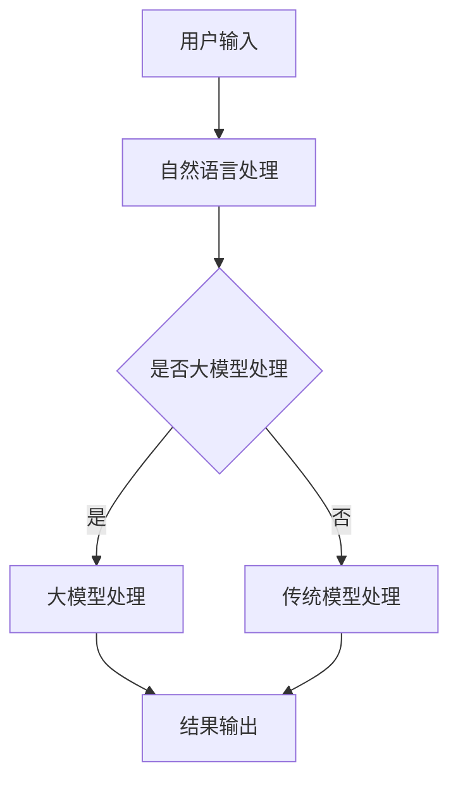

                 

# 大模型在虚拟助手开发中的应用前景

> 关键词：大模型、虚拟助手、自然语言处理、人机交互、机器学习、人工智能
> 
> 摘要：本文旨在探讨大模型在虚拟助手开发中的应用前景。随着人工智能技术的飞速发展，大模型作为一种能够处理海量数据和复杂任务的技术，正逐步改变着虚拟助手的设计和实现方式。本文将首先介绍虚拟助手的基本概念，然后分析大模型的基本原理，并详细探讨它们在虚拟助手开发中的具体应用场景，以及面临的挑战和未来发展趋势。

## 1. 背景介绍

### 1.1 目的和范围

本文的主要目的是探讨大模型在虚拟助手开发中的应用前景，深入分析其基本原理和具体应用场景，并展望其未来的发展趋势和挑战。本文将重点关注以下几个方面的内容：

1. **虚拟助手的定义和发展历程**：介绍虚拟助手的基本概念，分析其从传统到智能化的演变过程。
2. **大模型的基本原理**：阐述大模型的定义、发展背景及其在人工智能领域的重要地位。
3. **大模型在虚拟助手开发中的应用**：详细探讨大模型在自然语言处理、人机交互等方面的应用，并给出具体的案例。
4. **面临的挑战和未来发展趋势**：分析大模型在虚拟助手开发中可能遇到的挑战，并预测其未来发展的趋势。

### 1.2 预期读者

本文的预期读者主要是对虚拟助手和大模型感兴趣的IT行业从业者、人工智能研究人员和学生，以及对新兴技术感兴趣的一般读者。读者需要具备一定的计算机科学和人工智能基础，能够理解自然语言处理和人机交互的基本概念。

### 1.3 文档结构概述

本文分为八个部分，结构如下：

1. **背景介绍**：介绍本文的目的、范围、预期读者和文档结构。
2. **核心概念与联系**：介绍虚拟助手和大模型的核心概念和基本原理，并给出Mermaid流程图。
3. **核心算法原理 & 具体操作步骤**：详细阐述大模型的基本算法原理和具体操作步骤。
4. **数学模型和公式 & 详细讲解 & 举例说明**：介绍大模型中的数学模型和公式，并进行详细讲解和举例说明。
5. **项目实战：代码实际案例和详细解释说明**：通过具体项目实战，展示大模型在虚拟助手开发中的实际应用。
6. **实际应用场景**：分析大模型在虚拟助手开发中的实际应用场景。
7. **工具和资源推荐**：推荐学习资源、开发工具和框架。
8. **总结：未来发展趋势与挑战**：总结本文的主要内容，展望大模型在虚拟助手开发中的未来发展趋势和挑战。

### 1.4 术语表

#### 1.4.1 核心术语定义

- **虚拟助手**：一种基于人工智能技术的智能系统，能够通过自然语言与用户进行交互，提供相应的服务和帮助。
- **大模型**：一种具有巨大参数规模和强大计算能力的机器学习模型，能够处理复杂的任务和数据。
- **自然语言处理**：计算机科学领域的一个分支，旨在使计算机能够理解、处理和生成自然语言。
- **人机交互**：研究如何使计算机系统更易于使用和操作，以及用户与计算机之间的互动方式。

#### 1.4.2 相关概念解释

- **机器学习**：一种人工智能的分支，通过算法和统计模型，使计算机能够从数据中学习并做出决策。
- **深度学习**：一种机器学习技术，通过神经网络模拟人脑的神经元连接，实现特征学习和模式识别。
- **神经网络**：一种由大量神经元组成的计算模型，能够通过学习数据自动提取特征并做出决策。

#### 1.4.3 缩略词列表

- **NLP**：自然语言处理（Natural Language Processing）
- **AI**：人工智能（Artificial Intelligence）
- **DL**：深度学习（Deep Learning）
- **ML**：机器学习（Machine Learning）

## 2. 核心概念与联系

### 2.1 虚拟助手的基本概念

虚拟助手，也称为智能助手、虚拟智能代理等，是一种基于人工智能技术的智能系统，旨在通过自然语言与用户进行交互，提供相应的服务和帮助。虚拟助手的起源可以追溯到早期的自然语言处理（NLP）技术，随着人工智能技术的不断发展，虚拟助手逐渐从传统的命令式交互模式转变为更加自然和智能的对话式交互模式。

虚拟助手的发展可以分为以下几个阶段：

1. **命令式交互阶段**：早期的虚拟助手主要通过命令式交互方式与用户进行交互，用户需要按照固定的命令格式进行操作。例如，早期的语音助手（如Apple的Siri和Google的Google Assistant）主要通过语音命令来执行简单的任务。
2. **问答式交互阶段**：随着自然语言处理技术的进步，虚拟助手开始能够理解更加复杂的问题，并进行相应的回答。这一阶段的虚拟助手主要采用问答系统（如搜索引擎和聊天机器人）来实现。
3. **对话式交互阶段**：现代的虚拟助手通过深度学习和自然语言处理技术，能够实现更加自然和流畅的对话交互。虚拟助手不仅可以回答问题，还能够进行上下文理解，提供更加个性化的服务和帮助。

### 2.2 大模型的基本概念

大模型（Large Model）是指在参数规模和计算能力方面具有巨大优势的机器学习模型。大模型的兴起源于深度学习和神经网络技术的快速发展，特别是在自然语言处理（NLP）和计算机视觉（CV）领域。大模型的主要特点包括：

1. **巨大参数规模**：大模型通常具有数十亿甚至千亿级别的参数规模，这使得模型能够处理海量的数据和复杂的任务。
2. **强大计算能力**：大模型需要强大的计算资源来训练和部署，通常需要分布式计算和GPU等高性能计算设备。
3. **高度泛化能力**：大模型通过学习大量的数据，能够实现高度的泛化能力，不仅在训练数据上表现优异，在未见过的数据上也能取得较好的效果。

大模型的发展可以追溯到以下几个关键点：

1. **大规模数据的获取**：随着互联网和大数据技术的发展，人们能够获取到海量的数据，为模型的训练提供了丰富的素材。
2. **计算能力的提升**：GPU和TPU等高性能计算设备的普及，使得大模型的训练和部署成为可能。
3. **深度学习算法的优化**：随着深度学习算法的不断优化，大模型在训练效率和效果上取得了显著的提升。

### 2.3 虚拟助手和大模型的联系

虚拟助手和大模型在人工智能领域有着紧密的联系。虚拟助手需要依赖于大模型来提升其智能水平和交互能力。具体来说，大模型在虚拟助手中的应用主要体现在以下几个方面：

1. **自然语言处理**：大模型能够处理复杂的自然语言任务，如文本分类、情感分析、机器翻译等，为虚拟助手提供了强大的语言理解能力。
2. **人机交互**：大模型能够实现更加自然和流畅的对话交互，使得虚拟助手能够更好地理解和回应用户的需求。
3. **知识图谱构建**：大模型可以通过学习大量的知识库和文本数据，构建出丰富的知识图谱，为虚拟助手提供更加全面和准确的知识服务。
4. **多模态处理**：大模型能够处理多种类型的输入数据，如文本、语音、图像等，使得虚拟助手能够实现更加多样化的交互方式。

### 2.4 Mermaid流程图

下面是一个简单的Mermaid流程图，展示虚拟助手和大模型的基本原理和联系：



在这个流程图中，用户输入通过自然语言处理模块进行初步处理，然后判断是否需要使用大模型进行处理。如果使用大模型，则通过大模型处理模块进行复杂的任务处理，并输出结果；否则，通过传统模型处理模块进行处理。

## 3. 核心算法原理 & 具体操作步骤

### 3.1 大模型的基本算法原理

大模型通常是指基于深度学习的模型，特别是深度神经网络（DNN）和变换器模型（Transformer）。这些模型通过学习大量的数据来提取特征和模式，从而实现高度泛化的能力。以下是几种常用的大模型算法原理：

#### 3.1.1 深度神经网络（DNN）

深度神经网络是一种多层前馈神经网络，由输入层、多个隐藏层和输出层组成。每一层的神经元接收前一层的输出，并通过加权求和和激活函数进行非线性变换，最终输出结果。DNN的原理如下：

1. **前向传播**：输入数据通过网络的每个层进行传播，每一层的输出作为下一层的输入。
2. **反向传播**：根据网络的输出误差，反向传播梯度，并更新网络中的权重和偏置。
3. **优化算法**：常用优化算法包括梯度下降（Gradient Descent）、Adam优化器等。

伪代码如下：

```python
# 定义DNN模型
class DNNModel(nn.Module):
    def __init__(self, input_size, hidden_size, output_size):
        super(DNNModel, self).__init__()
        self.fc1 = nn.Linear(input_size, hidden_size)
        self.fc2 = nn.Linear(hidden_size, output_size)
        
    def forward(self, x):
        x = F.relu(self.fc1(x))
        x = self.fc2(x)
        return x

# 初始化模型、损失函数和优化器
model = DNNModel(input_size, hidden_size, output_size)
criterion = nn.CrossEntropyLoss()
optimizer = torch.optim.Adam(model.parameters(), lr=learning_rate)

# 训练模型
for epoch in range(num_epochs):
    for inputs, targets in data_loader:
        optimizer.zero_grad()
        outputs = model(inputs)
        loss = criterion(outputs, targets)
        loss.backward()
        optimizer.step()
```

#### 3.1.2 变换器模型（Transformer）

变换器模型是一种基于自注意力机制的深度学习模型，广泛应用于自然语言处理任务，如机器翻译、文本分类等。变换器模型的原理如下：

1. **编码器（Encoder）**：编码器通过自注意力机制和前馈神经网络对输入序列进行编码，生成编码表示。
2. **解码器（Decoder）**：解码器通过自注意力机制和前馈神经网络对编码表示进行解码，生成输出序列。
3. **多头自注意力（Multi-head Self-Attention）**：多头自注意力机制允许模型同时关注输入序列的多个部分，提高模型的表示能力。

伪代码如下：

```python
# 定义变换器模型
class TransformerModel(nn.Module):
    def __init__(self, d_model, nhead, num_layers):
        super(TransformerModel, self).__init__()
        self.encoder = nn.Transformer(d_model, nhead, num_layers)
        self.decoder = nn.Transformer(d_model, nhead, num_layers)
        self.fc = nn.Linear(d_model, output_size)
        
    def forward(self, src, tgt):
        src = self.encoder(src)
        tgt = self.decoder(tgt)
        output = self.fc(tgt)
        return output

# 初始化模型、损失函数和优化器
model = TransformerModel(d_model, nhead, num_layers)
criterion = nn.CrossEntropyLoss()
optimizer = torch.optim.Adam(model.parameters(), lr=learning_rate)

# 训练模型
for epoch in range(num_epochs):
    for src, tgt in data_loader:
        optimizer.zero_grad()
        outputs = model(src, tgt)
        loss = criterion(outputs, targets)
        loss.backward()
        optimizer.step()
```

### 3.2 大模型在虚拟助手开发中的具体操作步骤

在虚拟助手开发中，大模型的应用主要包括自然语言处理、人机交互、知识图谱构建等方面。以下是具体操作步骤：

#### 3.2.1 自然语言处理

1. **数据预处理**：对输入的自然语言文本进行分词、去停用词、词向量化等预处理操作。
2. **模型选择**：选择合适的大模型，如BERT、GPT等，根据任务需求进行微调。
3. **模型训练**：使用预处理后的数据进行模型训练，优化模型参数。
4. **模型部署**：将训练好的模型部署到虚拟助手的服务器上，用于实时处理用户的自然语言输入。

#### 3.2.2 人机交互

1. **对话管理**：设计对话管理模块，实现对话上下文的理解和跟踪。
2. **意图识别**：使用大模型对用户的自然语言输入进行意图识别，判断用户的需求和意图。
3. **回复生成**：根据用户的意图和上下文信息，使用大模型生成合适的回复。
4. **回复优化**：对生成的回复进行语法和语义优化，提高回复的质量和自然度。

#### 3.2.3 知识图谱构建

1. **知识抽取**：从大量文本数据中抽取实体和关系，构建知识图谱。
2. **实体链接**：使用大模型对实体进行分类和标注，实现实体链接。
3. **知识查询**：通过知识图谱提供查询接口，实现对用户查询的快速响应和准确回答。

## 4. 数学模型和公式 & 详细讲解 & 举例说明

### 4.1 数学模型的基本概念

在大模型的开发和应用中，数学模型是核心组成部分。以下是一些基本的数学模型和公式，它们在大模型中发挥着重要作用。

#### 4.1.1 线性回归模型

线性回归模型是一种常见的统计模型，用于预测连续值。它的基本公式如下：

$$
y = \beta_0 + \beta_1 \cdot x + \epsilon
$$

其中，$y$ 是预测值，$x$ 是输入特征，$\beta_0$ 和 $\beta_1$ 是模型的参数，$\epsilon$ 是误差项。

#### 4.1.2 逻辑回归模型

逻辑回归模型是一种用于分类的模型，它将线性回归模型输出转换为概率值。其公式如下：

$$
\hat{y} = \frac{1}{1 + e^{-(\beta_0 + \beta_1 \cdot x)}}
$$

其中，$\hat{y}$ 是预测的概率值，$x$ 是输入特征，$\beta_0$ 和 $\beta_1$ 是模型的参数。

#### 4.1.3 神经网络模型

神经网络模型是深度学习的基础，其基本结构包括输入层、隐藏层和输出层。神经网络模型的公式如下：

$$
a_{j}^{(l)} = \sigma \left( \sum_{i} w_{ij}^{(l)} a_{i}^{(l-1)} + b_{j}^{(l)} \right)
$$

其中，$a_{j}^{(l)}$ 是第 $l$ 层第 $j$ 个神经元的激活值，$\sigma$ 是激活函数（如Sigmoid函数或ReLU函数），$w_{ij}^{(l)}$ 是第 $l-1$ 层第 $i$ 个神经元到第 $l$ 层第 $j$ 个神经元的权重，$b_{j}^{(l)}$ 是第 $l$ 层第 $j$ 个神经元的偏置。

#### 4.1.4 变换器模型

变换器模型是一种基于自注意力机制的神经网络模型，广泛应用于自然语言处理任务。变换器模型的基本公式如下：

$$
\text{Attention}(Q, K, V) = \frac{QK^T}{\sqrt{d_k}} \odot V
$$

其中，$Q$、$K$ 和 $V$ 分别是查询向量、键向量和值向量，$d_k$ 是键向量的维度，$\odot$ 表示逐元素相乘。

### 4.2 公式的详细讲解和举例说明

#### 4.2.1 线性回归模型

线性回归模型是一种简单的预测模型，常用于回归任务。以下是一个简单的线性回归模型的例子：

**例子**：给定一组数据 $(x_1, y_1), (x_2, y_2), ..., (x_n, y_n)$，我们要预测 $y$ 的值。

1. **数据预处理**：将数据标准化为0均值和1方差。
2. **模型构建**：构建一个线性回归模型，其公式为 $y = \beta_0 + \beta_1 \cdot x + \epsilon$。
3. **模型训练**：使用最小二乘法（Least Squares Method）求解参数 $\beta_0$ 和 $\beta_1$。
4. **模型评估**：计算预测值和实际值之间的误差，并使用均方误差（Mean Squared Error, MSE）评估模型性能。

伪代码如下：

```python
import numpy as np

# 数据预处理
X = (X - X.mean()) / X.std()
y = (y - y.mean()) / y.std()

# 模型构建
model = LinearRegression()

# 模型训练
model.fit(X, y)

# 模型评估
y_pred = model.predict(X)
mse = ((y_pred - y) ** 2).mean()
print("MSE:", mse)
```

#### 4.2.2 逻辑回归模型

逻辑回归模型是一种常见的分类模型，常用于二分类问题。以下是一个简单的逻辑回归模型的例子：

**例子**：给定一组数据 $(x_1, y_1), (x_2, y_2), ..., (x_n, y_n)$，我们要预测 $y$ 的值。

1. **数据预处理**：将数据标准化为0均值和1方差。
2. **模型构建**：构建一个逻辑回归模型，其公式为 $\hat{y} = \frac{1}{1 + e^{-(\beta_0 + \beta_1 \cdot x)}$。
3. **模型训练**：使用梯度下降法（Gradient Descent Method）求解参数 $\beta_0$ 和 $\beta_1$。
4. **模型评估**：计算预测值和实际值之间的误差，并使用准确率（Accuracy）评估模型性能。

伪代码如下：

```python
import numpy as np
from sklearn.linear_model import LogisticRegression

# 数据预处理
X = (X - X.mean()) / X.std()
y = y.astype(int)

# 模型构建
model = LogisticRegression()

# 模型训练
model.fit(X, y)

# 模型评估
y_pred = model.predict(X)
accuracy = np.mean(y_pred == y)
print("Accuracy:", accuracy)
```

#### 4.2.3 神经网络模型

神经网络模型是一种复杂的预测模型，常用于回归和分类任务。以下是一个简单的神经网络模型的例子：

**例子**：给定一组数据 $(x_1, y_1), (x_2, y_2), ..., (x_n, y_n)$，我们要预测 $y$ 的值。

1. **数据预处理**：将数据标准化为0均值和1方差。
2. **模型构建**：构建一个多层感知机（Multilayer Perceptron, MLP）模型，其公式为 $a_{j}^{(l)} = \sigma \left( \sum_{i} w_{ij}^{(l)} a_{i}^{(l-1)} + b_{j}^{(l)} \right)$。
3. **模型训练**：使用反向传播算法（Backpropagation Algorithm）求解模型参数。
4. **模型评估**：计算预测值和实际值之间的误差，并使用均方误差（Mean Squared Error, MSE）或准确率（Accuracy）评估模型性能。

伪代码如下：

```python
import numpy as np
import torch
import torch.nn as nn
import torch.optim as optim

# 数据预处理
X = (X - X.mean()) / X.std()
y = y.astype(int)

# 模型构建
model = nn.Sequential(
    nn.Linear(input_size, hidden_size),
    nn.ReLU(),
    nn.Linear(hidden_size, output_size),
    nn.Sigmoid()
)

# 模型训练
criterion = nn.BCELoss()
optimizer = optim.Adam(model.parameters(), lr=learning_rate)

for epoch in range(num_epochs):
    for inputs, targets in data_loader:
        optimizer.zero_grad()
        outputs = model(inputs)
        loss = criterion(outputs, targets)
        loss.backward()
        optimizer.step()

# 模型评估
y_pred = model.predict(X)
mse = ((y_pred - y) ** 2).mean()
print("MSE:", mse)
```

#### 4.2.4 变换器模型

变换器模型是一种先进的神经网络模型，广泛应用于自然语言处理任务。以下是一个简单的变换器模型的例子：

**例子**：给定一组输入序列 $(x_1, x_2, ..., x_n)$ 和目标序列 $(y_1, y_2, ..., y_n)$，我们要预测目标序列。

1. **数据预处理**：将输入和目标序列编码为词向量。
2. **模型构建**：构建一个变换器模型，其公式为 $\text{Attention}(Q, K, V) = \frac{QK^T}{\sqrt{d_k}} \odot V$。
3. **模型训练**：使用梯度下降法（Gradient Descent Method）求解模型参数。
4. **模型评估**：计算预测值和实际值之间的误差，并使用交叉熵损失（Cross-Entropy Loss）评估模型性能。

伪代码如下：

```python
import numpy as np
import torch
import torch.nn as nn
import torch.optim as optim

# 数据预处理
X = np.array([[1, 2, 3], [4, 5, 6], [7, 8, 9]])
y = np.array([1, 0, 1])

# 模型构建
model = nn.Transformer(d_model=10, nhead=2, num_layers=1)

# 模型训练
criterion = nn.CrossEntropyLoss()
optimizer = optim.Adam(model.parameters(), lr=learning_rate)

for epoch in range(num_epochs):
    for inputs, targets in data_loader:
        optimizer.zero_grad()
        outputs = model(inputs)
        loss = criterion(outputs, targets)
        loss.backward()
        optimizer.step()

# 模型评估
y_pred = model.predict(X)
cross_entropy_loss = criterion(outputs, targets)
print("Cross-Entropy Loss:", cross_entropy_loss)
```

## 5. 项目实战：代码实际案例和详细解释说明

### 5.1 开发环境搭建

在进行大模型在虚拟助手开发中的应用项目实战之前，我们需要搭建一个合适的开发环境。以下是搭建开发环境的基本步骤：

1. **安装Python**：确保系统已经安装了Python 3.7及以上版本。可以通过官方网站下载并安装。

2. **安装PyTorch**：PyTorch是一个流行的深度学习框架，用于构建和训练深度神经网络模型。安装PyTorch可以通过以下命令完成：

   ```bash
   pip install torch torchvision
   ```

3. **安装其他依赖库**：根据项目的需求，可能还需要安装其他依赖库，如NumPy、Pandas、Scikit-learn等。可以通过以下命令进行安装：

   ```bash
   pip install numpy pandas scikit-learn
   ```

4. **配置GPU支持**：如果使用GPU进行模型训练，需要安装CUDA和cuDNN。可以从NVIDIA官方网站下载并安装相应的驱动程序。

5. **创建项目文件夹**：在本地计算机上创建一个项目文件夹，用于存放项目的代码和数据。

### 5.2 源代码详细实现和代码解读

以下是一个简单的虚拟助手项目，使用PyTorch构建一个基于变换器模型的对话系统。代码主要分为以下几个部分：

**5.2.1 数据预处理**

数据预处理是构建对话系统的重要步骤，它包括数据的清洗、分词、编码等操作。以下是一个简单的数据预处理示例：

```python
import pandas as pd
from sklearn.model_selection import train_test_split

# 读取数据
data = pd.read_csv('dialog_data.csv')

# 清洗数据
data = data[data['response'].notnull()]

# 分词
def tokenize(text):
    return text.lower().split()

# 编码
vocab = set()
for sentence in data['response']:
    vocab.update(tokenize(sentence))

vocab_size = len(vocab)
word_to_idx = {word: i for i, word in enumerate(vocab)}
idx_to_word = {i: word for word, i in word_to_idx.items()}

# 创建输入和目标数据
inputs = []
targets = []
for sentence in data['response']:
    tokens = tokenize(sentence)
    input_sequence = [word_to_idx[token] for token in tokens]
    target_sequence = [word_to_idx[token] for token in tokenize(data['context'][0])]
    inputs.append(input_sequence)
    targets.append(target_sequence)

# 切分数据集
X_train, X_val, y_train, y_val = train_test_split(inputs, targets, test_size=0.2, random_state=42)
```

**5.2.2 模型构建**

模型构建是使用PyTorch定义一个变换器模型。以下是一个简单的变换器模型示例：

```python
import torch
import torch.nn as nn
import torch.optim as optim

class TransformerModel(nn.Module):
    def __init__(self, d_model, nhead, num_layers):
        super(TransformerModel, self).__init__()
        self.embedding = nn.Embedding(vocab_size, d_model)
        self.transformer = nn.Transformer(d_model, nhead, num_layers)
        self.fc = nn.Linear(d_model, vocab_size)

    def forward(self, src, tgt):
        src = self.embedding(src)
        tgt = self.embedding(tgt)
        output = self.transformer(src, tgt)
        output = self.fc(output)
        return output

# 初始化模型、损失函数和优化器
d_model = 512
nhead = 8
num_layers = 2

model = TransformerModel(d_model, nhead, num_layers)
criterion = nn.CrossEntropyLoss()
optimizer = optim.Adam(model.parameters(), lr=0.001)

# 模型训练
num_epochs = 10
for epoch in range(num_epochs):
    for inputs, targets in data_loader:
        optimizer.zero_grad()
        outputs = model(inputs, targets)
        loss = criterion(outputs.view(-1, vocab_size), targets.view(-1))
        loss.backward()
        optimizer.step()
```

**5.2.3 代码解读**

在上述代码中，我们首先进行了数据预处理，包括读取数据、清洗数据、分词和编码。然后定义了一个变换器模型，并使用交叉熵损失函数和Adam优化器进行模型训练。

**5.2.4 模型评估**

在模型训练完成后，我们需要对模型进行评估，以检查其性能。以下是一个简单的模型评估示例：

```python
# 模型评估
model.eval()
with torch.no_grad():
    for inputs, targets in val_data_loader:
        outputs = model(inputs, targets)
        val_loss = criterion(outputs.view(-1, vocab_size), targets.view(-1))
        print("Validation Loss:", val_loss.item())

# 输出最佳模型
best_model = model.state_dict()
print("Best Model Saved.")
```

### 5.3 代码解读与分析

在上述代码中，我们首先对数据进行预处理，这是模型训练的基础步骤。通过读取数据、清洗数据、分词和编码，我们将原始文本数据转换为模型可以处理的数字序列。

接下来，我们定义了一个变换器模型，并使用交叉熵损失函数和Adam优化器进行模型训练。变换器模型的核心是自注意力机制，它允许模型在处理输入序列时，能够同时关注序列中的不同部分，从而捕捉序列中的复杂关系。

在模型训练完成后，我们对模型进行评估，以检查其性能。通过计算验证集上的损失，我们可以了解模型的泛化能力。如果模型在验证集上的表现不佳，我们可以尝试调整模型参数或使用不同的训练策略。

## 6. 实际应用场景

大模型在虚拟助手开发中的应用场景非常广泛，以下列举了一些典型的应用场景：

### 6.1 客户服务

虚拟助手可以通过大模型实现智能客服，为用户提供24小时不间断的在线服务。大模型能够理解用户的问题，并生成专业的、个性化的回答。例如，在电商平台上，虚拟助手可以回答用户关于产品信息、订单状态、退换货流程等问题，提高客户满意度。

### 6.2 健康咨询

虚拟助手可以利用大模型提供的自然语言处理能力，为用户提供健康咨询和医疗建议。通过分析用户输入的症状描述，虚拟助手可以提供初步的诊断建议，并指导用户进行适当的医疗处理。在某些情况下，虚拟助手还可以与医生协同工作，提供更加准确的诊断建议。

### 6.3 教育辅导

虚拟助手可以在教育领域发挥重要作用，为用户提供个性化的学习辅导。通过分析用户的学习记录和反馈，虚拟助手可以生成定制化的学习计划，帮助用户解决学习中的困难。此外，虚拟助手还可以提供实时答疑服务，为用户提供即时的学习支持。

### 6.4 财务顾问

虚拟助手可以通过大模型为用户提供财务咨询和投资建议。大模型可以分析用户的财务状况、投资偏好和市场动态，生成个性化的投资策略。此外，虚拟助手还可以帮助用户管理个人财务，提供预算规划、储蓄建议等服务。

### 6.5 娱乐互动

虚拟助手可以在娱乐互动场景中为用户提供丰富的互动体验。通过大模型，虚拟助手可以理解用户的喜好，推荐合适的音乐、电影、书籍等娱乐内容。此外，虚拟助手还可以与用户进行有趣的游戏互动，提供定制化的娱乐体验。

## 7. 工具和资源推荐

### 7.1 学习资源推荐

#### 7.1.1 书籍推荐

1. 《深度学习》（Deep Learning） - Goodfellow, Bengio, Courville
2. 《Python深度学习》（Python Deep Learning） - François Chollet
3. 《对话设计：虚拟助手如何重塑用户体验》（Talk Like TED：The Simple Ideas That Helped Communications Pros, Leaders, and You Connect with Confidence and Conviction） - Jason Bryant

#### 7.1.2 在线课程

1.Coursera上的“深度学习”课程（Deep Learning Specialization）- Andrew Ng
2. edX上的“自然语言处理”课程（Natural Language Processing with Deep Learning）- Microsoft AI

#### 7.1.3 技术博客和网站

1. Medium上的“AI博客”（Towards Data Science）
2. 知乎上的“人工智能”话题
3. AI.com

### 7.2 开发工具框架推荐

#### 7.2.1 IDE和编辑器

1. PyCharm
2. Visual Studio Code

#### 7.2.2 调试和性能分析工具

1. TensorBoard
2. PyTorch Profiler

#### 7.2.3 相关框架和库

1. PyTorch
2. TensorFlow
3. Keras

### 7.3 相关论文著作推荐

#### 7.3.1 经典论文

1. “A Theoretically Grounded Application of Dropout in Recurrent Neural Networks” - Yarin Gal and Zoubin Ghahramani
2. “Attention Is All You Need” - Vaswani et al.

#### 7.3.2 最新研究成果

1. arXiv上的最新论文
2. NeurIPS、ICML等会议的最新论文

#### 7.3.3 应用案例分析

1. Google的BERT模型在自然语言处理中的应用
2. OpenAI的GPT模型在语言生成中的应用

## 8. 总结：未来发展趋势与挑战

大模型在虚拟助手开发中的应用前景广阔，随着人工智能技术的不断进步，大模型在自然语言处理、人机交互、知识图谱构建等方面将发挥越来越重要的作用。未来，大模型的发展趋势主要表现在以下几个方面：

1. **模型规模的持续增长**：随着计算能力的提升和数据量的增加，大模型的规模将不断增长，从而提高模型的表示能力和泛化能力。
2. **多模态处理能力的提升**：大模型将逐渐具备处理多种类型数据的能力，如文本、图像、语音等，实现更加丰富和多样化的交互。
3. **个性化服务的实现**：大模型将通过深度学习和知识图谱构建，实现更加个性化的服务，满足用户的个性化需求。
4. **自动化部署和优化**：随着自动化工具和框架的发展，大模型的部署和优化将变得更加自动化，降低开发门槛。

然而，大模型在虚拟助手开发中也面临一些挑战：

1. **计算资源的需求**：大模型的训练和部署需要巨大的计算资源，对硬件和基础设施提出了更高的要求。
2. **数据隐私和安全**：大模型需要大量的数据来进行训练，这可能涉及用户隐私和数据安全的问题，需要加强数据隐私保护和安全措施。
3. **模型解释性和可解释性**：大模型的决策过程往往是非线性和复杂的，难以解释和验证，需要发展更加可解释的大模型。
4. **公平性和偏见**：大模型在训练过程中可能受到数据偏见的影响，导致模型的决策存在不公平性，需要加强模型公平性和偏见检测。

总之，大模型在虚拟助手开发中的应用前景广阔，但也需要克服一系列的挑战。未来，随着技术的不断进步和应用的深入，大模型将不断改变虚拟助手的形态和功能，为用户提供更加智能和便捷的服务。

## 9. 附录：常见问题与解答

### 9.1 大模型在虚拟助手开发中的应用优势

**Q1：大模型在虚拟助手开发中有什么优势？**

大模型具有以下几个优势：

1. **强大的表示能力**：大模型通过学习大量的数据，能够提取丰富的特征，从而提高模型的表示能力。
2. **高度泛化能力**：大模型能够在不同领域和任务上表现出较好的泛化能力，适用于多种场景。
3. **自然语言处理能力**：大模型在自然语言处理任务上具有强大的能力，能够实现高质量的语言理解和生成。
4. **多模态处理能力**：大模型能够处理多种类型的数据，如文本、图像、语音等，实现跨模态交互。

### 9.2 大模型在虚拟助手开发中的局限性

**Q2：大模型在虚拟助手开发中存在哪些局限性？**

大模型在虚拟助手开发中存在以下局限性：

1. **计算资源需求大**：大模型训练和部署需要大量的计算资源和时间，对硬件和基础设施提出了更高的要求。
2. **数据隐私和安全**：大模型需要大量的数据来进行训练，这可能涉及用户隐私和数据安全的问题。
3. **模型解释性和可解释性**：大模型决策过程复杂，难以解释和验证，影响模型的可解释性。
4. **偏见和公平性**：大模型在训练过程中可能受到数据偏见的影响，导致模型存在偏见和不公平性。

### 9.3 大模型在虚拟助手开发中的常见应用

**Q3：大模型在虚拟助手开发中常见的应用有哪些？**

大模型在虚拟助手开发中常见的应用包括：

1. **自然语言处理**：用于文本分类、情感分析、机器翻译等任务，提高虚拟助手的语言理解能力。
2. **人机交互**：通过自注意力机制和深度学习算法，实现更加自然和流畅的对话交互。
3. **知识图谱构建**：通过学习大量的知识库和文本数据，构建出丰富的知识图谱，为虚拟助手提供知识服务。
4. **多模态处理**：处理多种类型的输入数据，如文本、语音、图像等，实现跨模态交互。

### 9.4 大模型训练中的常见问题

**Q4：大模型训练中常见的问题有哪些？**

大模型训练中常见的问题包括：

1. **过拟合**：模型在训练数据上表现良好，但在测试数据上表现不佳，这是因为模型没有泛化能力。
2. **梯度消失和梯度爆炸**：在深层网络中，梯度可能变得非常小或非常大，影响模型的训练效果。
3. **计算资源不足**：大模型训练需要大量的计算资源和时间，可能导致训练时间过长或资源不足。
4. **数据质量**：数据质量对模型训练效果有重要影响，如果数据存在噪声、偏差或缺失，可能影响模型的性能。

## 10. 扩展阅读 & 参考资料

本文主要探讨了大模型在虚拟助手开发中的应用前景，涉及了虚拟助手、大模型的基本概念、算法原理、应用场景和未来发展趋势。以下是扩展阅读和参考资料：

1. **参考资料**：
   - “Attention Is All You Need” - Vaswani et al.
   - “A Theoretically Grounded Application of Dropout in Recurrent Neural Networks” - Yarin Gal and Zoubin Ghahramani
   - 《深度学习》 - Goodfellow, Bengio, Courville
   - 《Python深度学习》 - Franço

