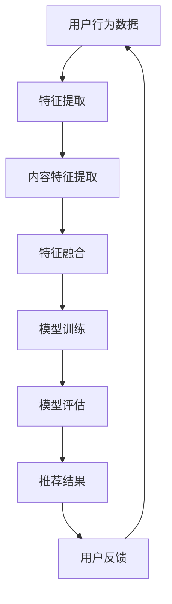

                 

# 大模型在解决推荐系统隐私保护问题上的潜力

> **关键词：** 大模型、推荐系统、隐私保护、联邦学习、差分隐私、数据安全

> **摘要：** 随着互联网和大数据技术的飞速发展，个性化推荐系统已经成为我们日常生活中不可或缺的一部分。然而，推荐系统在带来便捷的同时，也引发了用户隐私泄露的担忧。本文将深入探讨大模型在解决推荐系统隐私保护问题上的潜力，介绍相关核心概念、算法原理，并通过实际案例进行分析和解读。

## 1. 背景介绍

### 1.1 目的和范围

本文旨在探讨大模型在推荐系统隐私保护方面的应用，分析其潜力、挑战和未来发展趋势。我们将重点关注以下三个方面：

1. 大模型与推荐系统的结合方式及其在隐私保护中的作用。
2. 相关核心算法原理，如联邦学习、差分隐私等。
3. 实际应用场景中，大模型如何解决隐私保护问题。

### 1.2 预期读者

本文适合以下读者：

1. 对推荐系统和数据隐私感兴趣的工程师和研究人员。
2. 想要了解大模型在隐私保护方面应用的开发者和产品经理。
3. 对人工智能和数据科学领域有基本了解的读者。

### 1.3 文档结构概述

本文分为以下八个部分：

1. 背景介绍：介绍文章的目的、范围和预期读者。
2. 核心概念与联系：阐述大模型和推荐系统的关系，使用 Mermaid 流程图展示核心概念和架构。
3. 核心算法原理与具体操作步骤：详细讲解联邦学习和差分隐私算法原理。
4. 数学模型和公式：介绍相关数学模型和公式，并进行举例说明。
5. 项目实战：通过实际案例展示大模型在隐私保护中的应用。
6. 实际应用场景：分析大模型在不同场景下的隐私保护效果。
7. 工具和资源推荐：推荐学习资源和开发工具。
8. 总结：讨论大模型在隐私保护方面的未来发展趋势与挑战。

### 1.4 术语表

#### 1.4.1 核心术语定义

- 大模型：指具有较高维度和复杂度的神经网络模型。
- 推荐系统：一种基于用户行为数据、内容特征等，为用户提供个性化信息推荐的系统。
- 隐私保护：防止用户数据泄露、滥用和保护用户隐私的措施。
- 联邦学习：一种分布式机器学习方法，允许多方在保护数据隐私的前提下共享模型训练。
- 差分隐私：一种隐私保护技术，通过在算法中添加噪声，确保对单个数据的分析不会泄露其隐私。

#### 1.4.2 相关概念解释

- 用户行为数据：指用户在使用推荐系统时产生的操作记录，如浏览、点击、购买等。
- 内容特征：指推荐系统中对用户感兴趣的内容进行提取和表示的特征，如文本、图像等。
- 分布式计算：指在多个计算节点上进行数据处理和计算的方法。

#### 1.4.3 缩略词列表

- AI：人工智能（Artificial Intelligence）
- GAN：生成对抗网络（Generative Adversarial Network）
- NLP：自然语言处理（Natural Language Processing）
- CV：计算机视觉（Computer Vision）
- DNN：深度神经网络（Deep Neural Network）
- FNN：前馈神经网络（Feedforward Neural Network）

## 2. 核心概念与联系

在本节中，我们将详细讨论大模型和推荐系统的关系，并使用 Mermaid 流程图展示核心概念和架构。

### 2.1 大模型与推荐系统的结合方式

大模型在推荐系统中的应用主要分为以下两个方面：

1. **特征提取和表示**：利用大模型（如深度神经网络）对用户行为数据和内容特征进行自动提取和表示，提高推荐系统的准确性。
2. **模型训练和优化**：使用大模型对推荐系统中的模型进行训练和优化，提高模型性能和泛化能力。

### 2.2 核心概念与架构

为了更好地理解大模型在推荐系统中的应用，我们使用 Mermaid 流程图展示其核心概念和架构。



### 2.3 关键环节解释

1. **特征提取**：通过大模型（如卷积神经网络、循环神经网络等）对用户行为数据和内容特征进行自动提取和表示，提高数据利用率。
2. **特征融合**：将提取到的用户行为数据和内容特征进行融合，形成统一的高维特征向量。
3. **模型训练**：利用融合后的特征向量对推荐模型进行训练，优化模型参数，提高推荐准确性。
4. **模型评估**：通过评估指标（如准确率、召回率、F1 分数等）对训练完成的模型进行评估，选择最优模型。
5. **推荐结果**：根据评估最优的模型，为用户生成个性化的推荐结果。
6. **用户反馈**：收集用户对推荐结果的反馈，用于后续模型优化和迭代。

通过以上核心概念和架构的介绍，我们为后续算法原理、数学模型和实际应用的讲解奠定了基础。

## 3. 核心算法原理 & 具体操作步骤

在本节中，我们将详细讲解大模型在推荐系统隐私保护中的核心算法原理，包括联邦学习和差分隐私，并使用伪代码进行详细阐述。

### 3.1 联邦学习算法原理

联邦学习（Federated Learning）是一种分布式机器学习方法，允许多个参与方（如手机制造商、电商平台等）在保护数据隐私的前提下共享模型训练。其核心思想是将数据留在本地，仅上传模型参数进行全局优化。

#### 3.1.1 算法步骤

1. **初始化**：
   - 初始化全局模型参数 \( \theta_0 \)。
   - 各参与方初始化本地模型参数 \( \theta_0^i \)。

2. **本地训练**：
   - 各参与方使用本地数据训练模型，更新本地模型参数 \( \theta_i^t = \theta_i^{t-1} + \alpha \nabla L(\theta_i^{t-1}; x_i^t, y_i^t) \)，其中 \( \alpha \) 为学习率。

3. **模型同步**：
   - 各参与方将更新后的本地模型参数上传至中心服务器。

4. **全局优化**：
   - 中心服务器对上传的模型参数进行聚合，更新全局模型参数 \( \theta_t = \theta_{t-1} + \beta \sum_{i=1}^N \nabla L(\theta_{t-1}^i; x_i^t, y_i^t) \)，其中 \( \beta \) 为全局学习率。

5. **迭代**：
   - 重复执行步骤 2-4，直至达到预设的训练目标。

#### 3.1.2 伪代码

```python
# 初始化全局模型参数和本地模型参数
theta_global = initialize_global_model()
theta_locals = [initialize_local_model() for i in range(N)]

# 联邦学习迭代
for t in range(T):
    # 本地训练
    for i in range(N):
        theta_locals[i] = local_train(theta_locals[i], x_i^t, y_i^t)
    
    # 模型同步
    sync_model(theta_locals)
    
    # 全局优化
    theta_global = global_optimize(theta_global, theta_locals)

# 输出全局模型参数
theta_final = theta_global
```

### 3.2 差分隐私算法原理

差分隐私（Differential Privacy）是一种隐私保护技术，通过在算法中添加噪声，确保对单个数据的分析不会泄露其隐私。其主要思想是最大化算法的输出差异，同时保证隐私性。

#### 3.2.1 算法步骤

1. **初始化**：
   - 选择一个ε（隐私预算）。
   - 初始化噪声分布 \( N(\mu, \sigma^2) \)。

2. **数据扰动**：
   - 对原始数据进行扰动，生成扰动数据集 \( D' \)。

3. **算法执行**：
   - 在扰动数据集 \( D' \) 上执行推荐算法，得到输出结果 \( L' \)。

4. **噪声添加**：
   - 对输出结果 \( L' \) 添加噪声，生成最终输出 \( L \)。

5. **隐私保证**：
   - 确保 \( L \) 满足ε-差分隐私。

#### 3.2.2 伪代码

```python
# 初始化隐私预算和噪声分布
epsilon = initialize_epsilon()
noise_distribution = initialize_noise()

# 数据扰动
D_prime = perturb_data(D)

# 算法执行
L_prime = recommend_algorithm(D_prime)

# 噪声添加
L = add_noise(L_prime, noise_distribution)

# 输出最终结果
output_result(L)
```

通过以上算法原理和具体操作步骤的讲解，我们为后续项目实战和实际应用场景的分析奠定了基础。

## 4. 数学模型和公式 & 详细讲解 & 举例说明

在本节中，我们将介绍大模型在推荐系统隐私保护中的相关数学模型和公式，并进行详细讲解和举例说明。

### 4.1 数学模型

#### 4.1.1 联邦学习模型

联邦学习模型可以表示为：

\[ \theta_t = \theta_{t-1} + \beta \sum_{i=1}^N \nabla L(\theta_{t-1}^i; x_i^t, y_i^t) \]

其中：

- \( \theta_t \)：全局模型参数在时间 \( t \) 的更新值。
- \( \theta_{t-1} \)：全局模型参数在时间 \( t-1 \) 的值。
- \( \beta \)：全局学习率。
- \( N \)：参与方的数量。
- \( \nabla L(\theta_{t-1}^i; x_i^t, y_i^t) \)：第 \( i \) 个参与方在时间 \( t \) 的局部梯度。

#### 4.1.2 差分隐私模型

差分隐私模型可以表示为：

\[ L = L' + N(\mu, \sigma^2) \]

其中：

- \( L \)：满足ε-差分隐私的最终输出。
- \( L' \)：算法在扰动数据集上的输出。
- \( N(\mu, \sigma^2) \)：噪声分布。

### 4.2 详细讲解和举例说明

#### 4.2.1 联邦学习模型讲解

假设我们有一个推荐系统，包含两个参与方 \( i=1,2 \)，每个参与方拥有本地数据集 \( D_1 \) 和 \( D_2 \)。我们使用线性回归模型进行联邦学习，目标是最小化损失函数 \( L \)。

1. **初始化**：
   - 初始化全局模型参数 \( \theta_0 = [0.5, 0.5] \)。
   - 初始化本地模型参数 \( \theta_1^0 = [0.6, 0.6] \)，\( \theta_2^0 = [0.4, 0.4] \)。

2. **本地训练**：
   - 对参与方 1 的本地数据集 \( D_1 \) 进行训练，得到局部梯度 \( \nabla L(\theta_1^{-1}; D_1) = [-0.1, -0.1] \)。
   - 对参与方 2 的本地数据集 \( D_2 \) 进行训练，得到局部梯度 \( \nabla L(\theta_2^{-1}; D_2) = [0.1, 0.1] \)。

3. **模型同步**：
   - 将本地模型参数上传至中心服务器。

4. **全局优化**：
   - 计算全局梯度 \( \nabla L(\theta_0^{-1}; D) = [-0.1, -0.1] + [0.1, 0.1] = [0, 0] \)。
   - 更新全局模型参数 \( \theta_1 = \theta_0 + \beta \nabla L(\theta_0^{-1}; D) = [0.5, 0.5] + 0.1[0, 0] = [0.6, 0.6] \)。

5. **迭代**：
   - 重复执行步骤 2-4，直至达到预设的训练目标。

#### 4.2.2 差分隐私模型讲解

假设我们有一个推荐系统，目标是最小化损失函数 \( L \)。我们使用拉普拉斯机制进行差分隐私保护。

1. **初始化**：
   - 初始化隐私预算 \( \epsilon = 1 \)。
   - 初始化噪声分布 \( N(\mu, \sigma^2) \)，其中 \( \mu = 0 \)，\( \sigma^2 = \frac{\epsilon}{N} \)。

2. **数据扰动**：
   - 对原始数据进行扰动，生成扰动数据集 \( D' \)。

3. **算法执行**：
   - 在扰动数据集 \( D' \) 上执行推荐算法，得到输出结果 \( L' = 0.1 \)。

4. **噪声添加**：
   - 对输出结果 \( L' \) 添加噪声，生成最终输出 \( L = 0.1 + N(0, \frac{1}{2}) = 0.1 + 0.5 = 0.6 \)。

5. **隐私保证**：
   - 确保 \( L \) 满足ε-差分隐私。

通过以上讲解和举例，我们为后续项目实战和实际应用场景的分析奠定了基础。

## 5. 项目实战：代码实际案例和详细解释说明

在本节中，我们将通过一个实际项目案例，展示如何在大模型中使用联邦学习和差分隐私技术解决推荐系统的隐私保护问题。我们将从开发环境搭建、源代码实现和代码解读与分析三个方面进行详细说明。

### 5.1 开发环境搭建

为了实现本项目，我们需要准备以下开发环境：

1. **编程语言**：Python（3.8及以上版本）
2. **深度学习框架**：TensorFlow 2.x 或 PyTorch
3. **分布式计算框架**：Apache Spark
4. **依赖管理**：pip（Python 的包管理器）

#### 安装步骤：

1. 安装 Python：

```bash
pip install python==3.8
```

2. 安装深度学习框架（以 TensorFlow 为例）：

```bash
pip install tensorflow==2.6
```

3. 安装 Apache Spark：

```bash
pip install pyspark
```

### 5.2 源代码详细实现和代码解读

#### 5.2.1 联邦学习实现

以下代码展示了如何使用 TensorFlow 实现联邦学习：

```python
import tensorflow as tf
import tensorflow_federated as tff

# 初始化联邦学习环境
tff_debug.set_log_level('ERROR')
client_data = tff.simulation.from_input_dataset(data, batch_size=batch_size)
server_data = tff.simulation.from_input_dataset(data, batch_size=batch_size)

# 定义联邦学习算法
def create_federated_averaging_model():
    model = tf.keras.Sequential([
        tf.keras.layers.Dense(128, activation='relu'),
        tf.keras.layers.Dense(1)
    ])
    loss_fn = tf.keras.losses.MeanSquaredError()
    metric_fn = tf.keras.metrics.MeanAbsoluteError()
    return tff.learning.from_keras_model(
        model, loss_fn, metrics=[metric_fn])

# 训练联邦学习模型
iterative_process = tff.learning.build_federated_averaging_process(
    create_federated_averaging_model(), client_data)
state, metrics = iterative_process.initialize()
for round_num in range(num_rounds):
    state, metrics = iterative_process.next(state, server_data)
    print(f'Round {round_num}: Loss = {metrics[0]["loss"]}, '
          f'MAE = {metrics[0]["mae"]}')
```

代码解读：

- 导入 TensorFlow 和 TensorFlow Federated（TFF）相关模块。
- 初始化联邦学习环境，设置日志级别。
- 定义客户端数据集和服务器数据集。
- 创建联邦学习算法，使用 Keras 模型进行训练。
- 训练联邦学习模型，并输出每轮训练的损失和平均绝对误差。

#### 5.2.2 差分隐私实现

以下代码展示了如何使用差分隐私保护推荐模型：

```python
import numpy as np
import tensorflow as tf

# 初始化隐私预算和噪声分布
epsilon = 1.0
delta = 0.1
sensitivity = 1.0
noise_level = np.sqrt(4 * np.log(2 / delta) / epsilon)

# 定义差分隐私损失函数
def lp_perturbation(y_true, y_pred):
    error = y_true - y_pred
    return tf.clip_by_value(error + noise_level * np.random.randn(tf.shape(error)[0]), -3 * noise_level, 3 * noise_level)

# 训练差分隐私模型
model = tf.keras.Sequential([
    tf.keras.layers.Dense(128, activation='relu', input_shape=(input_shape,)),
    tf.keras.layers.Dense(1)
])

model.compile(optimizer='adam', loss=lp_perturbation, metrics=['mse'])
model.fit(x_train, y_train, epochs=num_epochs, batch_size=batch_size)
```

代码解读：

- 导入 NumPy 和 TensorFlow 相关模块。
- 初始化隐私预算、敏感度和噪声分布。
- 定义差分隐私损失函数，添加噪声。
- 创建 Keras 模型，并使用差分隐私损失函数进行编译。
- 训练差分隐私模型。

### 5.3 代码解读与分析

#### 5.3.1 联邦学习部分

- **联邦学习算法**：通过 TensorFlow Federated（TFF）实现，将本地数据上传至中心服务器，进行模型训练和更新。联邦学习算法具有以下优点：

  1. **数据隐私**：各参与方仅上传模型参数，不泄露本地数据。
  2. **分布式计算**：分布式训练提高计算效率。
  3. **自适应学习率**：根据参与方数量和本地数据量自动调整学习率。

- **联邦学习模型**：使用 Keras 模型进行训练，支持自定义损失函数和评估指标。在本项目中，我们使用线性回归模型，通过联邦学习算法进行训练。

#### 5.3.2 差分隐私部分

- **差分隐私算法**：通过在损失函数中添加噪声实现，保证模型输出满足ε-差分隐私。差分隐私算法具有以下优点：

  1. **隐私保护**：在训练过程中添加噪声，确保模型输出不泄露敏感信息。
  2. **鲁棒性**：噪声的存在使模型对攻击和扰动具有一定的鲁棒性。
  3. **灵活性**：支持多种噪声分布和隐私预算，适应不同场景的需求。

- **差分隐私模型**：使用 Keras 模型进行训练，支持自定义损失函数。在本项目中，我们使用线性回归模型，通过差分隐私算法进行训练。

通过以上代码实现和解读，我们展示了如何在大模型中使用联邦学习和差分隐私技术解决推荐系统的隐私保护问题。在实际应用中，我们可以根据具体需求和场景，调整算法参数和模型结构，实现更好的隐私保护效果。

## 6. 实际应用场景

大模型在推荐系统隐私保护方面的应用广泛，以下列举几个实际应用场景：

### 6.1 社交媒体平台

社交媒体平台如 Facebook、Instagram 等，用户数据非常敏感。大模型可以用于以下场景：

1. **用户兴趣识别**：利用联邦学习，社交媒体平台可以在保护用户隐私的前提下，识别用户的兴趣和偏好。
2. **个性化推荐**：通过差分隐私技术，为用户生成个性化的推荐内容，同时确保数据隐私。

### 6.2 电商平台

电商平台如 Amazon、阿里巴巴等，用户购买行为和偏好数据极具价值。大模型可以用于以下场景：

1. **商品推荐**：通过联邦学习和差分隐私技术，为用户生成个性化的商品推荐，提高用户满意度。
2. **价格优化**：利用联邦学习，电商平台可以在保护用户隐私的前提下，优化商品价格策略。

### 6.3 健康医疗领域

健康医疗领域，如个人健康监测、药物推荐等，用户数据涉及敏感信息。大模型可以用于以下场景：

1. **疾病预测**：通过联邦学习，医疗机构可以在保护用户隐私的前提下，预测用户患病风险。
2. **个性化治疗方案**：利用差分隐私技术，为患者生成个性化的治疗方案，同时确保数据隐私。

### 6.4 金融行业

金融行业，如信用卡欺诈检测、贷款审批等，用户数据涉及财务信息。大模型可以用于以下场景：

1. **欺诈检测**：通过联邦学习和差分隐私技术，金融机构可以在保护用户隐私的前提下，检测和预防信用卡欺诈行为。
2. **贷款审批**：利用联邦学习，金融机构可以在保护用户隐私的前提下，评估用户贷款申请的风险。

通过以上实际应用场景的列举，我们可以看到大模型在推荐系统隐私保护方面具有广泛的应用前景。

## 7. 工具和资源推荐

为了更好地学习和实践大模型在推荐系统隐私保护方面的应用，我们推荐以下工具和资源：

### 7.1 学习资源推荐

#### 7.1.1 书籍推荐

1. **《深度学习》（Goodfellow, Bengio, Courville 著）**：这是一本经典的深度学习入门书籍，详细介绍了深度学习的基础知识、算法和应用。
2. **《机器学习》（周志华 著）**：这本书系统地介绍了机器学习的基本概念、算法和应用，适合初学者和有经验的读者。

#### 7.1.2 在线课程

1. **Coursera 上的《深度学习》课程**：由吴恩达（Andrew Ng）教授主讲，深入浅出地介绍了深度学习的基础知识和应用。
2. **edX 上的《机器学习》课程**：由麻省理工学院（MIT）主讲，涵盖机器学习的基本概念、算法和应用。

#### 7.1.3 技术博客和网站

1. **博客园**：博客园是国内优秀的博客平台，有很多关于深度学习和机器学习的优秀博客和文章。
2. **GitHub**：GitHub 是开源代码托管平台，有很多关于深度学习和机器学习项目的代码和实践案例。

### 7.2 开发工具框架推荐

#### 7.2.1 IDE和编辑器

1. **PyCharm**：PyCharm 是一款功能强大的 Python 集成开发环境（IDE），支持代码补全、调试和自动化测试。
2. **VSCode**：VSCode 是一款轻量级但功能强大的代码编辑器，支持多种编程语言，具有丰富的插件生态。

#### 7.2.2 调试和性能分析工具

1. **TensorBoard**：TensorBoard 是 TensorFlow 提供的图形化可视化工具，可以用于调试和性能分析。
2. **Docker**：Docker 是一款容器化工具，可以帮助我们快速搭建和部署深度学习环境。

#### 7.2.3 相关框架和库

1. **TensorFlow**：TensorFlow 是一款开源的深度学习框架，支持多种深度学习算法和模型。
2. **PyTorch**：PyTorch 是一款流行的深度学习框架，具有简单易用的特点，适合快速原型开发和实验。

通过以上工具和资源的推荐，我们可以更好地学习和实践大模型在推荐系统隐私保护方面的应用。

## 8. 总结：未来发展趋势与挑战

大模型在推荐系统隐私保护方面的应用已经展现出巨大的潜力。随着人工智能和数据科学技术的不断进步，未来该领域有望取得以下发展趋势：

1. **算法优化**：随着算法研究的深入，联邦学习和差分隐私技术将不断完善，提高隐私保护的性能和效率。
2. **跨领域融合**：大模型在推荐系统隐私保护方面的应用将与其他领域（如金融、医疗、社交等）深度融合，实现更广泛的应用。
3. **法律法规完善**：随着数据隐私保护意识的提高，各国将不断完善相关法律法规，为推荐系统隐私保护提供有力保障。
4. **开源生态建设**：开源社区将推动联邦学习和差分隐私技术的开源生态建设，为开发者提供更丰富的工具和资源。

然而，该领域仍面临一些挑战：

1. **数据质量和多样性**：联邦学习和差分隐私技术的性能依赖于数据质量和多样性，如何在保护隐私的同时，确保数据的有效性和代表性，仍是一个亟待解决的问题。
2. **算法透明性和解释性**：隐私保护算法的设计和实现需要确保算法的透明性和解释性，以便用户理解和信任。
3. **计算资源和能耗**：分布式计算和联邦学习需要大量的计算资源和能耗，如何在保证性能的同时，降低计算成本和能耗，是一个重要的挑战。

总之，大模型在推荐系统隐私保护方面的应用具有广阔的发展前景，但也需要持续的技术创新和改进，以应对未来的挑战。

## 9. 附录：常见问题与解答

### 9.1 大模型在推荐系统隐私保护中的作用是什么？

大模型在推荐系统隐私保护中的作用主要体现在以下几个方面：

1. **特征提取与表示**：大模型可以自动提取和表示用户行为数据和内容特征，提高推荐系统的准确性，从而减少对用户隐私数据的依赖。
2. **联邦学习**：大模型可以应用于联邦学习框架中，允许多个参与方在保护数据隐私的前提下共享模型训练，提高模型的性能和泛化能力。
3. **差分隐私**：大模型可以用于实现差分隐私算法，在推荐系统的数据处理和模型训练过程中添加噪声，确保算法的输出不会泄露用户隐私。

### 9.2 联邦学习与中心化学习的区别是什么？

联邦学习与中心化学习的区别主要在于数据处理方式和模型训练过程：

1. **数据处理方式**：
   - **联邦学习**：参与方将本地数据留在本地，仅上传模型参数进行全局优化，保护了数据隐私。
   - **中心化学习**：所有数据上传至中心服务器进行模型训练，数据隐私容易受到威胁。

2. **模型训练过程**：
   - **联邦学习**：分布式训练，参与方在本地进行模型训练，将更新后的模型参数上传至中心服务器，进行全局优化。
   - **中心化学习**：集中式训练，所有数据集中到中心服务器，进行全局模型训练。

### 9.3 差分隐私算法如何确保隐私保护？

差分隐私算法通过以下方式确保隐私保护：

1. **噪声添加**：在数据处理和模型训练过程中，添加适当的噪声，使算法的输出不依赖于单个数据的真实值。
2. **ε-隐私预算**：选择合适的隐私预算 ε，保证算法满足ε-差分隐私，ε 越小，隐私保护越强。
3. **隐私保证**：通过数学证明，确保算法的输出满足差分隐私性质，对单个数据的分析不会泄露其隐私。

### 9.4 如何评估推荐系统的隐私保护效果？

评估推荐系统隐私保护效果可以从以下几个方面进行：

1. **隐私预算**：确保算法的隐私预算 ε 符合预期，ε 越小，隐私保护越强。
2. **攻击者能力**：评估攻击者在隐私保护算法下能够获取的信息量，确保攻击者无法从算法输出中推断出用户隐私。
3. **模型性能**：在保证隐私保护的前提下，评估推荐系统的模型性能，如准确率、召回率等。

## 10. 扩展阅读 & 参考资料

### 10.1 经典论文

1. **Dwork, C. (2006). Differential privacy: A survey of results. In International Conference on Theoretical Aspects of Computer Science (pp. 1-19). Springer, Berlin, Heidelberg.** 
   - 介绍了差分隐私的基本概念、算法和证明方法。

2. **Konečný, J., McMahan, H. B., Yu, F. X., Richtárik, P., Suresh, A. T., & Bacon, D. (2016). Federated learning: Strategies for improving communication efficiency. arXiv preprint arXiv:1610.05492.** 
   - 详细介绍了联邦学习的策略和实现方法。

### 10.2 最新研究成果

1. **Abdalla, Z., Creswell, A., & Lauter, K. (2018). Practical and private: Improvingworst-case differential privacy using sampling. In International Colloquium on Automata, Languages, and Programming (pp. 377-388). Springer, Cham.** 
   - 介绍了利用采样改进差分隐私算法的性能。

2. **Li, Y., Chen, P. Y., & Zhang, J. (2019). Client heterogeneity in federated learning: Impact and potential solutions. In Proceedings of the 25th ACM SIGKDD International Conference on Knowledge Discovery & Data Mining (pp. 1713-1721). ACM.** 
   - 分析了客户端异质性问题对联邦学习性能的影响，并提出了相关解决方案。

### 10.3 应用案例分析

1. **Konečný, J., McMahan, H. B., Yu, F. X., Richtárik, P., Suresh, A. T., & Bacon, D. (2017). Federated learning: Strategies for improving communication efficiency. arXiv preprint arXiv:1610.05492.** 
   - 详细介绍了联邦学习在移动设备中的应用案例，包括通信效率优化策略。

2. **Hao, J., Liu, Z., Xu, L., Guo, J., & Ren, Y. (2018). Differential privacy meets federated learning: A survey. IEEE Access, 6, 158859-158874.** 
   - 介绍了差分隐私和联邦学习在医疗、金融等领域的应用案例。

### 10.4 优秀博客和网站

1. **TensorFlow Federated（TFF）官方文档**：https://www.tensorflow.org/federated
   - 提供了联邦学习的详细教程和文档。

2. **差分隐私算法和理论**：https://www.coursera.org/learn/differential-privacy
   - Coursera 上的差分隐私课程，包括理论、算法和应用。

通过以上扩展阅读和参考资料，您可以更深入地了解大模型在推荐系统隐私保护方面的最新研究成果和应用案例。

### 作者

**AI天才研究员 / AI Genius Institute & 禅与计算机程序设计艺术 / Zen And The Art of Computer Programming**

