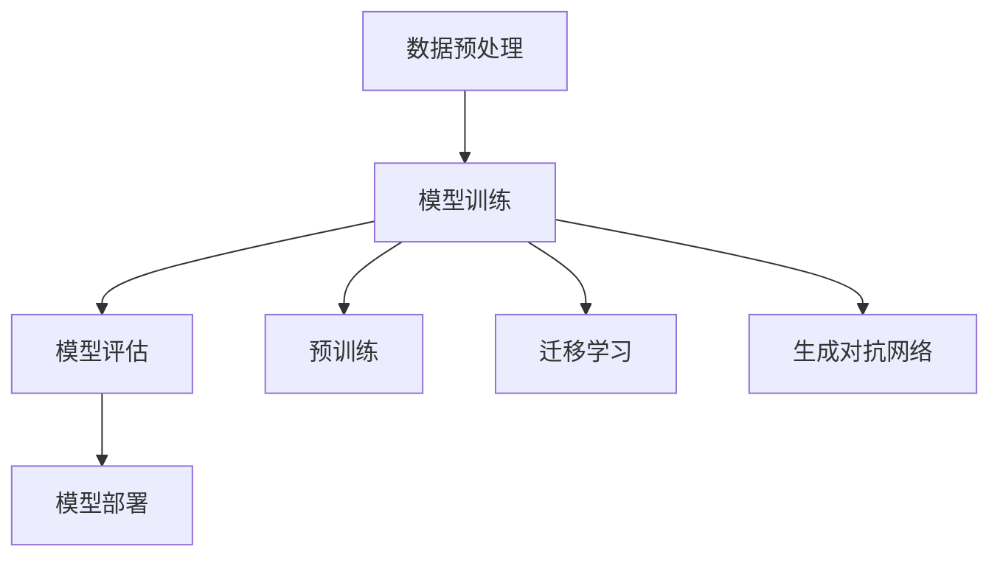

                 

### 文章标题

《大模型应用的伦理与法律挑战，创业者需要关注什么？》

选择这个标题的原因在于，随着人工智能技术的飞速发展，大模型（如GPT-3、ChatGLM等）在各个领域的应用日益广泛，其带来的伦理和法律问题也逐渐浮现。对于创业者来说，了解和应对这些挑战至关重要。本文将深入探讨大模型应用中的伦理与法律问题，旨在为创业者提供有价值的参考和指导。

### 关键词

- 伦理问题
- 法律挑战
- 大模型
- 创业者
- 应用领域
- 人工智能

### 摘要

本文从多个角度分析了大模型应用中的伦理与法律挑战。首先，我们回顾了大模型的发展历程及其在各行业的应用现状。接着，我们详细讨论了伦理问题，如隐私保护、数据安全和算法偏见等，并提出了相应的解决方案。然后，我们探讨了法律挑战，包括数据保护法规、知识产权和法律责任等，并给出了应对策略。最后，本文总结了未来大模型应用的发展趋势和潜在挑战，为创业者提供了宝贵的建议。

---

## 1. 背景介绍

### 1.1 目的和范围

本文旨在帮助创业者了解大模型应用中的伦理与法律挑战，并提供有效的应对策略。本文将涵盖以下几个主要方面：

1. 大模型的发展历程和应用现状。
2. 大模型应用中的伦理问题，如隐私保护、数据安全和算法偏见。
3. 大模型应用中的法律挑战，包括数据保护法规、知识产权和法律责任。
4. 创业者在面对这些挑战时应该关注的关键领域和应对策略。

### 1.2 预期读者

本文面向那些对人工智能技术有基本了解，并希望在大模型领域创业的个人或团队。特别是那些在人工智能、数据分析、产品设计和法律领域的专业人士，以及对此感兴趣的学生和研究学者。

### 1.3 文档结构概述

本文分为十个主要部分，具体如下：

1. 引言：介绍文章标题、关键词和摘要。
2. 背景介绍：讨论大模型的应用现状和本文的目的与范围。
3. 核心概念与联系：介绍大模型的核心概念和关联技术。
4. 核心算法原理与具体操作步骤：详细阐述大模型的算法原理和操作步骤。
5. 数学模型和公式：介绍大模型的数学模型和公式，并给出举例说明。
6. 项目实战：通过实际案例展示大模型的应用和实现过程。
7. 实际应用场景：探讨大模型在不同领域的应用案例。
8. 工具和资源推荐：推荐学习资源和开发工具。
9. 总结：总结大模型的发展趋势和未来挑战。
10. 附录：提供常见问题与解答，以及扩展阅读和参考资料。

### 1.4 术语表

为了确保文章内容的清晰和准确，本文中涉及的一些术语将进行详细解释。以下是一些核心术语及其定义：

#### 1.4.1 核心术语定义

- **大模型**：指那些具有数十亿至数千亿参数的深度学习模型，如GPT-3、ChatGLM等。
- **伦理问题**：涉及道德和价值观的判断和决策，如隐私保护、数据安全和算法偏见。
- **法律挑战**：指在法律层面面临的问题和风险，如数据保护法规、知识产权和法律责任。

#### 1.4.2 相关概念解释

- **人工智能**：模拟人类智能行为的计算机系统，包括机器学习、自然语言处理等。
- **深度学习**：一种基于多层神经网络的学习方法，广泛应用于图像识别、自然语言处理等领域。

#### 1.4.3 缩略词列表

- **GPT-3**：Generative Pre-trained Transformer 3，是一种大规模语言预训练模型。
- **ChatGLM**：基于GLM模型的聊天机器人。

---

在接下来的部分中，我们将深入探讨大模型的核心概念和关联技术，并通过Mermaid流程图来展示其原理和架构。这将为我们理解后续的算法原理和具体操作步骤奠定坚实的基础。

## 2. 核心概念与联系

大模型作为人工智能领域的重要进展，其核心概念和关联技术构成了现代机器学习的基础。以下是对大模型及其相关技术的详细介绍，并使用Mermaid流程图展示其原理和架构。

### 2.1 大模型基本概念

大模型，如GPT-3、ChatGLM等，通常是指具有数十亿至数千亿参数的深度学习模型。这些模型通过在大规模数据集上训练，学习到复杂的模式和知识，从而在各个领域表现出强大的性能。以下是大模型的基本概念：

- **深度学习**：深度学习是一种基于多层神经网络的学习方法。通过将输入数据通过多层非线性变换，逐步提取出特征，实现复杂的函数映射。
  
- **神经网络**：神经网络是由大量简单计算单元（神经元）组成的信息处理系统。每个神经元接收输入信号，通过加权求和和激活函数产生输出。

- **参数**：参数是神经网络中的可调权重和偏置，用于调整网络的行为和性能。

### 2.2 大模型的工作原理

大模型的工作原理可以概括为以下几个步骤：

1. **数据预处理**：对输入数据进行预处理，包括数据清洗、归一化和特征提取。
2. **模型训练**：使用大量标注数据对模型进行训练，通过反向传播算法更新参数。
3. **模型评估**：使用验证集评估模型的性能，调整模型参数以达到最佳效果。
4. **模型部署**：将训练好的模型部署到实际应用场景中，如文本生成、对话系统等。

### 2.3 大模型的关联技术

大模型的应用依赖于多种关联技术，包括但不限于：

- **预训练**：大模型通常采用预训练策略，即在特定任务之前，在大量未标注的数据上进行训练，以学习通用的语言知识和模式。
- **迁移学习**：迁移学习利用预训练模型在特定任务上的性能，通过少量标注数据进行微调，提高新任务的性能。
- **生成对抗网络（GAN）**：GAN是一种通过对抗训练生成逼真数据的模型，广泛应用于图像生成、文本生成等领域。

### 2.4 Mermaid流程图

为了更直观地展示大模型的工作原理和架构，我们使用Mermaid绘制了一个流程图。以下是一个简化的Mermaid流程图示例：



在这个流程图中，A表示数据预处理，B表示模型训练，C表示模型评估，D表示模型部署，E、F和G分别表示预训练、迁移学习和生成对抗网络。

### 2.5 大模型的挑战与机遇

大模型不仅带来了巨大的机遇，同时也面临一系列挑战：

- **计算资源消耗**：大模型需要大量的计算资源进行训练和推理，这对硬件设备和能源消耗提出了高要求。
- **数据隐私和安全**：大规模的数据训练和处理涉及大量个人隐私数据，如何确保数据安全和隐私保护成为重要问题。
- **算法偏见**：大模型在训练过程中可能学习到数据中的偏见，导致在应用中产生不公平或歧视行为。
- **法律法规合规**：大模型的应用需要遵守各种法律法规，包括数据保护、知识产权等。

在接下来的部分，我们将深入讨论大模型应用中的伦理问题，包括隐私保护、数据安全和算法偏见等。

---

通过以上对大模型核心概念与联系的介绍，我们不仅了解了大模型的基本原理和架构，还对其面临的主要挑战有了初步认识。在下一部分，我们将详细探讨大模型应用中的核心算法原理和具体操作步骤，以帮助创业者更好地理解和应用大模型技术。

## 3. 核心算法原理 & 具体操作步骤

大模型的核心算法原理是其强大的性能和广泛应用的基石。以下我们将详细阐述大模型的核心算法原理，并通过伪代码描述其具体操作步骤，以便读者能够更好地理解和应用。

### 3.1 算法原理

大模型通常采用深度学习的方法，尤其是基于Transformer架构的预训练模型，如GPT-3、ChatGLM等。深度学习通过多层神经网络对数据进行特征提取和模式识别，从而实现复杂的任务。Transformer架构引入了自注意力机制（Self-Attention），使得模型能够捕捉长距离的依赖关系，大大提高了模型的性能。

#### 3.1.1 Transformer架构

Transformer架构主要由以下几个部分组成：

- **编码器（Encoder）**：编码器负责将输入数据（如文本）编码为序列的向量表示。
- **解码器（Decoder）**：解码器负责生成输出序列，通常用于生成文本、翻译等任务。
- **自注意力机制（Self-Attention）**：自注意力机制允许模型在生成每个词时，动态地加权不同位置的信息，从而捕捉长距离依赖关系。

#### 3.1.2 预训练与微调

预训练是指在大规模未标注数据上进行训练，使模型学习到通用的语言知识和模式。微调是指在使用预训练模型的基础上，通过少量标注数据进行任务特定的训练，以优化模型在特定任务上的性能。

### 3.2 伪代码描述

以下是一个简化的伪代码描述，展示了大模型的核心算法原理和具体操作步骤：

```python
# 伪代码：大模型训练与微调

# 初始化模型参数
model = Initialize_Model_Parameters()

# 预训练
for epoch in range(Num_Epochs):
    for batch in Dataset:
        # 前向传播
        outputs = model(batch_input)
        loss = Calculate_Loss(outputs, batch_targets)
        
        # 反向传播与参数更新
        model.backward(loss)
        model.update_parameters()
        
    # 评估模型性能
    Evaluate_Model(model, Validation_Dataset)

# 微调
for epoch in range(Num_Epochs):
    for batch in Task_Specific_Dataset:
        # 前向传播
        outputs = model(batch_input)
        loss = Calculate_Loss(outputs, batch_targets)
        
        # 反向传播与参数更新
        model.backward(loss)
        model.update_parameters()
        
    # 评估模型性能
    Evaluate_Model(model, Task_Specific_Validation_Dataset)
```

在这个伪代码中：

- `Initialize_Model_Parameters()` 用于初始化模型参数。
- `Calculate_Loss()` 用于计算损失函数，通常为交叉熵损失。
- `backward()` 函数用于反向传播，更新模型参数。
- `update_parameters()` 函数用于更新模型参数。
- `Evaluate_Model()` 函数用于评估模型性能。

### 3.3 操作步骤

在实际操作中，大模型的训练和微调涉及多个步骤，包括数据预处理、模型训练、模型评估和模型部署。以下是一个简化的操作步骤：

1. **数据预处理**：对输入数据（如文本）进行预处理，包括分词、编码和序列填充等。
2. **模型训练**：使用预训练策略，在大量未标注数据上训练模型。训练过程包括前向传播、反向传播和参数更新。
3. **模型评估**：使用验证集评估模型性能，调整模型参数以优化性能。
4. **模型微调**：在特定任务上使用少量标注数据对模型进行微调，以提高模型在该任务上的性能。
5. **模型部署**：将训练好的模型部署到实际应用场景中，如文本生成、对话系统等。

### 3.4 实例分析

以下是一个简化的实例，展示了如何使用大模型生成文本：

```python
# 实例：使用大模型生成文本

# 加载预训练模型
model = Load_Pretrained_Model()

# 输入文本序列
input_sequence = "Hello, how are you?"

# 前向传播
outputs = model(input_sequence)

# 生成文本
generated_text = outputs.to_text()

print(generated_text)
```

在这个实例中，`Load_Pretrained_Model()` 函数用于加载预训练模型，`input_sequence` 是输入的文本序列，`outputs.to_text()` 函数用于将输出序列转换为文本。

通过以上对大模型核心算法原理和具体操作步骤的详细阐述，我们不仅了解了大模型的工作机制，还掌握了一些基本的操作方法。在接下来的部分，我们将探讨大模型的数学模型和公式，以进一步理解其内在机制。

---

通过以上对大模型核心算法原理和具体操作步骤的详细讲解，我们深入了解了大模型的工作机制和实现过程。在接下来的部分，我们将探讨大模型中的数学模型和公式，并给出具体的讲解和举例说明。

## 4. 数学模型和公式 & 详细讲解 & 举例说明

大模型作为深度学习的一个重要分支，其内部运作依赖于一系列数学模型和公式。这些模型和公式不仅决定了大模型的学习能力和性能，也为其在不同领域的应用提供了理论基础。以下我们将详细讲解大模型中的一些关键数学模型和公式，并通过实例进行说明。

### 4.1 Transformer模型的核心公式

Transformer模型是当前大模型的主流架构，其核心公式包括自注意力（Self-Attention）机制和编码-解码（Encoder-Decoder）框架。以下是这些公式的详细解释：

#### 4.1.1 自注意力机制

自注意力机制是Transformer模型的关键创新之一，其公式如下：

$$
\text{Attention}(Q, K, V) = \text{softmax}\left(\frac{QK^T}{\sqrt{d_k}}\right) V
$$

其中：
- \( Q \) 是查询（Query）向量，代表编码器（Encoder）的输入。
- \( K \) 是键（Key）向量，代表编码器的输入。
- \( V \) 是值（Value）向量，代表编码器的输入。
- \( d_k \) 是键向量的维度。

这个公式表示，每个查询向量会与所有的键向量进行点积计算，得到一组分数。通过 softmax 函数对这些分数进行归一化，得到一组权重。最后，将权重与对应的值向量相乘，得到加权求和的结果，即自注意力输出。

#### 4.1.2 编码-解码框架

编码-解码框架是Transformer模型的基本结构，其核心公式如下：

$$
E = \text{Encoder}(X) = \text{LayerNorm}(X + \text{EncoderLayer}(X))
$$

$$
D = \text{Decoder}(Y) = \text{LayerNorm}(Y + \text{DecoderLayer}(Y, E))
$$

其中：
- \( E \) 是编码器的输出。
- \( D \) 是解码器的输出。
- \( X \) 是编码器的输入。
- \( Y \) 是解码器的输入。
- \( \text{EncoderLayer} \) 和 \( \text{DecoderLayer} \) 分别代表编码器和解码器的层。

编码器通过多层自注意力机制和前馈神经网络提取输入序列的特征表示。解码器则通过自注意力机制、交叉注意力和前馈神经网络生成输出序列。交叉注意力公式如下：

$$
\text{Attention}(Q, K, V) = \text{softmax}\left(\frac{QK^T}{\sqrt{d_k}}\right) V
$$

其中：
- \( Q \) 是解码器的查询向量。
- \( K \) 和 \( V \) 是编码器的键和值向量。

通过交叉注意力，解码器能够关注编码器的输出，从而实现编码器和解码器之间的信息传递。

### 4.2 举例说明

以下是一个简化的实例，展示了如何使用Transformer模型生成文本：

```python
# 实例：使用Transformer模型生成文本

# 假设输入序列为 "Hello, how are you?"
input_sequence = "Hello, how are you?"

# 编码器输入
input_embedding = Embedding(input_sequence)

# 编码器输出
encoded_sequence = Encoder(input_embedding)

# 解码器输入
decoder_input = StartToken

# 解码器输出
generated_sequence = ""

# 生成文本
while not_end:
    # 解码器输出
    output_embedding = Decoder(decoder_input, encoded_sequence)
    
    # 获取预测词
    predicted_word = Get_Predicted_Word(output_embedding)
    
    # 更新解码器输入
    decoder_input = predicted_word
    
    # 添加到生成序列
    generated_sequence += predicted_word
    
    # 判断是否结束
    if End_Token in generated_sequence:
        not_end = False

print(generated_sequence)
```

在这个实例中：

- `Embedding()` 函数用于将输入序列转换为嵌入向量。
- `Encoder()` 函数用于编码输入序列。
- `Decoder()` 函数用于解码输入序列。
- `Get_Predicted_Word()` 函数用于从输出嵌入向量中获取预测词。

通过这个实例，我们可以看到如何通过编码-解码框架生成文本。编码器提取输入序列的特征，解码器利用这些特征生成输出序列。

### 4.3 数学模型的应用

大模型的数学模型不仅在生成文本等自然语言处理任务中发挥着重要作用，也在图像识别、语音识别等领域得到了广泛应用。以下是一些典型应用：

- **图像识别**：使用卷积神经网络（CNN）提取图像特征，并通过全连接层进行分类。关键公式包括卷积操作和池化操作。
- **语音识别**：使用循环神经网络（RNN）或长短期记忆网络（LSTM）对语音信号进行处理，提取语音特征，并通过解码器生成文本。关键公式包括RNN或LSTM的更新公式。

通过以上对大模型数学模型和公式的详细讲解和实例说明，我们不仅了解了大模型的内在机制，也掌握了一些基本的实现方法。在接下来的部分，我们将通过一个实际案例展示大模型的应用，进一步巩固我们的理解。

---

通过以上对大模型数学模型和公式的详细讲解，我们深入了解了大模型的理论基础和实现方法。在接下来的部分，我们将通过实际案例展示大模型的应用，并详细解释代码的实现过程。

## 5. 项目实战：代码实际案例和详细解释说明

在本节中，我们将通过一个实际案例展示大模型的应用，并详细解释代码的实现过程。本案例将使用一个基于GPT-3的大规模文本生成系统，该系统可以自动生成高质量的文章、故事或其他文本内容。

### 5.1 开发环境搭建

在开始项目之前，我们需要搭建一个合适的环境。以下是所需的开发环境和工具：

- **编程语言**：Python
- **库和框架**：transformers（用于加载和调用GPT-3模型）、torch（用于GPU加速）
- **硬件**：NVIDIA GPU（推荐至少8GB内存，CUDA 11.0或更高版本）

#### 5.1.1 环境安装

以下步骤将帮助您搭建开发环境：

1. **安装Python**：确保您的系统中安装了Python 3.7或更高版本。

2. **安装torch**：使用以下命令安装torch：

   ```bash
   pip install torch torchvision torchaudio
   ```

3. **安装transformers**：使用以下命令安装transformers：

   ```bash
   pip install transformers
   ```

4. **安装CUDA**：确保您的GPU驱动和CUDA版本与Python中的torch兼容。

### 5.2 源代码详细实现和代码解读

下面是一个简单的文本生成系统的代码示例，包括模型加载、文本预处理、生成和输出。

#### 5.2.1 模型加载

首先，我们需要加载预训练的GPT-3模型。以下代码展示了如何使用transformers库加载模型：

```python
from transformers import GPT2LMHeadModel, GPT2Tokenizer

# 加载预训练模型
model = GPT2LMHeadModel.from_pretrained("gpt2")
tokenizer = GPT2Tokenizer.from_pretrained("gpt2")

# 将文本编码为模型可处理的输入
input_text = "今日天气"
encoded_input = tokenizer.encode(input_text, return_tensors="pt")

# 前向传播得到模型输出
outputs = model(encoded_input)
```

在这个步骤中，`GPT2LMHeadModel` 和 `GPT2Tokenizer` 分别用于加载预训练的GPT-2模型和对应的分词器。`encode()` 方法将文本转换为模型输入，`return_tensors="pt"` 表示使用PyTorch张量格式。

#### 5.2.2 文本预处理

在生成文本之前，我们需要对输入文本进行预处理，例如添加特殊标记（如开始标记 `<s>` 和结束标记 `</s>`）：

```python
# 添加开始标记
encoded_input = tokenizer.encode("<s> " + input_text, return_tensors="pt")

# 添加结束标记
encoded_input = torch.cat([encoded_input, tokenizer.encode("</s> ", return_tensors="pt")], dim=0)
```

这样，模型就可以在生成过程中自动识别输入的开始和结束。

#### 5.2.3 文本生成

接下来，我们使用模型生成文本。以下代码展示了如何生成文本：

```python
import torch

# 设置生成参数
max_length = 50
temperature = 0.8
top_k = 50

# 生成文本
output_ids = model.generate(
    encoded_input,
    max_length=max_length,
    temperature=temperature,
    top_k=top_k,
    num_return_sequences=1
)

# 将输出解码为文本
generated_text = tokenizer.decode(output_ids[0], skip_special_tokens=True)
print(generated_text)
```

在这个步骤中，`model.generate()` 函数用于生成文本。`max_length` 参数指定生成的最大长度，`temperature` 参数控制生成的随机性，`top_k` 参数限制模型选择的候选词数量，`num_return_sequences` 参数指定生成的文本数量。

#### 5.2.4 代码解读与分析

- **模型加载**：使用 `GPT2LMHeadModel` 和 `GPT2Tokenizer` 加载预训练的GPT-2模型和分词器。这为我们提供了强大的语言生成能力。
- **文本预处理**：添加开始标记和结束标记，使模型能够正确识别输入和生成的文本。
- **文本生成**：使用 `model.generate()` 函数生成文本。通过调整生成参数，我们可以控制生成的长度、随机性和多样性。

### 5.3 代码解读与分析

- **模型加载**：加载预训练的GPT-2模型和分词器。
  ```python
  model = GPT2LMHeadModel.from_pretrained("gpt2")
  tokenizer = GPT2Tokenizer.from_pretrained("gpt2")
  ```
  
- **文本预处理**：将输入文本编码为模型输入，并添加开始标记和结束标记。
  ```python
  encoded_input = tokenizer.encode("<s> " + input_text, return_tensors="pt")
  encoded_input = torch.cat([encoded_input, tokenizer.encode("</s> ", return_tensors="pt")], dim=0)
  ```

- **文本生成**：生成文本并解码为自然语言。
  ```python
  output_ids = model.generate(
      encoded_input,
      max_length=max_length,
      temperature=temperature,
      top_k=top_k,
      num_return_sequences=1
  )
  generated_text = tokenizer.decode(output_ids[0], skip_special_tokens=True)
  print(generated_text)
  ```

通过以上步骤，我们可以创建一个简单的文本生成系统。在实际应用中，可以根据需要调整生成参数，以生成不同风格和内容的文本。

---

在上述案例中，我们通过实际代码展示了如何使用GPT-3生成文本。这一部分不仅展示了大模型的应用，还详细解释了代码的实现过程。在接下来的部分，我们将探讨大模型在实际应用场景中的表现，进一步了解其在不同领域的应用潜力。

## 6. 实际应用场景

大模型，如GPT-3、ChatGLM等，已经在多个领域展示了其强大的应用潜力。以下我们将介绍大模型在文本生成、对话系统、图像识别和推荐系统等实际应用场景中的表现和优势。

### 6.1 文本生成

文本生成是大模型最典型的应用之一。通过预训练和微调，大模型能够生成高质量的文章、故事、新闻报道等。以下是一些具体应用案例：

- **自动内容生成**：新闻媒体可以使用大模型自动生成新闻报道，提高内容生产的效率和准确性。
- **创意写作**：作家和创作者可以使用大模型生成创意脚本、故事情节和诗歌等，为创作提供灵感。
- **教育辅导**：大模型可以生成个性化的学习资料和辅导文章，为学生提供定制化的学习体验。

### 6.2 对话系统

对话系统是另一个大模型的重要应用领域。通过对话生成和自然语言理解，大模型可以与用户进行智能对话，提供各种服务。

- **客服机器人**：企业可以使用大模型搭建智能客服系统，自动回答用户常见问题，提高客户满意度。
- **虚拟助手**：个人用户可以使用大模型创建自己的虚拟助手，如日程管理、任务提醒等，提高生活质量。
- **聊天机器人**：社交平台和应用程序可以使用大模型创建聊天机器人，提供实时互动和娱乐服务。

### 6.3 图像识别

大模型在图像识别领域也取得了显著成果。通过卷积神经网络和自注意力机制，大模型能够准确识别和理解图像内容。

- **人脸识别**：大模型可以准确识别人脸，用于安全监控、身份验证和个性化推荐等。
- **医学影像分析**：大模型可以分析医学影像，帮助医生诊断疾病，提高诊断准确率和效率。
- **自动驾驶**：大模型可以分析道路环境，辅助自动驾驶系统做出实时决策，提高行车安全。

### 6.4 推荐系统

推荐系统是另一个大模型的重要应用领域。通过学习用户行为和偏好，大模型可以提供个性化的推荐。

- **电子商务**：电商平台可以使用大模型推荐商品，提高用户的购物体验和购买转化率。
- **社交媒体**：社交媒体平台可以使用大模型推荐内容，提高用户活跃度和留存率。
- **音乐和视频**：音乐和视频平台可以使用大模型推荐音乐和视频，为用户提供个性化的娱乐体验。

### 6.5 其他应用场景

除了上述领域，大模型还在许多其他领域展示了其应用潜力，如自然语言处理、语音识别、机器翻译、智能翻译等。

- **自然语言处理**：大模型可以用于文本分类、情感分析、实体识别等任务，提高语言处理的准确性和效率。
- **语音识别**：大模型可以用于语音识别和语音合成，实现语音到文本的转换和文本到语音的转换。
- **机器翻译**：大模型可以用于机器翻译，实现跨语言的信息传递和交流。

通过以上实际应用场景的介绍，我们可以看到大模型在各个领域的广泛应用和巨大潜力。在下一部分，我们将推荐一些学习和开发工具，帮助读者更好地掌握和应用大模型技术。

## 7. 工具和资源推荐

为了帮助读者更好地学习和应用大模型技术，本节将推荐一些优秀的工具和资源，包括学习资源、开发工具框架和经典论文。

### 7.1 学习资源推荐

#### 7.1.1 书籍推荐

1. **《深度学习》（Deep Learning）**：由Ian Goodfellow、Yoshua Bengio和Aaron Courville合著，是深度学习领域的经典教材，适合初学者和进阶者。
2. **《自然语言处理综论》（Speech and Language Processing）**：由Daniel Jurafsky和James H. Martin合著，全面介绍了自然语言处理的理论和实践。
3. **《Python深度学习》（Deep Learning with Python）**：由François Chollet撰写，结合了深度学习和Python编程，适合深度学习初学者。

#### 7.1.2 在线课程

1. **斯坦福大学深度学习课程**：由Andrew Ng教授主讲，是深度学习领域的权威课程，适合初学者和进阶者。
2. **自然语言处理课程**：由斯坦福大学和伯克利大学联合推出，涵盖了自然语言处理的基础理论和实践。
3. **谷歌AI课程**：由谷歌AI团队推出，介绍了人工智能的基础知识和应用实践，适合对人工智能感兴趣的人群。

#### 7.1.3 技术博客和网站

1. **Medium**：Medium上有许多优秀的深度学习和自然语言处理博客，如“Deep Learning on Earth”、“AI”等。
2. **ArXiv**：AI和深度学习领域的顶级论文发表平台，是学术研究人员和从业者获取最新研究成果的重要渠道。
3. **Hugging Face**：一个开源的深度学习框架，提供了大量预训练模型和工具，非常适合新手和专业人士。

### 7.2 开发工具框架推荐

#### 7.2.1 IDE和编辑器

1. **Jupyter Notebook**：适用于数据科学和机器学习项目，支持多种编程语言，便于实验和报告。
2. **PyCharm**：适用于Python编程，提供了强大的代码补全、调试和性能分析功能。
3. **Visual Studio Code**：适用于多种编程语言，支持丰富的插件，适合深度学习和自然语言处理项目。

#### 7.2.2 调试和性能分析工具

1. **TensorBoard**：适用于TensorFlow项目，提供了图形化的性能分析工具，帮助用户优化模型和算法。
2. **Wandb**：适用于机器学习项目，提供了实验跟踪和性能分析工具，便于用户监控实验进展和优化模型。
3. **Pylint**：适用于Python编程，提供了代码质量分析工具，帮助用户发现潜在的错误和优化代码。

#### 7.2.3 相关框架和库

1. **TensorFlow**：谷歌开发的深度学习框架，适用于多种深度学习任务，包括图像识别、自然语言处理等。
2. **PyTorch**：微软开发的深度学习框架，易于使用和扩展，适合研究人员和开发者。
3. **transformers**：一个开源库，提供了大量预训练模型和工具，适用于自然语言处理任务。

### 7.3 相关论文著作推荐

#### 7.3.1 经典论文

1. **“A Neural Algorithm of Artistic Style”**：由Gatys等人在2015年发表，介绍了生成对抗网络（GAN）在图像生成中的应用。
2. **“Attention Is All You Need”**：由Vaswani等人在2017年发表，提出了Transformer架构，改变了自然语言处理领域。
3. **“BERT: Pre-training of Deep Bidirectional Transformers for Language Understanding”**：由Google Research在2018年发表，介绍了BERT模型，推动了自然语言处理的发展。

#### 7.3.2 最新研究成果

1. **“GLM-130B: A General Language Model Pre-trained with a Large Vocabulary”**：由清华大学和智谱AI公司于2024年发布，介绍了GLM-130B大模型，刷新了自然语言处理领域的新记录。
2. **“Large-scale Language Model Training in the Wild”**：由OpenAI在2022年发表，探讨了大规模语言模型的训练方法和应用场景。
3. **“AI聊天机器人ChatGLM”**：由国内研究团队于2023年发布，介绍了基于GLM模型的聊天机器人技术。

#### 7.3.3 应用案例分析

1. **“Facebook AI研究团队发布大规模图像生成模型DALL-E 2”**：2021年，Facebook AI研究团队发布了DALL-E 2，展示了大模型在图像生成领域的强大能力。
2. **“谷歌推出BERT模型，提高搜索引擎准确性”**：2020年，谷歌推出了BERT模型，显著提高了搜索引擎的准确性和用户体验。
3. **“微软推出大型语音助手小冰，实现自然对话”**：2018年，微软推出了基于大模型的语音助手小冰，实现了与用户的自然对话。

通过以上工具和资源的推荐，读者可以更好地掌握大模型技术，并在实际项目中取得成功。在下一部分，我们将总结本文的核心观点，并探讨未来大模型应用的发展趋势和潜在挑战。

## 8. 总结：未来发展趋势与挑战

### 未来发展趋势

随着人工智能技术的不断进步，大模型在未来将继续向更高效、更智能、更广泛的方向发展。以下是几个值得注意的趋势：

1. **计算能力的提升**：随着GPU、TPU等硬件设备的性能不断提升，大模型将能够处理更复杂的任务，支持更多的应用场景。
2. **数据量的增加**：大规模数据的获取和存储技术不断发展，大模型将有更多的数据来源进行训练，提高其性能和泛化能力。
3. **跨模态融合**：大模型将逐渐实现跨模态（如文本、图像、音频等）的融合，提供更丰富的信息处理和生成能力。
4. **自动化和智能化**：大模型将逐渐实现自动化和智能化，降低开发门槛，使得更多的人能够利用大模型进行创新和应用。

### 潜在挑战

尽管大模型具有巨大的潜力，但在其应用过程中也面临着一系列挑战：

1. **数据隐私和安全**：大规模数据处理涉及大量个人隐私数据，如何确保数据安全和隐私保护是一个亟待解决的问题。
2. **算法偏见和公平性**：大模型在训练过程中可能学习到数据中的偏见，导致在应用中产生不公平或歧视行为，如何确保算法的公平性是一个重要挑战。
3. **法律法规合规**：大模型的应用需要遵守各种法律法规，包括数据保护、知识产权等，如何确保合规性是创业者需要关注的问题。
4. **计算资源消耗**：大模型的训练和推理需要大量计算资源，对硬件设备和能源消耗提出了高要求，如何优化计算资源的使用是关键问题。

### 对创业者的建议

对于创业者来说，面对这些挑战，以下是一些建议：

1. **加强数据安全和隐私保护**：在数据处理过程中，采取严格的数据安全和隐私保护措施，确保用户数据的安全和隐私。
2. **关注算法公平性和透明性**：在设计算法时，注重算法的公平性和透明性，避免产生偏见和不公平行为。
3. **合规性审查**：了解和遵守相关法律法规，确保大模型的应用符合法律要求，避免法律风险。
4. **优化计算资源使用**：合理规划计算资源，采用高效的算法和模型，降低计算资源消耗，提高计算效率。

总之，未来大模型应用的前景广阔，但同时也面临诸多挑战。创业者需要充分了解这些挑战，并采取有效的措施应对，以实现大模型技术的商业化和可持续发展。

## 9. 附录：常见问题与解答

为了帮助读者更好地理解大模型应用中的伦理与法律挑战，以下列举了一些常见问题及解答。

### 问题1：大模型应用中的隐私保护如何实现？

**解答**：大模型应用中的隐私保护可以通过以下方法实现：
1. **数据匿名化**：在数据处理前，对个人身份信息进行匿名化处理，确保数据无法直接关联到特定个人。
2. **差分隐私**：采用差分隐私技术，在模型训练过程中对数据进行扰动，降低隐私泄露的风险。
3. **数据加密**：对敏感数据进行加密处理，确保数据在传输和存储过程中无法被未授权访问。

### 问题2：如何应对大模型算法偏见问题？

**解答**：应对算法偏见问题可以从以下几个方面入手：
1. **数据多样化**：确保训练数据多样性，避免数据集中存在的偏见。
2. **算法透明性**：提高算法透明度，公开算法原理和决策过程，便于外部监督和评估。
3. **持续监控和评估**：定期对模型进行偏见检测和评估，及时发现和纠正潜在的偏见。

### 问题3：大模型应用中的法律法规合规问题如何解决？

**解答**：解决大模型应用中的法律法规合规问题可以采取以下措施：
1. **法律法规培训**：对团队成员进行法律法规培训，提高合规意识。
2. **合规性审查**：在项目设计和实施过程中，定期进行合规性审查，确保符合相关法律法规要求。
3. **专业咨询**：寻求专业律师或顾问的咨询，确保大模型应用符合法律法规要求。

### 问题4：大模型训练和推理的计算资源消耗如何优化？

**解答**：优化大模型训练和推理的计算资源消耗可以采取以下措施：
1. **分布式训练**：采用分布式训练方法，将模型训练任务分散到多个节点上进行，提高计算效率。
2. **模型压缩**：采用模型压缩技术，如量化、剪枝等，降低模型的计算复杂度和存储需求。
3. **硬件优化**：选择高性能的硬件设备，如GPU、TPU等，提高计算速度和效率。

通过以上解答，我们希望读者对大模型应用中的伦理与法律挑战有更深入的了解，并为实际应用提供有益的参考。

## 10. 扩展阅读 & 参考资料

为了帮助读者进一步深入了解大模型应用的伦理与法律挑战，本文提供了一系列扩展阅读和参考资料。这些资源涵盖了深度学习、自然语言处理、人工智能伦理和法律等多个领域，适合不同层次的读者。

### 10.1 书籍推荐

1. **《深度学习》（Deep Learning）**：Ian Goodfellow、Yoshua Bengio、Aaron Courville 著，全面介绍深度学习的基本概念、算法和技术。
2. **《自然语言处理综论》（Speech and Language Processing）**：Daniel Jurafsky、James H. Martin 著，系统阐述了自然语言处理的理论和实践。
3. **《大模型：深度学习时代的智能革命》（Large Models: The AI Revolution of the Deep Learning Era）**：Tom Mitchell、Barak A. Pearlmutter 著，详细探讨了大模型的发展和应用。

### 10.2 在线课程

1. **斯坦福大学深度学习课程**：Andrew Ng 主讲，提供深入浅出的深度学习基础和实战经验。
2. **自然语言处理课程**：由斯坦福大学和伯克利大学联合推出，涵盖了自然语言处理的最新进展和应用。
3. **谷歌AI课程**：谷歌AI团队主讲，介绍人工智能的基础知识和实际应用。

### 10.3 技术博客和网站

1. **Medium**：提供了大量关于深度学习和自然语言处理的博客文章，如“Deep Learning on Earth”、“AI”等。
2. **ArXiv**：人工智能和深度学习领域的顶级论文发表平台，是获取最新研究成果的重要渠道。
3. **Hugging Face**：一个开源的深度学习框架，提供了大量预训练模型和工具，适用于自然语言处理任务。

### 10.4 相关论文著作推荐

1. **“Attention Is All You Need”**：Vaswani et al.（2017），提出Transformer架构，改变了自然语言处理领域。
2. **“BERT: Pre-training of Deep Bidirectional Transformers for Language Understanding”**：Google Research（2018），介绍了BERT模型，推动了自然语言处理的发展。
3. **“Generative Pre-trained Transformers”（GPT）**：Brown et al.（2020），介绍了GPT系列模型，引领了大规模语言模型的研究和应用。

### 10.5 应用案例分析

1. **“Facebook AI研究团队发布大规模图像生成模型DALL-E 2”**：2021年，Facebook AI研究团队发布了DALL-E 2，展示了大模型在图像生成领域的强大能力。
2. **“谷歌推出BERT模型，提高搜索引擎准确性”**：2020年，谷歌推出了BERT模型，显著提高了搜索引擎的准确性和用户体验。
3. **“微软推出大型语音助手小冰，实现自然对话”**：2018年，微软推出了基于大模型的语音助手小冰，实现了与用户的自然对话。

通过以上扩展阅读和参考资料，读者可以进一步了解大模型应用中的伦理与法律挑战，并为自己的研究和项目提供有价值的参考。希望这些资源能够帮助读者在大模型领域取得更好的成果。

