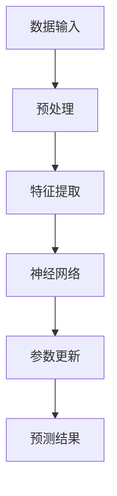
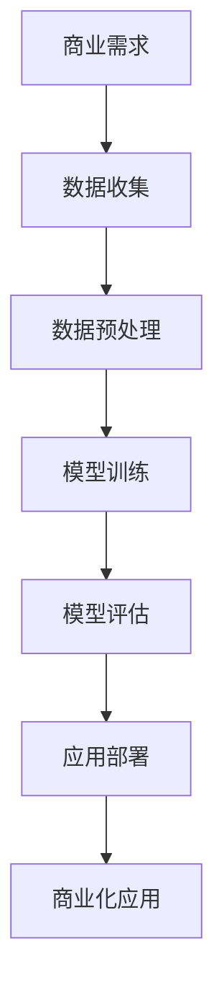
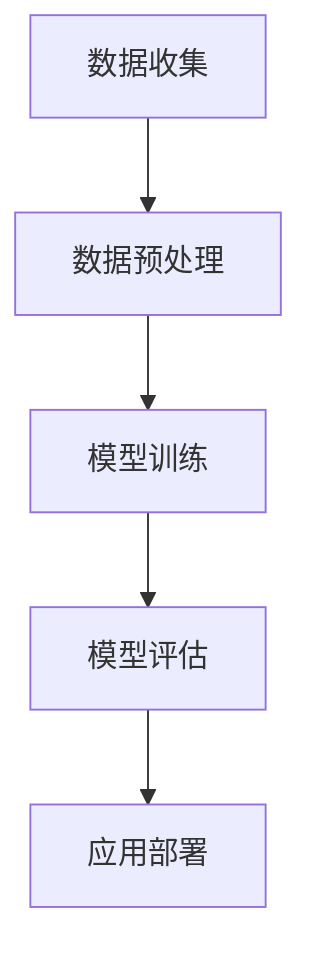

                 

# 大模型应用落地加速，AI商业化进程提速

> 关键词：人工智能、大模型、商业化、应用落地、算法原理、数学模型、项目实战

> 摘要：本文将探讨大模型在人工智能领域的应用及其商业化进程。首先介绍大模型的背景和技术原理，接着深入分析大模型的数学模型和具体操作步骤，并分享项目实战中的代码实现和解读。最后，讨论大模型在各个实际应用场景中的表现，并提供相关工具和资源推荐，总结未来发展趋势与挑战。

## 1. 背景介绍

### 1.1 目的和范围

本文旨在探讨大模型在人工智能（AI）领域的应用及其商业化进程。我们将分析大模型的技术原理，探讨其在实际应用中的挑战和机遇，并提供相关的工具和资源推荐。

### 1.2 预期读者

本文适合对人工智能、机器学习和大模型有一定了解的技术人员、研究人员和学生。特别是那些希望深入了解大模型商业化应用的开发者、数据科学家和产品经理。

### 1.3 文档结构概述

本文分为以下几个部分：

1. 背景介绍
2. 核心概念与联系
3. 核心算法原理 & 具体操作步骤
4. 数学模型和公式 & 详细讲解 & 举例说明
5. 项目实战：代码实际案例和详细解释说明
6. 实际应用场景
7. 工具和资源推荐
8. 总结：未来发展趋势与挑战
9. 附录：常见问题与解答
10. 扩展阅读 & 参考资料

### 1.4 术语表

#### 1.4.1 核心术语定义

- **大模型**：具有巨大参数量的深度学习模型，通常用于处理大规模数据集。
- **AI商业化**：将人工智能技术应用于商业场景，创造经济价值的过程。
- **应用落地**：将理论模型和技术转化为实际应用的过程。

#### 1.4.2 相关概念解释

- **深度学习**：一种机器学习方法，通过多层次的神经网络来提取数据中的特征。
- **神经网络**：一种模拟人脑神经元连接的结构，用于信息处理和传递。

#### 1.4.3 缩略词列表

- **AI**：人工智能
- **ML**：机器学习
- **DL**：深度学习
- **GPU**：图形处理器
- **CPU**：中央处理器

## 2. 核心概念与联系

### 大模型的工作原理

大模型基于深度学习的原理，通过多层神经网络的结构来提取数据中的特征。大模型的网络结构通常包含数百万甚至数十亿个参数，这使得它们能够处理复杂的数据集并生成高精度的预测。

#### Mermaid 流程图



### 大模型与商业化的联系

大模型在商业领域具有广泛的应用，如自然语言处理、图像识别、推荐系统等。这些应用能够帮助企业提高运营效率、降低成本、增强用户体验，从而实现商业价值的增长。

#### Mermaid 流程图



## 3. 核心算法原理 & 具体操作步骤

### 大模型的算法原理

大模型基于深度学习的算法原理，通过反向传播（Backpropagation）算法来更新网络中的参数。反向传播算法通过计算误差梯度来确定参数的更新方向和大小。

#### 伪代码

```python
initialize parameters
while not converged:
    forward_pass(x, y)
    calculate loss (L)
    backward_pass(L)
    update parameters
    evaluate model performance
```

### 大模型的具体操作步骤

1. **数据收集**：收集大规模数据集，包括训练数据和测试数据。
2. **数据预处理**：对数据进行清洗、归一化等预处理操作。
3. **模型训练**：使用训练数据训练大模型，通过反向传播算法更新参数。
4. **模型评估**：使用测试数据评估模型的性能，调整模型参数以优化性能。
5. **应用部署**：将训练好的模型部署到实际应用场景中，如自然语言处理、图像识别等。

#### Mermaid 流程图



## 4. 数学模型和公式 & 详细讲解 & 举例说明

### 数学模型

大模型的数学模型主要包括前向传播、反向传播和损失函数。

#### 前向传播

前向传播是指将输入数据通过神经网络传递到输出层的过程。假设有一个包含L层的神经网络，第l层的输出可以表示为：

\[ z_l^{(i)} = \sigma(W_l^{(i)} \cdot a_{l-1}^{(i)} + b_l^{(i)}) \]

其中，\( z_l^{(i)} \) 是第l层的输出，\( \sigma \) 是激活函数，\( W_l^{(i)} \) 和 \( b_l^{(i)} \) 是第l层的权重和偏置。

#### 反向传播

反向传播是指根据输出层的误差，逆向更新网络中的参数。假设损失函数为 \( L \)，则可以使用梯度下降（Gradient Descent）算法来更新参数：

\[ \theta_j := \theta_j - \alpha \cdot \frac{\partial L}{\partial \theta_j} \]

其中，\( \theta_j \) 是第j个参数，\( \alpha \) 是学习率。

#### 损失函数

常见的损失函数包括均方误差（MSE）和交叉熵（Cross-Entropy）。均方误差可以表示为：

\[ L(\theta) = \frac{1}{2} \sum_{i=1}^{m} (y_i - \hat{y}_i)^2 \]

其中，\( y_i \) 是真实标签，\( \hat{y}_i \) 是模型的预测结果。

### 举例说明

假设我们有一个二分类问题，使用神经网络进行分类。给定一个输入 \( x \)，我们希望预测其对应的标签 \( y \)。

1. **数据预处理**：对输入数据进行归一化处理，使得输入数据的范围在0到1之间。
2. **模型训练**：使用反向传播算法训练模型，更新网络中的参数。
3. **模型评估**：使用测试数据评估模型的性能，计算损失函数的值。
4. **应用部署**：将训练好的模型部署到实际应用场景中，进行分类预测。

## 5. 项目实战：代码实际案例和详细解释说明

### 5.1 开发环境搭建

1. **安装Python环境**：确保Python版本为3.7或更高。
2. **安装深度学习库**：使用pip安装TensorFlow和Keras。
3. **安装GPU支持**：确保GPU驱动和CUDA已安装。

### 5.2 源代码详细实现和代码解读

以下是一个简单的二分类问题的大模型实现：

```python
import tensorflow as tf
from tensorflow.keras import layers

# 定义模型结构
model = tf.keras.Sequential([
    layers.Dense(128, activation='relu', input_shape=(784,)),
    layers.Dense(1, activation='sigmoid')
])

# 编译模型
model.compile(optimizer='adam',
              loss='binary_crossentropy',
              metrics=['accuracy'])

# 加载数据集
(x_train, y_train), (x_test, y_test) = tf.keras.datasets.mnist.load_data()

# 预处理数据
x_train = x_train.astype('float32') / 255
x_test = x_test.astype('float32') / 255
x_train = x_train.reshape((-1, 784))
x_test = x_test.reshape((-1, 784))

# 转换标签为one-hot编码
y_train = tf.keras.utils.to_categorical(y_train, num_classes=2)
y_test = tf.keras.utils.to_categorical(y_test, num_classes=2)

# 训练模型
model.fit(x_train, y_train, epochs=10, batch_size=128)

# 评估模型
model.evaluate(x_test, y_test)
```

### 5.3 代码解读与分析

1. **导入库**：导入TensorFlow和Keras库。
2. **定义模型结构**：使用Sequential模型，添加两个全连接层（Dense），第一层有128个神经元，使用ReLU激活函数，第二层有1个神经元，使用Sigmoid激活函数。
3. **编译模型**：设置优化器为adam，损失函数为binary_crossentropy，评价指标为accuracy。
4. **加载数据集**：使用TensorFlow的内置函数加载MNIST数据集。
5. **预处理数据**：对输入数据进行归一化处理，并转换为one-hot编码。
6. **训练模型**：使用fit函数训练模型，设置训练周期为10次，批量大小为128。
7. **评估模型**：使用evaluate函数评估模型在测试数据上的性能。

## 6. 实际应用场景

大模型在多个领域具有广泛的应用，如自然语言处理、图像识别、推荐系统等。

### 自然语言处理

大模型在自然语言处理（NLP）领域有出色的表现，如文本分类、情感分析、机器翻译等。以下是一个简单的文本分类案例：

```python
from tensorflow.keras.preprocessing.sequence import pad_sequences
from tensorflow.keras.preprocessing.text import Tokenizer

# 加载数据集
texts = ['I love this movie', 'This is a bad movie', 'I hate this book', 'This is an amazing book']
labels = [1, 0, 0, 1]

# 分词和编码
tokenizer = Tokenizer(num_words=1000)
tokenizer.fit_on_texts(texts)
sequences = tokenizer.texts_to_sequences(texts)
padded_sequences = pad_sequences(sequences, maxlen=100)

# 定义模型结构
model = tf.keras.Sequential([
    layers.Embedding(1000, 16),
    layers.GlobalAveragePooling1D(),
    layers.Dense(1, activation='sigmoid')
])

# 编译模型
model.compile(optimizer='adam',
              loss='binary_crossentropy',
              metrics=['accuracy'])

# 训练模型
model.fit(padded_sequences, labels, epochs=10)

# 评估模型
model.evaluate(padded_sequences, labels)
```

### 图像识别

大模型在图像识别领域也具有强大的能力，如物体检测、人脸识别等。以下是一个简单的物体检测案例：

```python
import tensorflow as tf
from tensorflow.keras.applications import MobileNetV2
from tensorflow.keras.applications.mobilenet_v2 import preprocess_input, decode_predictions

# 加载预训练模型
base_model = MobileNetV2(weights='imagenet')

# 定义模型结构
model = tf.keras.Sequential([
    base_model,
    layers.GlobalAveragePooling1D(),
    layers.Dense(1, activation='sigmoid')
])

# 预处理输入数据
input_data = preprocess_input([tf.keras.preprocessing.image.img_to_array(image_data)])

# 预测结果
predictions = model.predict(input_data)
print('Predictions:', decode_predictions(predictions, top=1)[0])
```

### 推荐系统

大模型在推荐系统领域可以用于用户偏好分析、商品推荐等。以下是一个简单的基于协同过滤的推荐系统案例：

```python
import numpy as np

# 加载数据集
user_item_matrix = np.array([
    [1, 0, 1, 0],
    [0, 1, 0, 1],
    [1, 1, 0, 0],
    [0, 0, 1, 1]
])

# 定义模型结构
model = tf.keras.Sequential([
    layers.Dense(10, activation='relu', input_shape=(4,)),
    layers.Dense(1, activation='sigmoid')
])

# 编译模型
model.compile(optimizer='adam',
              loss='binary_crossentropy',
              metrics=['accuracy'])

# 训练模型
model.fit(user_item_matrix, np.array([1, 0, 1, 0]), epochs=10)

# 预测结果
predictions = model.predict(user_item_matrix)
print('Predictions:', predictions)
```

## 7. 工具和资源推荐

### 7.1 学习资源推荐

#### 7.1.1 书籍推荐

- **《深度学习》（Goodfellow, Bengio, Courville）**：深度学习的经典教材，适合初学者和专业人士。
- **《动手学深度学习》（阿斯顿·张等）**：通过实际案例学习深度学习的理论与实践。

#### 7.1.2 在线课程

- **《深度学习》（吴恩达）**：斯坦福大学提供的免费在线课程，涵盖了深度学习的各个方面。
- **《TensorFlow：高级深度学习》（Google Cloud）**：介绍如何使用TensorFlow进行深度学习项目开发。

#### 7.1.3 技术博客和网站

- **[Medium](https://medium.com/topic/deep-learning)**：深度学习相关的高质量文章和教程。
- **[arXiv](https://arxiv.org/list/cs.LG/new)**：最新研究成果的预印本。

### 7.2 开发工具框架推荐

#### 7.2.1 IDE和编辑器

- **JetBrains系列（PyCharm, DataGrip）**：功能强大的Python开发环境。
- **VS Code**：轻量级的跨平台编辑器，支持多种编程语言。

#### 7.2.2 调试和性能分析工具

- **TensorBoard**：TensorFlow的可视化工具，用于调试和性能分析。
- **Jupyter Notebook**：交互式的Python开发环境，适合数据分析和实验。

#### 7.2.3 相关框架和库

- **TensorFlow**：谷歌开发的深度学习框架。
- **PyTorch**：Facebook开发的深度学习框架。
- **Keras**：基于TensorFlow和PyTorch的高级API。

### 7.3 相关论文著作推荐

#### 7.3.1 经典论文

- **“A Learning Algorithm for Continually Running Fully Recurrent Neural Networks”（1986）**：Rumelhart, Hinton和Williams提出的反向传播算法。
- **“Deep Learning”（2015）**：Goodfellow、Bengio和Courville撰写的深度学习综述。

#### 7.3.2 最新研究成果

- **“An Image Database Benchmark for Object Detection”（2016）**：Paszke等人提出的COCO数据集。
- **“BERT: Pre-training of Deep Bidirectional Transformers for Language Understanding”（2018）**：Devlin等人提出的BERT模型。

#### 7.3.3 应用案例分析

- **“Google Brain: Large-Scale Language Modeling in 2018”（2018）**：Google Brain团队关于BERT模型的案例分析。
- **“Facebook AI: Using Deep Learning for Personalized Job Recommendations”（2018）**：Facebook团队关于深度学习在推荐系统中的应用。

## 8. 总结：未来发展趋势与挑战

大模型在人工智能领域具有巨大的潜力，但同时也面临一些挑战。未来发展趋势包括：

1. **模型压缩与优化**：为了降低计算成本和存储需求，模型压缩和优化技术将得到更多关注。
2. **多模态学习**：结合多种数据类型（如文本、图像、音频等）进行学习，提高模型的表达能力。
3. **可解释性**：增强模型的透明度和可解释性，提高用户对模型的信任度。

挑战包括：

1. **数据隐私**：大规模数据集的隐私保护是一个重要问题，需要制定相关政策和标准。
2. **计算资源需求**：大模型的训练和推理需要大量计算资源，对硬件性能有较高要求。
3. **模型泛化能力**：如何提高模型在未知数据上的泛化能力，避免过拟合问题。

## 9. 附录：常见问题与解答

### Q：大模型为什么需要巨大的参数量？

A：大模型通过巨大的参数量来捕捉数据中的复杂特征和模式，从而提高模型的性能和准确性。

### Q：如何优化大模型的计算效率？

A：可以通过模型压缩、量化、剪枝等技术来降低计算成本和存储需求，提高模型计算效率。

### Q：如何确保大模型的隐私保护？

A：可以通过数据加密、差分隐私等技术来保护用户数据的隐私。

### Q：如何评估大模型的性能？

A：可以通过准确率、召回率、F1分数等指标来评估大模型的性能。

## 10. 扩展阅读 & 参考资料

- **《深度学习》（Goodfellow, Bengio, Courville）**：详细介绍了深度学习的理论、技术和应用。
- **《动手学深度学习》（阿斯顿·张等）**：通过实际案例学习深度学习的理论与实践。
- **[TensorFlow官网](https://www.tensorflow.org/)**
- **[PyTorch官网](https://pytorch.org/)**
- **[Keras官网](https://keras.io/)**
- **[Medium](https://medium.com/topic/deep-learning)**
- **[arXiv](https://arxiv.org/list/cs.LG/new)**

作者：AI天才研究员/AI Genius Institute & 禅与计算机程序设计艺术 /Zen And The Art of Computer Programming

文章标题：大模型应用落地加速，AI商业化进程提速

文章关键词：人工智能、大模型、商业化、应用落地、算法原理、数学模型、项目实战

文章摘要：本文探讨了大模型在人工智能领域的应用及其商业化进程，分析了大模型的技术原理、数学模型和具体操作步骤，并分享了项目实战中的代码实现和解读。此外，文章还介绍了大模型在多个实际应用场景中的表现，提供了相关工具和资源推荐，总结了未来发展趋势与挑战。通过本文的阅读，读者可以深入了解大模型的应用和商业化进程，为实际项目开发提供指导。

